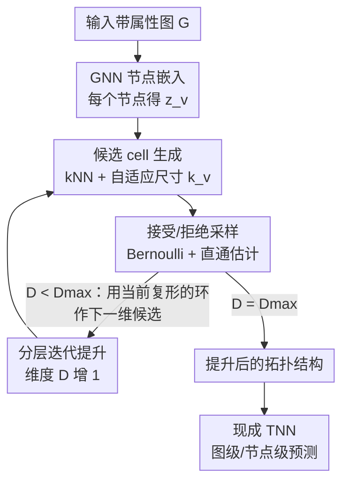

# Differentiable Lifting for Topological Neural Networks

**会议**: ICLR2026  
**OpenReview**: [https://openreview.net/forum?id=eC89CbINIw](https://openreview.net/forum?id=eC89CbINIw)  
**代码**: https://github.com/JorgeLuizFranco/difflifting  
**领域**: 图学习 / 拓扑深度学习  
**关键词**: 拓扑神经网络, 可微提升, 高阶结构, 直通估计, cell complex

## 一句话总结
提出 ∂lift（DiffLift）——一个端到端可学习的图"提升"（lifting）框架，用 GNN 节点嵌入参数化"候选高阶 cell 的分布"，再用伯努利采样 + 直通估计器决定哪些 cell 进入拓扑结构，从而把原本靠先验启发式确定的 hypergraph / simplicial / cell complex 结构变成由下游任务监督学出来，在 12 个数据集、4 种 TNN 上较静态提升最高提升约 45%。

## 研究背景与动机

**领域现状**：拓扑神经网络（Topological Neural Networks, TNN）被视为关系学习的新前沿。它把图上只能建模"成对边"的消息传递，推广到 hypergraph、simplicial complex、cell complex 等高阶结构上，让 cycle、clique 这类多节点高阶关系也能参与消息传递，从而增强表达能力。但 TNN 不能直接吃图——必须先把输入图 $G$ 通过一个**提升（lifting）**操作 $\mathrm{lift}: \mathcal{G} \to \mathcal{T}$ 转换成目标拓扑域 $\mathcal{T}$，TNN 才能在上面跑。

**现有痛点**：绝大多数提升方法是**无监督、与任务无关**的启发式规则。比如 cycle lifting 把图里 cycle basis 的每个基本环组成一个 2-cell；clique lifting 把团组成 simplex；k-hop / k-NN / kernel lifting 各有各的固定造结构方式。问题是——到底该提升到哪个域、用哪种提升规则，对下游性能影响极大且高度依赖数据。论文 Figure 1 给出反例：同一个 hypergraph 域下，k-hop 和 k-NN 在 Cora 和 Wisconsin 上的优劣完全相反；提升到 simplicial 还是 hypergraph，在不同数据集上也会出现相反结论。

**核心矛盾**：提升这一步对 TNN 性能至关重要，但它却被排除在端到端优化之外——结构是"拍脑袋"先验定好的，没有任何任务信号回流去纠正它，于是很容易得到次优的拓扑结构。此前唯一探索过可微提升的工作（DCM，Battiloro et al. 2024）只局限于 cell complex 单一域。

**本文目标**：设计一个**通用**的可微提升框架，要同时满足三点——(1) 跨域（hypergraph / simplicial / cell complex 都能用）；(2) 端到端可学（梯度能穿过"选不选某个 cell"这个离散决策）；(3) 即插即用（能接到任意现成 TNN 后面）。

**切入角度**：作者把"提升"重新理解为一个**概率采样问题**——不再用固定规则一锤定音地造结构，而是用节点嵌入去**参数化一族候选高阶 cell 上的分布**，让模型自己学着"采纳"或"拒绝"每个候选 cell。

**核心 idea**：用 GNN 嵌入参数化候选 cell 的伯努利接受概率，配合直通估计器让离散采样可导，并按维度从低到高分层迭代地生成结构——把"造拓扑结构"这件事变成可被下游任务监督的可学习模块。

## 方法详解

### 整体框架

∂lift 解决的是"如何端到端学出图的高阶提升"。给定一张带属性的输入图 $G=(V,E,x)$、目标域 $\mathcal{T}$ 和最大维度 $D_{\max}$，整体管线是：先用一个任意 GNN 算出每个节点 $v$ 的嵌入 $z_v$；再用这些嵌入按目标域的约束**生成候选高阶 cell**（每个候选 cell $C$ 的嵌入由其成员节点嵌入做置换不变聚合得到 $z_C=\bigoplus_{v\in C} z_v$）；然后用一个神经网络 $\phi$ 给每个候选 cell 算一个接受概率 $\phi(z_C)$，并从伯努利分布 $\mathrm{Ber}(\phi(z_C))$ 采样决定是否纳入；最后从被接受的 cell 拼出关系对象，丢给一个现成 TNN 做图级/节点级预测。整套结构（GNN + 采样器 + TNN）端到端联合训练。

对于 cell complex 这类**分层**域，cell 不是一次性造完的，而是按维度由低到高**迭代生成**：先学 1 维 cell（边），再用当前复形里的环作为候选去学 2 维 cell，第 $i$ 维的采样结果会反过来约束第 $i+1$ 维的候选。对于 hypergraph，因为约定超边维度为 1，迭代一轮即停。整个流程里只有"生成候选 cell"（Step 2）和"接受/拒绝"（Step 3）这两步是依赖具体目标域的，其余骨架对所有域通用。

### 关键设计

**1. GNN 节点嵌入：把"造结构"建立在可学的语义表示上**

提升要不要监督，关键在于"判断两个/多个节点该不该结成高阶 cell"的依据是什么。静态提升用的是图的原始连通性或人工特征（n-hop、cycle），这些信号固定、与任务无关。∂lift 的第一步是用一个**任意** GNN（可以是 GIN，也可以是带位置编码的 Graph Transformer GPS）算出每个节点的潜在表示 $z_v$，后续所有"该不该纳入某个 cell"的决策都建立在这组嵌入之上。这一步的意义在于：嵌入是端到端学出来的，下游任务的梯度会一路回传调整它，从而让"结构生成的依据"本身也跟着任务走。实验里换 GNN backbone 的消融（Table 2）证实了这点——表达力更强的 GPS（受益于位置编码）普遍优于 GIN，在 cell complex + ZINC 上把 MAE 从 0.46 压到 0.17，说明 cell 的质量直接受嵌入质量牵引。

**2. 候选 cell 生成：用 kNN + 自适应尺寸框定该考察哪些高阶组合**

潜在的高阶 cell 组合是指数级的（$2^V$），不可能枚举。∂lift 在嵌入空间里用 k 近邻把候选范围收窄到"语义上相近的节点群"。以 hypergraph 为例，对每个节点 $v$，取其在嵌入空间里的 $k_v$ 个最近邻组成候选超边 $C(v)=\{S\subset V: |S|=k_v,\ w\notin S\Rightarrow \mathrm{dist}(z_w,z_v)\ge \max_{u\in S}\mathrm{dist}(z_u,z_v)\}$。这里的关键巧思是 cell 的**尺寸 $k_v$ 也是学出来的、且自适应**：定义一个 $(k_{\max}-k_{\min}+1)$ 维概率向量 $\pi_v \propto \exp\circ\mathrm{MLP}(z_v)$，再采样 $k_v\sim\mathrm{Categorical}(\pi_v)$。这样不同节点可以形成不同大小的高阶 cell，而不是被一个全局固定的 $k$ 框死。对 cell complex 的 1 维情形，同样用 kNN 生成候选边；到 $D\ge 2$ 维时，候选不再是 kNN，而是当前复形 $K_{D-1}$ 的 $(D-1)$ 维环空间 $Z_{D-1}(K_{D-1})=\ker(\partial_{D-1})$ 的一组基（即 cycle basis，可用 NetworkX 的算法找基本环），把环作为候选 2-cell。

**3. 接受/拒绝采样：用伯努利 + 直通估计器让"选不选 cell"可导**

框定候选后，真正决定结构的是"每个候选要不要"。∂lift 用一个**置换不变**的神经网络 $\Psi$（接收 cell 内节点嵌入的 multiset，hypergraph 用 MLP、高维 cell 用 DeepSet）输出接受概率，然后采一个伯努利变量决定纳入与否，例如超边 $b_v\sim\mathrm{Ber}(\Psi(\{\!\{z_u:u\in C(v)\}\!\}))$，最终结构为 $V\cup E\cup\{C\in\mathcal{C}: y_C=1,\ y_C\sim\mathrm{Ber}(\phi(z_C))\}$。难点在于伯努利采样是离散的、不可导，梯度传不回 $\Psi$ 和 GNN。论文用**直通估计器（straight-through estimator, Bengio et al. 2013）**绕过：前向用采样的 0/1 硬决策，反向把梯度当作恒等直接穿过采样节点，于是整条链路端到端可训。置换不变是必须的——cell 是无序集合，接受概率不能依赖节点排列顺序。论文还给了一个确定性变体：直接用阈值 $b_C=\mathbf{1}[\Psi(\cdot)>\gamma]$（如 $\gamma=0.5$）代替采样。被接受 cell 的特征则用缩放求和投影 $x_{C(v)}=\frac{1}{k_v}\sum_{u\in C(v)} x_u$ 得到。

**4. 分层迭代提升：按维度由低到高地生成，让高阶 cell 建立在已采纳的低阶结构之上**

拓扑对象天然是分层的（simplicial / cell complex 里高维 cell 的边界必须是已存在的低维 cell），不能一股脑独立采样各维度，否则会破坏域的约束。∂lift 用一个迭代过程从 $D=1$ 开始逐维往上走：第 $D$ 维采样完得到复形 $K_D=K_{D-1}\cup\{C\in\mathcal{C}:b_C=1\}$，再把它作为第 $D+1$ 维候选生成的基础（高维候选直接来自当前复形的环空间），直到 $D=D_{\max}$ 停止。这保证了生成的结构始终满足目标域的层级/边界约束，也让低维决策能信息性地引导高维决策。实验中受限于现有 cell complex TNN 实现只支持 2 维对象（如 TopoBench），作者只取 $D_{\max}=2$；对 hypergraph 因约定维度为 1，一轮即停，候选超边的生成与接受是"尴尬并行"的，因此对 hypergraph 域计算特别高效。

### 损失函数 / 训练策略
没有额外设计的提升专用损失——整个 ∂lift（GNN 嵌入器 + cell 采样器 $\Psi$ + 下游 TNN）端到端联合优化，直接用下游任务的标准损失（分类用交叉熵 / AUC 对应目标，ZINC 回归用 MAE）。离散采样处的梯度由直通估计器提供。论文指出 cell complex 域下计算候选需要算 cycle basis，对节点数可能有立方级开销，可通过对 $k_v$ 加正则或把其分布往 0 推来减少候选数量。

## 实验关键数据

在 12 个数据集、4 种 TNN 上评测，覆盖图分类与节点分类两类任务，每个指标取 3 次独立运行的均值±标准差（ZINC 用 MAE↓，MOLHIV 用 AUC↑，其余用 accuracy↑）。

### 主实验（图分类，∂lift vs 静态提升）

| 域 | TNN | Lifting | NCI1↑ | NCI109↑ | MOLHIV↑ | MUTAG↑ | ZINC↓ |
|----|-----|---------|-------|---------|---------|--------|-------|
| Cellular | CWN | Cycle | 76.93 | 76.71 | 70.15 | 66.67 | 0.46 |
| Cellular | CWN | **∂lift** | **79.81** | **80.55** | **75.37** | **85.96** | **0.17** |
| Cellular | CXN | Cycle | 72.02 | 75.01 | 69.17 | 61.40 | 0.79 |
| Cellular | CXN | **∂lift** | **82.08** | **82.57** | **74.83** | **84.21** | **0.17** |
| Hypergraph | UniGCN2 | k-hop | 72.70 | 72.01 | 50.72 | 61.40 | 0.66 |
| Hypergraph | UniGCN2 | **∂lift** | **77.45** | **75.30** | **69.32** | **89.47** | **0.56** |

∂lift 在超过 90% 的 TNN/数据集组合上是最佳提升方法；相对静态提升平均准确率最高提升约 **45%**。MOLHIV 上 UniGCN2 从 k-hop 的 50.72 跃升到 ∂lift 的 69.32，ZINC 上 CWN 的 MAE 从 0.46 降到 0.17，提升幅度都很显著。

### 节点分类（∂lift vs DCM 可微提升基线）

| TNN | Lifting | Cora | Citeseer | Texas | Wisconsin | Avg |
|-----|---------|------|----------|-------|-----------|-----|
| DCM | - | 80.73 | 77.90 | 56.76 | 73.86 | 72.31 |
| CWN | Cycle | 74.80 | 75.83 | 63.06 | 80.39 | 73.52 |
| CWN | **∂lift** | 80.17 | 72.83 | **80.18** | 77.78 | **77.74** |
| TopoTune | **∂lift** | **86.82** | **78.23** | 72.97 | 65.36 | 75.84 |

∂lift（配 CWN 或 TopoTune）在所有数据集上都优于此前唯一的可微提升基线 DCM，尤其在 Texas、Cora 上优势很大；在异配图（Texas/Wisconsin）上对 k-hop 也有明显优势。

### 关键发现
- **GNN backbone 直接决定提升质量**：表达力强的 GPS（带位置编码）普遍优于 GIN，cell complex + ZINC 上把 MAE 从 0.46 压到 0.17——印证了"结构生成依赖嵌入质量"的设计逻辑。
- **同配/异配各有所长**：相比 k-hop，∂lift 在异配数据集上更强、在同配上略弱（UniGCN2），说明可学提升尤其擅长那些"固定连通性规则不灵"的图。
- **配 ∂lift 时 TNN 普遍超过纯 GNN**，验证了"把提升变得可学、任务相关"确实能把高阶结构的潜力释放出来。

## 亮点与洞察
- **把"提升"从启发式预处理升格为可学模块**：这是最核心的"啊哈"点——长期以来 TNN 社区默认结构是先验给定的，本文指出这恰恰是性能瓶颈，并给出端到端解法。
- **直通估计器 + 伯努利采样**是让离散结构选择可导的关键工程手段，思路可直接迁移到任何"需要可微地选/删图结构"的场景（如图结构学习、稀疏化、子图选择）。
- **自适应 cell 尺寸 $k_v\sim\mathrm{Categorical}(\pi_v)$**：让不同节点形成不同大小的高阶 cell，比全局固定 $k$ 灵活得多，是一个轻量却有效的设计。
- **通用配方 + 域特化两步**的拆分很干净：只有"候选生成"和"接受/拒绝"依赖具体域，骨架通用——这种抽象让框架天然能扩展到 simplicial、combinatorial complex 乃至未来的点云。

## 局限与展望
- **cell complex 的候选生成开销大**：需要算 cycle basis，相对节点数可能是立方级；作者建议靠正则 $k_v$ 或把其分布往 0 推来缓解，但更高效的候选识别算法仍是开放问题。
- **受现有实现限制只做到 2 维**：$D_{\max}=2$ 是因为当前 cell complex TNN 实现只支持 2 维对象，更高维的潜力未被验证。
- **理论分析缺位**：作者推测 ∂lift 能通过学出跨"桥"的 2-cell 来缓解 oversquashing（在长窄路径连接的稠密子结构间建立捷径），但只给了直觉，未做形式化证明。
- **展望**：扩展到点云（3D 建图）、动态/时序图（拓扑结构随时间演化），以及结合预训练学出可跨任务迁移的拓扑先验。

## 相关工作与启发
- **vs 静态提升（cycle / k-hop / k-NN / kernel lifting）**：它们用固定的连通性或特征规则一次性造结构、与任务无关；∂lift 把结构生成变成端到端可学、任务监督，在 90%+ 组合上更优，最高提升 45%。
- **vs DCM（Battiloro et al. 2024，可微 cell complex 模块）**：DCM 是此前唯一的可微提升，但只支持 cell complex 单域；∂lift 是迄今最通用的可学提升（hypergraph / simplicial / cell complex 通吃），并在节点分类上全面超过 DCM。
- **vs 图结构学习（GSL）**：GSL 可看作"提升到图域"的特例（只学成对边）；∂lift 把它推广到高阶 cell 的学习，实验上在多个 benchmark 超过 GSL 方法。

## 评分
- 新颖性: ⭐⭐⭐⭐⭐ 首次把跨域、通用的可微提升做成即插即用模块，重新定义了 TNN 里"提升"的角色。
- 实验充分度: ⭐⭐⭐⭐ 12 数据集 × 4 TNN，含 backbone 消融与确定性变体，覆盖图/节点分类两类任务；高维与理论分析尚缺。
- 写作质量: ⭐⭐⭐⭐ 通用配方 + 域特化两步讲得清晰，Figure 1/2/4 直观；拓扑背景门槛偏高。
- 价值: ⭐⭐⭐⭐⭐ 直击 TNN 的核心瓶颈，方法可即插即用、思路（STE 选结构）可迁移面广。

<!-- RELATED:START -->

## 相关论文

- [\[ICLR 2026\] Topological Flow Matching](topological_flow_matching.md)
- [\[ICLR 2026\] Cooperative Sheaf Neural Networks](cooperative_sheaf_neural_networks.md)
- [\[ICLR 2026\] Pairwise is Not Enough: Hypergraph Neural Networks for Multi-Agent Pathfinding](pairwise_is_not_enough_hypergraph_neural_networks_for_multi-agent_pathfinding.md)
- [\[ICLR 2026\] Canonical Tree Cover Neural Networks for Expressive and Invariant Graph Learning](canonical_tree_cover_neural_networks_for_expressive_and_invariant_graph_learning.md)
- [\[ICLR 2026\] Topological Anomaly Quantification for Semi-Supervised Graph Anomaly Detection](topological_anomaly_quantification_for_semi-supervised_graph_anomaly_detection.md)

<!-- RELATED:END -->
