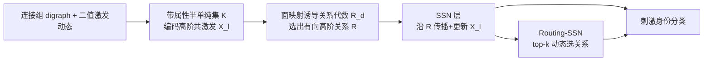

# Directed Semi-Simplicial Learning with Applications to Brain Activity Decoding

**会议**: ICLR 2026  
**OpenReview**: [https://openreview.net/forum?id=YR3CNvFfCr](https://openreview.net/forum?id=YR3CNvFfCr)  
**代码**: 开源（论文声明 open-source codebase，链接待确认）  
**领域**: 图学习 / 拓扑深度学习  
**关键词**: 拓扑深度学习, 半单纯集, 有向高阶交互, 脑活动解码, 神经拓扑学, 图神经网络  

## 一句话总结
本文提出 Semi-Simplicial Neural Networks (SSNs)——第一个直接在「半单纯集」上运行的拓扑深度学习模型，用面映射诱导的关系代数统一并超越了图、有向图与单纯复形上的各类网络，理论上严格更强表达力，并在生物真实皮层微回路的脑刺激解码任务上把第二名模型甩开最高 27%、把消息传递 GNN 甩开最高 50%。

## 研究背景与动机
**领域现状**：图神经网络（GNN）擅长建模成对交互，但很多真实系统（脑网络、化学、社交）存在多体、层次化的高阶交互。拓扑深度学习（TDL）用单纯复形 / 胞腔复形这类组合拓扑空间来编码高阶关系，已在 WL 表达力、长程依赖、异配鲁棒性上展现出比标准 GNN 更强的能力。

**现有痛点**：现有 TDL 几乎全部局限在**无向**设定，无法刻画「方向性」主导的高阶模式。这里方向性指结构上的不对称——有向边 $(0,1)$ 与 $(1,0)$ 是两条不同的边，而单纯复形把同一组顶点 $\{0,1,2\}$ 只能塞进一个单纯形，强行把有向 motif（如传递团 vs 有向环）对称化会**不可逆地丢信息**。此外 TDL 通常只通过子集包含（共享顶点 / 层次包含）来定义交互，对有向高阶传播利用不足。前作 Dir-SNN 虽迈出第一步，却只覆盖一类很窄的空间、缺理论保证、只有合成数据验证。

**核心矛盾**：脑网络恰恰是最需要「高阶 + 有向」联合建模的真实场景——神经元从突触前到突触后的信息流天然有向，而高阶有向 motif（共激发团）在多个尺度上普遍存在且携带功能意义。但既有神经拓扑学（Neurotopology）方法靠**手工预定义不变量 + 精心调过的采样启发式**做特征工程，表达力被提前写死、对扰动 / shuffle 不鲁棒。

**本文目标**：建立一个通用、形式化、端到端的 TDL 框架，既能统一表达高阶有向结构，又能直接从任意拓扑中学习脑动力学表征，替换掉手工不变量管线。

**核心 idea**：**用半单纯集（semi-simplicial set）作为底层数据结构**——它允许同一顶点集上存在多个不同单纯形，从而自然编码方向；再用**面映射诱导的关系代数**定义单纯形之间方向敏感的消息传播路径，把图 / 有向图 / 单纯复形的各类邻接全部纳为特例。

## 方法详解

### 整体框架
给定一个连接组样本（有向图 digraph）及其对刺激的二值激发响应，先把二者联合建模成一个**带属性的半单纯集** $\mathcal{K}$（捕获高阶共激发模式 $X_l$），再从 $\mathcal{K}$ 的拓扑里**选出一组面映射诱导的有向高阶关系** $\mathcal{R}$，最后用 SSN 按这些关系传播并更新特征 $X_l$ 来预测引发刺激的身份。SSN 层是一个对关系集合做聚合的通用算子，既能实例化为消息传递架构，也能实例化为 transformer 式注意力架构。

### 关键设计
**1. 半单纯集 + 面映射关系代数：把方向写进拓扑骨架。** 半单纯集由各维单纯形集合 $\{S_n\}$ 加上**面映射** $d_i: S_n \to S_{n-1}$ 构成，满足单纯恒等式 $d_i d_j = d_{j-1} d_i\ (i<j)$，因此同一顶点集 $\{0,1,2\}$ 上的 $(0,1,2)$ 与 $(0,2,1)$ 可以是两个不同三角形——这正是方向性的载体。本文的精妙之处在于把每个面映射变成一个二元关系 $R_{d_i^n}=\{(\tau,\sigma)\mid d_i^n(\sigma)=\tau\}$，并让它们在**并 $\cup$、交 $\cap$、复合 $\circ$、转置 $\top$** 下封闭，构成面映射关系代数 $\mathcal{R}_d$。诸如 $R_{n\downarrow,i,j}:=R_{d_j^n}^\top \circ R_{d_i^n}=\{(\sigma,\tau)\mid d_i^n(\sigma)=d_j^n(\tau)\}$ 这样的复合关系，把「两个单纯形的第 $i$、第 $j$ 个面重合」表达成一条可传播的有向通道，关系的链式复合自然给出跨单纯形的有向路径。标准图邻接只是其中特例：$R_{in}=R_{d_0^1}\circ R_{d_1^1}^\top$、$R_{out}=R_{d_1^1}\circ R_{d_0^1}^\top$ 恰好还原有向图的入 / 出邻接矩阵。

**2. SSN 层：以关系为单位的通用聚合算子。** 第 $l$ 层把特征更新写成
$$X_{l+1}=\phi\Big(X_l,\ \bigotimes_{R\in\mathcal{R}}\omega_R(X_l)\Big),$$
其中 $\omega_R$ 是依赖具体关系的可学习消息函数，$\bigotimes$ 跨关系聚合每个单纯形收到的多条消息，$\phi$ 是可学习更新函数。这个形式的统一力很强：当 $\omega_R$ 取 MPNN-D 时 SSN 退化为消息传递网络，取掩码自注意力时退化为 transformer；当 $\mathcal{R}=\{R_{in},R_{out}\}$、$\omega_R=$ MPNN-D、$\bigotimes=\sum$ 时，SSN 精确还原 Dir-GNN：$X_{l+1}=\sigma(A_{in}X_l W_{in}+A_{out}X_l W_{out})$。论文据此证明 SSN **subsume** 了 GNN、Dir-GNN、MPSNN、Dir-SNN（命题 1），并在 WL 层级上**严格强于** Dir-GNN 与 MPSNN（定理 1、2），同时在单纯形重索引下保持置换等变（定理 3）。

**3. Routing-SSN：用 top-k 门控解决「关系太多」的可扩展性。** 显式建模所有关系会让参数随关系数线性膨胀，且并非每条关系都有用。R-SSN 先把关系按语义分成若干类 $\mathcal{P_R}=\{\hat R_1,\dots\}$（如「跨维通信」2-单纯形→其 1-面、「同维通信」2-单纯形间的方向感知关系），再对每类用可学习门控 $G_R(X_l)\in[0,1]$ 评分，只保留每类得分最高的 top-k 条关系（其余 $G_R=0$）：
$$X_{l+1}=\phi\Big(X_l,\ \bigoplus_{\hat R\in\mathcal{P_R}}\bigotimes_{R\in\hat R}G_R(X_l)\,\omega_R(X_l)\Big).$$
配合防止路由坍缩的辅助损失，R-SSN 在大幅压缩参数（实验中仅用 SSN 的 18% 活跃参数）的同时稳居第二 / 第三名，换取更快的训练和推理。

**4. Dynamical Activity Complex (DAC)：把脑动力学嵌进可学习的拓扑。** 为脑场景设计的表征：给定动态二值有向图 $G_B$（每个顶点带 $T$ 维二值激发向量），DAC 是带属性的有向 flag 复形 $K_{G,\tilde B}$，单纯形 $\sigma$ 的属性按
$$\tilde B(\sigma)=\big[\min_{v\in\sigma}B_1(v),\dots,\min_{v\in\sigma}B_T(v)\big]\in\mathcal{B}^T$$
取，即「一个团在 $t$ 时刻激活 $\iff$ 它所有神经元在 $t$ 同时放电」，从而显式编码高阶共激发 motif。论文进一步证明（定理 4）：对神经拓扑学公认的全套不变量 $\mathcal{T}=\{$size, ec, td, dir, hodir, rc$\}$，都存在一组面映射关系 $\mathcal{R_T}$ 使某个 SSN 精确计算之，且 SSN 可恢复的不变量类**严格超过** GNN / Dir-GNN / MPSNN（见 Table 1，只有 SSN 同时打勾全部六项）。这把「神经拓扑学手工不变量」与「端到端学习」之间架起了原理性桥梁。

## 实验关键数据
评测覆盖 **4 个任务、13 个数据集**：两个神经刺激分类任务（6 数据集）、边流量回归（4 数据集）、节点分类（3 数据集）。主体聚焦脑刺激分类，基于生物真实的 NMC 体感皮层微回路（31,346 神经元、7.8M 突触、76.9M 三角形等高阶 motif），8 类丘脑输入模式分类。

### 主实验表格
8 类刺激分类准确率（%）。前三列为**固定拓扑**体积样本（Task 5.1），后三列为**变拓扑**邻域采样 $M=1/3/5$（Task 5.2）：

| Model | (4,125µm) | (4,325µm) | (8,175µm) | M=1 | M=3 | M=5 | 活跃参数% |
|---|---|---|---|---|---|---|---|
| TopoFeat+SVM | 42.14 | 35.91 | 45.32 | 27.94 | 27.87 | 28.86 | 0.3% |
| DS-256 | 25.21 | 19.52 | 25.12 | 25.24 | 24.76 | 25.87 | 68% |
| GNN-256 | 24.70 | 23.02 | 33.47 | 24.40 | 27.60 | 28.27 | 68% |
| DirGNN-256 | 50.89 | 60.02 | 63.52 | 25.43 | 35.21 | 39.41 | 133% |
| MPSNN-64 | 46.85 | 54.24 | 64.02 | 29.48 | 34.91 | 42.23 | 88% |
| **R-SSN (Ours)** | 57.32 | 79.64 | 70.66 | 28.68 | 40.29 | 48.20 | **18%** |
| **SSN (Ours)** | **75.13** | **87.16** | **78.32** | **46.73** | **61.35** | **64.72** | 100% |
| 超越第二名 | ↑24.24% | ↑27.14% | ↑14.30% | ↑17.25% | ↑26.14% | ↑22.49% | - |

SSN 在全部六列均居首，对第二名最高领先 27.14%；对纯 MPNN（GNN-256 等）的差距超过 50 个百分点。

### 消融实验表格
论文以「baseline 谱系」隐式做了关键能力消融——每个 baseline 只具备 SSN 能力的一个子集：

| 模型 | 高阶 | 有向 | 联合建模 | 代表准确率 (4,325µm) |
|---|---|---|---|---|
| GNN（成对、无向） | ✗ | ✗ | ✗ | ~23 |
| Dir-GNN（仅有向） | ✗ | ✓ | ✗ | 60.02 |
| MPSNN（仅高阶） | ✓ | ✗ | ✗ | 54.24 |
| **SSN（高阶 + 有向联合）** | ✓ | ✓ | ✓ | **87.16** |

结论清晰：单独建模方向（Dir-GNN）或单独建模层次（MPSNN）都不够，**只有把高阶与有向联合建模才能拿满分**，与定理 1/2/4 的表达力分析互相印证。

### 关键发现
- **强归纳偏置 = 样本效率**：在最难的 $M=1$（每个动态只有 1 个神经元邻域、极端数据稀缺）下，SSN 仍至少领先所有 baseline 17%，说明高阶有向先验在小样本下尤其值钱。
- **参数更省**：SSN 用与 baseline 相当甚至更少的参数取得 SOTA；R-SSN 仅用 18% 活跃参数就稳居第二 / 三名，训练推理更快。
- **手工不变量天花板被打破**：TopoFeat+SVM 优于普通 GNN/DS，证明高阶有向连通性确实重要；但其被预定义不变量与手工采样卡住，端到端学习能挖出更丰富的表征。

## 亮点与洞察
- **数据结构选得准**：把「半单纯集」引入深度学习，用「同一顶点集可有多个单纯形」这一最小改动一举解开方向性，比硬塞进单纯复形再对称化优雅得多。
- **关系代数的统一力**：面映射 + 并 / 交 / 复合 / 转置构成的关系代数，让图入 / 出邻接、单纯邻接、有向高阶通道都成了同一框架下的可组合积木，理论上 subsume 一大票既有模型，工程上又能即插即用 MPNN / attention。
- **理论与实验闭环**：WL 表达力（定理 1/2）、不变量可恢复性（定理 4）与脑分类的实际增益一一对应，是少见的「证明了更强、且真的更强」。
- **真实科学案例**：脑刺激解码不是 toy task，而是给 TDL 提供了一个有生物意义、可公开复现的硬 benchmark，回应了 Papamarkou 等人列出的多个 TDL 开放问题。

## 局限与展望
- **可扩展性仍是核心张力**：完整 SSN 关系众多导致参数 / 计算膨胀，虽用 R-SSN 的 top-k 路由缓解，但路由质量、辅助损失调参、防坍缩仍是工程负担；超大连接组上的扩展性需进一步验证。
- **实验维度受限**：主体只用到维度 $\le 2$（三角形）的单纯形、$T=2$ 个时间 bin，更高维 motif 与更细时间分辨率的收益尚未充分探索。
- **领域偏窄**：方法虽通用，但最亮眼的增益集中在脑动力学这一特定真实场景；边回归 / 节点分类只是「competitive」，跨域普适性还需更多证据。
- **代码 / 数据可得性**：依赖 NMC 生物微回路这类专门数据，普通研究者复现门槛较高。

## 相关工作与启发
- **TDL 谱系**：MPSNN（Bodnar 2021）、cell complex 网络、Dir-SNN（Lecha 2025）是直接前作，本文以「半单纯集 + 关系代数」把它们统一并严格扩展。
- **有向图学习**：Dir-GNN（Rossi 2024）被证明为 SSN 在 1 维上的特例，启发是「方向性应被提升到任意阶」。
- **神经拓扑学**：Reimann 2017 / Conceição 2022 的手工不变量管线提供了任务与不变量定义，本文把它们从「特征工程」升级为「可学习且可证明可恢复」。
- **启发**：当某个领域的关键先验被写成「手工不变量 + 采样启发式」时，往往存在一个**更底层的数据结构 + 可组合算子**能把这些不变量纳为可学习特例——这是从 TDL 推广到其他科学领域（化学、物理、生物网络）的可迁移思路。

## 评分
- 新颖性: ⭐⭐⭐⭐⭐ 首个半单纯集上的 TDL 模型，关系代数视角统一并严格扩展既有图 / 有向 / 单纯网络，理论原创性高。
- 实验充分度: ⭐⭐⭐⭐ 4 任务 13 数据集、生物真实微回路、参数对齐的强 baseline 谱系与表达力消融充分；但主增益集中在脑场景、维度 / 时间分辨率受限。
- 写作质量: ⭐⭐⭐⭐ 动机—理论—框架—实验逻辑严密，图 1/2/3/4 与定理对应清晰；半单纯集与关系代数部分对非拓扑背景读者门槛偏高。
- 价值: ⭐⭐⭐⭐⭐ 既给 TDL 补上「有向高阶」这块关键拼图，又为神经拓扑学提供端到端、可证明的学习框架，理论与应用双重价值显著。

<!-- RELATED:START -->

## 相关论文

- [\[ICLR 2026\] Exchangeability of GNN Representations with Applications to Graph Retrieval](exchangeability_of_gnn_representations_with_applications_to_graph_retrieval.md)
- [\[ICLR 2026\] Forest-Based Graph Learning for Semi-Supervised Node Classification](forest-based_graph_learning_for_semi-supervised_node_classification.md)
- [\[ICLR 2026\] Topological Anomaly Quantification for Semi-Supervised Graph Anomaly Detection](topological_anomaly_quantification_for_semi-supervised_graph_anomaly_detection.md)
- [\[NeurIPS 2025\] Spatio-Temporal Directed Graph Learning for Account Takeover Fraud Detection](../../NeurIPS2025/graph_learning/spatio-temporal_directed_graph_learning_for_account_takeover_fraud_detection.md)
- [\[AAAI 2026\] S-DAG: A Subject-Based Directed Acyclic Graph for Multi-Agent Heterogeneous Reasoning](../../AAAI2026/graph_learning/s-dag_a_subject-based_directed_acyclic_graph_for_multi-agent.md)

<!-- RELATED:END -->
