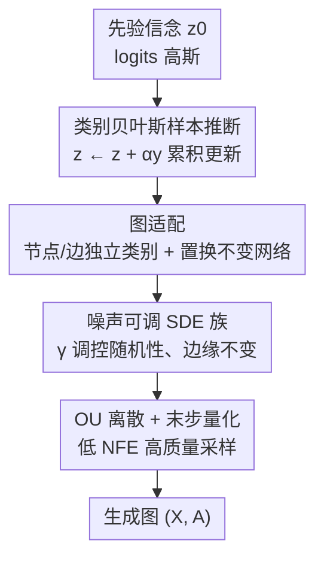

# Discrete Bayesian Sample Inference for Graph Generation

**会议**: ICLR2026  
**OpenReview**: [https://openreview.net/forum?id=py2NPbAdvH](https://openreview.net/forum?id=py2NPbAdvH)  
**代码**: 待确认  
**领域**: 图生成 / 生成模型  
**关键词**: 图生成, 贝叶斯样本推断, 离散扩散, 随机微分方程, 分子生成

## 一句话总结
本文提出 GraphBSI，把贝叶斯样本推断（BSI）从连续数据推广到离散类别数据，让模型在「概率单纯形上的分布参数空间」里迭代精化对图的信念而非直接演化离散图，并把这一过程写成一族可调噪声 $\gamma$ 的 SDE，在 Moses、GuacaMol 分子生成基准上以一次性（one-shot）方式取得 SOTA。

## 研究背景与动机
**领域现状**：图（分子、知识图谱、社交网络）是离散、无序的结构化数据，传统为连续数据（如图像）设计的生成模型不好直接套用。近年主流是把图离散化后用离散扩散（DiGress、DisCo、Cometh）或流匹配（DeFoG）来生成，另一条线是贝叶斯流网络（BFN）：它不在样本上加噪去噪，而是在「样本分布的参数」上演化——即便底层样本是离散的，分布参数也能连续平滑地变化，因此天然适配离散数据，代表工作 GraphBFN 在分子生成上很有竞争力。

**现有痛点**：BFN 虽然好用，但它的推导建立在信息论视角之上，整套框架（参数空间、信息累积、对贝叶斯更新取极限近似）门槛高、不直观，难以理解和改造。另一方面，离散扩散把图状态直接当作要去噪的对象，离散状态的跳变让采样轨迹不够平滑，在低函数调用预算下质量受限。

**核心矛盾**：要既保留「在连续参数空间上演化、平滑处理离散结构」这个好处，又要有一个简单、可解释、能自由调控采样随机性的框架。BFN 在「可解释性」和「可控性」上都欠缺。

**本文目标**：(1) 把贝叶斯样本推断（BSI，原本只针对连续数据）推广到类别数据，给离散生成一个比 BFN 更简洁的解释；(2) 把它形式化成 SDE，从而能引入一个可调噪声的采样器族；(3) 在此基础上做出一个高质量的一次性图生成模型。

**切入角度**：BSI 把「生成」看成一连串贝叶斯更新——从一个宽泛的先验信念出发，不断对未知样本做带噪测量并把信息融进信念，直到信念足够尖锐就采样。作者发现：只要把 BSI 里的连续高斯信念换成「单纯形上的类别信念（logits 上的高斯）」，整套贝叶斯更新依然成立，而且比 BFN 少了一层信息论包装。

**核心 idea**：在「类别分布参数（logits）」的连续空间里做贝叶斯样本推断，用一个神经网络反复重构未知图、再用带噪测量更新信念；并把这个迭代写成 SDE，引入噪声系数 $\gamma$ 得到一族「边缘分布相同、随机性可调」的采样器。

## 方法详解

### 整体框架
GraphBSI 不直接对图本身去噪，而是维护一个「对要生成的图的信念」，这个信念是定义在节点/边类别 logits $z$ 上的高斯，对应一个类别分布 $\mathrm{Cat}(\mathrm{softmax}(z))$。生成时从先验 $z_0\sim\mathcal N(\mu_0,\beta_0 I)$ 出发，循环执行三步：① 用网络 $f_\theta(z_t,t)$ 根据当前信念重构出对图的估计 $\hat x$；② 围绕 $\hat x$ 采一个带精度 $\alpha$ 的噪声测量 $y\sim\mathcal N(\hat x,\alpha^{-1}I)$；③ 用贝叶斯定理把测量融进信念 $z\leftarrow z+\alpha y$。随着时间从 $t=0$ 到 $t=1$，信念越来越尖锐，最后从 $\mathrm{Cat}(\mathrm{softmax}(z_1))$ 采样（或直接量化重构结果）得到图。

把步数 $k\to\infty$ 取极限，这个离散更新收敛成一个 SDE（Theorem 3）：$dz_t=\beta'(t)f_\theta(z_t,t)\,dt+\sqrt{\beta'(t)}\,dW_t$。在此基础上作者推出一族保持边缘分布不变、只改随机性强弱的广义 SDE（噪声系数 $\gamma$），并设计了两套数值离散方案（Euler-Maruyama 与 Ornstein-Uhlenbeck）外加末步量化技巧来高效采样。整条流程如下：

### 关键设计

**1. 类别贝叶斯样本推断：把 logits 当信念，用贝叶斯更新代替直接去噪**

原始 BSI 只处理连续数据，把信念建成各向同性高斯。本文要解决的痛点是：离散图没法直接套连续高斯信念。作者的做法是把样本放到概率单纯形上 $x\in\Delta^n_{c-1}$，信念写成 $p(x\mid z)=\mathrm{Cat}(x\mid\mathrm{softmax}(z))$，其中 $z\in\mathbb R^{n\times c}$ 是类别 logits。关键结果是 Theorem 1：给定带精度 $\alpha$ 的高斯测量 $y\sim\mathcal N(x,\alpha^{-1}I)$，后验信念仍是同族类别分布，且 logits 更新极其简洁——

$$z_{\text{post}}=z+\alpha y.$$

也就是说，logits 空间里的贝叶斯更新就是「按精度加权累加测量」。这点和连续 BSI 有本质区别：连续情形是把新信念与旧状态做插值，而类别情形是各分量直接累积。多步测量叠加后 $z_k=z_0+\sum_i\alpha_i y_i$，配上单调递增的精度调度 $\beta(t)$（令 $\alpha_i=\beta(t_{i+1})-\beta(t_i)$）就控制了到时刻 $t$ 注入信念的总信息量。这样做的好处是绕开了 BFN 里对贝叶斯更新取极限的近似，给离散生成一个更干净的概率解释，并且能直接推出 ELBO 训练目标（Theorem 2），其简化形式就是一个加权重构损失 $\mathbb E[\beta'(t)/2\cdot\lVert f_\theta(z,t)-x\rVert_2^2]$——训练只需让网络从带噪信念里重构出真样本。

**2. 图适配：节点与边各自独立类别，配置换不变网络生成变长图**

有了类别 BSI，还要把它落到图上。图被表示为 $(X,A)$，$X\in\Delta^N_{c_X-1}$ 是节点类别（原子类型）的 one-hot，$A\in\Delta^{N\times N}_{c_A-1}$ 是边类别（键类型）的 one-hot，并特意把「边不存在」当作边的第一个类别。作者把每个节点、每条边都当作类别信念的一个独立分量，于是上面的类别 BSI 框架可以逐分量地直接套用；节点和边之间的依赖关系不在信念里建模，而是交给重构网络 $f_\theta$ 去捕捉。为保证生成分布对节点编号顺序无关，$f_\theta$ 选用置换不变的图 Transformer（沿用 DiGress/DeFoG 的架构，输入含类别概率、熵、随机游走特征、时间步正弦嵌入），在各向同性噪声下整个生成模型即为置换不变。对于变长图，先从数据集的节点数边缘分布里采一个节点数 $N$，再对节点/边生成，实现上通过对多余节点和边做掩码完成。这套表示让同一个离散框架既能生成分子图，也能（如附录所示）生成 DNA 序列等一般离散数据。

**3. 噪声可调 SDE 族：一个 $\gamma$ 在确定性 ODE 与高随机采样器之间连续滑动，且边缘分布不变**

离散多步更新在 $\Delta t\to0$ 极限下收敛为 SDE $dz_t=\beta'(t)f_\theta dt+\sqrt{\beta'(t)}dW_t$（Theorem 3）。但固定的随机性未必最优，作者借鉴 Karras et al. (2022) 的思路，推出一族保持边缘密度 $p_t(z_t)$ 不变、只用 $\gamma$ 调随机性的广义 SDE（Theorem 4）：

$$dz_t=\beta'(t)f_\theta(z_t,t)\,dt+\frac{\gamma-1}{2}\beta'(t)\nabla_{z_t}\log p_t(z_t)\,dt+\sqrt{\gamma\beta'(t)}\,dW_t.$$

$\gamma=0$ 退化成确定性的概率流 ODE；$\gamma=1$ 恢复原始 SDE；$\gamma$ 越大轨迹越随机，极限 $\gamma\to\infty$ 时每步都用最新预测覆盖当前状态。理论上所有 $\gamma$ 边缘分布相同，但实践中分数项 $\nabla_{z_t}\log p_t(z_t)$ 没有闭式解只能近似，高随机性能纠正前几步的错误却需要更细的离散。关键是这个分数函数不用额外训练：Theorem 5 证明 BSI 损失本身就是一个分数匹配损失，分数模型可直接由重构网络给出 $s_\theta(z,t)=\big(\mu_0+\beta(t)f_\theta(z,t)-z\big)/\big(\beta(t)+\beta_0\big)$。和 BFN 不同，CatBSI 是从先验信念 $p(z\mid t=0)$ 采样而非固定先验，天然避开了 $t=0$ 处的不连续。

**4. OU 离散 + 末步量化：低函数调用预算下也能高质量采样**

SDE 没有闭式解，需数值采样。简单的 Euler-Maruyama（EM）在足够细的时间网格上表现不错，但在高 $\gamma$、少步数下会不稳定。作者改为在每个小区间内冻结重构 $\hat x=f_\theta(z_t,t)$，使广义 SDE 在该区间退化为 Ornstein-Uhlenbeck 过程从而可解析求解（Theorem 6），得到带精确边缘的更新 $z_{t+\Delta t}\sim m+(z_t-m)e^{-\kappa\Delta t}+\sqrt{\tfrac{\gamma\beta'}{2\kappa}(1-e^{-2\kappa\Delta t})}\,\mathcal N(0,I)$，其中 $\kappa=\tfrac{(\gamma-1)\beta'}{2(\beta_0+\beta)}$。当 $\Delta t\to0$ 时 OU 收敛回 EM。另一个提效技巧是「量化代替采样」：当 $t=1$ 附近信念已足够尖锐时，最后一步直接采样会引入多余噪声，但此时信念里的信息已够网络做近乎完美的重构，于是提前在较低精度停下、把重构结果投影（量化）回样本空间即可。再加上非均匀时间网格参数 $\rho$（$t_i=(i/k)^\rho$）把函数调用更密集地放在更需要的时间段，整套方案让 GraphBSI 在仅 50 次函数评估下就有竞争力，500 次时进一步刷新 SOTA。

### 损失函数 / 训练策略
训练目标是类别 BSI 的 ELBO（Theorem 2）。$k\to\infty$ 时其可优化部分化简为加权重构损失（Eq. 5）：$\mathcal L=\mathbb E_{x,t,z}\big[\beta'(t)/2\cdot\lVert f_\theta(z,t)-x\rVert_2^2\big]$，对应 Algorithm 2——采样本 $x$、采先验 $z_0$、采时刻 $t$、按精度做一次带噪测量得到信念 $z$、让网络从 $z$ 重构 $x$ 并做 MSE。当 $\beta_0\to0$（先验在 $t=0$ 退化为 Dirac）时，该损失与连续时间类别 BFN 损失只差一个常数。实践上采用指数精度调度、对节点/边用数据集边缘分布加小方差（1.0）的高斯先验，并用预条件让网络预测信念与真值之差：$f_\theta(z,t)=\mathrm{softmax}\big(z+\tilde f_\theta(z,t)\big)$。

## 实验关键数据

### 主实验
在 GuacaMol 和 Moses 两个分子生成基准上，对比扩散/流匹配 SOTA（DiGress、DisCo、Cometh、DeFoG、GraphBFN），报告 EM 与 OU 两种离散、50 与 500 步两种预算。

| 数据集 | 配置 | 关键指标 | GraphBSI | 之前最好 |
|--------|------|----------|----------|----------|
| GuacaMol | OU, 500 步 | Validity ↑ | 99.6 | 99.0 (DeFoG) |
| GuacaMol | EM, 500 步 | FCD ↑ | 82.6 | 73.8 (DeFoG) |
| Moses | EM, 500 步 | FCD ↓ | **0.72** | 1.07 (GraphBFN) |
| Moses/Guaca | OU, 50 步 | Validity ↑ | 99.7 / 99.2 | 83.9 / 91.7 (DeFoG) |

仅 50 步时，GraphBSI（两种离散）在除 Moses novelty 外的所有指标上都超过 DeFoG；500 步时 OU 离散在 GuacaMol 上全指标超过所有现有模型并把 validity 打满，EM 离散把 Moses 的 FCD 从 1.07 压到 0.72。

### 合成图基准
在 planar / tree / SBM 合成图上（Table 2，每次生成 40 图、重复 5 次）：

| 配置 | 数据集 | V.U. ↑ | 说明 |
|------|--------|--------|------|
| GraphBSI (OU) 1000 | Planar | 100.0 | validity 打满 |
| GraphBSI (EM) 1000 | Tree | 96.5 | Ratio 1.3，分布相似度最好之一 |
| GraphBSI (OU) 1000 | SBM | 77.5 | SBM 较难，validity 适中 |

作者指出合成集仅 128 张图、评测方差大，mean ratio 需谨慎解读。

### 消融实验

| 配置 | 现象 | 结论 |
|------|------|------|
| $\gamma=0$（概率流 ODE） | 所有指标都很差 | 纯确定性采样不行，噪声不可或缺 |
| $\gamma$ 中等(20~100) | FCD 最优 | FCD 偏好中等随机性 |
| $\gamma$ 增大 | SNN、Filters 提升但 novelty 下降 | 高噪声让样本更贴近训练分布 |
| EM vs OU（高 $\gamma$） | EM 在 $\gamma\Delta t$ 过大时失稳 | OU 在各预算/噪声下都稳，普遍持平或优于 EM |
| 非均匀网格 $\rho<1$ | FCD 在 50 步下改善 | 后段时刻细化离散更划算 |

### 关键发现
- **噪声调控是性能主驱动**：Fig. 8 显示优化 $\gamma$ 是性能增益的关键来源；$\gamma=0$ 时全面崩坏，说明把 BSI 写成可调噪声 SDE 这一步是涨点核心。
- **OU 离散在低预算下尤为关键**：局部线性化让少步数采样仍稳定高质，是 50 步即 SOTA 的工程基础。
- **指标间存在权衡**：高随机性同时提升相似度类指标、压低 novelty——生成越像训练集，新颖性越低。

## 亮点与洞察
- **统一视角**：把贝叶斯样本推断推广到类别数据后，理论分析直接打通了 BFN 与扩散模型的联系——logits 上的累积贝叶斯更新、SDE、分数匹配损失三者在一个框架里自洽，比信息论包装的 BFN 更易懂。
- **一个网络两用**：Theorem 5 证明 BSI 重构损失本身就是分数匹配损失，于是分数函数无需额外训练即可从重构网络读出，省掉一套分数网络。
- **可迁移技巧**：「边缘不变、$\gamma$ 调随机性」的 SDE 族（借鉴 Karras）+「末步量化代替采样」是通用采样加速思路，可迁移到其他离散/连续生成器，尤其在低 NFE 场景。
- **离散即类别**：把「边不存在」编码成边的一个类别、节点/边各自独立类别，是处理图离散结构干净利落的表示，让同一框架顺手覆盖 DNA 序列等一般离散数据。

## 局限与展望
- 节点和边在信念层被建成相互独立的类别，所有结构依赖都压给重构网络 $f_\theta$ 承担，复杂高阶依赖是否被充分建模存疑。
- 分数项 $\nabla_{z_t}\log p_t(z_t)$ 只能近似，导致理论上「所有 $\gamma$ 边缘相同」在实践中不成立，必须靠网格搜索 $\gamma$/步数/$\rho$ 才能拿到最优，调参成本不低。
- 合成图（仅 128 图）评测方差大、SBM 上 validity 仅 77.5，说明在结构更复杂的非分子图上仍有差距。
- novelty 与相似度/有效性的权衡未被根治：高噪声涨 FCD/SNN 却掉 novelty，如何同时拿到高质量与高新颖性仍是开放问题。

## 相关工作与启发
- **vs 贝叶斯流网络（GraphBFN）**：BFN 在信息论视角下操作分布参数、对贝叶斯更新取极限近似，门槛高；本文用 BSI 视角把生成看成一串贝叶斯更新，避开极限近似、给出更简洁解释，并从先验信念采样而非固定先验，避开 $t=0$ 不连续。Moses FCD 从 1.07（GraphBFN）降到 0.72。
- **vs 离散扩散（DiGress / DisCo / Cometh）**：它们在离散图状态上去噪；本文在连续 logits 空间演化信念、离散性自然由 softmax 处理，采样轨迹更平滑，低步数下质量更高。
- **vs 流匹配（DeFoG）**：DeFoG 是当前一次性图生成强基线；GraphBSI 在 50 步即在多数指标上超过它，500 步进一步全面领先，差异主要来自可调噪声 SDE 与 OU 离散。
- **vs 概率流 ODE（Xue et al. 2024）**：$\gamma=0$ 即退化为该确定性方案，但实验表明纯 ODE 表现最差，凸显本文「引入并调控随机性」相对纯确定性采样的价值。

## 评分
- 新颖性: ⭐⭐⭐⭐⭐ 把 BSI 推广到类别数据并统一 BFN/扩散/分数匹配，框架层面有真贡献。
- 实验充分度: ⭐⭐⭐⭐ 分子基准 SOTA 充分，合成图与噪声/网格消融到位；非分子复杂图覆盖偏弱。
- 写作质量: ⭐⭐⭐⭐ 理论推导（6 个定理）清晰、图示直观，但符号密度较高。
- 价值: ⭐⭐⭐⭐ 给离散图生成一个更可解释、可控的框架，采样加速技巧有通用迁移价值。

<!-- RELATED:START -->

## 相关论文

- [\[ICLR 2026\] CORDS - Continuous Representations of Discrete Structures](cords_-_continuous_representations_of_discrete_structures.md)
- [\[ICLR 2026\] Dynamic Multi-sample Mixup with Gradient Exploration for Open-set Graph Anomaly Detection](dynamic_multi-sample_mixup_with_gradient_exploration_for_open-set_graph_anomaly_.md)
- [\[ICLR 2026\] Bures-Wasserstein Flow Matching for Graph Generation](bures-wasserstein_flow_matching_for_graph_generation.md)
- [\[ICLR 2026\] Global and Local Topology-Aware Graph Generation via Dual Conditioning Diffusion](global_and_local_topology-aware_graph_generation_via_dual_conditioning_diffusion.md)
- [\[ICLR 2026\] Actions Speak Louder than Prompts: A Large-Scale Study of LLMs for Graph Inference](actions_speak_louder_than_prompts_a_large-scale_study_of_llms_for_graph_inferenc.md)

<!-- RELATED:END -->
