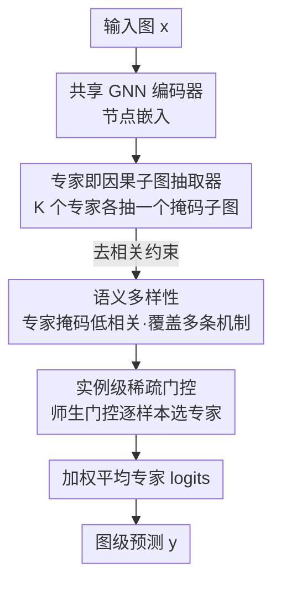

# Diverse and Sparse Mixture-of-Experts for Causal Subgraph–Based Out-of-Distribution Graph Learning

**会议**: ICLR2026  
**OpenReview**: [https://openreview.net/forum?id=4XVczusV2K](https://openreview.net/forum?id=4XVczusV2K)  
**代码**: 待确认  
**领域**: 图学习 / 分布外泛化 / 因果子图 / 专家混合  
**关键词**: 图 OOD 泛化, 因果子图, Mixture-of-Experts, 语义多样性, 稀疏门控

## 一句话总结
DiSCO 把图分布外（OOD）泛化里"找因果子图"的任务交给一组专家（MoE），每个专家抽出一个不同的候选因果子图，再用一个学到的稀疏门控为每个样本挑出最对路的那个专家；它不需要环境标签、也不假设虚假子图与标签独立，在 GOOD 基准上拿到平均第一。

## 研究背景与动机

**领域现状**：图 OOD 泛化的主流范式是"因果子图识别"——假设每张图 $x$ 里有一个决定标签 $y$ 的因果子图 $G_c$，剩下的部分 $G_s$ 是随环境漂移的虚假结构（图大小、稀疏度、motif 频率等）。只要能把 $G_c$ 抠出来，预测就该对分布漂移免疫。代表方法有 GSAT、CIGA、DIR、LECI、UIL 等。

**现有痛点**：这条路有两个老毛病。第一，几乎所有方法都压在一个**限制性因果假设**上，最常见的是 $G_s \perp y$（虚假子图与标签独立）或 $G_c$ 跨环境/跨类别不变。但现实里这经常不成立：分子属性预测中骨架（scaffold）常和活性相关，情感分析里词长这种风格标记常和情感同步变化，于是 $G_s$ 和 $y$ 直接挂钩，假设一破，方法就脆。第二是**实例级异质性**：哪怕同一个环境、同一个标签类内部，不同样本可能依赖**完全不同**的因果子图——比如同样"有活性"的两个分子可能来自完全不同的 chemotype。假定全数据集共享一个不变 $G_c$ 的方法没法刻画这种多样性。

**核心矛盾**：要处理实例级异质性，已有思路要么靠**数据增强**去近似（扰动图结构造样本），但扰动不能保证标签语义不变、甚至会破坏真正的因果子图（在 GOOD-Motif 这种标签直接等于某个 motif 的数据集上尤其致命）；要么靠**更强的因果假设**去约束，但假设本身在真实数据上站不住。一边怕改坏标签，一边怕假设失效，这是当前方法绕不开的两难。

**本文目标**：在**不依赖环境标签、不强加 SCM 层面假设**的前提下，直接在实例层面建模"因果多样性"，让模型能为每个样本用上它自己那条因果机制。

**切入角度**：作者把"一个数据集里存在多条并行因果机制"这件事，直接映射到 Mixture-of-Experts 结构——既然样本之间因果子图不同，那就让多个专家各抽一个**不一样**的候选因果子图（覆盖），再用一个门控为每个输入**稀疏地**选中最对的那个（选择）。关键洞察是：覆盖靠专家**多样**保证，选择靠门控**稀疏**保证，两者一起才能压低 OOD 误差，而且作者用一个风险界把这件事证明了出来。

**核心 idea**：用"多样的专家各抽一个因果子图 + 稀疏门控逐样本选专家"替代"单个不变因果子图 + 强因果假设"，把实例级因果异质性显式建模出来。

## 方法详解

### 整体框架
DiSCO（Diversity- and Sparsity-driven Causal OOD）的输入是一张图 $x=(V,E,X)$，输出是图级标签预测。整条管线是一个**共享抽取器 + 多专家 + 稀疏门控**的结构：先用一个**共享 GNN 编码器**算出节点嵌入；然后 $K$ 个专家各自用一个轻量 MLP 给每条边打一个"保留/丢弃"的掩码，得到 $K$ 个**不同的候选因果子图** $x^{(i)}$，每个子图过一个专家专属的 GNN + 分类头给出 logits $z_i$；最后一个**门控网络**读取各专家的统计量（置信度、熵等），输出一个稀疏权重向量 $\pi(x)\in\Delta_K$，把专家 logits 加权平均成最终预测。整个模型端到端训练，loss 由任务、正则、多样性、门控四项组成。

理论上作者先把 OOD 风险拆成"覆盖项 + 选择项"两块，再分别用多样性和稀疏性去压；实现上则用一个**去相关正则**逼专家分头、用一个**师生门控**逼门控选对。

### 关键设计

**1. 专家即因果子图抽取器：把"一条不变机制"拆成"K 条并行机制"**

针对"单个不变 $G_c$ 抓不住实例级异质性"这个痛点，DiSCO 不再让一个模型抠一个因果子图，而是让 $K$ 个专家各抠一个。具体地，所有专家**共享**一个 GNN 编码器算节点嵌入；对专家 $i$，一个小 MLP 吃进每条边两端点的拼接嵌入、输出边掩码 logit $\ell^{(i)}_e$，再经 **Gumbel–sigmoid 直通估计**把它变成可微的二值选择，得到掩码图 $x^{(i)}$，过专家专属 GNN + 分类头给出 $z_i(x^{(i)})$。这样每个专家就是一条独立的"抽子图→分类"通路，天然能并行覆盖多条因果假设。值得一提的是计算开销：因为抽取器共享、只复制轻量输出头，总复杂度近似 $O(K\,f(G))$（$f$ 为 GNN 前向开销，远大于 MLP），相比"为每个专家堆一整个 GNN"的做法省得多。

**2. 语义多样性（覆盖）：逼专家看不同的子图，否则门控无从选起**

如果专家们都抠同一个子图，门控就没得选、模型直接塌缩。作者因此显式约束**语义多样性**：把专家 $i$ 在图 $x$ 上的掩码概率向量 $v^{(x)}_i$ 标准化成 $\tilde v^{(x)}_i$，定义两专家掩码的相关系数 $\rho^{(x)}_{ij}=\frac{1}{|I_x|}\langle \tilde v^{(x)}_i, \tilde v^{(x)}_j\rangle$，要求平均相关低于阈值 $\tau_{\text{corr}}$。落到 loss 上就是一个去相关正则：

$$\ell_{\text{div}} = \frac{1}{K(K-1)}\sum_{i\neq j}\max\{0,\ |\rho^{(x)}_{ij}| - \tau_{\text{corr}}\}.$$

只惩罚超过阈值的那部分相关。低掩码相关意味着专家关注图的不同部位、编码不同的结构信号，从而**覆盖**多条潜在因果机制——保证"至少有一个专家对得上某个未见环境"这件事有可能发生。这是整套理论里"coverage 项"对应的实现。

**3. 实例级稀疏门控（选择）：让门控把质量集中到对的那个专家**

光有覆盖不够——就算某个专家抓对了机制，若门控把权重摊得很平，混合预测还是被带歪。作者用"loss gap"刻画这件事：对样本 $(x,y)$，设最优专家为 $i^\star$，loss gap $\Delta(x,y)=\min_{j\neq i^\star}(\ell_j - \ell_{i^\star})\ge 0$。命题指出，要让混合 loss 贴近最优专家，门控必须给它足够权重：

$$\pi_{i^\star}(x) \ge 1 - \frac{\bar\ell(x,y) - \ell_{i^\star}(x,y)}{\Delta(x,y)}.$$

也就是 **gap 越大、越逼门控稀疏**。而 gap 恰恰是多样性带来的——专家分头看去相关子图，正确专家就会以一个 margin 胜出（作者把它写成 Assumption 3.4，并在实验里验证：开多样性后 SST2 的平均 loss gap 从 0.07 涨到 0.22）。门控用**师生目标**训练：教师分布 $q$ 由"对各专家负交叉熵做归一化"给出（loss 低的专家权重高），学生是门控输出 $p=\pi(x)$，再加稀疏与均衡两个正则：

$$\ell_{\text{gate}} = \mathrm{KL}(p\,\|\,q) + \lambda_{\text{sparse}}\,\ell_{\text{sparse}}(p) + \lambda_{\text{bal}}\,\ell_{\text{bal}}(p).$$

$\ell_{\text{sparse}}$ 惩罚高熵分布（逼实例级稀疏），$\ell_{\text{bal}}$ 鼓励一个 batch 内专家被均匀使用（防某些专家"饿死"、保住全局覆盖）。两者互补：稀疏管单样本的尖锐路由，均衡管全局的使用面。

**4. 无辅助不变性损失的"轻假设"设计：不绑定任何一种 SCM**

很多前作（LECI 的对抗判别器、UIL 的结构对齐）靠**辅助不变性目标**来学因果子图，但这些目标既贵（每个专家都复制一份对抗训练很不稳）、又**默认了某个 SCM 假设**（如 $G_s\perp y$、$G_c$ 不变），真实异质数据上经常不成立。DiSCO 干脆**完全不用**这类辅助 loss——它不强加任何 SCM 层面的约束，而是让门控逐实例选专家来获得对多种因果机制的鲁棒性。代价上它随专家数 $K$ 优雅扩展，且既不要环境标签、也不要强因果假设。这一点在 CFP-Motif 上得到印证：在 covariate / FIIF / PIIF 三种不同因果假设下它都拿第一，正是因为没把自己绑死在某一种 SCM 上。

### 损失函数 / 训练策略
总目标把四项加权：

$$L = \ell_{\text{CE}} + \lambda_{\text{reg}}\ell_{\text{reg}} + \lambda_{\text{div}}\ell_{\text{div}} + \lambda_{\text{gate}}\ell_{\text{gate}}.$$

其中任务损失是门控加权的交叉熵 $\ell_{\text{CE}}=\sum_i \pi_i(x)\,\ell_i(x,y)$——贡献大的专家拿更强梯度，被弃用的专家被压制，促成专精；正则损失 $\ell^{(i)}_{\text{reg}}=(\rho^{(x)}_i-\rho)^2$ 把每个专家的边保留率拉向目标 $\rho$，避免抠太多/太少边的退化解。训练先有一段**均匀路由的 warm-up**让所有专家拿到足够信号，再进入专精阶段；门控可在专家训好后再微调以贴合各自专精。骨干统一用 GIN（GOOD 默认），默认 8 个专家。

## 实验关键数据

### 主实验
在 GOOD 基准的 6 个结构漂移数据集（HIV-Scaffold/Size 分子、Motif-Basis/Size 合成、Twitter-Length 社交、SST2-Length 情感）上，DiSCO 平均分与平均排名都第一：

| 指标 | DiSCO | LECI（次优） | GALA |
|------|-------|------------|------|
| 平均分 ↑ | **75.29** | 73.48 | 72.31 |
| 平均排名 ↓ | **1.50** | 2.67 | 2.67 |
| Motif-Basis ↑ | **92.80** | 85.74 | 79.11 |
| Twitter-Length ↑ | **66.98** | 65.76 | 64.89 |
| SST2-Length ↑ | **83.73** | 83.27 | 82.42 |
| HIV-Scaffold ↑ | 71.55 | 74.28 | 74.51 |

Motif-Basis 是因果子图方法的"试金石"（标签直接由某个 motif 决定），DiSCO 拿到 92.8% 接近 oracle 水平、比次优相对提升 8.2%。唯一失手是 HIV-Scaffold（多数类占比 >95% 的极端类不平衡），排第四。

跨因果假设的 CFP-Motif 上（值越小越好的负向指标排版，实为更优），三种假设全胜：

| 假设 | DiSCO | LECI |
|------|-------|------|
| Covariate | **90.83** | 83.20 |
| FIIF | **84.17** | 77.73 |
| PIIF | **77.19** | 69.40 |

### 消融实验
逐项去掉 loss（GOOD 基准节选）：

| 配置 | Motif-Basis | HIV-Scaffold | SST2-Length | 说明 |
|------|-------------|--------------|-------------|------|
| 完整 loss | 92.80 | 71.55 | 83.73 | 全部组件 |
| 去 $\ell_{\text{div}}$ | 91.13 | 65.95 | 82.20 | 去多样性，HIV-Scaffold 掉 ~5.6 |
| 去 $\ell_{\text{gate}}$ | 89.60 | 68.56 | 81.97 | 去门控，Motif 掉 ~3.2 |
| 去 $\ell_{\text{reg}}$ | 67.48 | 68.55 | 83.46 | 去保留率正则，Motif 暴跌 ~25 |

### 关键发现
- **保留率正则 $\ell_{\text{reg}}$ 在 Motif-Basis 上最致命**：去掉它 Motif-Basis 从 92.8 暴跌到 67.48，说明在"标签=特定 motif"的数据上，控制抽出子图的大小（不让专家抠整图或空图）是抓对因果子图的前提。
- **多样性真的会撑大 loss gap**：开 $\ell_{\text{div}}$ 后平均 per-batch loss gap，Twitter 0.13→0.19（+46%）、SST2 0.07→0.22（+200%）、Motif-Basis 0.076→0.12（+58%），实证了"多样性诱发 gap、gap 逼出稀疏"的理论链条。
- **不绑 SCM 假设让它在跨假设场景特别稳**：CFP-Motif 三种假设全胜，作者归因于没用辅助不变性损失、不把自己锁死在某种因果图上。

## 亮点与洞察
- **把"实例级因果异质性"翻译成 MoE 结构**：这是最漂亮的一步——既然不同样本依赖不同因果子图，那就别强求一个不变子图，而让多个专家各抠一个、门控逐样本选。这个映射既自然又可证。
- **覆盖↔多样、选择↔稀疏的风险分解**：把 OOD 风险拆成 oracle 风险 + 覆盖项（多样性控）+ 选择惩罚（稀疏性控），并证明"多样性诱发 loss gap、loss gap 逼出稀疏门控"，给"为什么要同时要多样和稀疏"提供了一个干净的理论解释，而不是堆 trick。
- **共享抽取器 + 轻量专家头的省算设计**：复杂度近似 $O(K\,f(G))$ 而非 $K$ 个完整 GNN，这个"专家只复制 MLP 头、GNN 抽取器共享"的工程取舍可迁移到其它 MoE-on-graph 场景。
- **去相关正则当多样性约束**：用掩码相关系数 $\rho^{(x)}_{ij}$ 直接惩罚专家看同一块子图，比靠对抗/互信息逼多样要简单稳定，是个可复用的小 trick。

## 局限与展望
- **极端类不平衡下退化**：HIV-Scaffold（多数类 >95%）上只排第四，说明 MoE + 子图抽取在严重不平衡分类上未必占优，门控可能被多数类带偏。
- **超参不少**：$\tau_{\text{corr}}$、保留率先验 $\rho$、$\lambda_{\text{div}}/\lambda_{\text{gate}}/\lambda_{\text{reg}}/\lambda_{\text{sparse}}/\lambda_{\text{bal}}$ 一堆权重，外加 warm-up 与门控微调两段式训练，调参与训练流程偏重；论文做了 $\rho$ 的敏感性分析但权重组合的鲁棒性交代有限。
- **专家数 $K=8$ 是默认值**：覆盖能力和 $K$ 直接相关，$K$ 太小可能覆盖不了真实机制数、太大则线性增开销，如何按数据集自适应选 $K$ 没展开。
- **只验证 covariate shift**：理论与实验都聚焦 $P(y|x)$ 稳定、$P(x)$ 漂移的协变量漂移，概念漂移（标签机制本身变）未涉及。

## 相关工作与启发
- **vs LECI / UIL（因果子图 + 辅助不变性损失）**：它们用对抗判别器或结构对齐学单个不变 $G_c$，依赖 $G_s\perp y$ 或 $G_c$ 不变等 SCM 假设；DiSCO 用多专家抽多子图、完全不用辅助不变性损失也不绑 SCM，因此在 CFP-Motif 跨假设上反超 LECI 7~8 个点。
- **vs GraphMETRO（OOD 向的 MoE）**：GraphMETRO 给每个专家**预先指派一种漂移类型**、当作增强策略训练，继承了"增强可能改坏标签"的风险；DiSCO 把专家当因果子图抽取器、让它们自发分头捕捉不同因果假设，不预设漂移类型。
- **vs GALA / AIA（数据增强类）**：增强类靠扰动图结构近似异质性，无法保证标签正确、在 motif 中心数据集上尤其危险；DiSCO 直接在实例层面建模因果多样性，不靠造样本。

## 评分
- 新颖性: ⭐⭐⭐⭐⭐ 把实例级因果异质性映射到 MoE，并用覆盖/选择风险分解把"多样+稀疏"证成必要条件，视角新且自洽。
- 实验充分度: ⭐⭐⭐⭐ GOOD + CFP-Motif 覆盖合成/真实与三种因果假设，消融与 loss-gap 验证到位；但仅 covariate shift、$K$ 与权重鲁棒性交代偏少。
- 写作质量: ⭐⭐⭐⭐ 理论—实现—实验对应清晰，RQ 驱动；个别符号偏密。
- 价值: ⭐⭐⭐⭐ 给图 OOD 提供了"轻假设、可扩展、逐样本选机制"的实用范式，去相关多样性与共享抽取器设计可迁移。

<!-- RELATED:START -->

## 相关论文

- [\[ICLR 2026\] Adaptive Mixture of Disentangled Experts for Dynamic Graph Out-of-Distribution Generalization](adaptive_mixture_of_disentangled_experts_for_dynamic_graph_out-of-distribution_g.md)
- [\[ICLR 2026\] Out-of-Distribution Graph Models Merging](out-of-distribution_graph_models_merging.md)
- [\[CVPR 2026\] Mixture-of-Experts based Feature Decoupling for Open Vocabulary Scene Graph Generation](../../CVPR2026/graph_learning/mixture-of-experts_based_feature_decoupling_for_open_vocabulary_scene_graph_gene.md)
- [\[NeurIPS 2025\] MoEMeta: Mixture-of-Experts Meta Learning for Few-Shot Relational Learning](../../NeurIPS2025/graph_learning/moemeta_mixture-of-experts_meta_learning_for_few-shot_relational_learning.md)
- [\[ICLR 2026\] Canonical Tree Cover Neural Networks for Expressive and Invariant Graph Learning](canonical_tree_cover_neural_networks_for_expressive_and_invariant_graph_learning.md)

<!-- RELATED:END -->
