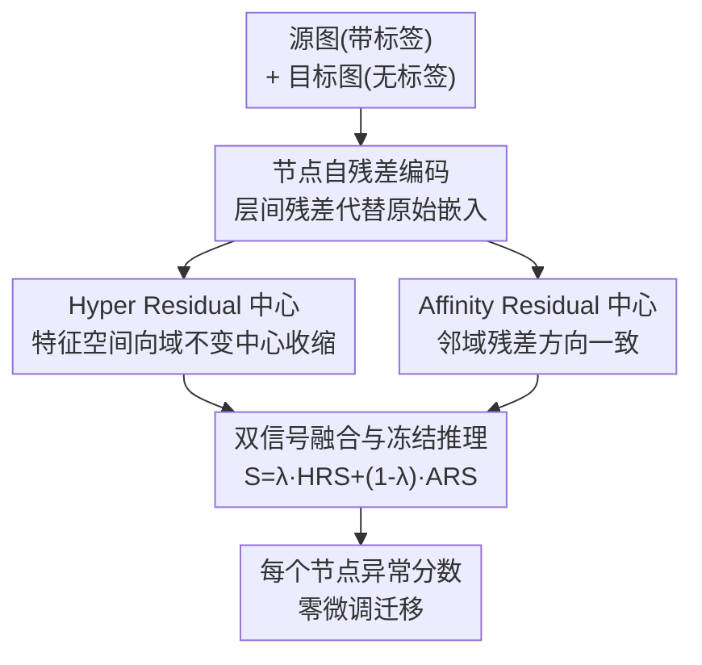

# DR-GGAD: Dual Residual Centering for Mitigating Anomaly Non‑Discriminativity in Generalist Graph Anomaly Detection

**会议**: ICLR2026  
**OpenReview**: [https://openreview.net/forum?id=kCuCHNChLE](https://openreview.net/forum?id=kCuCHNChLE)  
**代码**: 待确认  
**领域**: 图学习 / 图异常检测 / 跨域泛化  
**关键词**: 通用图异常检测, 异常不可分性, 残差中心, 零样本迁移, 图神经网络

## 一句话总结
针对"训练好的图异常检测器迁移到新图后，正常/异常节点表示纠缠在一起"这个老大难问题，本文先提出一个可量化的指标 AnD（异常不可分性）把它说清楚，再用"不直接比较节点、而是让每个节点和两个域不变残差中心比"的双残差中心化（Hyper Residual + Affinity Residual）来缓解它，参数冻结、零目标域微调，在 8 个目标图上平均 AUROC 比之前最好的通用方法高 5.14%。

## 研究背景与动机
**领域现状**：图异常检测（GAD）的目标是在一张图里揪出少数属性或连边异常的节点（如欺诈账号、虚假评论、入侵主机）。传统做法是"一图一训练"——在单张引文网络/社交平台/电商图上调好参数、刷高同分布精度。但每来一张新图就得重新标注、重新调参、重新算，监控大量演化网络的安全团队很快就被重训成本压垮。

**现有痛点**：于是出现了通用图异常检测（GGAD），想训一个检测器、不微调就迁移到没见过的图。ARC、UNPrompt、AnomalyGFM 等近期工作在零样本/少样本设定下确实有进步，但它们都有一个共同软肋：**在表示空间里直接拿正常节点和异常节点互相比较**。一旦跨域，特征统计量、度分布、同质性比例都变了，原本在源图上学到的"正常 vs 异常"间隔就会塌掉。

**核心矛盾**：作者把这个塌掉的现象正式命名并量化为 **异常不可分性（Anomaly non-Discriminativity, AnD）**——正常与异常节点的潜在表示有多重叠。论文给了一个例子：GCN 在 YelpChi 上训练时 AnD 已经 0.41（部分纠缠），迁到 Amazon 后 AnD 升到 0.52、AUC 从 0.58 跌到 0.46。AnD 越高，决策边界越糊，越多欺诈节点漏检。问题的根在于"直接的节点对节点比较在域偏移下本就脆弱"。

**本文目标**：在不允许更新参数（无目标域适配预算）的前提下，把这种跨域表示纠缠压下去，恢复正常/异常的可分性，同时给出一个能复现、能跨数据集比较的可分性度量。

**切入角度**：与其拿异常节点和正常节点互比（脆弱），不如让两类节点都去和"残差中心"比——看它们各自偏离参考中心多远。多层图卷积的层间残差是已知能跨图迁移的信号，可以充当域不变的参考。

**核心 idea**：把"正常↔异常"的互比，换成"节点↔域不变残差中心"的自比；并在特征空间（Hyper Residual 中心）和结构空间（Affinity Residual 中心）各放一个中心，双管齐下把 AnD 压低。

## 方法详解

### 整体框架
DR-GGAD 是一个"先编码残差、再双中心打分、冻结迁移"的零微调检测器。输入是若干张带标签的源图和一张无标签目标图，输出是目标图每个节点的异常分数。整条管线分三步：先把每个节点的原始特征经共享图编码器变成**层间自残差**表示（捕捉跨感受野的变化、能跨图迁移）；再用两条互补的残差模块各自打分——**Hyper Residual (HR)** 在特征空间把正常残差向一组域不变中心收缩、把异常推到边界外，**Affinity Residual (AR)** 在结构空间强制邻域内残差方向一致、把藏在拓扑里的异常逼出来；最后把两路分数线性融合成统一异常分。源图训练完成后所有参数冻结，目标图推理时不做任何微调。AnD 指标贯穿始终：它既是诊断瓶颈的度量，也是两个模块共同优化的目标——HR 压缩类内距离 $d^{(+)}+d^{(-)}$，AR 拉大类间距离 $d^{(+-)}$，由 $\text{AnD}^*=d^{(+)}+d^{(-)}-d^{(+-)}$ 可知二者联手把 AnD 拉低。

### 关键设计

**1. AnD 指标：把"异常不可分性"量化成可优化的瓶颈**

以往大家都知道"跨域后表示会纠缠"，但没人把它变成一个能算、能比、能优化的数。本文先定义一个未归一化分数：用正常节点两两平均欧氏距离 $d^{(+)}$、异常节点两两平均距离 $d^{(-)}$、以及正常-异常跨类平均距离 $d^{(+-)}$，组合成

$$\text{AnD}^*(G) = d^{(+)} + d^{(-)} - d^{(+-)}.$$

直觉是：类内越紧（$d^{(+)},d^{(-)}$ 小）、类间越远（$d^{(+-)}$ 大），$\text{AnD}^*$ 越小，越可分。为跨数据集比较，再在一个评测图集合 $S$ 上线性归一化到 $[0,1]$。论文还给了两条最小性质背书：命题 1 保证归一化后落在 $[0,1]$ 且两端可校准；引理 2（Lipschitz 打分间隔）证明对任意 $L$-Lipschitz 打分函数，正常/异常分数的期望差被 $L\,d^{(+-)}$ 上界约束——这就解释了"为什么拉大 $d^{(+-)}$ 能放宽可分性天花板"，给后面 AR 模块提供理论支点。这个指标的价值在于：它把一个模糊的"迁移后变差"转成了明确的优化方向。

**2. 节点自残差编码：用自比代替脆弱的节点互比**

这一步直接针对"直接节点互比在域偏移下崩盘"的痛点。先用线性/随机投影把不同图的异构输入维度统一到 $d_u$，再让对齐特征过 $\ell$ 层共享参数的轻量图卷积 $\tilde{X}^{[t]}=D^{-\frac12}AD^{-\frac12}\tilde{X}^{[t-1]}$，逐层投影得 $H^{[t]}$。关键在于取**层间差**而非某层输出本身：

$$r_i^{[t]} = h_i^{[t]} - h_i^{[1]},\quad r_i = r_i^{[2]}\,\|\,r_i^{[3]}\,\|\cdots\|\,r_i^{[\ell]}.$$

把各层残差拼接成 $r_i$。残差刻画的是"一个节点随着感受野扩大时的反应差异"，天然捕捉高频信号和局部异质性，而这种"变化模式"被证明比绝对嵌入更能跨图迁移。换句话说，DR-GGAD 不再问"这个节点像不像别的异常节点"（跨域不可靠），而是问"这个节点自身的多尺度残差长什么样"（跨域稳定），这是全篇缓解 AnD 的立足点。

**3. Hyper Residual 中心：在特征空间把正常残差收缩到域不变中心**

针对跨域特征统计漂移导致的特征空间纠缠。做法是在所有源图上对正常残差做 k-means，聚成 $\tau$ 个中心，迭代更新 $\bar{r}_i^{(t+1)}=\sigma\big(\frac{W_i}{|C_i^{(t)}|}\sum_{r_j^+}r_j^{+}\big)$，形成全局 HR 中心集合 $\bar{R}=\{\bar{r}_1,\dots,\bar{r}_\tau\}$。训练时用一个 margin 损失把正常残差拉近中心、把异常残差推过边界 $\epsilon$：

$$L_{HR}=\sum_{i}^{N^+}\sum_{k}^{\tau}\|r_i^+-\bar{r}_k\|^2 + \sum_{i}^{N^-}\sum_{k}^{\tau}\max\!\big(0,\,\epsilon-\|r_i^--\bar{r}_k\|^2\big).$$

因为中心是从"正常节点典型模式"里聚出来的、跨域共享，正常节点不管在哪张图都该贴近它，异常则被挤到边界外。这一项直接压缩 $d^{(+)}+d^{(-)}$，从而降低 $\text{AnD}^*$，对应消融里高 AnD 数据集（Amazon、CiteSeer）上的大幅提升。

**4. Affinity Residual 中心：在结构空间强制邻域残差方向一致**

HR 管的是全局特征对齐，但局部拓扑仍可能错位——有些异常主要藏在结构里而非属性里。AR 用残差方向的邻域余弦一致性来逼出这类异常，定义亲和分数与一致性损失：

$$L_{AR}=\sum_{i}^{N}\big(1-\text{AR}(i)\big),\quad \text{AR}(i)=\frac{1}{|N_i|}\sum_{j\in N_i}\frac{r_i\cdot r_j}{\|r_i\|\|r_j\|}.$$

最小化 $L_{AR}$ 让结构规整的邻居在残差空间方向对齐，而结构异常/语义不一致的节点会偏离邻域方向。它不依赖重建监督就能捕捉局部结构特征，拉大类间距离 $d^{(+-)}$，按引理 2 放宽了打分可分性的上界——这解释了消融中强拓扑漂移数据集（Cora、Facebook）上 AR 比 HR 提升更大。HR 与 AR 一个收类内、一个拓类间，恰好作用在 $\text{AnD}^*$ 公式的两端，互补。

**5. 双信号融合与冻结推理：无目标域微调的统一打分**

源图训练后参数全部冻结，目标图推理时算两路分数再融合。HR 分 $\text{HRS}(i)=\frac{1}{\tau}\sum_k\|r_i-\bar{r}_k\|^2$ 衡量特征级偏离；AR 分 $\text{ARS}(i)=\frac{1}{|N_i|}\sum_{j\in N_i}\big(1-\frac{r_i\cdot r_j}{\|r_i\|\|r_j\|}+\|r_i-r_j\|^2\big)$ 衡量结构级偏离。最终统一分

$$S(i)=\lambda\,\text{HRS}(i)+(1-\lambda)\,\text{ARS}(i),\quad \lambda\in[0,1],$$

并用一个最大化"正常/异常预测分离度"的阈值 $\gamma^*$ 二值化。整个推理不更新任何参数，正好满足 GGAD 的零适配约束——这也是它能直接搬到 8 张异构目标图上的原因。

### 损失函数 / 训练策略
联合目标极简：$L = L_{HR} + L_{AR}$（HR 的 margin 损失 + AR 的方向一致性损失），无额外权重超参。关键设置：学习率 $10^{-5}$、权重衰减 $5\times10^{-5}$、dropout 0.2、统一特征维 $d_u=64$、残差维 $d=1024$、GCN 层数 $\ell=3$、分离 margin $\epsilon=1$、训练 60 epoch。源图为 {PubMed, Flickr, Questions, YelpChi}，训练完冻结迁移。

## 实验关键数据

### 主实验
跨域协议沿用 ARC：4 张源图训练，8 张目标图（Cora、CiteSeer、ACM、BlogCatalog、Facebook、Weibo、Reddit、Amazon）零微调测试，对比 16 个强基线，5 个种子的 AUROC 均值±std。

| 数据集 | 本文 DR-GGAD | 之前最好 | 提升 (∆) |
|--------|-------------|---------|---------|
| Facebook | 82.16 | 69.57 (GCTAM) | +12.59 |
| ACM | 91.17 | 81.21 (GCTAM) | +9.96 |
| Amazon | 88.15 | 80.67 (ARC) | +7.48 |
| Cora | 93.20 | 87.45 (ARC) | +5.75 |
| CiteSeer | 95.00 | 90.95 (ARC) | +4.05 |
| Weibo | 93.31 | 88.85 (ARC) | +0.43 |
| Reddit | 60.60 | 60.04 (ARC) | +0.56 |
| BlogCatalog | 75.06 | 74.76 (ARC) | +0.30 |

DR-GGAD 在全部 8 个目标图上都拿到最高 AUROC，平均排名 1.0；最大提升恰好落在 AnD 最高的数据集（Facebook、ACM、Amazon），印证"AnD 是真瓶颈、压它就涨点"。每个数据集 std 都低于 2.5%，鲁棒性强。论文报告平均 AUROC 比之前最好的 GGAD 高 5.14%，AUPRC 也同步大涨（Amazon +17.12%、CiteSeer +17.77%）。

### 消融实验

| 配置 | Amazon | CiteSeer | Cora | Facebook | ACM | 说明 |
|------|--------|----------|------|----------|-----|------|
| Backbone | 68.57 | 53.87 | 47.43 | 49.42 | 53.02 | 仅共享 GCN + 残差提取 |
| +HR | 88.04 | 90.66 | 84.77 | 65.30 | 74.39 | 加 Hyper Residual 中心 |
| +AR | 61.79 | 94.03 | 92.66 | 82.01 | 90.85 | 加 Affinity Residual 中心 |
| Full | 88.15 | 95.00 | 93.20 | 82.16 | 91.17 | 完整 DR-GGAD |

### 关键发现
- **HR 治特征漂移**：在属性统计与源图差异最大的 Amazon、CiteSeer 上，加 HR 分别涨 +19.47、+36.79 点——它把类内残差向域不变中心收缩，压低 $d^{(+)}+d^{(-)}$。
- **AR 治拓扑漂移**：拓扑漂移最强的 Cora、Facebook 上，用 AR 替 HR 提升更大（+45.23、+32.59 点）——局部残差对齐拉大 $d^{(+-)}$，放宽 Lipschitz 可分性上界。
- **二者互补**：完整模型显著超过任一单模块（Amazon 比 +AR 高 26.36，ACM 比 +HR 高 16.78），因为它同时作用在 $\text{AnD}^*$ 两端。融合权重 $\lambda$ 变化下结论稳定，5 种子 std < 3%。

## 亮点与洞察
- **把模糊问题量化成可优化目标**：AnD 指标把"迁移后变差"这种说不清的现象，变成一个有定义、有归一化、有理论性质（命题 1 / 引理 2）的数，并直接对应到方法两个模块各压公式的一端——指标和方法是咬合的，不是事后贴的故事。
- **"自比代替互比"是可迁移的思路**：跨域时"和别人比"不可靠、"和自己的稳定参考比"更稳，这个 reframing 不只适用于图，凡是分布漂移下的异常/OOD 检测都能借鉴用层间/时序自残差当域不变参考。
- **双中心分工干净**：HR 管特征空间全局收缩、AR 管结构空间局部对齐，正好对应异常的两种藏身处（属性 vs 拓扑），消融里"哪个数据集漂移哪类、哪个模块就更管用"的对应关系很漂亮。
- **零微调 + 极简损失**：$L=L_{HR}+L_{AR}$ 无权重超参、推理不更新参数，工程上"训一次到处用"，对监控大量演化图的场景很实用。

## 局限与展望
- **依赖评测集合 $S$ 做归一化**：AnD 的归一化分数随选定的 $S$ 漂移，命题 1 在 $M=m$ 时退化为恒 0，跨论文直接比 AnD 数值需谨慎。
- **HR 中心数 $\tau$ 与 k-means 质量**：中心靠源图正常残差聚类得到，若源图正常模式本身多样性不足或聚类不稳，域不变性会打折；论文未深入分析 $\tau$ 敏感性。
- **Reddit/BlogCatalog 提升微弱**：在低 AnD、本就好分的数据集上提升只有零点几个点，说明方法主要红利来自高纠缠场景，对已可分的图边际收益有限。
- **仍是节点级、单一异常注入协议**：评测沿用 ARC 的合成+自然异常混合协议，对图级异常、动态图、对抗性异常的泛化未验证；可改进方向包括把双残差中心化扩展到时序图或边级异常。

## 相关工作与启发
- **vs ARC**：ARC 也用多跳残差编码器提取可迁移信号，但它仍在做节点对节点的直接比较，残差重叠高时间隔丢失；DR-GGAD 把比较对象换成域不变残差中心，并显式量化/优化 AnD，故在高 AnD 数据集上大幅反超（Amazon +7.48、Facebook +12.59）。
- **vs UNPrompt / AnomalyGFM**：前者用统一邻域 prompt 做零样本、后者预训正常/异常原型做原型匹配，都属"跨域但不显式处理表示重叠"；本文是第一个把 AnD 量化并在特征+结构双空间联合缓解的工作（论文 Table 1 自评的关键差异）。
- **vs Deep SVDD / Deep SAD**：经典单域方法把正常表示压进一个超球，本质也是"向中心收缩"，但只在单图、面对域偏移就失效；DR-GGAD 的 HR 中心是跨源图聚类得到的域不变多中心，并叠加 AR 的结构一致性，把"超球思想"搬到了跨域设定。
- **vs TAM / GHRN 等边截断/高频方法**：它们假设训练-测试分布相似、靠剪异质边或追高频信号提升同域精度，跨域即退化；本文用残差自比绕开了对分布相似的假设。

## 评分
- 新颖性: ⭐⭐⭐⭐⭐ 把"跨域表示纠缠"正式量化为 AnD 并配理论性质，再用双残差中心化对症下药，问题定义与方法咬合度高。
- 实验充分度: ⭐⭐⭐⭐ 8 目标图、16 基线、AUROC+AUPRC、消融与 $\lambda$ 分析齐全；但未覆盖图级/动态/对抗异常。
- 写作质量: ⭐⭐⭐⭐⭐ 从现象到指标到方法到理论一条线讲透，图 1/表 1 的对照很清晰。
- 价值: ⭐⭐⭐⭐ 零微调跨域检测对监控大量演化图的实际场景很有用，思路可迁移到更广的 OOD/异常检测。

<!-- RELATED:START -->

## 相关论文

- [\[ICML 2026\] ProMoS: Generalist Graph Anomaly Detection via Prototype-Based Distillation](../../ICML2026/graph_learning/generalist_graph_anomaly_detection_via_prototype-based_distillation.md)
- [\[ICLR 2026\] Topological Anomaly Quantification for Semi-Supervised Graph Anomaly Detection](topological_anomaly_quantification_for_semi-supervised_graph_anomaly_detection.md)
- [\[ICML 2026\] Rethinking Feature Alignment in Generalist Graph Anomaly Detection: A Relational Fingerprint-based Approach](../../ICML2026/graph_learning/rethinking_feature_alignment_in_generalist_graph_anomaly_detection_a_relational_.md)
- [\[ICLR 2026\] Dynamic Multi-sample Mixup with Gradient Exploration for Open-set Graph Anomaly Detection](dynamic_multi-sample_mixup_with_gradient_exploration_for_open-set_graph_anomaly_.md)
- [\[ICML 2026\] Learnable Kernel Density Estimation for Graphs and Its Application to Graph-Level Anomaly Detection](../../ICML2026/graph_learning/learnable_kernel_density_estimation_for_graphs_and_its_application_to_graph-leve.md)

<!-- RELATED:END -->
