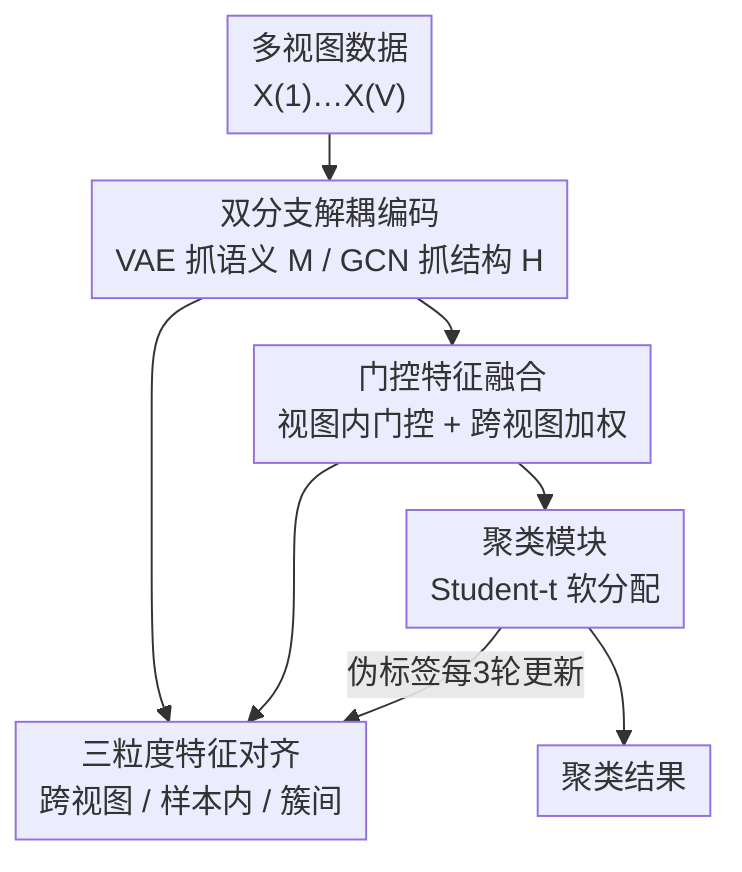

# Dual-Branch Representations with Dynamic Gated Fusion and Triple-Granularity Alignment for Deep Multi-View Clustering

**会议**: ICLR2026  
**OpenReview**: [https://openreview.net/forum?id=yfVwaL15uo](https://openreview.net/forum?id=yfVwaL15uo)  
**代码**: 待确认  
**领域**: 图学习 / 多视图聚类 / 表示学习  
**关键词**: 多视图聚类, 双分支解耦, 门控融合, 三粒度对齐, GCN

## 一句话总结
DREAM 把多视图聚类里被长期"偏科"对待的语义信息和结构信息，分别用 VAE 分支和 GCN 分支显式解耦成两路平行表示，再用门控融合自适应地按数据集调配两者权重，最后用"跨视图 / 样本内 / 簇间"三粒度对齐拉齐异构嵌入空间，在六个基准上全面超越八个 SOTA。

## 研究背景与动机
**领域现状**：多视图聚类（multi-view clustering, MVC）想利用同一批样本在多个视图下的互补信息把样本无监督地分成 $K$ 个簇。深度 MVC 普遍承认两类信息都重要——**语义信息**（样本本身的内在特征）和**结构信息**（样本之间的关系），并发展出三类范式：自编码器系（重建每个视图抓语义）、图神经网络系（用图拓扑融合邻居生成结构感知表示）、对比学习系（跨视图最大化互信息保证一致性）。

**现有痛点**：尽管嘴上都说两类信息都重要，绝大多数方法实际上**偏科**——把一种当主角、另一种当配角。比如有的以构造、利用一致性图为主、语义嵌入只是输入；有的以语义重建为主、结构信息只当引导。结果是语义和结构没有被**对等地、联合地**建模。

**核心矛盾**：作者点出两层被忽视的事实。其一，两类信号的**可靠性是随数据集变化的**——某个数据集结构图更干净、另一个数据集语义特征更判别，固定让谁当主角必然在一部分数据集上吃亏，泛化差。其二，就算解耦出来了，**融合本身也是难题**：不同视图、不同类型的特征信息量参差不齐，有的视图被冗余或噪声主导，简单拼接会引入冲突。此外，已有工作往往只在一到两个粒度上对齐（跨视图一致性、或簇内紧凑），忽略了同时在多个粒度对齐，给语义—结构一致性的保持留下隐患。

**本文目标**：把 MVC 拆成三个子问题——(1) 如何把语义和结构**显式解耦**成两路平行表示；(2) 如何**自适应地融合**它们、抑制冗余噪声；(3) 如何在多个粒度上**对齐**异构嵌入空间。

**切入角度**：与其押注某一类信息当主角，不如让语义和结构成为**平等的两路并行信源**，把"谁更可靠"这件事交给一个由数据驱动的门控来动态决定。

**核心 idea**：用 VAE 抓语义、用 GCN 抓结构，做成解耦双分支；再用门控融合自适应配权、用三粒度对齐拉齐异构空间——把"偏科"换成"动态平衡"。

## 方法详解

### 整体框架
DREAM 要解决的是"语义与结构如何对等建模并融合到聚类友好的表示里"。整体流程分四步串起来：多视图数据 $X=\{X^{(1)},\dots,X^{(V)}\}$ 先经过**双分支编码**——语义分支用 VAE 编码器为每个视图产出语义特征 $M^{(v)}$（潜分布均值），结构分支用 GCN 编码器产出结构感知特征 $H^{(v)}$；接着**门控融合**对每个样本 $i$ 先在视图内把 $\mu_i^{(v)}$ 与 $h_i^{(v)}$ 用学习到的门控融合成 $g_i^{(v)}$，再用从结构特征导出的跨视图权重把各视图聚合成最终融合表示 $l_i$；然后**聚类模块**用 Student-t 核把 $l_i$ 软分配到 $K$ 个簇；同时**特征对齐模块**在跨视图、样本内、簇间三个粒度上施加约束，保证三路表示彼此一致且判别性强。整个网络端到端联合优化。

### 关键设计

**1. 双分支解耦编码：让语义和结构各走各的路，不再互为配角**

针对"偏科"痛点，DREAM 不再让一类信息当输入、另一类当引导，而是开两条**专门**的编码支路并行抽取。语义分支对每个视图用 VAE 编码器 $M^{(v)}, S^{(v)} = f_{\text{Encoder}}^{(v)}(X^{(v)})$ 产出潜分布的均值 $M^{(v)}$ 和对数方差 $S^{(v)}$，取均值 $M^{(v)}$ 当语义表示，并用重建损失 $L_{\text{recon}}=\sum_v \frac{1}{N}\|\hat X^{(v)}-X^{(v)}\|_2^2$ 加 KL 散度约束潜空间贴近标准正态，保证语义编码既充分又规整。结构分支先对每个视图按 top-$k$ 相似建图得到邻接矩阵 $A^{(v)}$，再用 GCN 做对称归一化传播 $H^{(v)}=D^{(v)-\frac12}A^{(v)}D^{(v)-\frac12}X^{(v)}$ 把图结构显式注入特征，并用图重建损失 $L_{\text{Structure}}=\sum_v\frac{1}{N^2}\|\hat A^{(v)}-A^{(v)}\|_2^2$（$\hat A^{(v)}=\sigma(H^{(v)}H^{(v)\top)}$）保证嵌入保留原始连通性。这样两路输出 $M^{(v)}$ 和 $H^{(v)}$ 是真正解耦、互补的两类信号，为后面的动态平衡打底——消融里去掉结构分支在 UCI 上 ACC 直接掉 20%，说明结构关系不是配角而是地基。

**2. 门控特征融合：把"谁更可靠"交给数据驱动的门，而不是固定拼接**

解耦之后，简单拼接会因为异构分布和冗余/噪声主导而引入冲突。门控融合分三小步动态配权。**视图内门控**先在每个视图内把语义和结构嵌入用一个可学习门融合：

$$g_i^{(v)} = \mu_i^{(v)} \odot \sigma\!\left(W_{\text{Gate}}^{(v)}[\mu_i^{(v)} \| h_i^{(v)}]\right) + h_i^{(v)} \odot \left(1 - \sigma(W_{\text{Gate}}^{(v)}[\mu_i^{(v)} \| h_i^{(v)}])\right)$$

门值由两者拼接后过 sigmoid 算出，从而在视图内部自适应地分配语义和结构的比重。**跨视图加权**再把结构嵌入 $h_i^{(v)}$ 用一个 ReLU MLP 映射成标量权重 $\alpha_i^{(v)}=f_{\text{Wt.}}^{(v)}(h_i^{(v)})$——这里用结构特征当裁判是有讲究的：$h_i^{(v)}$ 编码了样本在该视图下与邻居的连接强度，所以能反映这个视图的结构一致性是否可靠。**跨视图加权融合**最后用 softmax 归一化的 $\hat\alpha_i^{(v)}$ 把各视图的门控嵌入加权求和成 $l_i=\sum_v \hat\alpha_i^{(v)} g_i^{(v)}$，让结构更清晰的视图贡献更大。消融里把门控换成简单平均，效果显著掉到比单分支强不了多少，印证了"自适应配权"才是融合互补信息的关键。

**3. 三粒度特征对齐：在三个尺度同时拉齐异构嵌入空间**

只融合还不够——解耦和融合后的语义、结构表示在不同分支、不同视图间仍可能不一致，融合嵌入也可能丢判别性。DREAM 在三个粒度同时对齐。**跨视图对齐**用蒸馏损失把各视图的语义、结构嵌入分别拉向共识目标 $M^*$、$A^*$（$L_{\text{distill}}^{\text{Semantics}}=\sum_v\frac1N\|M^{(v)}-M^*\|_2^2$，结构侧同理），逼各视图捕获一致信息。**样本内对齐**用一个三元 InfoNCE 损失 $L_{\text{intra}}$，让融合嵌入 $l_i$ 在分子里同时贴近它自己的语义对应 $\mu_i^{(v)}$ 和结构对应 $h_i^{(v)}$、在分母里远离其他样本的对应嵌入，从而保住每个样本的关键语义与结构信息又维持全局判别性。**簇间对齐**用 triplet 损失 $L_{\text{inter}}=\frac1R\sum \max(0,\|l_a-l_p\|_2-\|l_a-l_n\|_2+m)$，靠吸引正样本（同伪标签）、排斥负样本（异伪标签）来同时压紧簇内、拉开簇间；其中伪标签由聚类模块的 $\arg\max_k p_{ik}$ 给出且**每 3 个 epoch 才更新一次**，避免早期噪声分配污染训练、换取稳定收敛。三个粒度合成 $L_{\text{Align}}=\lambda_2 L_{\text{distill}}^{\text{Sem}}+\lambda_2 L_{\text{distill}}^{\text{Struct}}+L_{\text{intra}}+L_{\text{inter}}$（实验中 $\lambda_2=10$）。这一路弥补了已有工作只在一两个粒度对齐的短板，去掉它 UCI 上 ACC 从 95.90% 掉到 88.35%。

### 损失函数 / 训练策略
聚类模块维护可训练簇中心 $\{c_k\}_{k=1}^K$，用 Student-t 核 $q_{ik}=\frac{(1+\|l_i-c_k\|_2^2)^{-1}}{\sum_j(1+\|l_i-c_j\|_2^2)^{-1}}$ 算软分配（$l_i$、$c_k$ 先做 $\ell_2$ 归一化以提升数值稳定），再锐化出目标分布 $p_{ik}$，配熵损失 $L_{\text{entropy}}$（鼓励软分配趋近 one-hot）和 KL 损失 $L_{\text{KL}}^{\text{Cluster}}=\text{KL}(p\|q)$（对齐预测与高置信目标提升簇纯度），合成 $L_{\text{Cluster}}=L_{\text{entropy}}+\lambda_3 L_{\text{KL}}^{\text{Cluster}}$。总目标为

$$L_{\text{Total}} = L_{\text{Encode}} + \alpha L_{\text{Align}} + \beta L_{\text{Cluster}}$$

其中 $L_{\text{Encode}}=L_{\text{Semantics}}+L_{\text{Structure}}$，$\alpha,\beta$ 调三类损失的比重，端到端联合优化。Adam 优化，学习率按数据集在 $[0.1, 0.00005]$ 间调。

## 实验关键数据

### 主实验
六个多视图基准（Yale / NGS / BBC / UCI / HW / ALOI100），对比八个 SOTA（DSMVC、MFLVC、SEM、GCFAggMVC、SCMVC、MVCAN、SCM、GDMVC），三个指标 ACC / NMI / Purity，DREAM 在 **18 个 指标×数据集 组合上全部第一**。

| 数据集 | 指标 | DREAM | 次优(方法) | 提升 |
|--------|------|------|----------|------|
| ALOI100 | ACC | 87.00 | 81.81 (GDMVC) | +5.19 |
| ALOI100 | NMI | 90.88 | 86.66 (GDMVC) | +4.22 |
| ALOI100 | Purity | 88.18 | 82.25 (GDMVC) | +5.93 |
| BBC | ACC | 90.07 | 86.57 (SCMVC) | +3.50 |
| UCI | ACC | 95.90 | 93.75 (DSMVC) | +2.15 |
| HW | ACC | 97.80 | 95.85 (DSMVC) | +1.95 |
| Yale | ACC | 78.18 | 76.97 (GDMVC) | +1.21 |
| NGS | ACC | 97.80 | 97.20 (SCM) | +0.60 |

最显眼的是 ALOI100 这种 100 簇、10800 样本的难数据集上三指标全部拉开约 4–6 个点；同时注意到基线之间互相吊打（如 GDMVC 在 ALOI100 强但在 NGS 只有 40.2 ACC），而 DREAM 在所有数据集都稳居第一，印证了"动态平衡"带来的强泛化。

### 消融实验
逐个移除四个核心模块（UCI / HW / ALOI100，ACC）：

| 配置 | UCI | HW | ALOI100 | 说明 |
|------|-----|-----|---------|------|
| 完整 DREAM | 95.90 | 97.80 | 87.00 | — |
| w/o 语义编码 | 87.05 | 90.55 | 84.68 | 语义提供判别线索，掉点明显 |
| w/o 结构编码 | 75.90 | 84.65 | 78.29 | **掉点最猛**，UCI ACC −20 |
| w/o 门控融合(换平均) | 82.70 | 92.85 | 83.90 | 朴素平均没法利用互补信息 |
| w/o 特征对齐 | 88.35 | 96.25 | 86.62 | UCI ACC −7.55 |

### 关键发现
- **结构编码分支贡献最大**：去掉它在 UCI 上 ACC 掉 20 个点，说明样本间结构关系才是可靠 MVC 的地基，也反衬了"长期把结构当配角"的做法吃了大亏。
- **门控融合不可被平均替代**：换成简单平均虽偶尔强过单分支，但远逊完整模型——异构特征必须自适应配权而非一刀切平均。
- **超参鲁棒**：$\alpha,\beta$ 在 $[0.001,1000]$ 七个量级上扫，BBC / HW 上性能只有微小波动，对超参选择不敏感；五随机种子的收敛曲线 metrics 与 losses 都平稳收敛。

## 亮点与洞察
- **用结构特征当"裁判"决定视图权重**很巧：$h_i^{(v)}$ 天然编码了样本在该视图下的邻接强度，把它映射成跨视图权重，相当于让"结构一致性"自己投票决定哪个视图更可信，比额外学一个独立打分器更省、更有物理意义。
- **"双分支平等 + 门控动态平衡"是个可迁移的范式**：任何存在"两类信息长期被偏科对待"的任务（如多模态里模态对等、检索里语义 vs 词面）都能套这个解耦+门控的思路，把"押注谁是主角"换成"让数据决定"。
- **伪标签每 3 epoch 才更新**是个实用的稳定性 trick：簇间 triplet 依赖伪标签，但早期分配噪声大，降低刷新频率避免噪声反复传播，换来稳定收敛——可复用到任何自训练/伪标签驱动的聚类。
- 最让人"啊哈"的是同一套模型在"基线互相吊打"的局面下做到 18/18 全胜——这恰恰是"动态平衡可靠性随数据集变化"这一动机被验证的直接证据。

## 局限与展望
- **建图依赖 top-$k$ 相似度**：结构分支的图由 top-$k$ 近邻构造，$k$ 的选择和原始特征质量会直接影响 GCN 分支，论文未深入讨论建图对噪声/高维稀疏视图的敏感性。
- **超参逐数据集调**：学习率跨度大（$0.1$ 到 $0.00005$）、$\alpha,\beta,\lambda$ 等需按数据集调优，虽然敏感性分析显示 $\alpha,\beta$ 鲁棒，但整体调参成本在真实无标签场景下仍是负担。
- **规模与可扩展性**：最大数据集 ALOI100 也只有约万级样本，VAE+GCN 双分支加共识目标聚合在大规模图上的显存/计算开销未评估；GCN 全图传播对超大 $N$ 不友好。
- **改进方向**：可探索自适应建图替代固定 top-$k$、引入 mini-batch 化的结构编码以扩展到大规模、以及把门控权重的可解释性可视化以理解不同数据集上语义/结构的实际配比。

## 相关工作与启发
- **vs 语义导向方法（如 MFLVC / SEM / 各类对比 MVC）**: 它们以构造跨视图一致的语义嵌入为主、结构信息至多当引导；DREAM 把结构升格为与语义平行的独立信源并显式解耦，因此在结构主导的数据集上不再吃亏。
- **vs 结构导向方法（如 GCFAggMVC / 一致图学习类）**: 它们重在用拓扑/一致图刻画样本间关系、语义当输入；DREAM 不押注结构，而是用门控让两者按数据集动态配权，泛化更稳（基线在不同数据集上波动大、DREAM 全胜即为佐证）。
- **vs GDMVC（次优基线）**: GDMVC 在 ALOI100 等数据集很强但在 NGS / BBC 上崩（ACC 40 左右），暴露了固定偏好的脆弱；DREAM 的动态门控正是针对这种"可靠性随数据集变化"的脆弱点设计，在六数据集上都稳居第一。

## 评分
- 新颖性: ⭐⭐⭐⭐ 解耦双分支+门控+三粒度对齐组合清晰，单个组件不算全新但"语义结构对等动态平衡"的视角有说服力
- 实验充分度: ⭐⭐⭐⭐ 六数据集 18/18 全胜 + 四模块消融 + 超参/收敛/可视化分析齐全，唯规模偏小
- 写作质量: ⭐⭐⭐⭐ 动机—方法—实验链条顺畅，公式与模块对应清楚
- 价值: ⭐⭐⭐⭐ "把偏科换成动态平衡"的范式对多视图/多模态融合有可迁移价值

<!-- RELATED:START -->

## 相关论文

- [\[ICLR 2026\] Compactness and Consistency: A Conjoint Framework for Deep Graph Clustering](compactness_and_consistency_a_conjoint_framework_for_deep_graph_clustering.md)
- [\[ICLR 2026\] Confident Block Diagonal Structure-Aware Invariable Graph Completion for Incomplete Multi-view Clustering](confident_block_diagonal_structure-aware_invariable_graph_completion_for_incompl.md)
- [\[ICLR 2026\] Constant Degree Matrix-Driven Incomplete Multi-View Clustering via Connectivity-Structure and Embedding Tensor Learning](constant_degree_matrix-driven_incomplete_multi-view_clustering_via_connectivity-.md)
- [\[ICLR 2026\] Learning with Dual-level Noisy Correspondence for Multi-modal Entity Alignment](learning_with_dual-level_noisy_correspondence_for_multi-modal_entity_alignment.md)
- [\[ICLR 2026\] Multi-Scale Diffusion-Guided Graph Learning with Power-Smoothing Random Walk Contrast for Multi-View Clustering](multi-scale_diffusion-guided_graph_learning_with_power-smoothing_random_walk_con.md)

<!-- RELATED:END -->
