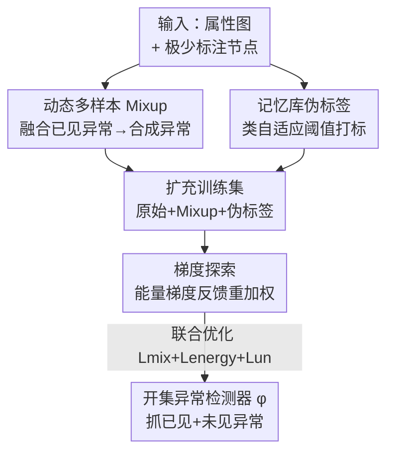

# Dynamic Multi-sample Mixup with Gradient Exploration for Open-set Graph Anomaly Detection

**会议**: ICLR2026  
**OpenReview**: [https://openreview.net/forum?id=zefuSJ3nOg](https://openreview.net/forum?id=zefuSJ3nOg)  
**代码**: https://github.com/yucy324/DEMO  
**领域**: 图学习 / 图异常检测  
**关键词**: 开集图异常检测、多样本 Mixup、能量梯度、伪标签、记忆库

## 一句话总结
针对"训练时只见过少数几类异常、推理时要抓出从没见过的新异常"这一开集图异常检测难题，本文提出 DEMO：用动态多样本 Mixup 把已见异常融合出更多样的合成异常来撑开决策边界，用能量梯度反馈动态给每个样本重新加权，再用记忆库引导的类自适应阈值做可靠伪标签，在 6 个图数据集上稳定超过一众 GAD baseline。

## 研究背景与动机
**领域现状**：图异常检测（GAD）要在节点属性 + 拓扑结构里找出偏离正常模式的稀有/恶意节点（金融欺诈、IoT 攻击等）。主流做法分两类：无监督方法靠重构误差或对比学习估计异常分数，泛化性强但因为缺少语义指导、精度有限；半监督方法用极少量标注异常做一致性正则、生成式目标或图增强，判别力更强。

**现有痛点**：无论无监督还是半监督，几乎都建立在**闭集假设**上——默认训练数据已经覆盖了所有可能的异常类型或其分布。可现实里异常的结构多样、上下文依赖强，新型异常层出不穷。一旦推理时冒出训练里没见过的异常类，这些模型就抓瞎。

**核心矛盾**：开集 GAD 同时被两道枷锁卡住。其一是**已见异常又少又同质**：训练集里异常类别数目本来就小、类内多样性又不足，现有方法没把这点有限的监督榨干，导致没法外推到未见异常。其二是**标签稀缺叠加极端类不平衡**：正常节点占绝对多数、标注/未标注异常都极其稀少，半监督方法很容易过拟合到正常类，决策边界被带偏，既抓不好稀有异常、也泛化不到未见异常。

**本文目标**：用有限标注节点训练一个 GAD 模型 $\phi:(G,V)\to[0,1]$，让它对已见异常 $V^{seen}_a$ 和未见异常 $V^{unseen}_a$ 都打高分、对正常节点 $V_n$ 打低分，即 $\phi(G,v_a)\gg\phi(G,v_n)$。

**切入角度**：作者把开集识别和 GAD 接到了一起——既然未见异常拿不到数据，那就**主动合成**逼近未见异常的样本来撑开边界；既然样本质量参差不齐，那就**动态加权**只盯住对泛化有用的边界样本；既然标签太少，那就用**带历史记忆的伪标签**把未标注节点利用起来。

**核心 idea**：用"自适应融合多个已见异常→合成多样异常撑边界 + 能量梯度反馈重加权 + 记忆库引导类自适应阈值伪标签"这套**动态自适应训练框架**，替代闭集假设下的静态训练，从而泛化到未见异常。

## 方法详解

### 整体框架
DEMO 是一个围绕"扩充训练数据 → 动态加权 → 伪标签补充"的动态自适应训练框架，骨干用 GraphSAGE。给定一张属性图和极少量标注节点，它先并行做两路数据扩充：**多样本 Mixup** 把已见异常融合成新的合成异常，**伪标签** 给可靠的未标注节点打标。原始数据、Mixup 数据、伪标签数据合在一起后，进入**梯度探索**阶段——用能量梯度对每个样本做动态重加权，让优化聚焦到不确定、信息量大的边界节点上。三路损失（mixup、energy、伪标签）联合优化整个检测器。

### 关键设计

**1. 动态多样本 Mixup：用已见异常合成多样异常来撑开决策边界**

痛点很直接——训练集里异常又少又同质，模型见不到未见异常的样子，决策边界自然画得保守。DEMO 的做法是把**所有**已见异常的 embedding 一次性融合，给每个原始异常 $z^{train}_i$ 生成一个合成表示 $\hat z_i = \sum_{j=1}^N \alpha_{ij} z^{train}_j$，其中 $\sum_j \alpha_{ij}=1$。关键在于融合权重 $\alpha_{ij}$ **不是随机的**，而是按特征相似度算出来的：

$$\alpha_{ij}=\frac{\exp\!\big(S((z^{train}_i)^\top w_m,(z^{train}_j)^\top w_n)\big)}{\sum_k \exp\!\big(S((z^{train}_i)^\top w_m,(z^{train}_k)^\top w_n)\big)}$$

$S$ 是相似度函数（内积或余弦），$w_m,w_n$ 是可学习权重。直觉是：越相似的样本越容易混淆模型，给它们更大权重，能让合成样本落在特征空间里更**模糊**的区域——这正是逼近未见异常、最考验决策边界的地方。作者还给了 Theorem 3.1 证明合成样本 $\hat z_i$ 与原样本的相似度不会掉太多（$S(\hat z_i,z_j)\ge S(z_i,z_j)-\epsilon$），保证合出来的东西仍保留"异常该有的可混淆性"，不会退化成噪声。为防止合成表示过度偏向某个原始样本，还加了多样性正则 $\mathcal{L}_{div}$（公式 3）抑制单样本主导，最终 mixup 损失为 $\mathcal{L}_{mix}=\mathcal{L}_{cons}+\lambda_{div}\mathcal{L}_{div}$，其中 $\mathcal{L}_{cons}$ 是原始异常属性与其投影表示之间的 MSE 一致性损失。

**2. 梯度探索：用能量梯度反馈给样本动态重加权**

撑开边界后又冒出新问题——扩充后的训练集里（原始 + 合成），不是每个样本都对泛化有用，有的是宝贵的边界样本、有的是冗余甚至噪声，一视同仁地优化是次优的。DEMO 引入能量梯度驱动的反馈机制，把样本的"能量"定义为预测不确定性 $E_\theta(v_i)=-\log\sum\exp(z_i)$（$z_i$ 是节点 logits）：能量低→置信高→多半是正常节点，能量高→可能是异常或模糊样本。它进一步用 Hessian 衡量参数对能量扰动的响应 $I_{\hat\theta}(v_i)=-H_{\hat\theta}^{-1}\nabla_\theta E_\theta(v_i)$，再把这个响应投影到**验证集损失梯度**上，算出某训练节点对验证误差的平均影响 $T^{val}(v_i)$（公式 6），并归一化成自适应权重：

$$\beta_{v_i}=-\frac{T^{val}(v_i)}{\max_{v_k\in V^{train}}|T^{val}(v_k)|}$$

最后把权重塞进能量感知目标 $\mathcal{L}_{energy}=\frac1n\sum_i[\mathcal{L}(v_i,y_i;\theta)+\lambda_{eng}\beta_{v_i}\cdot E_\theta(v_i)]$。其妙处在于：当 $T^{val}(v_i)>0$，说明强化该节点的能量引导能降低验证误差，这类节点往往是像未见异常的边界样本，就该被重视；反之负影响说明该样本损害泛化，贡献被压制。等于让模型**借验证集的反馈**自己挑出哪些样本值得多学。

**3. 记忆库引导的可靠伪标签：用类自适应历史阈值对抗标签稀缺与不平衡**

光靠标注数据还不够，未标注节点的潜力得挖出来。但传统固定阈值伪标签跟不上训练中模型预测行为的动态变化；而类无关的动态阈值在极度不平衡的二分类 GAD 里又会忽略掉少数的异常类。DEMO 的解法是**类自适应、带历史记忆**的阈值调整：用记忆库记录每个类 $c\in\{0\text{ 正常},1\text{ 异常}\}$ 在第 $t$ 轮被选中的样本数 $N^c_t$，并追踪历史峰值 $N^c_{max}=\max_{1\le k\le t}N^c_k$，用当前选择数与峰值之比 $\rho_t(c)=\sigma_t(c)/N^c_{max}$ 来动态调阈值。最终阈值是**非对称**更新的：

$$\tau^{+/-}_t=\begin{cases}\rho_t(c)\cdot\tau^+, & c=\text{anomaly}\\ \tau^-\cdot(2-\rho_t(c)), & c=\text{normal}\end{cases}$$

其中 $\tau^++\tau^-=1$。这样异常阈值 $\tau^+_t$ 随 $\rho_t(\text{anomaly})$ 递增以提升少数类敏感度，正常阈值 $\tau^-_t$ 通过非线性项 $(2-\rho_t(\text{normal}))$ 递减以抵御多数类主导。本质是给"难且少"的异常类降低门槛、给"易且多"的正常类抬高门槛，让伪标签既可靠又不会被正常类淹没。

### 损失函数 / 训练策略
总训练目标把三块拼起来：$\mathcal{L}=\mathcal{L}_{energy}+\lambda_{mix}\mathcal{L}_{mix}+\lambda_{un}\mathcal{L}_{un}$，其中 $\mathcal{L}_{un}$ 是对伪标签样本的二元交叉熵，$\lambda_{mix},\lambda_{un}$ 为平衡系数。骨干 GraphSAGE，隐藏维 64，Adam（lr=0.001，weight decay=0.0005），小数据集训 200 epoch、大数据集 400 epoch；$\lambda_{div}=0.5$，$\tau^+/\tau^-$ 最终设为 0.99/0.01。

## 实验关键数据

### 主实验
训练时只用 50 个异常节点（来自单一异常类）+ 5% 正常节点，验证用 30 个同类异常 + 1% 正常节点，其余全部测试，模拟开集场景。指标为 AUC-ROC 和 AUC-PR（后者在不平衡场景下更看重少数异常类）。

小规模数据集（AUC-ROC / AUC-PR）：

| 数据集 | 指标 | 第二好 baseline | DEMO |
|--------|------|------|------|
| Photo | AUC-ROC | 0.8668 (CONSISGAD) | **0.9023** |
| Photo | AUC-PR | 0.5987 (CONSISGAD) | **0.6330** |
| Computers | AUC-ROC | 0.8296 (SpaceGNN) | **0.8439** |
| Computers | AUC-PR | 0.6439 (SpaceGNN) | **0.6458** |
| CS | AUC-ROC | 0.9081 (GGAD) | **0.9448** |
| CS | AUC-PR | 0.8198 (GGAD) | **0.8857** |

三个小数据集上 DEMO 在两项指标上全面登顶：相比次优半监督方法 NSReg，平均 AUC-ROC 提升 7.86%；相比 GGAD，平均 AUC-PR 提升 17.60%。

大规模数据集（AUC-ROC）：

| 数据集 | NSReg | SpaceGNN | DEMO |
|--------|------|------|------|
| Yelp | 0.7015 | 0.6853 | **0.7097** |
| ogbn-arxiv | 0.6182 | 0.6133 | **0.6364** |
| ogbn-mag | 0.4836 | 0.4626 | **0.4967** |

大图上 DEMO 仍稳居最优 AUC-ROC（Yelp 上 AUC-PR 略低于 NSReg，但整体稳健），在 GGAD/TAM 等方法 OOM 的极大图上照常工作。

### 消融实验
在 Photo / Computers 上逐个去掉三大模块（AR=AUC-ROC，AP=AUC-PR）：

| 配置 | Photo AR | Photo AP | Computers AR | Computers AP | 说明 |
|------|------|------|------|------|------|
| Full DEMO | 0.9023 | 0.6330 | 0.8439 | 0.6458 | 完整模型 |
| w/o PL | 0.8616 | 0.6150 | 0.8094 | 0.5949 | 去伪标签，掉点最多 |
| w/o EG | 0.8849 | 0.6171 | 0.8100 | 0.5998 | 去能量梯度加权 |
| w/o Mix | 0.8750 | 0.6023 | 0.8197 | 0.6292 | 去多样本 Mixup |
| w/o All | 0.8300 | 0.5692 | 0.7576 | 0.5325 | 三模块全去 |

### 关键发现
- **伪标签（PL）贡献最大**：去掉后两数据集掉点最明显，说明类自适应伪标签在缓解标签稀缺上最吃重。
- 能量梯度（EG）和多样本 Mixup（Mix）去掉后也都稳定掉点，三模块协同；全去掉（w/o All）性能最差，证明三者缺一不可。
- **数据效率高**：异常节点数从 20→50→100，DEMO 在低资源（仅 20 个异常）时优势尤其明显，CS 上 20 个异常就能到约 0.90 AUC-ROC。
- **阈值敏感性**：$\tau^-=0.01$（即异常阈值 0.99）时最优，过度放松异常选择标准会引入低置信样本、反而损害学习。

## 亮点与洞察
- **把"未见异常没数据"转成"合成逼近未见异常"**：多样本 Mixup 用相似度加权融合所有已见异常，让合成样本落到特征空间最模糊处，再用定理保证不退化成噪声——这是一个可迁移到其他开集/少样本任务的造样本思路。
- **用验证集梯度反向指导训练样本权重**：能量梯度 + Hessian 投影到验证损失梯度，等于让模型量化"这个训练样本到底帮不帮泛化"，比单纯按 loss 大小加权更有针对性。
- **非对称类自适应阈值**：异常类抬门槛、正常类降门槛的设计，直击二分类 GAD 里类无关阈值忽视少数类的通病，是对抗极端不平衡的实用 trick。

## 局限与展望
- 开集场景是通过"按类比例把少数类当异常"**人工切分**模拟出来的（无现成开集 benchmark），与真实世界自然产生的未见异常分布可能有差距。
- Yelp 上 AUC-PR 反而略低于 NSReg，说明多样本合成 + 伪标签在某些真实异质大图上未必处处占优。
- 能量梯度机制涉及 Hessian 逆，虽然论文在大图上能跑，但其计算/近似开销与可扩展上限值得进一步说明。
- 伪标签依赖记忆库的历史峰值统计，冷启动阶段（训练早期峰值不稳）阈值是否可靠、对超参 $\tau^+/\tau^-$ 的敏感性都还有调优空间。

## 相关工作与启发
- **vs NSReg（开集 GAD 代表）**：NSReg 走判别式路线，靠正则约束正常节点间的结构关系来收紧决策边界，但**忽视了异常节点对塑造模型行为的作用**；DEMO 反其道而行，强调异常样本的价值，通过融合已见异常得到多样表示来提升泛化，主实验上稳定超过 NSReg。
- **vs 传统半监督 GAD（ConsisGAD/GGAD 等）**：它们都默认训练/测试异常分布一致（闭集假设），DEMO 显式面向未见异常，并用伪标签 + 动态加权同时啃下标签稀缺与类不平衡。
- **vs 开集分类（OpenMax 等）**：判别式开集方法在特征空间留模糊区检测未知、生成式方法显式合成未知类样本；DEMO 把"合成逼近未知"的生成思想搬进图节点空间，用相似度加权 Mixup + 理论保证替代对抗式生成。

## 评分
- 新颖性: ⭐⭐⭐⭐ 把开集识别接入 GAD，多样本相似度加权 Mixup + 能量梯度反馈 + 类自适应伪标签三件套设计扎实，但各部件多源自已有技术的组合。
- 实验充分度: ⭐⭐⭐⭐ 6 个数据集 + 12 个 baseline + 消融/数据效率/敏感性/可视化齐全，唯大图 AUC-PR 偶有不占优。
- 写作质量: ⭐⭐⭐⭐ 三个挑战→三个模块的逻辑清晰，公式与定理交代到位。
- 价值: ⭐⭐⭐⭐ 开集 GAD 是被低估但现实重要的问题，方法在低资源下优势明显，代码开源，实用性强。

<!-- RELATED:START -->

## 相关论文

- [\[ICLR 2026\] Topological Anomaly Quantification for Semi-Supervised Graph Anomaly Detection](topological_anomaly_quantification_for_semi-supervised_graph_anomaly_detection.md)
- [\[ICLR 2026\] DR-GGAD: Dual Residual Centering for Mitigating Anomaly Non‑Discriminativity in Generalist Graph Anomaly Detection](dr-ggad_dual_residual_centering_for_mitigating_anomaly_nondiscriminativity_in_ge.md)
- [\[ICLR 2026\] Discrete Bayesian Sample Inference for Graph Generation](discrete_bayesian_sample_inference_for_graph_generation.md)
- [\[ICML 2026\] ProMoS: Generalist Graph Anomaly Detection via Prototype-Based Distillation](../../ICML2026/graph_learning/generalist_graph_anomaly_detection_via_prototype-based_distillation.md)
- [\[ICLR 2026\] Dual-Branch Representations with Dynamic Gated Fusion and Triple-Granularity Alignment for Deep Multi-View Clustering](dual-branch_representations_with_dynamic_gated_fusion_and_triple-granularity_ali.md)

<!-- RELATED:END -->
