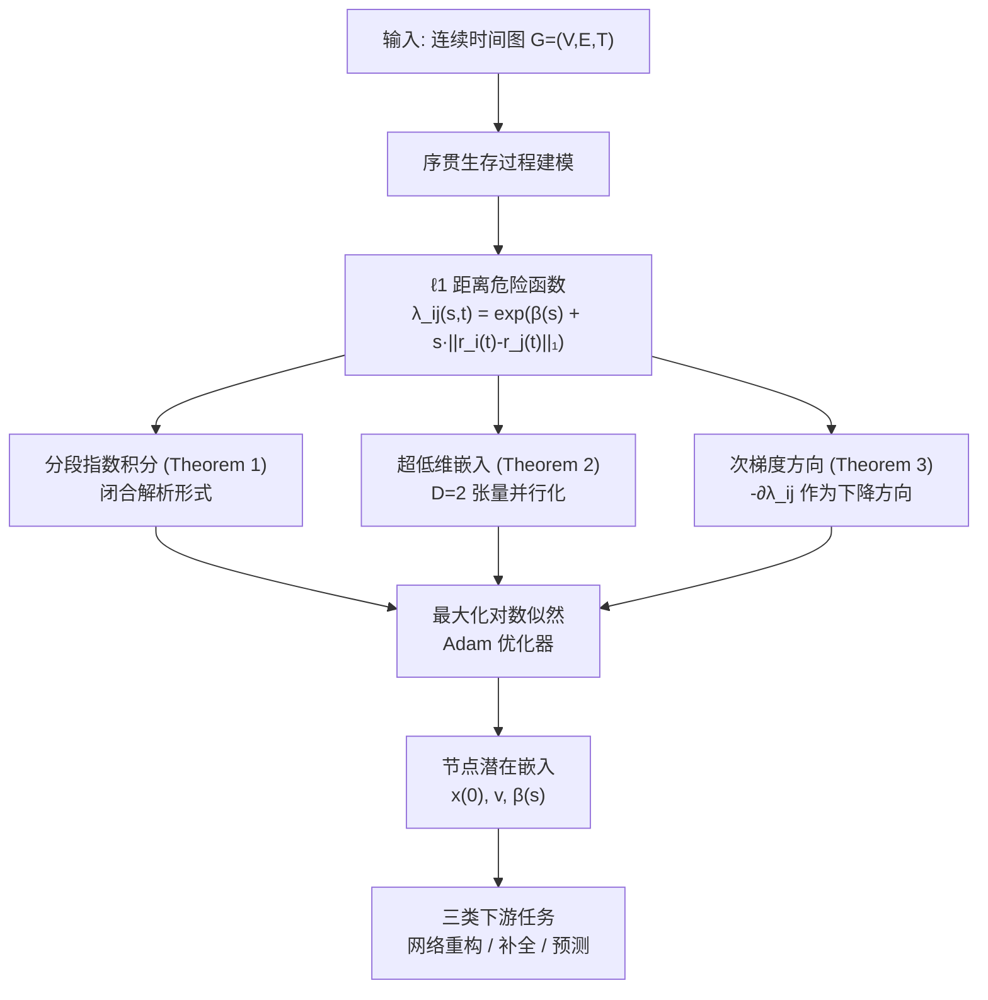

# $\ell_1$ Latent Distance Based Continuous-Time Graph Representation

**会议**: ICLR 2026  
**OpenReview**: [https://openreview.net/forum?id=pW1Kg9CYyw](https://openreview.net/forum?id=pW1Kg9CYyw)  
**代码**: [laizhr/L1LD-CTGR](https://github.com/laizhr/L1LD-CTGR)  
**领域**: 图表示学习 / 连续时间动态图  
**关键词**: 连续时间图表示、序贯生存过程、ℓ1 距离、潜在度量空间、动态网络

## 一句话总结

用 ℓ1 距离替换现有连续时间图表示中违反三角不等式的平方 ℓ2 距离，推导出闭合形式的分段指数积分，并通过次梯度方法解决不可微难题，在 11 个数据集的三类评估任务上全面超越 GRASSP 等 8 个基线。

## 研究背景与动机

**领域现状**：连续时间图表示（CTGR）是刻画动态网络随时间演化的主流方法，广泛应用于社交网络、接触网络、合作网络等场景。基于序贯生存过程（Sequential Survival Process）的 GRASSP 是近年最具代表性的工作——它将节点在低维潜在空间中的轨迹与生存函数耦合，通过对数似然优化学习节点嵌入。

**现有痛点**：GRASSP 使用平方 ℓ2 距离 $\|\cdot\|_2^2$ 作为潜在空间的距离度量。然而，$\|r_i - r_j\|_2^2$ 违反三角不等式（即存在 $r_i, r_j, r_k$ 使得 $\|r_i - r_j\|_2^2 > \|r_i - r_k\|_2^2 + \|r_k - r_j\|_2^2$），这意味着它不是严格意义上的距离函数。一个直观的反例是：在 $r_0$ 和 $r_Q$ 之间插入无限多个中间节点后，路径间接距离趋近于零，与常识完全相悖。这种畸变在社交、接触、合作等强依赖相对节点位置的网络上会严重影响性能。

**核心矛盾**：直接把平方 ℓ2 换成 ℓ2（去掉平方）可以满足三角不等式，但对应的危险函数积分 $\int \exp(s\|\Delta x + \Delta v \cdot t\|_2)\,dt$ 没有解析解，只能用数值方法（如 Simpson 法则），引入近似误差且计算开销高达 $O(HD)$（$H$ 为子区间数）。其他 $\ell_p$（$p>1, p\neq 2$）距离同样面临积分不可解析的困境。

**本文目标**：寻找一个既满足三角不等式（真正意义上的度量空间）、又使危险函数积分具有闭合解析形式的替代距离。

**切入角度**：ℓ1 距离天然满足三角不等式，近年在若干场景已被证明是 ℓ2 距离的有效替代。本文证明，以 ℓ1 距离为核心的危险函数积分是一个闭合的**分段指数积分**，不仅理论完备，还与超低维嵌入（$D=2$）完美契合。

**核心 idea**：用 ℓ1 距离重构序贯生存过程，推导出闭合积分公式，并用次梯度方向绕开不可微障碍，最终兼容 PyTorch 等主流框架。

## 方法详解

### 整体框架

ℓ1LD-CTGR 沿用 GRASSP 的序贯生存过程框架——节点 $i$ 在时刻 $t$ 的位置由初始坐标加分段线性速度描述，节点对的连接/断开状态由危险函数 $\lambda_{ij}(s,t)$ 控制，整体通过最大化对数似然 $\log p(G|\Omega)$ 学习参数。本文的核心替换是把危险函数中的平方 ℓ2 距离改为 ℓ1 距离，并配套解决由此引发的三个技术挑战：积分计算、超低维嵌入的张量并行化、以及 ℓ1 范数不可微导致的梯度缺失。

### 关键设计

**1. ℓ1 距离危险函数与闭合分段指数积分**

原始 GRASSP 选用 $\lambda_{ij}(s,t) = \exp(\beta(s) + s\|r_i(t)-r_j(t)\|_2^2)$，平方 ℓ2 距离使得积分变为广为研究的 Gaussian 积分（erf/erfi 函数），计算方便但度量不合法。本文将其替换为：

$$\lambda_{ij}(s,t) = \exp\!\left(\beta(s) + s\|r_i(t) - r_j(t)\|_1\right)$$

ℓ1 距离满足三角不等式，构成真正的度量空间。但随之而来的问题是：由于节点沿分段线性轨迹运动，$\|r_i(t)-r_j(t)\|_1 = \|\Delta x_{ij} + \Delta v_{ij} t\|_1$ 的各维度符号在区间内可能**异步变化**，导致积分被分成多个片段。作者证明（Theorem 1），这个积分是一个**闭合的分段指数积分**：区间 $[e_l, e_u]$ 内存在若干零点 $z_{ij,(c)}$（即相对位置第 $d$ 维过零的时刻），将区间分割后每段均可解析计算，最终拼接为完整积分。与 Gaussian 积分形式截然不同，但同样是精确的闭合解，彻底绕开了数值近似的误差。

**2. 超低维嵌入下的张量并行化算法**

超低维嵌入（$D=2$）是 CTGR 近年的重要趋势，既能降维又降低计算开销。本文证明（Theorem 2），当 $D=2$ 时，分段积分中的零点数量**至多为 2 个**，与积分区间的两端 $e_k, e_{k+1}$ 兼容，因此所有节点对和时间片段的积分 $\{\int_{e_k}^{e_{k+1}} \lambda_{ij}(s,t)\,dt\}_{i,j,k}$ 可以被统一写成三个张量并行片段之和：

$$\int_{e_k}^{e_{k+1}} \lambda_{ij}(s,t)\,dt = \exp(\beta(s)) \odot (I_1 + I_2 + I_3)$$

其中 $I_1, I_2, I_3 \in \mathbb{R}^{L\times 1}$（$L$ 为观测总数）可以批量计算。这使得 ℓ1LD-CTGR 在 $D=2$ 时的单次积分复杂度降为 $O(1)$，整体训练复杂度 $O(LM/\varepsilon^2)$ 与 GRASSP 持平，而对于 $D>2$ 时排序零点的复杂度为 $O(D\log_2 D) = \tilde{O}(D)$，同样与 GRASSP 同阶。

**3. 通过次梯度方向绕开 ℓ1 不可微难题**

ℓ1 范数在零点处不可微，导致 $\partial \lambda_{ij}/\partial r_i$ 不存在，PyTorch 的反向传播链式法则失效。作者引入 Fréchet 次梯度，利用 $\text{sign}(r) \in \partial\|r\|_1$，定义以下**上升方向**：

$$\partial\lambda_{ij}(r_i) = \exp\!\left(\beta(s) + s\|r_i(t)-r_j(t)\|_1\right) \cdot s \cdot \text{sign}(r_i(t)-r_j(t))$$

Theorem 3 证明，无论节点坐标是否对齐：若 $r_i = r_j$（所有维度相同），则 $\partial\lambda_{ij}=0$ 即梯度点；否则，$-\partial\lambda_{ij}$ 是 $\lambda_{ij}$ 的一个**下降方向**（且在多数情形下就是次梯度）。特别地，当 $s=-1$（断开状态）且有维度对齐时，该方向不是次梯度，但仍保证下降性——作者给出了反例（$D=\{1,2\}$, $C=\{1\}$）详细说明原因。这套方案使得 ℓ1LD-CTGR 可以直接接入 PyTorch 的自动微分系统，无需修改框架。

## 实验关键数据

### 主实验（网络补全，out-of-sample，ROC-AUC）

| 数据集 | GRASSP | ℓ1LD-CTGR | 提升 |
|--------|--------|-----------|------|
| Synthetic-α | 0.559 | **0.817** | +0.258 |
| Infectious | 0.728 | **0.756** | +0.028 |
| Facebook | 0.500 | **0.572** | +0.072 |
| NeurIPS | 0.360 | **0.533** | +0.173 |
| Wikipedia | 0.874 | **0.982** | +0.108 |
| Reddit | 0.918 | **0.988** | +0.070 |

（ℓ1LD-CTGR 在 11 个数据集中 9 个排名第一，仅在 2 个数据集略输于最强竞品）

### 未来连接预测（across-sample，Synthetic-α）

| 指标 | GRASSP | ℓ1LD-CTGR | 提升 |
|------|--------|-----------|------|
| ROC-AUC | 0.875 | **0.922** | +0.047 |
| PR-AUC | 0.819 | **0.890** | +0.071 |

### 关键发现
- ℓ1LD-CTGR 在社交/接触/合作网络（Contacts、Infectious、Facebook、US Legis.）上相比 GRASSP 提升最为显著，与理论预测（三角不等式修复有助于相对位置结构）完全吻合。
- 在大规模数据集 Facebook（8.2 万节点、2 亿边）和 NeurIPS（5000 节点、120 万边）上均保持竞争性，证明可扩展性。
- DyGFormer 等 Transformer-based 方法在网络重构（in-sample）占优，但在网络预测（across-sample）中大幅落后于 ℓ1LD-CTGR，说明超低维潜在距离建模对外推的优势。

## 亮点与洞察

- **度量空间的正确性是性能基础**：将度量空间的数学合法性（三角不等式）与实际性能联系起来，为何「换一个距离」能带来显著提升，论文给出了清晰的理论解释——这比「调参获益」更有说服力。
- **闭合积分与数值积分的根本差异**：作者专门比较了数值方法（Simpson 规则，$H=1000$，误差 $O(10^{-12})$）与精确积分，指出即使极高精度的近似也无法匹敌精确解，在消融表（Table A4）中予以验证。
- **次梯度方法的精细分析**：对 $s=1$ 和 $s=-1$ 两种状态分别给出次梯度存在性证明，并通过反例说明边界情况下方向不是次梯度但仍然是下降方向——这种细粒度分析并不常见。

## 局限与展望

- 目前的超低维高效算法（$D=2$ 情形的张量并行）依赖维度极低的假设；当 $D$ 增大时，零点排序带来额外 $O(D\log D)$ 开销，高维场景下收益下降。
- 模型仍采用分段线性轨迹近似节点运动，对高度非线性运动（如突变行为）的刻画能力有限。
- 仅在无向图上验证，有向图的扩展需要重新考虑非对称性。

## 相关工作与启发

- **vs GRASSP**：本文的直接改进对象。GRASSP 使用平方 ℓ2 距离，违反三角不等式；本文证明 ℓ1 距离在相同框架下同样有闭合积分，且性能更优。
- **vs DyGFormer / GraphMixer**：这类 Transformer-based 方法依赖大量历史事件 token 和注意力机制，擅长 in-sample 任务但参数量大、外推能力差；ℓ1LD-CTGR 以极低维嵌入（$D=2$）取胜，参数极少却泛化更强。
- **vs Node2Vec / CTDNE**：随机游走方法忽略边的持续时间，在序贯生存过程建模上从根本上缺乏支持。
- **启发**：在任何用距离度量建模的图/流形学习方法中，距离函数的度量合法性值得检验；ℓ1 距离往往是一个可以保持理论完整性且具有解析性质的替代选项。

## 评分

- 新颖性: ⭐⭐⭐⭐ 用 ℓ1 距离修复序贯生存过程的度量空间缺陷，并推导闭合积分，切入点精准且工作量扎实
- 实验充分度: ⭐⭐⭐⭐ 11 个数据集、3 类评估任务、8 个基线，覆盖合成与真实、小规模与大规模
- 写作质量: ⭐⭐⭐⭐ 理论推导严谨，反例和边界情况均有说明，但公式密集，阅读门槛较高
- 价值: ⭐⭐⭐⭐ 对动态图表示学习社区有直接改进意义，代码已开源，可作为 GRASSP 的即插即用替代

<!-- RELATED:START -->

## 相关论文

- [\[ICLR 2026\] CORDS - Continuous Representations of Discrete Structures](cords_-_continuous_representations_of_discrete_structures.md)
- [\[ICLR 2026\] Latent Geometry-Driven Network Automata for Complex Network Dismantling](latent_geometry-driven_network_automata_for_complex_network_dismantling.md)
- [\[ICLR 2026\] CheckMate! Watermarking Graph Diffusion Models in Polynomial Time](checkmate_watermarking_graph_diffusion_models_in_polynomial_time.md)
- [\[ICLR 2026\] ReLaSH: Reconstructing Joint Latent Spaces for Efficient Generation of Synthetic Hypergraphs with Hyperlink Attributes](relash_reconstructing_joint_latent_spaces_for_efficient_generation_of_synthetic_.md)
- [\[ICLR 2026\] On the Trade-off Between Expressivity and Privacy in Graph Representation Learning](on_the_trade-off_between_expressivity_and_privacy_in_graph_representation_learni.md)

<!-- RELATED:END -->
