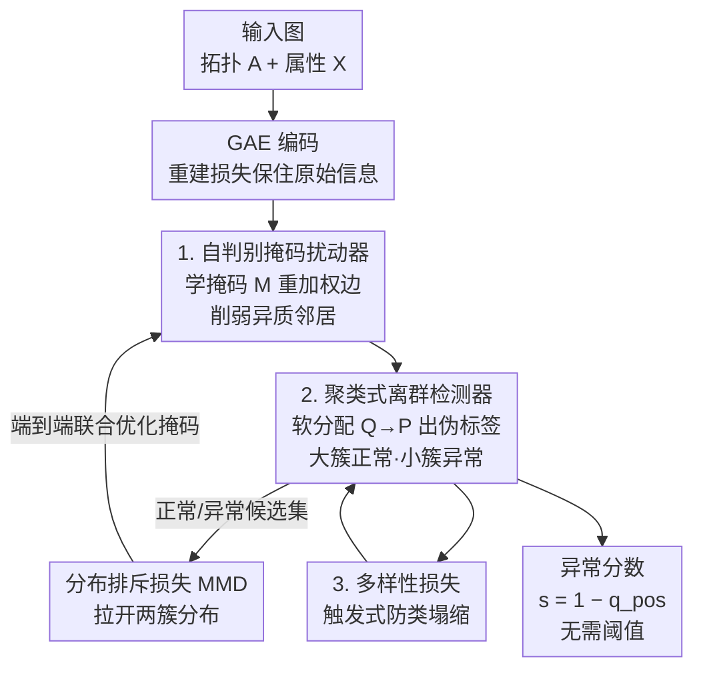

# Escaping the Homophily Trap: A Threshold-free Graph Outlier Detection Framework via Clustering-guided Edge Reweighting

**会议**: ICLR 2026  
**OpenReview**: [https://openreview.net/forum?id=Z8f0whjttd](https://openreview.net/forum?id=Z8f0whjttd)  
**代码**: 暂未开源  
**领域**: 图学习 / 图异常检测  
**关键词**: 图离群检测, 同质性陷阱, 边重加权, 聚类伪标签, 无阈值检测

## 一句话总结
针对图卷积在异常检测中因"邻居聚合"把正常节点表征污染成异常的"同质性陷阱"，本文提出 CER-GOD：用一个可学习掩码自适应削弱异质邻居之间的边权，再用一个二聚类检测器在无监督下生成伪标签来反过来指导掩码、并直接给出无需阈值的异常分数，配上一个多样性损失防止聚类塌缩，在 8 个基准上刷出新 SOTA（Email 数据集 AUC 96.98%，比次优高 12% 以上）。

## 研究背景与动机
**领域现状**：图离群检测要在图结构数据里找出偏离主流模式的稀有节点（金融欺诈、流量监控、生物分析等），主流 SOTA 普遍以图卷积（GC）为骨架——通过聚合邻居信息来学节点表征，再配重建误差、对比学习或统计特征来打分。

**现有痛点**：图卷积的有效性根植于"同质性假设"——相邻节点彼此相似。但异常检测里这个假设恰恰是毒药：当正常节点和异常节点互为邻居时，聚合操作会把异常邻居的特征"灌"进正常节点的表征里，让两者变得难以区分。作者称之为"同质性陷阱"（Homophily Trap）。论文用 Email 数据集给出实证（Figure 2）：单层图卷积后，"距异常 1 跳的正常节点"和"异常节点"的嵌入分布几乎重合，而距异常多跳的正常节点则清晰可分——说明异常邻居确实削弱了近邻正常节点的判别力，且这种污染随路径变长而衰减。

**核心矛盾**：图卷积"聚合越多越好"的归纳偏置与离群检测"要把近邻正常/异常分开"的目标根本冲突。作者还从理论上证明（Proposition 1）：节点 $i$ 的属性对距它 $r$ 跳节点表征的影响上界是 $(\alpha\beta)^{r+1}(A^{r+1})_{ji}$，即影响随最短路径距离指数衰减——这意味着污染主要来自短程的紧邻异常。

**现有方法的不足**：以往缓解手段多走"图重写"路线，要么彻底重构图结构（破坏图的本质拓扑），要么靠启发式规则、依赖人工设定的阈值（可靠性存疑）。而即便是提出"同质性陷阱"概念的 ADA-GAD，也依赖一个预先计算的谱属性指标来分级，结果严重受该指标质量牵制。

**核心 idea**：不重写图，而是**自适应地重加权边**——用一个可学习掩码"外科手术式"地削弱造成陷阱的异质信息流、保留原图拓扑；同时把"该削弱哪些边"这件需要标签的事，交给一个**无监督二聚类检测器**生成伪标签来端到端指导，从而彻底甩掉预定义阈值。

## 方法详解

### 整体框架
CER-GOD（Clustering-guided Edge Reweighting for Graph Outlier Detection）是一个端到端联合优化框架，把两个互相成就的组件拧在一起：**自判别掩码扰动器**（Self-Discriminative Masking Spoiler, SD-MS）负责"该削弱哪些边"，**聚类式离群检测器**负责"谁是正常谁是异常"。整条流水线是：输入图（拓扑 $A$ + 属性 $X$）先经图自编码器（GAE）做重建以保住原始信息；掩码扰动器学一个可学习掩码 $M$，按 $\tilde{A}=\tilde{M}\odot A$ 重加权拓扑、削弱异质邻居间的边权后再做图卷积；得到的隐表征 $Z$ 送进聚类层，用 Student's t 分布算软分配 $Q$、构造目标分布 $P$ 来收紧聚类，并据此把样本预测为正常/异常两簇（大簇判正常）；这些伪标签反过来定义正常候选集 $D_{pos}$ 与异常候选集 $D_{neg}$，用**分布排斥损失**（基于 MMD）拉开两簇、回头指导掩码继续优化；为防止聚类把所有点塌进一簇，加一个多样性损失兜底。推理时直接用聚类层 logits 算异常分数 $s_i=1-q_{i,pos}$，无需任何阈值。

### 关键设计

**1. 自判别掩码扰动器：用可学习掩码重加权边，斩断同质性陷阱的污染路径**

这是直接针对"异常邻居污染正常节点表征"这一痛点的核心组件。和图重写"大刀阔斧重构拓扑"不同，它只在原图上叠一层可学习掩码：引入可学习变量 $M$，经 $\tilde{M}_{ij}=\mathrm{sigmoid}(M_{ij})$ 压到 $[0,1]$，再按 $\tilde{A}=\tilde{M}\odot A$（$\odot$ 为 Hadamard 积）重加权每条边的权重——这等于在不改变消息传递路径、不破坏结构完整性的前提下，自适应地调高同质邻居、调低异质邻居的聚合强度（归一化时还对 $\tilde{A}+I_N$ 处理以保住节点自身的 ego 信息）。

掩码学习的目标，是让预测正常节点与预测异常节点的聚合分布尽可能可分。作者把预测为正常（$y_i=0$）的节点收进 $D_{pos}$、其余进 $D_{neg}$，用最大均值差异（MMD）度量两簇分布距离，定义分布排斥损失 $\ell_{dr}=-\mathrm{MMD}^2(D_{pos}, D_{neg})$（最大化两簇间差异）。一个值得注意的细节是：MMD 的核函数用的是基于切比雪夫距离的高斯核 $\kappa(x,y)=\exp(-(\max_i|x_i-y_i|)^2/2\sigma^2)$，而非常规 RBF 核。理由是在高维空间里异常往往体现为"某几个特征维度上的偏离"而非全维度均匀漂移，RBF 把所有维度的差异平均会"抹平"异常信号，而切比雪夫只盯单维最大差异，对噪声更鲁棒、抓离群更准（消融里 Chebyshev 核稳定优于 RBF）。它和 GAT 注意力的本质区别在于：GAT 是按局部特征相似度给边加权做表征学习，而本掩码是被一个全局、任务特定的目标（最大化正常/异常两簇的可分性）显式指导的。

**2. 聚类式离群检测器：无监督伪标签，把"阈值"彻底替换成聚类置信度**

掩码扰动器要算分布排斥损失，前提是"已经知道谁正常谁异常"——但无监督场景下没有标签。这个检测器就是来填这个洞、顺带消灭预定义阈值的。它在模型里嵌入可学习的聚类中心 $\mu$，用 Student's t 分布度量隐表征 $z_i$ 与中心的相似度，得到软分配概率 $q_{ij}=\frac{(1+\|z_i-\mu_j\|^2)^{-1}}{\sum_{j'}(1+\|z_i-\mu_{j'}\|^2)^{-1}}$，簇数 $c=2$（正常 vs 异常二分）。为收紧分配，再构造一个"自我强化"的目标分布 $P$（$p_{ij}\propto q_{ij}^2/\sum_i q_{ij}$，平方再归一化让高置信样本更突出），用 KL 散度 $\ell_c=\mathrm{KL}(P\|Q)$ 把当前分布往目标分布拉。训练时按 $\hat{y}_i=\arg\max_j q_{ij}$ 出伪标签，并基于"异常检测里正常样本占多数"这一事实，把样本更多的簇判为正常簇。

最妙的是推理时的异常分数：不设任何阈值 $\tau$，直接用聚类 logits 算 $s_i=1-q_{i,pos}=1-\frac{(1+\|z_i-\mu_{pos}\|^2)^{-1}}{\sum_{j'}(1+\|z_i-\mu_{j'}\|^2)^{-1}}$，即节点离正常簇中心越远、分数越高、越可能异常。这把传统方法"算分数 → 卡阈值 → 二分类"的脆弱链条，换成了"聚类置信度天然给出连续异常度"的端到端方案，既绕开了阈值敏感性，又让伪标签与掩码优化能在同一框架里互相迭代。

**3. 多样性损失：触发式防止聚类塌缩，给异常候选簇兜底**

这是为联合优化稳定性专门打的补丁，针对一个由同质性陷阱诱发的失效模式——类塌缩（class collapse）：在早期优化不充分时，把所有节点塞进同一个簇是"最大化 MMD"的最省力解（一簇空了，两簇间排斥损失反而好刷），但这会让异常候选簇空掉、整个自判别掩码阶段失去监督信号。作者设计正则项 $\ell_{diversity}=\sum_{k=1}^{c}\max(0,\,\epsilon-\hat{u}_k)$，其中 $\hat{u}_k=\frac{1}{N}\sum_i q_{ik}$ 是分到簇 $k$ 的样本比例，$\epsilon$ 是每簇最小占比阈值。它是"触发式"的：当某簇占比 $\hat{u}_k\ge\epsilon$ 时该项为 0（不罚），一旦某簇被掏空、占比低于 $\epsilon$ 才转正惩罚，逐步把主簇的一部分样本重新分配出去，保证异常候选簇始终有"人"。论文强调这一项不可被消融——没有它，聚类层就会塌缩。

整体目标函数把四项加权合一：$L=\ell_r+\alpha\cdot\ell_c+\beta\cdot\ell_{dr}+\gamma\cdot\ell_{diversity}$，分别是重建损失（保原始信息）、聚类损失、分布排斥损失、多样性损失，让掩码扰动器与离群检测器联合优化出更可分的隐表征。

## 实验关键数据

### 主实验
在 8 个数据集（引用网络 Cora/CiteSeer、社交网络 Flickr/Reddit、通信网络 Email/Enron、Disney、Amazon）上与 13 个基线（10 个节点级 + 3 个子图级 SOTA）对比，指标 AUC，10 次独立运行取均值。

| 数据集 | 本文 CER-GOD | 之前最佳基线 | 提升 |
|--------|------|----------|------|
| Email | **96.98** | 94.00 (DOMINANT) / 84.68 (AS-GAE) | +12% 以上（vs AS-GAE） |
| Disney | **72.13** | 69.35 (GADAM) | +2.8 |
| Flickr | **67.08** | 65.19 (TAM) | +1.9 |
| Enron | **72.63** | 68.97 (BOURNE) | +3.7 |
| Amazon | **86.24** | 79.87 (TAM) | +6.4 |
| Reddit | **59.71** | 58.60 (TAM) | +1.1 |
| Cora | 92.09（次优） | 92.62 (GADAM) | −0.5 |
| CiteSeer | 74.01 | 93.91 (GADAM) | 落后 |

CER-GOD 在多数数据集取得最优/次优，且无灾难性失败（很多基线在某些数据集会崩到 30–50 AUC），鲁棒性和适应性突出。一个关键对照是 GAT+ClusterAD（GAT 注意力 + 聚类检测器）——它是强竞争者，但 CER-GOD 大幅超越，印证 SD-MS 模块（全局任务指导的掩码）比 GAT 局部相似度注意力更有效。

### 消融实验
在 Email / Cora / Flickr 上验证各组件贡献（AUC %）：

| 配置 | Email | Cora | Flickr | 说明 |
|------|------|------|--------|------|
| w/o Reconstruction | 50.80 | 52.20 | 49.24 | 去掉重建直接聚类，几乎崩到随机 |
| Reconstruction OD | 84.12 | 79.51 | 56.70 | 用重建误差+百分位伪标签替代聚类检测器 |
| w/o SD-MS | 87.05 | 78.84 | 58.40 | 去掉自判别掩码扰动器 |
| **Ours（完整）** | **96.98** | **92.09** | **67.08** | — |

### 关键发现
- **重建组件是地基**：去掉重建后三个数据集全部掉到 ~50（接近随机），说明 GAE 重建对保住原始语义信息不可或缺，缺了它后续聚类/掩码都没有可靠表征可学。
- **聚类检测器 > 重建误差打分**：把检测机制换成重建误差（Reconstruction OD）后大幅下滑（Email 96.98→84.12），证明"聚类置信度给无阈值分数"优于传统重建误差。
- **SD-MS 贡献显著**：去掉掩码扰动器后 Email 掉近 10 个点（96.98→87.05），t-SNE 可视化也显示去掉 SD-MS 后异常嵌入更分散、可分性变差。
- **多样性损失不可消融**：它是防类塌缩的命门，拿掉聚类层就塌。
- **超参有宽安全区**：$\alpha,\beta\in[0.01,1]$ 范围内性能稳定，存在可靠默认配置；$\epsilon=0.5$（强制 50:50 平衡）反而偏严略伤性能，过小则放任塌缩。
- **分布排斥损失放第 1 层最好**：层数从 1 加到 5，性能单调下降——与污染随路径衰减的理论一致，浅层聚合受陷阱影响最重、最该被掩码纠偏。

## 亮点与洞察
- **"重加权"而非"重写"的取巧**：用一个 Hadamard 掩码就在不动消息传递路径的前提下精准抑制异质信息流，既保住原图结构又化解同质性陷阱，比图重写温和得多——这个"加掩码不动拓扑"的思路可迁移到任何"图卷积假设与任务目标冲突"的场景（如异配图分类）。
- **把阈值问题转成聚类问题**：传统离群检测被"卡哪个阈值"长期困扰，本文用二聚类的置信度 $1-q_{pos}$ 天然给出连续异常度，端到端、无阈值，是很干净的范式替换。
- **切比雪夫核的物理直觉很到位**：异常 = 少数维度的剧烈偏离，所以度量分布距离时只看单维最大差异而非全维平均，这个对"异常本质"的洞察让 MMD 在高维下更敏锐，是可复用的 trick。
- **多样性损失的"触发式"设计**：只在簇被掏空时才罚、平时不干预，避免了"强制 50:50"的过度约束，是处理无监督聚类塌缩的优雅写法。

## 局限与展望
- **二聚类的强假设**：$c=2$ 且默认"大簇即正常"，依赖"正常占多数"的前提；在异常比例高或多类异常的图上可能失灵。
- **泛化性留白**：CiteSeer 上明显落后 GADAM（74.01 vs 93.91），说明在某些图特性下并非普适最优，何时失效缺乏分析。
- **复杂度与可扩展性**：MMD 在候选集上是两两核计算、聚类层维护全图软分配，论文把复杂度分析放附录，大图上的可扩展性正文未充分讨论。
- **掩码的可解释性**：图 6 展示掩码确实削弱异类边、强化同类边，但掩码学得对不对仍主要靠可视化定性判断，缺乏定量保证。

## 相关工作与启发
- **vs ADA-GAD（He et al., 2024，提出"同质性陷阱"概念）**：ADA-GAD 用预计算的谱属性指标来分级节点/边/子图，结果重度依赖该指标质量；本文不依赖任何预计算指标，直接端到端学掩码 + 聚类伪标签，更自适应。
- **vs 图重写类（DropEdge / 结构重构）**：它们要么彻底重构拓扑、risk 破坏图本质结构，要么靠人工阈值启发式；本文只重加权、保结构、无阈值。
- **vs GAT（注意力重加权）**：GAT 按局部特征相似度加权做表征学习；本文掩码被全局任务目标（最大化正常/异常簇可分性）显式指导，是"自判别"范式而非纯表征注意力。
- **vs 重建/对比类检测器（DOMINANT、CONAD、AD-GCL 等）**：它们用重建误差或对比分数打分、仍受同质性陷阱污染；本文从源头削弱污染边、再用聚类置信度打分，消融证明优于重建误差路线。

## 评分
- 新颖性: ⭐⭐⭐⭐⭐ "重加权不重写 + 聚类伪标签反指导掩码 + 无阈值"组合干净且切中同质性陷阱要害，附理论上界佐证
- 实验充分度: ⭐⭐⭐⭐ 8 数据集 13 基线 + 多维消融/可视化/参数敏感性扎实，但 CiteSeer 落后等失效情形分析不足
- 写作质量: ⭐⭐⭐⭐ 动机—理论—方法—实验链条清晰，图文对应好；部分公式细节挤在附录
- 价值: ⭐⭐⭐⭐ 对图异常检测是实用且可迁移的范式改进，多 SOTA 刷新，落地金融/安全等场景潜力大

<!-- RELATED:START -->

## 相关论文

- [\[ICLR 2026\] Compactness and Consistency: A Conjoint Framework for Deep Graph Clustering](compactness_and_consistency_a_conjoint_framework_for_deep_graph_clustering.md)
- [\[ICLR 2026\] Multi-Scale Diffusion-Guided Graph Learning with Power-Smoothing Random Walk Contrast for Multi-View Clustering](multi-scale_diffusion-guided_graph_learning_with_power-smoothing_random_walk_con.md)
- [\[ICLR 2026\] Training-Free Counterfactual Explanation for Temporal Graph Model Inference](training-free_counterfactual_explanation_for_temporal_graph_model_inference.md)
- [\[ICLR 2026\] Neural Graduated Assignment for Maximum Common Edge Subgraphs](neural_graduated_assignment_for_maximum_common_edge_subgraphs.md)
- [\[ACL 2026\] ComplianceNLP: Knowledge-Graph-Augmented RAG for Multi-Framework Regulatory Gap Detection](../../ACL2026/graph_learning/compliancenlp_knowledge-graph-augmented_rag_for_multi-framework_regulatory_gap_d.md)

<!-- RELATED:END -->
