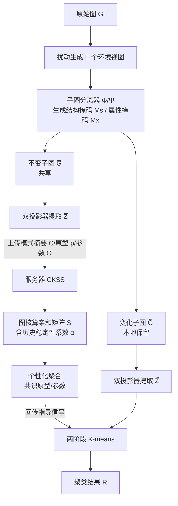

# Federated Graph-Level Clustering Network with Dual Knowledge Separation

**会议**: ICLR 2026  
**OpenReview**: [https://openreview.net/forum?id=FwKFjBX0PK](https://openreview.net/forum?id=FwKFjBX0PK)  
**代码**: 待确认  
**领域**: 联邦图学习 / 图聚类  
**关键词**: 联邦图聚类, 不变图学习, 子图解耦, 个性化聚合, 图核  

## 一句话总结
FGCN-DKS 把每张图拆成「面向聚类的共享不变子图」和「客户端私有的个性化子图」，只上传不变子图的模式摘要到服务器，再用图核计算簇间亲和度做个性化聚合，从而解决联邦图级聚类里"想共享一切反而导致服务器共识失败"的难题。

## 研究背景与动机
**领域现状**：联邦图学习（FGL）让多个客户端在不暴露原始图数据的前提下协同建模，而聚类作为无监督的核心任务，在联邦场景下分成两种粒度——节点级聚类里各客户端持有的是同一张全局图的子图，分布相对同质，服务器容易达成共识；图级聚类（FGC）则要求各客户端对完全不同的非独立同分布整图做聚类。

**现有痛点**：图级场景同时存在两类异质性——客户端内部（intra-client，同一客户端里不同图的模式不一致）和客户端之间（inter-client，跨客户端的域偏移）。作者用图核度量发现图级任务的异质程度远高于节点级（如 SM-BIO 的 inter-client 异质 hrO 高达 69.1）。然而 FedGCN、FedPKA 这类近期方法沿用"尽可能最大化全局知识共享"的范式，忽视了多图异质性，结果是把差异巨大的知识硬塞进服务器，导致**共识失败**（consensus failure）。

**核心矛盾**：共享得越多本想让全局模型越强，但在高异质的图级聚类里，盲目共享反而把互相冲突的模式混在一起，毁掉服务器端的共识；可如果不共享又失去了协同的意义。关键在于**该共享什么、不该共享什么需要被精确区分**。

**本文目标**：在 intra- 与 inter-client 双重异质下，让本地聚类享受个性化、同时让服务器达成有意义的共识。

**核心 idea（双知识分离）**：受 FedPer 按层分离参数、以及不变图学习（IGL）把图拆成不变/变化子图的启发，作者提出**只共享对全局共识有益的知识**——在客户端把每张图解耦成「面向聚类的共同子图」与「客户端专属的个性化子图」，前者抽成模式摘要上传、后者留在本地精化聚类；服务器再用图核算簇间亲和度做**面向聚类的个性化聚合**而非简单平均。

## 方法详解

### 整体框架
FGCN-DKS 由三个模块串成一条流水线：客户端的**局部模式分离机制**把每张图解耦成不变子图（共享）和变化子图（本地保留）并分别优化；服务器的**共同知识共享策略（CKSS）**用图核计算簇间亲和度，做个性化的原型与参数聚合并回传指导信号；客户端最后执行**两阶段 K-means** 先用不变表征做粗聚类、再用变化表征做精化。三者相互促进，产生更清晰的簇边界。

### 关键设计

**1. 局部模式分离机制：把图拆成"能共享"和"该私藏"两半。** 这是整个框架的根基，要在每个客户端把每张图分解成共同子图和个性化子图。作者先按簇定义一组"环境"——对每张图 $G_i$ 通过随机的结构与属性扰动生成 $E=N_\phi$ 个视图 $\{G_i^{(e)}\}$ 来模拟分布偏移；再引入节点属性分离器 $\Phi$ 和结构分离器 $\Psi$ 生成结构掩码 $M_s$ 与属性掩码 $M_x$，对邻接矩阵和特征做互补切分：$\bar{A}=M_s\odot A,\ \tilde{A}=(1-M_s)\odot A$，$\bar{X}=M_x\odot X,\ \tilde{X}=(1-M_x)\odot X$，得到不变子图 $\bar{G}$ 和变化子图 $\tilde{G}$，再经 GNN 双投影器和 READOUT 得到图级表征 $\bar{Z}$、$\tilde{Z}$。这一步的设计精髓在于"分离要受三个损失共同约束"：用 $L_{inv}$ 强制同簇样本的不变子图相互靠拢（最小化簇内成对方差 $\sum_{i,j\in P_k}\|\bar{z}_i-\bar{z}_j\|^2$），用 $L_{div}$ 借反距离函数把不同簇的不变子图推开以防坍缩到一起，再用 $L_{env}$ 约束同一图的不变表征在不同环境下保持稳定 $\frac{1}{EN_\phi}\sum\|z_i^{(e)}-\bar{z}_i\|^2$ 并同时把不变与变化分量拉开；总目标 $L=L_{inv}+\beta L_{div}+\gamma L_{env}+L_{mse}$。最终只把不变子图的**不可逆模式摘要** $C$ 上传服务器（既反映簇间亲和又保护隐私），不变/变化子图本身留在本地。

**2. 共同知识共享策略 CKSS：用图核算亲和度做个性化聚合，而非粗暴平均。** 服务器收到各客户端的共同原型、参数和模式摘要后，针对"客户端异质导致简单加权平均失效"这一痛点，改用图核（RW、WL、SP、LT 等）计算簇间相似度 $S_{ij}=k(C_i,C_j)$ 来捕获跨客户端的稳定结构语义。但单轮初始化的亲和度不够稳，作者引入历史信息定义稳定性系数 $\alpha_{ij}=\frac{|k(C_i^{(t)},C_j^{(t)})-k(C_i^{(t-1)},C_j^{(t-1)})|}{\max(k(C_i^{(t)},C_j^{(t)}),\epsilon)}$（$\alpha$ 越小关系越稳），并以 $S^{(t)}=(1-\lambda)S^{(t-1)}+\lambda\sum_{i,j}\alpha_{ij}k(C_i^{(t)},C_j^{(t)})$ 做平滑更新，避免过度依赖单轮、稳定收敛。随后按亲和度做个性化聚合得到共识原型 $\bar{p}_{glo|l}=\sum_i s_{li}\tilde{p}_i$ 和共识参数 $\bar{\Theta}_{glo|m}=\sum_{j\in S_m}\sum_u s_{uj}\bar{\Theta}_u$。它的巧妙之处是不要求各客户端簇数相等就能做比例划分，而是让每个客户端只从"同一潜在空间里相似的同伴"获益，规避无关分布的负迁移。

**3. 两阶段 K-means：先稳后细，让不变与变化表征接力。** 拿回服务器的个性化共识知识后，客户端做由粗到精的两阶段聚类：第一阶段在不变表征 $\bar{Z}$ 上跑标准 K-means——因为这些表征对环境扰动鲁棒，初始聚类 $C^{(0)}$ 给出可靠的全局语义分组；第二阶段在每个初始簇 $C_k^{(0)}$ 内部用变化表征 $\tilde{Z}$ 做二次聚类或基于相似度的精化，捕捉环境敏感、实例级的差异。这种"共同→个性化"的接力让不变分量保证跨环境一致性、变化分量补足局部区分度，在分布偏移下也能得到高质量且可解释的簇划分。

## 实验关键数据

### 主实验表格
在多个图基准上（括号内为图数/簇数），以 ACC/NMI/ARI/F1 衡量，FGCN-DKS（OURS）全面超过 SOTA：

| 数据集 | 方法 | ACC | NMI | ARI | F1 |
|---|---|---|---|---|---|
| SM2(7) | FedPKA | 77.0 | 26.8 | 31.2 | 67.3 |
| SM2(7) | **OURS** | **79.2** | **28.3** | **34.6** | **72.3** |
| SN3(2) | FedPKA | 67.5 | 25.7 | 32.6 | 55.5 |
| SN3(2) | **OURS** | **70.2** | **34.2** | **36.8** | **60.4** |
| SM-BIO2(9) | FedPKA | 70.8 | 15.4 | 19.6 | 60.6 |
| SM-BIO2(9) | **OURS** | **73.8** | **17.7** | **21.3** | **61.3** |

相比上一代联邦图聚类框架 FedGCN/FedPKA，ACC 普遍提升 2~3 个点，F1 在 SM 上提升达 5 个点。早期非联邦/通用 FGL 方法（FedSage、GCFL、FedStar、各类深度图聚类 DGLC/DCGLC 等）在这些非 IID 图级任务上 ARI 普遍只有个位数到十几，差距明显。

### 消融实验表格
论文通过去掉各损失/模块验证有效性（数值见附录），核心结论：

| 变体 | 作用 | 去掉后影响 |
|---|---|---|
| w/o 模式分离 | 不解耦不变/变化子图 | 共识失败，聚类大幅退化 |
| w/o CKSS（退回平均聚合） | 不做亲和度聚合 | 负迁移，跨客户端共识变差 |
| w/o 两阶段精化 | 只用不变表征聚类 | 簇内多样性无法刻画，粒度变粗 |

### 关键发现
- 图核度量证实图级任务的 intra/inter-client 异质性远高于节点级，量化解释了"最大化共享范式"为何在 FGC 失效。
- 稳定性系数 $\alpha$ + 历史平滑让亲和矩阵随通信轮次平稳演化，是收敛稳定的关键。
- 效率上仅比 FedAvg 多出 $O(N_\psi^2\kappa)$ 的簇级亲和计算（$N_\psi\ll d$），开销可接受。

## 亮点与洞察
- **范式反转**："少即是多"——首次系统论证在高异质图级聚类里，只共享对共识有益的不变知识，比尽可能多共享更强。
- **隐私友好**：上传的是不可逆的"模式摘要"而非原始子图/特征，天然契合联邦隐私约束。
- **不变图学习落地联邦**：把原本依赖中心化标注数据的 IGL 思想成功迁移到无标签、不共享原始数据的联邦场景，并解决了粒度控制与异质聚合两大难点。
- **不要求簇数对齐**：基于图核亲和的个性化聚合摆脱了传统方法"客户端簇数必须相等才能按比例划分"的限制。

## 局限与展望
- 引入了 $\beta,\gamma,\lambda$ 等多个超参数和图核选择，调参与核选取对结果的敏感性需要更多分析。
- 每张图要生成 $E=N_\phi$ 个扰动环境视图并跑双投影器，客户端侧计算/显存成本随簇数与图规模上升。
- 实验集中在中小规模图基准，在超大规模图、更多客户端、动态加入退出等真实联邦场景下的可扩展性有待验证。
- 簇数 $N_\psi$ 仍需预先给定，自动估计簇数、以及对噪声/对抗扰动的鲁棒性是自然的延伸方向。

## 相关工作与启发
- **不变图学习（IGL）**：GIL、CIGA、CIT、InfoIGL、MPHIL 等用信息瓶颈/对比/多原型分离不变子结构做 OOD 泛化；本文借其思想但突破了"中心化、需标签"的前提。
- **联邦图学习（FGL）**：从 FedAvg→FedPer（个性化层）→FedProx（非 IID 收敛保证）→FedSage/FedGAT/FedStar，到首个 FGC 框架 FedGCN 和用置信度引导聚合的 FedPKA；本文针对它们共有的共识失败问题给出双知识分离方案。
- **启发**：在任何高异质的联邦/多源场景，"先解耦可共享与私有知识、再用结构相似度做选择性聚合"是一条比无差别共享更稳健的通用思路。

## 评分
- 新颖性: ⭐⭐⭐⭐ 首次系统刻画 FGC 双重异质并提出双知识分离 + 图核亲和聚合，范式上对"最大化共享"有清晰反转。
- 实验充分度: ⭐⭐⭐⭐ 多基准多指标对比 SOTA 且含消融与效率分析，但缺更大规模与超参敏感性的深入探究。
- 写作质量: ⭐⭐⭐⭐ 动机—挑战—方法逻辑顺畅，图核度量异质性的引子很有说服力；公式符号偶有笔误。
- 价值: ⭐⭐⭐⭐ 为隐私敏感的分布式图聚类提供了可落地框架，"选择性共享"思路对联邦多源学习有普适启发。

<!-- RELATED:START -->

## 相关论文

- [\[ICLR 2026\] Learning with Dual-level Noisy Correspondence for Multi-modal Entity Alignment](learning_with_dual-level_noisy_correspondence_for_multi-modal_entity_alignment.md)
- [\[ICML 2026\] Anchor-guided Hypergraph Condensation with Dual-level Discrimination](../../ICML2026/graph_learning/anchor-guided_hypergraph_condensation_with_dual-level_discrimination.md)
- [\[ICLR 2026\] Latent Geometry-Driven Network Automata for Complex Network Dismantling](latent_geometry-driven_network_automata_for_complex_network_dismantling.md)
- [\[ICLR 2026\] Dual-Branch Representations with Dynamic Gated Fusion and Triple-Granularity Alignment for Deep Multi-View Clustering](dual-branch_representations_with_dynamic_gated_fusion_and_triple-granularity_ali.md)
- [\[ICLR 2026\] Low-Rank Few-Shot Node Classification by Node-Level Graph Diffusion](low-rank_few-shot_node_classification_by_node-level_graph_diffusion.md)

<!-- RELATED:END -->
