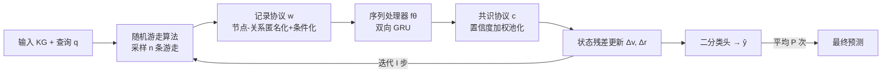

# FLOCK: A Knowledge Graph Foundation Model via Learning on Random Walks

**会议**: ICLR 2026  
**OpenReview**: [https://openreview.net/forum?id=1cGOCIOKQd](https://openreview.net/forum?id=1cGOCIOKQd)  
**代码**: [https://github.com/jw9730/flock](https://github.com/jw9730/flock)  
**领域**: 图学习 / 知识图谱基础模型  
**关键词**: 知识图谱基础模型, 零样本链接预测, 随机游走, 概率等变性, 序列模型  

## 一句话总结
FLOCK 用"采样随机游走→匿名化成序列→序列模型编码→共识池化"的范式替代了知识图谱基础模型（KGFM）惯用的消息传递与确定性等变约束，靠**概率性节点-关系等变**在保住跨图泛化的同时打破对称、区分"结构同构但语义相反"的关系，是 link-invariant 函数的通用逼近器，在 54 个 KG 上取得 SOTA。

## 研究背景与动机
**领域现状**：知识图谱基础模型（KGFM，如 ULTRA、TRIX、MOTIF）要解决的是零样本链接预测——在训练时完全没见过的新实体、新关系类型上推断缺失的边。它们的核心归纳偏置是**双重等变（double equivariance）**：模型对实体置换和关系置换都等变，由此学到可跨图迁移的"结构不变量"（节点和关系的结构属性），即使新图的关系词表完全不同也能用。

**现有痛点**：这种"确定性等变"暗含一个被默认接受却有问题的假设——**结构同构 ⟹ 语义等价**。论文用 Star Wars 的例子点破：`like` 和 `dislike` 在图结构上完全同构，但语义恰好相反；任何计算关系不变量的 KGFM 都被迫给这两个关系赋予完全相同的表示，于是丧失了区分"喜欢谁/讨厌谁"的能力。更糟的是，这是**架构层面的表达力缺陷，微调救不了**，直接限制了 KGFM 的下游可用性。

**核心矛盾**：等变性既是 KGFM 能泛化到新图的根基，又是它无法区分语义相异的同构关系的枷锁。如何同时拥有"强表达力"和"对泛化正确的归纳偏置"？

**本文目标**：设计一个既表达力强、又保有跨图泛化归纳偏置的 KGFM。

**核心 idea**：**用概率性等变替代确定性等变**——不再硬性要求"结构同构的关系必须有相同表示"，而只要求它们在模型随机预测过程下**分布上等价**（invariant in probability）。这样泛化所需的归纳偏置仍在，而每一次前向的随机性又能在推理时打破对称，给结构相同但语义不同的关系分配不同表示。落地手段就是**随机游走 + 序列模型**：游走天然带来"分布等变"的随机性，匿名化后只留结构信息，序列模型可做到通用逼近。

## 方法详解

### 整体框架
FLOCK 是一个随机化函数 $X_\theta(G, q)$，输入知识图谱 $G=(V,E,R)$ 和查询 $q$（实体预测 $(h,r,?)$ 或关系预测 $(h,?,t)$），输出一个随机变量 $\hat y$。它维护两张隐状态查找表 $v: V\to\mathbb{R}^d$、$r: R\to\mathbb{R}^d$，从训练好的初始值出发**残差地迭代更新** $I$ 步，最后过二分类头打分。测试时对 $P$ 次独立随机预测取平均做 ensemble，降方差、提性能。每一步更新由四个组件串成的随机函数 $\text{update}_\theta$ 完成——**整条链路完全不用消息传递**，随机游走是唯一的随机性来源。

### 关键设计

**1. 概率性等变作为归纳偏置：松绑"同构必同表示"的硬约束。** 这是全文的理论支点。传统 KGFM 要求 $G\simeq G'$ 时表示严格相等；FLOCK 只要求随机模型 $\phi$ 满足 $G\simeq G' \Rightarrow \phi(G)\overset{d}{=}\phi(G')$，即两图诱导的输出**分布相同**（自然也有 $\mathbb{E}[\phi(G)]=\mathbb{E}[\phi(G')]$）。分布相等保留了"同构图行为一致"的泛化偏置，而单次前向的随机性允许它对同一 petal 内的两个同构关系采样出不同的游走、给出不同的瞬时表示，从而在期望意义不变的前提下打破对称。论文证明：只要游走采样、记录协议、共识协议各自满足（概率）不变，三者复合后 FLOCK 整体就是 invariant in probability（Prop. 4.2/4.3），与序列处理器 $f_\theta$ 的具体选择无关。

**2. 概率不变的随机游走 + 多样化起点 + 测试时自适应游走数。** 游走是连接性"重写"成序列的载体，也是概率等变的来源。FLOCK 用带**非回溯（non-backtracking）**的均匀游走（针对 KG 有向多重边做了改造），并证明这种采样是 invariant in probability。为了既抓住查询局部上下文、又覆盖全图，它**多样化起点**：实体预测查询 $(h,r,?)$ 共采 $3n$ 条游走——$n$ 条从查询头节点 $h$ 出发抓局部、$n$ 条从随机边 $(v,s,u)$ 出发广覆盖关系、$n$ 条从随机节点出发广覆盖区域；关系预测再加 $n$ 条从尾节点 $t$ 出发，共 $4n$ 条。游走数 $n$ 在预训练时固定为 $n_{\text{train}}$，但测试时按图规模**自适应缩放**：

$$n = n_{\text{train}} \times \text{harmonic\_mean}\!\left(\frac{|V|}{|V|_{\text{train}}},\ \frac{|E|}{|E|_{\text{train}}}\right)$$

大图多采游走保覆盖率、小图少采减冗余，使测试时的"访问率/覆盖率"贴近预训练分布，消融显示三个 split 上都涨点。

**3. 节点-关系匿名化的记录协议：只留结构、附带状态与查询条件。** 原始游走暴露了具体节点/关系 ID，会阻碍迁移到新图。记录协议 $w:\eta_j\mapsto z_j$ 把每条游走转成图无关序列——为节点和关系**分设命名空间**，按发现顺序赋唯一名（节点用 $1,2,3,\dots$，关系用 $\alpha,\beta,\dots$，$(\cdot)^{-1}$ 标方向），例如 $v_0\xrightarrow{r_1}v_1\xrightarrow{r_2}v_2\xrightarrow{r_1^{-1}}v_0$ 被记为 $1\xrightarrow{\alpha}2\xrightarrow{\beta}3\xrightarrow{\alpha^{-1}}1$。同时把当前隐状态 $v(\cdot),r(\cdot)$ 与查询的指示函数 $\mathbb{1}_h,\mathbb{1}_r$（标注查询头/查询关系所在位置，类似 labeling trick）拼进序列。这样既隐藏了具体身份保住不变性，又保留了结构角色与查询条件信息。

**4. 序列处理器 + 置信度加权的共识协议。** 匿名序列 $z$ 只含结构信息，可安全交给任意网络——FLOCK 选**双向 GRU**（配 RMSNorm 与 SwiGLU FFN）。它在每个游走位置输出更新提案 $\Delta v_s,\Delta r_s$ 以及对应**置信度** $a_s,b_s$，把"提案"和"该提案多可信"解耦（比如游走走进 cycle 区域置信度高、走到悬挂 dangling 区域置信度低）。共识协议 $c$ 收集所有游走对同一节点/关系的提案，做**多头 softmax 归一化加权平均**：

$$\Delta v(v) = \Big[\sum \exp(a_s)\odot\Delta v_s\Big]\oslash \sum\exp(a_s),\quad \Delta r(r) = \Big[\sum \exp(b_s)\odot\Delta r_s\Big]\oslash\sum\exp(b_s)$$

置信度间形成竞争，自然压制 dangling 区域等无信息提案（思想类似 Slot Attention 的 Locatello et al. 2020）。理论上，凭"足够长的游走以高概率覆盖全图、匿名序列可还原图（同构意义下）+ 足够强的序列处理器"，FLOCK 是 link-invariant 函数的**通用逼近器**（Prop. 4.1）。

## 实验关键数据

### 主实验表格
诊断数据集 PETALS（220 个实例，每个含中心节点 + stem + 多个语义对立的 petal，要求区分同构但非同构链接）：

| 模型 | PETALS 准确率 |
|---|---|
| ULTRA | 50%（随机猜） |
| MOTIF(F3_Path) | 50% |
| TRIX | 50% |
| **FLOCK** | **100%** |

54 个 KG 上的实体预测（平均 MRR / Hits@10）：

| 模型 | Total Avg MRR | Total Avg H@10 |
|---|---|---|
| ULTRA (zero-shot) | 0.366 | 0.518 |
| TRIX (zero-shot) | 0.390 | 0.548 |
| **FLOCK (zero-shot)** | **0.391** | **0.560** |
| ULTRA (finetuned) | 0.408 | 0.562 |
| TRIX (finetuned) | 0.418 | 0.569 |
| **FLOCK (finetuned)** | **0.427** | **0.582** |

54 个 KG 上的关系预测（平均 MRR / Hits@1），FLOCK 优势巨大：

| 模型 | Total Avg MRR | Total Avg H@1 |
|---|---|---|
| ULTRA (zero-shot) | 0.724 | 0.613 |
| TRIX (zero-shot) | 0.792 | 0.687 |
| **FLOCK (zero-shot)** | **0.881** | **0.817** |
| TRIX (finetuned) | 0.804 | 0.706 |
| **FLOCK (finetuned)** | **0.907** | **0.851** |

零样本关系预测相对最强基线 TRIX 提升 **11.2% MRR**，微调后再提升至 12.8%；归因于序列编码器对实体和关系的**联合更新**（ULTRA/TRIX 分两套网络分别更新）。

### 消融实验表格
自适应测试时游走数（zero-shot 实体预测）：

| Split | FLOCK (自适应 n) MRR | w/o 自适应 (n=128) MRR |
|---|---|---|
| Inductive e, r | **0.369** (n≈28) | 0.357 |
| Inductive e | **0.456** (n≈18) | 0.441 |
| Transductive | **0.340** (n≈214) | 0.334 |

组件消融（46 图平均 MRR）：去多样化起点 0.385、用 transformer 替代 GRU 仅 0.359、$\ell=128$ 默认 0.395；非回溯主要在 transductive 上有用（0.360 vs 0.334）。

### 关键发现
- **PETALS 上 FLOCK 唯一做到 100%**，确定性等变的 KGFM 全部停在 50%，实证了表达力差距。
- 在 Metafam（语义冲突/组合关系数据集）上，FLOCK 零样本 MRR 约为 ULTRA 的两倍、比 TRIX 高约 40%。
- **清晰的 scaling 行为**：泛化随预训练 KG 数量单调提升；测试时 ensemble 从 1→8 次显著提升、12 次后趋于饱和。
- FLOCK 偏好**稀疏图**（随机游走覆盖更快）；在更大的 transductive 图上微调时偶有不及消息传递（游走可能没完全覆盖目标节点）。

## 亮点与洞察
- **把"确定性等变"这条 KGFM 默认信条本身当作靶子**，指出"结构同构⟹语义等价"是表达力天花板，并给出"概率等变"这一既保泛化又增表达力的优雅破解，理论动机干净。
- **彻底抛弃消息传递与"先编码关系再编码节点"的两阶段范式**，改成单一序列编码同时处理节点和关系，绕开 MPNN 在 KG 上被 1-WL 限制的表达力问题，还顺带拿到通用逼近性证明。
- 随机性不是 trick 而是**带证明的设计**：游走/记录/共识三组件各自不变，复合后整体 invariant in probability，且与序列处理器无关，理论与工程解耦得很干净。
- **测试时自适应游走数**和 ensemble 平均都是低成本、即插即用的推理增益，体现了"随机模型的分布估计"视角。

## 局限与展望
- **覆盖率依赖采样**：在大而稠密的 transductive 图上，随机游走可能覆盖不全目标节点邻域，微调时偶尔不敌保证全邻域覆盖的消息传递方法；FLOCK 明显更适合稀疏图。
- **计算/内存代价**：每查询要采 $3n\sim4n$ 条游走、$P$ 次 ensemble、$I$ 步迭代，$n$ 在大图上被自适应放大（transductive 平均 n≈214），需 clamp 到 2 的幂并设上限防 OOM，推理开销不轻。
- **通用逼近是渐近结论**，依赖"足够长游走 + 足够强序列处理器"，实际 $\ell$ 受限（$\ell=256$ 反而掉点），理论上界与实测之间仍有差距。
- 序列处理器目前是 GRU；消融显示 transformer 反而更差，更强序列模型/更优游走策略对该框架的潜力尚待探索。

## 相关工作与启发
- **KGFM 谱系**：从 InGram、ULTRA 到更具表达力的 TRIX、做到全归纳的 KG-ICL、强调节点-关系等变的 ISDEA/MTDEA、给出表达力分析的 MOTIF——FLOCK 是首个不用任何消息传递、靠随机游走 + 序列模型达成通用逼近的随机化 KGFM。
- **图随机游走传统**：DeepWalk/node2vec 把游走当句子、CRaWL 用卷积处理游走集合、RWNN/RUM 匿名化游走 + 序列网络、NeuralWalker 把游走编码塞进消息传递——FLOCK 把"匿名游走 + 序列网络"的成功从普通图迁移并扩展到 KG（节点-关系双命名空间匿名化）。
- **概率不变性**：噪声注入（Abboud et al.）、丢点、子图采样、动态重连等都用随机性突破 1-WL 表达力上限同时保概率不变——本文把这一线索系统地引入 KG，并给出分布不变的完整证明。
- **启发**：当"等变/对称"约束反成表达力枷锁时，"分布上等变 + 推理时随机打破对称"是一个普适的设计模式，值得迁移到其他需要区分"同构但语义不同"实体的结构化预测任务。

## 评分
- **新颖性**: ⭐⭐⭐⭐⭐ 把 KGFM 的核心信条"确定性等变"识别为表达力缺陷，提出概率等变并用随机游走 + 序列模型彻底重构 KGFM 范式，理论与架构都很新。
- **实验充分度**: ⭐⭐⭐⭐ 54 个 KG + 诊断数据集 PETALS + scaling/ensemble/组件多维消融，覆盖全面；transductive 大图上的劣势也如实报告。
- **写作质量**: ⭐⭐⭐⭐⭐ 用 Star Wars `like`/`dislike` 例子点破核心矛盾，四组件叙述清晰，理论命题与证明草图配合得当。
- **价值**: ⭐⭐⭐⭐ 在零样本关系预测上大幅刷新 SOTA，提供了 KGFM 表达力的新理论视角和可复现代码，对图基础模型方向有实质推动；推理开销与稠密图覆盖是落地需权衡的点。

<!-- RELATED:START -->

## 相关论文

- [\[ICLR 2026\] HYPER: A Foundation Model for Inductive Link Prediction with Knowledge Hypergraphs](hyper_a_foundation_model_for_inductive_link_prediction_with_knowledge_hypergraph.md)
- [\[ICLR 2026\] HGNet: Scalable Foundation Model for Automated Knowledge Graph Generation from Scientific Literature](hgnet_scalable_foundation_model_for_automated_knowledge_graph_generation_from_sc.md)
- [\[ICLR 2026\] Towards a Foundation Model for Crowdsourced Label Aggregation](towards_a_foundation_model_for_crowdsourced_label_aggregation.md)
- [\[ICLR 2026\] Knowledge Reasoning Language Model: Unifying Knowledge and Language for Inductive Knowledge Graph Reasoning](knowledge_reasoning_language_model_unifying_knowledge_and_language_for_inductive.md)
- [\[ACL 2026\] Evaluating LLMs on Large-Scale Graph Property Estimation via Random Walks](../../ACL2026/graph_learning/evaluating_llms_on_large-scale_graph_property_estimation_via_random_walks.md)

<!-- RELATED:END -->
