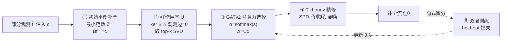

# FlowSymm: Physics–Aware, Symmetry–Preserving Graph Attention for Network Flow Completion

**会议**: ICLR 2026  
**OpenReview**: [https://openreview.net/forum?id=vu1IEpdUQh](https://openreview.net/forum?id=vu1IEpdUQh)  
**代码**: 待确认  
**领域**: 图学习 / 物理信息机器学习  
**关键词**: 网络流补全, 守恒约束, 群作用, 图注意力 (GATv2), 隐式双层优化, Tikhonov 正则  

## 一句话总结
把"缺失流补全"这个反问题拆成两半——先用一组**保持节点守恒、且不动已观测边**的代数群作用张成可行解子空间，再用图注意力在这个物理合法的基里挑选修正方向，最后用一个可微的 Tikhonov 凸求解器吸收噪声，从而在补全缺失流的同时严格不破坏物理守恒律。

## 研究背景与动机
**领域现状**：交通、电网、共享单车等网络系统中，只有一小部分边装了传感器（如交通网仅 38% 边有读数），其余边的流量需要靠模型补全。这类问题在代数上由节点守恒方程 $Bf = c$ 刻画（$B$ 是关联矩阵，$f$ 是边流向量，$c$ 是节点净注入）。

**现有痛点**：纯数据驱动的补全（MLP/GCN）会给出物理上不可能的预测——交叉口流量不守恒、电网违反基尔霍夫定律。已有物理信息方法要么用软惩罚把守恒当成正则项（无法严格保证），要么强行 $Bf=0$ 硬约束（过度限制、无法容噪），要么像前 SOTA Silva et al. (2021) 那样学一个**对角**正则权重——它把每条边独立处理，没法刻画缺失边之间通过拓扑产生的耦合。

**核心矛盾**：既要**严格不修改已观测的传感器读数**（这是硬性运维约束），又要在剩余自由度里灵活探索；既要尊重守恒律，又要能容忍真实传感器的噪声（系统只是近似守恒，不是完美平衡）。

**本文目标**：构造一个映射 $(G,\hat f,c)\mapsto \tilde f_\theta$，同时满足：拟合噪声观测、节点平衡残差小、修正只在"散度为零且不动观测边"的合法子空间里发生、缺失边通过特征而非对角惩罚相互耦合。

**核心 idea**：**把可行的散度修正重新解释为一个 Abelian 群作用**——所有"保持守恒 + 冻结观测边"的流调整构成一个加法交换群；为它构造正交基，再用注意力在基里选方向。这是一种由关联矩阵和传感器掩码共同决定的**代数对称性**，区别于等变 GNN 常处理的旋转/置换等几何对称性。

## 方法详解

### 整体框架
FlowSymm 是一条五步流水线：先把部分观测锚定到最近的守恒流（initial completion），再构造散度自由的群作用基（group-action basis），用堆叠 GATv2 编码图、给每个基向量打注意力分并加权组合（attention selection），最后用一个特征条件的 Tikhonov 凸求解器精修以吸收噪声（refinement），全部参数通过隐式双层优化端到端训练。整条管线的关键不变量是：前三步保证 $Bf=c$ 且观测边纹丝不动，第四步才允许一个小的、可学的守恒违反量来容噪。

### 关键设计

**1. 最小范数平衡锚点：把后续所有修正限制在物理流形内。** 第一步先求一个临时的完整流 $f^{(0)} = \hat f + S_{\text{miss}}^\top \delta^{(0)}$，其中缺失部分通过 Moore–Penrose 伪逆取最小范数解 $\delta^{(0)} = B_{\text{miss}}^\top (B_{\text{miss}}B_{\text{miss}}^\top)^\dagger (c - B_{\text{obs}}\hat f_{\text{obs}})$。这个锚点严格满足 $Bf^{(0)}=c$ 且完全不动观测边，实现上用 QR/SVD 的稳定最小二乘处理可能的秩亏。选最小范数是为了避免在缺失边上引入不必要的大调整——它给后续学习提供了一个落在平衡流形 $\mathcal F_{\text{bal}}(c)=\{f: Bf=c\}$ 上的干净起点。

**2. Abelian 群作用基：用代数对称性张成合法修正空间。** 所有"散度为零且在观测边上恒为零"的调整构成集合 $\mathcal A = \{u\in\mathbb R^m : Bu=0,\ u_e=0\ \forall e\in E_{\text{obs}}\}$，它在向量加法下是一个 Abelian 群，作用于平衡流为 $g_\alpha: f\mapsto f + U\alpha$。这里 $U$ 是 $\mathcal A$ 的列正交基，恒等元对应 $\alpha=0$，复合满足 $g_\alpha\circ g_\beta = g_{\alpha+\beta}$，可逆性由 $g_\alpha^{-1}=g_{-\alpha}$ 给出。构造上先用投影算子 $P_{\text{bal}} = I_m - B^\dagger B$ 投到 $\ker B$，再减去违反传感器不变性的分量得到 $P_{\mathcal A} = P_{\text{bal}} - P_{\text{bal}}S_{\text{obs}}^\top (S_{\text{obs}}P_{\text{bal}}S_{\text{obs}}^\top)^\dagger S_{\text{obs}}P_{\text{bal}}$，最后取其值域 SVD 的前 $k$ 个奇异向量作为 $U$，从而保证 $BU=0$ 且 $S_{\text{obs}}U=0$。子空间维度为 $r = m_{\text{miss}} - \text{rank}(B_{\text{miss}})$，实验中截断到 $k=256$ 即足够，使得计算量随缺失边数线性增长。注意模型学的是这些**有序物理模态**的权重，因此对基的任意旋转并不不变。

**3. 注意力引导的群作用选择：让局部特征决定全局修正落在哪。** 用 $L=2$ 层 GATv2 把边特征 $X$ 编码成逐边嵌入 $H\in\mathbb R^{m\times d'}$，对每条缺失边 $e$ 和每个基向量 $i$ 算一个兼容性分数 $q_{e,i} = (w_i^\top H_e)\,|u_e^{(i)}|$——因子 $|u_e^{(i)}|$ 调制该基作用在边 $e$ 上的强度，并压低那些根本不触及 $e$ 的基。把分数对缺失边求平均聚合成 $s_i = \frac{1}{m_{\text{miss}}}\sum_{e\in E_{\text{miss}}} q_{e,i}$，再 softmax 得到 $\alpha_\theta = \text{softmax}(s)$。最终修正 $\Delta = U\alpha_\theta$，候选流 $f^{\text{cand}}_\theta = f^{(0)} + \Delta$。由于每个 $u^{(i)}\in\ker B$ 且在观测边上为零，候选流仍满足 $Bf^{\text{cand}}_\theta=c$ 和 $S_{\text{obs}}f^{\text{cand}}_\theta=\hat f_{\text{obs}}$。学到的注意力分布高度稀疏——尽管每个基都有权重，质量集中在少数几个基上，意味着模型只挑了一小撮关键群作用。这正是它区别于前作对角正则的地方：通过对物理可解释基作用的上下文权重，把缺失边耦合起来，而不是逐边独立处理。

**4. 特征条件 Tikhonov 精修 + 隐式双层训练：容噪 + 端到端学超参。** 前三步给出严格平衡的候选，但真实传感器有噪声，故允许缺失边上一个受控的小偏移。噪声观测隐含一个经验失衡 $\hat c := B_{\text{obs}}\hat f_{\text{obs}}$，精修求解强凸目标 $\delta^{\text{tik}}_\theta = \arg\min_\delta \|B_{\text{miss}}\delta + B_{\text{obs}}f^{\text{cand,obs}}_\theta - \hat c\|_2^2 + \lambda\|\delta - \delta^{\text{attn}}_\theta\|_2^2$，即在"降低经验散度残差"与"贴近注意力候选"之间权衡。其闭式解来自 SPD 正规方程 $(B_{\text{miss}}^\top B_{\text{miss}} + \lambda I)\delta^{\text{tik}}_\theta = \lambda\delta^{\text{attn}}_\theta - B_{\text{miss}}^\top(B_{\text{obs}}f^{\text{cand,obs}}_\theta - \hat c)$，用 Cholesky（或 CG）求解。所有参数 $\theta=(\text{GATv2 权重},\lambda)$ 通过 10-fold held-out 验证损失 $L_{\text{val}}$ 端到端训练——关键在于不展开求解器迭代，而是用反向模式**隐式微分**：每折解一个伴随系统就得到精确超梯度，每次外层更新只需两次 SPD 求解（一次前向一次伴随），内层强凸性保证了梯度稳定且内存开销极小。

## 实验关键数据

### 主实验（10-fold 边留出，held-out 边上的 RMSE/MAE/CORR）

三个真实流网络：Traffic（洛杉矶路网，$n{=}5749$, $m{=}7498$，38% 边有读数）、Power（欧洲输电网 PyPSA-Eur，$n{=}2048$, $m{=}2729$）、Bike（Citi Bike 微出行图，$n{=}1966$, $m{=}2647$）。对比 9 个基线。

| Method | Traffic RMSE | Traffic MAE | Power RMSE | Power MAE | Bike RMSE | Bike MAE |
|---|---|---|---|---|---|---|
| Div | 0.071 | 0.041 | 0.036 | 0.018 | 0.039 | 0.018 |
| GCN | 0.066 | 0.040 | 0.067 | 0.045 | 0.057 | 0.039 |
| EGNN | 0.065 | 0.036 | 0.065 | 0.043 | 0.063 | 0.038 |
| Bil-MLP | 0.069 | 0.038 | 0.029 | 0.011 | 0.033 | 0.016 |
| **Bil-GCN**(前SOTA) | 0.062 | 0.034 | 0.029 | 0.011 | 0.032 | 0.016 |
| **FlowSymm** | **0.057** | **0.028** | **0.026** | **0.010** | **0.029** | **0.014** |

相对前 SOTA Bil-GCN：RMSE 降约 8%(Traffic)/10%(Power)/9%(Bike)，MAE 降最高 16%，CORR 最高提升 0.04（Traffic 0.82→0.85，Power 0.94→0.96，Bike 0.93→0.95）。

### 消融实验（held-out RMSE）

| Variant | Traffic | Power | Bike |
|---|---|---|---|
| FlowSymm (k=64) | 0.060 | 0.029 | 0.031 |
| FlowSymm (k=128) | 0.058 | 0.028 | 0.030 |
| **FlowSymm (k=256)** | **0.057** | **0.026** | **0.029** |
| FlowSymm (k=512) | 0.057 | 0.026 | 0.029 |
| Bil-GAT（去群作用） | 0.062 | 0.029 | 0.032 |
| No-attention (k=256) | 0.060 | 0.029 | 0.031 |
| GAT（去双层/隐式） | 0.067 | 0.065 | 0.062 |

### 关键发现
- **基大小 $k$ 在 256 处饱和**：64→256 误差稳步下降，再增到 512 无收益但徒增内存，说明几百个群作用已覆盖主要散度自由度。
- **群作用模块不可或缺**：去掉它（Bil-GAT）三数据集 RMSE 一致变差，证明物理对称约束确实带来精度增益。
- **注意力的价值**：用均匀随机权重替代学习注意力，RMSE 涨 +5%(Traffic)/+11.5%(Power)/+6.8%(Bike)。
- **双层/隐式微分是性能命脉**：去掉后（GAT）Power/Bike 上 RMSE 翻倍式恶化（0.026→0.065）。

## 亮点与洞察
- **把"补全"重构成"在物理合法子空间里做元搜索"**：先枚举一个守恒律保证下的截断基，再用注意力在基里导航，这个 framing 很优雅——修正天然落在 $\ker B$ 内，每个高分群作用都可解释为"尊重物理律的流再分配"。
- **代数对称 vs 几何对称的明确区分**：等变 GNN（EGNN/SE(3)）处理旋转平移，而流补全需要的是由关联矩阵+传感器掩码定义的代数对称——论文实验也显示 EGNN 在这个任务上并无优势，佐证了这个洞见。
- **严格满足硬运维约束**：观测边永不被改动，这是真实部署里的刚性需求，本方法 by design 保证，同时仍能在丰富的散度自由子空间里探索。
- **可微凸求解器 + 隐式微分**：内层强凸保证梯度稳定、内存省（不展开迭代），把"学超参 $\lambda$"和"学注意力"统一进端到端训练。

## 局限与展望
- **单帧静态图**：不建模时间动态，扩展到时序需引入循环编码器或时间耦合群作用。
- **基大小的可扩展性**：$k=256$ 在本文图上够用，但超大或高度环状的网络可能需要更多基向量，内存随之上涨，需自适应选择策略。
- **掩码偏置敏感**：用随机边留出协议，若真实传感器放置有系统性偏置（如集中在市中心），性能可能在不同掩码下退化。
- **自由度可能高估**：当未观测环路完全由已知注入决定时，基构造可能高估自由度（注意力机制部分缓解了这点）。
- **双层训练非凸**：内层凸但整体双层训练非凸，可能陷入次优局部最优，超参初始化与调优重要。
- **未来工作**：联合推断净注入 $c$（放松已知注入假设）、引入时序建模。

## 相关工作与启发
- **物理信息 ML**：Silva et al. (2021) 学边特定对角正则权重（前 SOTA），Mi et al. (2025) 把守恒嵌进消息传递规则——本文用群作用基替代对角正则，刻画了缺失边的耦合。
- **群等变 GNN**：EGNN、SE(3)-Transformer、NequIP、Tensor Field Networks 编码旋转/平移/置换等**几何**对称；本文转向由约束和掩码定义的**代数**对称，是一个互补方向。
- **隐式微分 / 双层优化**：经典隐式微分（Domke 2012, Franceschi et al. 2017/2018）让梯度穿过优化层而不展开迭代；本文把它用在 Tikhonov SPD 求解器上换取精确超梯度。
- **启发**：当任务带有可由线性约束精确刻画的硬结构时，"先构造满足约束的解子空间正交基，再让神经网络在基系数上学权重"是一种通用且可解释的范式，值得迁移到其它带守恒/平衡约束的反问题（电路、流体、供应链）。

## 评分
- **新颖性**: ⭐⭐⭐⭐ — 把流补全重构为 Abelian 群作用上的注意力元搜索，明确区分代数对称与几何对称，构造干净且 motivated。
- **实验充分度**: ⭐⭐⭐⭐ — 三个跨域真实数据集、9 个基线、四组消融（基大小/群作用/注意力/双层），结论闭环；但数据集规模偏小且公开基准稀缺。
- **写作质量**: ⭐⭐⭐⭐ — 数学推导严谨、流水线清晰、四条设计原则贯穿全文，符号偏多但有附录符号表。
- **价值**: ⭐⭐⭐⭐ — 在交通/电网/微出行三个有实际意义的领域稳定超越前 SOTA，且严格保物理约束，对带守恒律的工业反问题有可迁移的方法论价值。

<!-- RELATED:START -->

## 相关论文

- [\[ICLR 2026\] Topological Flow Matching](topological_flow_matching.md)
- [\[ICLR 2026\] Confident Block Diagonal Structure-Aware Invariable Graph Completion for Incomplete Multi-view Clustering](confident_block_diagonal_structure-aware_invariable_graph_completion_for_incompl.md)
- [\[ICLR 2026\] Latent Geometry-Driven Network Automata for Complex Network Dismantling](latent_geometry-driven_network_automata_for_complex_network_dismantling.md)
- [\[ICLR 2026\] Bures-Wasserstein Flow Matching for Graph Generation](bures-wasserstein_flow_matching_for_graph_generation.md)
- [\[ICLR 2026\] LRIM: a Physics-Based Benchmark for Provably Evaluating Long-Range Capabilities in Graph Learning](lrim_a_physics-based_benchmark_for_provably_evaluating_long-range_capabilities_i.md)

<!-- RELATED:END -->
