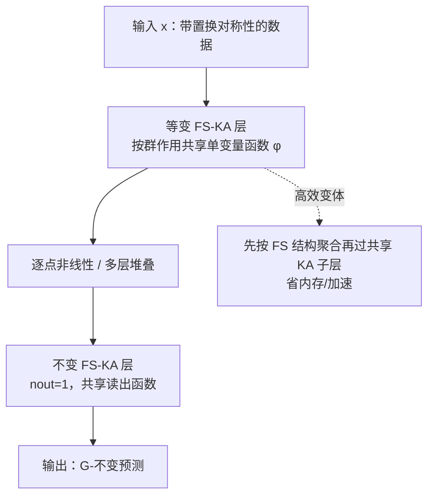

# FS-KAN: Permutation Equivariant Kolmogorov-Arnold Networks via Function Sharing

**会议**: ICLR 2026  
**OpenReview**: [https://openreview.net/forum?id=l4m4HK6gJN](https://openreview.net/forum?id=l4m4HK6gJN)  
**代码**: 待确认  
**领域**: 几何深度学习 / 等变网络 / Kolmogorov-Arnold Networks  
**关键词**: 置换等变, Kolmogorov-Arnold Networks, 参数共享, 函数共享, DeepSets, 数据高效  

## 一句话总结
把等变网络里经典的"参数共享"方案推广到 KAN 上，提出按群作用**共享可学习单变量函数**（而非标量权重）的 FS-KAN，统一了已有各种等变 KAN，并证明其表达力与参数共享 MLP 等价，从而在低数据场景下取得显著更高的样本效率。

## 研究背景与动机

**领域现状**：在数据带有对称性（集合、图、图像、点云、用户-物品矩阵等）的任务上，等变网络是主流。构造等变性的最通用、最可扩展的办法是 Wood & Shawe-Taylor 提出的**参数共享（parameter-sharing）方案**——让线性层的权重按群作用绑定在一起（如卷积的循环矩阵对应循环群 $C_n$、DeepSets 对应 $S_n$）。与此同时，Kolmogorov-Arnold Networks (KAN) 把 MLP 中的标量权重换成可学习的单变量函数 $\phi$，带来了更好的可解释性、参数效率和表达力。

**现有痛点**：已有工作只为**少数特定数据类型**做出了等变 KAN（Graph-KAN 用于图、PointNet-KAN 用于集合、Convolutional-KAN 用于图像），彼此孤立、各自为政；最近 Hu et al. (2025) 处理连续群但需要数值求解等变层、且无法处理变长输入（集合/图）。一句话：**缺一个能对任意置换对称群构造等变 KAN 层的统一原则性框架**。诸如多重集交互、带对称元素的集合、权重空间、层级结构、高阶关系数据等大量重要数据类型还完全没有对应的等变 KAN。

**核心矛盾**：参数共享方案的"共享对象"是标量权重，而 KAN 的基本单元是函数——如何把"共享权重"自然地推广成"共享函数"，并保证这样做不会损失表达力，是把成熟的等变理论搬到 KAN 上的关键缺口。

**本文目标**：给出一个对**任意置换子群 $G \le S_n$** 都成立的等变/不变 KA 层构造法，统一并显著扩展已有等变 KAN，并从理论上把参数共享网络的表达力结论一并迁移过来。

**核心 idea**：**函数共享（Function Sharing）** —— 把"权重按群作用绑定"直接升级为"**单变量函数按群作用绑定**"，即约束 $\phi_{q,p}=\phi_{\sigma(q),\sigma(p)}$。

## 方法详解

### 整体框架
一个 KA 层写成函数矩阵作用在输入向量上：$\Phi(x)_q=\sum_{p}\phi_{q,p}(x_p)$。FS-KAN 的核心是给这个函数矩阵施加和参数共享一模一样的"按群绑定"约束，只不过绑定的是整条单变量函数而非一个标量。在此基础上，论文给出不变层、多通道、效率优化三个层面的具体构造，并把它实例化到集合（$S_n$）、直积群（$G\times H$，如图像、用户-物品）、高阶张量（图/超图）三类典型对称性。

### 关键设计

**1. 函数共享约束：把"参数绑定"升级成"函数绑定"。** 对参数共享的等变线性层，权重需满足 $W_{i,j}=W_{\sigma(i),\sigma(j)}$。FS-KAN 把它平移到函数层面：一个 $n\times n$ 的 KA 层是 $G$-等变 FS-KA 层，当且仅当 $\phi_{q,p}=\phi_{\sigma(q),\sigma(p)},\ \forall \sigma\in G$（Prop. 1）。直观上，循环群下的 FS-KA 层在矩阵形式上就是一个"函数版循环矩阵"，和 1D 卷积的循环结构一一对应。对不变层（$n_{out}=1$）则退化为 $\phi_p=\phi_{\sigma(p)}$（Prop. 3）。一个值得强调的微妙之处是：等变 KA 层**未必**天然是 FS 结构的——论文给了一个 $S_2$ 等变层的反例，两个不同写法算出同一函数但只有其一是 FS 层；不过 Prop. 2/4 证明**任何**等变（不变）KA 层都存在一个等价的 FS 层表示。这条"无损归约"是整套理论的地基，它让我们在设计等变 KAN 时可以**只考虑 FS 层而不损失一般性**。

**2. 多通道下的"内外两级共享"。** 真实数据往往每个元素带多维特征（如图像的颜色通道）。此时把每个 $\Phi_{q,p}:\mathbb{R}^{d_{in}}\to\mathbb{R}^{d_{out}}$ 本身做成一个小 KA 子层，整层就成了 $n\times n$ 的 KA 子层矩阵（Prop. 5）。共享发生在两个层级：子层之间按群作用**外部共享**（$\hat\Phi_{q,p}=\hat\Phi_{\sigma(q),\sigma(p)}$），子层内部的函数再按对应位置**内部共享**。这与多通道等变线性层的共享方案完全对齐——例如 $S_n$ 情形下层结构正好写成 $\Phi(x)_q=\Phi_1(x_q)+\sum_{p\ne q}\Phi_2(x_p)$，这就是 DeepSets 层的 KAN 版，也正是 PointNet-KAN 的推广；$G\times H$ 直积群（图像、用户-物品矩阵）则表现为"外部按 $G$ 共享子层、内部按 $H$ 共享函数"的嵌套结构；高阶张量（图的二阶邻接、超图）通过对张量下标 $\sigma(i)=(\sigma(i_1),\dots,\sigma(i_k))$ 施加同样的绑定即可推广，从而可构造出对标 $k$-IGN 的表达力。

**3. 高效 FS-KA 层：把聚合与非线性对调。** 标准 KA 层对所有输入-输出对独立施加函数，计算和显存开销大。借鉴线性层里"求和池化可与矩阵乘法交换次序"的技巧，论文提出**先按 FS 结构聚合、再过一个共享 KA 子层**。以 $S_n$ 等变层为例，高效变体计算 $\tilde\Phi(x)_q=\tilde\Phi_1(x_q)+\tilde\Phi_2\big(\sum_{p=1}^n x_p\big)$——第二项对全集只需算一次再广播复用。代价是它不再与原层严格等价（是一种松弛），但**参数量不变、等变性保持**，且训练时计算图更小、显存更省。对任意群 $G$，高效层都按"把元素聚合（sum/mean 池化）与共享函数应用交换次序"这一原则导出，效率由群结构决定。

**4. 表达力等价定理：搭起 KAN 与参数共享网络之间的桥。** 论文证明在均匀逼近意义下，对给定置换群 $G$，FS-KAN 与参数共享 MLP **表达力等价**：一方面任何参数共享 MLP（$l$ 层、ReLU）都能被至多 $2l$ 层的样条 FS-KAN **精确实现**（Prop. 6，利用"MLP 层可由两个 KA 层——仿射 + 逐点 ReLU——实现"）；另一方面任何 FS-KAN 也能被参数共享 MLP **任意精度逼近**（Prop. 7）。这条等价的威力在于**直接迁移已有结论**（Cor. 4.1）：FS-KAN 因此继承了 CNN 的平移等变万能逼近、DeepSets 对集合置换不变函数的万能性，高阶 FS-KAN 对任意 $G\le S_n$ 不变函数的万能性，以及图上 $k$-阶 FS-KAN 等同于 $k$-IGN、判别力达到 $k$-WL 的结论。

## 实验关键数据

### 主实验设置与结果
在三类对称性任务上对比 FS-KAN / 高效 FS-KAN 与参数共享 MLP 基线（尽量对齐参数量）：

| 任务 | 对称群 | 数据集 | 基线 | 关键结论 |
|------|--------|--------|------|----------|
| 多测量信号分类 | $S_n\times C_T$ | 合成周期信号（n=25, T=100） | DSS / scaled DSS | 低数据区（60–1200 样本）显著超越，高数据区持平；FS-KAN 仅 3e4 参数 vs DSS 3e6 |
| 点云分类 | $S_n$ | ModelNet40（无增广） | DeepSets / Point Transformer / 非等变 KAN | 样本数与点数都受限时全面领先；非等变 KAN 表现极差 |
| 半监督评分预测 | $S_n\times S_m$ | MovieLens-100K / Flixster / Douban / Yahoo | SSEM / scaled SSEM | 低数据区 RMSE 更优，数据充足时差距收窄 |

### 持续学习实验（点云，ModelNet40 → 旋转/平移损坏版）

| Train Size | Model | Forgetting ↓ | Avg Acc ↑ |
|-----------|-------|--------------|-----------|
| 200 | **FS-KAN** | **0.034** | **0.420** |
| 200 | Efficient FS-KAN | 0.040 | 0.395 |
| 200 | DeepSets | 0.059 | 0.380 |
| 600 | **FS-KAN** | 0.045 | **0.501** |
| 600 | DeepSets | 0.055 | 0.475 |
| 800 | **FS-KAN** | 0.038 | **0.535** |
| 800 | DeepSets | 0.036 | 0.516 |
| 1000 | FS-KAN | 0.040 | 0.553 |
| 1000 | DeepSets | 0.027 | **0.555** |

FS-KAN 在低数据区遗忘更少、平均精度更高；数据充足（1000）时与 DeepSets 持平。

### 关键发现
- **数据效率是核心卖点**：所有任务在低数据区 FS-KAN 都大幅领先参数共享 MLP，且参数量往往低一两个数量级（如信号任务 3e4 vs 3e6）。
- **等变性不可省**：非等变 KAN 在点云上表现"灾难性"地差，印证了把对称性显式编进架构的必要性。
- **可解释性增强**：FS-KAN 在对称边上共享同一条样条函数，使等变结构"可视化即可见"，比标准 KAN 为每条边学独立样条更简洁、更尊重数据对称性。
- **效率仍是短板**：高效变体比完整 FS-KAN 快约 1.4–1.5×，但仍比 DSS/DeepSets 慢（信号任务约慢 4 倍）。

## 亮点与洞察
- **"参数共享 → 函数共享"是一个干净且可推广的概念升级**：只把绑定对象从标量换成函数，就把整个等变深度学习的方法论无缝迁移到了 KAN。
- **理论与统一性并重**：不仅给框架，还用表达力等价定理把 CNN/DeepSets/$k$-IGN/$k$-WL 等一大批经典结论"免费"迁移给 FS-KAN，同时证明已有等变 KAN（PointNet-KAN、Conv-KAN）都是其特例。
- **Prop. 2 的"无损归约"很关键**：等变 KA 层未必天生是 FS 的，但总能等价改写成 FS 层，这让"只设计 FS 层"在理论上站得住脚。
- **定位清晰**：明确把 FS-KAN 推荐为**低数据 + 有对称性**场景下的优选，而非全场景替代 MLP。

## 局限与展望
- **计算成本高**：即便有高效变体，仍比线性参数共享层慢，高数据区尤其明显；作者把"更快的实现"列为重要 future work。
- **理论只覆盖表达力**：泛化能力、优化性质、可扩展性等尚未分析。
- **效率变体非等价**：高效 FS-KA 是松弛而非等价层，虽实验中常更好，但缺乏理论保证其逼近误差。
- **高数据区优势消失**：数据充足时线性模型因训练快反而更可取，FS-KAN 的价值高度依赖"低数据"前提。

## 相关工作与启发
- **参数共享等变网络**（Wood & Shawe-Taylor 1996, Ravanbakhsh 2017, Maron 2019b）：FS-KAN 的直接母体，函数共享是其 KAN 化推广。
- **KAN**（Liu et al. 2024）：用单变量函数替换标量权重的源头；FS-KAN 继承其可解释性/参数效率并叠加对称性。
- **已有等变 KAN**（PointNet-KAN、Graph-KAN、Convolutional-KAN、Hu et al. 2025）：被本框架统一或扩展，且 FS-KAN 能处理变长输入（集合/图）这一它们做不到的点。
- **表达力理论**（DeepSets 万能性、$k$-IGN 与 $k$-WL）：通过等价定理整体迁移，是"把成熟理论搬到新架构"的范例。
- **启发**：当一个新架构（KAN）出现时，与其逐个数据类型重做等变设计，不如找到旧范式里的"共享原语"并证明等价，即可一次性继承整套理论与设计模式。

## 评分
- **新颖性**: ⭐⭐⭐⭐ —— "参数共享→函数共享"的概念升级简洁优雅，且首次给出任意置换群下等变 KAN 的统一框架，统一了多条孤立工作。
- **实验充分度**: ⭐⭐⭐⭐ —— 覆盖集合/直积/高阶三类对称性、四个数据集、含持续学习与可解释性可视化，多种子带误差棒；但都偏中小规模、缺大规模/真实图任务。
- **写作质量**: ⭐⭐⭐⭐ —— 命题—证明思路—示例衔接清晰，图示（循环矩阵/内外共享）直观，理论与实验定位明确。
- **价值**: ⭐⭐⭐⭐ —— 为"对称数据 + 低数据"场景提供了原则化且可解释的新选择，并把等变理论搬进 KAN，蓝图意义强；主要受限于计算效率与高数据区优势收窄。

<!-- RELATED:START -->

## 相关论文

- [\[ICLR 2026\] A Graph Meta-Network for Learning on Kolmogorov–Arnold Networks](a_graph_meta-network_for_learning_on_kolmogorovarnold_networks.md)
- [\[ICML 2025\] GrokFormer: Graph Fourier Kolmogorov-Arnold Transformers](../../ICML2025/graph_learning/grokformer_graph_fourier_kolmogorov-arnold_transformers.md)
- [\[AAAI 2026\] Magnitude-Modulated Equivariant Adapter for Parameter-Efficient Fine-Tuning of Equivariant Graph Neural Networks](../../AAAI2026/graph_learning/magnitude-modulated_equivariant_adapter_for_parameter-efficient_fine-tuning_of_e.md)
- [\[ICLR 2026\] AdS-GNN - a Conformally Equivariant Graph Neural Network](ads-gnn_-_a_conformally_equivariant_graph_neural_network.md)
- [\[AAAI 2026\] BugSweeper: Function-Level Detection of Smart Contract Vulnerabilities Using Graph Neural Networks](../../AAAI2026/graph_learning/bugsweeper_function-level_detection_of_smart_contract_vulnerabilities_using_grap.md)

<!-- RELATED:END -->
