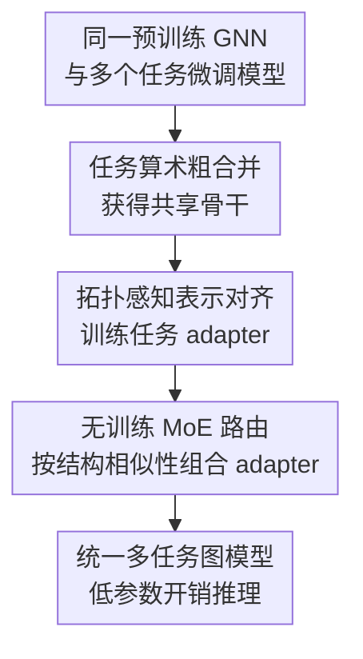

# G-Merging: Graph Models Merging for Parameter-Efficient Multi-Task Knowledge Consolidation

**会议**: ICLR2026  
**OpenReview**: [https://openreview.net/forum?id=FoTtvLkkfU](https://openreview.net/forum?id=FoTtvLkkfU)  
**代码**: https://github.com/cjcj46262/G-Merging  
**领域**: 图学习 / 模型合并 / 参数高效学习  
**关键词**: 图模型合并、GNN、任务算术、拓扑感知Wasserstein距离、MoE路由  

## 一句话总结
G-Merging 面向多任务图学习场景，把多个从同一预训练 GNN 微调得到的任务模型先用任务算术合成共享骨干，再用拓扑感知对齐训练轻量任务适配器，并在推理时用无需训练的 MoE 路由动态组合适配器，从而用接近单模型的参数开销保留多任务知识。

## 研究背景与动机
**领域现状**：图学习里“预训练 GNN + 下游微调”已经很常见，尤其在分子性质预测、生物网络、社交网络这类标注昂贵的任务上，先在大规模图数据上学通用表示，再针对每个任务微调，通常比从零训练更稳。与此同时，视觉和语言模型里兴起的 model merging 希望把多个任务微调模型合成一个多任务模型，避免每个任务部署一整套参数。

**现有痛点**：直接把这套模型合并思想搬到图模型上会遇到两个具体问题。第一，不同图任务的结构分布差异很强，同样是分子图，Tox21、SIDER、ClinTox、HIV、MUV 等数据集在最终层嵌入空间里也会形成明显不同的簇。第二，任务特化模型跨域泛化很差：拿某个任务微调出的 GNN backbone 去替换另一个任务的 backbone，性能常常明显掉下去。这说明图任务里的知识不只是参数空间里可平均的“语义能力”，还包含和图拓扑、节点邻域模式强相关的领域特化表示。

**核心矛盾**：模型合并追求一个统一模型和低存储开销，但图任务又高度依赖任务特定的结构模式。朴素 weight averaging 或 task arithmetic 可以压缩参数，却容易把不同任务的图结构知识相互抵消；而保留每个完整微调模型又失去了合并的意义。

**本文目标**：作者要解决的是图模型合并问题：给定同一个预训练 GNN 初始化出来的 $K$ 个任务微调模型，构造一个统一的多任务图模型，使它不需要从头联合训练，不需要部署 $K$ 个完整 backbone，又尽量保持甚至超过各任务微调模型的性能。

**切入角度**：论文把知识拆成两层：跨任务共享知识可以通过参数合并放进统一骨干，任务独有知识则用轻量 adapter 来补充。关键观察是，图上的表示偏差不能只按节点嵌入向量距离来对齐，还要尊重邻接结构；因此作者把 Wasserstein 距离改造成受图邻接矩阵约束的拓扑感知版本，用它来训练 adapter 和驱动推理期路由。

**核心 idea**：用“任务算术共享骨干 + 拓扑感知 adapter 对齐 + 无训练 MoE 路由”替代单次参数平均，让图模型合并既能压缩参数，又能保留不同图任务的结构特化知识。

## 方法详解

### 整体框架
G-Merging 的输入是一组从同一预训练 GNN $f_{\theta_{pre}}$ 出发、分别在 $K$ 个下游图任务上微调得到的模型 $\{f_{\theta_1},\ldots,f_{\theta_K}\}$。输出不是简单平均后的一个 backbone，而是一个统一 GNN 骨干 $f_{\theta_{uni}}$ 加上一组轻量任务 adapter；推理时，共享骨干负责抽取通用图表示，MoE adapter 根据当前任务和图实例的结构相似性动态补偿任务特化知识。

整个方法可以分成三阶段：先用任务算术把多个微调模型合成统一模型，得到共享知识的主干；再冻结统一模型和各任务微调模型，只训练每个任务自己的 NodeAdapter 与 GraphAdapter，使统一模型的节点级和图级表示贴近对应微调模型；最后在推理期把这些 adapter 组织成 MoE，并用 Topology-aware Wasserstein Distance（TWD）或 $L_1$ 距离计算无参数路由权重。

### 关键设计
**1. 任务算术粗合并：先把可共享的图知识放进统一骨干**

如果一开始就让 adapter 独自修补所有任务知识，统一模型会退回到预训练模型附近，缺少下游任务已经学到的公共模式。G-Merging 因此先采用 task arithmetic：对第 $k$ 个任务，任务向量定义为 $\tau_k=\theta_k-\theta_{pre}$，表示从预训练模型到该任务微调模型的参数位移；统一模型参数为 $\theta_{uni}=\theta_{pre}+\lambda\sum_{k=1}^{K}\tau_k$。当 $\lambda=1/K$ 时它退化成近似的权重平均，而调节 $\lambda$ 可以控制预训练知识与任务知识的比例。

这个阶段解决的是“共享知识放哪里”的问题。图任务虽然结构差异大，但许多底层 GNN 表示能力、分子子结构模式和图分类判别特征仍然可共享；先用任务算术形成一个统一 backbone，相当于给后续 adapter 一个比原始预训练模型更接近多任务分布的起点。消融也支持这一点：跳过参数合并、直接以 $\theta_{pre}$ 作为统一模型时，平均 ROC-AUC 从完整 G-Merging 的 74.2 降到 72.2，说明共享骨干不是可有可无的初始化。

**2. 拓扑感知表示对齐：用 TWD 训练 adapter 修正图结构偏差**

粗合并后的统一模型仍然会和每个任务微调模型存在表示偏差，尤其是节点嵌入分布在不同图拓扑上可能错位。G-Merging 为每个任务训练一套轻量 adapter：NodeAdapter 插在 GNN 卷积层之后，GraphAdapter 放在 pooling 得到图级表示之后。adapter 采用 bottleneck 结构 $f_{adap}(H)=\mathrm{ReLU}(H W_{down})W_{up}$，只训练 $W_{down}$ 和 $W_{up}$，因此参数量远小于完整 GNN。

真正关键的是它不用普通向量距离对齐节点，而是提出 Topology-aware Wasserstein Distance。给定统一模型带 adapter 的第 $l$ 层节点嵌入 $H^{(l)}_{\theta_{uni},\theta_k^*}$ 和第 $k$ 个微调模型的节点嵌入 $H^{(l)}_{\theta_k}$，TWD 求一个最优传输计划 $T$，但要求 $T$ 只能沿邻接矩阵允许的位置传输：$T\odot(\mathbf{1}-A)=0$。损失写作 $L_{TWD}=\min_{T\in\Pi(A)}\sum_{i,j}T_{ij}c(h_i^{(l)},h_j^{'(l)})$，其中 $c$ 使用余弦距离，$A$ 是带自环的一跳邻接矩阵。也就是说，一个节点的表示主要被要求和自身及邻居范围内的微调模型表示对齐，而不是在全图节点之间任意匹配。

这个约束很贴合 GNN 的平滑性假设：邻近节点经过消息传递后本来就应该更相似，拓扑约束能避免最优传输把质量搬到结构上不相关的节点。图级表示则用 Manhattan Distance $L_{MD}=\|h_{\theta_{uni},\theta_k^*}-h_{\theta_k}\|_1$ 对齐，最终每个任务 adapter 优化 $\alpha L_{MD}+\sum_l L_{TWD}$。由于训练时冻结统一模型和微调模型，只更新 adapter，训练成本明显低于重新微调整个模型。

**3. 无训练 MoE 路由：推理时让相似图任务互相借 adapter**

如果每个任务只用自己的 adapter，模型能补回任务特化知识，但跨任务知识共享仍然不足。G-Merging 在推理期把所有任务 adapter 组成 MoEAdapter，每个 adapter 是一个 expert，输出为 $\sum_{i=1}^{K}w_i f_{adap,\theta_i^*}(H)$。不同于常规 MoE 需要额外训练 gating 网络，这里的路由器完全无参数：在执行任务 $k$ 时，它比较各 expert 输出与目标任务 adapter 输出之间的结构相似性。

节点级路由权重由 $\mathrm{softmax}(-TWD(f_{adap,\theta_i^*}(H),f_{adap,\theta_k^*}(H)))$ 得到；图级路由则用 $\mathrm{softmax}(-\|f_{adap,\theta_i^*}(h)-f_{adap,\theta_k^*}(h)\|_1)$。因此，越像目标任务的 adapter 权重越大，不像的任务会被自动压低。论文的 heatmap 显示，样本通常在自身任务 expert 上拿到最大权重，同时 ClinTox 与 SIDER 这类同属药物毒性/副作用相关的任务会互相分配较高权重，说明路由不只是“认回自己”，也能捕捉任务间可迁移关系。

这个设计缓解了模型合并里的 task conflict：不是把所有任务知识一次性压进同一组参数，而是在统一骨干上保留多个小型专家，并按输入结构动态组合。相比训练一个多任务 MoE，G-Merging 不需要聚合所有任务重新训练 gating，也不需要维护完整任务模型集合。

### 一个完整示例
设有 8 个分子性质预测任务：Tox21、ToxCast、SIDER、ClinTox、BBBP、BACE、HIV 和 MUV。传统部署方式需要保存 8 个完整 fine-tuned GIN 模型；朴素 weight averaging 则把 8 个 backbone 平均成一个，但在 HIV、MUV 这类结构复杂的数据上容易丢失任务特化模式。

G-Merging 会先从同一个预训练 GIN 出发，计算 8 个任务向量并合成统一 backbone。随后，它拿 ClinTox 的训练图输入统一 backbone 和 ClinTox 微调 backbone，冻结两边主干，只训练 ClinTox adapter，让统一模型的节点嵌入在 ClinTox 图的一跳邻域约束下靠近 ClinTox 微调模型的节点嵌入，同时让 pooling 后的图表示也靠近。对其余 7 个任务重复这个过程，得到 8 套 adapter。

推理一个 SIDER 分子图时，模型先走统一 backbone；在每一层，8 个 NodeAdapter 都可以给出修正量，路由器用 TWD 比较它们和 SIDER adapter 的输出相似度。若该图的结构与 ClinTox 训练出的毒性相关模式接近，ClinTox expert 会拿到比无关任务更高的权重，最终输出不是“SIDER adapter 独自修正”，而是以 SIDER 为主、ClinTox 等相似任务辅助的组合修正。

### 损失函数 / 训练策略
训练分为合并、adapter 训练和推理三个阶段。合并阶段不训练，只用任务向量 $\tau_k$ 和缩放系数 $\lambda$ 得到 $\theta_{uni}$。adapter 训练阶段对每个任务单独进行，统一模型、对应 fine-tuned 模型和分类头均冻结，只训练 NodeAdapter 与 GraphAdapter；节点级损失是每层的 TWD，图级损失是 $L_1$ 距离，总目标为 $\frac{1}{|D_k|}\sum_{G\in D_k}(\alpha L_{MD}+\sum_{l=1}^{L}L_{TWD})$。

实验中 adapter 训练 30 个 epoch，优化器为 Adam，学习率固定为 0.01；主要实验里 $\alpha=1$，TWD 的 Sinkhorn 相关超参包括 $\epsilon=0.1$、阈值 $\tau=0.1$、最大迭代 100。adapter rank $r$ 控制参数规模，主设置多用 $r=30$，在性能和存储之间取得较好折中。

## 实验关键数据

### 主实验
论文主要在 8 个 MoleculeNet 二分类分子性质预测任务上验证，包括 Tox21、ToxCast、SIDER、ClinTox、BBBP、BACE、HIV 和 MUV。预训练模型来自 Hu et al. 的图预训练设置，覆盖 GIN/GCN backbone 与 contextpred/edgepred 预训练策略，指标为 ROC-AUC。下面列出两个核心设置下的平均结果。

| 设置 | Full Fine-Tuned | Multi-Task Learning | Weight Average | Task Arithmetic | EMR-Merging | G-Merging-s | G-Merging |
|------|-----------------|---------------------|----------------|-----------------|-------------|-------------|-----------|
| GIN + contextpred 平均 ROC-AUC | 74.9 | 71.2 | 69.6 | 69.7 | 71.5 | 74.2 | 74.0 |
| GIN + edgepred 平均 ROC-AUC | 73.9 | 71.2 | 68.3 | 69.0 | 70.4 | 73.1 | 73.1 |
| GCN + contextpred 平均 ROC-AUC | 71.5 | 69.0 | 63.8 | 63.9 | 66.4 | 68.8 | 68.9 |

在 GIN + contextpred 上，G-Merging 的平均 ROC-AUC 达到 74.0，明显高于 Weight Average 的 69.6、Task Arithmetic 的 69.7 和 EMR-Merging 的 71.5，并接近完整微调模型的 74.9。值得注意的是，G-Merging 在 ToxCast、SIDER、ClinTox 等任务上超过对应 full fine-tuned 模型，例如 ToxCast 为 65.8 对 64.8，SIDER 为 64.8 对 62.5，说明合并后的跨任务知识并非只是在“少掉一点性能换参数”，有时还能带来互补收益。

| 任务（GIN contextpred） | Full Fine-Tuned | Weight Average | EMR-Merging | G-Merging |
|-------------------------|-----------------|----------------|-------------|-----------|
| Tox21 | 78.0 | 74.7 | 77.6 | 77.4±0.5 |
| ToxCast | 64.8 | 64.5 | 63.5 | 65.8±0.1 |
| SIDER | 62.5 | 60.4 | 62.2 | 64.8±0.6 |
| ClinTox | 74.0 | 70.7 | 72.8 | 74.2±0.6 |
| BACE | 86.8 | 78.8 | 80.9 | 86.8±0.2 |
| MUV | 83.9 | 77.5 | 71.3 | 81.9±0.5 |

### 消融实验
消融实验使用 GIN + contextpred，逐个去掉参数合并、节点级 MoE adapter、图级 MoE adapter、TWD 和 $L_1$ 图级对齐。总体趋势很清楚：共享骨干、adapter、拓扑感知损失都在起作用，而 TWD 的贡献尤其大。

| 配置 | 8任务平均 ROC-AUC | 说明 |
|------|------------------|------|
| Pretrained | 64.7 | 只用预训练表示，作为下界 |
| w/o parameter merging | 72.2 | 不做任务算术，统一骨干缺少共享下游知识 |
| w/o node level MoE adapters | 72.4 | 去掉节点级专家，局部结构修正不足 |
| w/o graph level MoE adapters | 70.2 | 去掉图级专家，整体图表示对齐受损最明显 |
| w/o TWD | 73.2 | 不用拓扑感知节点对齐，图结构信息利用不足 |
| w/o $L_1$ distance | 73.5 | 图级对齐移除后仍可工作，但性能下降 |
| G-Merging | 74.2 | 完整方法 |
| Full Fine-Tuned | 74.9 | 每任务完整微调上界 |

### 关键发现
- TWD 比普通图级 $L_1$ 对齐更关键。去掉 TWD 后平均 ROC-AUC 为 73.2，低于去掉 $L_1$ 的 73.5，说明节点级结构感知对齐是本文区别于一般 model merging 的核心增益来源。
- MoE 路由确实在利用任务相似性。heatmap 中每个任务通常偏向自身 expert，但 ClinTox 与 SIDER 等语义接近任务会互相分配较高权重，这符合药物毒性和副作用预测之间的关系。
- adapter rank 不需要很大。GIN + contextpred 下，$r=30$ 时平均 ROC-AUC 约 73.9，继续增大到 40 或 50 基本不再提升甚至略降，说明轻量 adapter 已足够承载任务特化补偿。
- 效率优势明显。完整微调 8 个模型约需 400 分钟以上，多任务学习约 144 分钟，而 G-Merging 在单张 4090 上约 58 分钟；rank 30 的 MoE adapter 参数量为 144,000，只占一个完整 GNN 模型 1,857,900 参数的 7.75%。
- 附录的非分子图实验也支持泛化性。交通、学术、电影演员、社交和 Reddit 图上的 9 个任务中，G-Merging 在多数任务优于 Weight Average 和 Task Arithmetic，例如 h-index 从 Task Arithmetic 的 69.10 提升到 72.87，Reddit-Binary 从 67.80 提升到 70.57。

## 亮点与洞察
- 把 model merging 的“共享知识 / 专属知识”拆分落实到图模型上很自然：共享部分用任务算术进入统一 backbone，专属部分用 adapter 保留。这比直接平均参数更符合图任务之间既相似又异质的现实。
- TWD 是这篇论文最有辨识度的设计。普通 Wasserstein 距离只关心两组嵌入分布如何匹配，而 TWD 把传输计划限制在邻接矩阵允许的边上，使对齐目标显式尊重图拓扑。
- 无训练 MoE router 很实用。它避免了重新收集所有任务数据训练 gating 网络，也避免了多任务训练的不稳定；推理时直接用 adapter 输出相似性决定专家权重，工程上比常规 MoE 更轻。
- 这套思想可以迁移到其他结构化模型合并场景。例如在异构图、推荐图、蛋白结构图中，如果不同任务共享 backbone 但结构分布差异明显，可以用拓扑约束的表示对齐来训练小型任务模块，再通过无参数相似性路由做组合。
- 论文没有停留在分子图单一设置，附录还扩展到交通、学术和社交网络，说明“结构感知合并”不是只对 MoleculeNet 调参有效。

## 局限与展望
- 方法假设所有待合并模型来自同一个预训练 GNN checkpoint，并且结构兼容。若不同任务模型来自不同初始化、不同 backbone 或不同隐藏维度，当前的任务向量合并和 adapter 对齐都不能直接使用。
- 适配器数量随任务数线性增长。虽然每个 adapter 很小，但当任务数从 8 扩展到数百时，存储、路由计算和专家管理仍可能成为问题。
- TWD 的计算依赖最优传输近似，虽然论文给出复杂度分析并采用 log-domain Sinkhorn 缓解数值问题，但在大规模稠密图或超大节点数图上仍需要更强的近似策略。
- 实验主要聚焦从同一预训练模型微调出的分类任务。更复杂的图生成、链接预测、时序图、动态图持续新增任务，还需要验证这种 adapter 路由是否稳定。
- 未来可以探索跨架构 adapter 对齐、任务增量加入时的动态 adapter 组合，以及在 graph continual learning 中把 G-Merging 用作低成本知识 consolidation 模块。

## 相关工作与启发
- **vs Weight Averaging / Task Arithmetic**: 这些方法直接在参数空间合并任务模型，计算简单但不理解图结构。G-Merging 仍借用 task arithmetic 获取共享 backbone，但把无法被粗合并保留的任务特化结构知识交给 adapter 和 TWD 对齐，因此在图任务上更稳。
- **vs Ties-Merging / EMR-Merging / AdaMerging / Twin-Merging**: 这些方法主要来自视觉和语言模型合并，关注参数冲突、合并系数或模块化专家。G-Merging 的区别在于把“图拓扑”显式放进表示对齐和路由相似性中，而不是只处理参数或输出分布。
- **vs Multi-Task Learning**: 多任务学习需要聚合多个任务数据并共同训练一个模型，训练成本更高，也不直接复用已有微调模型。G-Merging 是从已有 task-specific models 出发做知识 consolidation，更适合已有多个部署模型、希望压缩到统一模型的场景。
- **vs 图迁移学习中的 adapter / prompt tuning**: 图 PEFT 通常服务于单个下游任务，目标是降低微调参数量；G-Merging 则把 adapter 当作多个任务知识的可组合载体，并通过 MoE 路由在推理期做跨任务互补。

## 评分
- 新颖性: ⭐⭐⭐⭐☆ 把模型合并系统性带到图模型，并提出 TWD + 无训练 MoE 路由，问题设定和图结构处理都比较鲜明。
- 实验充分度: ⭐⭐⭐⭐☆ 主实验覆盖多种 GNN backbone、预训练策略、8 个分子任务和附录非分子图任务，消融也完整；但跨架构、超大图和更多任务类型仍待补。
- 写作质量: ⭐⭐⭐⭐☆ 方法流程清楚，图示能对应三阶段设计，实验分析也比较直接；部分符号和算法细节略密，需要读者熟悉 OT 和 GNN。
- 价值: ⭐⭐⭐⭐☆ 对已有多个图任务微调模型的部署压缩很有现实意义，也给结构化模型合并提供了一个可复用范式。

<!-- RELATED:START -->

## 相关论文

- [\[ICLR 2026\] Out-of-Distribution Graph Models Merging](out-of-distribution_graph_models_merging.md)
- [\[ICLR 2026\] DAMR: Efficient and Adaptive Context-Aware Knowledge Graph Question Answering with LLM-Guided MCTS](damr_efficient_and_adaptive_context-aware_knowledge_graph_question_answering_wit.md)
- [\[ICLR 2026\] CheckMate! Watermarking Graph Diffusion Models in Polynomial Time](checkmate_watermarking_graph_diffusion_models_in_polynomial_time.md)
- [\[ICLR 2026\] AdS-GNN - a Conformally Equivariant Graph Neural Network](ads-gnn_-_a_conformally_equivariant_graph_neural_network.md)
- [\[ICLR 2026\] Multi-Domain Riemannian Graph Gluing for Building Graph Foundation Models](multi-domain_riemannian_graph_gluing_for_building_graph_foundation_models.md)

<!-- RELATED:END -->
