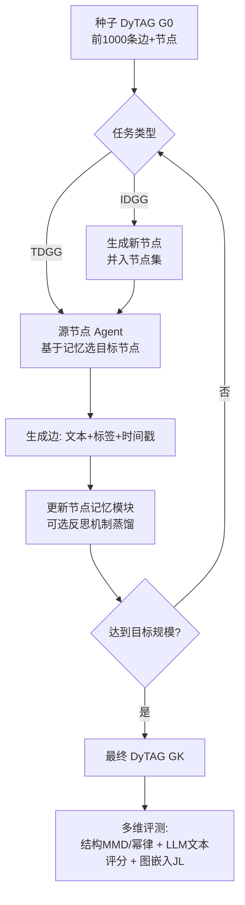

# GDGB: A Benchmark for Generative Dynamic Text-Attributed Graph Learning

**会议**: ICLR 2026  
**OpenReview**: [https://openreview.net/forum?id=5UFUHUC5qP](https://openreview.net/forum?id=5UFUHUC5qP)  
**代码**: [https://github.com/Lucas-PJ/GDGB-ALGO](https://github.com/Lucas-PJ/GDGB-ALGO)  
**领域**: 图学习 / 动态文本属性图 / 生成式 benchmark  
**关键词**: Dynamic Text-Attributed Graph, 图生成, LLM 多智能体, Benchmark, 动态图  

## 一句话总结
针对"动态文本属性图（DyTAG）生成"这一空白，作者构建了 8 个高质量文本数据集的 GDGB 基准，定义了 TDGG（直推式）和 IDGG（归纳式）两个新生成任务及多维评测协议，并提出 LLM 多智能体框架 GAG-General 作为可复现的统一基线。

## 研究背景与动机
**领域现状**：动态文本属性图（DyTAG）把结构、时间、文本三类属性耦合在一起，是建模社交网络、推荐系统、引文网络等真实演化系统的天然载体。已有工作（如 DTGB）证明给动态图神经网络（DGNN）喂入文本特征能在链路预测、节点检索、边分类等**判别式**任务上显著涨点。

**现有痛点**：但要把 DyTAG 推向**生成式**任务时，整个领域几乎是空白，卡在两个地方。其一，**数据集文本质量差**：传统动态图数据集干脆没有节点/边特征，只有拓扑和时间戳；即便是首个引入文本的 DTGB，其（源）节点文本也常常只是用户名、邮箱这类标识符，语义极度贫瘠，无法支撑需要丰富语义输入的生成模型。其二，**缺生成任务的标准定义与评测协议**：现有动态图生成模型主要靠结构和时间信息，且大多直接一次性生成最终目标图，这与真实世界图"增量式、扩张式"的演化模式背道而驰，更没有同时考量结构、时间、文本的整体评测指标。

**核心矛盾**：生成模型需要语义丰富的文本输入，而现有 DyTAG 数据集既给不了高质量文本、也给不了配套的任务与度量标准——数据、任务、框架三件套全缺。

**本文目标**：从"数据集构建 + 任务与指标定义 + 生成框架设计"三个层面建立首个生成式 DyTAG 基准 GDGB，让 DyTAG 生成研究有据可循、可复现、可公平对比。

**核心 idea**：**高质量文本是 DyTAG 生成的前提**——先造 8 个节点和边都带丰富语义文本的数据集；**生成应模拟真实演化**——把任务设计成从种子图迭代扩张（TDGG 直推、IDGG 归纳新节点）；**文本天生适合 LLM**——用 LLM 多智能体（GAG-General）作为统一可复现基线，让每个节点是一个带记忆的 agent，迭代地选邻居、生成边。

## 方法详解

### 整体框架
GDGB 由三块拼成：**数据集**（8 个高质量文本 DyTAG，覆盖电商、社交、传记、引文、电影合作等域，含 4 个二部图 + 4 个非二部图）、**任务与指标**（TDGG / IDGG 两个生成任务 + 结构/文本/图嵌入三类度量）、**框架**（GAG-General，LLM 多智能体迭代生成器）。生成流程把一个 DyTAG $G=(N, E, T)$ 抽象为：从前 1000 条边构成的种子图 $G_0$ 出发，每轮让源节点 agent 基于记忆选择目标节点、生成边（IDGG 额外先生成新节点），迭代扩张直到产出最终图 $G_K$。

### 关键设计

**1. 高质量文本 DyTAG 数据集：用语义富集破解生成的输入瓶颈。** 作者把数据集质量当成 DyTAG 生成的第一性问题，精选并重新处理了 8 个数据集（Sephora、Dianping、WikiRevision、WikiLife、IMDB、WeiboTech、WeiboDaily、Cora），核心要求是**所有源/目标节点和交互边都带有丰富的语义文本属性**。以 Sephora 为例：用户节点文本记录外貌特征与历史评论，商品节点文本描述品牌、成分、评分，边文本是用户的详细评价。作者用文本长度、困惑度 PPL、LLM 打分三个维度量化文本质量，结果 GDGB 在 6 个维度中的 5 个显著优于 DTGB——DTGB 中六成数据集的源节点文本只是邮箱/用户名，边文本（如 GDELT、ICEWS1819）也过于简短。为验证文本质量真的影响生成，作者拿 VRDAG（节点特征）和 DG-Gen（边特征）做对照：在 GDGB 上加入文本能显著降低结构差异 Degree/Spectra MMD，而在 DTGB 上文本反而在半数情况下拖累性能，坐实了"垃圾文本不如不要"。

**2. TDGG 与 IDGG：把生成任务设计成模拟真实图演化的两个难度梯度。** 不同于以往"一次性吐出整张目标图"，作者把生成定义为从种子图迭代扩张。**TDGG（直推式）**保持直推假设——所有节点已知作为先验，目标是做"目标节点选择 + 边生成"，因此天然把节点检索、边分类等传统判别式任务统一进生成范式：生成的 $G_K$ 要在结构、时间、文本上都逼近真值图。**IDGG（归纳式）**更难，它在直推基础上引入**新节点生成**，源/目标节点集随图演化动态扩张，新增节点和边必须带有高质量、语义连贯的文本属性，从而真正建模真实图"长出新节点"的扩张过程。一个有意思的发现是 IDGG 生成的图会长出与真值图**拓扑同构但文本属性发散**的 hub 节点——真值图的热门商品是已有爆款，而生成图的 hub 是"潜在会爆"的新品，这让生成本身成了电商/营销的前瞻决策工具。

**3. 多维评测协议：结构、文本、图嵌入三管齐下避免单一指标失真。** 为整体评估生成质量，作者设计三类互补指标。**结构指标**：用 RBF 核的最大均值差异（MMD）衡量生成图与真值图在度分布、谱属性上的分布距离；并做幂律分析，以 Kolmogorov-Smirnov 距离 $D_k$ 和幂律指数 $\alpha$ 判定有效性（要求 $D_k < 0.15$ 且 $\alpha \in [2,3]$）。**文本质量指标**：借鉴角色扮演 agent 研究，用 LLM-as-Evaluator 框架，按上下文保真度、人格深度、动态适应性、沉浸质量、内容丰富度五项 1–5 打分；相比 DTGB 用的 BERTScore，它能多维统一评测且避免嵌入压缩带来的语义损失。**图嵌入指标**：把 JL-Metric 扩展到 DyTAG，融合节点/边文本特征，把整张图压成统一嵌入空间，用成对相似度同时刻画拓扑、时间、文本三个维度的全局保真度。

**4. GAG-General：把每个节点变成带记忆的 LLM agent，迭代生成兼顾通用性与可复现。** 由于 TDGG/IDGG 是全新任务、现有方法（VRDAG/DG-Gen 只生成特征、GAG 只能处理二部社交图）都无法直接套用，作者在 GAG 基础上提出 GAG-General，三点增强：**通用性**（同时支持二部与非二部图）、**多域兼容**（抽象出统一生成管线，无需按域定制）、**标准化**（统一 TDGG/IDGG 任务定义并内置整体评测）。框架为源/目标节点各配一个 LLM agent，每个 agent 维护**记忆模块**记录历史邻居交互以捕捉结构与时间动态；并加入可选的**记忆反思机制**，用 LLM 把节点记忆蒸馏成摘要，类比 GNN 中的消息聚合。生成时迭代执行：源 agent 基于记忆和上下文选目标节点（IDGG 先生成并更新新节点），再在选中节点对间生成边，直至产出最终 DyTAG。

## 实验关键数据

### 主实验表格（TDGG 结构指标，GPT 作为 LLM backbone）

| 数据集 | Degree MMD↓ | Spectra MMD↓ | $D_k$ | $\alpha$ | 幂律有效 |
|--------|-------------|--------------|-------|----------|----------|
| Sephora | 0.023 | 0.011 | 0.143 | 2.993 | ✓ |
| Dianping | 0.055 | 0.328 | 0.041 | 2.234 | ✓ |
| WikiRevision | 0.108 | 0.156 | 0.056 | 2.041 | ✓ |
| WikiLife | 0.181 | 0.223 | 0.099 | 2.204 | ✓ |
| IMDB | 0.278 | 0.316 | 0.135 | 1.720 | ✗ |
| WeiboTech | 0.243 | 0.297 | 0.030 | 2.011 | ✓ |
| WeiboDaily | 0.247 | 0.493 | 0.048 | 1.845 | ✗ |
| Cora | 0.128 | 0.156 | 0.049 | 2.378 | ✓ |

多数 Degree/Spectra MMD 低于 0.3，8 个数据集中 6 个满足幂律有效性，说明 TDGG 能生成高结构保真度的图。

### 消融实验表格（TDGG 文本质量分，w/o M.=无记忆，w/ M.=有记忆，w/ M.R.=记忆+反思）

| 数据集 | DeepSeek w/o M. | DeepSeek w/ M.R. | GPT w/o M. | GPT w/ M.R. |
|--------|------------------|------------------|------------|-------------|
| Sephora | 4.09 | 4.37 | 4.69 | 4.77 |
| Dianping | 4.29 | 4.41 | 4.32 | 4.71 |
| IMDB | 3.65 | 3.99 | 3.91 | 4.44 |
| WeiboTech | 3.88 | 4.49 | 4.84 | 4.97 |

记忆模块和反思机制在几乎所有 LLM backbone 上都稳定提升文本质量与图嵌入指标，因为它们有效整合并聚合了历史交互信息。

### 关键发现
- **结构与文本特征对 DyTAG 生成都至关重要**：在高质量文本的 GDGB 上加文本能降低结构 MMD，而在低质文本的 DTGB 上加文本反而拖累生成，证明文本质量是生成成败的关键变量。
- **GAG-General 在少样本下超过传统 DGNN**：只用 1000 条边训练时，JODIE/TGN/CAWN/GraphMixer/DyGFormer 等 DGNN 性能骤降，GAG-General 在多数数据集的边分类上反超，显示 LLM agent 对结构/时间/文本信息的强利用能力与少样本泛化。
- **IDGG 比 TDGG 更难但仍保结构**：因新增节点生成，IDGG 的 MMD 普遍超 0.2，但 8 个图中 5 个仍满足幂律，保持了合理保真度；现有动态图生成模型（DG-Gen/VRDAG/TIGGER-I）在结构保真度和属性丰富度上明显更差，凸显需要专门的 DyTAG 生成方法。

## 亮点与洞察
- **三件套齐补的 benchmark 思路**：不是只发一批数据，而是同时把"数据集 + 任务定义 + 评测协议 + 统一基线框架"四样补齐，给一个几乎空白的方向立了标准。
- **把判别式任务统一进生成范式**：TDGG 让节点检索、边分类这类老任务自然落进"目标节点选择 + 边生成"，打通判别与生成的评测视角。
- **LLM-as-Evaluator 取代 BERTScore**：用多维 LLM 打分避免嵌入压缩的语义损失，更契合文本富集场景，是文本图评测的务实选择。
- **hub 节点发散的实用洞察**：IDGG 生成的"潜在爆款"hub 与真值图"已有爆款"hub 的差异，把图生成转化成电商前瞻决策工具，给出了超越基准本身的应用想象。

## 局限与展望
- **生成管线仍需打磨**，尤其 IDGG 的新节点生成在结构保真度和属性丰富度上还有差距，作者将其列为主要未来工作。
- **强依赖 LLM 推理成本**：GAG-General 每个节点一个 agent、逐轮迭代生成，规模扩展时的算力开销与可扩展性是现实约束（论文专门做了 scalability 分析）。
- **评测部分依赖 LLM 打分**，LLM-as-Evaluator 虽多维但本身存在评测者偏置与可复现性的隐忧。
- 实验主要在每数据集前 1000 条边的种子规模上展开，更大规模、更长演化下的生成质量仍待验证。

## 相关工作与启发
- **判别式动态图学习**：DyGLib、TGB、TGB-Seq 等标准化了动态图判别任务评测；DTGB 首次引入节点/边文本并用 BERT 嵌入提升判别性能，但 BERT 嵌入的信息瓶颈和贫瘠文本限制了其向生成的延展——GDGB 正是补上"高质量文本 + 生成"的这块。
- **生成式动态图学习**：早期聚焦离散时间图（DTDG），近期转向连续时间图（CTDG）；VRDAG 用图 VAE 生成节点属性、DG-Gen 用联合条件分布建模边属性、GAG 用 LLM 多智能体模拟社交二部图生成。GDGB 指出这些方法要么只生成特征不含文本、要么只适配特定图结构，于是提出通用的 GAG-General。
- **启发**：在一个新方向上，"先把数据/任务/指标/基线一次性立全"比单点刷分更有奠基价值；以及"数据质量本身就是方法的一部分"——文本质量差时连加特征都会反伤性能，提醒做生成任务前先审视输入语义是否真实可用。

## 评分
- **新颖性**: ⭐⭐⭐⭐⭐ 首个生成式 DyTAG 基准，TDGG/IDGG 任务定义、多维评测、GAG-General 框架均为该方向首创，奠基性强。
- **实验充分度**: ⭐⭐⭐⭐ 覆盖 8 数据集、4 个 LLM backbone、结构/文本/图嵌入三类指标、TDGG/IDGG 双任务及与 DGNN、动态图生成模型的多方对比，消融完整；扣分在种子规模偏小、部分结论依赖 LLM 评测。
- **写作质量**: ⭐⭐⭐⭐ 动机—数据—任务—框架—实验逻辑清晰，问题陈述到位，图表丰富；附录略显繁重。
- **价值**: ⭐⭐⭐⭐⭐ 为 DyTAG 生成提供数据、任务、指标、基线的完整基础设施，可复现可对比，对推荐、社交等下游有实际应用潜力。

<!-- RELATED:START -->

## 相关论文

- [\[ICLR 2026\] Global-Recent Semantic Reasoning on Dynamic Text-Attributed Graphs with Large Language Models](global-recent_semantic_reasoning_on_dynamic_text-attributed_graphs_with_large_la.md)
- [\[ICLR 2026\] Robustness in Text-Attributed Graph Learning: Insights, Trade-offs, and New Defenses](robustness_in_text-attributed_graph_learning_insights_trade-offs_and_new_defense.md)
- [\[ICLR 2026\] DHG-Bench: A Comprehensive Benchmark for Deep Hypergraph Learning](dhg-bench_a_comprehensive_benchmark_for_deep_hypergraph_learning.md)
- [\[ICLR 2026\] LRIM: a Physics-Based Benchmark for Provably Evaluating Long-Range Capabilities in Graph Learning](lrim_a_physics-based_benchmark_for_provably_evaluating_long-range_capabilities_i.md)
- [\[AAAI 2026\] GCL-OT: Graph Contrastive Learning with Optimal Transport for Heterophilic Text-Attributed Graphs](../../AAAI2026/graph_learning/gcl-ot_graph_contrastive_learning_with_optimal_transport_for_heterophilic_text-a.md)

<!-- RELATED:END -->
