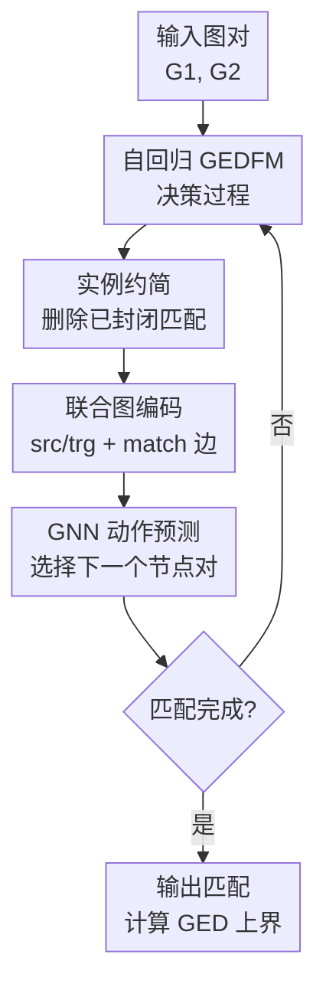

# Gelato: Graph Edit Distance via Autoregressive Neural Combinatorial Optimization

**会议**: ICLR 2026  
**OpenReview**: [https://openreview.net/forum?id=6ZTcLNmguc](https://openreview.net/forum?id=6ZTcLNmguc)  
**代码**: https://github.com/BorgwardtLab/Gelato  
**领域**: 图学习 / 图匹配 / 神经组合优化  
**关键词**: 图编辑距离, 图匹配, 神经组合优化, 自回归决策, GNN  

## 一句话总结
GELATO 将图编辑距离的近似求解改写为逐步构造节点匹配的自回归决策过程，用带匹配历史的 GNN 反复选择下一个源图-目标图节点对，在多个 GED benchmark 上同时取得更高的精确命中率和更快的推理速度。

## 研究背景与动机
**领域现状**：图编辑距离（Graph Edit Distance, GED）是衡量两个图相似度的经典指标，它把一个图变成另一个图所需的节点/边插入、删除、替换代价加起来，并寻找总代价最小的编辑路径。由于 GED 可以等价写成图匹配或二次分配问题，它在分子图、程序结构图、社交网络和视觉图结构中都很自然：如果能找到一组高质量节点对应关系，就能得到一个可解释的编辑路径和一个合法的 GED 上界。

**现有痛点**：真正困难的是，精确 GED 是 NP-hard 的。A*、整数规划这类精确求解器在二十个节点左右就会明显吃力；传统启发式虽然快，但常常给出质量不稳定的匹配。早期机器学习方法多半直接回归一个 GED 数值，这会带来两个问题：一是只给距离、不还原匹配，解释性弱；二是预测值未必对应任何真实编辑路径，因此也不保证是可达的上界。

**核心矛盾**：近年的可行解生成方法通常把 GED 变成线性分配：模型先给每个候选节点对一个独立代价，再用 Hungarian/线性分配选出整体匹配。问题在于，GED 的边编辑代价由两个节点匹配共同决定，某个节点对是否合理取决于前面已经选了哪些节点对。一次性代价矩阵没有条件更新能力，因此很难表达“选了 $(u_1, v_1)$ 之后，$(u_5, v_5)$ 比 $(u_5, v_6)$ 更一致”这类结构依赖。

**本文目标**：作者希望做的是一个既输出可行匹配、又能利用历史决策的 GED 近似求解器。它需要在小图上学到图结构与匹配模式，在更大图上仍能泛化；同时不能像 A* 搜索式学习方法那样推理太慢，也不能过度依赖昂贵的全量精确监督。

**切入角度**：论文的关键观察是，GED 匹配可以像神经组合优化中的 TSP/CVRP 那样被看成“逐步构造解”的过程。当前已经选出的匹配 $\mu$ 定义了一个带固定匹配的子问题 GEDFM；下一步动作就是从尚未匹配的源节点和目标节点中选一个 pair。只要模型在每一步看到当前局部状态和历史匹配，它就有机会学习那些一次性线性分配看不到的依赖。

**核心 idea**：GELATO 用“自回归 GNN 策略”代替静态分配矩阵：每一步把已选匹配编码进图中，预测下一个节点对，更新并约简子问题，直到得到完整匹配。

## 方法详解
### 整体框架
GELATO 的输入是一对图 $G_1, G_2$，输出是一组从源图节点到目标图节点的匹配；未被匹配的节点自然对应删除或插入操作，最终可由匹配计算 GED 上界。它不是一次性预测整张匹配矩阵，而是从空匹配开始，在每一步根据当前部分匹配 $\mu$ 选择一个新的节点对 $(u, v)$，再把这个选择写回状态，形成新的 GEDFM 子问题。

这条 pipeline 有三个贡献节点：先把部分匹配转成一个更紧凑的 GED 子问题，再把该子问题编码成可由 GNN 处理的联合图，最后用 link prediction 式动作预测逐步扩展匹配。推理时还会对第一步采用 top-$k$ 起点集成，缓解第一步没有历史信息时的偶然性。

形式上，给定已固定匹配 $\mu$，GEDFM 要在所有包含 $\mu$ 的合法匹配中找总代价最小者。当前状态 $s=(G_1,G_2,\mu)$ 的动作集合是所有尚未被使用的源/目标节点对：$A(G_1,G_2,\mu)=\{(u,v):u,v\text{ 都未在 }\mu\text{ 中出现}\}$。模型选择一个动作后，状态变成 $(G_1,G_2,\mu\cup\{(u,v)\})$。这个递推视角让 GED 从“求一个巨大组合对象”变成“反复回答下一步该选谁”。

### 关键设计
**1. 自回归 GEDFM 决策：把节点匹配从静态分配改成条件生成**

传统线性分配式方法会先为所有候选 $(u,v)$ 估一个静态代价矩阵 $C$，再一次性求解分配；它的问题不是不会排序节点对，而是排序时不知道其他节点对最终会不会被选中。GELATO 把部分匹配 $\mu$ 显式放进状态里，让第 $t$ 步的候选分数依赖前 $t-1$ 步的选择。这样一来，模型看到“已经把某个局部结构对齐了”之后，就能优先补齐与它一致的邻域匹配，而不是重复犯静态矩阵里同轨道、同局部标签节点难以区分的问题。

这个设计的理论支点是 GEDFM 的递推式：

$$
GEDFM(G_1,G_2,\mu)=\min\left(c(\mu),\min_{(u,v)\in A(G_1,G_2,\mu)}GEDFM(G_1,G_2,\mu\cup\{(u,v)\})\right).
$$

它并不声称模型能算出精确动态规划值，而是把“选择下一个动作”的难题交给可学习策略。对于分子图、程序图这类存在重复子结构的数据分布，模型可以从训练实例中学习某些局部结构匹配的规律，用贪心或少量起点搜索近似最优策略。

**2. 实例约简：只保留仍会影响未来匹配的局部状态**

自回归建模的代价是状态会随匹配历史变化，如果每一步都把完整原图和全部已选匹配喂给模型，状态空间会很大，也会把许多已经“不再参与未来决策”的节点留在图里。GELATO 因此定义了 reduce 操作：若一个已匹配节点对 $(u,v)$ 中，源侧节点 $u$ 的所有邻居都已匹配，或目标侧节点 $v$ 的所有邻居都已匹配，那么这个节点对对后续未匹配节点的边代价影响已经固定，可以从当前子问题里删除。

这个约简不是普通剪枝，而是有等价性保证的子问题压缩。论文证明，如果 $\mu^*$ 是原 GEDFM 实例的最优匹配，那么把它限制到约简后还存在的节点上，仍然是约简实例的最优解。直观地说，已经被“封闭”的匹配只贡献一个与后续选择无关的常数；模型没必要反复看到这些节点。这样做同时减少搜索空间和 GNN 输入规模，也让不同历史路径可能落到同一个较小子问题上，提升训练样本的共享程度。

**3. 联合图编码与 GINE 动作预测：把匹配历史变成可消息传递的边**

为了让 GNN 读取 GEDFM 状态，GELATO 把 $G_1$ 和 $G_2$ 做不相交并集，并给源图节点附加 `src` 标记、目标图节点附加 `trg` 标记；已经固定的匹配 $(u,v)\in\mu$ 则作为跨图的 `match` 边加入图中，参与消息传递。这样，匹配历史不只是一个外部列表，而是直接改变当前联合图的拓扑，让 GNN 能沿着原图边和匹配边传播信息。

动作预测本质上是 link prediction。GELATO 用带边特征的 GINE 层更新节点表示，配合 BatchNorm 和残差连接：

$$
h^{\ell+1}_u=h^\ell_u+ReLU\left(BatchNorm\left(MLP\left(h^\ell_u+\sum_{v\in N(u)}ReLU(h^\ell_v+e_{v,u})\right)\right)\right).
$$

得到最终节点表示后，对每个尚未匹配的源/目标节点对拼接 $h^L_u\Vert h^L_v$，经过 MLP 得到 logit $o_{u,v}$。推理时选择分数最高的 pair；训练时则让最优匹配中尚未加入的节点对获得高概率。这个编码还被证明是信息无损的：从联合图可以还原源图、目标图和已固定匹配。

**4. 对称监督与起点集成：减少等价节点冲突和首步敏感性**

GED 中常见同构和自同构结构：两个候选节点对在当前状态下完全不可区分，但某个精确解只把其中一个写进了 $\mu^*$。如果把另一个当负样本，GNN 会收到互相矛盾的监督。GELATO 因此按 pair automorphism 处理正负样本：与最优匹配中某个 pair 自同构的候选也应被视作正例，因为存在另一个同样最优的匹配包含它；负样本只来自不属于这些正例等价类的候选。

推理端还有一个很务实的补丁：第一步没有历史匹配可条件化，模型容易对起点选择敏感。GELATO 不只取一个最高分起点，而是选择 top-$k$ 个互不同构意义下的起点，分别展开自回归贪心分支，最后返回 GED 代价最低的匹配。默认 $k=32$，它比完整 beam search 简单得多，但已经显著改善了 greedy $k=1$ 的性能。

### 一个完整示例
假设源图有 5 个节点、目标图有 5 个节点，并且两个图都含有一段相似的链式局部结构。静态线性分配方法可能会发现 $(u_1,v_1)$、$(u_5,v_5)$、$(u_5,v_6)$ 这些候选局部上都很像，却无法知道如果先选了 $(u_1,v_1)$，后面某个邻域方向就应该随之确定。

GELATO 的流程会更像逐步拼图。第一步从空匹配出发，模型给若干候选起点打分；若 top-$k$ 分支中有一个选择了 $(u_1,v_1)$，这条跨图 match 边会被加入联合图。下一步消息传递时，$u_1$ 与 $v_1$ 的邻域关系已经成为状态的一部分，于是模型在评估 $(u_5,v_5)$ 和 $(u_5,v_6)$ 时可以利用“前一个局部结构已经如何对齐”的信息。若某些已匹配节点的邻居也都完成匹配，它们会被 reduce 操作移出当前子问题，只留下仍会影响未来边编辑代价的边界区域。

走到最后，模型得到一组合法匹配；源图中未匹配节点被视作删除，目标图中未匹配节点被视作插入，匹配节点和对应边的替换/插入/删除代价相加，就得到一个可解释、可达且不小于真实 GED 的上界。

### 损失函数 / 训练策略
训练数据来自带精确最优匹配的图对。作者先用 MIP-F2 等精确求解器得到每个训练图对的最优匹配 $\mu^*$，再从源图节点中采样子集 $U$，构造部分匹配 $\mu=\{(u,v)\in\mu^*:u\in U\}$。由于 $\mu\subseteq\mu^*$，原来的 $\mu^*$ 仍可作为这个 GEDFM 子问题的最优完成方式，于是一对图能生成多个不同阶段的训练状态，相当于便宜的数据增强。

监督目标是 cross-entropy link prediction。对当前状态 $(G_1,G_2,\mu)$，正例是 $\mu^*\setminus\mu$ 中尚未选的匹配 pair 及其自同构等价类，负例是可行动作集合中不属于正例等价类的 pair。模型不用学习一个固定动作顺序，因为任意剩余最优 pair 都是合法下一步；这比强制某种人工顺序更符合 GED 的组合结构。

默认实现采用 5 层 GINE、隐藏维度 $d=128$，Adam 优化器，学习率 $10^{-3}$，无 weight decay。推理时默认使用 $k=32$ 的起点集成；每条分支内部仍是贪心自回归选择，最终比较完整匹配的 GED 代价并取最低者。

## 实验关键数据

### 主实验
论文在 AIDS、LINUX、IMDB-16、ZINC-16、molhiv-16、code2-22 六个数据集上评估，并使用 nMAE 与 exact hit rate（EHR）作为核心指标。nMAE 衡量相对最优 GED 的误差，对输出匹配的方法可理解为最优性 gap；EHR 是预测 GED 与真实 GED 完全一致的比例。

| 数据集 | 指标 | GELATO | 最强对比方法 | 结论 |
|--------|------|--------|--------------|------|
| AIDS | nMAE / EHR | 0.1 / 99.3 | GRAIL 2.7 / 82.1 | GELATO 几乎精确命中，明显超过 LLM 生成启发式 |
| LINUX | nMAE / EHR | 0.1 / 99.9 | GRAIL 0.0 / 100.0 | 该数据集接近饱和，GELATO 与最优水平基本持平 |
| IMDB-16 | nMAE / EHR | 0.1 / 99.9 | GRAIL 0.0 / 99.9 | 结果同样接近饱和，差距很小 |
| ZINC-16 | nMAE / EHR | 0.7 / 91.1 | GRAPHEDX 7.7 / 35.3 或 GRAIL 12.7 / 21.3 | 在带边标签分子图上优势最大 |
| molhiv-16 | nMAE / EHR | 0.5 / 95.3 | GRAIL 8.5 / 33.1 | 显著降低 GED gap |
| code2-22 | nMAE / EHR | 0.6 / 95.7 | MATA* 5.1 / 61.1 | 对程序语法树也保持高命中率 |

推理速度也是主结果的一部分。GELATO 在 GPU 上每对图约 2.9-5.3 ms；相比之下，GEDGNN/GEDHOT 常达到数百到数千 ms，MATA* 在 code2-22 上约 6329.8 ms。也就是说，GELATO 并不是用更重搜索换质量，而是在自回归 GNN 和 GPU 友好实现下同时更准、更快。

| 方法 | AIDS | ZINC-16 | molhiv-16 | code2-22 | 说明 |
|------|------|---------|-----------|----------|------|
| GELATO | 3.2 ms | 4.2 ms | 4.1 ms | 5.3 ms | 默认 $k=32$，GPU 推理 |
| GEDGNN | 742.0 ms | 1383.2 ms | 1252.7 ms | 2813.9 ms | 依赖线性分配和较重候选搜索 |
| GEDHOT | 1210.7 ms | 2064.7 ms | 1954.1 ms | 3951.6 ms | 最慢的学习式匹配基线之一 |
| MATA* | 6.8 ms | 24.2 ms | 37.5 ms | 6329.8 ms | 随图规模出现指数式压力 |
| GRAIL | 8.4 ms | 44.1 ms | 18.9 ms | 99.6 ms | 启发式代码质量依数据集变化 |

### 消融实验
消融主要回答四个问题：自回归顺序是否必要、reduce 是否有用、自动同构监督是否重要、起点集成是否只是锦上添花。表中取论文 Table 4 的代表性数值，指标仍为 nMAE / EHR。

| 配置 | AIDS | ZINC-16 | molhiv-16 | code2-22 | 说明 |
|------|------|---------|-----------|----------|------|
| GELATO, $k=1$ | 6.4 / 74.2 | 8.6 / 41.4 | 5.4 / 52.8 | 20.6 / 65.3 | 单起点贪心仍强，但比 $k=32$ 明显弱 |
| No sequential process | 61.0 / 11.6 | 70.4 / 2.0 | 48.0 / 2.5 | 38.8 / 23.0 | 一次性线性分配式预测大幅退化 |
| No instance reduction | 8.0 / 68.7 | 9.4 / 38.2 | 5.5 / 51.5 | 14.5 / 60.9 | 约简整体有帮助，尤其减少状态冗余 |
| Automorphic matches naive | 7.5 / 72.1 | 8.7 / 41.2 | 6.3 / 50.5 | 9.5 / 70.9 | 自同构处理影响随数据集变化，但避免矛盾监督更合理 |

弱监督实验说明，GELATO 对昂贵精确标签的依赖没有想象中脆弱。在 ZINC-16 上，仅用 10k 对训练图也能达到 1.5 nMAE / 83.1 EHR；若这些匹配由 1 秒 time limit 的 MIP-F2 生成，结果是 1.7 / 81.6；即使用 0.1 秒 time limit，仍有 3.7 / 62.6。code2-22 上 10k 对、1 秒 time limit 甚至达到 1.6 / 93.3，说明模型能从带噪但结构相关的匹配中学到有效策略。

### 关键发现
- 自回归建模是最关键的贡献。去掉顺序过程后，模型退化成类似静态线性分配的方法，ZINC-16 的 EHR 从完整 GELATO 的 91.1 降到 2.0，说明 GED 的 pairwise dependency 不能靠一次性打分矩阵解决。
- 起点集成对第一步敏感性很重要。$k=1$ 已经能超过不少基线，但 $k=32$ 带来巨大提升；超参数图还显示 $k=128$ 可进一步把 ZINC-16 的 EHR 从约 91% 推到约 97%，代价只是推理时间上升到约 6.3 ms。
- 实例约简不是噱头。它的提升不如自回归决策大，但在多个数据集上都改善表现，并且给模型一个更小、更可复用的状态空间。
- 泛化到更大图时，GELATO 的性能随图规模增长而逐步下降，但没有突然崩溃；在 ZINC、molhiv、code2 的 larger test sets 上，它持续优于 GEDHOT、GRAIL 和短时限 MIP-F2。
- 数据集构造本身也有价值。作者特别避免 train/validation/test 之间出现同构图泄漏，并提供带精确 GED 和匹配的新 benchmark，这对后续 GED 学习方法的公平比较很关键。

## 亮点与洞察
- 这篇论文最巧的地方是把 GED 的“历史依赖”说清楚了：不是简单地让 GNN 更深，而是改变决策形式，让每一步都能条件化在已选匹配上。这个视角直接解释了为什么线性分配类方法会在某些对称结构上犯错。
- GEDFM 与 reduce 的组合很有启发。很多神经组合优化方法只强调 policy，而这里额外做了一个有证明的状态约简，把动态规划/搜索里的子问题复用思想带进 GNN 输入表示。
- 训练目标没有强行规定匹配顺序，这一点很合理。一个最优匹配中的多个 pair 往往没有天然先后关系，允许任意剩余最优 pair 作为正例，可以避免模型学习数据生成器的偶然顺序。
- 自同构监督处理是图学习任务里容易被忽略的细节。图上的“看起来一样”不是噪声，而是模型表达能力和图对称性共同决定的不可区分性；把等价正例当负例会人为制造训练冲突。
- 这套方法可以迁移到其他图匹配/结构对齐问题。只要任务可以表示为逐步添加跨图对应关系，并且局部历史会影响后续选择，就可以借鉴“联合图 + match 边 + 自回归 link prediction”的框架。

## 局限与展望
- 当前推理仍然是“多起点贪心”，不是完整搜索。作者也承认 beam search 或更系统的 tree search 可能进一步提升质量，尤其是在第一步以外也存在多个近似同分候选时。
- 模型仍主要依赖有监督最优匹配训练，而精确匹配生成本身昂贵。弱监督实验显示它有一定鲁棒性，但真正摆脱精确 GED 标签，可能需要强化学习、自改进或搜索-学习闭环。
- 跨数据集迁移受节点/边标签语义影响很大。论文附录显示，无标签图或共享分子特征空间时迁移较可行；若不同数据集的一维 one-hot 表示对应完全不同语义，直接迁移会明显退化。
- 更大图上的扩展仍有空间。GELATO 比基线泛化更好，但随着节点数增加，组合空间还是快速变大；未来需要更强的分层匹配、局部搜索修复或与 branch-and-bound 的结合。
- 实验主要是中小规模 GED benchmark。对于深图匹配、视觉关键点匹配、超大生物网络对齐这类更大、更稠密或特征更复杂的场景，还需要验证该自回归 GED 形式是否仍然经济。

## 相关工作与启发
- **vs GED 值回归方法（SimGNN、GREED、GraphEdX）**: 这些方法主要预测一个距离数值，快且可微，但不一定输出对应编辑路径。GELATO 直接生成匹配，因此距离是可达上界，解释性也更强。
- **vs 线性分配式 GED 方法（GEDGNN、GEDHOT、GOTSIM）**: 它们通常学习候选匹配代价，再交给线性分配或最优传输求解。GELATO 的区别是每一步更新状态和候选分数，能表达匹配之间的依赖。
- **vs 搜索引导方法（GENNA*、MATA*）**: 搜索引导方法能利用学习模型改善 A* 或类似搜索，但可扩展性有限。GELATO 更像一个直接构造启发式，牺牲最优性保证，换取毫秒级推理。
- **vs 神经组合优化中的 pointer/autoregressive policy**: GELATO 借鉴了逐步构造解的思想，但动作不是访问一个点，而是在两个图之间选择一个节点对；match 边和 GEDFM 约简是它针对图编辑距离定制的关键适配。
- **对后续工作的启发**: 可以尝试把 GELATO 作为 branch-and-bound 的初始上界或变量排序策略，也可以让模型生成若干候选匹配后用局部搜索精修，从而在速度和质量之间继续逼近最优。

## 评分
- 新颖性: ⭐⭐⭐⭐⭐ 把 GED 可行匹配生成明确建模为自回归 neural combinatorial optimization，并配套 GEDFM 约简和对称监督，视角完整。
- 实验充分度: ⭐⭐⭐⭐⭐ 数据集覆盖分子、程序、协作网络等多种图，包含主结果、速度、泛化、消融、弱监督和非单位代价实验。
- 写作质量: ⭐⭐⭐⭐⭐ 论文把为什么静态线性分配不足、为什么历史匹配有用讲得很清楚，图示和定理服务于方法而不是装饰。
- 价值: ⭐⭐⭐⭐⭐ 对 GED 近似求解、图匹配、神经组合优化都有直接参考价值，尤其适合作为“学习式启发式如何输出可行组合解”的案例。

<!-- RELATED:START -->

## 相关论文

- [\[ICLR 2026\] $\ell_1$ Latent Distance Based Continuous-Time Graph Representation](ell_1_latent_distance_based_continuous-time_graph_representation.md)
- [\[AAAI 2026\] Sheaf Graph Neural Networks via PAC-Bayes Spectral Optimization](../../AAAI2026/graph_learning/sheaf_graph_neural_networks_via_pac-bayes_spectral_optimization.md)
- [\[ICLR 2026\] Learning from Historical Activations in Graph Neural Networks](learning_from_historical_activations_in_graph_neural_networks.md)
- [\[ICLR 2026\] Are We Measuring Oversmoothing in Graph Neural Networks Correctly?](are_we_measuring_oversmoothing_in_graph_neural_networks_correctly.md)
- [\[ICLR 2026\] WATS: Wavelet-Aware Temperature Scaling for Reliable Graph Neural Networks](wats_wavelet-aware_temperature_scaling_for_reliable_graph_neural_networks.md)

<!-- RELATED:END -->
