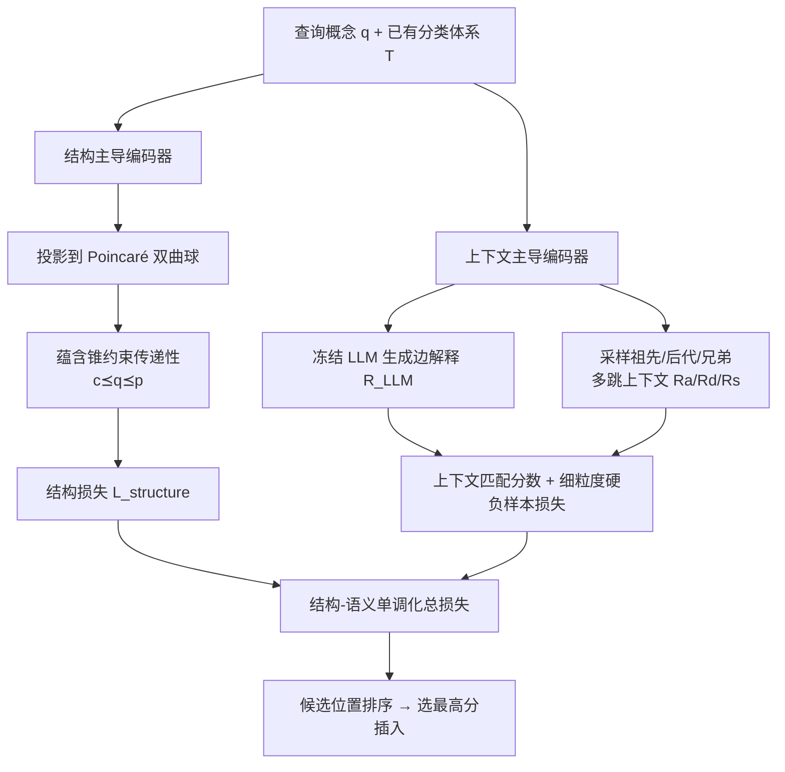

# Geometric Constraints for Small Language Models to Understand and Expand Scientific Taxonomies

**会议**: ICLR 2026  
**OpenReview**: [https://openreview.net/forum?id=FI075FwAnb](https://openreview.net/forum?id=FI075FwAnb)  
**代码**: [https://github.com/LiriFang/SS-Mono](https://github.com/LiriFang/SS-Mono)  
**领域**: 图学习 / 科学分类体系扩展 / 双曲几何 / 小模型知识蒸馏  
**关键词**: Taxonomy Expansion, Hyperbolic Embedding, Entailment Cones, Small Language Model, Self-Supervised  

## 一句话总结
把"父→查询→子"的层级传递性约束编码到双曲空间，再用冻结 LLM 补语义上下文，让一个 110M 的 DistilBERT（SS-MONO）在科学分类体系扩展任务上全面超过 GPT-4o mini、Gemma-2-9B 等冻结大模型和领域专用基线。

## 研究背景与动机
- **领域现状**：科学分类体系（taxonomy，如 MeSH、WordNet）是一种带文本属性的有向无环图（DAG），节点是概念、有向边是上下位（hypernym→hyponym）关系。新概念不断涌现，需要把它们"插入"到已有体系的正确位置，这就是 taxonomy expansion。近期发现 LLM 的 token embedding 呈现强双曲性（hyperbolicity），暗示其嵌入空间天然适配树状层级，于是有人想直接用 LLM 来做分类体系任务。
- **现有痛点**：作者先实测发现 LLM 直接 prompting 做扩展会四类翻车——**长上下文受限**（整张文本属性图塞不进去）、**幻觉**（凭空臆造体系里不存在的边）、**No Answer**（生成不出可用答案）、**Partial Answer**（只答对一部分）。在 SemEval-Food 上 GPT-4o mini 的 R@1 只有 0.016，Gemma-2-9B 直接全 0。而要让 LLM 适配领域特定体系又得 fine-tune，成本高昂。
- **核心矛盾**：LLM 有潜力但贵且会幻觉、不可直接用；分类体系任务又强依赖领域知识。能不能既"借用"LLM 的知识、又把推理主体放到便宜的小模型上？
- **本文目标**：提出一条 LLM→SLM 的知识迁移流水线，让小模型在 root/leaf/中间节点任意位置都能准确扩展分类体系，且训练全程自监督、不需人工标注。
- **核心 idea**：**结构-语义单调化（Structure-Semantic Monotonization）**——用双曲几何 + 蕴含锥把层级传递性 $c \preceq q \preceq p$ 这条"硬约束"刻进表示空间（结构侧），同时用冻结 LLM 生成边解释 + 多跳上下文采样补足语义（语义侧），两路打分共同决定查询概念的最佳插入位置。

## 方法详解

### 整体框架
SS-MONO 把"给查询概念 $q$ 找最佳插入边 $(p,c)$"建模成一个候选位置排序问题，由两个互补编码器协同：**结构主导编码器**保证查询落在父子之间的单调层级里，**上下文主导编码器**保证查询语义和候选位置的邻域语义匹配。两路分数相加排序，最后由 LLM 校准。整个训练用"从已有体系里挖掉一个概念、再让模型把它补回去"的方式自监督完成。

### 关键设计

**1. 双曲编码 + 蕴含锥：把层级传递性变成可优化的几何约束。** 分类体系的本质约束是传递性——若 $(p,c)$ 是 $q$ 的合法插入边，则必有 $c \preceq q \preceq p$。作者把语言模型给出的上下文嵌入 $H$ 先线性映射再用指数映射投到 Poincaré 球 $\mathbb{D}^d=\{x\in\mathbb{R}^d:\|x\|<1\}$（双曲空间对树状结构的"容量"远大于欧氏空间，能给低层节点留更多位置），得到 $H'_p=\exp_0(W^\top H_p)$。然后引入"蕴含锥"$S^{\phi(u)}_u$：每个点 $u$ 张开一个半孔径为 $\phi(u)$ 的锥，要求子节点 $v\preceq u$ 落进父节点的锥内，即角度 $\Xi(u,v)\le\phi(u)$。违反程度用能量分数 $E(u,v):=\max(0,\Xi(u,v)-\phi(u))$ 度量，配 max-margin 损失：正样本（真父子）要求 $E=0$，负样本要求 $E>\gamma$。结构损失就是对 $(p,q)$ 和 $(q,c)$ 两段锥损失求和 $L_{structure}=L_{cone}(H'_p,H'_q)+L_{cone}(H'_q,H'_c)$，把"单调层级"直接写进几何。

**2. 上下文主导编码器：冻结 LLM 补语义 + 多跳邻域采样。** 分类体系往往只有节点有文本、边没有解释，单靠体系内语义太稀薄。于是先用一个**冻结** LLM（Gemma/Llama）按模板生成候选边 $(p,c)$"为什么相连"的文字解释，再用一个小 PLM 编码成向量，过自注意力得到关系向量 $R_{LLM}=\mathrm{SAM}[e,H_{LLM}]$；这里 LLM 全程不微调，只当一次性知识源，规避了 fine-tune LLM 的成本。同时沿候选位置在体系里采样三类邻域：祖先 $R_a=\mathrm{SAM}[e,H_{p''},H_{p'},H_p,H_q]$、后代 $R_d=\mathrm{SAM}[e,H_q,H_c,H_{c'},H_{c''}]$、兄弟 $R_s=\mathrm{SAM}[e,H_q,H_b,H_w]$。兄弟节点因为可能很多且语义发散，只挑余弦相似度最高的 $b$ 和最低的 $w$（$b=\arg\max_{v\in\mathrm{Child}(p)}\mathrm{CosSim}(H_v,H_q)$，$w$ 取 argmin），用一好一坏锚定语义边界。四路向量拼接后过 MLP 得匹配分数 $F=W_2(\mathrm{ReLU}(W_1 R_{concat}+b_1)+b_2)$，交叉熵优化 $L_{context}$。

**3. 硬负样本细粒度拆分：让每个邻域单独可判别。** 普通负样本是"父、子、兄弟全错"，太容易区分。作者构造更难的负样本——比如 $(p,\hat{c})$ 父对子错、或单独换错 $\hat{p},\hat{b},\hat{w}$，并把匹配分数按邻域拆成独立子项：例如只看后代的 $F_{desc}(R_d)=W_4(\mathrm{ReLU}(W_3 R_d+b_3)+b_4)$，配对应损失 $L_{context\_desc}$，祖先、兄弟同理。这样模型被迫在"父对但子错"这种局部错误上也能扣分，显著提升中间节点（non-leaf）的判别精度。

**4. 自监督优化与总损失：无标注训练。** 训练样本完全从已有体系自动生成：选一条已有传递关系 $(p,q,c)$，挖掉 $q$ 当作待插入查询，采它的最优/最差兄弟 $b,w$ 得正样本 $(p,c,b,w)$，再随机替换任意分量得负样本。总损失把结构和细粒度上下文加权融合，体现"结构-语义单调化"：
$$L_{total}=\alpha L_{structure}+\beta L_{context}+\mu L_{context\_desc}+\lambda L_{context\_anc}+\xi L_{context\_sib}$$
全程不需人工标注，扩展时还可用 LLM 对最终插入做一次校准。

## 实验关键数据

### 主实验（三个分类体系扩展基准，节选 Total/Non-leaf）
数据集统计：SemEval-Food（1,486 节点/深度 8）、MeSH（9,710 节点/深度 10）、WordNet-Verb（13,936 节点/深度 12）。基线含 7 个领域专用模型（TaxoExpan/TMN/QEN/TaxBox 等）+ 4 个 >1B 的 LLM。SS-MONO 主干仅 **DistilBERT-base-110M**。

| 数据集 | 方法 | Total MRR ↑ | Total R@1 ↑ | Non-leaf MRR ↑ |
|---|---|---|---|---|
| SemEval-Food | GPT-4o mini | – | 0.016 | – |
| SemEval-Food | TaxBox | 0.359 | 0.132 | 0.133 |
| SemEval-Food | **SS-MONO** | **0.400** | **0.186** | – |
| SemEval-Food | SS-MONO (w/o AD) | 0.430 | 0.161 | 0.225 |
| WordNet-Verb | QEN | 0.340 | 0.081 | 0.166 |
| WordNet-Verb | **SS-MONO** | 0.334 | 0.106 | 0.122 |
| MeSH | QEN | 0.423 | 0.071 | 0.322 |

> LLM 基线在三个数据集上 R@1 普遍在 0.000~0.016 区间（Gemma-2-9B 多处全 0），说明冻结大模型直接做体系扩展几乎不可用；而 110M 的 SS-MONO 在 SemEval-Food 上 R@1 达 0.186，约为最强领域基线 TaxBox 的 1.4 倍。

### 消融实验（AD = LLM 增强描述）

| 配置 | SemEval-Food Total MRR | SemEval-Food Non-leaf R@10 |
|---|---|---|
| SS-MONO (w/o AD) | 0.430 | 0.098 |
| SS-MONO（全模型） | 0.400 | 0.059 |

- LLM 增强描述（AD）对 leaf 节点扩展有帮助（如 SemEval-Food leaf R@10 从 0.642→0.645、MR 从 228→144 更优），但对**中间/非叶节点扩展并不总是增益**——加了 AD 后部分 non-leaf 指标反而下降，作者在附录 O 专门分析了这一现象。

### 关键发现
- **小模型 > 冻结大模型**：110M DistilBERT 微调后，在 root/leaf/中间任意位置的扩展上全面压过 GPT-4o mini、Gemma-2-9B、DeepSeek-R1-8B 等冻结 LLM，验证"合适操作下 SLM 足够经济强大"的命题。
- **几何约束是关键**：双曲 + 蕴含锥的结构损失让模型显式遵守传递性，这正是 LLM prompting 做不到、容易幻觉造边的地方。
- **AD 不是银弹**：LLM 语义增强对叶节点有用、对中间节点可能引入噪声，提示语义补充要按节点类型有选择地用。

## 亮点与洞察
- **把"硬知识约束"几何化**：分类体系扩展的核心是传递性这条不可违反的规则，作者没有让模型去"软"地学，而是用双曲蕴含锥把它变成可优化的角度约束，从根上压制了幻觉造边。
- **LLM 当"一次性知识水龙头"而非推理主体**：冻结 LLM 只负责生成边解释，推理与排序全交给小模型，既蹭到 LLM 知识又把成本钉死，是一种务实的 LLM→SLM 蒸馏范式。
- **自监督闭环干净利落**：挖节点-补节点的自监督设计让方法零标注就能训练，对真实世界手工构建、标注稀缺的科学分类体系非常友好。
- **覆盖任意插入位置**：不只做叶节点扩展，还显式建模 root 和中间节点插入（断旧边、加两条新边），比多数只做叶扩展的基线更通用。

## 局限与展望
- **AD 对非叶节点可能有害**：LLM 增强描述在中间节点上时灵时不灵，何时该用、如何过滤噪声尚无自适应机制。
- **依赖冻结 LLM 的解释质量**：边解释由 LLM 生成，若 LLM 在小众领域知识薄弱，语义侧的增益会打折扣（论文用附录 M 验证可信度，但仍是潜在脆弱点）。
- **绝对排名指标在大体系上偏弱**：在更大更深的 MeSH/WordNet-Verb 上，SS-MONO 的 Total MRR 与最强基线 QEN 互有胜负，并未在所有指标上碾压，说明几何约束在超大体系上的可扩展性还有空间。
- **双曲超参敏感**：锥孔径、margin $\gamma$、五项损失权重 $\alpha,\beta,\mu,\lambda,\xi$ 较多，调参成本不低。

## 相关工作与启发
- **Taxonomy expansion**：TaxoExpan、TMN、ARBORIST、QEN、TaxBox 等是直接对标的领域基线，SS-MONO 的差异是引入双曲几何约束 + LLM 语义增强。
- **双曲表示学习**：Poincaré 球嵌入、蕴含锥（Ganea et al. 2018）是结构编码器的几何根基，本文把它们从纯图嵌入迁移到"LLM 上下文嵌入 + 分类体系"的混合场景。
- **LLM 双曲性发现**：近期"LLM token embedding 呈双曲结构"的观察是本文的出发点，启发了"用几何先验对接 LLM 知识"的思路。
- **启发**：对于带强结构约束（传递性、偏序、层级）的任务，与其指望大模型 prompting 凭经验遵守规则，不如把规则编码成几何/拓扑约束交给小模型显式优化——既省钱又抗幻觉，这条路对知识图谱补全、本体对齐等任务都有借鉴价值。

## 评分
- **新颖性**: ⭐⭐⭐⭐ 双曲蕴含锥 + 冻结 LLM 语义增强 + 自监督的组合用于任意位置分类体系扩展，思路清晰且对 LLM 幻觉问题有针对性回应。
- **实验充分度**: ⭐⭐⭐⭐ 三个真实分类体系、15 个指标、7 个领域基线 + 4 个 LLM 基线，含 leaf/non-leaf 拆分和 AD 消融；但部分大体系上未全面超越基线。
- **写作质量**: ⭐⭐⭐⭐ 动机（四类 LLM 翻车）到方法（结构/语义两路）逻辑顺畅，公式与图配合到位。
- **价值**: ⭐⭐⭐⭐ 证明 110M 小模型在结构化知识任务上可碾压冻结大模型，为"昂贵 LLM 不是必需品"提供了有力且经济的案例。

<!-- RELATED:START -->

## 相关论文

- [\[ACL 2025\] The Role of Exploration Modules in Small Language Models for Knowledge Graph Question Answering](../../ACL2025/graph_learning/the_role_of_exploration_modules_in_small_language_models_for_knowledge_graph_que.md)
- [\[ICLR 2026\] Global-Recent Semantic Reasoning on Dynamic Text-Attributed Graphs with Large Language Models](global-recent_semantic_reasoning_on_dynamic_text-attributed_graphs_with_large_la.md)
- [\[ICLR 2026\] HGNet: Scalable Foundation Model for Automated Knowledge Graph Generation from Scientific Literature](hgnet_scalable_foundation_model_for_automated_knowledge_graph_generation_from_sc.md)
- [\[ICLR 2026\] Geometric Graph Neural Diffusion for Stable Molecular Dynamics Simulations](geometric_graph_neural_diffusion_for_stable_molecular_dynamics_simulations.md)
- [\[ICLR 2026\] Knowledge Reasoning Language Model: Unifying Knowledge and Language for Inductive Knowledge Graph Reasoning](knowledge_reasoning_language_model_unifying_knowledge_and_language_for_inductive.md)

<!-- RELATED:END -->
