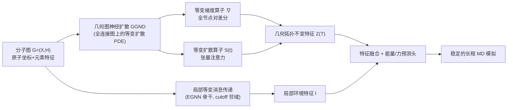

# Geometric Graph Neural Diffusion for Stable Molecular Dynamics Simulations

**会议**: ICLR 2026  
**OpenReview**: [https://openreview.net/forum?id=T8VcTykTf1](https://openreview.net/forum?id=T8VcTykTf1)  
**代码**: 待确认  
**领域**: 几何图神经网络 / 分子动力学力场 / 等变扩散  
**关键词**: Geo-GNN, 分子动力学, 等变性, 图扩散, 构象外推, 模拟稳定性  

## 一句话总结
把图热扩散方程引入几何图神经网络，用「等变梯度算子 + 等变扩散算子」在全连接分子图上做全节点对信息流动，作为即插即用模块捕捉对构象变化不敏感的几何拓扑不变特征，从而让机器学习力场在未见构象上仍能稳定地跑长程 MD 模拟。

## 研究背景与动机

**领域现状**：几何图神经网络（Geo-GNN，如 NequIP、MACE、VisNet）已经成为分子动力学（MD）模拟的主力——它们用图上消息传递近似势能面，以接近 DFT 的精度、远低于量子力学方法的代价预测能量和力，再驱动长时间轨迹演化。

**现有痛点**：绝大多数 Geo-GNN 的评测只盯着「力预测的 in-distribution 精度」，而忽视了真实 MD 模拟中的**稳定性**。问题在于：训练集只覆盖有限的分子构象，而长程轨迹会自然走到训练分布之外的构象上。一旦模型对这些未见构象给出哪怕很小的力预测误差，误差会随积分步累积，最终导致非物理的化学键（键长崩坏、原子飞散），让模拟整体失败。

**核心矛盾**：作者用 3BPA 数据集（300/600/1200 K 三个温度各自构成一个构象域）量化了这种**几何拓扑漂移（geometric topological shift）**——温度差越大，原子对的邻接频率分布差异越系统性地增大。实验暴露出一对此消彼长的困境：SOTA 的 VisNet 在 in-domain（300 K）极强，但温度一升、构象一移精度就断崖式崩溃（1200 K 稳定性仅 0.004 ps）；而靠物理偏置增强泛化的 SEGNO 虽然外推更好，却牺牲了 in-domain 精度。两者都没有真正针对「几何拓扑漂移」这个根因。

**本文目标**：设计一个既能保住 in-domain 精度、又能在构象漂移下稳健外推、从而保证真实 MD 长程稳定的新框架。

**核心 idea**：作者把构象域的变化抽象成「几何拓扑漂移」，并从谱图理论的**图热方程**出发——既然局部消息传递只在 cutoff 半径内传播、对拓扑变化敏感，那就换成在**全连接图**上的连续扩散过程，让任意原子对之间能瞬时交换信息。**关键创新标签**：用 SE(3)-等变的梯度算子和扩散算子驱动节点表征的扩散演化，使学到的全局特征对构象引起的拓扑变化不变，同时保持等变；并以即插即用模块的形式嫁接在现有局部等变消息传递骨干之上。

## 方法详解

### 整体框架

GGND 由两条互补支路构成：(i) 传统的**局部等变消息传递**（EGNN 骨干，如 VisNet/MACE）负责在 cutoff 邻域内捕捉局部环境特征；(ii) 新提出的**几何图神经扩散模块**在全连接图上用带全局注意力的扩散 PDE，捕捉对几何拓扑漂移不变的全局拓扑特征。两条支路的输出在能量预测头处融合，从而既保住局部精度、又获得跨构象的外推稳定性。GGND 是插件式的，可嫁接到大多数 EGNN 框架上。

### 关键设计

**1. 几何图上的连续扩散过程：用图热方程替换离散 GNN 层。** GGND 不再堆叠离散的消息传递层，而是把节点嵌入 $Z(t)=\{z_i(t)\}$ 视为随连续时间演化的场，按图扩散方程 $\frac{\partial Z(t)}{\partial t}=\mathrm{div}\,[S(Z(t),X,t)\odot\nabla Z(t)]$ 演化，初值 $Z(0)=\phi_E(X,H)$ 由 RBF 嵌入层给出。这里节点特征是按 O(3) 不可约表示标号的球张量 $z_{i,kLM}$（$L=0$ 为标量不变量、$L=1$ 为向量、更高 $L$ 为张量），扩散就在这些等变张量场上进行。直觉上，扩散过程让信息像热量一样在图上铺开，从而抹平因构象不同而产生的局部拓扑差异——这正是「对几何拓扑漂移不变」的来源。

**2. 等变梯度算子：把标量差分推广到高阶张量、覆盖全节点对。** 梯度算子把节点场映射到边场，定义为 $(\nabla z)_{ij,kl_3m_3}=\sum_{\tilde k}W_{k\tilde k l_2}(z_{j,\tilde k l_2 m_2}-z_{i,\tilde k l_2 m_2})$，本质是节点对之间的张量差分 $z_j-z_i$，并通过可学习权重混合通道、用方向信息保持 3D 结构的 SE(3)-等变。关键在于下标 $j$ **遍历图中所有节点**而非仅 cutoff 邻域，因此诱导出在完整图上的全节点对信息流动。正因为信息流动覆盖所有原子对、不依赖随构象变化的局部邻接，所得表征对环境 $E$（温度、压强）引起的构象变化保持不变。

**3. 等变扩散算子：张量值注意力调控信息传播的速率与广度。** 扩散率 $S(t)$ 被构造成一个张量值注意力矩阵 $S(t)[i,j]_{kl_3m_3}=\sum C^{l_3m_3}_{l_1m_1,l_2m_2}R_{kl_1l_2l_3}(\|x_{ji}\|)Y^{l_1}_{m_1}(\hat x_{ji})\,\phi(z_i,z_j)_{l_2m_2}$，用 Clebsch-Gordan 系数保证耦合后仍正确等变、球谐函数 $Y^l_m$ 提供方向等变、Bessel+MLP 的径向基 $R$ 提供距离不变性。它扮演「等变滤波器」的角色，决定任意两节点间信息流动的快慢与范围。由于注意力矩阵 $S$ 是右随机的，扩散方程可改写为线性形式 $\frac{\partial Z(t)}{\partial t}=(S(Z(t),X,t)-I)Z(t)$；因 $S$ 依赖 $Z$，整体仍是非线性扩散（静态注意力不现实，故采用非线性 GGND）。最终能量预测取 $Z(T)$ 的不变分量 $z_{i,k00}(T)$，与 EGNN 的局部特征 $l_{i,k}$ 拼接后线性融合：$f_{i,\tilde k}=W[l_{i,k};z_{i,k00}(T)]$，保证位点能量 $E_i$ 不变。

**4. 几何拓扑漂移下的 regret 理论保证。** 作者把外推 gap 分解为 in-distribution 项 $D_{in}$、OOD 模型误差 $D_M$ 与 OOD 标签误差 $D_L$，其中 $D_M$ 度量表征对拓扑漂移的敏感度。Theorem 3.1 证明：若节点函数 $f,h$ 单射，GGND 能把表征变化 $\|Z(T;A')-Z(T;A)\|_2$ 控制到关于归一化邻接差 $\|\Delta\tilde A\|_2$ 的**任意多项式阶** $O(\psi(\|\Delta\tilde A\|_2))$；相比之下，纯局部消息传递模型的特征变化率是**指数级**上界。Corollary 3.2 据此把模型相关的外推界压到任意多项式阶，从理论上解释了为何 GGND 在 cutoff 或构象变化下外推误差可控、力预测稳健。

## 实验关键数据

### 主实验表格

3BPA 数据集（训练于 300 K，测试于 300/600/1200 K 及二面角切片）。GGND 作为插件嫁接四个骨干，括号内为 +GGND 后结果，E=能量 MAE(eV)，F=力 MAE(eV/Å)，S=稳定性(ps，越高越好)：

| 构象 | 指标 | MACE → +GGND | NequIP → +GGND | SEGNO → +GGND | VisNet → +GGND |
|------|------|-------------|----------------|----------------|-----------------|
| 300K | E↓ | 0.113 → 0.010 | 0.165 → 0.094 | 0.593 → 0.293 | 0.002 → 0.002 |
| 300K | S↑ | 100 → 100 | 100 → 100 | 99.81 → 100 | 100 → 100 |
| 600K | E↓ | 0.161 → 0.023 | 0.335 → 0.122 | 0.908 → 0.295 | 1.405 → **0.022** |
| 600K | S↑ | 100 → 100 | 98.27 → 100 | 59.89 → **100** | 25.36 → **100** |
| 1200K | E↓ | 0.271 → 0.109 | 0.770 → 0.477 | 2.836 → 0.503 | 3.464 → 0.583 |
| 1200K | S↑ | 1.97 → **29.22** | 0.018 → **17.05** | 0.009 → **16.20** | 0.004 → **11.21** |
| 二面角 | S↑ | 100 → 100 | 89.12 → 100 | 72.28 → 100 | 47.79 → **100** |

SAMD23 半导体数据集（SiN/HfO，与多个 SOTA 直接对比 GGND，E/A=每原子能量 eV）：

| 分子 | 划分 | 指标 | 最强基线 | GGND |
|------|------|------|---------|------|
| SiN | Test | F↓ / S↑ | 0.451 / 98.28 (EquiformerV2) | **0.443 / 100** |
| SiN | OOD | F↓ / S↑ | 0.832 / 86.51 | **0.754 / 99.89** |
| HfO | Test | F↓ / S↑ | 0.298 / 97.18 | **0.179 / 100** |
| HfO | OOD | F↓ / S↑ | 0.430 / 86.37 | **0.279 / 97.93** |

### 消融实验表格

3BPA 消融，验证「全连接扩散」与「等变扩散算子」缺一不可：

| 变体 | 600K E↓ | 600K S↑ | 1200K E↓ | 1200K S↑ |
|------|---------|---------|----------|----------|
| Baseline (VisNet) | 1.405 | 25.36 | 3.464 | 0.004 |
| GGND† (仅局部扩散) | 0.982 | 39.08 | 3.049 | 0.291 |
| GGND‡ (局部MP+全连接MP) | 0.643 | 69.29 | 1.908 | 2.892 |
| **GGND (完整)** | **0.022** | **100** | **0.583** | **11.21** |

### 关键发现

- **越漂移越管用**：in-domain（300 K）GGND 主要锦上添花，但温度升高、构象漂移越严重，增益越大。1200 K 下稳定性提升达到 15×（MACE）、947×（NequIP）、1800×（SEGNO）、2802×（VisNet）的量级，把几乎为 0 的稳定性拉回到十几 ps。
- **VisNet 600 K 是最戏剧性的例子**：能量 MAE 从 1.405 直降到 0.022 eV、稳定性从 25.36 ps 恢复到满分 100 ps。
- **消融印证因果链**：只做局部扩散（†）或简单加一层全连接消息传递（‡）都只能部分缓解，唯有完整的「全连接图 + 等变扩散算子」组合才能在 600 K 拿到满分稳定性，说明全节点对信息流动与等变扩散算子是稳定性的真正来源。
- **无需额外 DFT 数据**：所有增益都在不补充高质量标注的前提下取得，区别于 MatterSim 等依赖主动学习采集昂贵数据的路线。

## 亮点与洞察
- **把「稳定性」当一等公民**：跳出「只看力 MAE」的惯性，直指真实 MD 中误差累积导致非物理键的根因，并用键长/RDF 偏差给出可量化的稳定性指标（NVE 模拟 100 ps、Velocity Verlet）。
- **谱图扩散 × 等变 的优雅嫁接**：把图热方程从标量场推广到 O(3) 球张量场，用 Clebsch-Gordan/球谐保持 SE(3)-等变，理论自洽且与现有 EGNN 互补。
- **理论与现象对齐**：用 regret bound 证明 GGND 把外推误差从「指数级」压到「任意多项式阶」，正好解释了实验中「越漂移增益越大」的观察。
- **即插即用**：对四个不同骨干都稳定带来增益，工程落地友好。

## 局限与展望
- **全连接图的复杂度**：全节点对扩散在大体系上是 $O(N^2)$ 量级，SAMD23 单胞最多 510 原子尚可，更大体系（蛋白质、长链聚合物）的可扩展性与显存代价需要进一步验证。
- **评测体系仍偏小分子/半导体**：3BPA 是单个药物分子、SAMD23 是 SiN/HfO，缺乏对溶液、生物大分子等复杂体系的稳定性验证。
- **扩散停止时间 T 与连续 PDE 求解**：演化到何时停、用何种数值积分对精度/代价的权衡，文中讨论有限。
- **理论假设**：regret 界依赖 $f,h$ 单射、损失 Lipschitz 等假设，与真实力场的吻合程度仍是开放问题。

## 相关工作与启发
- **机器学习力场 / Geo-GNN**：NequIP、MACE、VisNet 等等变消息传递骨干是本文嫁接对象；GGND 与之互补而非替代。
- **外推与稳定性**：与 Fu et al. (2023) 提出的 MD 稳定性评测一脉相承；SEGNO 用二阶运动定律增强泛化、MatterSim 用主动学习扩样本，本文则从「全局扩散抹平拓扑漂移」这一全新角度切入。
- **图扩散 / 图热方程**：把谱图理论中的扩散 PDE（GRAND 一类思路）引入等变几何图，是「连续深度 + 物理科学」的有趣交叉，启发：很多对分布漂移敏感的几何任务，或许都能靠「全连接等变扩散」获得拓扑不变性。

## 评分
- 新颖性: ⭐⭐⭐⭐ 把图热扩散方程推广到 SE(3)-等变张量场、专门针对 MD 的「几何拓扑漂移」，角度新且理论完整（regret bound 从指数压到多项式阶）。
- 实验充分度: ⭐⭐⭐⭐ 覆盖 3BPA 多温度/二面角与 SAMD23 两类体系、四个骨干、多个 SOTA，并跑真实 NVE 长程模拟，消融清晰；但体系规模偏小、缺生物大分子验证。
- 写作质量: ⭐⭐⭐⭐ 动机—现象—理论—实验链条扣得很紧，因果机制图与稳定性定义讲得清楚。
- 价值: ⭐⭐⭐⭐ 即插即用、显著提升长程 MD 稳定性且无需额外 DFT 数据，对真实力场落地有直接意义。

<!-- RELATED:START -->

## 相关论文

- [\[ICLR 2026\] Improving Long-Range Interactions in Graph Neural Simulators via Hamiltonian Dynamics](improving_long-range_interactions_in_graph_neural_simulators_via_hamiltonian_dyn.md)
- [\[NeurIPS 2025\] Graph Neural Networks for Interferometer Simulations](../../NeurIPS2025/graph_learning/graph_neural_networks_for_interferometer_simulations.md)
- [\[ICML 2026\] Deep Neural Sheaf Diffusion](../../ICML2026/graph_learning/deep_neural_sheaf_diffusion.md)
- [\[ICLR 2026\] Entropy-Guided Dynamic Tokens for Graph-LLM Alignment in Molecular Understanding](entropy-guided_dynamic_tokens_for_graph-llm_alignment_in_molecular_understanding.md)
- [\[ICLR 2026\] FSD-CAP: Fractional Subgraph Diffusion with Class-Aware Propagation for Graph Feature Imputation](fsd-cap_fractional_subgraph_diffusion_with_class-aware_propagation_for_graph_fea.md)

<!-- RELATED:END -->
