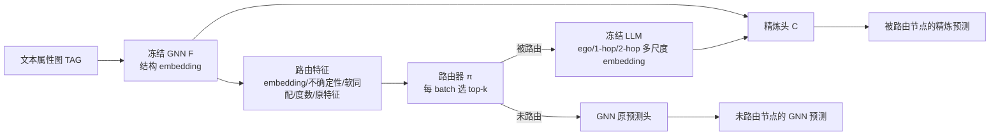

# Glance for Context: Learning When to Leverage LLMs for Node-Aware GNN-LLM Fusion

**会议**: ICLR 2026  
**OpenReview**: [https://openreview.net/forum?id=oODFyykHF5](https://openreview.net/forum?id=oODFyykHF5)  
**代码**: 待确认  
**领域**: 图学习 / 文本属性图 / GNN-LLM 融合  
**关键词**: text-attributed graph, GNN-LLM fusion, LLM routing, local homophily, heterophily, contextual bandit  

## 一句话总结
针对文本属性图，本文不再把 LLM 均匀地用在所有节点上，而是用一个轻量路由器只在 GNN 容易翻车的"异配（heterophilous）/低度数"节点上"瞄一眼"LLM，再用反事实优势信号训练这个不可微的路由决策，在显著减少 LLM 调用的同时把异配节点准确率最多拉高 +13%。

## 研究背景与动机
- **领域现状**：文本属性图（TAG）天然同时含文本与结构，主流做法是把 LLM 与 GNN 融合——要么 LLM-as-Enhancer（用文本 embedding 增强节点特征），要么 LLM-as-Predictor（把图序列化成文本让 LLM 直接分类）。
- **现有痛点**：几乎所有融合策略都是**对全图所有节点一视同仁地施加同一种融合**，结果整体指标只涨一点点，还把昂贵的 LLM 调用浪费在 GNN 本来就处理得很好的节点上，造成糟糕的精度-成本权衡。
- **核心矛盾**：GNN 在**高同配（连边同标签）+ 高度数**区域表现优异，而真实 TAG 里这些性质常常不成立；LLM 在低样本、异配节点上泛化更强，但把图序列化成文本会破坏结构关系，用在简单结构节点上反而帮倒忙。聚合指标把这种"此涨彼消"完全掩盖了。
- **本文目标**：回答"**该如何、以及为哪些节点调用 LLM 去补强 GNN**"，让 LLM 只在 GNN 真正失效的地方出手。
- **核心 idea**：**(1) 诊断信号**——系统评估现有路由启发式（度数/聚类密度/不确定性）发现它们极不稳定甚至不如随机，转而发现**局部同配度 hv 是预测"LLM 是否有益"的强信号**；**(2) 自适应路由**——提出 GLANCE，用一个廉价特征驱动的可学习路由器决定是否查 LLM，并用**反事实优势**目标训练这个不可微决策。

## 方法详解

### 整体框架
GLANCE（GNN with LLM Assistance for Neighbor- and Context-aware Embeddings）由三块组成：**冻结的 GNN/LLM 编码器**、**可训练的轻量路由器 π**、以及**融合 GNN 与 LLM 表示的精炼头 C**。流程是：先用预训练 GNN 给每个节点产出结构 embedding 与一组廉价路由特征 → 路由器据此对每个 batch 选出最该查 LLM 的 top-k 节点 → 被路由节点的多层邻域文本喂给 LLM 得到多尺度 embedding → 精炼头把 GNN 与 LLM embedding 拼接后给出最终预测；未被路由的节点直接沿用 GNN 原预测头。训练时只更新 π 和 C，GNN 与 LLM 全程冻结。

### 关键设计

**1. 用"软局部同配"做无标签路由先验：把诊断结论变成可推理时使用的信号。** 全文的诊断核心是：真实局部同配度 $h_v=\frac{1}{|N(v)|}\sum_{u\in N(v)}\mathbb{1}[y_u=y_v]$ 是判断 LLM 是否有益的最强指标（NCS 平均排名第一），但它依赖标签、推理时拿不到。GLANCE 因此先训练一个 MLP $Q$ 预测节点标签分布 $p_{Q,v}$，并把硬投票升级为软同配估计 $\hat h_v=p_{Q,v}\cdot\big(\frac{1}{|N_1(v)|}\sum_{u\in N_1(v)}p_{Q,u}\big)$，用类别概率的内积衡量"自己与邻居的类别一致程度"。之所以用 MLP 而非 GNN 来估同配，是为了避开 GNN 自身在异配上的结构偏置。这个 $\hat h_v$ 单独并不能完美路由，但作为先验把路由器偏向异配节点，再交给训练去校准。

**2. top-k 预算路由器：把"是否查 LLM"做成固定预算的相对决策。** 路由器是一个极简线性打分 $a_v=\pi(f_v)=\sigma(w^\top f_v)$，输入是一组廉价特征 $f_v$——GNN 结构 embedding、dropout 不确定性（难度代理）、软同配 $\hat h_v$、原始特征与度数（应对噪声特征或邻域信息不足的节点）。关键在于**不用绝对阈值**，而是每个 mini-batch 内选打分最高的 k 个节点路由到 LLM。这样既给定了固定查询预算（天然控成本），又避免了在全图层面标定路由概率的麻烦，也回避了"单一同配阈值在不同数据集上失效"的问题（Arxiv23 的收益峰值出现在 $h\approx0.5$ 而非最异配处）。

**3. 多尺度 LLM 邻域 embedding：模仿 GNN 聚合又控制 prompt 长度。** 对被路由节点，LLM 不像以往只产单一 embedding，而是把邻域序列化成三个层级——纯 ego 文本、ego+采样 1-hop 邻居、ego+采样 2-hop 邻居——分别编码再拼接 $z_L(v)=[z_{L,0}(v)\Vert z_{L,1}(v)\Vert z_{L,2}(v)]$。这既保留了 ego 与多跳邻居信息、对齐了高级 GNN 的多阶聚合，又因为采样使每个 prompt 长度可控；且采用 embedding 而非生成，省掉了昂贵的解码步骤。精炼头随后做 $p_{C,v}=\mathrm{softmax}\big(C([z_G(v)\Vert z_L(v)])\big)$，对 GNN/LLM backbone 完全解耦、可灵活替换。

**4. 反事实优势训练：让不可微的路由决策可学。** 路由是离散的、还要构造 prompt，无法直接反传。GLANCE 把它当作上下文 bandit：对被路由节点，同时算"查 LLM 的损失" $\ell_v^{(LLM)}$ 与"假如只用 GNN 的反事实损失" $\ell_v^{(GNN)}$（用 GNN 预训练头 H），奖励定义为
$$r_v=\begin{cases}\ell_v^{(GNN)}-\ell_v^{(LLM)}-\beta,&a_v\in\text{top-}k\\-\ell_v^{(GNN)},&\text{否则}\end{cases}$$
其中 $\beta\ge0$ 是 LLM 调用成本，越大越抑制无谓查询。路由损失用 REINFORCE 风格的 $\ell_v^{(route)}=-r_v\log\pi(f_v)-\lambda_H H_{ent}[\pi(f_v)]$（带熵正则鼓励探索），但训练时用确定性 top-k 选择以稳定有限预算的使用。总目标 $L=\frac{1}{|B|}\sum_v \ell_v^{(pred)}+\lambda_{router}\ell_v^{(route)}$ 联合优化预测精度与成本感知路由。

## 实验关键数据

### 主实验表格（整体准确率，3 次平均）

| 模型 | Cora | Pubmed | Arxiv23 |
|------|------|--------|---------|
| GCNII (Enhanced) | 87.7 | 92.1 | 80.2 |
| FAGCN (Enh.) | 89.4 | 91.8 | 79.2 |
| GGCN (Enh.) | 85.4 | 92.2 | 81.2 |
| **GLANCE** | **89.5** | **92.6** | **82.1** |

GLANCE 在三个数据集上均最优，平均较次优模型 +0.5%，且所用 LLM 查询量远低于以往方法。

### 消融实验表格（按局部同配分箱准确率，节选最异配 bin 0.00–0.25）

| 模型 | Cora | Pubmed | Arxiv23 |
|------|------|--------|---------|
| GCN (Enh.) | 17.9 | 55.9 | 27.8 |
| GCNII (Enh.) | 32.0 | 69.7 | 41.6 |
| **GLANCE** | **46.4** | **71.5** | **45.2** |

GLANCE 在最异配节点上相对 GNN baseline 提升显著（Cora 上 +13% 量级），同时在所有同配箱上的平均排名 2.4（次优 4.7），实现最佳的"跨子群平衡"。路由特征消融显示：去掉任一特征三数据集准确率都下降；**去掉同配特征时 $h_v<0.5$ 的异配节点掉 6.5%（Cora）/6.3%（Pubmed）**，证明同配信号是避免误路由的关键。

### 关键发现
- **现有启发式不稳定**：度数/聚类密度/不确定性的 NCS 因数据集而异，Cora 上不确定性甚至常为负、不如随机路由。
- **同配是强路由先验**：真实 $h_v$ 的 NCS 平均排名第一（上界），无标签的 $\hat h_v$ 在剔除 $h_v$ 后排名最佳。
- **路由的确偏向异配**：被路由且"获益"（GNN 错→LLM 对）的节点质量集中在低同配区，验证"异配捕捉了 GNN 失效模式"的假设。
- **预算 K 的双刃**：增大 K 通常稳定提升异配节点（如 Cora $K{=}12{\to}16$ 异配 +12.3%），但路由过多会把 GNN 本就处理好的"易"节点带偏；全 batch 路由反而掉点。
- **可扩展**：在比常见基准大数个量级的 Arxiv-Year 与 OGB-Products 上，仅用 ~1.6% 查询率（batch 64 取 K=1）仍领先，路由/精炼开销极小。

## 亮点与洞察
- **重构问题视角**：把"GNN-LLM 融合涨点少"从"LLM 不适合图"重新归因为"用法不对"——收益被异配处的提升与同配处的损失抵消了，聚合指标掩盖了这件事。这个 reframing 本身就有价值。
- **诊断驱动设计**：先做系统的节点分层分析找出"局部同配"这一可解释信号，再据此设计无标签代理 $\hat h_v$，而不是拍脑袋选阈值，方法论扎实。
- **成本-精度双赢**：把 LLM 当"按需 glance 的昂贵专家"而非"全图标配"，既省钱又因为避免在简单节点上引入 LLM 噪声而涨点，论证了选择性调用的双重收益。
- **bandit 式训练优雅**：用反事实优势 + top-k 预算把不可微的离散路由变成可学习目标，且天然内嵌成本项 $\beta$。

## 局限与展望
- 整体准确率提升幅度其实很小（+0.5% 量级），主要价值在异配子群与成本，"整体 SOTA"的卖点需结合分层指标才公平。
- 软同配 $\hat h_v$ 依赖辅助 MLP $Q$ 的标签预测质量，在标签极稀疏或特征极弱时这个先验可能退化。
- top-k 固定预算需要人工设定 K 与成本 $\beta$，论文也显示路由过多会掉点，预算自适应仍是开放问题。
- 仅在节点分类 + Qwen3-8B embedding 设定下验证，是否迁移到链接预测、其他 LLM/生成式路由、动态图等尚待探索。

## 相关工作与启发
- **静态 GNN-LLM 融合**：LLM-as-Enhancer / LLM-as-Predictor 两条主线，以及把 LLM 当 MoE 路由器在多个 GNN 间选择的工作——但后者仍受限于 GNN 偏置，本文是"选择性调用 LLM 本身"。
- **自适应 GNN-LLM 融合**：E-LLaGNN（固定度数/中心性启发式路由）、LOGIN（用 GNN 不确定性重连难节点，但可能删掉有用异配边）、LLM-GNN（用聚类密度做难度代理）。GLANCE 的差异在于：系统识别可预测 LLM 收益的结构属性而非预设阈值；保留图结构而非编辑它；直接在不可微查询下训练路由器。
- **启发**：异配/低度数作为"GNN 失效模式"的可操作信号，对任何想做"模型间分工/级联（small model + 昂贵大模型按需调用）"的系统都有借鉴意义——关键是找到一个廉价、无标签、可解释的难度先验。

## 评分
- **新颖性**: ⭐⭐⭐⭐ 把"何时调用 LLM"从启发式升级为诊断驱动的可学习节点级路由，反事实优势训练 + 软同配先验组合新颖。
- **实验充分度**: ⭐⭐⭐⭐ 覆盖路由信号系统评估、分层分析、特征消融、K 敏感性与两个大规模数据集，证据链完整；整体涨幅偏小是客观短板。
- **写作质量**: ⭐⭐⭐⭐ "先诊断后设计"的叙事清晰，NCS、stratified 分析等工具讲得明白。
- **价值**: ⭐⭐⭐⭐ 对大图上低成本部署 GNN-LLM、以及更广义的"按需调用昂贵模型"范式有实际指导意义。

<!-- RELATED:START -->

## 相关论文

- [\[ICLR 2026\] GNN-as-Judge: Unleashing the Power of LLMs for Graph Learning with GNN Feedback](gnn-as-judge_unleashing_the_power_of_llms_for_graph_learning_with_gnn_feedback.md)
- [\[ICLR 2026\] DAMR: Efficient and Adaptive Context-Aware Knowledge Graph Question Answering with LLM-Guided MCTS](damr_efficient_and_adaptive_context-aware_knowledge_graph_question_answering_wit.md)
- [\[ICLR 2026\] Graph Representational Learning: When Does More Expressivity Hurt Generalization?](graph_representational_learning_when_does_more_expressivity_hurt_generalization.md)
- [\[ICLR 2026\] On The Expressive Power of GNN Derivatives](on_the_expressive_power_of_gnn_derivatives.md)
- [\[ICML 2026\] GILT: An LLM-Free, Tuning-Free Graph Foundational Model for In-Context Learning](../../ICML2026/graph_learning/gilt_an_llm-free_tuning-free_graph_foundational_model_for_in-context_learning.md)

<!-- RELATED:END -->
