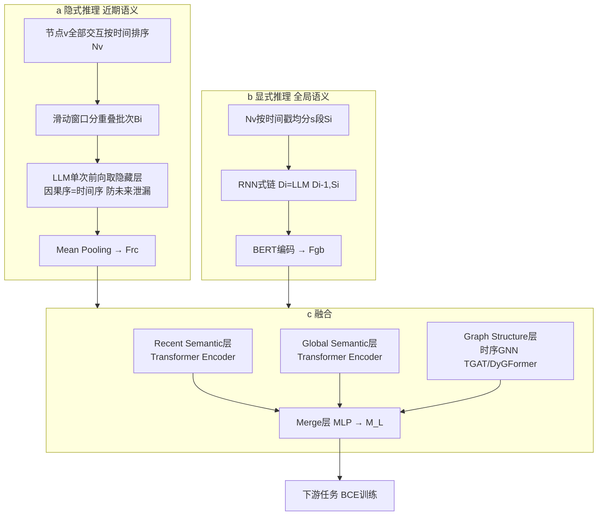

# Global-Recent Semantic Reasoning on Dynamic Text-Attributed Graphs with Large Language Models

**会议**: ICLR 2026  
**OpenReview**: [https://openreview.net/forum?id=puocvrFZRl](https://openreview.net/forum?id=puocvrFZRl)  
**代码**: [https://github.com/Nala-YN/DyGRASP](https://github.com/Nala-YN/DyGRASP)  
**领域**: 图学习 / 动态文本属性图 / LLM × GNN  
**关键词**: DyTAG, 动态图, 时序GNN, LLM推理, 隐式/显式推理, 链接预测  

## 一句话总结
DyGRASP 用 LLM 的**隐式推理**抓"近期语义依赖"、用**显式推理**抓"全局语义演化"，再与时序 GNN 融合，在动态文本属性图（DyTAG）上把目的节点检索 Hit@10 最高提升 34%，并将 LLM 推理复杂度从 $O(|E|\cdot d)$ 降到 $O(|E|)$。

## 研究背景与动机
**领域现状**：现实中的电商、知识图谱、社交网络大量呈现为**动态文本属性图（DyTAG）**——节点和交互（边）都带文本，且随时间演化，每条交互形如 $I=(u,r,v,t)$。但现有方法几乎都针对**静态** TAG：纯 GNN 擅长结构却只用 Bag-of-Words/词向量等浅层文本编码，语义理解弱；把 LLM 接入 TAG 的工作（TAPE、SimTeG、GraphGPT 等）又只生成**静态**嵌入或解释。

**现有痛点**：把这些方法直接搬到 DyTAG 有两个绕不过去的难点。其一，它们**忽略了"近期—全局"两种时间粒度的语义动态**——近期依赖（"notebook"跟在"逛书店"后更可能指笔记本、跟在"逛电子店"后更可能指电脑）和全局演化（用户兴趣从文学缓慢迁移到科技）。其二，**效率灾难**：DyTAG 的文本主要挂在边上，而边数比节点数高几个数量级、时间戳成百上千，朴素地为每条交互拼接其历史交互喂给 LLM，token 复杂度高达 $O(|E|\cdot d)$（$d$ 为平均度），完全无法扩展到真实图。

**核心矛盾**：要同时建模"多粒度时序语义"，又要把 LLM 在海量动态边上的推理开销压到可接受。

**本文目标**：提出一个既能捕捉近期+全局语义、又把 LLM 复杂度降到线性的 DyTAG 推理框架。

**核心 idea**：**用 LLM 的两种推理能力分工**——隐式推理（取隐藏层 embedding）配滑动窗口抓近期语义、显式推理（生成文本摘要）配 RNN 式链抓全局语义，再用三层结构与时序 GNN 融合结构信息。

## 方法详解

### 整体框架
DyGRASP（Dynamic Global-Recent Adaptive Semantic Processing）分三步：(a) **隐式推理**抽近期时序语义特征 $\mathbf{F}^{rc}$；(b) **显式推理**抽全局时序语义描述 $D_i$；(c) 通过 Recent/Global/Graph 三个语义层 + Merge 层，把两类语义与时序 GNN 的结构特征**逐层融合**成节点综合表示，喂给下游任务（目的节点检索、未来链接预测）。

### 关键设计

**1. 节点中心的隐式推理：借 LLM 因果序对齐时间序，一次前向喂完一个节点的历史**。朴素做法是边中心——为每条交互拼接其历史，复杂度 $O(|E|\cdot d)$。本文改成**节点中心**：把节点 $v$ 的所有交互 $N_v$ 按时间戳排成一条序列、一次性输入 LLM 取隐藏特征。关键洞察是 LLM 的**因果注意力（单向）天然与时间序的单向性一致**——序列里靠前的交互看不到靠后的，正好杜绝了未来信息泄漏；于是一次前向就能让所有交互同时获得来自各自历史的近期语义，把复杂度压到 $O(|E|)$（附录 C 有证明）。

**2. 滑动窗口机制：用重叠批次同时解决上下文长度、算力与长输入退化三个问题**。直接喂整条 $N_v$ 会撞上 LLM 上下文上限、显存和"输入越长性能越差"。于是把 $N_v$ 切成重叠批次：$B_i=\{I_k \mid \tfrac{c}{2}i+1\le k\le \tfrac{c}{2}i+c\}$，窗口长 $c$，**每批前 $c/2$ 条只作为后 $c/2$ 条的时序上下文**。每批用数据集专属 prompt 模板组织后送入 LLM，对每条交互的输出隐藏层做 mean pooling，得到近期语义特征 $\mathbf{F}^{rc}_i\in\mathbb{R}^{d_{LLM}}$。重叠保证了批与批之间近期依赖不断裂。

**3. 显式推理 + RNN 式推理链：让 LLM 像带记忆一样累积式总结节点的全局演化**。近期特征只覆盖局部，全局演化要靠 LLM 的**生成能力**。把 $N_v$ 按时间戳均分成 $s$ 段 $S_i$，用一条 RNN 式链迭代生成描述：$D_i=\text{LLM}(D_{i-1}, S_i)$，其中 $D_0$ 是节点原始文本属性。**关键是这个过程是累积的**——$D_{i-1}$ 不是上一段的局部特征，而是到当前段为止整个历史的滚动摘要，LLM 每步把新段 $S_i$ 并入旧摘要（$D_2$ 在 $D_1$ 基础上并入 $S_2$）。这样 $D_i$ 就编码了从 $S_1$ 到 $S_i$ 的长程语义演化，每条交互只被喂两次，整体仍是 $O(|E|)$。

**4. 三层语义 + Merge 层：把近期、全局、结构三路特征逐层对齐时间并融合**。融合阶段为预测时刻 $t$ 产出节点表示。**Recent Semantic 层**对 $N^t_v$（$t$ 之前的交互）的 $\mathbf{F}^{rc}_i$ 用可学习时间编码器编码时间间隔 $\Delta t_i=t-t_i$ 并拼接 $R^{(0)}_i=[P(\mathbf{F}^{rc}_i)\,\|\,T(t-t_i)]$，再过 Transformer Encoder；**Global Semantic 层**对 BERT 编码的 $\mathbf{F}^{gb}_i$ 同样拼时间编码、过 Transformer，并用 $\hat i=\max\{i\mid\hat t_i<t\}$ 截断防泄漏；**Graph 层**用 $S^{(l)}=\text{MergeTGNN}(M^{(l-1)},\text{MPG}(v,t))$ 兼容任意消息传递时序 GNN（实现用 TGAT/DyGFormer）。三路经读出后用 MLP 融合：$M^{(l)}=\text{Merge\_Layer}(\mathcal{R}_r(\{R^{(l)}_i\}),\mathcal{R}_g(\{G^{(l)}_i\}),S^{(l)})$，其中近期取 mean pooling、全局取链末特征 $G^{(l)}_{\hat i}$（因 RNN 链与注意力已把历史汇聚到末端）。最终 $M^{(L)}$ 经 MLP + BCE 损失端到端训练。

## 实验关键数据

### 主实验表格（目的节点检索 Hit@10 %，以 DyGFormer 为底座）

| 数据集 | DyGFormer | DyGRASP(DyGFormer) | 提升 | 设定 |
|---|---|---|---|---|
| GDELT | 91.64 | **93.24** | +1.60 | 转导 |
| Enron | 92.04 | **99.40** | +7.36 | 转导 |
| Googlemap | 51.32 | **85.88** | +34.56 | 转导 |
| Stack_elec | 94.39 | **99.59** | +5.20 | 转导 |
| Googlemap | 43.84 | **81.14** | +37.30 | 归纳 |
| Stack_elec | 56.23 | **99.74** | +43.51 | 归纳 |

以 TGAT 为底座时归纳设定下 Stack_elec 也有 +45.48 的提升；未来链接预测（AP/AUC）同样全面领先。文本越丰富的数据集提升越大，凸显 LLM 的作用。

### 消融实验表格（Hit@10 %，Enron / Googlemap_CT 转导）

| 配置 | Enron | Googlemap_CT |
|---|---|---|
| Ours（完整） | **99.40** | **87.28** |
| −Global | 94.89 | 82.30 |
| −Recent | 97.31 | 81.73 |
| −Recent & −Global | 92.04 | 51.32 |

### 关键发现
- **近期与全局模块互补**：单独加任一模块都涨，两个一起加超过任一单独，证实"近期—全局"语义互补。
- **跨 LLM 强泛化**：在 Qwen2.5、Mistral、Llama-3.1 三族 LLM 上表现稳定、波动极小（如 Enron 上分别 99.05/97.98/99.40）。
- **跨 GNN 泛化**：换 TGAT 或 DyGFormer 底座都有显著增益，模块化设计兼容任意消息传递时序 GNN。
- **效率**：理论证明复杂度从 $O(|E|\cdot d)$ 降到 $O(|E|)$，使方法能扩展到百万级边的真实 DyTAG（JODIE/DyRep 在大图上直接 OOM）。

## 亮点与洞察
- **"因果序 = 时间序"这一观察很巧**：直接复用 LLM 的单向注意力来防未来泄漏，省掉了额外的掩码工程，还顺带把节点的全部历史压成一次前向。
- **隐式/显式推理分工**契合两种语义粒度：隐藏 embedding 适合细粒度近期依赖，生成式摘要适合粗粒度全局演化，分工干净。
- **RNN 式累积摘要链**把"长上下文"问题转化为"短上下文 + 状态传递"，既省 token 又保留长程记忆。

## 局限与展望
- 全局推理链是**串行**的（$D_i$ 依赖 $D_{i-1}$），对超长历史节点训练/推理可能成为时延瓶颈。
- 近期与全局的 token 预算由窗口长 $c$、段数 $s$ 等超参控制，需逐数据集调；prompt 模板也是数据集专属，迁移到新域需人工设计。
- 全局摘要由 LLM 生成，存在幻觉/语义漂移风险，文中未深入量化生成描述的事实一致性。
- 评测集中在 DTGB 的 4 个数据集与检索/链接预测两类任务，节点分类等任务验证较少。

## 相关工作与启发
- **LLM for TAG**（TAPE/SimTeG/GraphGPT/ENGINE）：把 LLM 文本理解接入静态图，本文指出其无法建模时序语义关系。
- **时序 GNN**（TGAT/CAWN/DyRep/DyGFormer/GraphMixer）：擅长结构演化但读不懂文本语义，本文将其作为可插拔的结构底座。
- **LLM for DyTAG**（与本文并行的 LKD4DyTAG/CROSS/GAD，及基准 DTGB）：均未解决 LLM 在动态边上的推理效率，也未显式区分"近期—全局"多粒度语义——这正是 DyGRASP 的差异化切入点。
- **启发**：当"长序列 + 海量边 + 文本"三者叠加时，与其拼长上下文，不如让 LLM 做"节点中心一次性隐式编码 + 累积式显式摘要"，把复杂度从乘性降到加性。

## 评分
- **新颖性**: ⭐⭐⭐⭐ — "因果序=时间序"的隐式推理 + RNN 式累积全局摘要的组合在 DyTAG 上较新颖，且把效率从 $O(|E|d)$ 降到 $O(|E|)$ 有理论支撑。
- **实验充分度**: ⭐⭐⭐⭐ — 4 数据集 × 2 任务 × 2 设定，跨 3 族 LLM、2 种 GNN 的泛化与消融较完整；任务覆盖面与节点分类验证略欠。
- **写作质量**: ⭐⭐⭐⭐ — 动机（近期/全局例子）讲得清楚，方法分层叙述、图示到位。
- **价值**: ⭐⭐⭐⭐ — DyTAG 是工业界常见场景，最高 34%（Hit@10）/45%（归纳）的提升与线性复杂度有较强实用价值，代码开源。

<!-- RELATED:START -->

## 相关论文

- [\[ICLR 2026\] GDGB: A Benchmark for Generative Dynamic Text-Attributed Graph Learning](gdgb_a_benchmark_for_generative_dynamic_text-attributed_graph_learning.md)
- [\[NeurIPS 2025\] Dynamic Bundling with Large Language Models for Zero-Shot Inference on Text-Attributed Graphs](../../NeurIPS2025/graph_learning/dynamic_bundling_with_large_language_models_for_zero-shot_inference_on_text-attr.md)
- [\[CVPR 2026\] Mario: Multimodal Graph Reasoning with Large Language Models](../../CVPR2026/graph_learning/mario_multimodal_graph_reasoning_with_large_language_models.md)
- [\[ICML 2025\] Graph-constrained Reasoning: Faithful Reasoning on Knowledge Graphs with Large Language Models](../../ICML2025/graph_learning/graph-constrained_reasoning_faithful_reasoning_on_knowledge_graphs_with_large_la.md)
- [\[ICLR 2026\] Knowledge Reasoning Language Model: Unifying Knowledge and Language for Inductive Knowledge Graph Reasoning](knowledge_reasoning_language_model_unifying_knowledge_and_language_for_inductive.md)

<!-- RELATED:END -->
