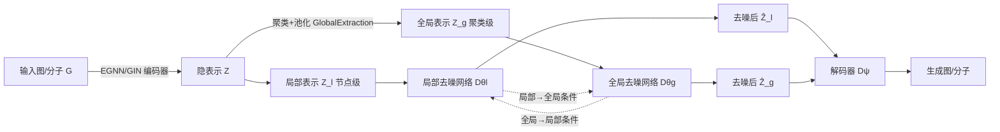

# Global and Local Topology-Aware Graph Generation via Dual Conditioning Diffusion

**会议**: ICLR 2026  
**OpenReview**: [https://openreview.net/forum?id=IZV9k5BGxi](https://openreview.net/forum?id=IZV9k5BGxi)  
**代码**: 待确认  
**领域**: 图生成 / 隐空间扩散模型  
**关键词**: 图生成, 隐空间扩散, 全局-局部依赖, 双向条件, 分子生成  

## 一句话总结
DualDiff 把图同时拆成节点级（局部）和聚类级（全局）两条扩散支路，并用一套「双向条件」机制让全局与局部信息在去噪过程中交替互为条件，从而在统一隐空间里联合建模 $p(Z_l, Z_g)$，显著提升了通用图与分子图的生成质量。

## 研究背景与动机
- **领域现状**：扩散模型已成为图生成的主流范式，隐空间扩散（GEOLDM、LGD、EDM-SyCo 等）进一步把扩散从原始图空间搬到低维隐空间，兼顾效率与可扩展性。
- **现有痛点**：主流方法基本是「节点级」生成——把每个节点当作独立实体逐个去噪，难以刻画子结构内部及子结构之间的耦合依赖。少数引入全局信息的工作（SubgDiff 的子图预测、Graphusion 的聚类伪标签）只是把全局信息当成单向引导，**忽略了子结构之间的依赖，也没有真正建模全局与局部的联合分布**。
- **核心矛盾**：图数据天然具有多尺度耦合依赖——分子里既有官能团这类局部细节，也有官能团空间分布这类全局拓扑；二者相互影响。单向、单尺度的建模无法同时把两端讲清楚。
- **本文目标**：设计一个统一的生成模型，能**动态地**同时捕获全局与局部拓扑信息，建模二者的联合分布。
- **核心 idea**：**「联合分布双向分解」**——利用 $p(Z_l, Z_g)=p(Z_l|Z_g)p(Z_g)=p(Z_g|Z_l)p(Z_l)$ 这一恒等式，把联合建模拆成「全局→局部」和「局部→全局」两个互补过程，并用一个双向条件机制让两条扩散支路交替互为条件，从而获得全局与局部的双重拓扑感知能力。

## 方法详解

### 整体框架
DualDiff 是一个两阶段的隐空间扩散框架：先用预训练图自编码器把图 $G=(H,A)$ 映射到统一隐空间得到局部表示 $Z_l\in\mathbb{R}^{N\times d}$，再对 $Z_l$ 聚类聚合出全局表示 $Z_g\in\mathbb{R}^{K\times d}$；随后在隐空间里跑一个「节点级 + 聚类级」的两支路扩散，并通过双向条件机制让两支路在去噪时交替交换信息，最后由解码器联合 $\hat Z_l,\hat Z_g$ 重建图。

### 关键设计

**1. 全局信息抽取：用聚类把"子结构拓扑"显式编码进全局支路。** 框架先把图编码进隐空间得到逐节点的局部表示 $Z_l$，全局表示则由聚类得到——这是整个方法能"看见"全局拓扑的源头。论文按图类型选不同聚类策略：分子图在原子坐标空间跑 K-means 得到几何增强的类别标签，通用图则用图拉普拉斯特征向量的谱聚类切分社区。拿到簇分配矩阵 $S_g\in\{0,1\}^{N\times K}$ 后，对每簇内节点做池化得到簇级嵌入 $Z_g = \mathrm{Pooling}(S_g, Z)\in\mathbb{R}^{K\times d}$。这样 $Z_g$ 就承载了"哪些节点属于同一子结构、子结构之间如何分布"这类长程、整体性的依赖，而这些恰恰是逐节点表示难以表达的。

**2. 两支路扩散：节点级与聚类级各跑一套 SDE。** 由于全局结构与局部细节的拓扑特性不同，DualDiff 在隐空间里对 $Z_l$ 和 $Z_g$ 分别定义前向 SDE：$\mathrm{d}Z_{l,t}=f_{l,t}\mathrm{d}t+s_{l,t}\mathrm{d}W_{l,t}$，$\mathrm{d}Z_{g,t}=f_{g,t}\mathrm{d}t+s_{g,t}\mathrm{d}W_{g,t}$，并在 EDM 框架下取漂移项为 0、扩散项 $s_{l,t}=s_{g,t}=\sqrt{2t}$。两条支路各配一个 GNN 去噪网络 $D_{\theta_l},D_{\theta_g}$，训练目标是让它们分别从带噪输入恢复干净的局部/全局隐表示：$\mathbb{E}[\|D_{\theta_l}(\tilde Z_l,\sigma)-Z_{l,0}\|^2 + \|D_{\theta_g}(\tilde Z_g,\sigma)-Z_{g,0}\|^2]$。但若两支路各自为政，就只能学到各自的边缘分布，无法刻画二者的联合依赖——这正是下一个设计要解决的。

**3. 双向条件机制：让全局与局部交替互为条件，逼近联合分布。** 这是论文的核心。基于 $p(Z_l,Z_g)=p(Z_l|Z_g)p(Z_g)=p(Z_g|Z_l)p(Z_l)$，联合建模被拆成两个互补过程：过程 (i) 把全局注入局部（对应 $p(Z_l|Z_g)$），过程 (ii) 把局部注入全局（对应 $p(Z_g|Z_l)$）。实现上先借自条件（self-conditioning）拿到上一步预测的 $\hat Z_{l,0},\hat Z_{g,0}$，再以概率 $p$ 在两过程间切换：以概率 $p$ 取 $(C_l,C_g)=((\hat Z_{l,0},\hat Z_{g,0}),0)$ 走过程 (i)，否则取 $(0,(\hat Z_{l,0},\hat Z_{g,0}))$ 走过程 (ii)——其中某支条件被置零恰好天然契合自条件的鲁棒性设计。过程 (i) 受 FiLM 启发，把全局表示 $\hat Z_{g,0}$ 经线性变换产生逐簇的缩放/平移参数 $\gamma_i,\beta_i$，每个节点按与各簇的相似度被分配到簇 $y_i$，再用对应参数调制局部输出：$\hat Z_{l,0}^{\prime,i}=\gamma_{y_i}\odot\hat Z_{l,0}^i+\beta_{y_i}$，其中 $y_i=\arg\max_j \mathrm{sim}(\hat Z_{l,0}^i,\hat Z_{g,0}^j)$。过程 (ii) 反过来，把局部细节经消息传递与池化压成低维全局条件 $C=\mathrm{Linear}(\mathrm{Pool}(\mathrm{MP}(\hat Z_{l,0})))$，再与自条件拼接后喂给全局去噪网络。

**4. 交替采样：借联邦学习"server-client"思路稳住生成。** 训练/采样采用两阶段策略——自编码器先预训练并固定，再训练扩散。受联邦学习中"服务器累积多次客户端更新后再聚合"的启发，论文把全局簇类比为 server、对应节点类比为 client，过程 (i)/(ii) 分别对应本地更新/全局聚合，因此采样时**每 $m$ 步过程 (i) 才穿插 1 步过程 (ii)**（采样算法里以 `t % (m+1) == 0` 触发全局聚合）。这种交替（而非两过程同时执行）显著提升了采样稳定性与生成质量。

## 实验关键数据

### 主实验表格

通用图生成（Planar / SBM，MMD 越低越好，V.U.N. 越高越好）：

| 模型 | Planar Clus.↓ | Planar Spec.↓ | Planar V.U.N.↑ | SBM Deg.↓ | SBM Spec.↓ |
|------|------|------|------|------|------|
| DiGress | 0.0372 | 0.0106 | 75.0 | 0.0013 | 0.0400 |
| GruM | 0.0353 | 0.0062 | 90.0 | 0.0007 | 0.0050 |
| GraphBFN | 0.0294 | 0.0046 | 96.7 | 0.0005 | 0.0053 |
| **DualDiff** | **0.0275** | **0.0038** | **97.5** | **0.0004** | **0.0042** |

分子生成（ZINC250k，FCD / KL 越高越好）：

| 方法 | FCD↑ | KL↑ | Novelty↑ | Validity↑ |
|------|------|------|------|------|
| DiGress | 0.65 | 0.91 | 0.99 | 0.85 |
| GruM | 0.64 | N.A. | 1.00 | 0.99 |
| EDM-SyCo | 0.85 | 0.96 | 1.00 | 0.88 |
| **DualDiff** | **0.91** | **0.98** | 1.00 | 0.92 |

3D 分子生成（QM9）：DualDiff 在 Valid & Unique 上达 **99.3%**，明显高于 GEOLDM(92.7%)、EQUIFM(93.5%)，原子/分子稳定性持平。

### 消融实验表格

双向条件机制消融（ZINC250k）：

| 配置 | FCD↑ | KL↑ |
|------|------|------|
| 无任何条件 | 0.65 | 0.82 |
| 自条件 | 0.72 | 0.89 |
| 仅 $Z_l\to Z_g$ | 0.75 | 0.95 |
| 仅 $Z_g\to Z_l$ | 0.83 | 0.95 |
| **双向 $Z_g\leftrightarrow Z_l$** | **0.91** | **0.98** |

### 关键发现
- **双向条件远胜自条件**：从自条件的 FCD 0.72 提升到双向的 0.91，证明全局-局部交互本身才是质量增益的主因，而非单纯多了一路条件。
- **单向也有用但不够**：$Z_g\to Z_l$（全局引导局部）单独就能到 0.83，比 $Z_l\to Z_g$ 更有效，说明全局拓扑对局部细节的引导价值更大；但只有双向才能逼近联合分布。
- **对比层次化方法更优**：相比 HiGen、PPGN 这类自回归/由粗到细的层次化生成，DualDiff 的动态交互在 Planar/SBM 多项指标上更优，说明"交替互为条件"比"逐层细化"更能抓住联合分布。
- **参数甜点区**：过程 (i) 频率 $p$ 取中等值最佳；采样时增大 $m$（更关注局部细节）能提升表现；簇数 $K$ 偏小即可——既省算力又保留关键全局信息。
- **效率可控**：仅约 200 步即达竞争性结果，双向条件带来的额外开销在可接受范围。

## 亮点与洞察
- **用一条概率恒等式串起整套设计**：$p(Z_l,Z_g)$ 的两种链式分解直接对应"全局→局部""局部→全局"两个过程，使双向条件不是工程拼凑，而是有清晰的概率解释。
- **巧妙复用自条件的"置零"语义**：双向切换时某支条件被置零，恰好与自条件"以一定概率丢弃条件来增强鲁棒性"对齐，让两套机制无缝融合。
- **联邦学习类比给采样调度提供了直觉**：把全局簇当 server、节点当 client，$m:1$ 的交替节奏把"何时做全局聚合"讲出了道理，且实测比同时执行更稳。
- **通用性强**：编码器可换 EGNN（带 3D 坐标的化学/生物图，保证 SE(3) 等变）或 GIN/GCN/GAT（通用图），同一框架覆盖通用图、2D 分子、3D 分子三类任务。

## 局限与展望
- **依赖聚类质量与策略选择**：全局信息完全来自聚类，分子用 K-means、通用图用谱聚类，需按图类型手工选；聚类不准会直接污染全局支路，论文未充分讨论聚类失败的退化情况。
- **超参数较多**：$p$、$m$、$K$ 都需调，且都有"甜点区"，迁移到新数据集时调参成本不低。
- **Validity 并非最强**：ZINC250k 上 Validity 0.92 仍低于 GruM(0.99)、MoLeR(1.00)，全局-局部联合建模在提升分布匹配（FCD/KL）的同时未能同步把化学合法性拉满。
- **两阶段训练**：自编码器需先单独预训练并固定，端到端联合优化的潜力尚未挖掘。
- **展望**：可探索可学习/自适应聚类替代固定聚类、把双向条件推广到更多尺度（多层级而非两级），以及条件生成（论文已在附录初步验证）等方向。

## 相关工作与启发
- **隐空间图扩散（GEOLDM / LGD / EDM-SyCo）**：提供了"先自编码进隐空间再扩散"的范式，DualDiff 沿用其编码-扩散-解码骨架，但把单支路扩散扩展为双支路。
- **引入全局信息的图生成（SubgDiff / Graphusion）**：用子图预测或聚类伪标签做单向引导，DualDiff 指出其忽略子结构间依赖、未建模联合分布，并用双向条件补上这一缺口。
- **自条件（Self-Conditioning）**：DualDiff 在其基础上扩展——不仅回喂自身预测，还交替回喂"另一尺度"的预测，把单尺度自条件升级为跨尺度双向条件。
- **FiLM 特征调制**：过程 (i) 直接借用 FiLM 的缩放-平移参数化，把全局簇级信息以逐簇调制的方式注入局部节点。
- **启发**：当数据存在天然的多尺度耦合依赖（图、分子、甚至层次化文本/图像）时，"用概率链式分解指导多支路交替互为条件"是一个可迁移的联合建模范式。

## 评分
- **新颖性**: ⭐⭐⭐⭐ —— 用概率恒等式把联合分布拆成两个互补的条件过程、再设计双向交替条件机制，思路清晰且区别于现有单向引导与层次化生成。
- **实验充分度**: ⭐⭐⭐⭐ —— 覆盖通用图、2D/3D 分子共 8 个数据集，含与层次化方法对比、双向条件消融、$p/m/K$ 参数分析与效率分析，较为完整。
- **写作质量**: ⭐⭐⭐⭐ —— 动机—恒等式—双过程—采样调度的逻辑链顺畅，图 1/图 2 把机制讲清；个别记号（如 $\hat Z_{l,0}$ 的多版本上标）稍密。
- **价值**: ⭐⭐⭐⭐ —— 多尺度联合建模对分子设计/药物发现等图生成应用有实际意义，框架通用、可迁移，但 Validity 等指标仍有提升空间。

<!-- RELATED:START -->

## 相关论文

- [\[NeurIPS 2025\] DuetGraph: Coarse-to-Fine Knowledge Graph Reasoning with Dual-Pathway Global-Local Fusion](../../NeurIPS2025/graph_learning/duetgraph_coarse-to-fine_knowledge_graph_reasoning_with_dual-pathway_global-loca.md)
- [\[ICLR 2026\] FSD-CAP: Fractional Subgraph Diffusion with Class-Aware Propagation for Graph Feature Imputation](fsd-cap_fractional_subgraph_diffusion_with_class-aware_propagation_for_graph_fea.md)
- [\[ICLR 2026\] Discrete Bayesian Sample Inference for Graph Generation](discrete_bayesian_sample_inference_for_graph_generation.md)
- [\[ICLR 2026\] Topology Matters in RTL Circuit Representation Learning](topology_matters_in_rtl_circuit_representation_learning.md)
- [\[ICML 2026\] L2G-Net: Local to Global Spectral Graph Neural Networks via Cauchy Factorizations](../../ICML2026/graph_learning/l2g-net_local_to_global_spectral_graph_neural_networks_via_cauchy_factorizations.md)

<!-- RELATED:END -->
