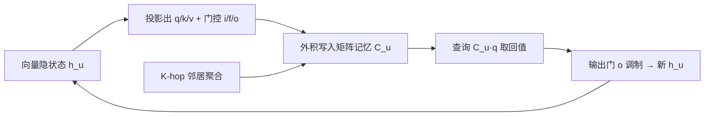

# gLSTM: Mitigating Over-Squashing by Increasing Storage Capacity

**会议**: ICLR 2026  
**OpenReview**: [https://openreview.net/forum?id=c4mXEOXlAL](https://openreview.net/forum?id=c4mXEOXlAL)  
**代码**: 论文承诺开源（PyG GraphGym 框架，配置+绘图代码随附）  
**领域**: 图神经网络 / 图表示学习  
**关键词**: over-squashing, 存储容量, 关联记忆, xLSTM, fast weight programmers, 消息传递  

## 一句话总结
本文把 GNN 的 over-squashing 拆成"灵敏度受限"和"存储容量饱和"两个独立失效模式，提出能单独度量容量瓶颈的 NAR 合成任务，并把 xLSTM 的关联记忆/门控机制搬进消息传递，构造出显式扩大节点存储容量的 gLSTM 架构。

## 研究背景与动机
**领域现状**：消息传递神经网络（MPNN）是图学习的主流范式，但深层 MPNN 长期受 over-squashing 困扰——一个指数级增长的感受野被压进固定大小的向量，形成信息瓶颈。Alon & Yahav (2021) 最早提出这个问题时把它描述为"信息装不下"的**容量**问题；而 Topping et al. (2022)、Di Giovanni et al. (2023) 后续工作把它重新表述为节点 Jacobian 上界刻画的**灵敏度**问题，并由此成为社区主流视角。

**现有痛点**：把两种视角混为一谈带来两个后果。其一，主流的合成评测任务（如 RingTransfer）整张图除了目标节点全是常数填充，根本不考验"存多少信息"，只考验长距离信号传播；而 Tree-NeighborsMatch 虽然控制了信息量，却用深二叉树传播，灵敏度随深度指数衰减，**容量和灵敏度两种失效叠加在一起无法分离**。其二，绝大多数缓解手段（图重连、控制信息流）都瞄准灵敏度/拓扑瓶颈，几乎没有工作从**架构层面直接增大存储容量**。

**核心矛盾**：over-squashing 既是"信息传不过来（灵敏度低）"也是"信息存不下（容量饱和）"，但两者根因、表现、解法都不同，混在一起既测不准也修不对。

**本文目标**：在浅层（2 层）regime 下把容量问题从灵敏度、梯度消失中**剥离出来**单独研究，并给出一个专门增大容量的架构。

**核心 idea**：**【容量视角】**把 over-squashing 重新定义为节点表示"还能不能再多存一点信息"，**【借力序列建模】**从关联记忆、fast weight programmers 和 xLSTM 借来矩阵记忆 + 外积更新 + 指数门控，让每个节点除了向量隐状态再维护一个矩阵记忆来扩容。

## 方法详解

### 整体框架
本文有两条主线：先在概念和评测上把容量与灵敏度分开（NAR 任务），再在架构上针对容量瓶颈给出 gLSTM。gLSTM 给每个节点 $u$ 在常规向量隐状态 $h_u^{(l)}$ 之外，额外维护一个**矩阵隐状态** $C_u^{(l)}$ 充当关联记忆：邻居的键值对通过外积写进这个矩阵，下一层再用查询向量去矩阵里"取回"对应的值，从而把单节点能存的信息量从向量维度提升到矩阵规模。

### 关键设计

**1. 容量 over-squashing 与 NAR 任务：把容量从灵敏度里抠出来**。作者主张 over-squashing 应按**失效模式**而非按"计算树 vs 拓扑瓶颈"来划分，于是定义存储容量为"节点表示能为后续使用存下的信息量"，表示饱和即装不下更多信息。为单独度量它，提出 Neighbor Associative Recall（NAR）：构造 $N+3$ 个节点的图——$N$ 个邻居节点各带一个键值对 $x_n=[e_k(k_n); e_v(v_n)]$，全连到一个中心节点，中心节点再经一个中间节点连到查询节点，查询节点只携带某个键 $x_q=[e_k(k_m); 0]$，要求中心节点预测对应的值 $v_m$（交叉熵，one-hot 目标）。关键在于这是**浅层（2 层）单层高度数**任务：第一层中心节点必须把全部邻居键值无差别存下，第二层才知道要查哪个——感受野不随深度指数膨胀，因此灵敏度和梯度消失被规避，纯粹考验"一个节点到底能存多少键值对"。

**2. gLSTM 的矩阵记忆与外积更新：把 xLSTM 搬进消息传递**。每个节点维护矩阵记忆 $C_u^{(l)}$ 和归一化向量 $n_u^{(l)}$，按 FWP 风格的外积规则更新——遗忘门 $f$ 衰减旧记忆，输入门 $i$ 把邻居（含自身）的值⊗键写入：
$$C_u^{(l)} = f_u^{(l)} C_u^{(l-1)} + \sum_{v\in N_u^{(l)}\cup\{u\}} i_v^{(l)}\, v_v^{(l)} \otimes k_v^{(l)}$$
查询、键、值都是上一层隐状态的投影，其中查询 $q_u^{(l)} = W_q[h_u^{(l-1)};\sum_{v\in N_u}h_v^{(l-1)}]$ 把**节点自身**与**邻居聚合**拼接后再投影，使"取什么"既依赖自己也依赖邻域。输出由记忆查询经归一化后再过输出门：
$$\tilde h_u^{(l)} = \frac{C_u^{(l)} q_u^{(l)}}{\max\{|n_u^{(l)\top} q_u^{(l)}|,\,1\}},\qquad h_u^{(l)} = o_u^{(l)} \odot \tilde h_u^{(l)}$$
沿用 xLSTM 的**指数门控**（$i,f$ 用 exp，配 max 稳定项 $m_u^{(l)}$ 防溢出），让模型像 xLSTM 一样能"修订存储决策"。最大可正交存储的键/值数等于记忆维度——这正是实验中容量饱和拐点的理论位置。

**3. mLSTM 式块结构 + K-hop 聚合：稳梯度并给召回提供归纳偏置**。借鉴 Arroyo et al. (2025)，灵敏度 over-squashing 很大程度源于梯度消失，故 gLSTM 复用 mLSTM 块结构：**残差连接**把逐层 Jacobian 范数拉到"混沌边缘"，输入/隐状态归一化调节 Jacobian 量级，从而即便堆层也不致信号衰减。聚合上采用 **K-hop**——第 $l$ 层节点 $u$ 直接从图距离恰为 $l$ 的节点 $N_u^{(l)}=\{v: d_G(u,v)=l\}$ 取信息，配合每步把隐状态作为输入的递归。这个高连通结构既缓解灵敏度瓶颈，又给召回机制提供了关键归纳偏置：已写入记忆的信息不再混入后续消息传递轮次，后来的节点可以**隔离地**去查询这块记忆，因而合成任务和几乎所有真实 benchmark 都从 K-hop 显著受益。

## 实验关键数据

### 主实验表格（GPP 长程任务，log₁₀(MSE)，越低越好）

| Method | Diam. | Ecc. | SSSP |
|---|---|---|---|
| GCN | 0.742 | 0.846 | 0.950 |
| GIN | 0.613 | 0.950 | -0.541 |
| GCNII | 0.529 | 0.764 | -1.132 |
| A-DGN | -0.546 | 0.305 | -3.402 |
| **gLSTM (ours)** | **-0.715** | **-4.036** | -2.836 |
| gLSTM − K-hop | 0.042 | 0.673 | -3.377 |

LRGB（500k 参数上限）：

| Method | Peptides-Func AP↑ | Peptides-Struct MAE↓ |
|---|---|---|
| GCN | 0.6860 | 0.2460 |
| GPS | 0.6534 | 0.2509 |
| kGCN-SSM | 0.6902 | 0.2581 |
| **gLSTM (ours)** | **0.7250** | 0.2527 |

### 消融实验表格（K-hop 的作用）

| 设置 | Diam. | Ecc. | Peptides-Func |
|---|---|---|---|
| gLSTM 完整 | **-0.715** | **-4.036** | **0.7250** |
| − K-hop | 0.042 | 0.673 | 0.6030 |

去掉 K-hop 后多数任务大幅退化（仅 SSSP 例外，K-hop 反而略降）。

### 关键发现
- **NAR 上 gLSTM 完胜 GCN**：gLSTM 在邻居数 $N$ 不超过记忆维度前保持完美召回，超过后是"优雅饱和"式缓慢下降；而最大 GCN 在 $N=8$ 就开始容量饱和。
- **容量与灵敏度确实可分离**：用 Jacobian 范数度量的灵敏度与 NAR 性能不相关——GCN 在 $N>16$ 后灵敏度回升但性能不涨，gLSTM 性能开始退化时灵敏度仍在上升，证明**容量 over-squashing 可独立于灵敏度 over-squashing 发生**。
- **选择性灵敏度才对得上容量**：被选中邻居 vs 背景邻居的 Jacobian 范数之比、以及 Di Giovanni 的 mixing/Hessian 指标，都在各自容量拐点处塌缩或 plateau，说明容量饱和损害的是"选择性地区分不同节点"的能力。
- gLSTM 在 Diameter/Eccentricity 上达到 SOTA，Peptides-Func 明显领先；Peptides-Struct 偏弱，作者推测该任务长程交互不重要、浅层 GCN 已能很好解决。

## 亮点与洞察
- **概念解耦本身就是贡献**：把被 Topping et al. 主导的"灵敏度叙事"重新拆出"容量叙事"，澄清了文献里长期的语义混乱，并给出可操作的评测（NAR）和解法（gLSTM）两条落地路径。
- **NAR 的精巧在于"浅而宽"**：用单层高度数节点而非深二叉树，第一次把容量瓶颈从深度耦合的灵敏度/梯度消失中干净剥离，这是方法论上很扎实的一步。
- **跨领域迁移有据可循**：关联记忆 = 矩阵外积写入 + 查询取回，把序列建模里 FWP/xLSTM 的"扩容"经验严格对应到图上"单节点存多少键值对"，并用"正交键数 = 记忆维度"给出可验证的饱和拐点预测。
- 实验里"优雅饱和"（graceful saturation）现象与 Smolensky (1990) 的张量积表示理论呼应，给容量视角添了一层理论联想。

## 局限与展望
- **容量缺数学刻画**：灵敏度有 Jacobian 上界这样的理论工具，容量目前只能靠合成任务经验度量，作者把"理论量化容量并建立与拓扑/模型属性的联系"列为首要未来工作。
- **牺牲了效率与并行训练**：把 xLSTM 的门控+关联记忆搬到图上时丢掉了原本的并行训练与高效推理，矩阵记忆也带来额外开销；作者指向 Pöppel et al. (2025) 在有向无环图上的高效化方向。
- **任务依赖性强**：Peptides-Struct 上表现平平，说明 gLSTM 的增益主要体现在真正需要长程/大容量的任务，对短程任务无优势甚至可能多余。
- 参数对比为"偏向 GCN"而设，矩阵 vs 向量记忆的公平比较本身就 nontrivial，绝对增益的解读需谨慎。

## 相关工作与启发
- **over-squashing 谱系**：Alon & Yahav (2021) 容量起源 → Topping et al. (2022)/Di Giovanni et al. (2023) 灵敏度 Jacobian 上界 → Arroyo et al. (2025) 用梯度消失/over-smoothing 精化深度关系 → 本文回归容量并与灵敏度并列。
- **缓解手段对照**：图重连（DIGL、DRew、LASER）和信息流控制（Gated GCN、Errica et al.）瞄准灵敏度/拓扑；本文是少见的"架构层扩容"路线。
- **序列建模借力**：FWP（Schmidhuber 1992、Schlag et al. 2021）、xLSTM（Beck et al. 2024）、关联记忆（Hopfield 1982、Ba et al. 2016）是 gLSTM 的直接思想来源；K-hop 聚合呼应 ChebNet 与 Ding et al. (2024)。
- **启发**：把"失效模式"而非"成因"作为问题划分维度，是处理被混淆的旧问题（如 over-smoothing vs over-squashing）的有效套路；为某个被忽视的失效模式专门设计"隔离式"合成任务，是验证新视角的高性价比手段。

## 评分
- **新颖性**: ⭐⭐⭐⭐ 容量/灵敏度的概念解耦 + 首个隔离容量的 NAR 任务 + 关联记忆扩容的图架构，三者组合视角新颖；但单点技术多为已有模块迁移。
- **实验充分度**: ⭐⭐⭐⭐ 合成任务、Jacobian/Hessian 灵敏度分析、GPP 与 LRGB 真实 benchmark、K-hop 消融齐备，论证容量可独立于灵敏度的实证链条扎实。
- **写作质量**: ⭐⭐⭐⭐ 概念区分清晰、动机层层递进、图表（计算图、Jacobian 曲线）有力支撑论点。
- **价值**: ⭐⭐⭐⭐ 为长期被灵敏度视角主导的 over-squashing 研究开辟"架构扩容"新路径，NAR 任务也有望成为社区评测容量的标准工具。

<!-- RELATED:START -->

## 相关论文

- [\[ICML 2025\] Mitigating Over-Squashing in Graph Neural Networks by Spectrum-Preserving Sparsification](../../ICML2025/graph_learning/mitigating_over-squashing_in_graph_neural_networks_by_spectrum-preserving_sparsi.md)
- [\[ICLR 2026\] Rethinking the Gold Standard: Why Discrete Curvature Fails to Fully Capture Over-squashing in GNNs?](rethinking_the_gold_standard_why_discrete_curvature_fails_to_fully_capture_over-.md)
- [\[ICLR 2026\] DR-GGAD: Dual Residual Centering for Mitigating Anomaly Non‑Discriminativity in Generalist Graph Anomaly Detection](dr-ggad_dual_residual_centering_for_mitigating_anomaly_nondiscriminativity_in_ge.md)
- [\[ICLR 2026\] On The Expressive Power of GNN Derivatives](on_the_expressive_power_of_gnn_derivatives.md)
- [\[NeurIPS 2025\] Over-squashing in Spatiotemporal Graph Neural Networks](../../NeurIPS2025/graph_learning/over-squashing_in_spatiotemporal_graph_neural_networks.md)

<!-- RELATED:END -->
