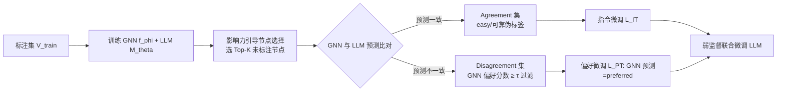

# GNN-as-Judge: Unleashing the Power of LLMs for Graph Learning with GNN Feedback

**会议**: ICLR 2026  
**OpenReview**: [https://openreview.net/forum?id=nOlhDjNXKa](https://openreview.net/forum?id=nOlhDjNXKa)  
**代码**: [https://github.com/rux001/GNN-as-Judge](https://github.com/rux001/GNN-as-Judge)  
**领域**: 图学习 / 文本属性图 / LLM-as-Predictor  
**关键词**: 文本属性图、少样本半监督、伪标签、LLM 微调、GNN 反馈、偏好对齐  

## 一句话总结
让带结构归纳偏置的 GNN 充当"裁判"，利用 LLM 与 GNN 预测的一致/不一致信号筛选可靠伪标签，再用"指令微调 + 偏好微调"的弱监督算法把伪标签知识蒸馏进 LLM，从而在标注极度稀缺的文本属性图上大幅提升节点分类性能。

## 研究背景与动机
**领域现状**：文本属性图（TAG，节点是文档、边是关系，如引文网络/社交网络/电商图）上，LLM 凭借强大的文本语义理解能力被广泛用作 LLM-as-Predictor，把图结构序列化进 prompt 或经图编码器注入后直接预测节点类别。但现有这类方法（LLaGA、GraphGPT 等）几乎都默认**有充足标注**的监督场景。

**现有痛点**：真实图往往标注极度稀疏（每类只有几个标注节点）。LLM 没有 GNN 的消息传递机制，无法利用海量未标注节点，微调时极易过拟合、泛化差。一个自然想法是用伪标签扩充训练集，但伪标签有个老大难矛盾：高置信的"easy"样本信息量低、学不到新东西；低置信的"hard"样本信息量大，却引入更多标签噪声。

**核心矛盾**：①LLM 本身难以理解复杂图结构、又有幻觉和自我偏置，单靠 LLM 自己生成并挑选伪标签不可靠，而且未标注节点价值不均、需要在算力约束下选出最值得标注的子集；②即便选出了"hard"伪标签，直接拿带噪声的伪标签做监督微调会让 LLM 性能退化，必须有专门算法在蒸馏知识的同时抑制噪声。

**本文目标**：研究"LLM-as-Predictor 在图少样本半监督学习"这一被忽视的问题，解决两个子问题——如何选出可靠伪标签、如何在带噪伪标签下安全微调 LLM。

**核心 idea**：**用 GNN 当裁判（GNN-as-Judge）**。不再像标准自训练那样仅凭 LLM 自身置信度区分 easy/hard，而是让具有结构归纳偏置的 GNN 与文本中心的 LLM 互为补充——**用两者的"一致"标定可靠的 easy 集、用两者的"不一致"挖掘信息量大的 hard 集**，再设计弱监督微调把两类节点分别用指令微调和偏好微调对待。

## 方法详解

### 整体框架
GNN-as-Judge 在标注集 $V_{train}$ 上分别训练一个结构感知 GNN $f_\phi$ 和一个文本中心 LLM $M_\theta$，然后走三步：先用图结构选出最受标注节点影响的未标注子集，再让 GNN 与 LLM 在该子集上协同打伪标签（按一致/不一致拆成两个集合），最后用一个统一的弱监督目标分别对两个集合做指令微调和偏好微调。

### 关键设计

**1. 影响力引导的节点选择：用结构代理挑出最值得标注的子集。** 在整张图上对所有未标注节点打伪标签算力上不现实，而 LLM 又感知不到"哪些未标注节点真正受标注数据影响"。本文引入**节点影响力**概念——节点 $v_i$ 对 $v_j$ 的影响定义为最终表示间的 Jacobian 范数 $I_{v_i,v_j}=\|\partial x^{(\infty)}_{v_j}/\partial x^{(\infty)}_{v_i}\|$，刻画标注节点的信息能多有效地沿图结构传播到未标注节点。直接算 Jacobian 昂贵，作者证明了一个可计算上界（Theorem 1）：影响力随最短路距离 $h^*$ 衰减，$I_{v_i,v_j}\le |P^*_{v_i,v_j}|/(D^*_{GM})^{h^*}$，其中 $|P^*|$ 是最短路条数、$D^*_{GM}$ 是最短路上节点度的几何均值。由此把每个未标注节点的影响力分数取为它对任意标注节点影响力的最大值 $IS(v_j)=\max_{v_i\in V_{train}}|P^*_{v_i,v_j}|/(D^*_{GM})^{h^*}$，再选影响力最高的 Top-K 节点 $V_{selected}$。直觉是：影响力高的节点收到的标注信号更强、伪标签更可靠，同时更能反映标注节点的分布特征，保证代表性与多样性。

**2. GNN 当裁判区分 easy/hard：一致集理论可靠、不一致集偏好过滤。** 拿到 GNN 与 LLM 在 $V_{selected}$ 上的预测后，按是否一致拆成一致集 $V_{agreed}=\{\hat y^{GNN}_i=\hat y^{LLM}_i\}$ 和不一致集 $V_{disagreed}$。对一致集，作者证明（Theorem 2）：在两模型误差条件独立、错误类均匀分布的假设下，一致集的期望准确率有下界 $\tfrac{p_{LLM}p_{GNN}}{p_{LLM}p_{GNN}+(1-p_{LLM})(1-p_{GNN})/(C-1)}$，且只要两模型都优于随机猜测，该下界就**超过两个模型各自的准确率** $\max(p_{LLM},p_{GNN})$——即一致集的伪标签质量天然更高。对不一致集，单纯用 LLM 自身已经预测对的 easy 标签学不到新东西，于是让 GNN 做裁判：由于选出的就是结构上有影响力的节点、且 GNN 能利用 LLM 看不到的局部邻域信息，此时假设 GNN 更可靠。用 GNN 的类概率分布算一个**偏好分数** $S_{pref}(v_i)=P_{GNN}(\hat y^{GNN}_i|v_i)-P_{GNN}(\hat y^{LLM}_i|v_i)$，度量 GNN 对自己预测相对 LLM 预测的偏好强度，只保留 $S_{pref}(v_i)\ge\tau$ 的节点得到过滤后的 $V'_{disagreed}$。这样就用 GNN 把"hard 但可靠"的样本挑了出来，绕开了直接让 LLM 判定 easy/hard 的难题。

**3. 弱监督微调：一致集做指令微调、不一致集做偏好微调。** 两类伪标签的噪声特性不同，用同一种损失对待并不合适，本文用统一目标 $L(\theta)=\mathbb{E}_{D_{agreed}}[L_{IT}]+\lambda\,\mathbb{E}_{D'_{disagreed}}[L_{PT}]$ 联合优化。对一致集，伪标签可信，直接做标准指令微调强化正确预测 $L_{IT}=-\log p_\theta(y_i|x_i)$。对不一致集，因为残留噪声更大，若也做指令微调风险高，于是**重构成偏好学习问题**：把 GNN 预测 $y_{w,i}$ 当作 preferred、LLM 预测 $y_{l,i}$ 当作 dispreferred，构成偏好对，让模型学习两者的相对偏好而不要求任一方绝对正确，$L_{PT}=-\log\sigma(g_\theta(x_i,y_{w,i},y_{l,i}))$。具体实现采用 ORPO，用对数几率比作为偏好函数 $g_\theta(x,y_w,y_l)=\log\tfrac{\text{odds}_\theta(y_w|x)}{\text{odds}_\theta(y_l|x)}$（$\text{odds}_\theta(y|x)=P_\theta(y|x)/(1-P_\theta(y|x))$）。最小化该损失即提高 LLM 对 GNN 预测的相对似然，在利用不一致信号的同时抑制对噪声伪标签的过拟合。作者指出这本质上是把人类反馈换成 GNN 反馈的偏好对齐框架，因此也兼容 DPO、SimPO 等其他偏好优化方法。

## 实验关键数据

### 主实验表格
四/五个引文与 OGB 数据集上的少样本半监督节点分类准确率（%），下表摘录 3-shot 与 10-shot 对比（GNN-as-Judge 以 GCN + Llama-3-8B-Instruct 为骨干）：

| Shot | 方法 | Cora | Citeseer | Pubmed | ogbn-arxiv | ogbn-products |
|------|------|------|----------|---------|------------|---------------|
| 3-shot | GCN | 69.45 | 63.12 | 65.23 | 38.33 | 59.19 |
| 3-shot | TAPE | 73.71 | 64.96 | 71.33 | 48.25 | 69.64 |
| 3-shot | LLaGA | 54.79 | 32.93 | 43.96 | 29.73 | 30.67 |
| 3-shot | GraphGPT | 57.77 | 52.34 | 57.51 | 31.26 | 40.83 |
| 3-shot | **GNN-as-Judge** | **77.89** | **73.59** | **87.12** | **62.21** | **81.02** |
| 10-shot | GCN | 78.22 | 68.38 | 75.33 | 50.95 | 69.65 |
| 10-shot | TAPE | 79.33 | 69.39 | 77.18 | 60.37 | 79.53 |
| 10-shot | **GNN-as-Judge** | **80.71** | **74.62** | **90.17** | **67.88** | **82.48** |

在所有数据集、所有 shot 设置下均为最优；越是极端低资源（3/5-shot）领先优势越大，例如 3-shot 的 ogbn-arxiv 比最强基线 TAPE 高约 14 个点。值得注意的是低资源下传统 GNN 普遍强于 LLM-as-Predictor 类方法（如 LLaGA/GraphGPT 在 3-shot 经常崩到 30~50%），印证了"图结构归纳偏置不可或缺"。

### 跨数据集零样本迁移（ogbn-arxiv 训练 → 其他测试）

| Train → Test | LLaGA | GraphGPT | GNN-as-Judge |
|--------------|-------|----------|--------------|
| → Cora | 16.24 | 6.29 | **68.27** |
| → Citeseer | 14.72 | 5.37 | **56.67** |
| → Pubmed | 30.52 | 10.54 | **83.41** |

LLaGA/GraphGPT 把结构编码成 token 反而损害了 LLM 的泛化（甚至不如未微调基座），GNN-as-Judge 则较好保留了 LLM 固有泛化能力，对分布漂移更鲁棒。

### 消融实验表格
逐组件消融（Figure 3，准确率 %），证明每个模块都有正贡献：

| 变体 | Cora | Citeseer | Pubmed | ogbn-arxiv | ogbn-products |
|------|------|----------|--------|------------|---------------|
| w/o Pseudo Labels（仅标注集监督微调） | 69.2 | 59.1 | 83.0 | 53.6 | 76.4 |
| w/o Disagreement 集 | 71.0 | 66.8 | 86.0 | 59.9 | 77.8 |
| w/o 弱监督微调（换成标准指令微调） | 77.4 | 72.5 | 85.4 | 61.7 | 80.8 |
| **GNN-as-Judge（完整）** | **77.9** | **73.6** | **87.1** | **62.2** | **81.0** |

### 关键发现
- 去掉伪标签退化最严重，说明高质量伪标签有效扩充了训练集；
- 去掉不一致集明显掉点，证明这些"hard"节点提供了额外学习信号；
- 把弱监督微调换回标准指令微调也会掉点，尤其 Pubmed（不一致集噪声更大）增益最明显，验证偏好微调对伪标签噪声的鲁棒性；
- 伪标签选择分析（Figure 2）显示影响力引导选择在 Random/Degree/AGE/LLM-GNN 等策略中给出最高的伪标签准确率。

## 亮点与洞察
- **把 GNN 重新定位为"裁判"而非"预测器"**：传统做法是 GNN 或 LLM 直接出预测，这里 GNN 退居二线、专门用一致/不一致信号给 LLM 做伪标签质检，思路清新且解耦清晰。
- **用"两模型分歧"等价替代难以直接判定的 easy/hard**：LLM 自身很难判断节点难易，作者用 GNN-LLM 是否一致这一可观测信号巧妙绕过，理论上还证明了一致集准确率超过单模型。
- **按噪声特性分而治之**：一致集用指令微调、不一致集用偏好微调（ORPO），把"带噪 hard 样本"安全地转化成相对偏好信号，是 RLHF 思想迁移到图伪标签的优雅落地——human feedback 换成 GNN feedback。
- **理论支撑扎实**：影响力上界（Theorem 1）和一致集准确率下界（Theorem 2）给两个核心设计提供了可证明的依据，而非纯启发式。

## 局限与展望
- 伪标签质量上限受制于基座 GNN 与 LLM 的能力，若两者在某类上系统性同时犯错，一致集的"可靠性"假设（误差条件独立）会失效；
- 偏好微调把 GNN 预测当作 preferred，隐含 GNN 在不一致集上更可靠的假设，但在 GNN 本身偏弱的图（异配图、结构噪声大）上这一前提可能不成立，文中未在异配图上验证；
- 引入了 Top-K、阈值 $\tau$、损失权重 $\lambda$ 等多个超参，虽做了敏感性分析，实际部署仍需调参；
- 评测集中在引文/OGB 同质图与节点分类任务，向链接预测、图分类或更复杂关系图的推广有待检验。

## 相关工作与启发
- **LLM-as-Predictor / Enhancer**：LLaGA 用模板化图转文本 + 投影器，GraphGPT 用多阶段指令微调对齐图模式，TAPE 用 LLM 生成解释作为增强特征；本文指出它们多依赖充足标注，低资源下退化明显。
- **伪标签选择**：从靠置信度选 easy 样本，到强调同时挖掘 easy/hard（Mukherjee & Awadallah 等），本文用 GNN 裁判把"难易判定"问题转成"模型分歧"问题。
- **偏好优化**：ORPO/DPO/SimPO 等原本服务于人类反馈对齐，本文把反馈源替换为 GNN，启发我们偏好学习框架可广泛用于"有一个更可靠的弱监督教师"的场景。
- **启发**：当一个模态/模型缺乏某种归纳偏置时，与其硬塞结构进 prompt，不如让具备该偏置的模型充当"评审/教师"，通过一致性与偏好信号间接注入——这种"互补模型互为裁判"的范式或可推广到多模态、跨架构蒸馏等更多任务。

## 评分
- **新颖性**: ⭐⭐⭐⭐ —— "GNN 当裁判 + 一致/不一致拆分 + 指令/偏好微调分治"组合新颖，把 RLHF 思想迁移到图伪标签且有理论支撑。
- **实验充分度**: ⭐⭐⭐⭐ —— 覆盖 5 数据集 × 3 shot 设置 + 跨数据集零样本 + 伪标签选择分析 + 逐组件消融 + 超参敏感性，较为完整；缺异配图与非节点分类任务验证。
- **写作质量**: ⭐⭐⭐⭐ —— 动机清晰、两大挑战提炼到位、定理与方法叙述顺畅，框架图直观。
- **价值**: ⭐⭐⭐⭐ —— 直击"低资源 TAG 上用好 LLM"这一现实痛点，低资源领先优势显著且代码开源，实用性强。

<!-- RELATED:START -->

## 相关论文

- [\[ICLR 2026\] On The Expressive Power of GNN Derivatives](on_the_expressive_power_of_gnn_derivatives.md)
- [\[ICLR 2026\] Glance for Context: Learning When to Leverage LLMs for Node-Aware GNN-LLM Fusion](glance_for_context_learning_when_to_leverage_llms_for_node-aware_gnn-llm_fusion.md)
- [\[ICLR 2026\] Exchangeability of GNN Representations with Applications to Graph Retrieval](exchangeability_of_gnn_representations_with_applications_to_graph_retrieval.md)
- [\[ICLR 2026\] On the Universality and Complexity of GNN for Solving Second-order Cone Programs](on_the_universality_and_complexity_of_gnn_for_solving_second-order_cone_programs.md)
- [\[ICLR 2026\] AdS-GNN - a Conformally Equivariant Graph Neural Network](ads-gnn_-_a_conformally_equivariant_graph_neural_network.md)

<!-- RELATED:END -->
