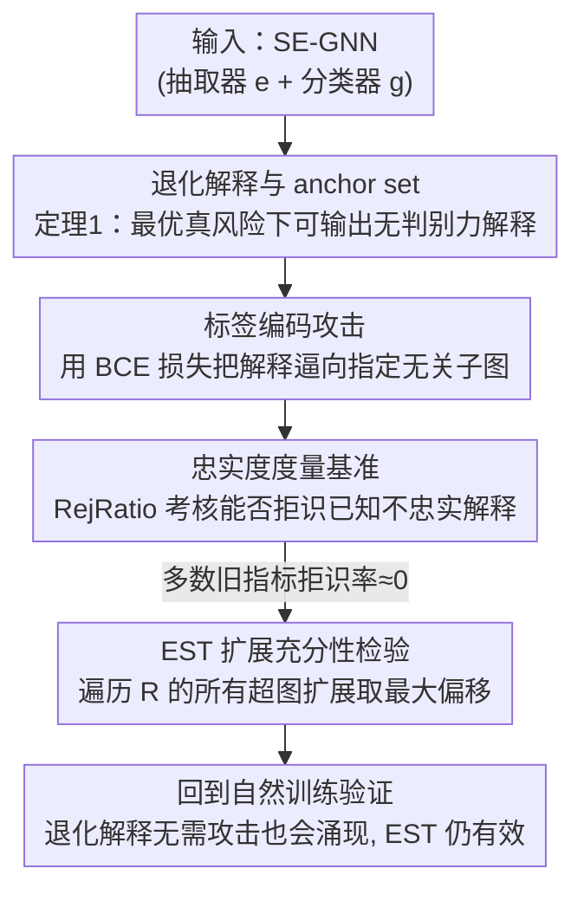

# GNN Explanations that do not Explain and How to find Them

**会议**: ICLR 2026  
**OpenReview**: [https://openreview.net/forum?id=HBcgLe6NZD](https://openreview.net/forum?id=HBcgLe6NZD)  
**代码**: 无  
**领域**: 图学习 / 可解释性  
**关键词**: 自解释 GNN, 忠实度, 退化解释, 解释审计, EST

## 一句话总结
本文揭示了自解释图神经网络（SE-GNN）的一个致命失败模式——模型可以在保持最优精度的同时输出与其真实推理过程毫无关系的"退化解释"，并证明现有大多数忠实度指标识别不出这种解释；为此作者构造了一个可控基准，并提出新指标 EST 能可靠地把这类退化解释判为不忠实。

## 研究背景与动机
**领域现状**：自解释 GNN（SE-GNN，如 GSAT、LRI、CAL、GMT-lin、SMGNN）把"解释抽取器" $e$ 和"分类器" $g$ 耦合在一起：$e$ 从输入图 $G$ 里挑出一个解释子图 $R=e(G)$，$g$ 只用这个子图做预测，即 $f(G)=g(e(G))$。因为解释是在推理过程中"内生"产生的（ante-hoc），它们被认为天然可信，适合电网分析、健康预测、药物发现这类高风险场景。

**现有痛点**：已有工作零散地指出 SE-GNN 的解释可能冗余、模糊、无法反映子部件各自的重要性、或受伪相关污染，但都是"小毛病"。没有人系统刻画过：SE-GNN 会不会**灾难性地**给出完全没有意义的解释？

**核心矛盾**：SE-GNN 的隐含假设是"解释子图 = 模型决策依据"。但 $g$ 拿到的只是 $R$，它完全可以把"预测的标签"**编码进 $R$ 的相对位置/取值里**，而 $R$ 本身对任务毫无判别力。这样一来解释能完美预测标签，却根本没透露模型真正在看什么——解释和推理彻底脱钩。

**本文目标**：(1) 形式化刻画这种"退化解释"何时能在最优损失下出现；(2) 验证攻击者能否人为植入这种解释；(3) 验证现有忠实度指标能否检测；(4) 验证它会不会自然涌现；(5) 给出能可靠识别它的新指标。

**切入角度**：从损失函数的角度审视 SE-GNN。作者发现一类叫 **anchor set（锚集）** 的"无判别力但处处出现的节点集合"，恰好能被解释抽取器用来当作"标签编码槽"，从而在最优真风险下产生退化解释。

**核心 idea**：用一个"holistically 考虑所有超图扩展"的充分性检验 EST，绕开"每个旧指标只测一种扰动、因而都能被针对性绕过"的死穴。

## 方法详解

### 整体框架
本文不是提出一个更强的 SE-GNN，而是一条"先证伪、再造工具"的论证链：先在理论上刻画 SE-GNN 何时会输出退化解释（anchor set + 定理 1），再用一个**标签编码攻击**把这种解释人为植入真实模型作为"已知不忠实"的样本，然后拿这些样本构造**忠实度指标基准**去考核现有指标（大量指标拒识率接近 0，即检测失败），最后提出新指标 **EST** 通过检验所有超图扩展来稳健地揪出退化解释，并回到自然训练场景验证退化解释会不靠攻击就涌现。

### 关键设计

**1. 退化解释与 anchor set：用最优损失反证解释可以毫无意义**

痛点是大家默认"SE-GNN 既然能拿高精度、解释又是它内部产物，那解释必然反映决策依据"。作者把"无判别力却处处出现的子结构"形式化为 **anchor set**：一组单节点子图 $Z=\{z_i\}_{i=1}^{m}$（$m=|\mathcal{Y}|$，每类一个），它们出现在**每一个**输入图里。既然每张图都有这些节点，它们对区分类别毫无贡献。定理 1 证明：对硬抽取器（输出取值在 $\{r,1\}$）而言，存在抽取器 $e(G):=z_{\phi(G)}$ 和分类器 $g(z_y):=y$，使得 GSAT、LRI、CAL、GMT-lin、SMGNN 实现的 SE-GNN **达到最优真风险**。直觉很反常：若模型真的只靠这些常量节点，它根本无法预测标签；它能拿高精度，说明它一定在看图里**别的部分**——但这些部分没出现在解释里。这就证明了"最优精度"和"完全不忠实的解释"可以共存。作者还把结论推广到互斥节点集（按类划分块）和子图级编码，并指出同一个解释甚至能在不同最优 SE-GNN 里对应相反的类（把 $u_{green}$ 和 $u_{violet}$ 互换即可），说明解释还缺乏一致性。

**2. 标签编码攻击：人为把指定的无关子图变成解释**

光有存在性定理还不够，作者要把它变成可复现的"已知不忠实样本生成器"。攻击分两步：先为每一类指定一个**与任务无关**的解释（RBGV 用绿/紫节点、MNISTsp 用背景像素、SST2P 用标点），再训练 SE-GNN 让它输出这个指定解释。实现上在常规分类损失 $\mathcal{L}_{clf}$ 之外加一个二元交叉熵损失，把指定解释里节点的相关度分数推向 1、其余推向 0：

$$\min_{g,e}\sum_{G,y}\mathcal{L}_{clf}(g,e,G,y)+\mathcal{L}_{expl}(e,G,y),\quad \mathcal{L}_{expl}:=\frac{1}{|V|}\sum_{u\in V}\mathrm{BCE}\big(e(G)_u,\,p^y_u\big)$$

关键发现是：尽管指定解释对标签弱预测，攻击后的模型**精度几乎不掉**（多数 F1≥92%），有时甚至更高（MNISTsp 上 DIR 反而 +50%）。这说明模型其实把预测标签**编码进了解释的相关度分数本身**——解释看上去高亮的是无关节点，真正用到的特征被悄悄藏起来了。这一步既证明了攻击者能隐藏对受保护属性的依赖，也为下一步基准提供了"标准答案就是不忠实"的可控样本。

**3. 忠实度度量基准与 RejRatio：把"已知不忠实"喂给现有指标，看谁检测不出来**

现有忠实度指标过去只通过"和人工真值对照"或"和逐步随机化排名相关"来验证，从没被直接测过"能不能把已知不忠实的解释判为不忠实"。作者用攻击模型产出的解释当审计样本，让每个指标当"审计员"去拒识。对充分性类指标定义拒识率：

$$\mathrm{RejRatio}_I(\mathcal{D})=\frac{1}{|\mathcal{D}|}\sum_{(G,R)\in\mathcal{D}}\max_{G'\in I}\mathbf{1}\{g(e(G))\neq g(e(G'))\}$$

其中 $I$ 是该指标允许的扰动族（边删除、补集删除、补集交换等），计算时每个样本固定 50 次扰动预算；必要性类指标把内部条件换成判等。由于这些解释是被故意训成不忠实的，理想情况下拒识率应当越高越好。结果却很糟：Suf、RFid-、CF 在 RBGV 上、Fid- 在 SST2P 上、Fid+ 在 MUTAG 上拒识率都接近 0——它们**根本检测不到**这些刻意造出来的退化解释。这暴露了一个系统性弱点：每个指标只盯着一种扰动，于是总能针对它构造出绕过检测的解释。

**4. EST 扩展充分性检验：遍历所有超图扩展，绕开"单一扰动可被针对"的死穴**

旧指标失效的根因是各自局限于某一类扰动（只删边的指标测不出靠节点决策的模型；只测补集删除的指标在 Example 1 里喂 $G'=u_{green}$ 时预测不变就放过了它）。EST 的思路是不再依赖某种具体扰动，而是**整体地**考察 $R$ 在 $G$ 内的所有超图扩展：

$$\mathrm{EST}(R,G)=\max_{R\subseteq G'\subseteq G} d\big(g(e(G)),\,g(e(G'))\big)$$

即在所有包含 $R$ 又被 $G$ 包含的子图 $G'$ 上，取预测偏移的最大值（$d(\cdot)$ 为合适的距离）。直觉是：如果 $R$ 真的充分，那么往里加任何额外内容都不该改变预测；只要存在某个扩展能改变预测，就说明 $R$ 漏掉了模型真正依赖的特征，于是 EST 给出大值（更不忠实）。作者坦言 EST 偏保守——它可能因为构造出 OOD 超图而误判忠实解释为不忠实，但在无法访问模型/数据分布时，宁可保守也要可靠地标出真正不忠实的解释，避免用户被欺骗。实践中用固定预算枚举超图以控制开销。在基准上，EST 是唯一在所有配置下都拿到最高或接近最高拒识率的指标，凡是旧指标拒识率≈0 的地方，EST 至少拒识约 50%，且拒识率随预算单调上升至约 65%。

### 一个例子：RBGV 上的退化解释
考虑二分类数据集 RBGV：图由随机连接的红、蓝节点组成，蓝多于红记为正类，任务**只依赖红蓝节点的数量比较**。但每张图额外塞了两个孤立节点——一个绿（$u_{green}$）、一个紫（$u_{violet}$），它们构成 anchor set，对任务完全无关。然而下面这套 SE-GNN 能拿满分精度却只用绿/紫节点当解释：

$$R=e(G)=\begin{cases}u_{green}&\#red\geq\#blue\\ u_{violet}&\#blue>\#red\end{cases}\qquad g(R)=\begin{cases}0&R=u_{green}\\ 1&R=u_{violet}\\ 0.5&\text{otherwise}\end{cases}$$

抽取器其实在内部数了红蓝节点（这才是真正的决策依据），却把结果"翻译"成"高亮绿还是高亮紫"，让用户误以为绿/紫节点重要。任何只删边的指标都查不出 $u_{green}$/$u_{violet}$ 的问题；只测补集删除的指标喂 $G'=u_{green}$ 时预测不变也放过它。而 EST 只要找到一个能翻转预测的超图扩展，就能把它判为不忠实。

## 实验关键数据

### 主实验（攻击成功率 + 各指标拒识率）
攻击在三种代表架构（GSAT、DIR、SMGNN）、四个数据集上几乎都成功：解释与指定解释的 F1 普遍≥92%，且精度与未攻击基线相当甚至更高。

| 数据集 | 模型 | 自然精度 | 攻击后精度 | 解释 F1 |
|--------|------|----------|------------|---------|
| RBGV | GSAT | 100.0 | 99.1 | 99.7 |
| MNISTsp | DIR | 41.8 | 94.7 | 96.3 |
| MUTAG | SMGNN | 79.2 | 78.2 | 94.9 |
| SST2P | SMGNN | 83.1 | 82.8 | 59.2（OOD 拖累，验证集 96.5） |

忠实度指标基准上，旧指标在多处拒识率接近 0，EST 始终最高或接近最高（拒识率 %）：

| 数据集 | 模型 | Fid- | Suf | CF | RFid- | EST (ours) |
|--------|------|------|-----|----|-------|-----------|
| RBGV | SMGNN | 12 | 00 | 05 | 00 | **48** |
| MNISTsp | DIR | 93 | 99 | 91 | 99 | **100** |
| MUTAG | SMGNN | 59 | 99 | 55 | 72 | **96** |
| SST2P | GSAT | 51 | 07 | 37 | 14 | **62** |

### 自然涌现实验（RQ3，无攻击）
按各模型原始协议训练、调稀疏性超参后，退化解释**不靠攻击也会自然出现**，EST 仍能有效识别。

| 数据集 | 模型 | 测试精度 | EST 拒识率 | Fid- | RFid- |
|--------|------|----------|-----------|------|-------|
| RBGV | SMGNN | 98.9 | 86.8 | 54.1 | 77.6 |
| MNISTsp | SMGNN | 86.8 | 99.5 | 68.9 | 95.5 |
| MUTAG | SMGNN | 77.9 | 75.2 | 61.9 | 50.3 |
| SST2P | GSAT | 84.0 | 0.0 | 0.0 | 0.0 |

### 关键发现
- **标签可以被编码进解释而不损害精度**：攻击后模型精度几乎不掉，部分场景（MNISTsp 上 DIR/SMGNN）反而提升，说明"把标签编码进解释"在训练时甚至能帮模型提升自身精度。
- **现有忠实度指标存在系统盲区**：每个指标只针对一类扰动，因此都能被针对性绕过；Fid-/RFid- 在 RBGV 上虽偶尔拒识率高，但 seed 间方差极大，可靠性差。
- **EST 一致更稳**：在旧指标全军覆没的配置下 EST 仍拒识约 50%，且拒识率随预算单调上升；它也能正确接受真正充分的非退化解释（而 Suf、CF 会误拒）。
- **DIR 是反例补充**：DIR 不在定理 1 覆盖范围内，但只要把保留比例 $K$ 调得很小，它照样能把标签信息塞进无判别力的小子图里——说明退化解释不限于单节点 anchor set。
- **退化解释并非必然**：GSAT 在 MNISTsp 上 EST 拒识率仅 ≈2%、AUCROC 高，说明随机优化也可能引导模型给出真正充分的解释，但这超出实践者控制范围。

## 亮点与洞察
- **用"最优损失反证"打穿可解释性的隐含假设**：定理 1 把"高精度⇒解释可信"这条人人默认的链条直接证伪——高精度恰恰意味着模型用了解释之外的信息，巧妙且反直觉。
- **把攻击当作"已知不忠实样本生成器"**：通常攻击是为了证明系统脆弱，这里作者反过来把攻击产物当作可控基准的"标准答案"，让忠实度指标第一次有了客观可考核的靶子。
- **EST 的"枚举超图"思路可迁移**：与其为每种扰动设计指标，不如检验"加任何东西都不该改预测"这一充分性本质——这个"holistic 扩展检验"的思想可推广到其它模态（文本 rationalization、概念瓶颈模型）的忠实度评估。
- **保守优于漏检的工程取舍**：EST 明确选择"宁可误报忠实解释，也要可靠揪出不忠实解释"，因为审计场景里漏检比误报危害大得多。

## 局限与展望
- 定理 1 为了凸显反直觉，限定在"解释只由 anchor set 节点构成"这一受限但有代表性的设定，更一般的解释形态留待形式化。
- EST 偏保守，可能因构造 OOD 超图而把真正忠实的解释误判为不忠实；在无法访问模型/数据分布时无法区分"预测变了是因为 OOD"还是"因为扰动了真正依赖的特征"。
- EST 只估计充分性，不覆盖必要性；且需要枚举超图，实践中靠固定预算近似，预算与精度间存在权衡。
- 退化解释何时自然涌现仍不可控（随机优化既可能给退化解释也可能给充分解释），如何设计**本质上更鲁棒**的 SE-GNN 仍是开放问题。

## 相关工作与启发
- **vs 解释可被操纵的后验方法（Dombrowski/Heo/Slack 等）**：以往操纵研究多集中在表格/图像的 post-hoc 解释，本文聚焦内生（ante-hoc）的 SE-GNN，并给出可达最优损失的形式化条件。
- **vs Tai et al. 2025**：他们指出 SE-GNN **不**正则化稀疏性时会输出冗余、潜在不忠实的解释；本文互补地证明**强稀疏正则化**时解释同样会不忠实——两端都危险。
- **vs 既有忠实度指标（Fid±、RFid±、Suf、Nec、CF 等）**：这些指标各自只测一种扰动，本文统一证明它们都能被针对性退化解释绕过，并用 EST 的全超图扩展检验补上盲区。

## 评分
- 新颖性: ⭐⭐⭐⭐⭐ 用最优损失反证"解释可与推理完全脱钩"，并据此重构忠实度评测范式，视角独到。
- 实验充分度: ⭐⭐⭐⭐ 覆盖 3 架构 × 4 数据集、攻击与自然两种场景、7+ 指标横向对比，扎实；但均为中小规模基准。
- 写作质量: ⭐⭐⭐⭐⭐ RQ 驱动、Example 1 把抽象定理讲得极具画面感。
- 价值: ⭐⭐⭐⭐⭐ 直接警示高风险场景别盲信 SE-GNN 解释，并交付可复现基准与可用审计工具 EST。

<!-- RELATED:START -->

## 相关论文

- [\[ICLR 2026\] On The Expressive Power of GNN Derivatives](on_the_expressive_power_of_gnn_derivatives.md)
- [\[ICLR 2026\] GNN-as-Judge: Unleashing the Power of LLMs for Graph Learning with GNN Feedback](gnn-as-judge_unleashing_the_power_of_llms_for_graph_learning_with_gnn_feedback.md)
- [\[ICLR 2026\] Exchangeability of GNN Representations with Applications to Graph Retrieval](exchangeability_of_gnn_representations_with_applications_to_graph_retrieval.md)
- [\[ICLR 2026\] On the Universality and Complexity of GNN for Solving Second-order Cone Programs](on_the_universality_and_complexity_of_gnn_for_solving_second-order_cone_programs.md)
- [\[NeurIPS 2025\] GnnXemplar: Exemplars to Explanations -- Natural Language Rules for Global GNN Interpretability](../../NeurIPS2025/graph_learning/gnnxemplar_exemplars_to_explanations_--_natural_language_rules_for_global_gnn_in.md)

<!-- RELATED:END -->
