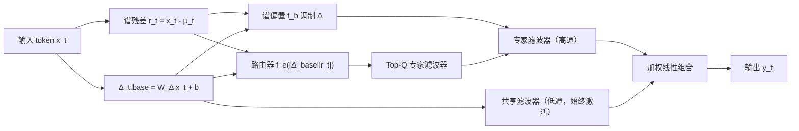

# Graph Signal Processing Meets Mamba2: Adaptive Filter Bank via Delta Modulation

**会议**: ICLR 2026  
**OpenReview**: [https://openreview.net/forum?id=w0XhHcXfKv](https://openreview.net/forum?id=w0XhHcXfKv)  
**代码**: 待确认  
**领域**: 图信号处理 / 状态空间模型 / 高效序列建模  
**关键词**: Mamba2, Graph Signal Processing, 滤波器组, Delta 调制, 专家路由, 可解释性  

## 一句话总结
把 Mamba2 的多头递归重新解释成线图上的图滤波器组，用基于谱残差的 delta 调制把它分成"共享低通滤波器 + 专家高通滤波器"的层次结构 HADES，只用 58.9% 的参数就达到甚至超过 Mamba2 的性能。

## 研究背景与动机
**领域现状**：状态空间模型（SSM）以线性时间递归提供了 attention 的高效替代，Mamba2 通过选择性输入门控和多头结构实现并行计算并取得强基准表现。

**现有痛点**：Mamba2 的多头递归各自独立运行，既没有结构化约束，也缺乏分析。作者用有效秩（effective rank）分析谱响应（图 1）发现，Mamba2 的多头实际上塌缩到低秩谱子空间——大部分头工作在高度重叠的频段，并没有像理想的滤波器组那样形成互补的、各司其职的滤波器，造成大量冗余。

**核心矛盾**：多头结构在理论上能提供丰富的频谱多样性，但缺少显式协调机制时，这些头会退化成功能雷同的"通用平滑核"，既浪费参数又难以同时兼顾全局长程信息和局部高频细节。

**本文目标**：在不牺牲效率的前提下，给 Mamba2 注入结构化的、自适应的滤波分工，让不同的头真正覆盖不同频段。

**核心 idea**：**[GSP 重解释]** 把一维 token 序列看作线图上的信号（token 为节点、时序连接为边），Mamba2 每个头就是作用在该信号上的图滤波器，多头即一个图滤波器组；**[层次化滤波]** 在此基础上设计共享滤波器（全局低通）+ 专家滤波器（局部高通）的层次结构，通过对离散步长参数 $\Delta$ 施加结构化偏置实现频段分工。

## 方法详解

### 整体框架
HADES（Hierarchical ADaptive filter bank for Efficient SSMs）把 Mamba2 的 $M$ 个滤波器（头）拆成两类：始终生效的 $S$ 个**共享滤波器**负责全局平滑的低频成分，以及由路由器按 token 动态挑选 Top-$Q$ 的**专家滤波器**负责局部高频细节。每个时间步实际激活 $H=S+E$ 个滤波器，路由分数由谱残差 $r_t$ 与基础步长 $\Delta_{t,\text{base}}$ 共同决定，最终输出是被选滤波器输出的加权线性组合，再辅以两个正则损失保证滤波器分工不退化。

### 关键设计

**1. GSP 视角下的滤波器组重解释：给多头递归一个频谱语义。** 在线图上，S4 是线性时不变（LTI）系统，其卷积核 $h_k=CA^kB$ 就是图滤波器系数，序列建模写成图卷积 $y=\sum_k h_k S^k x$；而 Mamba 因输入相关参数变成线性时变（LTV）系统，每个节点用不同滤波器，系数变为 $h_k^{(t)}=C_tA_{t:t-k}B_{t-k}$（其中 $A_{t:t-k}=\prod A_i$ 是累积乘积）。多头 Mamba2 自然对应 $M$ 个并行滤波器的滤波器组 $y_t=\Phi(\{\sum_k h_k^{(i,t)}S^k x\}_{i=1}^M)$。这一重解释把"为什么多头会冗余"翻译成"滤波器没被引导到不同频段"，从而把改进目标明确为引导频谱分工。

**2. 专家滤波器 + 谱残差路由：让 token 按频率特性选滤波器。** 对每个 token 计算谱残差 $r_t=x_t-\mu_t$（$\mu_t$ 是到当前位置的运行均值），它度量该 token 相对全局趋势的"局部偏离"，即高频成分。把基础步长与残差拼接后做线性投影得到专家选择分数 $s_t=f_e([\Delta_{t,\text{base}}\Vert r_t])\in\mathbb{R}^E$，取分数最高的 Top-$Q$ 个专家激活。专家不被硬性绑定到固定频段，而是通过各自不同的 $\Delta$ 配置诱导出不同的更新动态，隐式地按 token 频率特性塑造响应。

**3. 谱偏置调制 Δ：用残差直接改写离散步长。** 残差 $r_t$ 不只用于选专家，还反过来调制 $\Delta$ 本身——注入一个对频率敏感的偏置：$\Delta_{t,\text{HADES}}=\text{Softplus}(\Delta_{t,\text{base}}+\gamma\cdot f_b([\Delta_{t,\text{base}}\Vert r_t]))$，其中 $f_b$ 是单层线性投影，$\gamma$ 控制调制强度。由于 $\Delta$ 决定离散化步长进而决定 $A_t,B_t$，加大步长偏向捕捉局部高频，偶尔取负偏置则缩小步长以更好地纳入全局上下文，从而让每个 token 自适应地在局部与全局信息间平衡。共享滤波器则刻意不加这种偏置、只用 $\Delta_{t,\text{base}}$，靠内容无关的均匀操作保留低频、抑制高频，扮演类似 GCN 固定低通核的稳定基底角色。

**4. 双正则损失保证滤波器分工：负载均衡 + 多样性。** 为防止路由塌缩到少数专家，负载均衡损失用选择分数的平方变异系数惩罚偏好方差 $\mathcal{L}_{\text{balance}}=\text{Var}(s_t)/(\mathbb{E}[s_t]^2+\epsilon)$，鼓励各专家被均匀使用；多样性损失则对 $\ell_2$ 归一化后的滤波器输出施加去相关约束 $\mathcal{L}_{\text{diversity}}=\mathbb{E}_{i,j}[(\langle\hat y_i,\hat y_j\rangle-\delta_{ij})^2]$，逼近正交以促进功能特化。总损失 $\mathcal{L}=\mathcal{L}_{\text{task}}+\lambda_1\mathcal{L}_{\text{balance}}+\lambda_2\mathcal{L}_{\text{diversity}}$。

## 实验关键数据

### 主实验（语言建模 + 8 项零样本常识推理，370M 参数级别）

| 模型 | Wiki ppl↓ | LMB ppl↓ | 8 任务 Avg↑ |
|------|-----------|----------|-------------|
| Linear Transformer | 45.43 | 73.93 | 39.63 |
| RetNet | 34.12 | 29.46 | 41.54 |
| DeltaNet | 33.25 | 26.82 | 41.33 |
| Mamba1 | 47.51 | 85.53 | 39.47 |
| Mamba2 | 31.34 | 24.38 | 41.63 |
| **HADES (Ours)** | 31.48 | **21.74** | **42.91** |

HADES 仅用 218M 参数（Mamba2 370M 的 58.92%）就在 LMB 困惑度与 8 任务平均准确率上超过所有基线；训练用约 200B tokens 的 Pile 数据，超参 $H=16,S=8,\lambda_1=\lambda_2=10^{-3},\gamma=0.25$。

### 消融实验（Table 2）

| 变体 | Wiki ppl↓ | LMB ppl↓ | 8 任务 Avg↑ |
|------|-----------|----------|-------------|
| **HADES（完整）** | 31.51 | 21.74 | **42.91** |
| w/o L_balance | 34.73 | 26.84 | 41.57 |
| w/o L_diversity | 33.83 | 27.40 | 42.15 |
| 仅共享滤波器 | 34.55 | 27.64 | 42.21 |
| 仅专家滤波器 | 36.34 | 30.12 | 41.68 |
| Fixed 选择 | 34.55 | 27.64 | 42.21 |
| Random 选择 | 35.78 | 32.77 | 41.03 |
| Pos. Bias | 30.23 | 21.93 | 42.15 |
| No Bias | 34.57 | 28.79 | 41.11 |

### 关键发现
- **两个损失缺一不可**：去掉 $\mathcal{L}_{\text{balance}}$ 后选择过度集中、稀少专家欠训练，性能明显下降。
- **共享优于纯专家**：仅共享滤波器（42.21）好于仅专家（41.68），印证全局低频信息是稳定基底。
- **谱残差路由 > 随机/固定**：基于谱特性的选择最优，No Bias 最差，说明 delta 调制是关键。
- **长上下文检索**：在 passkey retrieval 任务上 HADES 显著优于 Mamba2，验证自适应滤波对保留远程依赖有效。
- **谱可视化**：Mamba2 输出几乎只保留低频；HADES 共享滤波器强调低频、专家滤波器（rippled kernel）覆盖高频，有效秩明显高于 Mamba2，冗余更低。

## 亮点与洞察
- **理论桥梁清晰**：把"为什么 Mamba2 多头会冗余"翻译成"滤波器没分频段"，再把 GCN 里"低通=平滑"的直觉迁移到 SSM，给出可解释、可设计的频谱语言。
- **更少参数更强性能**：用 58.9% 参数超过 Mamba2，证明结构化分工比单纯堆头更高效。
- **可解释性强**：滤波器选择分析显示不同专家在 Passkey/Query 与 Dummy Text 区域呈现明确分工，能"看见"模型在干什么。
- **改动轻量**：谱残差、Top-Q 路由、$\Delta$ 偏置都用单层线性投影实现，工程落地代价小。

## 局限与展望
- 滤波器组只是**概念工具**，模型并不显式计算图谱，谱解释更多是事后分析而非硬约束。
- 专家未被显式绑定到固定频段，频段分工是隐式涌现的，可控性和可保证性有限。
- 实验集中在 370M 规模与 Pile 数据，更大模型/更多模态下的可扩展性仍待验证。
- Top-Q 路由引入的额外推理开销与稀疏专家的硬件友好性未深入讨论。

## 相关工作与启发
- **delta 调制改进 Mamba 长上下文**（Ben-Kish 2025、Azizi 2025、Ye 2025）：HADES 把 delta 调制从单纯改善长程，升级为频段分工的控制旋钮。
- **SSM 架构批判与极化**（Wang 2025）：指出 recency bias 与信息瓶颈，HADES 用结构化滤波器组在真实任务上回应了这些质疑。
- **GSP / 图滤波器组**（图卷积低通视角、Wu 2022 的结构保持平均）：为共享滤波器的低通角色提供了理论参照。
- **启发**：把"多头/多专家是否真正分工"这一问题用谱/有效秩量化，是诊断各类高效序列模型冗余的通用思路。

## 评分
- **新颖性**: ⭐⭐⭐⭐ — GSP 滤波器组视角重解释 Mamba2 并落地为共享/专家层次结构，角度新颖且自洽。
- **实验充分度**: ⭐⭐⭐⭐ — 涵盖语言建模、8 项常识推理、长上下文检索 + 丰富消融与谱分析，论证扎实；规模偏中等。
- **写作质量**: ⭐⭐⭐⭐ — 理论铺垫到方法到分析层层递进，图示与谱可视化清晰。
- **价值**: ⭐⭐⭐⭐ — 用更少参数超越 Mamba2 且更可解释，对高效 SSM 设计有实际借鉴意义。

<!-- RELATED:START -->

## 相关论文

- [\[ICLR 2026\] Adaptive Mixture of Disentangled Experts for Dynamic Graph Out-of-Distribution Generalization](adaptive_mixture_of_disentangled_experts_for_dynamic_graph_out-of-distribution_g.md)
- [\[ICLR 2026\] AdaSpec: Adaptive Spectrum for Enhanced Node Distinguishability](adaspec_adaptive_spectrum_for_enhanced_node_distinguishability.md)
- [\[ICML 2025\] Positional Encoding meets Persistent Homology on Graphs](../../ICML2025/graph_learning/positional_encoding_meets_persistent_homology_on_graphs.md)
- [\[AAAI 2026\] Self-Adaptive Graph Mixture of Models](../../AAAI2026/graph_learning/self-adaptive_graph_mixture_of_models.md)
- [\[AAAI 2026\] Adaptive Riemannian Graph Neural Networks](../../AAAI2026/graph_learning/adaptive_riemannian_graph_neural_networks.md)

<!-- RELATED:END -->
