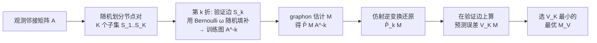

# Graphon Cross-Validation: Assessing Models on Network Data

**会议**: ICLR 2026  
**OpenReview**: [https://openreview.net/forum?id=8J3GTeQmwl](https://openreview.net/forum?id=8J3GTeQmwl)  
**代码**: 待确认  
**领域**: 图学习 / 网络统计推断  
**关键词**: graphon, 交叉验证, 模型选择, 网络数据, 链接预测, 超参数调优  

## 一句话总结
针对网络数据"边不独立"导致传统交叉验证失效的难题，本文提出 **CV-imputation**：把验证集的边当作缺失值用固定概率的 Bernoulli 随机填补来构造训练图，再用仿射变换还原概率矩阵，从而在保持图拓扑不被破坏的前提下，为 graphon 估计方法做超参数调优和模型选择，且理论上验证分数与真实估计误差渐近平行。

## 研究背景与动机
**领域现状**：graphon 模型是刻画复杂网络结构的主流非参数工具，它假设节点 $i,j$ 间存在边的概率由一个定义在单位正方形上的对称可测函数 $f(\mu_i,\mu_j)$ 给出，涵盖随机块模型、分段常数/线性 graphon、光滑 graphon 等多种子类。主流估计方法（邻域光滑 NS、排序光滑 SAS、奇异值阈值 USVT、迭代估计 ICE）都依赖一个控制"拟合优度 vs 模型复杂度"权衡的调参 $M$——比如 NS 的邻域大小、SAS 的块数。

**现有痛点**：调参直接决定估计精度（如图 1 所示，邻域大小取不同值会得到截然不同的 graphon 估计），但网络数据上的调参没有可靠工具。交叉验证本是调参的黄金标准，可它假设观测独立——这恰恰被网络节点的互联本质所违背。直接按节点随机划分行不通；直接随机删边做边采样又会改变网络拓扑和邻域结构，给 graphon 估计引入显著偏差，还会让训练/测试集分布不一致，污染标准差估计和置信区间。

**核心矛盾**：既要划分出训练/验证集来评估泛化，又不能破坏网络的连通性与邻域结构——两者天然冲突。已有的边交叉验证 ECV（Li et al. 2020a）用矩阵补全来填补保留的节点对，但它要求概率矩阵 $P$ 低秩（稠密网络下不成立），且只对 SBM、RDPG 等特定模型有理论保证，对一般 graphon 缺失保证，更致命的是每折都要迭代做矩阵补全（满 SVD 约 $O(n^3)$），计算代价高得无法实用。

**本文目标**：提出一个理论扎实、计算高效、且对估计方法无偏（model-agnostic）的网络交叉验证框架，用于 graphon 估计的超参数调优与方法选择。

**核心 idea**：**[扰动式采样 + 仿射还原]** 不去删边，而是把验证集的边视为缺失值，用一个固定均值 $\omega$ 的 Bernoulli 分布去随机填补；由于边独立，填补后的训练图与原图概率矩阵之间是一个已知的仿射变换关系，可以解析地反推回真实概率矩阵的预测，从而既保住拓扑结构又保证训练/验证的独立性。

## 方法详解

### 整体框架
方法在 $K$ 折交叉验证骨架上运行：把所有节点对随机划成 $K$ 个子集，每折取一个子集 $S_k$ 当验证集；构造训练图时，把 $S_k$ 内的边用固定概率 $\omega$ 的随机 Bernoulli 值"填补"（而非删除），保持邻接矩阵 $n\times n$ 的完整尺寸；用任意 graphon 估计方法 $M$ 在训练图上估出概率矩阵，再通过解析的仿射逆变换还原对真实 $P$ 的预测，最后在验证边上算预测误差，选误差最小的 $M$。

### 关键设计

**1. 随机填补构造训练图：用"填"代替"删"保住拓扑** 传统边采样直接把验证集的边删掉，破坏了网络的连通性和邻域结构，而邻域光滑类方法恰恰依赖邻域结构。本文换一种思路：训练邻接矩阵 $A^{[-k]}$ 的尺寸与原图一致，验证集外的元素保留原值 $a_{ij}$，验证集 $S_k$ 内的元素则替换成独立同分布的 $b_{ij}\sim\text{Ber}(\omega)$，其中 $\omega$ 是全程固定的常数调参。这样网络规模和整体连通性不被改变，邻域光滑得以正常工作，同时随机填补又"抹掉"了验证边的真实信息，避免信息泄漏。

**2. 仿射变换与解析还原：把填补带来的分布偏移精确扣除** 填补虽然保护了结构，但代价是训练图的分布被人为扭曲了。Lemma 1 给出了关键的解析关系：给定 $P$，训练图元素 $A^{[-k]}_{ij}$ 服从均值为 $w_k\omega+(1-w_k)p_{ij}$ 的 Bernoulli 分布（$w_k$ 是 $S_k$ 占全部节点对的比例），即训练图的概率矩阵 $P^{[-k]}=w_k\omega\mathbf{1}\mathbf{1}^T+(1-w_k)P$ 是真实 $P$ 的一个仿射变换。更重要的是，它保证了 $A^{[-k]}$ 与验证集 $A^{[k]}$ 在给定 $P$ 时条件独立——这正是交叉验证成立所需的独立性。基于此，可把估计结果反解回对 $P$ 的预测：
$$\hat{P}_k(M)=\frac{\hat{P}(M|A^{[-k]})-w_k\omega\mathbf{1}\mathbf{1}^T}{1-w_k}.$$
于是验证边上的预测概率 $\hat{p}^{[k]}_{ij}(M)$ 就有了无偏的解析表达，越界的预测值截断到 $[0,1]$。

**3. CV-imputation 评分与模型选择：在验证边上度量泛化** 把每折验证边的预测概率与真实观测值的平方差汇总，得到交叉验证评分
$$V_K(M)=\frac{2}{n(n-1)}\sum_{k=1}^{K}\sum_{(v_i,v_j)\in S_k}\big(\hat{p}^{[k]}_{ij}(M)-a_{ij}\big)^2,$$
选择使 $V_K(M)$ 最小的模型 $M_V$。该评分既能用于单个估计方法内部的超参数调优（如 NS 的邻域大小），也能跨方法选择（在 NS/SAS/USVT/ICE 中挑最优），因为它不对底层模型形式做任何假设，是真正的 model-agnostic 度量。

**4. 渐近一致性保证：验证分数与真实误差平行** 理论上证明（Theorem 1），当 $n\to\infty$、$K\to\infty$ 时，$V_K(M)-L(M)-\Delta=O_p\big(\tfrac{1}{n}\vee\tfrac{1}{K^{(1+\alpha)/2}}\vee\tfrac{1}{K^\alpha}\big)$ 一致成立，其中 $L(M)$ 是真实均方估计误差，$\Delta=\frac{2}{n(n-1)}\sum_{i<j}p_{ij}(1-p_{ij})$ 是一个与 $M$ 无关的常数。由于 $\Delta$ 不依赖 $M$，验证分数函数 $V_K(\cdot)$ 与损失函数 $L(\cdot)$ **渐近平行**，因此 $V_K$ 的最小化点高概率逼近 $L$ 的最小化点，即选出的模型渐近收敛到最优模型。关键的 Condition 1（最大 K 折乐观偏差以多项式速率 $K^{-\alpha}$ 有界）可由数据直接计算验证，而非空泛假设。

**计算复杂度**：CV-imputation 总复杂度 $O(|M|\cdot(K\cdot C_{\text{estim}}(n)+n^2))$，相比 ECV 的 $O(|M|\cdot(K\cdot C_{\text{estim}}(n)+K\cdot T_{\text{mc}}(n)))$，每折只多了 $O(n^2)$ 的填补与变换开销，而 ECV 每折多出 $O(n^3)$ 的矩阵补全，故本文方法显著更快。对超大网络还可先做结构代表性子图采样再调参。

## 实验关键数据

### 主实验：合成 graphon 上的估计精度（MSE×100，n=200，100 次重复）
在 Chan & Airoldi 的 4 个 graphon（1/2 稠密，3/4 稀疏；1/3/4 低秩，2 满秩）上，用 CV-imputation 与 ECV、默认设置分别为 NS/USVT/SAS/ICE 选调参：

| 方法 | Graphon 1 | Graphon 2 | Graphon 3 | Graphon 4 |
|------|-----------|-----------|-----------|-----------|
| CV-imputation (NS) | **0.51 ± 0.07** | **2.13 ± 0.15** | 0.79 ± 0.07 | **1.05 ± 0.06** |
| ECV (NS) | 9.15 ± 19.25 | 3.82 ± 0.21 | 3.07 ± 0.95 | 1.06 ± 0.10 |
| Default NS (M=1) | 39.05 ± 3.33 | 2.75 ± 0.16 | **0.74 ± 0.04** | 1.06 ± 0.10 |
| CV-imputation (USVT) | **0.28 ± 0.03** | **2.99 ± 0.19** | **0.61 ± 0.10** | **0.75 ± 0.05** |
| ECV (USVT) | 0.60 ± 0.09 | 5.06 ± 0.27 | 1.18 ± 0.02 | 1.08 ± 0.74 |
| CV-imputation (ICE) | **0.31 ± 0.03** | **2.69 ± 0.24** | **0.50 ± 0.06** | 0.82 ± 0.06 |
| ECV (ICE) | 0.32 ± 0.05 | 3.05 ± 0.55 | 0.53 ± 0.06 | 0.86 ± 0.06 |

几乎所有方法×graphon 组合下，CV-imputation 选出的模型 MSE 都最低；ECV 在 NS-Graphon1 上甚至出现 9.15 的高方差崩坏。

### 消融 / 收敛与方法选择
- **rank 一致性**：标准化的 $V_K$ 与 $L$ 曲线对比显示，n=50 时所选模型已在 Graphon 1/2 上对齐最优模型，n=200 时所有 graphon 全部对齐——验证分数随网络增大快速收敛到最优。
- **方法选择准确率**：在 NS/SAS/USVT/ICE 中挑 MSE 最低者，n=200 时 CV-imputation 达到 **100%** 准确率，且小网络下相对 ECV 优势更明显。

### 真实网络链接预测（AUC / 时间，100 次重复）

| 网络 | 指标 | CV-imputation | ECV |
|------|------|---------------|-----|
| PolBlog | AUC | **0.88 ± 0.01** | 0.80 ± 0.02 |
| NetSci | AUC | **0.72 ± 0.01** | 0.70 ± 0.01 |
| Yeast | AUC | 0.80 ± 0.02 | 0.80 ± 0.02 |
| PolBlog | 时间(s) | **56.90** | 258.65 |
| NetSci | 时间(s) | **51.01** | 771.23 |
| Yeast | 时间(s) | **240.90** | 6021.12 |

### 关键发现
- 在 Yeast 网络上 CV-imputation 把耗时从 ECV 的 6021 秒压到 241 秒（约 **25 倍**加速），AUC 持平甚至更高。
- COVID-19 药病共现网络案例中，方法在所有未连边节点对中给出第三高预测概率的是 COVID-19 与 ledipasvir 的连接，提示药物重定位潜力，后被 phase-3 临床试验佐证。

## 亮点与洞察
- **"填补代替删除"是核心巧思**：用随机填补保住网络尺寸和邻域结构，再用边独立性导出的仿射变换把人为偏移精确扣除，绕开了"删边破坏拓扑"和"矩阵补全昂贵"两个老问题。
- **理论与计算双赢**：既给出验证分数与真实误差渐近平行的一致性证明，又因为省掉了 SVD/矩阵补全把复杂度从 $O(n^3)$ 级降到 $O(n^2)$ 级附加开销，且关键假设 Condition 1 可由数据直接核验。
- **model-agnostic**：对任意 graphon 估计方法即插即用，既能调超参也能跨方法选模型，是网络数据上的"通用模型评估器"。

## 局限与展望
- 方法的根基是**边独立性假设**，因此无法直接扩展到具有时序/序列依赖的动态网络。
- 仿射还原依赖填补概率 $\omega$ 这一固定调参，其选择（附录 S.4 讨论）对实际表现有影响，论文未在正文充分展开敏感性分析。
- 对超大网络仍需借助子图采样近似，子采样如何影响调参一致性缺乏正式保证。
- 作者指出可向潜空间网络、广义稀疏 graphon 等保持边独立结构的模型扩展，但形式化理论保证留作未来工作。

## 相关工作与启发
- **graphon 估计**：NS（Zhang et al. 2017）、SAS（Chan & Airoldi 2014）、USVT（Chatterjee 2015）、ICE（Qin et al. 2021）是本文调参/选模型的对象；本文不替代它们，而是给它们提供统一的评估与选择工具。
- **网络交叉验证**：最直接对手是 ECV（Li et al. 2020a），其用矩阵补全填补保留节点对，需低秩假设且代价高；本文用随机填补 + 仿射还原避开这两点。
- **启发**：把"验证集当缺失值随机填补、再用模型已知的分布变换解析还原"这一思路，可能迁移到其他存在已知噪声/扭曲机制的结构化数据评估场景，是处理"划分会破坏结构"这类问题的一个范式。

## 评分
- **新颖性**: ⭐⭐⭐⭐ —— "随机填补代替删边 + 仿射变换解析还原"在网络交叉验证中是一个干净且有理论支撑的新角度，巧妙化解了边采样破坏拓扑的核心矛盾。
- **实验充分度**: ⭐⭐⭐⭐ —— 覆盖 4 个合成 graphon、4 种估计方法、4 个真实网络，含精度/收敛/方法选择/计算时间多维度对比，加速比与 AUC 提升均显著；但 $\omega$ 的敏感性分析和对超大网络子采样的影响验证略欠。
- **写作质量**: ⭐⭐⭐⭐ —— 动机层层递进，Lemma/Theorem 与方法衔接清晰，图表（图 1 调参敏感性、图 5 方法选择）支撑有力。
- **价值**: ⭐⭐⭐⭐ —— 为网络数据上长期缺乏可靠工具的调参/选模型问题提供了即插即用、理论扎实且数量级提速的方案，在大网络链接预测与药物重定位等场景有现实意义。

<!-- RELATED:START -->

## 相关论文

- [\[AAAI 2026\] On Stealing Graph Neural Network Models](../../AAAI2026/graph_learning/on_stealing_graph_neural_network_models.md)
- [\[ICLR 2026\] Latent Geometry-Driven Network Automata for Complex Network Dismantling](latent_geometry-driven_network_automata_for_complex_network_dismantling.md)
- [\[ICML 2026\] When Do Graph Foundation Models Transfer? A Data-Centric Theory](../../ICML2026/graph_learning/when_do_graph_foundation_models_transfer_a_data-centric_theory.md)
- [\[ICLR 2026\] A Graph Meta-Network for Learning on Kolmogorov–Arnold Networks](a_graph_meta-network_for_learning_on_kolmogorovarnold_networks.md)
- [\[ICLR 2026\] Federated Graph-Level Clustering Network with Dual Knowledge Separation](federated_graph-level_clustering_network_with_dual_knowledge_separation.md)

<!-- RELATED:END -->
