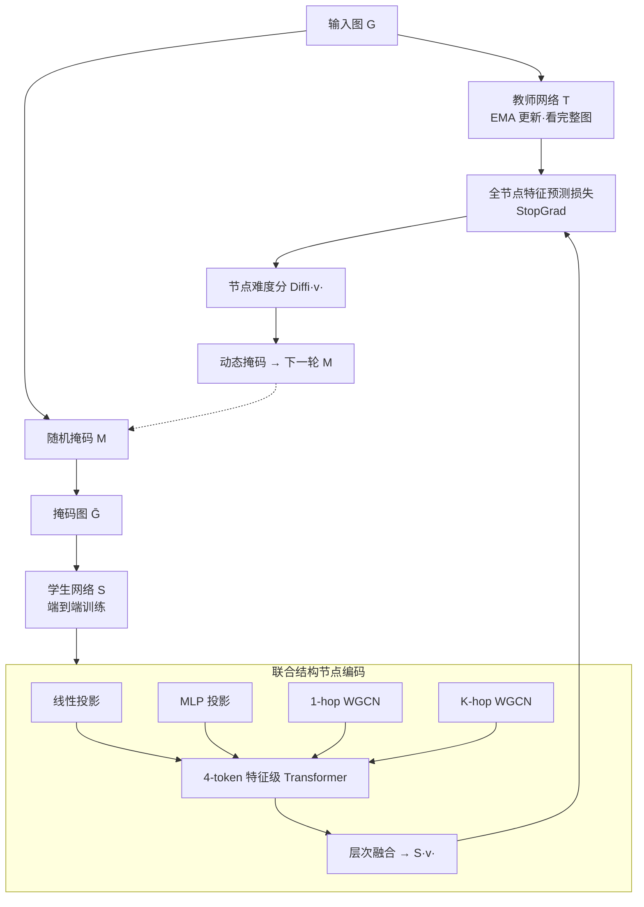

# HarmonyGNNs: Harmonizing Heterophily and Homophily in GNNs via Self-Supervised Node Encoding

**会议**: ICLR 2026  
**OpenReview**: [https://openreview.net/forum?id=mGxtoQY3GA](https://openreview.net/forum?id=mGxtoQY3GA)  
**代码**: 已开源（论文中给出 GitHub 链接）  
**领域**: 图自监督学习 / 图表示学习  
**关键词**: 图神经网络, 自监督学习, 异配图, 同配图, 师生预测架构, JEPA, 动态掩码  

## 一句话总结
HarmonyGNNs 用「师生预测式自监督（JEPA 风格）+ 节点难度驱动的动态掩码」做目标和谐，再用「线性/MLP 投影 + 加权 GCN + 特征级自注意力 + 层次融合」做表示和谐，让同一个无标签框架同时在同配图和异配图上都拿到 SOTA。

## 研究背景与动机
- **领域现状**：图自监督学习（Graph SSL）摆脱了对标签的依赖，在低标注场景下成为主流；但现有方法分两派——对比式（DGI/GRACE/BGRL）依赖复杂的负采样和数据增强，生成式（GraphMAE）则直接重建原始特征。
- **现有痛点**：真实图同时混合**同配**（相连节点标签相似，如 Cora 同配率 0.81）和**异配**（相连节点标签相异，如 Roman-Empire 同配率仅 0.05）两种模式，且强度因数据而异。大多数 Graph SSL 在异配图上表现很差，泛化能力受限——尤其在没有标签引导、只能依赖原始结构和特征的 SSL 设定下，这个问题被进一步放大。
- **核心矛盾**：(1) **目标层面**——对比式用 InfoNCE 这类相对目标，缺乏稳定的全局参考，混合图里说不清哪种模式该主导，无法收敛到统一隐空间；生成式强行重建原始特征，在异配邻居属性相异时会给出自相矛盾的监督信号。(2) **表示层面**——同配区域需要"平滑"以捕捉相似性，异配区域需要"区分"以保留差异，现有方法无法自适应平衡，总偏向某一种模式。
- **本文目标**：用单一统一框架，无需任何关于图属性的先验，自动横跨同配-异配全谱。
- **核心 idea**：**[目标和谐]** 用师生预测架构提供稳定的整体监督锚点 + 节点难度驱动的动态掩码生成既有挑战又有信息量的代理任务；**[表示和谐]** 把节点编码成"既保留节点特异性、又保留结构感知"的联合隐空间，用特征级自注意力自适应混合两类模式。

## 方法详解

### 整体框架
HarmonyGNNs 是端到端的 JEPA 风格图 SSL 框架。教师网络看完整图、学生网络看被部分掩码的图，学生被训练去预测教师对**全部节点**（掩码+未掩码）的嵌入，教师参数是学生的指数滑动平均（EMA）。每个节点先经过"联合结构节点编码"——把线性投影、MLP 投影、两层加权 GCN 输出当作 4 个 token，过一个特征级 Transformer 块再层次融合成最终表示。掩码策略在 warm-up 随机掩码后切换为"利用-探索"：用节点难度分挑出当前最难的节点优先掩码。

### 关键设计

**1. 全节点预测的师生预测架构：用 EMA 锚点替代相对目标，绕开崩塌与负采样。** 受 JEPA 在视觉中成功的启发，作者用师生而非编码器-解码器：对掩码节点 $v\in V_m$，把原始特征替换成从白噪声 $f(v)\sim\mathcal{N}(0,1)$ 初始化的可学习参数；学生 $S(\cdot;\Phi)$ 看掩码图、教师 $T(\cdot;\Psi)$ 看完整图，教师不训练而是学生的 EMA：$\Psi_i=\alpha\Psi_{i-1}+(1-\alpha)\Phi_i$。关键在于损失算的是**整张图**而非只有掩码节点——因为图节点互联依赖强，掩码与未掩码节点会相互影响，只预测掩码节点不足以学到有意义的隐空间：$L(\Phi)=\frac{1}{N}\sum_{v\in V}\lVert S(v;\Phi)-T(v;\Psi)\rVert_2^2$。在隐空间里做特征预测、又有 EMA 稳定的目标，既避免了对比式的负采样，又比生成式直接重建原始特征更不容易在异配区给出矛盾信号。理论上（Thm.1）师生模型的收缩因子 $1-\mu_E^2/\beta_E^2$ 小于编码器-解码器的 $1-\min(\mu_E^2,\mu_D^2)/\max(\beta_E^2,\beta_D^2)$，因此收敛更快、更稳。

**2. 节点难度驱动的动态掩码：让代理任务始终聚焦"学生最学不会的节点"。** 纯随机掩码对拓扑性质未知的图不够，于是先用随机掩码 warm-up，之后按利用率 $r$ 用难度挑 $m=\lfloor M\times r\rfloor$ 个节点、其余随机采样保留探索。难度分直接复用预测损失 $\text{Diffi}(v)=\lVert S(v)-T(v)\rVert_2^2$。两个变体：**+Diffi** 把节点按难度降序排，直接挑前 $m$ 个最难的掩码，但容易过度聚焦少数高难节点；**+Prob** 改用伯努利采样 $M(v)\sim\text{Bernoulli}(p_v)$，$p_v=p_0+\delta_v$，其中基础概率 $p_0=(1-r)\times R$ 对所有节点相同、难度增量 $\delta_v=\frac{\text{Diffi}(v)}{\text{Diffi}_{\max}}\times r\times R$ 让难节点被掩概率更高，兼顾探索与利用（并做 sanity check 防止掩太多/太少）。这样的目标同时和谐了易/难样本与同配/异配信号。

**3. 加权 GCN（WGCN）：用可学习边权在"平滑"与"锐化"间自适应切换。** 传统 GCN 是平滑算子，利同配而损异配。WGCN 让每条边的权重可学：$H^{(l+1)}=\sigma(A\cdot H^{(l)}\cdot W^{(l)})$，其中 $A_{ij}$ 是可学习参数，初始化为带自环的归一化邻接 $\tilde{A}=\tilde{D}^{-1/2}(A+I)\tilde{D}^{-1/2}$，再经 Sigmoid $a_e=\sigma(w_e)$ 把边权约束到 $(0,1)$ 以消除全局重缩放歧义。同配区给相似邻居高权重保留平滑，异配区给相异邻居降权防止过平滑——从而在单一算子里兼顾两种结构，且保持高效、避免复杂设计。

**4. 特征级自注意力 + 层次融合：把"四种视角"当 token 自适应混合，规避 $O(N^2)$ 注意力。** 每个节点把线性投影 $f^{(\text{Linear})}$、MLP 投影 $f^{(\text{Mlp})}$（保留节点特异性、利异配）、两层 WGCN 输出 $H^{(\ell)},H^{(\ell')}$（保留结构感知）拼成 $f(v)\in\mathbb{R}^{4\times C}$，把每个投影当一个 token，用 pre-norm 的 vanilla Transformer 做**特征级**（而非节点级）注意力——复杂度只有 $O(Ns^2h+Nsh^2)$（$s=4$）而非图 Transformer 的 $O(N^2h)$，因此可扩展。融合不是一次性拍平，而是层次式由近到远合并：先融两个 WGCN token，再逐步并入两个投影 token，$S(v)=\sigma(\text{Linear}(X_{0,C}\Vert\sigma(\text{Linear}(X_{1,C}\Vert\sigma(\text{Linear}(X_{2,C}\Vert X_{3,C}))))))$，让模型学到同配/异配模式的"粗到细"加权，参数少、梯度好流。整体编码器复杂度 $O(Ndh+|E|h+Nh^2)$，与标准 GNN 同阶、严格优于节点级图 Transformer。

## 实验关键数据

### 主实验表格（节点分类线性探测，准确率 %）
8 个数据集（4 异配 + 4 同配）上，HarmonyGNNs 在异配图上大幅领先，同配图上持平 SOTA：

| 方法 | Cornell | Texas | Wisconsin | Actor | Cora | CiteSeer | PubMed | Arxiv |
|------|---------|-------|-----------|-------|------|----------|--------|-------|
| 同配率 | 0.30 | 0.11 | 0.21 | 0.22 | 0.81 | 0.74 | 0.80 | 0.66 |
| GraphMAE | 61.93 | 67.80 | 58.25 | 31.48 | 84.20 | 73.20 | 81.10 | 71.75 |
| GraphACL | 59.33 | 71.08 | 69.22 | 30.03 | 84.20 | 73.63 | 82.02 | 71.72 |
| MUSE | 82.00 | 83.98 | 88.24 | 36.15 | 82.22 | 71.14 | 82.90 | 70.98 |
| GREET | 73.51 | 83.80 | 82.94 | 35.79 | 83.84 | 73.25 | 80.29 | 71.09 |
| **HarmonyGNNs+Diffi** | 85.41 | **93.24** | 92.74 | 37.93 | 84.70 | 73.36 | 83.42 | 71.56 |
| **HarmonyGNNs+Prob** | **85.68** | 92.45 | **93.13** | **38.15** | **84.82** | 73.12 | 83.25 | **71.97** |

三个困难异配图上提升更夸张（同配率低至 0.05 的 Roman-Empire）：

| 方法 | Chameleon(filtered) | Squirrel(filtered) | Roman-Empire |
|------|--------|--------|--------|
| MUSE | 46.48 | 41.57 | 66.26 |
| GREET | 44.67 | 39.69 | 63.37 |
| **HarmonyGNNs+Prob** | **48.91** | **45.49** | **75.86** |

相比前 SOTA，Texas +7.1%、Roman-Empire +9.6%、Actor +1.27%。

### 消融实验表格（逐步移除三大组件）

| 配置 | Cornell | Texas | Wisconsin | Actor | Roman | Cora | Arxiv |
|------|---------|-------|-----------|-------|-------|------|-------|
| HarmonyGNNs (Full) | 85.68 | 92.45 | 93.13 | 38.15 | 75.86 | 84.70 | 71.56 |
| w/o DynMsk | 84.26 | 90.16 | 90.08 | 36.98 | 74.01 | 84.10 | 71.00 |
| w/o T-S & DynMsk | 81.78 | 85.59 | 88.56 | 35.86 | 72.87 | 83.10 | 70.02 |
| w/o T-S & DynMsk & Attn | 79.86 | 82.46 | 86.98 | 34.11 | 70.12 | 78.36 | 68.65 |

### 关键发现
- **三个组件都有效**：去掉动态掩码（DynMsk）掉最多 3.05%，再去掉师生架构（T-S）继续下滑，去掉自注意力（Attn）在同配图 Cora 上骤降（84.70→78.36），说明特征级注意力对同配模式尤为关键。
- **+Prob 略优于 +Diffi**：伯努利采样的探索-利用平衡比纯挑最难节点更稳。
- **效率优势明显**：在 Actor/Roman/Arxiv 上，训练总时长显著短于 MUSE 和 GREET（Arxiv 上 476s vs 627s/739s），显存与 GREET 持平、低于 MUSE——因为两个 baseline 用了对比学习的交替训练，而 HarmonyGNNs 隐空间一致、端到端收敛更快。
- **聚类任务一致**：k-means 聚类上 Texas/Cornell 比 MUSE 高 11.26%/12.51%，说明嵌入质量与下游任务无关。

## 亮点与洞察
- **把"同配/异配之争"重构成"目标和谐 + 表示和谐"两个正交维度**，是本文最清晰的概念贡献：前者解决"该相信谁"（稳定 EMA 锚点），后者解决"怎么表达"（节点特异性 vs 结构感知的自适应混合）。
- **将 JEPA（视觉自监督）迁移到图**，并针对图的强互联性把损失从"只预测掩码节点"改成"预测全部节点"，是一个对症的小改动。
- **特征级 token 注意力**而非节点级注意力，是规避图 Transformer 平方复杂度的聪明做法——把"4 种编码视角"当序列，既得到注意力的自适应能力又保持线性复杂度。
- **难度分直接复用预测损失**，零额外开销地实现了"hard node mining"，闭环自然。
- 有完整的收敛性理论分析（Thm.1）支撑"师生比编码器-解码器收敛更快更稳"的直觉。

## 局限与展望
- **方法组件偏多**：师生 EMA + 双动态掩码 + WGCN + 特征级 Transformer + 层次融合，超参（掩码率 $R$、利用率 $r$、warm-up 轮数、EMA 系数 $\alpha$、WGCN 层数）较多，调参成本不低，论文也承认部分 baseline（如 MUSE）难复现。
- **理论假设较强**：Thm.1 依赖强凸、光滑、Lipschitz 等假设，与真实深度网络有差距，更多是"启发性"而非严格保证。
- **数据集规模有限**：最大到 Ogbn-Arxiv，没有验证在百万/千万级超大图上的可扩展性与稳定性。
- **同配图提升有限**：在 CiteSeer/PubMed 上只是持平甚至轻微下降，说明"和谐"主要受益于异配侧，同配侧的天花板已被既有方法逼近。
- 展望：动态掩码可与图结构学习联动、token 设计可进一步引入多尺度结构编码、把框架推广到链路预测/图分类等更多下游任务。

## 相关工作与启发
- **图 SSL 两大流派**：对比式（DGI、GRACE、BGRL、MVGRL）和生成式（GraphMAE、NWR-GAE）——本文指出二者在混合图上分别有"无稳定全局参考"和"重建空间失配"的硬伤。
- **异配图 SSL**：GREET、MUSE、GraphACL、S3GCL、HGRL、DSSL 等针对异配做了改进，但难以同时 hold 住同配；HarmonyGNNs 主打"统一框架横跨全谱"。
- **JEPA / 预测式自监督**：I-JEPA（Assran et al., 2023）、BYOL 式 EMA 师生是目标和谐的直接来源，本文是其图域落地。
- **启发**：(1) 面对"两种对立模式"的问题，与其设计偏向某一侧的归纳偏置，不如造一个可自适应混合的隐空间 + 稳定监督锚点；(2) 把多种编码当 token 做特征级注意力，是给任意 GNN 加"自适应融合"且不爆复杂度的通用招式；(3) 用训练损失本身当难度信号驱动课程式掩码，几乎零成本。

## 评分
- **新颖性**: ⭐⭐⭐⭐ 把 JEPA 式师生预测引入图 SSL 并配合全节点预测、特征级 token 注意力、难度驱动掩码，组合新颖且对症；单个组件多有渊源，但"目标和谐+表示和谐"的整合视角清晰。
- **实验充分度**: ⭐⭐⭐⭐ 11 个数据集横跨同配/异配、线性探测+聚类双下游、三组件消融、效率与显存对比、理论分析齐全；略欠超大图与更多下游任务验证。
- **写作质量**: ⭐⭐⭐⭐ 动机-矛盾-方法-理论-实验逻辑顺畅，图示清晰；组件较多导致方法部分信息密度高。
- **价值**: ⭐⭐⭐⭐ 给"无标签下同时处理同配异配"提供了一个统一、高效、可复现的强 baseline，对图表示学习社区有实用参考价值。

<!-- RELATED:START -->

## 相关论文

- [\[ICLR 2026\] Forest-Based Graph Learning for Semi-Supervised Node Classification](forest-based_graph_learning_for_semi-supervised_node_classification.md)
- [\[NeurIPS 2025\] Geometric Imbalance in Semi-Supervised Node Classification](../../NeurIPS2025/graph_learning/geometric_imbalance_in_semi-supervised_node_classification.md)
- [\[AAAI 2026\] Feature-Centric Unsupervised Node Representation Learning Without Homophily Assumption](../../AAAI2026/graph_learning/feature-centric_unsupervised_node_representation_learning_without_homophily_assu.md)
- [\[AAAI 2026\] Beyond Fixed Depth: Adaptive Graph Neural Networks for Node Classification Under Varying Homophily](../../AAAI2026/graph_learning/beyond_fixed_depth_adaptive_graph_neural_networks_for_node_classification_under_.md)
- [\[NeurIPS 2025\] Self-Supervised Discovery of Neural Circuits in Spatially Patterned Neural Responses with Graph Neural Networks](../../NeurIPS2025/graph_learning/self-supervised_discovery_of_neural_circuits_in_spatially_patterned_neural_respo.md)

<!-- RELATED:END -->
