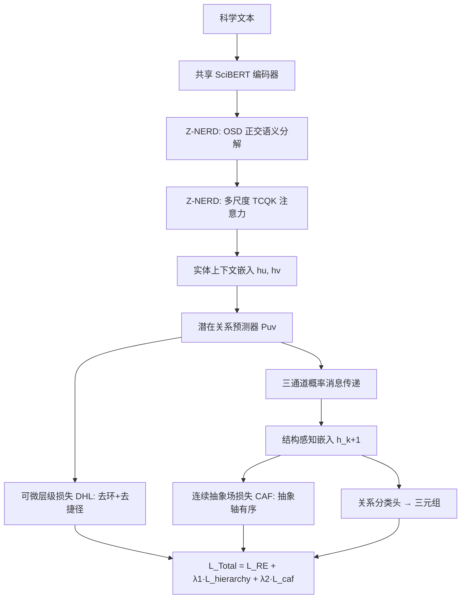

# HGNet: Scalable Foundation Model for Automated Knowledge Graph Generation from Scientific Literature

**会议**: ICLR 2026  
**OpenReview**: [https://openreview.net/forum?id=NWd53rltx8](https://openreview.net/forum?id=NWd53rltx8)  
**代码**: [https://github.com/basiralab/HGNet](https://github.com/basiralab/HGNet)（数据集 [SPHERE](https://github.com/basiralab/SPHERE)）  
**领域**: 图学习 / 科学知识图谱构建  
**关键词**: 知识图谱构建, 命名实体识别, 关系抽取, 层级感知 GNN, 零样本泛化  

## 一句话总结
提出一个约 3 亿参数的两阶段框架：Z-NERD 用「正交语义分解 + 多尺度 TCQK 注意力」做域无关的多词实体识别，HGNet 用「父/子/同辈三通道消息传递 + 可微层级损失 + 连续抽象场损失」把关系抽取约束成一张逻辑自洽、几何有序的有向无环知识图谱，在 SciERC/SciER/SPHERE 上刷新 SOTA。

## 研究背景与动机
**领域现状**：从科学文献自动构建知识图谱（KG）需要两个子任务——命名实体识别（NER）找节点、关系抽取（RE）连边。NER 长期被 SciBERT/BioBERT 这类监督式 transformer 主导，RE 也从句子级模型走向跨文档 GNN。

**现有痛点**：现有方法有四个相互纠缠的短板。（1）长多词实体（如 "in situ transmission electron microscopy"）常被切碎，因为主流模型把 token 边界当作附带产物而非显式目标；（2）跨域泛化差，监督模型一出分布就崩，而 10B+ 的通用 LLM 虽适应性强却又贵又在专业任务上不稳定；（3）模型「层级盲」，靠浅层共现统计而非「深度学习是机器学习子领域」这种层级结构建边；（4）缺乏全局逻辑一致性，无法保证图是合法的有向无环图（DAG），容易出现「A 属于 B 且 B 属于 A」这类矛盾。

**核心矛盾**：通用 LLM 有泛化但成本高、结果不稳；专用监督模型轻量但既不会处理多词实体、也不懂层级与全局一致性。两者都无法同时兼顾「轻量 + 零样本泛化 + 层级 + 逻辑自洽」。

**本文目标**：用一个约 300M 参数的轻量模型，端到端同时解决这四个挑战，达到 foundation model 级的零样本能力但只花专用基线的算力。

**核心 idea**：**把层级抽象当作连续的几何性质**——既用三通道消息传递显式建模层级方向，又用两个互补损失分别保证「逻辑上是 DAG」与「几何上沿一条可学习的抽象轴有序」，并以「语义转折」信号替代词表记忆来实现域无关识别。

## 方法详解

### 整体框架
整个系统共享一个 SciBERT 编码器、端到端联合训练。第一阶段 Z-NERD 把原始文本变成实体，第二阶段 HGNet 接收同一编码器输出的实体上下文嵌入，推断它们的层级与同辈关系并构造全局一致的 KG。HGNet 内部把关系当作隐变量，靠一个潜在关系预测器输出软边权重，同时驱动「消息传递」与「逻辑正则」两条平行路径，最后用标准分类头读出 ⟨头, 关系, 尾⟩ 三元组。

### 关键设计
**1. 正交语义分解 OSD：用「语义转折」替代词表记忆实现零样本泛化。** 作者假设域无关泛化的关键不是追踪整体语义流，而是显式识别「新概念被引入」的瞬间。于是把相邻词嵌入的变化向量 $\Delta E_t = E_t^{text} - E_{t-1}^{text}$ 沿前一个词的方向正交分解：投影到 $E_{t-1}^{text}$ 上的 $v^{sustaining}_t$ 表示对旧概念的延展，而正交分量 $v^{divergent}_t = \Delta E_t - v^{sustaining}_t$ 捕捉概念跳变即「语义转折」。把 $v^{divergent}_t$ 与原始上下文嵌入拼接喂给后续编码器，模型就从「记住领域词汇」转向「感知篇章结构」，从而在没见过的学科上也能识别实体。

**2. 多尺度 TCQK 注意力：让不同注意力头专攻不同长度的 n-gram。** 标准自注意力对词相邻性没有强结构偏置，导致长实体边界识别破碎。作者在算注意力分数前，先用 1D 卷积改造 Query 和 Key：把 $H$ 个头分成 $G$ 组，给每组配一个特定核宽 $k_g$（如 1、3、5）的卷积核 $C_g$，对组内每个头计算 $Q_{conv,h}=C_g(Q_h)$、$K_{conv,h}=C_g(K_h)$。这就把卷积的局部序列感知融进了注意力的全局视野，迫使不同头分别专精单 token、短词组、长实体，让短缩写和长化学名都能被当作一个连贯整体识别。

**3. 概率层级消息传递：父/子/同辈三通道分流信息。** 传统 GNN「层级盲」，在单一无差别图上均匀传播消息，分不清信息是从具体子节点「往上」、从抽象父节点「往下」还是从同辈「横向」流来。HGNet 先用一个 MLP 对每对实体 $(u,v)$ 预测关系分布 $P_{uv}=\mathrm{softmax}(\mathrm{MLP}([h_u\|h_v]))$，类型为 {parent-of, peer-of, no-edge}，把这些概率当软边权重；再用三个独立权重矩阵 $W_{up}, W_{down}, W_{peer}$ 分别聚合父向、子向、同辈消息，最后把三路消息与节点旧状态拼接过更新 MLP，得到下一层结构感知嵌入 $h^{(k+1)}_v = \mathrm{UpdateMLP}([h^{(k)}_v\|m^{parents}_v\|m^{children}_v\|m^{peers}_v])$，从而把「文本邻近」与「概念层级」解耦。

**4. 可微层级损失 DHL：把图压成合法 DAG 并禁止跨级捷径。** 隐图若无约束会预测出环或跳级捷径，腐蚀消息传递。DHL 作用在预测的父邻接矩阵 $A_{parent}$ 上，是两项加权和 $L_{hierarchy}=\lambda_{acyclic}L_{acyclic}+\lambda_{separation}L_{separation}$。无环损失用矩阵指数的迹可微地保证 DAG：$L_{acyclic}=\mathrm{tr}(e^{A_{parent}\circ A_{parent}})-d$（$d$ 为节点数）；层级分离损失 $L_{separation}=\sum_{u,w}(A^2_{parent})_{uw}\cdot(A_{parent})_{uw}$ 用长度-2 路径数乘以直接边，专门惩罚「跳过中间节点的捷径边」，逼模型保持严格父子层级。

**5. 连续抽象场损失 CAF：把抽象度做成嵌入空间的内在几何轴。** 作者主张层级理解本质上是嵌入空间的几何性质，于是引入一个可学习单位向量——抽象场向量 $w_{abs}$ 定义一条「普适抽象轴」，实体 $v$ 的抽象度就是其投影 $\hat y_{abs}(v)=h_v\cdot w_{abs}$（连续实值，避免离散层级）。复合损失 $L_{caf}=L_{ranking}+\gamma_1 L_{anchor}+\gamma_2 L_{regression}$ 由三项塑形：排序项用 margin $\delta$ 强制父子相对顺序 $\max(0,(h_c-h_p)\cdot w_{abs}+\delta)$；锚定项把已知根/叶节点钉到分数 1 和 0；回归项把预测分数拉向由拓扑排序得到的真实拓扑深度 $y_{topo}(v)$。回归项作为主导全局锚点，使模型学到连续抽象谱而非被 $\delta$ 限死的离散层级。这是首个在标准欧氏空间里把抽象形式化为连续属性的方案，作者称其比双曲嵌入更简单、更可解释。最终总损失 $L_{Total}=L_{RE}+\lambda_1 L_{hierarchy}+\lambda_2 L_{caf}$ 端到端联合优化。

## 实验关键数据

### 主实验
**NER（micro F1 %）**，相比监督基线平均提升 8.08%，零样本 SPHERE 域平均提升 10.76%：

| 模型 | SciERC | SciER | BioRED | SemEval | SPHERE-CS(Sup) | CS(ZS) |
|------|--------|-------|--------|---------|----------------|--------|
| SciBERT | 67.52 | 89.15 | 68.19 | 72.90 | 75.83 | 67.29 |
| HGERE | 75.92 | 89.43 | 69.82 | 72.46 | 76.42 | 68.51 |
| UniversalNER-7b | 66.09 | 88.46 | — | — | OOM | — |
| llama-3.3-70b (ZS) | 46.20 | 54.82 | OOM | — | — | — |
| **Z-NERD** | **78.84** | **91.05** | **80.47** | **82.39** | **84.35** | **74.21** |

**RE（strict Rel+ F1 %，分层级/同辈）**，基准数据集平均提升 5.99%：

| 模型 | SciERC-Overall | SciER-Overall | BioRED | SemEval-Overall |
|------|----------------|---------------|--------|------------------|
| HGERE | 43.86 | 58.47 | 32.39 | 38.63 |
| GAT | 46.21 | 57.64 | 32.40 | 39.25 |
| GPT-3.5 Turbo (ZS) | 14.98 | 8.58 | 6.36 | 16.74 |
| **HGNet** | **53.19** | **65.38** | 33.85 | **47.03** |

**SPHERE 零样本 RE（Rel+ F1 %，All）**，相比 SOTA HGERE 平均提升 26.20%：

| 模型 | Comp.Sci. | Physics | Biology | Mat.Sci. |
|------|-----------|---------|---------|----------|
| HGERE | 57.93 | 56.28 | 55.21 | 55.43 |
| **HGNet** | **79.51** | **80.60** | **83.74** | **83.65** |

### 消融实验

| 配置 | SciERC-Overall | SciER-Overall |
|------|----------------|---------------|
| HGNet（完整） | **53.19** | **65.38** |
| w/o DHL（可微层级损失） | 51.68 | 62.79 |
| w/o CAF Loss（抽象场损失） | 47.33 | 58.67 |
| Z-NERD w/o TCQK（NER） | 73.43(SciERC) | 84.43(SciER) |
| Z-NERD w/o OSD（NER） | 74.39(SciERC) | 90.12(SciER) |

### 关键发现
- **TCQK 是 NER 的命脉**：去掉后所有数据集严重下降，证明标准注意力难以连贯识别多词实体，需要显式 n-gram 结构偏置。
- **OSD 在零样本最关键**：去掉后在跨域泛化任务上掉得最狠，验证「语义转折」是学到域无关模式的钥匙。
- **CAF Loss 比 DHL 更影响 RE**：去掉 CAF（53.19→47.33）比去掉 DHL（→51.68）掉得更多，说明把抽象度做成几何属性对层级推理至关重要。
- **零样本场景增益最大**：SPHERE 上 RE 提升 26.20% 远超基准的 5.99%，体现 foundation model 式的迁移能力。

## 亮点与洞察
- **欧氏空间里的连续抽象轴**：用一个可学习单位向量 + 投影分数，把「概念有多抽象」编码成嵌入的内在几何坐标，避开了双曲几何的复杂性，是个干净且可解释的层级表示新范式。
- **关系作为隐变量 + 软边权重**：不显式建图再 GNN，而是边预测概率直接当消息传递权重，让结构推断与表示学习互相促进，端到端可微。
- **轻量却 foundation**：约 300M 参数即匹配专用基线算力，却拿到通用 LLM 才有的零样本泛化，且在专业任务上把 70B 级 LLM 远远甩开（如 RE 上 GPT-3.5 仅 14.98 vs 53.19）。
- **配套大规模基准 SPHERE**：用 LLM 生成-标注流程造出含 100 万+ 段落、11.1 万条标注关系、覆盖 CS/物理/生物/材料四域的层级关系抽取基准，缓解数据稀缺。

## 局限与展望
- **依赖拓扑深度监督**：CAF 的回归项需要从真实层级关系做拓扑排序得到 $y_{topo}$，对没有干净层级标注的数据集如何获得这一信号存疑。
- **抽象单轴假设**：把所有概念压到单一「普适抽象轴」上，对多维/交叉学科的抽象（一个概念在不同维度上抽象度不同）可能过于简化。
- **SPHERE 由 LLM 生成**：训练与评测大量依赖 LLM 生成-标注数据，其噪声与偏置可能传导到模型，零样本增益是否部分来自分布同源值得进一步剥离。
- **acyclic 损失计算成本**：矩阵指数的迹对大图昂贵，虽用 Krylov 子空间加速，超大规模 KG 上的可扩展性仍需验证。

## 相关工作与启发
- **NER**：SciBERT/BioBERT 监督范式、GLiNER/UniversalNER 零样本 span 匹配——本文以 OSD 把焦点从词汇移到篇章结构，区别于依赖表层语义或世界知识的路线。
- **RE 与层级建模**：从句子级 PURE/PL-Marker/HGERE 到跨文档 GNN，再到层级注意力/强化学习——HGNet 是首个为科学文献层级 RE 显式设计三通道消息传递的 GNN。
- **层级的几何/逻辑表示**：双曲几何（Nickel & Kiela）做低失真树嵌入——本文反其道在欧氏空间用 CAF 学全局一致的抽象排序，并配 DHL 强制 DAG 逻辑约束，是对「几何 vs 逻辑」两条线的统一。
- **启发**：把「结构约束」拆成「逻辑（DAG）+ 几何（抽象轴）」两个可微损失分别注入，是给任何需要层级一致性的图生成任务都通用的设计模式。

## 评分
- **新颖性**: ⭐⭐⭐⭐⭐ 「欧氏空间连续抽象场」是真正原创的层级表示范式，OSD 的语义转折视角与 TCQK 的 n-gram 头分工也都很巧。
- **实验充分度**: ⭐⭐⭐⭐ 覆盖 4 个公开基准 + 自建 SPHERE 四域，监督/零样本双设定、NER/RE 双任务、逐组件消融齐全；但部分关键证据散落附录，且 SPHERE 与训练同源略削弱零样本说服力。
- **写作质量**: ⭐⭐⭐⭐ 每个组件都用「假设→机制→公式」组织，逻辑清晰；公式与符号规范，但消息传递三通道与最终关系预测的衔接稍显跳跃。
- **价值**: ⭐⭐⭐⭐⭐ 轻量模型做出 foundation 级零样本科学 KG 构建，配套开源代码与大规模基准，对自动文献综述与知识合成有直接落地价值。

<!-- RELATED:START -->

## 相关论文

- [\[ICLR 2026\] Towards a Foundation Model for Crowdsourced Label Aggregation](towards_a_foundation_model_for_crowdsourced_label_aggregation.md)
- [\[ICLR 2026\] FLOCK: A Knowledge Graph Foundation Model via Learning on Random Walks](flock_a_knowledge_graph_foundation_model_via_learning_on_random_walks.md)
- [\[ICLR 2026\] HYPER: A Foundation Model for Inductive Link Prediction with Knowledge Hypergraphs](hyper_a_foundation_model_for_inductive_link_prediction_with_knowledge_hypergraph.md)
- [\[NeurIPS 2025\] GFM-RAG: Graph Foundation Model for Retrieval Augmented Generation](../../NeurIPS2025/graph_learning/gfm-rag_graph_foundation_model_for_retrieval_augmented_generation.md)
- [\[ICLR 2026\] RAS: Retrieval-And-Structuring for Knowledge-Intensive LLM Generation](ras_retrieval-and-structuring_for_knowledge-intensive_llm_generation.md)

<!-- RELATED:END -->
