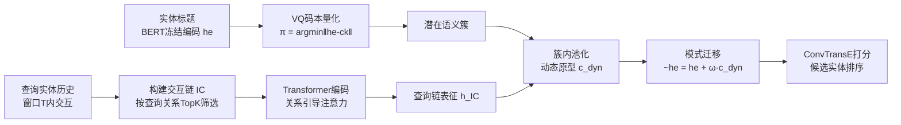

# Inductive Reasoning for Temporal Knowledge Graphs with Emerging Entities

**会议**: ICLR 2026  
**代码**: [https://github.com/zhaodazhuang2333/TransFIR](https://github.com/zhaodazhuang2333/TransFIR)  
**领域**: 图学习 / 时序知识图谱推理  
**关键词**: 时序知识图谱, 归纳推理, 新增实体, 向量量化码本, 表征坍缩, 模式迁移  

## 一句话总结
针对时序知识图谱里「没有任何历史交互」的新增实体，TransFIR 用一个 BERT 文本嵌入 + 可学习 VQ 码本把实体归入语义簇，再把语义相似的已知实体的交互链模式迁移过去，从而避免表征坍缩，在四个基准上 MRR 平均提升 28.6%。

## 研究背景与动机
**领域现状**：时序知识图谱（TKG）推理的任务是给定查询 $(e_s, r, ?, t_q)$ 预测未来某时刻缺失的实体，支撑事件预测、时序问答、临床风险分析等应用。主流方法（REGCN、LogCL、HisRes 等）擅长建模关系动态演化，在标准测试集上表现很强。

**现有痛点**：这些方法几乎都建立在**封闭世界假设**之上——训练时实体集合固定。但真实图谱里实体持续涌入：社交平台不断加新用户、分子网络不断来新化合物。作者的实证研究发现，TKG 中约 **25% 的实体只在推理集出现**，训练时从未见过、也没有任何历史交互。

**核心矛盾**：现有方法依赖实体专属嵌入（transductive），新增实体由于缺乏历史交互监督信号，嵌入无法被有效训练。作者用 t-SNE 和自定义的 Collapse Ratio（基于协方差 log-det 的旋转不变指标）量化发现：LogCL 训练后新增实体的 Collapse Ratio 从 1.02 暴跌到 0.0055，发生严重的**表征坍缩**——新增实体嵌入挤成一团、与已知实体漂移到不同流形上，导致在涉及新增实体的三元组上性能大幅下降。静态 KG 的归纳方法（InGram、ULTRA）虽能处理新实体，但它们假设新实体已经带有已知交互，无法应对「零交互」的 TKG 新增实体。

**本文目标**：正式定义「无历史交互的 TKG 新增实体归纳推理」任务，并设计一个能在零交互下防止表征坍缩、为新增实体生成有信息量表征的框架。

**核心 idea**：作者观察到——**语义类型相似的实体往往有可迁移的交互模式**（不同国家的新任总统都遵循「出访→谈判」这类事件序列）。基于此，**用语义簇作为桥梁**，把语义相似已知实体的交互链模式迁移给新增实体。

## 方法详解

### 整体框架
TransFIR 遵循一条 **Classification → Representation → Generalization** 三段式流水线：先用文本嵌入 + VQ 码本把所有实体（含新增）映射到潜在语义簇（提供「无需历史」的类别先验）；再围绕查询实体构建并编码「交互链」（Interaction Chain）以捕捉可迁移的有序交互模式；最后在每个簇内做动态原型池化与模式迁移，让零交互的新增实体也能借到同簇已知实体的时序模式，得到有信息量的时间感知表征。

### 关键设计

**1. 交互感知的 VQ 码本分类：给零交互实体一个类别先验。** 直接更新实体嵌入会让缺监督的新增实体坍缩，纯靠冻结嵌入又无法适应 TKG 的动态交互——作者折中：**实体嵌入冻结、簇原型可训练**。每个实体先用预训练 BERT 对其标题取静态文本嵌入 $h_e \in \mathbb{R}^d$（冻结，所以新增实体即使零交互也能被编码）；维护可学习码本 $C=\{c_1,\dots,c_K\}$，把实体量化到最近码字 $\pi(e)=\arg\min_k \|h_e - c_k\|_2^2$。码本通过码本损失 $L_{cb}=\|\mathrm{sg}[h_e]-c_{\pi(e)}\|_2^2$（拉原型靠近嵌入）和承诺损失 $L_{commit}=\|h_e-\mathrm{sg}[c_{\pi(e)}]\|_2^2$（拉嵌入靠近原型）联合优化，$\mathrm{sg}[\cdot]$ 为停梯度。与静态聚类不同，码字与任务目标联合训练，使簇变得「交互感知」，让 Country / Civic & Parties / Citizen 这类语义一致的类型自然浮现。

**2. 交互链编码：用有序序列而非无序邻域捕捉实体无关的时序模式。** 既然可迁移的是「出访→谈判」这类**有序事件序列**，那就不能用打乱顺序的时序邻域。对查询 $q=(e_q, r_q, ?, t_q)$，在窗口 $T$ 内按时间顺序收集 $e_q$ 的历史交互构成交互链 $C_q$，再按关系与查询关系的余弦相似度做 TopK 筛选 $C_q^{(k)}=\mathrm{TopK}_i(\mathrm{sim}(h_{r_q}, h_{r_i}), C_q)$，只保留最相关的 $k$ 条并维持时间序。每条交互经分量特定变换并融合 $x_i = f(\phi_e(h_{s_i}), \phi_r(h_{r_i}), \phi_e(h_{o_i}), \phi_\tau(h_{\Delta t_i}))$，其中实体嵌入冻结、关系嵌入可训练、$\Delta t_i = t_q - t_i$ 编码相对时间间隔。序列经 Transformer 上下文化后，用查询关系 $h_{r_q}$ 调制的关系引导注意力 $\alpha_i \propto \exp(w^\top \tanh(W_h h_i + W_q h_{r_q}))$ 加权求和，得到查询特定的链表征 $h_{e_q}^{IC}$，突出与 $r_q$ 最相关的交互。

**3. 链模式迁移：从同簇已知实体「借」时序模式给新增实体。** 链编码只刻画查询实体自身，新增实体交互稀疏仍然静态。于是在每个时刻 $t$ 按码本归属做**簇内池化**得到动态原型 $c_k^{dyn}=\frac{1}{|Q_k|}\sum_{e\in Q_k} h_e^{IC}$（$Q_k$ 为簇 $k$ 的实体集），它汇聚了该语义簇共享的时序演化。然后每个实体把静态嵌入与簇原型拼接 $z_e=[h_e \| c_{\pi(e)}^{dyn}]$，经参数映射生成迁移向量 $\omega_e=\Psi(z_e)$，最终表征 $\tilde{h}_e = h_e + \omega_e \cdot c_{\pi(e)}^{dyn}$。零交互的新增实体由此继承同簇已知实体的交互链信息。打分用 ConvTransE：$\phi(e_q, r_q, e_o, t)=\sigma(f(\tilde{h}_{e_q}, h_{r_q}, \tilde{h}_{e_o}))$，总损失为链接预测交叉熵加码本损失 $L = L_{lp} + \lambda L_{codebook}$，两者同步训练。

## 实验关键数据

### 主实验表格
四个基准（ICEWS14/18/05-15、GDELT），采用 5:2:3 时间切分（比常规 8:1:1 暴露更多新增实体），只评估**涉及新增实体的三元组**。对比 13 个 graph-based / path-based / inductive 基线：

| 方法 | ICEWS14 MRR | ICEWS18 MRR | ICEWS05-15 MRR | GDELT MRR |
|------|------|------|------|------|
| REGCN (2021) | 0.1175 | 0.0947 | 0.0887 | 0.0222 |
| LogCL (2024) | 0.1354 | 0.0903 | 0.1917 | 0.0473 |
| HisRes (2025) | 0.1169 | 0.0445 | 0.1325 | 0.0932 |
| CompGCN (2020) | 0.0682 | 0.0638 | 0.1885 | 0.0472 |
| InGram (2023) | 0.0563 | 0.0254 | 0.0771 | 0.0471 |
| **TransFIR** | **0.1687** | **0.1177** | **0.2204** | **0.1103** |
| 提升 | +24.6% | +24.3% | +15.0% | +50.5% |

Hits@10 上 GDELT 提升高达 **101.4%**，四数据集平均 MRR 提升 **28.6%**。

### 消融实验表格
（Hits@10 视角，移除各模块均掉点）

| 变体 | 说明 | 影响 |
|------|------|------|
| -Codebook | 去码本映射，仅用静态聚类特征 | **掉点最严重**之一 |
| -Pattern Transfer | 去模式迁移，用静态表征 | **掉点最严重**之一 |
| -IC | 去交互链，仅用实体嵌入 | 明显掉点 |
| -Textual encoding | 去冻结文本嵌入，随机初始化 | 掉点（GDELT 例外） |

### 关键发现
- **表征坍缩被显著缓解**：Collapse Ratio 从 LogCL 的 0.0055 提升到 TransFIR 的 0.8677，t-SNE 显示嵌入从「单一稠密团」变成「良好分离的簇」。
- **码本→真实语义类型**：三个簇被识别为 Country / Civic & Parties / Citizen，新增实体被一致归入正确簇；案例研究中「墨西哥总统候选人发表声明」通过 Civic & Parties 簇里罗马尼亚总理、墨西哥官员的「make statement → Gov」模式成功预测 Gov(Mexico)。
- **码本与模式迁移是双核心**：消融显示这两个模块缺一不可。
- **GDELT 文本编码反例**：GDELT 实体标题多缩写/符号（如 "EGYPT (EGY@ OPP REF...)"），去掉文本编码反而有时更好，说明文本质量影响模块收益。

## 亮点与洞察
- **问题定义有价值**：把「无历史交互的 TKG 新增实体推理」正式化，并用 25% 占比的实证 + Collapse Ratio 指标把「表征坍缩」这个根因量化坐实，问题动机扎实。
- **用语义簇当迁移桥梁的思路自然**：观察「相似类型实体共享交互模式」→ 码本聚类 → 簇内池化迁移，逻辑闭环顺畅，可解释性强（簇真的对应国家/政党/公民等类型）。
- **冻结嵌入 + 可训练原型的折中很巧**：既避免新增实体嵌入坍缩，又让聚类随交互动态自适应，是本文防坍缩的关键设计抉择。

## 局限与展望
- **强依赖实体文本标题**：方法靠 BERT 编码实体标题，对标题缺失或充满缩写/符号的图谱（如 GDELT）退化，作者也承认需引入外部知识丰富实体描述。
- **码本大小 K 是超参**：簇数需手调，论文未深入讨论 K 对不同规模图谱的敏感性（虽附录有敏感性分析）。
- **只评估新增实体三元组**：主实验聚焦 emerging 设定，对整体（含已知实体）的全局性能影响、与 SOTA 在 vanilla 设定下的权衡讨论较少。
- **迁移粒度较粗**：模式迁移在簇级别做均值池化，可能丢失簇内细粒度差异，未来可探索注意力加权的细粒度迁移。

## 相关工作与启发
- **TKG 推理**：REGCN、LogCL、HisRes 等建模关系动态，但封闭世界假设；本文是首批系统处理零交互新增实体的工作之一。
- **归纳 KG 推理**：InGram 构建关系亲和图、ULTRA 用相对交互表征泛化到新实体，但都针对静态 KG 且要求新实体已有交互——本文把归纳推理推进到「时序 + 零交互」的更难设定。
- **向量量化**：借鉴 VQ-VAE 的码本机制做语义聚类，启发是 VQ 不只用于生成，也可作为「类别先验注入」的轻量工具，对冷启动/零样本问题有普适价值。

## 评分
- **新颖性**: ⭐⭐⭐⭐ 把「零交互新增实体」这一被忽视的现实问题正式化，用 VQ 码本 + 交互链 + 簇内模式迁移的组合解法新颖、自洽。
- **实验充分度**: ⭐⭐⭐⭐ 四数据集、13 基线、完整消融 + 表征分析 + 案例研究 + Unknown 设定/鲁棒性/敏感性等扩展实验，覆盖全面。
- **写作质量**: ⭐⭐⭐⭐ 三视角实证（Data/Representation/Feasibility）层层递进引出动机，Collapse Ratio 量化清晰，三段式 pipeline 表述明确。
- **价值**: ⭐⭐⭐⭐ 新增实体冷启动是 TKG 落地的真实痛点，28.6% 的平均提升和强可解释性使方法有实用前景。

<!-- RELATED:START -->

## 相关论文

- [\[ICLR 2026\] Knowledge Reasoning Language Model: Unifying Knowledge and Language for Inductive Knowledge Graph Reasoning](knowledge_reasoning_language_model_unifying_knowledge_and_language_for_inductive.md)
- [\[ICLR 2026\] Beyond Entity Correlations: Disentangling Event Causal Puzzles in Temporal Knowledge Graphs](beyond_entity_correlations_disentangling_event_causal_puzzles_in_temporal_knowle.md)
- [\[ICLR 2026\] Revisiting Node Affinity Prediction in Temporal Graphs](revisting_node_affinity_prediction_in_temporal_graphs.md)
- [\[ICLR 2026\] HYPER: A Foundation Model for Inductive Link Prediction with Knowledge Hypergraphs](hyper_a_foundation_model_for_inductive_link_prediction_with_knowledge_hypergraph.md)
- [\[ICLR 2026\] TGM: A Modular and Efficient Library for Machine Learning on Temporal Graphs](tgm_a_modular_and_efficient_library_for_machine_learning_on_temporal_graphs.md)

<!-- RELATED:END -->
