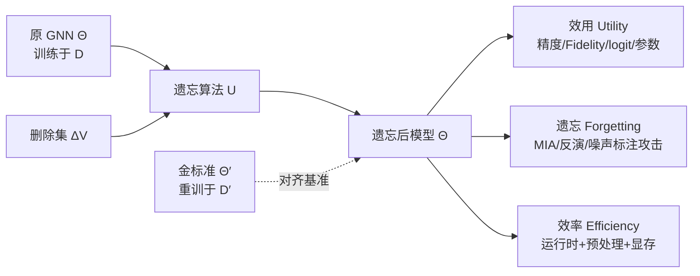

# Is Graph Unlearning Ready for Practice? A Benchmark on Efficiency, Utility, and Forgetting

**会议**: ICLR 2026  
**OpenReview**: [https://openreview.net/forum?id=gSPkuTTWgU](https://openreview.net/forum?id=gSPkuTTWgU)  
**代码**: [https://github.com/idea-iitd/Unlearning_Benchmark](https://github.com/idea-iitd/Unlearning_Benchmark)  
**领域**: 图机器学习 / 机器遗忘（Graph Unlearning）/ Benchmark  
**关键词**: 图神经网络, 机器遗忘, GDPR, 隐私攻击, 基准测试, 节点删除  

## 一句话总结
本文构建了首个面向 GNN 遗忘（graph unlearning）的系统性基准，用"效率、效用、遗忘质量"三大维度横扫 10 类主流方法 × 7 个数据集，得出一个相当扫兴但务实的结论：在大规模图上，绝大多数遗忘方法既不比从头重训快、也没真正忘干净，**重训目前仍是最靠谱的选择**。

## 研究背景与动机
**领域现状**：GDPR 等法规赋予用户"被遗忘权"，要求模型能在收到删除请求后抹掉特定训练数据的影响。对部署在社交、推荐等场景的 GNN 而言，这催生了 graph unlearning——在不从头重训的前提下，从已训练 GNN 中移除指定节点/边的影响。近年涌现出学习类（GNNDELETE、MEGU）、影响函数/投影类（GIF、IDEA、GST、PROJECTOR）、分片聚合类（GRAPHERASER、GUIDE）、认证类（CGU、SCALEGUN）等一大批方法。

**现有痛点**：这个领域缺一把统一的尺子。作者点出三个评测裂缝——（1）**评测口径混乱**：到底该对齐重训模型的预测精度、logit 分布、还是参数？各家各取一瓢，结果互不可比；（2）**效率对比缺位**：遗忘要有意义，前提是它得比"删数据后重训"更快，但大图上系统性的时间/显存对比经常缺席；（3）**泛化与鲁棒性盲区**：方法在同配/异配图、随机删除/定向删除、线性/非线性 GNN 下的表现差异几乎没人系统测过，很多"认证遗忘"还只在线性 GNN + 二分类的窄设定下成立。

**核心矛盾**：遗忘研究在"理论保证"和"实际可用"之间存在张力——追求 certified 保证的方法被迫绑定线性 GNN、一对多二分类，丧失了对真实非线性多类 GNN 的适用性；而真正灵活的方法又常在大图上爆显存或慢过重训。

**本文目标**：不提新算法，而是回答两个工程师真正关心的问题：**现有遗忘方法相比重训到底有没有实际优势？如果有，针对给定 workload 该怎么选？**

**核心 idea**：**【诊断式三维基准】** 把遗忘的"好坏"拆成正交的三问——是否更快（efficiency）、是否保住效用且贴近重训金标准（utility），以及是否真的忘掉了（forgetting）；并在每一维上用多层级、多攻击的细粒度指标戳穿单一指标（如只看 AUC）掩盖的假象。

## 方法详解

### 整体框架
本文不是算法而是评测协议，骨架是"三大约束 → 多层级指标 → 五个研究问题（RQ）"。给定原模型 $\Theta$（在 $D$ 上训练）和删除集 $\Delta V_{train}$，遗忘算法产出 $\tilde{\Theta} \leftarrow U(\Theta, \Delta V_{train})$，金标准是在删后数据 $D'$ 上从头重训得到的 $\Theta'$。基准就是用统一协议，逐层比较 $\tilde{\Theta}$ 与 $\Theta'$ 的差距、衡量遗忘是否彻底、并核算相对重训的时间/显存成本。

### 关键设计

**1. 效用的四层级评测：从粗到细戳穿"精度幻觉"** 作者认为只看聚合精度极易误判，因此沿信息空间从粗到细设四道关卡。最粗的是**聚合精度** $Acc = \frac{1}{|V_{test}|}\sum_{v} \mathbb{1}[f_\Theta(v)=y_v]$；往细一层是**保真度 Fidelity** $\frac{1}{|V_{test}|}\sum_v \mathbb{1}[f_{\tilde\Theta}(v)=f_{\Theta'}(v)]$，衡量遗忘模型与金标准在逐个节点上是否给出相同预测——两个模型精度几乎一样却可能在大量个体上分歧；再细是 **logit 空间 $\ell_2$ 距离**，捕捉整个输出分布的偏移（即使预测标签相同，置信度分布也可能天差地别）；最细是**参数空间 $\ell_2$ 距离**，直接比 $\tilde\Theta$ 与 $\Theta'$ 的权重（论文附带引理：参数接近则各层激活也接近）。这四层一旦展开，立刻暴露出 IDEA 这类"标签对得上、置信度分布却严重跑偏"的方法。

**2. 三族隐私攻击度量"是否真忘"** 效用高不等于忘干净——模型可以既贴近金标准又仍残留被删数据的信息，所以遗忘必须独立评估。作者用三种互补攻击各探一种残留：**成员推断攻击（MIA）** 检验对手能否判断某节点曾在训练集中（最基本的隐私要求）；**遗忘反演攻击（UIA）** 仅靠黑盒访问 $\tilde\Theta$ 尝试重建被删的边，专门捕捉消息传递带来的结构泄漏，这是 MIA 看不到的；**噪声标注器攻击** 检验 $\tilde\Theta$ 是否仍给被删节点打出高置信度的原类别预测，探测标签层面的泄漏。三者分别对应成员、结构、标签三种泄漏面，合起来才算把"遗忘"测全。

**3. 把预处理算进效率，并压力测试真实删除分布** 以往效率对比常只报遗忘那一步的耗时，作者坚持**效率必须以"是否快过重训"为准绳**，且把分片、认证等方法的预处理开销和显存占用一并计入（Table 7 用括号标出预处理占比、用红色标出超过金标准的格子）。在此基础上，基准还跳出"删除请求均匀随机"的不现实假设，加入按度数、按标签频率倾斜等对抗性删除分布（RQ5），并用 Reddit（1.1 亿条边）专测可扩展性。

**4. 五个研究问题串起诊断维度** 整套评测由五问驱动：RQ1 效用（遗忘模型多大程度逼近重训、何时崩）、RQ2 效率（到底省没省时间和显存）、RQ3 遗忘（删的数据真的忘了吗）、RQ4 大规模连续删除（能否扛住多轮删除请求而不崩）、RQ5 跨 workload 鲁棒性（非随机删除下是否稳定）。每问对应前述某层指标，从而把"哪些方法在什么场景能用、何时失效、为什么"讲清楚。

## 实验关键数据

覆盖 7 个数据集（CORA、CITESEER、PHOTO、AMAZON-Ratings、ROMAN-Empire、OGBN-Arxiv，外加 Reddit 测扩展性），同配/异配兼有；默认 GCN backbone，每实验重复 5 次；硬件 A100-40GB，OOM = 爆显存，OOT = 超 24 小时。

### 主实验：遗忘 10% 节点的精度（Table 3，越高越好）

| 方法 | CORA | CITESEER | PHOTO | AMAZON-R | ROMAN-E | OGBN-ARXIV |
|------|------|------|------|------|------|------|
| GOLD（重训金标准） | 0.88 | 0.73 | 0.93 | 0.43 | 0.41 | 0.60 |
| MEGU | 0.89 | 0.77 | 0.92 | 0.42 | 0.41 | 0.61 |
| GIF | 0.88 | 0.76 | 0.92 | 0.43 | 0.44 | 0.59 |
| IDEA | 0.87 | 0.77 | 0.93 | 0.41 | 0.48 | 0.56 |
| PROJECTOR | 0.84 | 0.77 | 0.87 | **0.47** | **0.50** | 0.61 |
| GNNDELETE | 0.76 | 0.76 | 0.34 | 0.37 | 0.33 | OOM |
| GST | OOM | OOM | OOM | OOM | OOM | OOM |
| COGNAC | 0.84 | 0.68 | 0.92 | 0.45 | 0.51 | 0.68 |
| ETR | 0.89 | 0.81 | 0.93 | 0.41 | 0.30 | 0.58 |

同配图上 MEGU/GIF/IDEA 紧贴金标准；异配图（AMAZON-R、ROMAN-E）排名翻盘，PROJECTOR 凭自定义线性 GNN 反而领先；GST 全线 OOM 被直接淘汰。

### 细粒度对齐：Fidelity / Logit 距离（Table 4-5，遗忘比 0.1）

| 方法 | Fidelity(CORA→ARXIV) | Logit $\ell_2$(CORA→ARXIV) |
|------|------|------|
| MEGU | 0.95→0.91（GCN 类最佳） | 3.05→3.53（GCN 类最佳） |
| GIF | 0.93→0.85 | 3.60→5.03 |
| IDEA | 0.92→0.76 | **18.0→45.8（严重跑偏）** |
| PROJECTOR | 0.99→0.98（线性 GNN，不可直接比） | 0.09→0.41 |

关键反差：IDEA 的 Fidelity 看似不错，但 logit 距离爆炸——说明它"标签蒙对了、置信度全错"，印证了多层级评测的必要性。GCN 阵营里 MEGU 在 fidelity 与 logit 两项都最稳。

### 效率（Table 7，总时间含预处理，红=慢过金标准）

| 方法 | CORA | PHOTO | AMAZON-R | ARXIV | Reddit |
|------|------|------|------|------|------|
| GOLD | 0.65 | 0.90 | 1.70 | 9.90 | 基准 |
| MEGU | 0.61 | 0.51 | 2.50🔴 | 20.49🔴 | OOM |
| GIF | 0.39 | 0.37 | 0.74 | 4.79 | OOM |
| IDEA | 0.38 | 0.40 | 0.47 | 5.31 | OOM |
| GRAPHERASER | 22.9🔴 | 30.0🔴 | 28.7🔴 | 116🔴 | OOM |
| GUIDE | 77.7🔴 | 919🔴 | 782🔴 | OOM | OOM |
| ETR | 1.65🔴 | 2.02🔴 | 1.84 | — | **唯一快过 GOLD** |

### 关键发现
- **效用最强的 MEGU 在大图上反而慢过重训**（ARXIV 20.5s vs 重训 9.9s），失去遗忘的意义。
- **分片类（GRAPHERASER/GUIDE）被预处理拖垮**，慢几十到上千倍，预处理常占 50–75%。
- **Reddit（1.1 亿边）上除 COGNAC、ETR 外几乎全部 OOM**，ETR 是唯一在 Reddit 上快过重训的方法。
- **PROJECTOR 最快但有隐藏成本**：随特征维度多项式增长，且绑死自定义线性 GNN，公平性存疑。
- 综合三维：**没有一个方法在大图上同时做到更快 + 保效用 + 真遗忘**，许多现实场景下从头重训仍是最优解。

## 亮点与洞察
- **把"遗忘好不好"拆成正交三问**，并坚持用"是否快过重训"作为效率硬门槛，这一务实视角戳破了大量论文回避的尴尬现实。
- **多层级 + 多攻击诊断**让评测从"看一个数"升级为"看一套画像"，能解释方法何时失效、为什么失效（如 IDEA 的 logit 跑偏、SISA 的预处理税）。
- **结论敢说反话**：在 benchmark 论文普遍"和稀泥"的当下，本文明确建议把研究重心从"窄假设下的理论保证"转向"可扩展、可批处理的实现"，并指出 certified/projection 路线实际价值有限——这种 actionable guidance 比单纯堆实验更有分量。

## 局限与展望
- **主要聚焦节点删除**，边/特征遗忘只在附录评测，覆盖深度有限。
- **认证方法（CGU/SCALEGUN）被排除在主基准外**（受限于线性 GNN + 二分类），只在附录单独比，无法与主流方法同台。
- 评测以 GCN 为默认 backbone，对更强的异构/注意力类 GNN 在遗忘下的行为揭示有限。
- 结论"重训更优"在很大程度上由当前方法的工程成熟度决定——文章本身也指出，若主流方法补上可扩展、可批处理实现，结论可能改写，这正是它留给后续研究的明确方向。

## 相关工作与启发
本文与已有的 GNN 遗忘 benchmark（Fan et al., 2025）在三点上拉开差距：（1）从"堆实验"升级为"给可操作准则"，告诉实践者何时该遗忘、何时只能重训；（2）从单一聚合指标升级为预测/logit/权重多层对齐；（3）把"相对重训的效率"当作不可或缺的一等公民。对从业者的启发很直接：选遗忘方法前先问三句——它在你的图规模上跑得动吗？比重训快吗？真忘干净了吗？任何一项答不上来，重训可能才是诚实的选择。

## 评分
- **新颖性**: ⭐⭐⭐⭐ 不提新算法，但"三维诊断 + 效率硬门槛 + 多攻击遗忘度量"组成的评测框架是该领域首个系统性基准，视角新且切中要害。
- **实验充分度**: ⭐⭐⭐⭐⭐ 10 类方法 × 7 数据集 × 四层效用 × 三族攻击 × 多删除分布 + 大规模 Reddit 压测，覆盖面与诚实度都很高。
- **写作质量**: ⭐⭐⭐⭐ 问题驱动（5 个 RQ）、表格信息密度高、结论敢于给出反直觉判断，逻辑清晰。
- **价值**: ⭐⭐⭐⭐⭐ 直接回答"遗忘能不能替代重训"，给出可落地的选型准则，并为后续研究重新校准了优先级，对 GDPR 合规部署有现实指导意义。

<!-- RELATED:START -->

## 相关论文

- [\[ICLR 2026\] LRIM: a Physics-Based Benchmark for Provably Evaluating Long-Range Capabilities in Graph Learning](lrim_a_physics-based_benchmark_for_provably_evaluating_long-range_capabilities_i.md)
- [\[ICLR 2026\] GDGB: A Benchmark for Generative Dynamic Text-Attributed Graph Learning](gdgb_a_benchmark_for_generative_dynamic_text-attributed_graph_learning.md)
- [\[ICLR 2026\] DHG-Bench: A Comprehensive Benchmark for Deep Hypergraph Learning](dhg-bench_a_comprehensive_benchmark_for_deep_hypergraph_learning.md)
- [\[CVPR 2026\] R2G: A Multi-View Circuit Graph Benchmark Suite from RTL to GDSII](../../CVPR2026/graph_learning/r2g_multi_view_circuit_graph_benchmark_suite_from_rtl_to_gdsii.md)
- [\[ICML 2025\] Balancing Efficiency and Expressiveness: Subgraph GNNs with Walk-Based Centrality](../../ICML2025/graph_learning/balancing_efficiency_and_expressiveness_subgraph_gnns_with_walk-based_centrality.md)

<!-- RELATED:END -->
