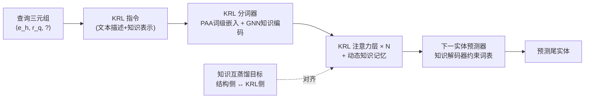

# Knowledge Reasoning Language Model: Unifying Knowledge and Language for Inductive Knowledge Graph Reasoning

**会议**: ICLR 2026  
**OpenReview**: [https://openreview.net/forum?id=2g8EmFwNTB](https://openreview.net/forum?id=2g8EmFwNTB)  
**代码**: [https://github.com/lazyloafer/KRLM](https://github.com/lazyloafer/KRLM)  
**领域**: 图学习 / 知识图谱推理 / LLM  
**关键词**: 归纳式知识图谱推理, 知识图谱基础模型, LLM, 知识失真, 知识互蒸馏  

## 一句话总结
KRLM 把知识图谱的结构表示与 LLM 的内在知识统一成一种"知识推理语言"(KRL)，通过 KRL 分词器、带知识记忆的 KRL 注意力层和结构感知的下一实体预测器三件套，在归纳式 KGR 任务上抑制 LLM 被稀疏 KG 上下文带偏的"知识失真"和越界幻觉。

## 研究背景与动机
**领域现状**：归纳式知识图谱推理(Inductive KGR)要在含未见实体/关系的开放域 KG 上补全事实，核心是把训练 KG 的结构不变性泛化到陌生 KG。早期工作用知识图谱基础模型(KGFM, 如 ULTRA)捕捉跨 KG 的结构不变表示获得零样本能力；近期则进一步引入 LLM，做出 MKGL、PROLINK 这类 LLM-based KGFM，借 LLM 的开放域知识涌现挖掘更多隐含事实。

**现有痛点**：当前 LLM-based KGFM 普遍把稀疏的结构知识**显式地拼成提示词(prompt)**喂给 LLM。问题是 KG 抽出的上下文证据非常稀疏，反而会**盖过 LLM 内在的稠密知识**——论文用 Trainspotting 的例子说明：KG 里关于"film_genre"的唯一线索是"就读于音乐戏剧学院"，LLM 被这条有毒关联带偏，丢掉了自己本就知道的"dark comedy"答案。**核心矛盾**：KG 与 LLM 之间存在天然的知识表示鸿沟，两者协调不充分就会造成不可逆的"知识失真(knowledge distortion)"；同时 LLM 的涌现能力又会带来越界(out-of-scope)幻觉，损害推理结果的可信度。

**本文目标**：在整个 KGR 流程中实现 LLM 内在知识与 KG 结构上下文的统一协调，既治知识失真又约束越界幻觉。

**核心idea**：**隐式注入而非显式拼接** —— 把 KG 的实体/关系编码成隐式知识表示，分别注入到推理指令(KRL instruction)和 LLM 参数(注意力层)两处，让 LLM 在一个更柔性的环境里去适配外部知识，而不是被生硬的稀疏 prompt 直接覆盖。

## 方法详解

### 整体框架
给定查询三元组 $\langle e_h, r_q, ?\rangle$，KRLM 先把它转成一条融合 LLM 内在知识(文本描述)与 KG 知识(结构嵌入)的 **KRL 指令**；经 **KRL 分词器**得到 token 嵌入序列(词级嵌入由 PAA 模块给出、结构知识表示由 GNN 知识编码器给出)；序列送入 $N$ 层 **KRL 注意力层**，借动态知识记忆机制在 in-context learning 中协调两类知识；最后由 **结构感知的下一实体预测器**把结果严格约束在当前 KG 的实体词表内。训练用知识互蒸馏目标让结构侧与 KRL 侧打分分布互相对齐。

### 关键设计

**1. KRL 分词器与 PAA 模块：把无限实体压进定参表示。** KRL 指令包含一张全局词表，逐行列出实体/关系的"词级形式—类型—文本描述—知识表示"，让 LLM 像对照词典一样理解陌生元素。对每个实体，先用 LLM 自带的文本分词器把"<Entity: 文本描述>"切成 token 嵌入序列 $\{t_1,\dots,t_L\}$，再用主属性聚合(Principal Attribute Aggregation)把多视角统计量拼接融合成单个词级嵌入 $w_e = \mathrm{PAA}(\{t_1,\dots,t_L\})=\big(\big\|_{\mathrm{attr}\in\{\text{mean,max,min,std}\}}\mathrm{attr}(\{t_1^*,\dots,t_L^*\})\big)W_{\text{fusion}}$。这一步的妙处在于：新实体/关系的词级嵌入完全由固定的可训练矩阵 $W_{\text{down}}, W_{\text{fusion}}$ 生成，无需为每个新词扩参，因此能在**常数规模参数**下支持开放世界里无限增长的实体/关系——这正是归纳式任务最需要的。结构侧则由 $S$ 层 NBFNet 充当知识编码器，按式 (1) 产出全体实体/关系的结构不变表示 $E, R$，再经线性层 $F_{\text{word}}, F_{\text{struct}}$ 升到 LLM 维度并替换指令里的占位符。

**2. 带知识记忆的 KRL 注意力层：让结构上下文动态参与 in-context 学习。** 这是治"知识失真"的核心机件。标准 LLM 注意力只在文本/词级/结构 token 间做因果解码 $H^{(n)}=\mathrm{softmax}\big(\frac{H^{(n-1)}W_Q[H^{(n-1)}W_K]^T}{\sqrt F}+W_{\text{mask}}\big)H^{(n-1)}W_V$(其中 $W_Q,W_K,W_V$ 是冻结的预训练权重)。KRLM 在此之上挂一条**动态知识记忆**：先用一个 MLP 打分函数 $sc^{(i)}_{\text{struct}}=S_{\text{struct}}([e_i\|r_q])$ 衡量每个实体结构表示与查询的相关度，取 Top-$K$ 最相关实体的知识表示构成记忆 $E_{\text{mem}}\in\mathbb{R}^{K\times d}$，再把它拼进注意力的 query/value 两侧：$A=\mathrm{softmax}\big(\frac{H^{(n-1)}M_Q E_{\text{mem}}^T \,\|\,(H^{(n-1)}W_Q[H^{(n-1)}W_K]^T+W_{\text{mask}})}{\sqrt F}\big)$，$H^{(n)}=A[E_{\text{mem}}M_V \,\|\, H^{(n-1)}W_V]$。只有 $M_Q, M_V$ 是可训练的，冻结主干 + 轻量记忆旁路意味着外部 KG 知识是被"动态地、按相关度"引入，而不是硬塞一段稀疏 prompt，从而避免内在知识被覆盖。

**3. 结构感知的下一实体预测器：把幻觉锁死在 KG 词表内。** LLM 原生 token 词表与 KG 实体词表并不重合，直接用 next-token 预测会产生越界结果、破坏评测公平性。KRLM 改造投影头 $P$：先用同款 PAA 把投影头映射成各实体的词级嵌入 $p_h=\mathrm{PAA}(P[\mathrm{TKN}(\langle\text{Entity: 文本描述}\rangle)])$，再用一个与编码器同构的 $S$ 层实体 GNN 作"知识解码器" $\tilde P=\mathrm{GNN}_p(\{\mathbb{I}_{i=h}\cdot p_h\}_{i=1}^I, R, G)$，让投影矩阵感知当前 KG 的结构。最终下一实体打分 $sc^{(i)}_{\text{KRLM}}=S_{\text{KRLM}}([\tilde p_i\|r_q\|g(H^{(N)}[m])])$ 融合了解码后的投影嵌入、关系知识嵌入与最后一个 token 的隐状态，推理时取它与结构打分 $sc^{(i)}_{\text{struct}}$ 的平均作为最终分数。这样输出被**严格约束在给定 KG 的实体集合**内，从根上堵住越界幻觉。

**4. 知识互蒸馏训练目标：让两条打分通路互相校准。** 训练损失由两块对称项构成——结构蒸馏与 KRL 蒸馏，每块都是"二元交叉熵(正例 + 负采样)$+\lambda$ KL 散度"的组合：$L=(1-\lambda)\big[-\log sc^{(t)}_{\text{KRLM}}+\frac{1}{|N_{\text{neg}}|}\sum\log(1-sc^{(n)}_{\text{KRLM}})\big]+\lambda\mathrm{KL}(P_{\text{struct}}\|P_{\text{KRLM}})+(\text{对称的结构侧项})+\lambda\mathrm{KL}(P_{\text{KRLM}}\|P_{\text{struct}})$。借鉴互蒸馏思想，让结构侧分布 $P_{\text{struct}}$ 与 KRL 侧分布 $P_{\text{KRLM}}$ 在训练中双向对齐，从而把文本上下文与结构知识真正协调到同一空间，而不是各算各的。

## 实验关键数据

### 主实验表格（归纳式数据集平均，PT=预训练零样本 / FT=微调）

| 数据集组 | 指标 | Supervised SOTA | ULTRA(FT) | MOTIF(FT) | TRIX(FT) | PROLINK | KRLM(PT) | KRLM(FT) |
|---|---|---|---|---|---|---|---|---|
| IndE (12) | Hit@10 | 0.675 | 0.724 | 0.740 | 0.734 | 0.733 | 0.738 | **0.751** |
| IndE (12) | MRR | 0.527 | 0.566 | 0.582 | 0.583 | 0.562 | 0.583 | **0.590** |
| IndER (13) | Hit@10 | 0.347 | 0.542 | 0.538 | 0.536 | 0.542 | 0.546 | **0.556** |
| IndER (13) | MRR | 0.209 | 0.350 | 0.349 | 0.353 | 0.354 | 0.361 | **0.367** |

直推(transductive)上 KRLM(E2E) 在 WN18RR(MRR 0.552)、CoDEx-M(Hit@10 0.526) 等基本追平或反超强基线；FB15k-237 上略逊于 MKGL(0.591)。

### 消融实验表格（Hit@10，E2E 训练）

| 数据集 | KRLM(完整) | -KEn(去知识编码器) | -KMe(去知识记忆) | -KDe(去知识解码器) | Atten(替PAA) | Mean(替PAA) | -KD-KL(去蒸馏) |
|---|---|---|---|---|---|---|---|
| FB-V1 | **0.705** | 0.614 | 0.691 | 0.674 | 0.696 | 0.692 | 0.665 |

各模块去掉后均掉点，其中去掉知识编码器(-KEn)跌幅最大(0.705→0.614)，说明 GNN 结构表示是整套方法的地基；去掉知识解码器(-KDe)、整套蒸馏(-KD-KL)也有明显下降，验证了越界约束与互蒸馏的必要性。

### 关键发现
- KRLM 在零样本(PT)下就**超过 87% 的基线**，甚至反超部分微调过的 KGFM，印证"用 LLM 内在知识扩展 KGFM 的不变表示"能更好区分陌生实体/关系。
- MKGL 因固定关系词表数目而**无法处理 IndER 任务**，通用性受限；PROLINK 忽略稀疏 KG 上下文与 LLM 内在知识的不兼容，仍受知识失真拖累，部分数据集上略逊于 KRLM。
- 在 25(正文)/28(摘要口径) 个真实归纳数据集上零样本与微调双场景一致领先。

## 亮点与洞察
- **"隐式注入 > 显式拼接"的范式切换**：把 KG 知识从 prompt 文本搬进指令占位符 + 注意力旁路，直击 LLM-based KGR 长期的知识失真痛点，思路干净。
- **定参支持无限实体**：PAA 用统计聚合而非扩词表来生成新实体/关系嵌入，天然契合归纳式开放世界，工程上也省显存。
- **越界幻觉的硬约束**：用结构感知 GNN 解码器把投影头重映射到当前 KG，使输出不可能跳出实体集合，提升评测可信度——这点比"软提示约束"更彻底。
- 冻结 LLM 主干、只训练 PAA/记忆/解码器等轻量旁路，参数效率与可迁移性兼顾。

## 局限与展望
- 训练依赖 4×A100，且叠了 GNN 知识编码器 + 多层 KRL 注意力 + GNN 解码器，**计算与推理开销不低**，论文把时间复杂度分析放到附录，实际部署成本需关注。
- 直推任务上并非全面领先(FB15k-237 输给 MKGL)，说明在实体/关系完全可见、结构信息已足够时，LLM 协调带来的增益有限。
- Top-$K$ 知识记忆、$\lambda$ 蒸馏权重等超参对结果有影响，跨域稳健性仍依赖调参。
- 主要在 Llama2-7b 量级上验证，更大 LLM 或更强推理模型下范式是否仍占优、知识失真是否依然是主要瓶颈，有待检验。

## 相关工作与启发
- **KGFM 路线**：ULTRA 提出跨 KG 结构不变性的"知识图谱基础模型"概念，MOTIF、TRIX 在其上深化结构学习；KRLM 把 LLM 内在知识当作这类不变表示的"扩展"。
- **LLM-based KGR**：CSProm-KG(prefix-tuning)、MKGL(LoRA)、KICGPT/PROLINK(大小模型协同)代表了把 LLM 接入 KGR 的不同技术路径，KRLM 指出它们共有的知识失真短板并给出统一协调方案。
- **启发**：当外部结构化知识稀疏而模型内在知识稠密时，"如何注入"比"注入多少"更关键——隐式、按相关度、可学习的旁路注入，配合输出域硬约束，是缓解"被外部弱信号带偏"的一条可复用思路，可迁移到 RAG、工具调用等同样面临内外知识冲突的场景。

## 评分
- 新颖性: ⭐⭐⭐⭐ 隐式知识注入 + KRL 统一语言 + 结构感知词表约束的组合切实击中 LLM-based KGR 的知识失真与越界幻觉两大痛点，范式层面有新意。
- 实验充分度: ⭐⭐⭐⭐ 25/28 个真实归纳数据集 + 直推数据集，零样本/微调/端到端三套设置，消融覆盖全部模块，证据扎实；直推上未全面领先略有保留。
- 写作质量: ⭐⭐⭐⭐ 用 Trainspotting 例子把抽象的知识失真讲得直观，方法各模块衔接清晰；公式密集、部分细节压进附录。
- 价值: ⭐⭐⭐⭐ 为"如何在 KGR 中协调 LLM 与 KG 知识"提供了可复用的工程范式与开源实现，对知识密集型推理任务有借鉴意义。

<!-- RELATED:START -->

## 相关论文

- [\[ICLR 2026\] Inductive Reasoning for Temporal Knowledge Graphs with Emerging Entities](inductive_reasoning_for_temporal_knowledge_graphs_with_emerging_entities.md)
- [\[ICLR 2026\] HYPER: A Foundation Model for Inductive Link Prediction with Knowledge Hypergraphs](hyper_a_foundation_model_for_inductive_link_prediction_with_knowledge_hypergraph.md)
- [\[AAAI 2026\] PathMind: A Retrieve-Prioritize-Reason Framework for Knowledge Graph Reasoning with Large Language Models](../../AAAI2026/graph_learning/pathmind_a_retrieve-prioritize-reason_framework_for_knowledge_graph_reasoning_wi.md)
- [\[ICLR 2026\] FLOCK: A Knowledge Graph Foundation Model via Learning on Random Walks](flock_a_knowledge_graph_foundation_model_via_learning_on_random_walks.md)
- [\[ACL 2025\] FiDeLiS: Faithful Reasoning in Large Language Model for Knowledge Graph Question Answering](../../ACL2025/graph_learning/fidelis_faithful_reasoning_in_large_language_model_for_knowledge_graph_question_.md)

<!-- RELATED:END -->
