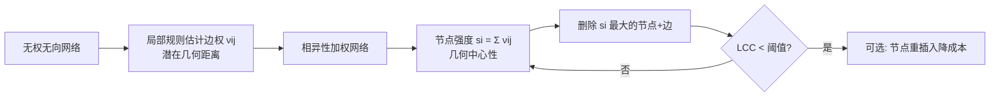

# Latent Geometry-Driven Network Automata for Complex Network Dismantling

**会议**: ICLR 2026  
**OpenReview**: [https://openreview.net/forum?id=yz29QCGVzC](https://openreview.net/forum?id=yz29QCGVzC)  
**代码**: 待确认  
**领域**: 图学习 / 复杂网络 / 网络拆解  
**关键词**: 网络拆解, 潜在几何, 网络元胞自动机, 共同邻居, 鲁棒性工程  

## 一句话总结
本文提出 LGD-NA 框架，用只看局部拓扑的"网络元胞自动机规则"近似复杂网络的潜在几何距离，把节点的几何中心性当作拆解优先级，在 1475 个真实网络上超越所有现有拆解算法（除全局的 NBC 外），并可 GPU 加速、还能反过来用于加固网络鲁棒性。

## 研究背景与动机

**领域现状**：网络拆解（network dismantling）研究"删掉最少的节点把网络打碎"，对评估和改造关键基础设施、生物系统、通信网络的鲁棒性至关重要。该问题本身 NP-hard，因此领域长期依赖启发式近似，公认最强的方法是节点介数中心性（NBC）——按节点位于最短路径上的频率排序删除。

**现有痛点**：(1) **依赖全局信息**——NBC 之类的方法需要完整网络拓扑，计算开销大、难以扩展到大网络；(2) **机器学习方法是黑盒**——GDM、FINDER、CoreGDM 等训练 GNN/RL 预测拆解策略，缺乏可解释性；(3) **验证规模太小**——历史上拆解算法最多只在 57 个真实网络上测过，多数不到十几个，泛化性存疑；(4) **忽视潜在几何**——网络科学已证明复杂网络往往由一个隐藏的几何流形驱动其拓扑与动力学，但拆解领域几乎没人利用这一信息。

**核心矛盾**：最有效的拆解信号（潜在几何中心性）此前只能靠全局、昂贵的方式（如 NBC）估计，而局部、廉价的几何估计器虽然存在（如 RA2 用于双曲嵌入），却从没人验证过它们能否驱动拆解。

**本文目标**：证明潜在几何是拆解的基本原理，并给出一个**无参数、纯局部、可 GPU 加速、可解释**的拆解框架，在性能上逼近 NBC 同时大幅提速，并把这套机制反向用于加固网络。

**核心 idea**（**几何中心性驱动拆解**）：如果两个相连节点各自连着很多互不重叠的邻居，它们在潜在空间里很可能相距很远——这条边因此"连接了网络的两个遥远区域"。一个节点若拥有许多这样的"长程边"，就是把网络黏在一起的关键，优先删除它能高效碎裂网络。这种"远近"完全可以用局部拓扑（共同邻居数）近似，无需任何全局计算或训练。

## 方法详解

### 整体框架
LGD-NA 把拆解拆成"几何估计 → 强度聚合 → 动态删除"三步流水线：先用一个**网络元胞自动机规则**给每条边赋一个表示"潜在几何距离"的权重 $\nu_{ij}$，得到一张相异性加权图；再把每个节点所有邻边权重求和作为节点强度 $s_i$；然后迭代删除强度最高的节点及其边，每步重算强度（动态拆解），直到最大连通分量（LCC）跌破阈值，过程中可选地做节点重插入以降低拆解成本。

### 关键设计

**1. 潜在几何驱动拆解（LGD）：把"删谁"变成"删几何上最居中的节点"** —— 这是论文最上位的原则，也是它区别于所有传统中心性的核心立场。任何能给边赋"有效距离"权重的函数都可以插进来，构造出一张隐藏在可观测拓扑之下的相异性加权图，让拆解过程按节点在潜在流形上的几何中心性来排序。作者借 Muscoloni et al. (2017) 的结论指出，连介数中心性 NBC 本质上也是一个"全局潜在几何估计器"——它近似的正是节点在几何空间中的距离，所以 NBC 之所以是最强拆解器，恰恰因为它（无意中）在做潜在几何驱动拆解。这一观察把"为什么 NBC 有效"和"如何更便宜地复现它"统一到了同一个几何框架下。

**2. 网络元胞自动机 + 节点强度聚合：无参数、纯局部地估计几何中心性** —— 在 LGD 原则下，作者用"网络元胞自动机规则"做局部几何估计器。这类规则只用节点周围的局部拓扑、无需预训练就能给边打分（因此叫"automata"）。基础规则取自 RA2（Repulsion-Attraction rule 2）：
$$\mathrm{RA2}(i,j)=\frac{1+e_i+e_j+e_i\cdot e_j}{1+\mathrm{CN}_{ij}}$$
其中 $\mathrm{CN}_{ij}$ 是 $i,j$ 的共同邻居数，$e_i,e_j$ 是各自的"外部度"（不参与共同邻居交互的邻居数）。分子的排斥项（外部度越大越远）、分母的吸引项（共同邻居越多越近）共同刻画两节点在潜在流形上的相异度。拿到边权 $\nu_{ij}$ 后，节点强度直接求和：
$$s_i=\sum_{j\in N(i)}\nu_{ij}$$
强度高意味着该节点连接了众多遥远且互不重叠的区域，是拆解的优先目标。整个过程没有任何超参数、不需要标注数据，与黑盒 ML 方法形成鲜明对比。

**3. 共同邻居相异性（CND）：把 RA2 砍到只剩分母，反而最好** —— 作者把 RA2 做消融，发现只保留分母这一项就足够：
$$\nu_{ij}\to\mathrm{CND}(i,j)=\frac{1}{1+\mathrm{CN}_{ij}}$$
共同邻居越少，两个相连节点在几何上越远，边权越高。直觉上，拆解任务只需"吸引项"——每次计算种子节点与某邻居的共同邻居，已经隐式排除了不在该邻域内的节点，故 RA2 分子的"排斥项"可以省掉。论文还顺带验证了第三个消融变体 RA2num（只留分子外部度项），表现确实不如 CND。结果是这个极简的"逆共同邻居"规则在所有局部规则里拆解性能最佳，且高度可解释——一个节点的脆弱性直接取决于它的邻居之间彼此共享多少条边。

**4. GPU 加速：把元胞自动机重写成矩阵运算** —— 三种 LGD-NA 变体都被重新表述为邻接矩阵运算以吃满 GPU 并行。共同邻居矩阵 $\mathrm{CN}_{L2}=A\circ(A^2)$（$A^2$ 数所有节点对之间长度为 2 的路径即共同邻居，$\circ$ 为 Hadamard 积保证只在已有边上取值），外部度矩阵 $\mathrm{EL}_2=A\circ(D-\mathrm{CN}_{L2}-A)$。稠密图复杂度 $O(N^3)$、稀疏图 $O(Nm)$。CPU 上矩阵乘受内存带宽与串行限制，而 GPU 数千线程并行使其在大网络上获得数量级提速。

**5. 反向工程：用 CND 的可解释性加固网络鲁棒性** —— 既然 CND 揭示"节点脆弱性 ∝ 其邻居之间共享的边数"，那加固策略就直接对称：找出拆解分数最高的关键节点，给它们尚未相连的邻居之间补边（增加共同邻居）。这把一个攻击工具变成了防御工具，且因机制透明而可控。

## 实验关键数据

### 主实验（ATLAS：1475 个真实网络，32 个复杂系统领域）

| 维度 | LGD-NA 结果 |
|------|------------|
| 验证规模 | 1,475 个真实网络 / 32 领域（此前 SOTA 最多 57 个，多数 < 12 个） |
| 整体排名（mean field rank） | CND/RA2/RA2num 一致**优于所有非潜在几何方法**（含谱 Laplacian 的 GND、ML 的 GDM/CoreGDM/FINDER） |
| 唯一胜过 LGD-NA 的 | 只有 NBC（它本身也是潜在几何估计器，全局版） |
| 局部规则最优者 | **CND**（仅用逆共同邻居）在所有局部元胞自动机规则中拆解最强 |
| 评估指标 | LCC 轨迹的 AUC（越低越好，Simpson 法积分），阈值取原网络 10% |

各领域第二名分布：CND 在 Internet 网络第二，RA2 在生物分子/脑网络第二，RA2num 在隐蔽网络第二；只有 Foodweb（Fitness Centrality）、Infrastructure（GDM）、Social（GND）的第二名不是 LGD-NA。

### 消融实验（RA2 拆项）

| 变体 | 保留项 | 相对效果 |
|------|--------|----------|
| RA2 | 完整（分子排斥 + 分母吸引） | 强，但非最优 |
| **CND** | 仅分母 $1/(1+\mathrm{CN})$ | **局部规则最佳** |
| RA2num | 仅分子（外部度） | 可用，但弱于 CND |

动态拆解（每步重算）始终优于静态变体。

### 关键发现
- **GPU 加速效果**：最大网络上 GPU 版 RA2 比 CPU 版快 **130×**、比 CPU 上的 NBC 快 **63×**；当网络超过 1000 节点或 10 万条边时 GPU 优势显现（最大测到 23000 节点 / 50.7 万边）。NBC 不依赖矩阵乘（靠最短路计数），无法从 GPU 受益，因此在大规模下不实用。
- **极简局部信息够用**：CND 只看"共同邻居"就逼近全局 NBC，说明最小局部拓扑即可有效近似潜在几何。
- **鲁棒性工程**：只对最关键节点的邻居补边，加 1% 边即提升 AUC（鲁棒性）36%–95%，加 10% 边提升 59%–259%；仅加固 top 1% 节点就能无视攻击方法地提升鲁棒性。
- **四个真实场景验证功能性影响**：果蝇连接组（神经元放电率）、恐怖组织网络（指挥官可达率，巴黎/布鲁塞尔袭击网络删 ~5% 即骤降）、航班图（全局效率）、校园接触网（SEIR 疫情最终规模）；加固后功能性鲁棒性最高提升 363%。

## 亮点与洞察
- **统一视角**：把"NBC 为什么最强"重新解释为"它在做全局潜在几何估计"，从而给出一条用局部廉价规则复现其能力的清晰路径——这是概念上的真正贡献，而非单纯刷点。
- **简单到反直觉**：把 SOTA 局部规则砍到只剩"逆共同邻居"一项（CND），反而最好，且完全可解释；这与当前堆 GNN/RL 的趋势背道而驰。
- **攻防对称**：同一个 CND 分数既能指导拆解，又能直接读出"补哪些边能加固"，攻击工具天然变成防御工具。
- **规模与多样性**：1475 个网络 / 32 领域的 ATLAS 是该领域迄今最大最多样的评测，极大增强了结论可信度。

## 局限与展望
- **仍打不过 NBC 的绝对性能**：LGD-NA 的卖点是"逼近 NBC 且远更快/可扩展/可解释"，但在小网络上若不在意时间，NBC 仍是性能天花板。
- **复杂度并非线性**：稠密图 $O(N^3)$、稀疏图 $O(Nm)$，超大稠密网络仍可能吃力，GPU 优势也依赖显存。
- **共同邻居信号的边界**：CND 在某些领域（Foodweb / Infrastructure / Social）第二名让位于其他方法，说明纯共同邻居几何在特定结构（如强社区或层级）上未必最优。
- **双重用途风险**：拆解技术天然可被用于攻击（如疫情传播、恐怖网络通信），作者以"主动给出加固方法"来平衡，但伦理风险客观存在。
- **未来方向**：探索更多局部几何估计器、把潜在几何拆解推广到有向/含权/时序网络，以及与不完整观测下的鲁棒性诊断结合。

## 相关工作与启发
- **潜在几何**（Boguñá, Krioukov, Serrano, Muscoloni & Cannistraci 等）：复杂网络由隐藏几何流形驱动，可解释小世界性、度异质性、聚类、可导航性——本文把"拆解"加入了几何能解释的过程清单。
- **潜在几何估计器 RA1/RA2**（Muscoloni et al. 2017）：原为双曲网络嵌入的预加权策略，本文首次证明它们能驱动拆解。
- **拆解方法谱系**：全局中心性（NBC、Degree、PageRank、Fitness Centrality、DomiRank、Resilience Centrality）、消息传递/解环（BPD、Min-Sum、CoreHD）、谱划分（GND）、影响力（CI、EI）、机器学习（GDM、FINDER、CoreGDM）——本文在统一评测下系统性碾压了这些非几何方法。
- **启发**：当一个"黑盒最强方法"主导某任务时，去问"它到底在估计什么物理量"，往往能找到一个更简单、可解释、可加速的白盒替身——CND 就是这一思路的范例。

## 评分
- **新颖性**: ⭐⭐⭐⭐⭐ —— 把潜在几何引入拆解，并证明极简局部规则（CND）逼近全局 SOTA，概念上有真正洞见而非工程堆砌。
- **实验充分度**: ⭐⭐⭐⭐⭐ —— 1475 网络 / 32 领域的 ATLAS 是该领域迄今最大评测，含消融、GPU 加速、鲁棒性工程、四个真实功能场景，证据链完整。
- **写作质量**: ⭐⭐⭐⭐ —— 逻辑清晰、动机与贡献对应工整，公式与图示充分；个别推导细节需查附录。
- **价值**: ⭐⭐⭐⭐⭐ —— 同时给出高效可扩展的拆解工具和对称的加固方法，对基础设施、生物、安全等领域有直接实用价值。

<!-- RELATED:START -->

## 相关论文

- [\[ICLR 2026\] A Graph Meta-Network for Learning on Kolmogorov–Arnold Networks](a_graph_meta-network_for_learning_on_kolmogorovarnold_networks.md)
- [\[ICLR 2026\] Graphon Cross-Validation: Assessing Models on Network Data](graphon_cross-validation_assessing_models_on_network_data.md)
- [\[ICLR 2026\] Federated Graph-Level Clustering Network with Dual Knowledge Separation](federated_graph-level_clustering_network_with_dual_knowledge_separation.md)
- [\[ICLR 2026\] AdS-GNN - a Conformally Equivariant Graph Neural Network](ads-gnn_-_a_conformally_equivariant_graph_neural_network.md)
- [\[ICLR 2026\] FlowSymm: Physics–Aware, Symmetry–Preserving Graph Attention for Network Flow Completion](flowsymm_physicsaware_symmetrypreserving_graph_attention_for_network_flow_comple.md)

<!-- RELATED:END -->
