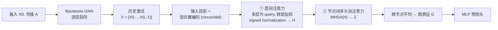

# Learning from Historical Activations in Graph Neural Networks

**会议**: ICLR 2026  
**OpenReview**: [https://openreview.net/forum?id=8SnAGYf2wM](https://openreview.net/forum?id=8SnAGYf2wM)  
**代码**: [https://github.com/YanivDorGalron/HISTOGRAPH](https://github.com/YanivDorGalron/HISTOGRAPH)  
**领域**: 图学习 / 图池化 (Graph Pooling)  
**关键词**: GNN, 图池化, 历史激活, 层间注意力, 过平滑, 自反思  

## 一句话总结
提出 HISTOGRAPH——一个两阶段注意力 readout 层，把 GNN 各层（而非仅最后一层）的"历史激活"当成一条轨迹序列来池化，先做层间注意力再做节点间注意力，在深层 GNN 上显著缓解过平滑并提升图分类性能。

## 研究背景与动机
**领域现状**：GNN 在图分类等任务里离不开 pooling（readout）这一步——把所有节点特征汇总成一个固定长度的图描述子喂给分类器。无论是简单的 mean/sum/max，还是 DiffPool、SAGPool、GMT 这些学习式池化，它们有一个共同假设：**池化的输入是最后一层 GNN 的节点特征**。

**现有痛点**：只用最后一层等于丢掉了前向传播过程中产生的所有中间层激活。但 GNN 的层是有"尺度语义"的——浅层捕捉局部邻域和 motif，深层编码社区、长程依赖等全局结构，类比 CNN 的浅层抓边缘纹理、深层抓物体语义。更糟的是，GNN 越深越容易**过平滑**（over-smoothing）：节点表征趋同到无法区分，深层信息把早期的判别性特征"覆盖"掉了。

**核心矛盾**：节点表征在多层传播中会剧烈漂移，最后一层未必是信息最丰富的那一层；而现有 pooling 只盯着终点，既无法利用多尺度信息，又在深层架构里被过平滑反噬。

**本文目标**：让 GNN 能"回看"自己整条计算轨迹，从所有层的激活里挑出对当前任务最有用的表征来做最终预测，且不改动底层 GNN 架构。

**核心 idea（自反思池化）**：把每个节点跨层的表征 $X = [X^{(0)}, \dots, X^{(L-1)}]$ 视为一条"历史激活序列"，用注意力学习哪一层的激活最该被信任，再用节点间自注意力补全空间上下文——**一个把"计算历史"当作通用归纳偏置的 readout 范式**。

## 方法详解

### 整体框架
HISTOGRAPH 是一个可插拔的最终聚合层，接在任意 backbone GNN 之后，分两阶段：先沿**层维度**做注意力把每个节点的历史压成一个嵌入 $H$，再沿**节点维度**做一次自注意力得到图级表征 $G$。关键在于把两个轴（层演化、空间交互）解耦：层间注意力对每个节点独立、成本 $O(LD)$；节点间注意力只在 readout 处做一次、成本 $O(N^2D)$，从而避免了朴素联合注意力 $O(L^2N^2D)$ 的爆炸开销。

### 关键设计

**1. 把历史激活当序列：层位置编码 + 末层做 query**  
模型先把各层激活通过线性层 $X' = \mathrm{Emb}_{hist}(X) \in \mathbb{R}^{N\times L \times D}$ 投到统一维度（处理各层维度不一致），再像 Transformer 一样加固定的正弦层位置编码 $P_{l,2k} = \sin(l/10000^{2k/D})$ 来编码"第几层"这个顺序信息。层间注意力的精妙之处在于 query 的选取：**只用最后一层嵌入做 query** $Q = \tilde{X}_{L-1}W^Q$，让"最终状态"去回看整条历史 $K=\tilde{X}W^K$、$V=\tilde{X}$。这天然带来一个朝向终态的 recency bias——以当前最成熟的表征为锚点，判断历史上哪些中间状态对它最有参考价值。

**2. Signed normalization 取代 softmax：让层加权能做"减法"**  
这是全文最关键、消融里掉分最狠的设计。算出注意力打分 $c = \mathrm{Average}(QK^\top/\sqrt{D}) \in \mathbb{R}^{1\times L}$ 后，作者**不用 softmax**，而是用除以总和的归一化 $\alpha_l = c_l / \sum_{l'} c_{l'}$，于是聚合 $H = \sum_l \alpha_l \tilde{X}_l$ 中的权重可以为负、$\sum_l \alpha_l = 1$。为什么重要？softmax 强制非负凸组合，只能做"加权平均"这种低通滤波；而允许带符号的权重就等价于一个**有符号系数的 FIR 滤波器**：取 $\alpha_l = 1/L$ 是低通（均值），取 $\alpha_l = \delta_{l,L-1}-\delta_{l,L-2}$ 是高通（一阶差分），学出来则是任意 FIR。这把 readout 直接变成对"GNN 计算轨迹"的可学习滤波器，能像动态系统里的有限差分一样表达层与层之间的"加/减"关系——论文用 barbell 图的高通滤波实验（图 3）展示 GCN 失败而 HISTOGRAPH 成功。它也是缓解过平滑的理论支点（命题 1）：只要早期层 $l' \le L_0$ 上 $\alpha_{l'} \neq 0$，即便深层全部塌缩到无法区分，最终嵌入 $h_u = \sum_l \alpha_l x_u^{(l)}$ 仍能保留早期判别性，使 $\|h_u - h_v\| > 0$。

**3. 单次节点间自注意力做空间聚合，不参与消息传递**  
拿到逐节点的历史聚合 $H$ 后，再补全空间上下文：$Z = \mathrm{MHSA}(H,H,H)$，可选残差和 LayerNorm，最后跨节点平均 $G = \mathrm{Average}(Z)$。这里有意省略空间位置编码以保持置换不变性。关键取舍在于"**只在 readout 处做一次**"：节点间自注意力天然会拉平节点表征（这正是过平滑的来源），所以作者拒绝在每个消息传递层都用它，只在最终聚合时用一次——既补上了全局节点交互，又不会反过来加剧前向过程中的过平滑，代价只是单次 $O(N^2D)$，与一层 graph transformer 同量级。

**4. 双模式部署：端到端 vs 冻结 backbone 做后处理**  
同一个 HISTOGRAPH 头支持两种用法。端到端联合训练会反向丰富中间表征；而**冻结预训练 backbone、只训 HISTOGRAPH 头**（FT 模式）是个工程上很香的卖点：一次前向把每图的 $N\times L\times D$ 激活缓存下来，跳过 backbone 梯度，省掉 $O(L(ED+ND^2))$ 的反传，只在轻量头上反传 $O(N(L+N)D)$。在低资源 / few-shot / 大数据微调场景下，避免了对 $L$ 层 GNN 反复 backprop 的高昂代价。

## 实验关键数据

### 主实验：图分类
TU 数据集（5 层 GIN backbone）上 7 个任务拿下 5 个 SOTA；OGB 分子性质预测（3 层 GCN backbone）4 个里拿下 3 个：

| 数据集 | 第二名(方法) | HISTOGRAPH | 提升 |
|---|---|---|---|
| IMDB-B (Acc%) | 80.9 (DKEPool) | **87.2** | +6.3 |
| IMDB-M (Acc%) | 56.3 (DKEPool) | **61.9** | +5.6 |
| PROTEINS (Acc%) | 81.2 (DKEPool) | **97.8** | +16.6 |
| MUTAG (Acc%) | 97.3 (DKEPool) | **97.9** | +0.6 |
| NCI1 (Acc%) | 85.4 (DKEPool) | **85.9** | +0.5 |
| MOLBBBP (AUC%) | 69.73 (DKEPool) | **72.02** | +2.29 |
| TOXCAST (AUC%) | 65.44 (GMT) | **66.35** | +0.91 |

PROTEINS 上 +16.6% 的巨大提升最亮眼；PTC（79.1 vs 79.6 DKEPool）、RDT-B、MOLHIV（77.81 vs 78.65）略输但仍居前三。

### 缓解过平滑：深度节点分类
GCN 加 HISTOGRAPH 后在加深时几乎不退化（准确率%）：

| 数据集 | 方法 | 2层 | 8层 | 32层 | 64层 |
|---|---|---|---|---|---|
| Cora | GCN | 81.1 | 69.5 | 60.3 | 28.7 |
| Cora | +HISTOGRAPH | 81.3 | **80.7** | **80.6** | **77.5** |
| Citeseer | GCN | 70.8 | 30.2 | 25.0 | 20.0 |
| Citeseer | +HISTOGRAPH | 70.9 | **69.9** | **67.2** | **63.4** |
| Pubmed | GCN | 79.0 | 61.2 | 22.4 | 35.3 |
| Pubmed | +HISTOGRAPH | 78.9 | **78.6** | **80.0** | **79.3** |

64 层时 GCN 在 Cora 上崩到 28.7%，而 HISTOGRAPH 仍有 77.5%。

### 消融实验（PROTEINS，去掉一个组件）

| 变体 | Acc(%) | Std |
|---|---|---|
| w/o Division by Sum（去 signed norm，换回 softmax 式） | 74.45 | 6.28 |
| w/o Layer-wise Attention | 78.61 | 4.82 |
| w/o Node-wise Attention | 80.78 | 7.71 |
| **HISTOGRAPH (完整)** | **97.80** | **0.40** |

### 关键发现
- **signed normalization 是命门**：去掉它掉到 74.45%（掉 23 个点），印证"允许负权重做高通滤波"不是花活而是核心。
- **冻结后处理 FT 模式常胜过端到端**：IMDB-M 上 FT 把 MeanPool 的 54.7% 提到 67.3%，反超端到端的 61.9%；推理几乎零额外开销，深层时还比 GMT 快很多。
- 可视化（图 2）显示模型确实把显著权重放在**早期层 + 最后一层**，形成任务自适应的"局部+全局"profile。

## 亮点与洞察
- **视角新颖**：把 GNN 的逐层前向重新解读为一条"历史激活轨迹"，pooling 从"看终点"变成"看整条路径"，这个"自反思"框架是干净且通用的归纳偏置（图分类、节点分类、链路预测都能用）。
- **signed normalization 是点睛之笔**：用一个看似微小的"除以和而非 softmax"改动，把 readout 升级成可学习的有符号 FIR 滤波器，既有动态系统/信号处理的理论解释（低通/高通），又是消融里最不可或缺的组件。
- **过平滑被顺手解决**：缓解过平滑往往要改架构或加正则，这里只是"在 readout 保留早期层"就拿到命题 1 的理论保证和 64 层稳定的实验，思路朴素却有效。
- **部署友好**：冻结 backbone 只训头的后处理模式，给已有预训练 GNN 提供了近乎零成本的免费午餐。

## 局限与展望
- **节点间注意力的 $O(N^2D)$** 限制了它只适合中小图，大图需 Appendix G 的额外缩放策略，方法本身对大规模图不直接友好。
- **PROTEINS 上 +16.6% 的异常增益**值得警惕：97.8% 远超所有 baseline，可能与该数据集特性强相关，是否过拟合到某种 readout 捷径需要更谨慎的解读。
- 历史激活需缓存整个 $N\times L\times D$ 张量，深层 + 大 batch 下内存压力不小，尤其端到端模式。
- 对 backbone 的依赖：方法不改 GNN 本身，意味着 backbone 太弱时历史里也榨不出更多信息。

## 相关工作与启发
- **vs. JKNet（Jumping Knowledge）**：同样用多层信息，但 JK 只做拼接/max/LSTM 式简单组合，没有把层当序列做注意力，更没有 signed filtering。HISTOGRAPH 在表 1 里是唯一同时用上"中间表征 + 结构信息 + 层-节点联合建模"的方法。
- **vs. 注意力池化（GMT、Set2Set）**：它们在最后一层特征上做注意力，HISTOGRAPH 把注意力轴扩展到"层"维度，且更快（深层时显著优于 GMT）。
- **vs. 状态空间 / ARMA on graphs（Ceni 2025, Eliasof 2025）**：那些工作关注训练稳定性、把节点特征序列做动态系统建模，但不显式建模"跨层内部轨迹"作为 readout 信号——本文恰好把这条计算路径变成可学习的滤波对象。
- **启发**："看模型自己的中间激活"这个思路（self-reflection on activation history）可迁移到 CNN/Transformer 的多层特征融合、以及 deep supervision、early-exit 等场景。signed normalization 替代 softmax 来表达减法关系，也是一个可复用的小技巧。

## 评分
- **新颖性**: ⭐⭐⭐⭐ — "历史激活 + 两阶段注意力 + signed FIR 滤波"的组合视角清新，把过平滑缓解和多尺度池化统一在一个 readout 范式里，虽然每个零件（层注意力、Transformer 池化）单看都不算全新，但组合与解释很有洞见。
- **实验充分度**: ⭐⭐⭐⭐ — 覆盖 TU + OGB + 节点分类 + 链路预测，深度扫描（2→64 层）和后处理模式都做了，消融清晰；扣分在 PROTEINS 异常增益缺乏更深入的归因，部分对比依赖附录。
- **写作质量**: ⭐⭐⭐⭐ — 动机—方法—理论（命题 1 + 滤波器解释）—实验逻辑链完整，图 1/2/3 直观，signed normalization 的信号处理类比讲得很清楚。
- **价值**: ⭐⭐⭐⭐ — 即插即用、不改 backbone、还有冻结后处理这种低成本变体，对深层 GNN 和已有预训练模型都有实用吸引力，过平滑缓解的理论保证也有参考价值。

<!-- RELATED:START -->

## 相关论文

- [\[ICLR 2026\] Canonical Tree Cover Neural Networks for Expressive and Invariant Graph Learning](canonical_tree_cover_neural_networks_for_expressive_and_invariant_graph_learning.md)
- [\[ICLR 2026\] Are We Measuring Oversmoothing in Graph Neural Networks Correctly?](are_we_measuring_oversmoothing_in_graph_neural_networks_correctly.md)
- [\[ICLR 2026\] A Graph Meta-Network for Learning on Kolmogorov–Arnold Networks](a_graph_meta-network_for_learning_on_kolmogorovarnold_networks.md)
- [\[ICLR 2026\] WATS: Wavelet-Aware Temperature Scaling for Reliable Graph Neural Networks](wats_wavelet-aware_temperature_scaling_for_reliable_graph_neural_networks.md)
- [\[ICLR 2026\] Cooperative Sheaf Neural Networks](cooperative_sheaf_neural_networks.md)

<!-- RELATED:END -->
