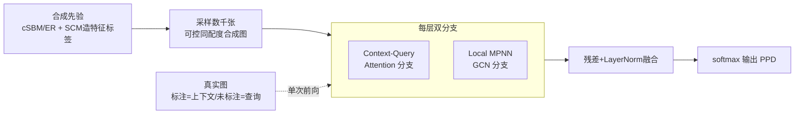

# Learning Posterior Predictive Distributions for Node Classification from Synthetic Graph Priors

**会议**: ICLR 2026  
**OpenReview**: [https://openreview.net/forum?id=FmxRzlu0rT](https://openreview.net/forum?id=FmxRzlu0rT)  
**代码**: [https://github.com/jeongwhanchoi/NodePFN](https://github.com/jeongwhanchoi/NodePFN)  
**领域**: 图学习 / 图基础模型 / 节点分类  
**关键词**: Prior-Fitted Networks, 节点分类, 合成图先验, 上下文学习, 后验预测分布, 图基础模型  

## 一句话总结
把表格领域的 Prior-Fitted Network（PFN）范式搬到图上，只在数千张由可控先验生成的合成图上预训练一个模型 NodePFN，就能对任意真实图做免训练、单次前向的通用节点分类，在 23 个 benchmark 上拿到 71.27% 平均准确率。

## 研究背景与动机
**领域现状**：GNN（GCN/GAT/GraphSAGE）在节点分类上很强，但它有个写死的工作方式——每来一张新图就得用这张图的标注节点重新训练一个模型。

**现有痛点**：真实世界的图差异极大——同配性（homophily）水平、社区结构、特征分布、度分布各不相同。一个在 Cora 上训得很好的 GNN 换到异配图 Wisconsin 上就崩，根本谈不上"一个模型通吃"。近期把 LLM 搬到图上的工作（GraphGPT、OFA 等）依赖文本属性，擅长语义而非拓扑结构；GraphAny 虽是 inductive 框架，但仍需在特定源数据集上训练，性能强烈依赖训练集的选择。

**核心矛盾**：LLM 靠"海量多样数据预训练 → 上下文学习"实现了免微调泛化，可图领域既没有这样的海量统一语料，又被结构异质性卡住，迟迟没有真正"一次预训练、处处可用"的节点分类基础模型。

**本文目标**：训练**单个**预训练模型，对任意图免训练、单前向地预测查询节点标签，且对同配/异配图都稳。

**核心 idea**：**[合成先验替代真实数据]** 借鉴 TabPFN——既然 PFN 能在精心设计的合成先验上学到逼近后验预测分布（PPD）的能力，那就为图设计一套可控合成先验（控同配度、社区结构、特征-标签关系），让模型在这些合成图上学会"从标注上下文节点抽取规律并应用到查询节点"，从而把节点分类的普适规律从合成数据里学出来，而非依赖任何真实训练图。

## 方法详解

### 整体框架
NodePFN 把节点分类重写为"在线学 PPD"问题：训练时从先验 $p(\mathcal{G})$ 采样合成图，把节点划成上下文集 $\mathcal{D}_{train}$（带标签）和查询集 $\mathcal{D}_{test}$（不带标签），学一个 $f_\theta:(x_{test},\mathcal{D}_{train},\mathcal{G})\mapsto p(y_{test}\mid \mathcal{D}_{train},\mathcal{G})$，用交叉熵逼近真实 PPD；推理时直接把真实图的"标注节点当上下文、未标注节点当查询"喂进去，一次前向出预测，无需任何梯度更新。整条管线由两块拼成：**合成图先验生成器**（造训练数据）+ **双分支层**（注意力做上下文学习 + MPNN 做局部拓扑）。

### 关键设计

**1. 合成图先验：用因果模型造特征-标签、用随机图模型造结构**　训练数据完全由先验合成，这是整套方法成立的根基。特征与标签由结构因果模型（SCM）生成——为每张图采样一个随机 MLP 并随机剪边变成 DAG，让高斯噪声穿过网络，中间层输出当节点特征 $X$、后层输出当标签 $y$，从而制造复杂非线性的特征-标签依赖。结构侧用两种随机图：cSBM 通过类内/类间连边概率 $p_{in},p_{out}$ 控制社区与同配度 $h=p_{in}/(p_{in}+p_{out})$，作者把 $h$ 从 0.1 扫到 0.9，覆盖强同配到强异配；ER 图则提供无社区结构的"非结构化基线"，逼模型学到社区模式之外的规律。关键巧思是：对 cSBM，SCM 生成的标签反过来决定社区归属，社区再经 $h$ 控制连边——特征、标签、结构因此被串成一条因果链，而非各自独立采样。

**2. 双分支层：注意力学上下文 + MPNN 学拓扑**　每层并行跑两条互补支路。注意力支路沿用 PFN 的非对称设计：上下文节点 $H_{train}$ 初始表征里同时编码特征和标签，查询节点 $H_{test}$ 只编码特征；训练节点之间做自注意力建立标签分布的整体认识 $H^{(\ell+1,attn)}_{train}=\mathrm{SelfAttention}(H^{(\ell)}_{train})$，查询节点则对训练节点做交叉注意力 $H^{(\ell+1,attn)}_{test}=\mathrm{CrossAttention}(H^{(\ell)}_{test},H^{(\ell)}_{train},H^{(\ell)}_{train})$——这种不对称保证查询节点能借用训练信息，又互不干扰彼此预测。MPNN 支路则用 GCN 在对称归一化邻接 $\tilde A=D^{-1/2}AD^{-1/2}$ 上聚合邻域 $H^{(\ell+1,mpnn)}=\mathrm{MPNN}(H^{(\ell)},\tilde A)$，专门抓与 train/test 划分无关的局部拓扑。两支路与输入经残差融合 $H^{(\ell+1)}=\mathrm{LayerNorm}(H^{(\ell)}+H^{(\ell+1,attn)}+H^{(\ell+1,mpnn)})$，让模型同时从标注样本和图结构两条线学习。

**3. 训练即逼近 PPD、推理即单次前向**　训练目标是在合成先验上最小化查询节点的期望交叉熵 $\mathcal{L}(\theta)=\mathbb{E}_{D\sim p(D)}[-\frac{1}{|V_{test}|}\sum_{v\in V_{test}}\sum_c y_{v,c}\log f_\theta(y_{v,c}\mid x_v,\mathcal{D}_{train},\mathcal{G})]$，每张合成图随机重划上下文/查询，使模型学到的不是某张图的规律而是"如何从上下文学规律"。推理时对真实图先做轻量预处理，过 $L$ 层后用 $f_\theta(y_v\mid\cdots)=\mathrm{softmax}(W_{out}h_v^{(L)})$ 直接出每个查询节点的标签分布——因为训练阶段已逼近真实 PPD，这个输出自带校准的不确定性估计，且全程零梯度更新。作者一共预训练在约 25 万张合成图上，这笔计算开销被后续所有推理任务**摊销**（amortized），换来对新图的零成本泛化。

## 实验关键数据

### 主实验表格（23 个真实 benchmark，准确率 / 平均排名）

| 类型 | MLP | GCN | GAT | GraphAny(Cora) | GraphAny(Wisc.) | **NodePFN** |
|---|---|---|---|---|---|---|
| 同配图 平均Acc | 56.43 | 73.05 | 74.39 | 71.45 | 70.86 | **77.39** |
| 同配图 平均Rank | 7.62 | 4.92 | 4.54 | 4.15 | 4.31 | **1.69** |
| 异配图 平均Acc | 58.17 | 58.84 | 59.11 | 60.56 | 61.62 | **65.14** |
| 异配图 平均Rank | 7.20 | 6.80 | 6.60 | 4.60 | 4.50 | **1.70** |
| **总体 平均Acc** | 57.30 | 66.63 | 67.67 | 66.00 | 66.24 | **71.27** |
| **总体 平均Rank** | 7.41 | 5.86 | 5.57 | 4.38 | 4.40 | **1.70** |

单个预训练 NodePFN 在同配/异配两类图上都拿第一，平均排名 1.70；GraphAny 需逐数据集训练且对训练集选择敏感（Cora 版强在同配、弱在异配），NodePFN 则两类都稳。

### 训练免训练方法对比 + 消融实验表格

| Training-free | Cora | Pubmed | Wisconsin | Texas |
|---|---|---|---|---|
| SGC | 78.20 | 72.98 | 57.64 | 46.03 |
| LabelProp | 60.30 | 63.44 | 16.08 | 23.53 |
| **NodePFN** | **82.06** | **78.00** | **81.18** | **76.22** |

| 消融 | Cora | Wisconsin | Tolokers |
|---|---|---|---|
| w/o ER | 81.26 | 78.82 | 77.30 |
| w/o cSBM | 80.62 | 80.39 | 77.18 |
| TabPFN（去掉图先验+MPNN） | 53.10 | 72.94 | 78.18 |
| NodePFN-L6（29.01M→14.80M） | 53.10 | 72.94 | 78.00 |
| NodePFN-Seq（串行而非并行） | 80.64 | 78.82 | 77.88 |
| **NodePFN（完整）** | **82.06** | **81.18** | **78.61** |

### 关键发现
- **合成 Cora 上同配度全扫描**：MLP 全程平稳、GCN/GAT 在低同配区暴跌，NodePFN 全程最优且无骤降，证明合成先验赋予了对同配/异配的稳健性。
- **退化为 TabPFN 即崩**：去掉图先验和 MPNN 后 NodePFN 退化成 TabPFN，准确率均值从 71.2% 掉到 55.5% 且方差更大——验证"图感知建模"相对"把节点当独立表格行"的必要性。
- **先验冗余但互补**：去掉 ER 或 cSBM 单项性能仅轻微下降，说明两种先验对不同图特性各有适配、删一个另一个能兜底；但容量不能省，L6 减半参数在强同配 Cora 上大跌。
- **结构角色分类**：在仅靠拓扑（特征为 one-hot ID）的 Airport 数据上，NodePFN 超过 Node2Vec/LINE 等结构嵌入专门方法，说明它真学到了可迁移的结构模式。

## 亮点与洞察
- **范式迁移干净利落**：把"合成先验 + 单前向逼近 PPD"的 TabPFN 思路完整搬到图，是已知第一个把 PFN 范式扩到图的工作，且不依赖任何 LLM 或文本属性，对任意数值特征都work。
- **先验设计是真正的护城河**：把 SCM（造特征-标签因果链）和 cSBM（造可控同配度结构）串成因果链而非独立采样，是模型能覆盖真实图多样性的关键，比单纯堆数据更聪明。
- **双分支各司其职**：非对称注意力负责"从上下文学"、GCN 负责"读局部拓扑"，二者残差融合，把上下文学习和图结构两件事解耦又合流。
- **摊销视角说服力强**：25 万张合成图的预训练开销一次性付清，之后对所有新图零成本，把"通用 vs 专用"的成本账算清楚了。

## 局限与展望
- **类别数和特征维写死**：当前固定最大类别数（实测到 20 类）和特征维度，超出范围需重新设计，离真正"任意图"还有距离。
- **注意力二次复杂度**：上下文-查询注意力是 $O(n^2)$，大规模图上吃不消，缺少对超大图的扩展方案。
- **预训练成本高**：25 万张合成图的预训练对算力要求不低，复现门槛偏高（虽然作者论证可摊销）。
- **个别异配数据未夺冠**：在 Questions、Amazon-Ratings 等少数异配图上并非最好，先验覆盖仍有盲区。

## 相关工作与启发
- **PFN 谱系**：M\u00fcller 等提出 PFN 并证明 Transformer 在先验任务上可逼近 PPD，TabPFN 把它推到小表格 SOTA，本文是其"图版"；TabPFN-GN 走的是把图转成表格特征再喂 TabPFN，作者实验显示这种特征工程在异配图上吃亏，反衬出原生图感知建模的价值。
- **图基础模型**：GraphGPT/LLAGA/OFA 等靠 LLM 编码文本属性做零样本，依赖文本；GraphAny 是 inductive 但仍需源数据训练。NodePFN 给出"无 LLM、无文本、无真实训练图"的第三条路。
- **启发**：合成先验 + 上下文学习这套组合拳，对任何"领域数据稀缺且异质性强"的结构化任务（如分子、时空图、知识图谱）都值得照搬——核心是把"领域多样性"显式编码进可控的先验采样器里。

## 评分
- **新颖性**: ⭐⭐⭐⭐⭐ 首个把 PFN 范式扩到图、用合成先验实现免训练通用节点分类，路线清晰且有概念突破。
- **实验充分度**: ⭐⭐⭐⭐ 23 benchmark + 同配/异配分层 + 训练免训练对比 + 结构角色 + 充分消融（退化为 TabPFN、参数减半、串/并行），覆盖到位；大规模图缺位。
- **写作质量**: ⭐⭐⭐⭐ 动机—方法—实验逻辑顺畅，图 1/图 3 清楚交代范式差异和架构，公式与 RQ 组织清晰。
- **价值**: ⭐⭐⭐⭐ 为图基础模型提供了不依赖 LLM/文本的新范式，单模型通吃同配异配，实用与启发兼具；类别/维度写死和复杂度限制了即时落地。

<!-- RELATED:START -->

## 相关论文

- [\[AAAI 2026\] Posterior Label Smoothing for Node Classification](../../AAAI2026/graph_learning/posterior_label_smoothing_for_node_classification.md)
- [\[ICLR 2026\] Forest-Based Graph Learning for Semi-Supervised Node Classification](forest-based_graph_learning_for_semi-supervised_node_classification.md)
- [\[ICLR 2026\] Low-Rank Few-Shot Node Classification by Node-Level Graph Diffusion](low-rank_few-shot_node_classification_by_node-level_graph_diffusion.md)
- [\[ICLR 2026\] Scaling Knowledge Graph Construction through Synthetic Data Generation and Distillation](scaling_knowledge_graph_construction_through_synthetic_data_generation_and_disti.md)
- [\[ICLR 2026\] Glance for Context: Learning When to Leverage LLMs for Node-Aware GNN-LLM Fusion](glance_for_context_learning_when_to_leverage_llms_for_node-aware_gnn-llm_fusion.md)

<!-- RELATED:END -->
