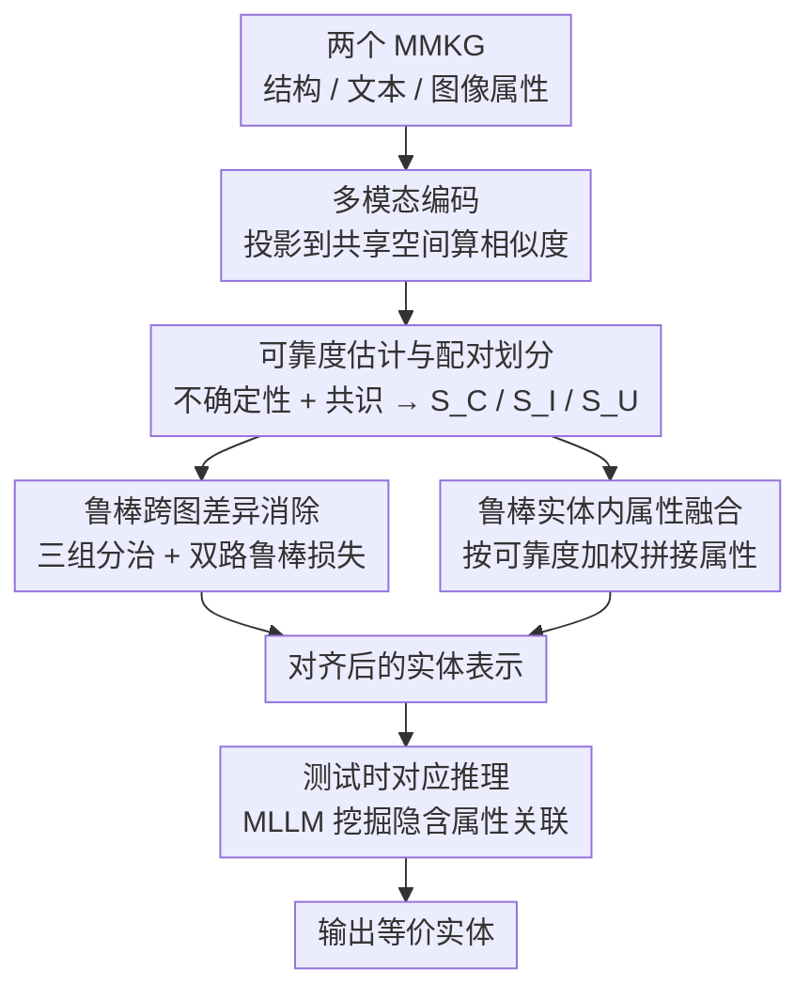

# Learning with Dual-level Noisy Correspondence for Multi-modal Entity Alignment

**会议**: ICLR 2026  
**OpenReview**: [https://openreview.net/forum?id=mytIKuRsSE](https://openreview.net/forum?id=mytIKuRsSE)  
**代码**: https://github.com/XLearning-SCU/2026-ICLR-RULE  
**领域**: 多模态知识图谱 / 实体对齐 / 噪声标注鲁棒学习  
**关键词**: 多模态实体对齐, 噪声对应, 不确定性, 共识, 测试时推理

## 一句话总结
针对多模态知识图谱实体对齐中普遍存在的"双层噪声对应"（实体-属性层 + 跨图层），本文提出 RULE 框架：用"不确定性 + 共识"两条准则估计每个对应关系的可靠度，据此在属性融合和跨图对齐时抑制噪声，并在测试时用 MLLM 推理挖掘隐含的属性关联，在五个基准上平均 H@1 比第二名高出 5 个点以上。

## 研究背景与动机

**领域现状**：多模态实体对齐（Multi-Modal Entity Alignment, MMEA）的目标是在两个异构多模态知识图谱（MMKG）之间找出指向同一现实概念的等价实体。每个实体带有结构三元组、文本描述、图像等多种模态属性。主流做法是两阶段流水线：先按"实体-属性对应"做模态内属性融合得到统一实体表示，再用对比学习按"实体-实体 / 属性-属性对应"消除跨图差异。

**现有痛点**：这套流水线默认所有对应关系（标注）都是完美无误的。但 MMKG 的构建依赖专家标注，必然出错——比如徐锦江的图像因长相相似被错误关联到 Jason Momoa（实体-属性层错配，intra-entity NC）；又比如电影实体"史密斯夫妇"被错配到现实中的威尔·史密斯夫妇（跨图层错配，inter-graph NC）。据作者在附录的统计，真实基准里这种噪声占比惊人（ICEWS 基准超过 50%）。

**核心矛盾**：噪声同时污染两个层级——既破坏实体内的属性融合（把错误属性也融进实体表示），又误导跨图对齐（让模型把不该对齐的实体拉近）。作者把这个问题正式命名为 **双层噪声对应（Dual-level Noisy Correspondence, DNC）**。现有方法没有任何机制区分对应关系的可靠程度，于是在 DNC 下性能大幅下降。

**本文目标**：让 MMEA 在 DNC 下依然鲁棒，需要回答三个子问题：怎样判断一个对应关系可不可信？训练时如何根据可信度区别对待干净与噪声样本？测试时如何避免"看着不像、实则等价"的属性被忽略？

**切入角度**：作者观察到单一信号不够——光看"不确定性低"不能保证对应正确（论文用 Theorem 1 证明），还得看标注对应是否得到属性间的"共识"支持。于是用两条互补准则联合判断可靠度。

**核心 idea**：用"不确定性 + 共识"两条准则给每个对应关系打可靠度分，据此在属性融合时降权噪声属性、在跨图对齐时剔除/精炼噪声对，并额外在测试时用 MLLM 做属性关联推理——即用可靠度估计代替"假设标注全对"。

## 方法详解

### 整体框架
RULE（dually RobUst LEarning）解决的是"标注有噪声时如何稳健地对齐两个多模态知识图谱"。整体可以看成"先评分、再分组、然后训练时双路抑噪、最后测试时补救"四步走：把两图属性投影到共享空间算跨图相似度 → 用不确定性和共识估计每个跨图对应的可靠度并把对划成三组（干净 $S_C$ / 低共识 $S_I$ / 高不确定 $S_U$）→ 用可靠度同时驱动"鲁棒跨图差异消除"和"鲁棒实体内属性融合"两个训练模块 → 推理阶段再用 MLLM 挖掘隐含属性关联修正相似度。

### 关键设计

**1. 可靠度估计：用"不确定性 + 共识"两条准则联合打分**

这一步针对的痛点是：现有方法把所有标注对应一视同仁，无法识别哪些是噪声。RULE 给每个对应（以实体-实体对 $(x_i, \tilde{x}_j)$ 为例）算一个可靠度 $w_i = (1-u_i)\gamma + c_i(1-\gamma)$，其中 $\gamma$ 固定为 0.5。两个分量互补：

- **不确定性 $u_i$** 借鉴 Dempster-Shafer 证据理论。先把实体对的相似度转成证据 $e_{ij} = \exp(\tanh(s_{ij}/\tau))$，关联到 Dirichlet 分布参数 $\alpha_{ij} = e_{ij}+1$，则不确定性 $u_i = \tilde{N}/Q_i$（$Q_i = \sum_j \alpha_{ij}$ 是 Dirichlet 强度）。直觉是：若一个实体在对面图里找不到任何能匹配的实体，证据就少、$Q_i$ 小、不确定性高——这正是噪声对应的特征。
- **共识 $c_i$** 是为了堵住不确定性的漏洞。论文用 Theorem 1 证明"低不确定性不代表最高置信被分给了标注的那个对应"，即 $u_i$ 低 $\not\Rightarrow \arg\max b_i = \arg\max y_i$。于是定义共识 $c_i = \max(0, s_i \cdot y_i)$，衡量标注对应是否真得到相似度支持。共识低 = 标注虽指向某实体、但相似度并不认账 = 可疑。

两条准则一个看"证据够不够"、一个看"证据指向对不对"，缺一不可。

**2. 边际贡献的共识估计：测试时没有标注 $y_i$ 怎么办**

共识公式里要用到标注对应 $y_i$，但推理时拿不到。RULE 用一个基于"边际贡献"的贪心策略来估计正确对应。某属性 $x_i^m$ 的边际贡献定义为 $\Delta = v(\pi \cup \{m\}) - v(\pi)$，其中价值函数取相似度均值的最大值 $v(\pi) = \max(\frac{1}{|\pi|}\sum_{j\in\pi} s_i^j)$。借香农"信息的本质是消除不确定性"的思想，作者假设：若属性 $x_i^m$ 与实体正确关联则 $\Delta \geq 0$，无关则 $\Delta < 0$。于是从初始子集 $\pi_0$（$|\pi_0| = \lfloor M/2 \rfloor + 1$）出发，不断纳入能带来正边际贡献的属性，得到 $\pi^*$，再用 $\hat{y}_i = \text{one-hot}(\arg\max(\frac{1}{|\pi^*|}\sum_{m\in\pi^*} s_i^m))$ 估计对应。这样测试时也能算共识。

**3. 三组配对划分：把跨图对应分成干净 / 低共识 / 高不确定**

有了 $u_i$ 和 $c_i$，对所有 $y_{ij}=1$ 的跨图对做三分：高不确定 $S_U = \{u_i > \beta_u\}$、低共识 $S_I = \{u_i \leq \beta_u,\ c_i < \beta_c\}$、干净 $S_C = \{u_i \leq \beta_u,\ c_i \geq \beta_c\}$。两个阈值不是手调，而是自适应确定：$\beta_u = \min(u_{TP}, 1-\beta)$、$\beta_c = \max(\beta, c_{TP})$，其中 $u_{TP}, c_{TP}$ 由真正例集合 $S_{TP}$（相似度 $\arg\max$ 与标注 $\arg\max$ 一致的对）统计得到。这套划分是后续分治训练的依据。

**4. 鲁棒跨图差异消除（DRL）：三组分治 + 双路鲁棒损失**

针对三组采用不同策略实现抗噪。整体目标 $L = L_{DR} + \lambda L_{Reg}$。对实体级和属性级都施加双路鲁棒损失：$S_U$ 的对因高不确定直接排除出优化（指示函数 $I(i \notin S_U)$）；$S_I$ 的对因低共识不能当真，用 $\hat{y}_i = c_i y_i + (1-c_i)\text{Softmax}(s_i)$ 做软精炼；$S_C$ 的对直接用标注 $y_i$。鲁棒损失本身是对 Dirichlet 分布积分的期望平方误差 $L_{DR}(\alpha_i, \hat{y}_i) = I(i\notin S_U)\int \|\hat{y}_i - p_i\|_2^2 D(p_i|\alpha_i)dp_i$，其上界正比于 $Q_i$（Theorem 2），从而在累积证据有限时防止过度优化。正则项 $L_{Reg}$ 用 KL 散度把未关联对的证据压向均匀先验，确保不该对齐的对产出有限证据。

**5. 鲁棒实体内属性融合（DRF）：按可靠度加权拼接属性**

这一步对付实体-属性层噪声。作者论证：对于正确配对的实体，属性-属性对应错，当且仅当其实体-属性对应错——所以跨图可靠度 $w_i^m$ 恰好能用来识别不可靠的实体内属性。融合时不再等权，而是 $z_i = \oplus_{m\in M}(w_i^m \cdot z_i^m)$（$\oplus$ 是拼接），可靠度高的属性被强调、低的被削弱，避免把错配属性（如错误图像）融进实体表示。

**6. 测试时对应推理（TTR）：用 MLLM 挖掘"看着不像、实则等价"的属性关联**

这是论文强调的少有的"测试时鲁棒性"设计。问题在于：表面相似的属性可能阻碍等价实体被识别，而隐含关联（如足球运动员 C 罗与其祖国之间的联系）常被忽略。TTR 让 MLLM 对属性做深度推理，输出修正后的相似度 $\hat{s}_i = \sum_{m\in M} \hat{w}_i^m \cdot \hat{s}_i^m$，其中 $\hat{s}_i^m$ 是 MLLM 给出的第 $m$ 个属性相似度、$\hat{w}_i^m$ 是对应可靠度权重。这样推理时既挖出隐含的属性-属性连接，又用可靠度抑制实体内噪声，提升等价实体识别精度。

### 损失函数 / 训练策略
总损失 $L = L_{DR} + \lambda L_{Reg}$：$L_{DR}$ 是实体级与属性级双路鲁棒损失之和（基于 Dirichlet 分布的期望平方误差，按三组分治），$L_{Reg}$ 是惩罚未关联对证据的 KL 正则项，$\lambda$ 为权衡系数。可靠度平衡系数 $\gamma=0.5$，阈值 $\beta_u, \beta_c$ 由真正例集合自适应统计而非手调。

## 实验关键数据

### 主实验
在五个基准上与七个 SOTA 比较。下表为"固有 DNC"（Inherent DNC，不额外注入噪声）设定下的平均结果与代表性单基准：

| 设定 | 方法 | ICEWS-WIKI H@1 | ICEWS-YAGO H@1 | DBP15K ZH-EN H@1 | 平均 |
|------|------|------|------|------|------|
| Inherent DNC | MEAformer | 53.5 | 35.0 | 82.4 | 67.0 |
| Inherent DNC | PMF（第二名） | 52.6 | 38.3 | 83.9 | 68.6 |
| Inherent DNC | **RULE（本文）** | **64.2** | **48.8** | **85.6** | **73.8** |

RULE 平均 H@1 达 73.8，比第二名 PMF 高 5.2 个点；在噪声最重的 ICEWS-WIKI / ICEWS-YAGO 上分别领先约 11.6 / 10.5 个点，说明对纯噪声场景的增益更大。

### 消融实验
在更激进的"20% DNC"（额外注入 20% 噪声）设定下，传统方法（如 EVA 在 ICEWS-YAGO 上 H@1 仅 0.2）几乎崩溃，而 RULE 仍保持较高精度，相对优势进一步拉大，验证了双层抗噪设计在高噪声下的价值。

> ⚠️ 上表数字摘自论文正文表 1，部分单元为节选；完整五基准（含 JA-EN / FR-EN 的 H@5、MRR）及 20% DNC 全表以原文为准。

## 亮点与洞察
- **问题定义本身是贡献**：首次正式提出并系统研究 MMEA 中的"双层噪声对应（DNC）"，指出真实基准噪声占比可超 50%，把一个被现有方法默认忽略的假设挑明。
- **不确定性 + 共识互补**：用 Theorem 1 证明单看不确定性不够，引入共识准则补位，理论动机扎实而非堆 trick。
- **罕见的测试时鲁棒性视角**：多数 MMEA 工作只管训练，TTR 用 MLLM 在推理阶段挖隐含属性关联，是少有的 test-time robustness 设计。

## 局限性 / 可改进方向
- TTR 依赖 MLLM 做属性推理，推理开销和对 MLLM 能力的依赖未充分讨论，大规模图谱上的可扩展性存疑。
- 可靠度平衡系数 $\gamma$ 固定为 0.5、边际贡献初始子集大小等启发式选择缺乏更充分的敏感性分析（部分在附录）。
- 方法针对标注噪声，但对"模态本身缺失/损坏"这类噪声是否同样鲁棒未明确验证。

## 相关工作与启发
- 与噪声对应学习（Noisy Correspondence）一脉相承，把跨模态匹配里的标注噪声思想迁移到知识图谱实体对齐，并扩展到"双层"。
- 不确定性建模沿用 Dempster-Shafer 证据理论与 Subjective Logic（Sensoy et al. 2018）的 Dirichlet 证据框架。
- 对后续工作的启发：在任何依赖人工标注对应关系的多模态对齐任务里，"先估可靠度、再分治训练 + 测试时补救"是一个可复用的抗噪范式。

## 评分
- 新颖性: 4.5/5（DNC 问题定义 + 双准则可靠度 + 测试时推理，组合新颖）
- 实验充分度: 4/5（五基准、七 SOTA、含注入噪声设定，部分细节在附录）
- 写作质量: 4/5（动机清晰、有理论支撑，公式密度偏高）
- 价值: 4.5/5（揭示并解决一个普遍被忽视的实际问题，范式可迁移）

<!-- RELATED:START -->

## 相关论文

- [\[AAAI 2026\] MyGram: Modality-aware Graph Transformer with Global Distribution for Multi-modal Entity Alignment](../../AAAI2026/graph_learning/mygram_modality-aware_graph_transformer_with_global_distribution_for_multi-modal.md)
- [\[ICLR 2026\] Federated Graph-Level Clustering Network with Dual Knowledge Separation](federated_graph-level_clustering_network_with_dual_knowledge_separation.md)
- [\[ACL 2026\] EA-Agent: A Structured Multi-Step Reasoning Agent for Entity Alignment](../../ACL2026/graph_learning/ea-agent_a_structured_multi-step_reasoning_agent_for_entity_alignment.md)
- [\[ICLR 2026\] Dual-Branch Representations with Dynamic Gated Fusion and Triple-Granularity Alignment for Deep Multi-View Clustering](dual-branch_representations_with_dynamic_gated_fusion_and_triple-granularity_ali.md)
- [\[ICML 2026\] Anchor-guided Hypergraph Condensation with Dual-level Discrimination](../../ICML2026/graph_learning/anchor-guided_hypergraph_condensation_with_dual-level_discrimination.md)

<!-- RELATED:END -->
