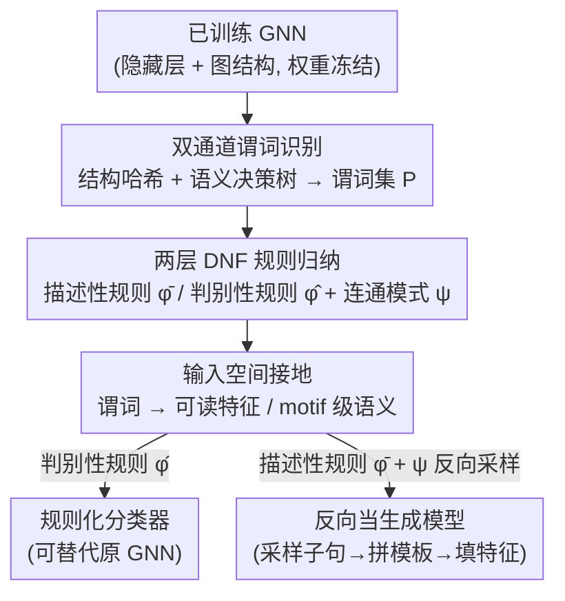

# LogicXGNN: Grounded Logical Rules for Explaining Graph Neural Networks

**会议**: ICLR 2026  
**arXiv**: [2503.19476](https://arxiv.org/abs/2503.19476)  
**代码**: 无  
**领域**: 图学习  
**关键词**: 图神经网络可解释性, 逻辑规则提取, 决策树, 知识发现, 图生成

## 一句话总结

LogicXGNN 提出了一种从已训练的图神经网络中提取可解释一阶逻辑规则的 post-hoc 框架：通过图结构哈希和隐藏层嵌入模式识别谓词、用决策树确定判别式 DNF 规则结构、并将抽象谓词接地到输入空间，最终生成可替代原始 GNN 的规则化分类器，同时可作为可控的图生成模型。

## 研究背景与动机

图神经网络（GNN）在药物发现、欺诈检测、推荐系统等领域取得了显著成功，但其黑箱特性阻碍了在医疗健康等高可靠性场景中的应用。现有 GNN 可解释性方法存在明显不足：

- **局部归因方法**（如 GNNExplainer、PGExplainer）只能解释单个实例的预测，无法给出模型的全局行为描述
- **基于概念的全局方法**（如 GCNeuron、GLGExplainer）依赖预定义概念，且生成的规则仅描述单个类别的模式而无法有效区分不同类别
- GLGExplainer 的表达能力严重不足——例如在 Mutagenicity 数据集上仅使用 2 个谓词，性能接近随机分类器

本文的核心问题：能否从 GNN 中提取既可解释、又有判别力、同时模型无关的逻辑规则？

## 方法详解

### 整体框架

LogicXGNN 把"从已训练 GNN 中读出逻辑规则"这件事拆成三步流水线：先为每个节点识别出一组隐藏谓词 $P$，再把谓词激活模式组织成 DNF 形式的规则结构 $\phi_M$，最后把抽象谓词接地回输入特征空间，让规则可读、可执行、可生成。整条管线不碰原 GNN 的权重，只在它的隐藏层和图结构上做读取与归纳，最终同时产出两套规则：描述性规则 $\bar{\phi}_M$ 完整覆盖类内变异、用于图生成，判别性规则 $\hat{\phi}_M$ 精简到只保留跨类区分所需、用于分类。把这条管线反向跑，同一套规则还能当生成模型用。

### 关键设计

**1. 双通道谓词识别：把结构和语义各管一摊**

单看 GNN 的隐藏嵌入不够，因为 message passing 的 over-smoothing 会把节点的结构信息糊掉，所以 LogicXGNN 给每个节点 $v$ 同时抽两种签名。结构通道直接对节点 $1$ 到 $L$ 跳邻域构成的感受野子图做图哈希，得到 $\text{Pattern}_{struct}(v) = \text{Hash}(\text{ReceptiveField}(v, A, L))$，把"长什么样"显式记下来。语义通道则在最终层图嵌入上训一棵决策树，挑出最有判别力的维度集合 $K$ 和阈值 $T$，再把阈值广播回节点级嵌入，给每个节点每个关键维度打一个二值激活。一个谓词 $p_j$ 就是这两种模式拼成的元组，对节点 $v$ 为真当且仅当结构签名和嵌入激活都对上——这样既保住了被平滑掉的拓扑信息，又借决策树自动定位了语义上真正重要的少数维度。

**2. 两层 DNF 规则归纳：描述性与判别性分工**

谓词就位后，对每个类别 $c$ 收集所有被正确分类实例的谓词激活，堆成二值矩阵 $\Phi_c$；每一行是一条合取子句（节点谓词的 AND），所有行取析取（OR）就构成描述性规则 $\bar{\phi}_M^c$，它如实记录了这个类内部出现过的全部模式。但描述性规则往往冗长（BBBP 的某个类有上千条子句），直接拿来分类既臃肿又不区分类别。于是把整张 $\Phi$ 连同标签 $Y$ 喂进第二棵决策树，让它只学跨类的判别边界，输出精简的判别性规则 $\hat{\phi}_M$。与此同时还顺手统计谓词之间的连通模式 $\psi_M$（一个邻接矩阵），记录哪些谓词在图里相邻，这一信息是后面 motif 级接地和图生成的关键。

**3. 输入空间接地：让谓词从抽象元组落回可读特征**

规则结构再漂亮，谓词本身还是哈希值加激活位，人看不懂，所以最后一步把谓词翻译回输入特征。对每个节点构造逐跳拼接的子图特征 $Z_{v,L} = \text{CONCAT}\big(X_v, \text{Encode}(\{f(u)\,|\,u \in N^{(1)}(v)\}), \dots, \text{Encode}(\{f(u)\,|\,u \in N^{(L)}(v)\})\big)$，把节点自身特征和各跳邻居编码串起来。对那些结构同构、却被分进不同嵌入模式的谓词对，再训一棵决策树学一条基于这些输入特征的区分规则；对找不到同构对应的谓词，则直接取方差最小的特征维度当代表性描述。更进一步，结合连通模式 $\psi_M$ 可以把节点级规则升级成 motif 级语义——例如从"两个节点度都为 2 且相邻"推导出"存在环"这种子图级概念，这正是 LogicXGNN 能发现"芳环+硝基协同致突变"而非把两者割裂看待的原因。

**4. 同一套规则反向当生成模型用**

因为描述性规则 $\bar{\phi}_M$、连通模式 $\psi_M$ 和接地规则 $R$ 合起来已经完整刻画了"一个合法的类长什么样"，把流程反过来跑就能生成新图：从 $\bar{\phi}_M$ 采样一条合取子句确定要哪些谓词，用 $\psi_M$ 把谓词按相邻关系拼成图模板，再用接地规则 $R$ 给每个谓词位填上具体节点特征。整个过程透明可控、每一步都对应一条规则，因此生成的图会乖乖落在学到的分布里，而不像基于 RL 的 XGNN 那样跑出二部图这种不符合真实分子分布的结构。

### 损失函数 / 训练策略

LogicXGNN 是纯 post-hoc 方法，不改原始 GNN 的训练，全部计算开销来自三处决策树训练（提取嵌入关键维度、归纳判别规则、接地到输入），量级与训练普通决策树相当。实验设置上 GNN 用 2 层、隐藏维度 32，数据集按 8:2 划分训练/测试，所有决策树用 CART 算法训练，硬件为 Ubuntu 22.04、32GB RAM、2.7GHz 处理器。

## 实验关键数据

### 主实验

| 数据集 | |P| | $|\hat{\phi}_M^0|$ | $|\hat{\phi}_M^1|$ | $\phi_M$ 训练准确率 | $\phi_M$ 测试准确率 | GNN 测试准确率 | GLGExplainer 测试准确率 |
|--------|-----|-----|-----|-------|-------|-------|-------|
| HIN | 2293 | 146 | 62 | 89.12 | 85.23 | 86.93 | 49.99 |
| BBBP | 254 | 20 | 22 | 81.18 | **81.37** | 81.13 | 42.90 |
| Mutagenicity | 314 | 198 | 167 | 78.12 | 76.50 | 76.04 | 54.26 |

### 消融实验

| 配置 | 关键特征 | 说明 |
|------|---------|------|
| 描述性规则 $\bar{\phi}_M$ | BBBP: 146+1044 clauses | 完整覆盖类内变异，可用于生成 |
| 判别性规则 $\hat{\phi}_M$ | BBBP: 20+22 clauses | 精简但准确率可比甚至超越 GNN |
| GLGExplainer | 2 个谓词 | 过度简化，效果近似随机 |
| GCNeuron | 依赖输入类别 | 无判别力，不同类别给出完全不同解释 |

### 关键发现

- **规则化模型可超越神经网络**：在 BBBP 上 $\hat{\phi}_M$ 测试准确率 81.37% 超过原始 GNN 的 81.13%，在 Mutagenicity 上也表现相当
- **化学知识发现准确**：
    - BBBP 数据集：发现含氧丰富基团的分子不易穿越血脑屏障（增加亲水性、降低亲脂性）
    - MUTAG 数据集：发现甲基（-CH3）与非致突变相关、芳环+硝基的组合对致突变关键——后者与原始论文 (Debnath et al., 1991) 的发现一致
    - 现有方法如 GCNeuron 和 GLGExplainer 将硝基和碳环视为独立实体，忽略了它们之间的协同效应
- **可控图生成优于 XGNN**：XGNN（基于 RL 的生成方法）产生的图结构不符合真实分子分布（如生成二部图），而 LogicXGNN 遵循学到的规则，可重建原始分子并生成保持关键属性的新实例

## 亮点与洞察

- 首个作为 GNN 功能等价物的可解释规则化模型——不只是解释，还能替代原始模型
- 三阶段设计非常模块化："发现谓词 → 组织规则 → 接地到输入"各自解耦
- 巧妙利用 decision tree 三次：(1) 提取嵌入关键维度，(2) 生成判别规则，(3) 接地到输入空间
- motif 级规则接地是亮点：通过连通模式将节点级规则升级为子图级语义理解
- 作为生成模型的应用很有想象空间，特别是在药物设计中的组合生成

## 局限与展望

- 实验规模较小（三个数据集），缺乏大规模图数据集的验证
- 图哈希在大图上可能产生大量唯一结构模式，谓词集合可能爆炸
- 描述性规则数量可能非常多（如 BBBP 的 class 1 有 1044 条子句），人类可读性受限
- 目前仅支持分类任务，未扩展到回归（如分子属性预测、3D 结构预测）
- 缺乏对方法可扩展性（节点数、类别数、层数增加时的行为）的分析
- 未与 GNNExplainer 等局部方法在解释质量上进行系统对比

## 相关工作与启发

- 灵感来自 NeuroLogic (Geng et al., 2025)，后者在 FC 网络和 CNN 上从隐藏层激活模式提取逻辑规则
- 与 GLGExplainer (Azzolin et al., ICLR 2023) 形成直接对比：后者依赖 PGExplainer 的局部解释，而 LogicXGNN 完全数据驱动
- 启发：将"神经网络→逻辑程序"的翻译与程序合成结合，可能进一步提升规则模型的性能

## 评分
- 新颖性: ⭐⭐⭐⭐
- 实验充分度: ⭐⭐⭐
- 写作质量: ⭐⭐⭐⭐
- 价值: ⭐⭐⭐⭐

<!-- RELATED:START -->

## 相关论文

- [\[ACL 2026\] From Nodes to Narratives: Explaining Graph Neural Networks with LLMs and Graph Context](../../ACL2026/graph_learning/from_nodes_to_narratives_explaining_graph_neural_networks_with_llms_and_graph_co.md)
- [\[ICLR 2026\] Cooperative Sheaf Neural Networks](cooperative_sheaf_neural_networks.md)
- [\[ICLR 2026\] Learning from Historical Activations in Graph Neural Networks](learning_from_historical_activations_in_graph_neural_networks.md)
- [\[ICLR 2026\] Are We Measuring Oversmoothing in Graph Neural Networks Correctly?](are_we_measuring_oversmoothing_in_graph_neural_networks_correctly.md)
- [\[NeurIPS 2025\] Sound Logical Explanations for Mean Aggregation Graph Neural Networks](../../NeurIPS2025/graph_learning/sound_logical_explanations_for_mean_aggregation_graph_neural_networks.md)

<!-- RELATED:END -->
