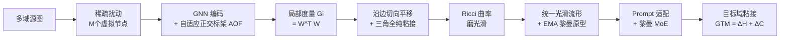

# Multi-Domain Riemannian Graph Gluing for Building Graph Foundation Models

**会议**: ICLR 2026  
**OpenReview**: [https://openreview.net/forum?id=G3uNHQpP7J](https://openreview.net/forum?id=G3uNHQpP7J)  
**代码**: [https://github.com/RiemannGraph/GraphGlue](https://github.com/RiemannGraph/GraphGlue)  
**领域**: 图基础模型 / 黎曼几何表示学习 / 多域图预训练  
**关键词**: Graph Foundation Model, Multi-domain Pre-training, Riemannian Manifold, Manifold Gluing, Holonomy, Transferability  

## 一句话总结
本文用微分几何的"流形粘接"视角重构多域图预训练：把任意图数据集融合进一个统一、光滑的黎曼流形上，从而第一次给"知识如何跨域整合与迁移"提供了严格的理论刻画，并据此提出可量化迁移难度、带几何缩放律的 GRAPHGLUE 框架。

## 研究背景与动机
**领域现状**：图基础模型（GFM）希望复刻 NLP/CV 里"多域预训练 + 下游迁移"的成功范式。一类方法借助 LLM 抽取文本语义，但只能处理文本属性图；另一类面向无文本图，靠 graph codebook、motif、computation tree 学习共享/不变知识，再用 domain token、in-context learning 等做下游适配。

**现有痛点**：尽管效果不错，这些方案始终回避了一个根本问题——**知识到底是怎么跨域整合和迁移的**？现有的跨域相似度度量（如 GFT、Ruiz 等）并没有把"预训练"和"域适配"放进同一个一致的框架里，导致无法评估迁移难度，对没见过的图更是束手无策。

**核心矛盾**：多域图之间语义高度异质（社交网络 vs 生物分子），缺乏一个能同时承载"整合"与"迁移"的统一数学结构，使得迁移性既不可解释也不可量化。

**本文目标**：建立一个对预训练和适配都一致的理论框架，既能解释知识整合/迁移机制，又能给出可量化、可解释的迁移难度度量。

**核心 idea**（**流形粘接**）：把每个图的局部几何刻画成一个小的黎曼流形片，再像拓扑学里"粘接图册"那样，沿边、三角形把这些局部片**粘接（gluing）**成一个统一、光滑的全局黎曼流形。在这个统一流形上，不同域占据不同位置，知识迁移就变成"沿流形输运"，迁移难度则由几何形变量自然衡量。

## 方法详解

### 整体框架
GRAPHGLUE 是一个"预训练—适配"框架：预训练阶段先用稀疏扰动 + 自适应正交标架学每个节点的**局部几何**，再通过边切向平移与三角全纯（holonomy）把局部片粘接、并用 Ricci 曲率把流形磨光滑，配合 EMA 黎曼原型实现分批大规模预训练；适配阶段用可学习 prompt 与黎曼专家混合（RMoE）把目标域"粘"到预训练流形上，保证几何一致，并由度量兼容性自然导出几何迁移度量 GTM。

### 关键设计

**1. 自适应正交标架（AOF）：用深度学习把"局部切空间"造出来**。流形上每一点的局部几何由其切空间决定，但传统 Cartan 移动标架法缺乏深度学习实现。本文先定义 $(k, M)$-稀疏扰动：给图加 $M$ 个虚拟扰动节点 $P=\{p_m\}$，每个虚拟节点用注意力 $h(x_i,p_m)$ 连到 top-$k$ 个真实节点，模仿方向导数 $D_v f=\lim_{t\to 0}\frac{f(p+tv)-f(p)}{t}$ 来生成一组切向量；再经 GNN 编码、QR 分解并恢复长度，得到正交标架 $\{w_m\}$ 及其对偶标架 $\{\theta_m\}$。论文证明长度恢复很关键——切向量长度受扰动上界 $\|w_m^p\|\le(1+\varepsilon)\|P\|$ 约束，标架的角度和长度分别反映空间被"扭转"和"拉伸"的程度。最终每点的局部度量写成对角形式 $G_i=W^{(i)\top}W^{(i)}=\mathrm{diag}(\|w_1\|^2,\dots,\|w_M\|^2)$，把"几何"落地成可微的张量。

**2. 沿边与三角的粘接：让一堆孤立流形片拼成连续整体**。有了 $N$ 个孤立局部片 $\{M^{(i)}\}$ 后，要拼成有全局度量的统一流形。本文先做**边切向平移** $P^{(i,j)}=G_j^{-1/2}\big(G_j^{1/2}G_iG_j^{1/2}\big)^{1/2}G_j^{-1/2}$，证明它是 $\min_P\|P^\top G_jP-G_i\|_F^2$ 的最优解、构成边界间的等距同构，从而保证沿边的**度量兼容性**并诱导出唯一全局度量（Thm 4.5、4.6），且借 QR 分解把复杂度降到 $O(M)$。但沿三角形、回路绕一圈时会产生偏移，使流形连通却不处处连续。为此引入**全纯（holonomy）**：沿闭曲线 $C$ 的传输映射复合 $H(C)=\prod_\ell P^{(i_\ell,i_{\ell+1})}$，当它等于恒等映射时偏移消失。对应的全纯损失 $L_{holo}=\frac{1}{|A|}\sum_{A_{ijk}}\|P^{(k,i)}P^{(j,k)}P^{(i,j)}-I\|_F^2$ 惩罚三角形偏移；Thm 4.8 证明只要每条边属于某个三角形且所有三角全纯平凡，则所有回路全纯都平凡——即把"逐三角拉直"升级成"整体 $C^1$ 连续"。

**3. Ricci 曲率磨光滑 + 几何缩放律：从 $C^1$ 连续到 $C^2$ 光滑**。$C^1$ 连续还不够，要消除阻碍知识输运的"褶皱"需要 $C^2$ 光滑，即控制 Ricci 曲率。直接算 Ricci 太贵，本文改用相邻两点的**体积变化比** $r(z^{(i)},z^{(j)})=\frac{\det G_i}{\det G_j}\approx 1-\frac{1}{3}\mathrm{Ric}(\dot\gamma)$（Thm 4.9）来估曲率符号。进而定义对数体积密度标量场 $g_i=\frac{1}{2}\log\det G_i$，用图 Dirichlet 能量 $\|L^k g\|^2$ 刻画 $k$ 阶光滑，得到曲率损失 $L_{Curv}=\frac{1}{|A|}\sum_{A_{ijk}}|\log r_{ij}-\log r_{jk}|^2$。当数据集规模增大、流形趋近理想光滑形态时，论文导出**几何缩放律**：图数据越多，流形越光滑，模型迁移性越强（Sec 6.2 实证验证）。

**4. EMA 黎曼原型 + 可量化迁移度量 GTM**。预训练阶段给每个图配一个黎曼原型 $(z_{S_k},\log G_{S_k})$（全局位置 + 度量的对数均值），用 EMA 分批更新——因度量矩阵属于对称正定流形，这里用矩阵对数更新 $\log G_{S_k}\leftarrow\beta\log G_{S_k}+(1-\beta)\frac{1}{|B_k|}\sum_{G\in B_k}\log G(z_G)$，既高效处理大图又用样本-原型对比损失 $L_{proto}$ 把各域语义在流形上分开。适配阶段用 prompt 矩阵 $Q$ 调整坐标 $z_{adapt}=Qz^T$ 与度量 $G_{adapt}=\mathrm{diag}(\|Qw_1^T\|^2,\dots)$，把目标样本连到 $k$ 近邻原型构成 transfer graph $G_0$ 并施加 $L_{holo}(G_0)+L_{curv}(G_0)$ 完成"粘接"；黎曼 MoE 把每个原型当专家加权融合。迁移难度由 **GTM** $=\Delta H+\Delta C$ 自然给出：$\Delta H=L_{holo}(G_0)$ 衡量目标引入的"扭转"，$\Delta C=L_{curv}(G_0)$ 衡量"弯折/体积突变"。GTM 低说明目标几乎无形变即可融入流形（高迁移性），高则说明目标在几何上"格格不入"。

## 实验关键数据

### 主实验表格
6 个代表性域、leave-one-out 跨域迁移（5 源 1 目标），few-shot（1/5-shot）微调，10 次独立运行均值。节点/边分类用 ACC、图分类用 AUC。

| Model | Arxiv 1-shot | Arxiv 5-shot | Computers 1-shot | Computers 5-shot | Reddit 1-shot | Reddit 5-shot | FB15k 1-shot | FB15k 5-shot | PROTEINS 1-shot | PROTEINS 5-shot |
|---|---|---|---|---|---|---|---|---|---|---|
| GCN | 12.6 | 27.6 | 33.8 | 65.7 | 11.1 | 28.3 | 32.1 | 52.4 | 50.1 | 55.0 |
| GIN | 11.2 | 26.0 | 44.7 | 69.5 | 18.5 | 29.0 | 38.2 | 63.7 | 54.2 | 58.8 |
| GFT | 26.5 | 36.7 | 54.6 | 69.1 | 58.8 | 66.2 | 58.0 | 79.1 | 55.4 | 62.1 |
| GCOPE | 26.5 | <u>39.1</u> | 54.5 | <u>72.2</u> | 62.7 | <u>80.4</u> | 58.2 | <u>79.3</u> | 55.1 | <u>64.8</u> |
| MDGFM | 26.0 | 32.2 | 46.6 | 64.0 | <u>64.8</u> | 76.5 | 56.1 | 77.6 | 53.4 | 57.7 |
| **GRAPHGLUE** | **28.8** | 37.0 | **59.5** | **73.2** | **67.1** | **85.0** | **59.7** | **81.5** | **59.8** | **65.3** |

> GRAPHGLUE 在多数设置取得最优：1-shot 下 Computers/Reddit 分别比最强 baseline 高 4.9% / 2.3%；5-shot Reddit 达 85.0% ACC，超亚军 4.6%。

### 消融实验表格
（Appendix G）逐项移除 $L_{curv}$、$L_{holo}$。

| 变体 | 效果 |
|---|---|
| 完整 GRAPHGLUE | 最优 |
| 去 $L_{holo}$（不做全纯粘接） | 下游性能下降 |
| 去 $L_{curv}$（不做曲率磨光滑） | 下游性能下降 |

> 结论：基于全纯的粘接与基于 Ricci 曲率的磨光滑，对下游任务都不可或缺。

### 关键发现
- **GTM 确实度量迁移难度**：在 Computers 上做 2000 epoch 迁移时，全纯损失迅速归零，曲率损失随训练下降收敛，且测试任务损失呈现同样的下降模式；曲率损失振幅的收敛还预示了测试损失的收敛，与平坦极小点理论（Keskar、Czarnecki）吻合。
- **几何缩放律成立**：预训练语料从 Reddit → Reddit+PROTEINS → Reddit+PROTEINS+HIV 逐步加入异质域时，更多数据产出更光滑的流形，迁移性随之提升，验证了 Thm 4.11 的理论预言。

## 亮点与洞察
- **把"图基础模型的迁移"从经验问题升格为微分几何问题**：流形粘接给"知识整合/迁移"提供了首个一致、可证明的数学框架，预训练和适配统一在"构造/对齐同一个光滑流形"之下。
- **理论与可操作损失一一对应**：度量兼容 → 边切向平移、连续性 → 全纯损失、光滑性 → 曲率损失，每条定理都落到一个可微目标上，理论不是装饰而是直接驱动训练。
- **迁移难度可量化又可解释**：GTM = 扭转（ΔH）+ 弯折（ΔC），是从模型自身几何导出的内在量，比单纯的源-目标相似度更能刻画"融入难度"，对未见域也适用。
- **几何缩放律给"加数据"一个几何解释**：数据越多流形越光滑、迁移越好，把 scaling law 落到流形曲率上。

## 局限与展望
- **理论假设较强**：Thm 4.11 要求 $\infty$-阶对数行列式光滑且全纯平凡才严格粘成光滑流形，实践中只能近似（用 2 阶光滑、三角全纯），理论与实现间存在 gap。
- **计算与实现门槛高**：涉及 QR 分解、矩阵对数 EMA、对称正定流形更新、逐三角全纯/曲率损失，工程复杂度和超参（$\beta,\tau,\lambda,k,M$）调试成本较高。
- **评测规模有限**：仅 6 个域、few-shot（1/5-shot）设定，缺乏更大规模、zero-shot 或更多任务类型（如回归、生成）的验证；异质图仅在附录涉及。
- **可拓展方向**：把流形粘接思路用于跨模态（图+文本/分子+蛋白），或探索 GTM 作为"该不该迁移/选哪些源域"的主动数据选择信号。

## 相关工作与启发
- **图基础模型**：LLM 驱动的文本属性图方法、面向知识图/推荐/分子的专用 GFM，以及无文本图的多域预训练；本文站在"text-free + 统一流形"一侧。
- **多域图预训练**：生成式（GraphMAE）/对比式（DGI、GCC）自监督，以及学共享/不变知识的 GFT、MDGFM、GCOPE 等；本文补上了它们缺失的"迁移机制理论"。
- **黎曼图表示学习**：以往多针对特定流形（双曲、球面、积流形）做特定任务，Sun 等在积流形上设计 GNN backbone；本文转向"构造通用流形 + 多域预训练框架"，而非特定流形。
- **启发**：Cartan 移动标架法的深度学习化（AOF）是个通用工具，可能迁移到其他需要"在数据上构造可微几何"的场景，如流形上的扩散模型或几何感知的对比学习。

## 评分
- **新颖性**: ⭐⭐⭐⭐⭐ 用流形粘接 + 全纯 + Ricci 曲率把多域图预训练重铸为微分几何问题，视角和理论建构都很原创。
- **实验充分度**: ⭐⭐⭐⭐ 6 域跨域迁移 + GTM 验证 + 几何缩放律实证较扎实，但域数量、任务类型与规模偏有限，zero-shot 缺位。
- **写作质量**: ⭐⭐⭐⭐ 理论叙述严谨、定理与损失对应清晰、框架图直观；但数学密度高、对非几何背景读者门槛较陡。
- **价值**: ⭐⭐⭐⭐⭐ 为图基础模型的"可解释、可量化迁移"提供了坚实理论基座，几何缩放律和 GTM 都有较强的方法论延展性。

<!-- RELATED:START -->

## 相关论文

- [\[ICLR 2026\] Bridging Input Feature Spaces Towards Graph Foundation Models](bridging_input_feature_spaces_towards_graph_foundation_models.md)
- [\[ICML 2026\] Are Common Substructures Transferable? Riemannian Graph Foundation Model with Neural Vector Bundles](../../ICML2026/graph_learning/are_common_substructures_transferable_riemannian_graph_foundation_model_with_neu.md)
- [\[AAAI 2026\] Adaptive Riemannian Graph Neural Networks](../../AAAI2026/graph_learning/adaptive_riemannian_graph_neural_networks.md)
- [\[ICLR 2026\] FLOCK: A Knowledge Graph Foundation Model via Learning on Random Walks](flock_a_knowledge_graph_foundation_model_via_learning_on_random_walks.md)
- [\[ICLR 2026\] Out-of-Distribution Graph Models Merging](out-of-distribution_graph_models_merging.md)

<!-- RELATED:END -->
