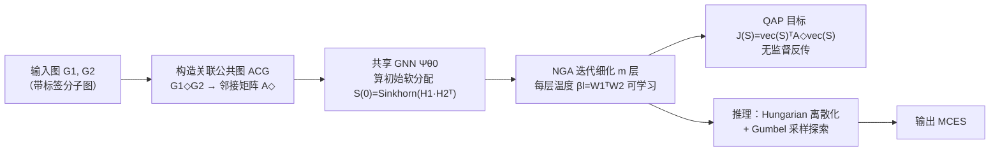

# Neural Graduated Assignment for Maximum Common Edge Subgraphs

**会议**: ICLR 2026  
**OpenReview**: [https://openreview.net/forum?id=ZVlTIyRe35](https://openreview.net/forum?id=ZVlTIyRe35)  
**代码**: 待确认  
**领域**: 图学习 / 组合优化 / 图匹配  
**关键词**: 最大公共边子图、二次分配问题、图匹配、无监督学习、退火机制、可学习温度  

## 一句话总结
把 NP 完全的最大公共边子图（MCES）问题改写成关联公共图上的二次分配问题，再用一个温度参数完全可学习的"神经化渐进分配"网络在多项式时间里无监督地逼近最优解，速度与精度同时碾压传统搜索求解器。

## 研究背景与动机
**领域现状**：最大公共边子图（MCES）是组合优化里的核心任务，在化学（药物发现中找分子共享药效团）、生物、网络安全（比对流量图发现重复攻击模式）等领域被广泛使用，并已集成进 RDKit、Molassembler 等主流化学信息学库。传统解法有两条路线——要么把 MCES 转化成最大团问题求解，要么用基于搜索的分支定界算法（RASCAL、McSplit）。

**现有痛点**：MCES 本身是 NP 完全的。转化成最大团会引入额外计算开销；分支定界搜索则随图规模指数级膨胀，一旦遇到大图（论文专门挑选 30 个原子以上的分子，而以往工作只敢做 15 节点以内的小图）就直接跑不动。换句话说，"精确但不可扩展"是这类方法的天花板。

**核心矛盾**：既要保证抽出来的子图是**合法的公共子图**（节点和边的标签都要兼容），又要在多项式时间里高效逼近最优解——而经典图匹配目标 $\arg\min_P\|A_1-PA_2P^\top\|_F^2$ 根本不考虑标签兼容性，硬加惩罚项又无法保证解的合法性。

**本文目标**：提出一个简单、可扩展、无监督训练（损失函数里不含任何关于 MCES 真值/大小的信息）的方法，在多项式时间内逼近 MCES，并能自然迁移到图相似度计算和图检索任务。

**核心 idea**：**关联公共图 + 神经化渐进分配**——先构造一张"关联公共图"（ACG）把合法性约束编码进图结构本身，使 MCES 严格等价于 ACG 上的二次分配问题；再把传统渐进分配里手调的标量退火温度替换成**高维可学习参数化温度**，让模型端到端地自己学会何时探索、何时收敛。

## 方法详解

### 整体框架
NGA 分三步走：(1) 由两张输入图 $G_1,G_2$ 构造关联公共图 $G_1\diamond G_2$，把 MCES 化为其邻接矩阵 $A_\diamond$ 上的二次分配问题（QAP）；(2) 用共享 GNN 算出初始软分配矩阵，再用一个 $m$ 层、每层温度可学习的渐进分配网络迭代细化；(3) 训练阶段用 QAP 目标做无监督反传，推理阶段用 Hungarian 算法离散化 + Gumbel 采样探索得到最终硬分配。

### 关键设计

**1. 关联公共图（ACG）：把合法性约束焊进图结构，让 QAP 形式天然只数公共边。** MCES 难就难在要同时满足"结构对应"和"标签兼容"。NGA 不去硬加惩罚，而是直接构造一张关联公共图 $G_1\diamond G_2$：节点取自笛卡尔积 $V(G_1)\times V(G_2)$ 且只保留标签兼容的配对，两个节点 $(u_i,v_i)$ 与 $(u_j,v_j)$ 相邻当且仅当三条件同时成立——$(u_i,u_j)\in E(G_1)$、$(v_i,v_j)\in E(G_2)$、且 $\omega(u_i,u_j)=\omega(v_i,v_j)$（节点边标签一致）。这样一来命题 1 保证：任何在 ACG 上"每个 $G_1/G_2$ 节点至多选一次"的子图都必然是一个合法公共子图，于是找 MCES 就严格等价于在 ACG 里找最大子图。把 ACG 的邻接矩阵 $A_\diamond$ 当作亲和矩阵，目标干净地写成二次分配 $J(S)=\text{vec}(S)^\top A_\diamond\,\text{vec}(S)$——因为 ACG 里只有公共边，这个目标数的就是被保留的公共边数，既保证合法性又带来可解释性（任何分配都能映射回一个显式公共子图）。

**2. 可学习温度参数化：把退火调度从"手调标量"升级成"网络自己学的高维参数"。** 传统渐进分配靠一个预设温度 $\beta$ 逐步锐化软分配，但固定/手工调度的 $\beta$ 既要穷举调参、又无法随不同问题实例自适应。NGA 的核心创新是把标量温度换成参数化形式 $\beta_l=W_1^{(l)\top}W_2^{(l)}$，其中 $W_1^{(l)},W_2^{(l)}\in\mathbb{R}^{d\times1}$ 是第 $l$ 层的可学习权重。每层迭代做三件事：先按 ACG 结构传播 $\text{vec}(S^{(l)})\leftarrow A_\diamond\text{vec}(S^{(l-1)})$，再用学到的温度锐化 $S^{(l)}\leftarrow\exp\big((W_1^{(l)\top}W_2^{(l)})S^{(l)}\big)$，最后 Sinkhorn 归一化回双随机矩阵。温度成了网络的一部分被端到端优化，既省掉手调开销，又能随优化阶段动态调整锐化强度。

**3. 负温度驱动的探索-利用机制：用 $\beta_l$ 的正负号自动在"跳出局部最优"和"收敛"之间切换。** 论文从理论上证明（定理 1）：在局部最优 $S^{(l)}$ 附近，目标变化 $\Delta J=\frac{1}{2}(\sum_i\lambda_i-\sum_j\mu_j)+\beta_l\cdot\text{Var}(h)+O(|\beta_l|^2)$，其中方差项在 $\beta_l<0$ 时会让目标下降，从而让分配跳出当前局部最优。据此定义两个阶段——探索期 $\mathcal{E}=\{l\mid\beta_l<0\}$、利用期 $\mathcal{S}=\{l\mid\beta_l>0\}$。允许 $\beta_l$ 可正可负且可学习，让 NGA 自动在两个阶段间交替，避免过早收敛。命题 2 进一步指出乘积参数化 $\beta_l=W_1^\top W_2$ 能自适应调整学习率并产生加速效应，因此 NGA 只需 2~4 层就能收敛，而传统 GA 要几十次迭代。

**4. Gumbel 采样推理：从分配分布里批量采样，差分地搜更优解。** 软分配 $S$ 本质是一个分配矩阵的隐分布，Hungarian 只挑概率最高的那个，但分布里可能藏着更好的解。NGA 在推理时把初始化换成 Gumbel-Sinkhorn：$S^{(0)}=\text{Sinkhorn}(\hat S^{(0)}+g)$，$g$ 取自标准 Gumbel 分布。这样能可微地批量采样多个分配矩阵，各自用 Hungarian 离散化、再用 $A_{pred}=(\text{vec}(P)\text{vec}(P)^\top)\odot A_\diamond$ 评估保留边数，取目标值最优者输出。采样数量可调，用来在"探索充分度"和"速度"间权衡。

## 实验关键数据

数据集：AIDS、MCF-7（TU Dataset）、MOLHIV（OGB），均为分子图，专挑 30 原子以上的硬实例，每个数据集随机采 1000 对图。搜索/无监督方法每个实例 60 秒时间预算，监督方法训 200 epoch。硬件：AMD EPYC 7542 CPU + 单张 NVIDIA 3090。

### 主实验表格（MCES 准确率 % ↑，以精确解为分母）

| 方法 | AIDS | MOLHIV | MCF-7 |
|------|------|--------|-------|
| RASCAL（搜索，次优 baseline） | 90.67 | 88.74 | 90.26 |
| Mcsplit（搜索） | 61.32 | 72.74 | 69.23 |
| GLSearch | 43.47 | 41.12 | 42.08 |
| NGM（监督） | 33.34 | 52.21 | 42.38 |
| GANN-GM（无监督） | 49.76 | 72.18 | 63.47 |
| GA（传统渐进分配） | 70.99 | 71.09 | 72.92 |
| Gurobi 求解器 | 74.52 | 78.67 | 80.76 |
| **NGA（本文）** | **98.64** | **99.20** | **97.94** |

NGA 在三个数据集上全部逼近最优（>97%），比次优的搜索方法 RASCAL 高出 8~11 个百分点，且在大图上运行时间快几个数量级。监督方法（NGM）表现最差，论文归因于 MCES 本质多模态（多个等价最优解）让监督信号难以学习。

### 图相似度与图检索

图相似度（MSE ×10⁻³ ↓）：NGA 在 AIDS/MOLHIV/MCF-7 上分别为 1.13 / 0.66 / 0.99，比次优方法低**一个数量级**（NeuroMatch 约 13.92/19.17/17.34）。图检索（10000 query-target 对）三项指标全面领先：MRR 0.844/0.806/0.803、MAP 0.974/0.951/0.966，远超 XMCS、INFMCS 等隐式推断 MCES 大小的方法。

### 消融实验（图 4，超参分析）

| 设置 | 现象 | 结论 |
|------|------|------|
| 迭代层数 $m=0$ | 仅靠 GNN 编码器相似度，准确率骤降 | NGA 迭代过程至关重要 |
| 迭代层数 $m=2$ | 已达到有竞争力的性能 | 比传统 GA（需几十次迭代）快得多 |
| 隐藏维度 $d=1$ | 退化到接近传统方法水平 | 印证温度需高维参数化才有表达力 |
| 隐藏维度 $d$ 增大 | 性能稳步提升直到饱和 | 验证命题 2 的加速效应 |

最终取 $m=4$、$d=32$ 平衡性能与效率。另外在 QAPLIB 子集上的额外实验显示 NGA 对一般 QAP 也有竞争力。

### 关键发现
- 温度的"高维可学习参数化"是性能跃升的根因：$d=1$ 时退回传统方法，$d$ 增大才显著提升。
- 极少迭代即收敛（2~4 层）使 NGA 在大图上获得数量级的速度优势，这是搜索方法无法企及的。
- 把 MCES 解精确建模（而非像 XMCS/INFMCS 只隐式估 MCES 大小）让下游相似度/检索任务误差低一个数量级。

## 亮点与洞察
- **建模优雅**：ACG 这一步把"标签兼容 + 结构对应"的双重合法性约束直接编码进图拓扑，使 QAP 目标天然只数合法公共边，彻底绕开了"加惩罚项却无法保证合法"的死结，还顺带获得显式可解释的 MCES 结构。
- **可学习温度是真正的核心**：把退火里最讨厌的手调超参 $\beta$ 变成网络自学的高维参数，不仅省调参，还通过乘积参数化获得自适应学习率与加速收敛，是"用神经视角重新思考分配问题"的范式样例。
- **理论扎实**：定理 1 / 命题 2 给出了负温度跳出局部最优、乘积参数化加速收敛的定量刻画，把"探索-利用"机制和 $\beta_l$ 的正负号严格对应起来，而非纯启发式。
- **无监督 + 可扩展**：损失里完全不含 MCES 真值，逐实例求解，天然适配以往搜索方法跑不动的大图。

## 局限与展望
- 仍是逐对图实例求解（train-then-infer per pair），没有跨实例的摊销推理，面对超大规模检索库时单对开销仍会累积。
- ACG 的节点集来自 $V(G_1)\times V(G_2)$，对密集大图笛卡尔积构图的内存开销可能成为瓶颈，论文主要在分子图（节点数有限）上验证。
- 实验集中在分子图（化学领域），对社交网络、知识图谱等异质大图的泛化性尚未充分检验。
- 理论分析建立在"梯度多次把 $\beta_l$ 推向一致方向"等温和假设上，实际优化轨迹的鲁棒性还需更多经验验证。

## 相关工作与启发
- **MCS 求解**：McSplit（分支定界 + 节点标注分区）、GLSearch（GNN + Deep Q-Network 选匹配对）、RASCAL（最大团搜索 + 启发式）代表传统精确路线，本文以"无监督 + 多项式时间逼近"另辟蹊径。
- **图相似度/检索**：SimGNN、GMN（跨图注意力）、INFMCS（隐式推断 MCS）、XMCS（早晚交互网络）、ISONET 等多用嵌入或隐式相似度，本文显式重建 MCES 结构带来精度优势。
- **图匹配/QAP**：继承渐进分配（Graduated Assignment）与 Sinkhorn、Gumbel-Sinkhorn 的可微匹配传统，启发在于"把退火温度神经化、参数化"这一思路可推广到更广义的二次分配与组合优化问题。

## 评分
- **新颖性**: ⭐⭐⭐⭐⭐ ACG 把合法性约束焊进图结构 + 可学习高维温度参数化，是对经典渐进分配的实质性重构，且配有定理级理论支撑，思路新颖且自洽。
- **实验充分度**: ⭐⭐⭐⭐ 覆盖 MCES、相似度、检索三类任务 + 三个分子数据集 + QAPLIB 额外验证，超参消融清晰；扣分点在于主要局限于分子图、缺更异质的大图泛化测试。
- **写作质量**: ⭐⭐⭐⭐ 动机—建模—理论—实验逻辑链完整，图 2 总览和命题表述清楚；理论部分对非专业读者门槛略高。
- **价值**: ⭐⭐⭐⭐⭐ 让 NP 完全的 MCES 在大图上变得可解且精度接近最优，直接惠及药物发现、化学信息学等落地场景，且方法可外推到一般分配问题，实用与启发价值兼具。

<!-- RELATED:START -->

## 相关论文

- [\[ICML 2026\] Are Common Substructures Transferable? Riemannian Graph Foundation Model with Neural Vector Bundles](../../ICML2026/graph_learning/are_common_substructures_transferable_riemannian_graph_foundation_model_with_neu.md)
- [\[AAAI 2026\] Kernelized Edge Attention: Addressing Semantic Attention Blurring in Temporal Graph Neural Networks](../../AAAI2026/graph_learning/kernelized_edge_attention_addressing_semantic_attention_blurring_in_temporal_gra.md)
- [\[ICML 2026\] RADE: Random Add-Drop Edge as a Regularizer](../../ICML2026/graph_learning/rade_random_add-drop_edge_as_a_regularizer.md)
- [\[ICLR 2026\] Cooperative Sheaf Neural Networks](cooperative_sheaf_neural_networks.md)
- [\[ACL 2025\] SimGRAG: Leveraging Similar Subgraphs for Knowledge Graphs Driven Retrieval-Augmented Generation](../../ACL2025/graph_learning/simgrag_leveraging_similar_subgraphs_for_knowledge_graphs_driven_retrieval-augme.md)

<!-- RELATED:END -->
