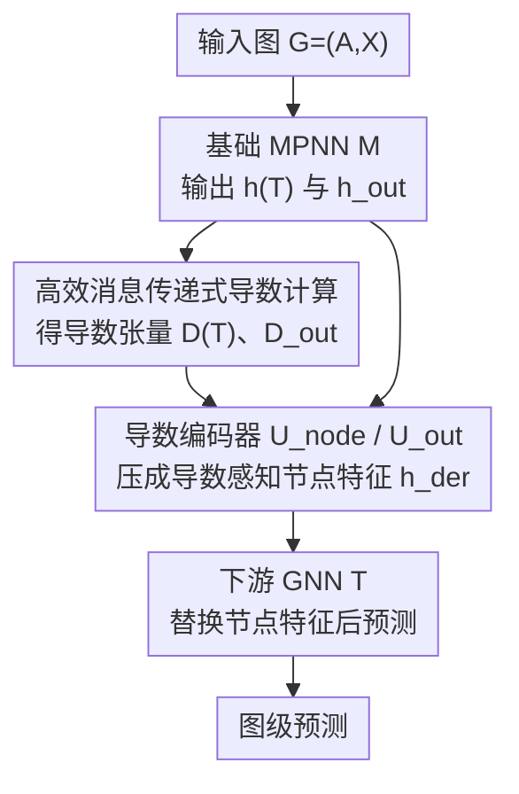

# On The Expressive Power of GNN Derivatives

**会议**: ICLR 2026  
**OpenReview**: [https://openreview.net/forum?id=Tvat33IDmK](https://openreview.net/forum?id=Tvat33IDmK)  
**代码**: 无  
**领域**: 图学习 / GNN 表达力理论  
**关键词**: GNN 表达力, 节点导数, Weisfeiler-Lehman 层级, 子图 GNN, 消息传递

## 一句话总结
本文发现把一个基础 MPNN 对输入节点特征的高阶导数当作额外结构特征喂给下游 GNN，能严格提升表达力，由此提出 HOD-GNN，理论上对齐 WL 层级、与子图 GNN 和随机游走结构编码深度等价，并配套一个利用图稀疏性的可微分消息传递式导数计算算法，在七八个图基准上稳定进前二档且能扩展到子图 GNN 跑不动的大图。

## 研究背景与动机

**领域现状**：GNN 表达力研究和 GNN 导数分析长期是两条平行的线。一条线围绕"如何让 GNN 更强"，由于标准消息传递网络（MPNN）的判别能力上界是 1-WL 图同构测试，无法区分一些简单的非同构图，于是衍生出大量更具表达力的架构（子图 GNN、高阶 IGN 等），并按表达力组织成层级。另一条线研究 GNN 的导数 $\partial h_v^{(T)}/\partial X_u$、$\partial^2 h_{\text{out}}/\partial X_v\partial X_u$，它们在 over-squashing（信息挤压）、over-smoothing（过平滑）分析和基于梯度的可解释性方法里被反复使用。

**现有痛点**：导数虽然在分析里无处不在、显然编码了有价值的结构信息，但从来没有人把它当成"提升表达力的手段"来用。而已有的高表达力架构（子图 GNN、k-IGN）普遍存在可扩展性瓶颈——它们要么显式枚举节点子集，空间复杂度 $O(n^{k+1})$，要么在大图上必须靠采样来近似，采样既损表达力又带来优化上的随机噪声。

**核心矛盾**：表达力和可扩展性之间存在 trade-off。想更强就得显式构造高阶对象（子图集合、节点元组张量），代价是随图规模爆炸的计算开销；想省开销就只能退回到 1-WL 上界的 MPNN。

**本文目标**：找到一种既能突破 1-WL、又能利用图稀疏性保持高效的表达力增强机制，并把它放进 WL 层级里给出精确刻画。

**切入角度**：作者观察到"给节点打标记"（marking，给某个节点加唯一标识符再过 MPNN）是已知能提升表达力的技巧，而打标记本质是对节点特征做一个离散扰动 $X+\epsilon e_v$。如果把扰动幅度 $\epsilon$ 取到无穷小并对输出做泰勒展开，展开系数恰好就是各阶导数——也就是说，导数天然等价于"无穷小标记"的效果。

**核心 idea**：用基础 MPNN 的高阶节点导数代替显式的离散打标记，把这些导数编码成结构感知的节点特征，再过一个下游 GNN，从而在不显式枚举子图的前提下获得等价于打标记/子图 GNN 的表达力增益。

## 方法详解

### 整体框架
HOD-GNN（High-Order Derivative GNN）的核心是一条四步可微分流水线：先用一个基础 MPNN $M$ 跑一遍图，得到节点表示 $h^{(T)}$ 和图级输出 $h_{\text{out}}$；同时计算这些量对输入节点特征的各阶导数张量；再用两个编码器网络 $U_{\text{node}}$、$U_{\text{out}}$ 把导数张量压成"导数感知的节点特征"，与基础 MPNN 的原输出拼接；最后把图的节点特征替换成这些增强特征，交给下游 GNN $T$ 输出最终预测。整条链路（含导数计算本身）都可微，因此可端到端训练。

1-HOD-GNN 只对单个节点求导（形如 $\partial^\alpha h_v^{(T)}/\partial X_u^\alpha$）；k-HOD-GNN 推广到对 $k$ 个不同节点的混合偏导，表达力随 $k$ 升高但计算更重。注意这里的 $k$ 指"求导涉及几个不同节点"，不是导数总阶数。

### 关键设计

**1. 用无穷小导数代替离散打标记：表达力提升的理论来源**

这一步回答"凭什么导数能让 MPNN 变强"。已知的打标记技巧是选一个节点 $v$、把它的特征改成 $X+\epsilon e_v$ 再过 MPNN，输出 $h^*=M(A,X+\epsilon e_v)$，这能区分一些 1-WL 区分不了的图。作者指出，若激活函数是解析的，那么 $M$ 本身解析，输出可对 $\epsilon$ 做泰勒展开：

$$M(A,X+\epsilon e_v)\approx\sum_{i=0}^{m}\frac{\partial^i h_{\text{out}}}{\partial e_v^i}\cdot\epsilon^i$$

也就是说，只要拿到基础 MPNN 的高阶导数，就能以任意精度逼近"打标记后的输出"——导数严格扩展了 MPNN 的表达力。一个直观例子：取 $M(A,X)=A^3X$（三层恒等激活 GCN 可实现），节点 $v$ 的输出对自身特征的导数恰好是 $A^3_{v,v}$，而 $\sum_v A^3_{v,v}/6$ 正是图中三角形的个数——这是标准 MPNN 永远数不出来的子结构。导数因此把"分析里反复出现、显然有用的量"直接变成了表达力工具。

**2. 导数张量与双编码器：把不同形状的导数变回节点特征**

光有导数还不够，得把它整理成下游 GNN 能吃的节点特征。本文定义两个导数张量：输出级 $D_{\text{out}}[u,i,j,\alpha]=\partial^\alpha h_{\text{out},i}/\partial X_{u,j}^\alpha$ 按单个节点 $u$ 索引，结构上就是一个节点特征矩阵；节点级 $D^{(t)}[v,u,i,j,\alpha]=\partial^\alpha h_{v,i}/\partial X_{u,j}^\alpha$ 按节点对 $(v,u)$ 索引，结构上和邻接矩阵一样是成对的。针对这两种形状，作者用了两个不同的编码器：$U_{\text{out}}$ 是一个 DeepSets 更新，直接把 $D_{\text{out}}[v,\dots]$ 展平后过 MLP；$U_{\text{node}}$ 则因为输入是成对张量、形同带边特征的邻接矩阵，用 2-IGN（2 阶不变图网络）来吸收全局交互。最终的导数感知特征是三者拼接：

$$h^{\text{der}}_v=h_v^{(T)}\oplus U_{\text{out}}(D_{\text{out}})\oplus U_{\text{node}}(D^{(T)})$$

有意思的是实验里把 $U_{\text{out}}=0$ 几乎不影响结果，说明真正出力的是节点级成对导数；保留 $U_{\text{out}}$ 只是为了形式完整。

**3. 消息传递式高阶导数算法：让导数计算既可微又稀疏**

朴素地数值求高阶导数既不可微也不可扩展。本文给出一个解析的、像消息传递一样的算法（以 GIN 为例）。关键是把 GIN 的节点更新拆成两半：聚合 $\tilde h_v^{(t-1)}=(1+\epsilon)h_v^{(t-1)}+\sum_{u\in N(v)}h_u^{(t-1)}$ 和 DeepSets 式更新 $h_v^{(t)}=\text{MLP}(\tilde h_v^{(t-1)})$。第一个观察是聚合是线性组合，所以 $\tilde h$ 的导数也是各节点导数的同样线性组合：$D(\tilde h^{(t-1)})[v,\dots]=(1+\epsilon)D^{(t-1)}[v,\dots]+\sum_{u\in N(v)}D^{(t-1)}[u,\dots]$，这一步完全复用 GIN 的稀疏聚合。第二个观察是 MLP 逐节点作用，可用 Faà di Bruno 公式（复合函数高阶导）从 $\tilde h$ 的导数算出 $h^{(t)}$ 的导数。两步交替迭代即得 $D^{(T)}$。

这个算法的两大好处：一是全程解析、对 $M$ 的权重可微，因此能反向传播穿过导数计算本身，实现端到端训练；二是消息传递结构天然吃稀疏性——初始 $D^{(0)}$ 只在 $v=u,\,\alpha=1$ 处非零、极度稀疏，每层非零项只随"首次交换消息的节点对数"增长。对浅层基础 MPNN 或稀疏图，$D^{(t)}$ 始终稀疏，这正是 HOD-GNN 能扩展到大图的根因。

**4. k-HOD-GNN：用混合偏导爬上更高的 WL 阶**

1-HOD-GNN 只用单节点导数，表达力有上限。k-HOD-GNN 改用对 $k$ 个不同节点的混合偏导 $\partial^{\alpha_1+\cdots+\alpha_k}h_v/\partial X_{u_1}^{\alpha_1}\cdots\partial X_{u_k}^{\alpha_k}$，构成一个 $k$ 索引的导数张量 $D_k(h)\in\mathbb{R}^{n\times n^k\times d'\times m^k}$，捕捉"同时扰动 $k$ 个节点"带来的高阶结构交互。编码器相应升级为 $(k{+}1)$-IGN 和 $k$-IGN，最终特征 $h^{\text{der}}_v=\text{MLP}\big(h_v^{(T)}\oplus U_{\text{node}}(D_k^{(T)})_v\oplus U_{\text{out}}(D_k^{\text{out}})_v\big)$。$k$ 越大表达力越强、代价越高，相当于在表达力—算力轴上给了一个可调旋钮。

### 损失函数 / 训练策略
全模型端到端训练，导数计算因可微而和上下游 GNN 一起优化。一个关键超参是最大导数阶 $m$（Definition 3.1）：实验显示增大 $m$ 持续增强表达力直到饱和，$m\in\{2,3,4\}$ 在实践中已足够；$m=1\dots4$ 时训练曲线稳定、导数张量范数相对基础 MPNN 输出范数保持良好。此外作者用一个略改的权重初始化，使一阶导数恰好等于随机游走结构编码（RWSE），让 HOD-GNN 充当 RWSE 的"可学习扩展"。

## 实验关键数据

### 主实验
在 ZINC 与 OGB 分子任务上，HOD-GNN 是唯一一个在所有任务都稳进前两档的模型（同色为统计上不可区分）。

| 数据集 | 指标 | HOD-GNN | 代表性对手 |
|--------|------|---------|-----------|
| ZINC-12K | MAE ↓ | 0.0666±0.0035 | MOSE 0.062 / Subgraphormer 0.063 / GPS 0.070 |
| molbace | ROC-AUC ↑ | 82.10±1.45 | Subgraphormer 84.35 / HyMN 81.16 |
| moltox21 | ROC-AUC ↑ | 77.99±0.71 | GraphViT 78.51 / HyMN 77.82 |
| molhiv | ROC-AUC ↑ | 80.86±0.52 | HyMN 81.01 / SUN 80.03 |

在 LRGB 的 Peptides 大图任务上，全量子图 GNN 在标准硬件上根本跑不动、必须采样，而 HOD-GNN 无需采样直接处理，并超过所有采样版子图 GNN：

| 模型 | Peptides-func AP ↑ | Peptides-struct MAE ↓ |
|------|-------------------|----------------------|
| HOD-GNN | 69.68±0.56 | 0.2450±0.0011 |
| HyMN（子图采样） | 68.57±0.55 | 0.2464±0.0013 |
| GraphViT | 69.19±0.85 | 0.2474±0.0016 |
| GCN+RWSE | 60.67±0.69 | 0.2574±0.0020 |

### 消融与合成实验

| 配置 / 实验 | 关键结果 | 说明 |
|------|---------|------|
| 数三角/小子结构 | 全部数对 | ReLU 一阶导即严格强于 MPNN+RWSE（验证 Thm 4.3） |
| BREC 正则图对（3-WL 区分不了的 90 对） | 2-HOD-GNN 区分 34/90 | 跻身最强模型之列，验证 Thm 4.1 高阶优势 |
| 1-HOD-GNN vs DS-GNN | 表现相当 | 与"1-HOD ≈ 子图 GNN"理论一致 |
| 导数阶 $m$ 扫描 | 单调增后饱和 | $m\in\{2,3,4\}$ 已够 |
| $U_{\text{out}}=0$ | 结果几乎不变 | 出力的是成对节点级导数 |

### 关键发现
- **理论定位清晰**：任何 $k$-OSAN 子图 GNN 可被 $k$-HOD-GNN 任意精度逼近，$k$-HOD-GNN 又可被 $(k{+}2)$-IGN 逼近；推论是它能区分 $k$-FWL 区分不了的图，但被 $(k{+}1)$-FWL 区分不了的图它也区分不了——精确地把 HOD-GNN 钉在 WL 层级上。
- **稀疏带来可扩展性**：浅层基础 MPNN（$d^T<n$）时，$k$-HOD-GNN 空间 $O(n\cdot\min\{n^k,d^{kT}\})$、时间 $O(d\cdot n\cdot\min\{n^k,d^{k(T-1)}\})$，优于 $k$-OSAN 的 $O(n^{k+1})$ 和 $(k{+}1)$-IGN；深层时三者复杂度相当。
- **表达力没换来过拟合**：在 OGB 上 HOD-GNN 的训练—测试 gap 比更弱（GIN/GCN）和更强（DSS-GNN）的基线都小，泛化良好。

## 亮点与洞察
- **把"分析工具"翻译成"表达力工具"**：导数一直是 over-squashing/可解释性里的分析量，本文第一次把它当作提升表达力的输入特征——这种跨子领域的概念迁移很漂亮，且有泰勒展开≈打标记的严格支撑。
- **导数即无穷小标记**：离散打标记是"有限扰动"，导数是"无穷小扰动的展开系数"，二者在解析激活下等价。这个视角把一个看似工程性的技巧抬升成了连续的、可微的、可学习的对象。
- **稀疏导数张量的消息传递算法可复用**：用 Faà di Bruno 公式 + 线性聚合把高阶导数计算改写成稀疏消息传递，既保可微又吃稀疏性，这套思路可迁移到任何需要在图上算高阶导数的场景（如二阶优化、影响函数）。

## 局限与展望
- 作者承认实际效率高度依赖稀疏矩阵运算的实现质量，更优化的实现还能进一步提升可扩展性。
- HOD-GNN 在"深层基础 MPNN + 小隐藏维"时表现很好，暗示导数与 over-squashing/over-smoothing 之间有更深的联系，但本文没有展开，留作未来工作。
- 自己的观察：理论保证依赖解析激活函数（如逼近 $k$-OSAN 那部分），而实践中常用 ReLU，二者之间的表达力差距虽有 Thm 4.3 部分弥合，但完整的 ReLU 版表达力刻画仍不完整；此外混合导数随 $k$ 的计算成本仍可能在稠密大图上失控（$d^T>n$ 时退化回 $O(n^{k+1})$）。

## 相关工作与启发
- **vs 子图 GNN（OSAN / DS-GNN / Subgraphormer）**：它们显式枚举节点子集/元组来增强表达力，本文用导数隐式达到等价表达力（$k$-HOD ≈ $k$-OSAN），但靠稀疏导数张量避开了 $O(n^{k+1})$ 的显式枚举，因此能扩展到子图 GNN 跑不动的大图。
- **vs 结构编码（RWSE / LapPE / GPSE / MOSE）**：这些把预定义的位置/结构编码拼到节点特征上，本文证明合适初始化下一阶导数就等于 RWSE，且 HOD-GNN 严格强于"MPNN+RWSE"，相当于把固定编码升级成可端到端学习的导数编码。
- **vs 打标记 GNN（marking）**：打标记用离散扰动选节点，本文用无穷小扰动（导数）逼近其效果，既保留表达力增益，又把离散、不可微的操作变成连续可微、可学习的形式。

## 评分
- 新颖性: ⭐⭐⭐⭐⭐ 首次把 GNN 导数从分析工具变成表达力工具，且有泰勒展开≈打标记的严格连接
- 实验充分度: ⭐⭐⭐⭐ 覆盖 7-8 个真实基准 + 合成数子结构 + BREC，理论与实验对齐，但缺更大规模/更多任务类型
- 写作质量: ⭐⭐⭐⭐ 理论与直觉example穿插得当，但大量细节压在附录、正文偏紧
- 价值: ⭐⭐⭐⭐⭐ 给"表达力—可扩展性"trade-off 提供了新的、稀疏友好的解法，并把多条研究线（导数分析/子图 GNN/结构编码）统一起来

<!-- RELATED:START -->

## 相关论文

- [\[ICLR 2026\] GNN-as-Judge: Unleashing the Power of LLMs for Graph Learning with GNN Feedback](gnn-as-judge_unleashing_the_power_of_llms_for_graph_learning_with_gnn_feedback.md)
- [\[ICLR 2026\] On the Expressive Power of GNNs for Boolean Satisfiability](on_the_expressive_power_of_gnns_for_boolean_satisfiability.md)
- [\[ICLR 2026\] Exchangeability of GNN Representations with Applications to Graph Retrieval](exchangeability_of_gnn_representations_with_applications_to_graph_retrieval.md)
- [\[ICLR 2026\] AdS-GNN - a Conformally Equivariant Graph Neural Network](ads-gnn_-_a_conformally_equivariant_graph_neural_network.md)
- [\[ICLR 2026\] On the Universality and Complexity of GNN for Solving Second-order Cone Programs](on_the_universality_and_complexity_of_gnn_for_solving_second-order_cone_programs.md)

<!-- RELATED:END -->
