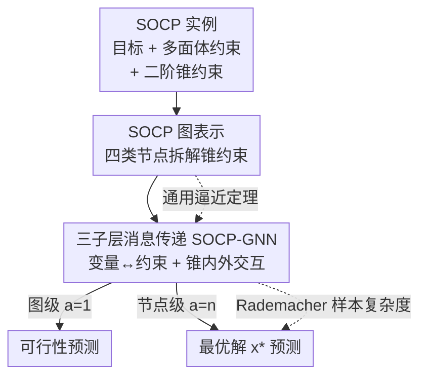

# On the Universality and Complexity of GNN for Solving Second-order Cone Programs

**会议**: ICLR 2026  
**OpenReview**: [https://openreview.net/forum?id=wFttcDu6Fr](https://openreview.net/forum?id=wFttcDu6Fr)  
**代码**: 待确认  
**领域**: 图学习 / 学习优化（Learning-to-Optimize）  
**关键词**: 图神经网络, 二阶锥规划, 通用逼近, 样本复杂度, Weisfeiler-Lehman

## 一句话总结
本文为二阶锥规划（SOCP）设计了一种把非线性锥约束拆解成四类节点的图表示与配套的三子层消息传递 GNN，证明了它对 SOCP 可行性与最优解的通用逼近能力，并首次给出 WL 类 L2O-GNN 基于 Rademacher 复杂度的样本复杂度界；实验中以远少于全连接网络的参数（500 维问题上 0.35Mb vs 110Mb，约 300× 压缩）取得更高预测精度。

## 研究背景与动机
**领域现状**：学习优化（L2O）希望用神经网络在实时场景下快速求解优化问题。近几年大家发现把优化问题建模成图、用 GNN 求解特别合适——线性规划（LP）可以建成「变量节点 + 约束节点」的二部图，借助参数共享在 GPU 上高效训练，并已有通用逼近的理论保证；这一套 WL（Weisfeiler-Lehman）框架随后被推广到二次规划（QP）和凸二次约束 QP（QCQP）。

**现有痛点**：理论保证一路只走到了凸二次约束，再往上的更一般凸问题——尤其是二阶锥规划（SOCP）——还是空白。SOCP 的约束形如 $\|A_i x + b_i\|_2 \le c_i^\top x + d_i$，是一个**线性部分和非线性范数混在一起**的混合结构，怎么把这种约束编码进图、又怎么让消息传递刻画线性项与范数项之间的耦合，是一个开放难题。

**核心矛盾**：一个看似自然的想法是把 SOC 约束两边平方变成二次约束，从而复用 QCQP 的工作，但作者指出这条路有两个硬伤：(i) 平方后的系数矩阵 $A^\top A - cc^\top$ 不一定半正定，得到的是非凸二次约束，旧理论直接失效；(ii) 这个矩阵往往是稠密的，丢掉了 $A$、$c$ 原本的稀疏/低秩结构，图表示和消息传递都变低效。

**本文目标**：直接为 SOCP 设计图表示与 GNN，要求 (a) 对可行性、最优解等关键属性有通用逼近保证；(b) 能自然延伸到任意 $p\ge 1$ 的 $p$-阶锥；(c) 给出泛化所需的样本量分析。

**切入角度**：与其平方破坏结构，不如**保留**锥约束内部的线性关系——$A_i$ 与 $x$、$c_i$ 与 $x$ 各自都是线性的，只有范数那一层是非线性。于是把约束的左端（范数内分量）和右端（线性上界）拆成不同的节点，分别和变量做线性交互，再用额外的边把左右两端连起来。

**核心 idea**：用「分层四节点图表示 + 三子层消息传递」把非线性锥约束**分解成可被 GNN 高效处理的线性组件**，从而把 WL-GNN 的通用逼近与泛化理论第一次推到锥规划。

## 方法详解

### 整体框架
方法要解决的是：给定一个 SOCP 实例（目标 $\min_{l\le x\le r} e^\top x$，受多面体约束 $Fx\le g$ 与 $m$ 个二阶锥约束 $\|A_ix+b_i\|_2\le c_i^\top x+d_i$），预测它的关键属性——是否可行（图级标量输出）或最优解 $x^*$（节点级向量输出）。整体流程是：把实例编码成一张含四类节点的 SOCP-图 → 嵌入层把节点特征映射到隐空间 → 堆叠 $T$ 个消息传递层（每层三个子层）让信息在变量与各类约束节点间流动 → 读出层聚合得到预测。在此基础上，论文从理论上证明这套架构对目标映射具有通用逼近能力，并推导其样本复杂度。

### 关键设计

**1. SOCP 分层图表示：把非线性锥约束拆成线性组件**

针对「线性 + 范数混合结构难以入图」这个核心痛点，作者不做平方，而是把锥约束 $\|A_ix+b_i\|_2\le c_i^\top x+d_i$ 沿着它内部的线性关系切开，得到四类节点：变量节点 $V_1=\{v_j\}$（特征为目标系数与上下界 $(e_j,l_j,r_j)$）、多面体约束节点 $V_2=\{s_k\}$（特征 $g_k$）、**次锥约束节点** $V_3=\{o_{il}\}$（第 $i$ 个锥约束范数内第 $l$ 个分量，特征 $b_{i,l}$，对应左端 $A_ix+b_i$）、**主锥约束节点** $V_4=\{q_i\}$（特征 $d_i$，对应右端 $c_i^\top x+d_i$）。边权直接取原始系数：$v_j$–$s_k$ 边权 $F_{kj}$，$v_j$–$o_{il}$ 边权 $A_{i,lj}$，$v_j$–$q_i$ 边权 $c_{i,j}$，而 $o_{il}$–$q_i$ 之间用常数权 1 连接，把同一个锥约束的左右两端绑在一起。

这样设计的关键在于：变量与 $V_3$、$V_4$ 的交互各自都是线性的（可以像 LP 一样用边权编码），唯一的非线性——$\ell_2$ 范数——被局部化在 $V_3$ 到 $V_4$ 的聚合里。相比平方成 QCQP，这种分解既不破坏凸性（不会引入非半正定矩阵），又保留了 $A_i$、$c_i$ 的稀疏/低秩结构。作者进一步指出反向也成立：凸 QCQP 约束 $x^\top Qx+c^\top x+d\le 0$ 可经 $Q=LL^\top$ 分解重写成 SOC 约束 $\big\|[(1+c^\top x+d)/2;\,L^\top x]\big\|_2 \le (1-c^\top x-d)/2$，当 $Q$ 低秩（$r\ll n$）时图规模反而更小——于是一个 $n$ 变量、$m$ 个二次约束的凸 QCQP 等价于 $n{+}1$ 变量、$m{+}1$ 个锥约束的 SOCP。

**2. 三子层消息传递：让范数项的左右两端协同更新**

普通 MPNN/GIN 只按邻接关系一视同仁地传消息，无法区分「变量→约束」「锥内左端↔右端」这些异质交互。本设计把每个消息传递层拆成**三个有顺序的子层**，对应锥约束被拆开后的信息流：

- 子层一（$V_1\to V_2+V_3+V_4$）：所有约束节点从变量节点收集消息更新自己，多面体节点得到 $h_{t+1,s}$，锥的左右端节点先得到中间态 $\bar h_{t,n}$；
- 子层二（$V_3\leftrightarrow V_4$）：主锥节点 $q$ 聚合其次锥分量 $o$ 得到 $h_{t+1,q}$，次锥节点 $o$ 再回读更新后的 $q$ 得到 $h_{t+1,o}$——这一步正是用来刻画范数内分量与线性上界之间的非线性耦合；
- 子层三（$V_2+V_3+V_4\to V_1$）：变量节点 $v$ 汇总三类约束的最新消息更新 $h_{t+1,v}$。

每个子层都用各自的可学习函数 $f^t_l,g^t_l$，边权 $w_{ij}$ 取自图表示。读出层 $f_{out}$ 接收最后一层节点嵌入与四类节点的全局求和 $I_1,\dots,I_4$：图级输出（$a=1$）用于可行性 $y=f_{out}(I_1,I_2,I_3,I_4)$，节点级输出（$a=n$）用于最优解 $y_i=f_{out}(h_{T,v_i},I_1,\dots,I_4)$。由于学习函数是逐特征作用、与节点/边数无关，模型显存随问题规模近似恒定。在凸 QCQP 子类上，该架构的节点数为 $O(n+\sum_i r_i)$、消息传递复杂度为 $O(n\cdot\sum_i r_i)$，与专为 QCQP 设计的 SOTA 同阶（见下表）。

**3. SOCP-WL 分离性 + 通用逼近定理：架构表达力的理论根基**

设计 1、2 给出的是一个具体架构，本设计回答「它到底能不能逼近想要的映射」。作者先把经典 WL 同构测试改造成 **SOCP-WL 测试**（Algorithm 1），并证明 Theorem 1：若两个 SOCP 实例的图 $G,\hat G$ 无法被 SOCP-WL 区分，则对任意目标映射 $\Phi$（可行性 $\Phi_{feas}$ 或最优解 $\Phi_{sol}$，多解时取 $\ell_2$ 范数最小者），都有 $\Phi(G)=\Phi(\hat G)$（至多差一个置换）。也就是说 SOCP-WL 的分离力足够细，不会把属性不同的实例混为一谈。在此基础上 Theorem 2 给出通用逼近：对 SOCP 图空间上任意 Borel 正则概率测度 $P$、任意目标映射 $\Phi$ 和任意 $\delta,\epsilon>0$，都存在一个 SOCP-GNN $F$ 使得

$$P\{\,\|F(G_{SOCP})-\Phi(G_{SOCP})\|>\delta\,\}<\epsilon.$$

证明的整体骨架沿用 LP 的做法，但难点在非线性 SOC 约束——作者利用 $\ell_2$ 范数的等变性、凸性与可分性这三条性质把表达力建立起来，且因为这些核心引理对 $\ell_p$ 范数同样成立，所以无需改架构就能延伸到任意 $p\ge 1$ 的 $p$-阶锥规划。

**4. 基于 Rademacher 复杂度的样本复杂度界：第一份 WL-L2O 泛化分析**

光有表达力还不够，实际部署要知道「训练多少样本才能在新实例上表现好」。在 GNN Lipschitz（常数 $\le L$）、参数落在半径 $r_i$ 的球内、问题总维度为 $N$ 的假设下，Theorem 3 给出泛化界：以至少 $1-\delta$ 概率，经验风险最小化解 $\hat h_S$ 相对总体最优 $h^*$ 满足

$$L_D(\hat h_S)-L_D(h^*)\le C_{task}\cdot B(m,N,L,r)+2p\sqrt{2\log(1/\delta)/m},$$

其中复杂度项

$$B(m,N,L,r)=\inf_{\epsilon\in[0,r/2]}\Big[4\epsilon+\tfrac{12}{\sqrt m}\int_{\epsilon}^{r/2} C(v)\,dv\Big],$$

$$C(v)=\sqrt{\Big(\tfrac{4Lr_i+v}{v}\Big)^{N}\Big(1-\big(1-\min((\tfrac{v}{2Lr_i})^N,1)\big)^m\Big)\log\!\Big(\tfrac{2r}{v}+2\Big)}.$$

任务相关常数为图级预测 $C_{task}=4q$、节点级预测 $C_{task}=4\sqrt{2n}\,q$（$q$ 为损失对第一参数的 Lipschitz 常数，$p$ 为损失上界，$n$ 为变量数）。这个界直接读出：样本复杂度随 GNN 复杂度 $L$ 或问题维度 $N$ 增大而恶化。条件对 margin loss、MSE loss 等常见损失都满足。作者还指出（Remark 4）对连续参数的 SOCP，VC 维与伪维往往是无穷的，因此必须改用这种基于 Rademacher 复杂度、能处理连续特征空间的工具；且整套分析（依赖 Tonelli 定理、Jensen 不等式与收缩引理）能直接推广到其他 WL 类 L2O-GNN，这是该社区第一份样本复杂度结果。

### 损失函数 / 训练策略
用 CVXPY（OPF 部分用 MOSEK）求解每个实例得到真值，做常规监督学习。最优解预测的评价用相对误差 $\|\hat x-x^*\|_2^2/\max(1,\|x^*\|_2^2)$；另在附录中测可行性二分类。为验证 Theorem 3 的 Lipschitz 假设，还用投影优化法显式控制 GNN 的 Lipschitz 常数 $L$。

## 实验关键数据

### 主实验
对比对象：全连接网络 FCNN（验证图结构相对普通 NN 的价值）、vanilla MPNN 与 GIN（与本文同一张图，但只按邻接关系传消息，验证三子层机制的价值）。已有 QCQP-GNN 既无公开实现、又对 SOCP 无通用逼近保证，故不直接比。

| 场景 | 规模 $(n,b,m)$ / 输入维度 | 现象 |
|------|------|------|
| 合成 SOCP（50/100/500 维） | 最大 500 维输入维 452,400 | SOCP-GNN 在训练/验证集相对误差均最低，三种尺度全面领先 |
| 500 维合成 SOCP（参数量） | 0.35Mb（本文）vs 110Mb（FCNN） | 精度更高且参数量约 **300× 压缩** |
| SoC-OPF 真实电网 | IEEE 118–500 bus，最大 $(2182,3454,2181)$ | 各规模误差更低、参数远少于 FCNN，稀疏结构下表现优于随机实例 |

理论复杂度对比（凸 QCQP，$m$ 个二次约束、秩 $r_i\le n$）：

| 方法 | 节点数 | 消息传递复杂度 |
|------|--------|----------------|
| Wu et al., 2024 | $O(n^2+m)$ | $O(n^3+mn^2)$ |
| Chen et al., 2024b | $O(mn)$ | $O(mn^2)$ |
| 本文 SOCP-GNN | $O(n+\sum_i r_i)$ | $O(n\cdot\sum_i r_i)$ |

### 消融实验

| 配置 | 关键现象 | 说明 |
|------|---------|------|
| SOCP-GNN（完整） | 误差最低 | 图结构 + 三子层消息传递 |
| vs FCNN | 误差显著更高、参数暴涨 | 验证图表示的价值 |
| vs MPNN / GIN（同图） | 明显落后于 SOCP-GNN | 仅靠邻接传消息不够，三子层机制是关键 |
| 隐层尺寸 / 样本数 ↑ | 训练与验证损失同步下降 | 与 Theorem 3 一致 |
| Lipschitz 常数 $L$ ↓ | 泛化间隙缩小 | 验证 Theorem 3 的 $L$ 依赖 |

### 关键发现
- 三子层消息传递是性能主因：同一张图下，去掉它退化成 MPNN/GIN 会明显掉点，说明「变量↔约束 + 锥内外协同」的异质流动不可或缺。
- 参数效率极高：500 维问题上以 0.35Mb 击败 110Mb 的 FCNN，源于充分利用了 SOCP 天然的稀疏图结构；且因学习函数逐特征作用，显存随问题规模近似恒定。
- 真实电网（稀疏）比随机合成实例表现更好，在预测误差与推理时间上都更优，凸显实用潜力。
- 泛化界得到经验验证：增大隐层/样本损失下降、降低 $L$ 泛化间隙收窄，理论与实验吻合。

## 亮点与洞察
- 「拆而不平方」的图设计很巧：通过把锥约束左右端拆成 $V_3$/$V_4$ 两类节点并用常数边相连，把唯一的非线性局部化，既保凸性又保稀疏/低秩，绕开了 QCQP 平方法的两个硬伤。
- 同一套图与 GNN 不改结构就覆盖 LP / QP / 凸 QCQP / SOCP 乃至任意 $p$-阶锥，因为表达力证明只依赖 $\ell_p$ 范数的等变性、凸性、可分性——这种「靠范数性质而非具体 $p$」的论证方式可迁移。
- 首次为 WL 类 L2O-GNN 给出基于 Rademacher 复杂度的样本复杂度界，并解释了为何此处不能用 VC/伪维（连续参数下为无穷），方法论上填补了空白。

## 局限与展望
- 泛化界依赖 GNN 的 Lipschitz 假设与参数有界球，且复杂度项 $B$ 随维度 $N$ 指数式因子 $(\cdot)^N$ 增长，对高维问题的界可能偏松。
- 只比了 FCNN / MPNN / GIN，未与已有 QCQP-GNN 直接对比（因无公开实现且对 SOCP 无保证），对 SOTA L2O 求解器的实证定位仍有空缺。
- OPF 用的是 SOC 松弛（对辐射网精确、对网状网近似），未直接处理非凸 AC-OPF；作者将「把通用性保证推广到非凸 AC-OPF」列为重要未来方向。
- 预测最优解多解时取 $\ell_2$ 最小者，实际部署是否需要后续投影/可行性修复未深入讨论。

## 相关工作与启发
- **vs Chen et al., 2022b/2023（LP-GNN）**: 他们建立了 LP/MILP 的二部图与通用逼近，本文沿用其证明骨架，但把节点类型从两类扩到四类、并补上非线性锥约束的处理与泛化分析。
- **vs Chen et al., 2024b / Wu et al., 2024（QCQP-GNN）**: 他们用动态边更新或增广二次变量节点处理凸二次约束；本文证明凸 QCQP 可低成本重写为 SOCP，从而以更小图覆盖其子类，且节点/消息复杂度同阶。
- **vs Algorithm-Unrolling 类 L2O**: AU 把特定算法迭代映射到 GNN 层，表达力受算法本身上限制约；本文走 WL 路线，表达力由 WL 分离性与逼近定理直接保证，不绑定具体求解算法。

## 评分
- 新颖性: ⭐⭐⭐⭐⭐ 首个带通用逼近保证的 SOCP-GNN，并给出 WL-L2O 首份样本复杂度界。
- 实验充分度: ⭐⭐⭐⭐ 合成 + 真实电网、含参数效率与复杂度验证，但缺与 QCQP-GNN 等 SOTA 的直接对比。
- 写作质量: ⭐⭐⭐⭐ 图设计动机（三个 Remark）讲得清楚，理论与实验衔接顺畅。
- 价值: ⭐⭐⭐⭐⭐ 把 GNN-for-optimization 的理论边界推到锥规划，并连接到 OPF 等现实应用。

<!-- RELATED:START -->

## 相关论文

- [\[ICLR 2026\] On The Expressive Power of GNN Derivatives](on_the_expressive_power_of_gnn_derivatives.md)
- [\[ICLR 2026\] GNN-as-Judge: Unleashing the Power of LLMs for Graph Learning with GNN Feedback](gnn-as-judge_unleashing_the_power_of_llms_for_graph_learning_with_gnn_feedback.md)
- [\[ICLR 2026\] Exchangeability of GNN Representations with Applications to Graph Retrieval](exchangeability_of_gnn_representations_with_applications_to_graph_retrieval.md)
- [\[ICLR 2026\] AdS-GNN - a Conformally Equivariant Graph Neural Network](ads-gnn_-_a_conformally_equivariant_graph_neural_network.md)
- [\[ICLR 2026\] Glance for Context: Learning When to Leverage LLMs for Node-Aware GNN-LLM Fusion](glance_for_context_learning_when_to_leverage_llms_for_node-aware_gnn-llm_fusion.md)

<!-- RELATED:END -->
