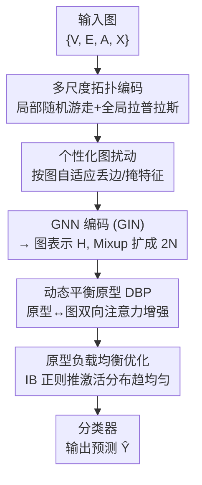

# One for Two: A Unified Framework for Imbalanced Graph Classification via Dynamic Balanced Prototype

**会议**: ICLR 2026  
**OpenReview**: [https://openreview.net/forum?id=MraQM41SNS](https://openreview.net/forum?id=MraQM41SNS)  
**代码**: https://github.com (有，原文给出 GitHub 链接)  
**领域**: 图学习 / 图分类 / 不平衡学习  
**关键词**: 不平衡图分类, 类别不平衡, 拓扑不平衡, 动态平衡原型, 信息瓶颈

## 一句话总结
UniImb 用一套"动态平衡原型 + 负载均衡正则"的统一框架，同时解决图分类里的**类别不平衡**（少数类样本太少）和**拓扑不平衡**（小图被大图淹没）两类问题，在 19 个数据集、对比 23 个基线上取得全面领先。

## 研究背景与动机

**领域现状**：图神经网络（GNN）在图分类上已经很强，但绝大多数架构默认数据是均衡的。现实里图数据往往严重失衡，主要分两类：① **类别不平衡**——少数几个类占了大部分样本，GNN 训练时偏向头部类；② **拓扑不平衡**——少数大图（节点多）贡献了大部分节点，GNN 注意力被大图吸走，在小图上表现崩塌。

**现有痛点**：现有方法**各管一边**。处理类别不平衡的路线（如 G2GNN、ImGKB 的 graph-of-graphs 框架，把每张图当作元图里的一个节点、按相似度连边来给尾部类"补数据"）能增强稀有类的表达，却忽略了图内部的结构异质性；处理拓扑不平衡的路线（如 SOLT-GNN、TopoImb，识别小图并通过重加权/增广提升其贡献）能照顾小图，却无视类别分布的倾斜。

**核心矛盾**：现实数据里这两种不平衡**是缠绕在一起的**（一张小图可能同时属于尾部类），单边方法在这种复杂场景下会失效。问题的根因在于：无论哪种不平衡，本质都是"尾部图"（少数类实例或小规模图）在训练中的影响力被多数样本压制，无法把它们的语义表达学好。

**本文目标**：设计一个统一框架，用同一套机制**同时均衡两类不平衡**，让尾部图在表示学习中获得与多数图相当的影响力。

**切入角度**：作者的关键观察是——与其分别去"补"类别或"补"拓扑，不如抽取一组**所有图共享的语义原型**，并强制每张图对这些原型的"贡献/激活"是均衡的。原型是跨图共享的，所以尾部图也能借助原型把表示补全；而只要让原型激活分布趋于均匀，多数样本就没法垄断原型，尾部图的影响力自然被拉平。

**核心 idea**：用一组可学习的**动态平衡原型（DBP）**承载共享语义，再用一个**基于信息瓶颈的负载均衡正则**把原型激活分布推向均匀，从而"一招制两患"地缓解类别与拓扑不平衡。

## 方法详解

### 整体框架
UniImb 的输入是一批图实例，输出是图级分类预测。整条管线分三段：先做**图表示学习**（多尺度拓扑编码 + 个性化扰动 + GNN），把每张图编码成向量并经 Feature Mixup 扩成 $2N$ 条；再进入**动态平衡原型（DBP）**，用一组可学习原型与图表示做双向注意力，相互感知、相互增强；最后用**负载均衡优化**约束原型激活分布趋于均匀，让尾部图的影响力被拉平，增强后的表示送入分类器出预测。

### 关键设计

**1. 多尺度拓扑编码：把局部与全局结构都喂给 GNN**

纯 GNN 靠逐层邻域聚合，难以显式感知图的整体结构属性（子图频率、连通性），这对区分不同规模/类别的图很关键。UniImb 同时编码两个尺度：**局部编码**用随机游走捕捉每个节点的局部结构，定义随机游走算子 $M^{G_i}=D^{-1}A^{G_i}$，只取节点回到自身的着陆概率，得到 $z$ 步编码 $LE^{G_i}_j=[(M^{G_i})_{j,j},(M^{G_i})^2_{j,j},\dots,(M^{G_i})^z_{j,j}]$（低复杂度且置换不变）；**全局编码**取图拉普拉斯 $L^{G_i}=D^{G_i}-A^{G_i}$ 的特征值/特征向量，经置换不变网络映射成 $GE^{G_i}=\phi([\ell(h_i,\lambda_i)+\ell(-h_i,\lambda_i)]^z_{i=1})$。两者分别注入 GIN 并各自更新（局部编码用独立 GNN 层更新），消融里去掉拓扑编码（w/o TopoEnc）掉点明显，说明结构信息让模型更好地刻画图级特征。

**2. 个性化图扰动：让尾部图和多数图被"区别对待"地增广**

传统丢边/掩特征对所有图施加**统一强度**的扰动，但在不平衡场景下，对本就难学的尾部图再加同样力度的噪声只会雪上加霜。UniImb 把扰动强度做成**依图自适应、可学习**的。以丢边为例，先算图的平均度 $d_{G_i}=2|E_{G_i}|/|V_{G_i}|$，再用一层 MLP 学出丢边概率 $a^{G_i}_e=\sigma(\text{MLP}(d_{G_i}))$，按伯努利分布 $m_e\sim B(a^{G_i}_e)$ 采样丢边掩码作用到邻接矩阵 $\tilde A^{G_i}=A^{G_i}\odot M^{G_i}_e$；特征掩码同理学出 $\beta^{G_i}_n$。这样小图/少数类图与大图/高频图被施加不同强度的扰动（图中"Weaken / Boost"），在增强数据多样性的同时不再无差别地伤害尾部图。

**3. 动态平衡原型（DBP）：用共享原型双向增强图表示**

这是框架的核心。原型定义为一组可学习嵌入 $S=[s_1,\dots,s_K]\in\mathbb{R}^{K\times d_h}$，$K\ll N$，用来紧凑地承载所有图共享的语义。DBP 分两步双向交互：**原型感知（Prototype Perception）**让原型从图数据里吸收信息——按原型与图表示的注意力系数聚合，$\tilde H_S=\text{Softmax}(\text{TopK}_1(S\tilde H^\top/\sqrt{d_h}))\tilde H W_v$，即每个原型只从最相关的 $K_1$ 张图里取语义；**原型平衡（Prototype Balance）**反过来用原型增强图表示——$\hat H=(\text{Sigmoid}(\text{TopK}_2(\tilde H S^\top/\sqrt{d_h})+\gamma))\tilde H_S$，每张图挑最相关的 $K_2$ 个原型来补全自己的表示，这里用 sigmoid 加可学习向量 $\gamma$ 生成有区分度的相似度分数（而非挤在中段）。因为原型是跨图共享的，尾部图即便自身样本稀少，也能借原型把表示补全，从而提升判别力——消融里去掉 DBP（w/o DBP）是所有变体里掉得最惨的，证明显式建模原型对处理不平衡至关重要。

**4. 原型负载均衡优化：用信息瓶颈把激活分布推向均匀**

光有原型还不够——如果多数样本垄断了原型激活，原型会被头部数据带偏、泛化变差。作者用**信息瓶颈（IB）**理论给出约束：目标 $\min I(S;G)-\beta I(S;Y)$ 中，$I(S;Y)$ 可由监督学习优化，于是核心变成**最小化原型特征与输入图集的互信息** $I(S;G)$，即降低对不平衡输入的冗余依赖。作者进一步推导出它等价于让原型激活分布 $P$ 逼近先验 $U$：$\min I(S;G)\Rightarrow\min\text{KL}(P\|U)\approx\min\frac{1}{2}\sum_k(p_k-u_k)^2$。实验比较了 Zipf / 指数 / 泊松 / 均匀四种先验，**均匀分布**（$u_k=1/K$）效果最好。由于 TopK 不可导，作者引入一个调制项 $\eta$ 注入注意力生成 $\hat H=(\text{Sigmoid}(\text{TopK}_2(\tilde H S^\top/\sqrt{d_h}+\eta))+\gamma)\tilde H_S$，并配合 stop-gradient 设计可导的约束损失 $L_M$ 迭代建模激活过程，$\eta$ 的更新近似为 $\eta\leftarrow\eta-\varphi\,\text{sgn}(n_k-2N\cdot\text{TopK}_2\cdot u_k)$——一旦某原型激活次数超过平均水平就被惩罚、降低其后续优先级，从而强制负载均衡，确保尾部图在原型学习中获得相当的影响力。消融里去掉它（w/o BalOpt）在类别不平衡数据上掉点尤其明显。

### 损失函数 / 训练策略
总目标 = 分类监督损失（增强表示 $\hat H$ 前 $N$ 行送入两层 MLP 解码器出预测 $\hat Y$）+ 负载均衡正则 $L_M$。优化器 Adam，学习率 0.001，$\varphi=0.001$，GNN 堆 $L=5$ 层，原型数 $K$ 在六个数据集上取 $\{16,16,24,24,24,32\}$。Feature Mixup（ImMix）通过随机重排图表示把 $N$ 扩成 $2N$，提升尾部图的特征多样性。

## 实验关键数据

### 主实验

类别不平衡（extreme 程度，Macro-F1 / Micro-F1，对比最优基线的提升）：

| 数据集 | 指标 | UniImb | 最优基线 | 提升 |
|--------|------|--------|----------|------|
| PROTEINS | Macro-F1 | 70.44 | 67.70 (G2GNN) | +4.05% |
| NCI1 | Micro-F1 | 80.68 | 74.91 | +7.70% |
| REDDIT-B | Macro-F1 | 76.24 | 68.39 | +11.48% |
| COLLAB | Macro-F1 | 75.73 | 64.57 | +17.28% |
| IMDB-MULTI | Macro-F1 | 33.45 | 23.62 | +41.62% |

拓扑不平衡（extreme，Macro-F1）：

| 数据集 | UniImb | 最优基线 | 提升 |
|--------|--------|----------|------|
| D&D | 74.49 | 68.67 (ImbGNN) | +8.48% |
| REDDIT-B | 77.14 | 68.41 (TopoImb) | +10.90% |
| COLLAB | 73.51 | 65.65 | +11.97% |
| IMDB-MULTI | 40.45 | 33.55 (SOLT-GNN) | +20.57% |

### 消融实验（拓扑不平衡，Macro-F1）

| 配置 | PROTEINS | D&D | NCI1 | COLLAB |
|------|----------|-----|------|--------|
| Ours（完整） | 71.3 | 74.5 | 65.0 | 73.5 |
| w/o ImMix | 69.7 | 73.3 | 63.6 | 70.3 |
| w/o TopoEnc | 67.4 | 71.9 | 60.7 | 69.4 |
| w/o Pertu | 66.2 | 60.8 | 63.8 | 67.4 |
| w/o DBP | 56.8 | 53.8 | 59.2 | 39.3 |
| w/o BalOpt | 69.8 | 73.9 | 63.2 | 67.0 |

### 关键发现
- **DBP 贡献最大**：去掉动态平衡原型（w/o DBP）是所有变体里掉点最猛的（COLLAB 从 73.5 跌到 39.3），证明共享原型是处理不平衡的核心引擎。
- **负载均衡在类别不平衡上更关键**：w/o BalOpt 在类别不平衡数据上掉点尤其明显，印证均匀激活先验对均衡尾部影响力的作用。
- **均匀先验最优**：四种先验对比里 Uniform 全面领先（如 PROTEINS Macro-F1 70.44 vs Zipf 67.80），符合"防止任一原型垄断"的直觉。
- **即插即用**：把 UniImb 接到 GIN/GCN/GraphSAGE/GraphGPS/Exphormer/Graph-Mamba 等多种骨干上都有大幅提升（如 GIN 在 REDDIT-B Macro-F1 从 33.19 → 76.24），且在 30,660 图的大规模 AirGraph 上兼顾精度与效率。
- **缠绕场景仍最优**：在类别与拓扑同时失衡的复杂场景，专攻拓扑的方法普遍弱于专攻类别的方法，而 UniImb 整体最好。

## 亮点与洞察
- **"一招制两患"的统一视角**：把类别不平衡和拓扑不平衡都归结为"尾部图影响力被压制"，用共享原型 + 均匀激活一并解决，避免了双线缝合方案的复杂度——这是最让人"啊哈"的地方。
- **IB → KL → 简单平方惩罚的推导链很漂亮**：把抽象的信息瓶颈 $\min I(S;G)$ 一路化简成可直接优化的 $\frac{1}{2}\sum(p_k-u_k)^2$，理论动机和工程实现对得上。
- **可学习的个性化扰动**：把"扰动强度"从超参变成依图自适应的可学习量，这个思路可迁移到任何需要按样本难度做数据增广的不平衡任务。
- **新数据集 AirGraph**：3 万张图、天然长尾（高污染类仅占 6.86%）的真实空气污染图数据集，给该方向补了一个大规模 benchmark。

## 局限与展望
- **超参较多**：原型数 $K$、$\text{TopK}_1/\text{TopK}_2$、$\eta$ 学习率等都需要按数据集调，$K$ 的敏感性曲线呈"先升后降"，迁移到新数据需重新搜索最优 $K$。
- **均匀先验的普适性存疑**：作者在四个数据集上验证均匀最优，但对极端长尾或多峰分布是否仍最优、是否需要可学习先验，文中未展开。
- **可导化是近似**：负载均衡靠 stop-gradient + $\eta$ 调制绕过 TopK 不可导，本质是近似优化，其与真实 KL 目标的差距缺乏量化分析（⚠️ 公式细节以原文为准）。
- 改进方向：让先验分布也可学习、或把原型数 $K$ 做成自适应，可能进一步减负调参。

## 相关工作与启发
- **vs G2GNN / ImGKB（类别不平衡）**：它们用 graph-of-graphs 把图当元图节点连边补数据，只管类别、忽略图内结构异质性；UniImb 用共享原型同时补类别和拓扑，且在多标签数据（COLLAB）上不退化。
- **vs SOLT-GNN / TopoImb / ImbGNN（拓扑不平衡）**：它们识别小图并重加权/增广，只管拓扑、无视类别倾斜；UniImb 把两类不平衡统一成"尾部图影响力"问题一并处理，在缠绕场景下明显更稳。
- **vs Graph Transformer（GraphGPS / Exphormer / Graph-Mamba）**：GT 靠全局注意力建长程依赖，但对类别标签失衡几乎无能为力；UniImb 可作为即插即用模块接在 GT 之上带来大幅提升。

## 评分
- 新颖性: ⭐⭐⭐⭐⭐ 用共享原型 + IB 负载均衡统一两类不平衡，视角新颖且自洽。
- 实验充分度: ⭐⭐⭐⭐⭐ 19 数据集、23 基线、多骨干、大规模新数据集 AirGraph，覆盖全面。
- 写作质量: ⭐⭐⭐⭐ 方法叙述清晰、理论推导完整，少数符号（$\eta$、$L_M$）稍密。
- 价值: ⭐⭐⭐⭐⭐ 即插即用、统一框架 + 新 benchmark，对不平衡图学习有实际推动。

<!-- RELATED:START -->

## 相关论文

- [\[ACL 2026\] AutoPKG: An Automated Framework for Dynamic E-commerce Product-Attribute Knowledge Graph Construction](../../ACL2026/graph_learning/autopkg_an_automated_framework_for_dynamic_e-commerce_product-attribute_knowledg.md)
- [\[ICLR 2026\] Forest-Based Graph Learning for Semi-Supervised Node Classification](forest-based_graph_learning_for_semi-supervised_node_classification.md)
- [\[ICLR 2026\] Low-Rank Few-Shot Node Classification by Node-Level Graph Diffusion](low-rank_few-shot_node_classification_by_node-level_graph_diffusion.md)
- [\[ICML 2026\] ProMoS: Generalist Graph Anomaly Detection via Prototype-Based Distillation](../../ICML2026/graph_learning/generalist_graph_anomaly_detection_via_prototype-based_distillation.md)
- [\[ICLR 2026\] Learning Posterior Predictive Distributions for Node Classification from Synthetic Graph Priors](learning_posterior_predictive_distributions_for_node_classification_from_synthet.md)

<!-- RELATED:END -->
