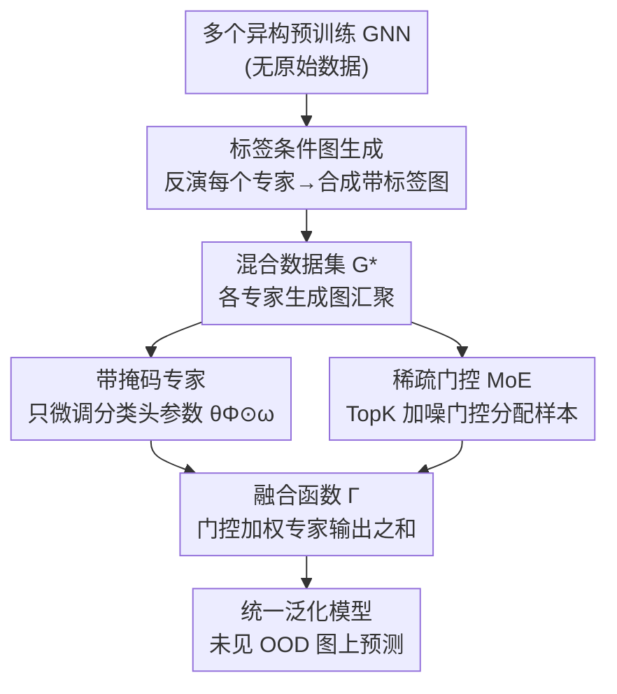

# Out-of-Distribution Graph Models Merging

**会议**: ICLR 2026  
**OpenReview**: [https://openreview.net/forum?id=93Y7jSUSpk](https://openreview.net/forum?id=93Y7jSUSpk)  
**代码**: https://github.com/siriuslay/OGMM  
**领域**: 图学习 / 模型融合 / 域泛化  
**关键词**: 图模型融合, 分布外泛化, 混合专家, 图生成, 无数据微调

## 一句话总结
本文提出 OGMM，研究"分布外图模型融合"这一新问题：在拿不到任何源/目标域数据、且各 GNN 架构可能异构的前提下，先让每个预训练 GNN 反演生成一小批带标签的合成图，再用带掩码专家的稀疏 MoE 把这些模型微调融合成一个能在未见分布上泛化的统一模型。

## 研究背景与动机
**领域现状**：图模型泛化（Graph Model Generalization, GMG）的主流做法，是把多个存在分布偏移的域的图数据**汇到一起从头训练**一个模型，靠不变特征、因果关系或风险外推来抹平域间差异，以求在未见的 OOD 图上保持鲁棒。

**现有痛点**：现实里更常见的情况是——针对相似任务、但不同数据集，**已经各自训练好了一批 GNN**（论文称之为 Out-of-Distribution Graph Models）。比如社交网络里，不同用户群、不同架构训出的模型各自抓住了一类行为模式。如图 2 所示，每个模型在自己域内表现好（如 PTC 上 GCN 自域 70.53%），一旦换到别的域就明显掉点（跌到 50% 上下），而且不同架构在不同域各有所长。要把它们统一成一个泛化模型，传统办法是重新从头训练，既复杂又浪费了已学到的知识。

**核心矛盾**：直接复用这些已训好的模型有两个绕不过去的难点：(1) 不变知识不再显式地存在于数据里，而是**隐式编码在模型参数中**，从参数里抽取域不变知识本身就很难；(2) 这些模型**架构、超参可能各不相同**，要把异构专家的本领整合进一个统一表示并不平凡。

**本文目标**：在不访问任何源/目标域原始数据、不限定 backbone 架构的条件下，把多个预训练 GNN 的知识"合并"成一个在分布偏移下仍能泛化的统一模型。

**切入角度**：作者引入**混合分布假设**——目标域分布是各源域分布的线性组合 $G_T=\sum_i \alpha_i G_i$，由此可把融合函数写成各专家的线性组合 $\Gamma=\sum_i \alpha_i f(\Theta_i)$，并借助 $\mathcal{H}\Delta\mathcal{H}$-divergence 推出泛化误差上界。这个理论框架把"融合"落到了"先抽知识、再加权组合专家"两步上。

**核心 idea**：用"模型反演生成图 + 带掩码专家的稀疏 MoE"代替"重训"，从参数里把每个专家的域知识蒸出来，再让一个轻量门控按样本动态分配、加权这些专家，从而无需原数据就拼出一个泛化模型。

## 方法详解

### 整体框架
OGMM 把"融合一堆异构预训练 GNN"拆成两个串行阶段。**第一阶段（标签条件图生成）**：把每个预训练 GNN 当作"监督者"，从随机噪声出发反演出一小批带标签的合成图，让这些图最大化原模型的认可度，从而把藏在参数里的域知识"具象"成可训练的数据；各专家生成的图汇聚成混合数据集 $G^*$。**第二阶段（专家微调与融合）**：在 $G^*$ 上训练一个 MoE 融合模块——它由稀疏门控层（对应组合权重 $\alpha$）和一组**带掩码的专家**（对应微调权重 $\omega$）组成，门控按样本把它落到合适的专家上，掩码只微调与下游强相关的少量参数，最终的预测是被掩码专家输出的门控加权和。整个框架与架构无关，且全程不碰任何真实源/目标数据。

理论侧，作者证明：在混合分布假设下，融合模型 $\Gamma$ 在目标域的泛化误差上界，等于各子学习器跨分布交叉验证误差之和；据此把目标拆成"每个模型的预训练误差 + 在新域上的微调误差 + 合并模型在生成样本上的训练误差"三项，对应到上面两阶段的具体实现。

### 关键设计

**1. 标签条件图生成：把藏在参数里的域知识"反演"成可训练数据**

第一阶段要解决的痛点是——拿不到原始数据，知识只在参数里。作者为每个预训练 GNN $f(\Theta_i)$ 配一个生成器 $P_i$：从标准正态采样节点特征 $X_i\in\mathbb{R}^{n_i\times d}$，从均匀分布采一个条件标签 $\hat y_i$ 当"伪真值"，再用一个**离散边编码器**从特征构造邻接矩阵。图的特殊难点在于结构 $A$ 通常是离散变量，难以直接做梯度反演，作者用三层 MLP 加 sigmoid 算边权 $A^i_{jk}=\sigma(\mathrm{MLP}_\theta([X^i_j;X^i_k]))$，再用 Gumbel-Softmax 把边权逼近成 $[0,1]$ 内的近似二值（温度 $\tau\to 0$ 时趋于 0/1），从而绕开离散梯度近似。生成损失除了标签条件后验损失 $C(\hat y_i,f(\Theta_i,X_i,A_i))$，还加了两个正则：一是**BN 统计匹配** $R_{bn}$，强迫生成图嵌入的均值/方差对齐预训练模型 BN 层里记录的统计量；二是**置信度正则** $R_{conf}$（生成图分类熵的负期望），确保生成图判别明确、不停留在模糊状态。合起来 $L_{gen}=\sum C(\hat y_i,f)+R_{bn}+R_{conf}$。相比只学节点特征的 Inverse-X，这里同时学特征和结构，能更好恢复域特定知识。

**2. 带掩码专家：只微调分类头，定位下游相关的"神经通路"**

把预训练 GNN 直接当专家会"水土不服"——它带着自己域的偏置。作者借鉴 mask tuning，对专家参数 $\theta^i_*$ 学一个掩码矩阵 $\omega_i$，用 Hadamard 积得到微调后的 $\hat\theta^i_*=\theta^i_*\odot\omega_i$，相当于挑出并重新加权新任务真正需要的参数、形成一条"下游相关的神经通路"。关键观察是：在 2 层 GNN 这种浅网络里，**掩码加在哪很要紧**。作者假设域特定知识高度集中在**分类头**（高维表示最容易学到域专属信息），因此只微调分类头参数最合理也最高效——实验（图 4）证实只掩分类头（MaskCL）就能拿到有竞争力的性能，而掩码规模平均只占 2 层 GNN 总参数的约 20%。这让融合既轻量又不破坏编码器里的通用知识。

**3. 稀疏门控 MoE：按样本动态分配并加权异构专家**

有了能干活的专家，还需要一个机制把样本"派"给最合适的专家并组合输出，这正是把混合分布假设落地为可学函数的地方。MoE 输出写成 $\hat H_i=\sigma(\sum_j \mathrm{Gate}(X_i)_j H_{i,j})$，门控用 TopK 稀疏选择 $\mathrm{Gate}(G_i)=\mathrm{softmax}(\mathrm{TopK}(Q(G_i),k))$，其中打分 $Q(G_i)=G_iW_g+\epsilon\cdot\mathrm{softplus}(G_iW_n)$：$W_g$ 算干净的专家选择分，$W_n$ 注入可控高斯噪声 $\epsilon\sim N(0,1)$ 以**防止专家坍缩、保证负载均衡**。整个融合函数 $\Gamma_{\omega,W_g,W_n}(G_i)=\sum_j \mathrm{Gate}(G_i)_j f(\Theta_j,\omega_j,G_i)$ 就实现了"样本—专家"的动态分配逻辑。理论上，作者证明这个带掩码的微调 MoE 正是泛化风险函数的一个近似，因此它能在混合分布构成的更宽泛化平面上覆盖未见图。

**4. 门控与掩码的双正则：既要均衡又要少改原参数**

为约束门控和掩码的优化方向，作者加了两个正则。门控用基于变异系数的重要性损失 $R_{gate}=CV(\sum_{G_i}\mathrm{Gate}(G_i))^2$，衡量"样本—专家"配对的权重离散度，鼓励权重均匀、强制所有专家负载均衡，避免门控只盯一个专家。掩码侧 $R_{mask}$ 则在"学新知识"和"少动冻结参数"之间取舍：第一项是生成图上的分类损失负责学新知识，第二项用两个阈值 $\gamma_v,\gamma_p$ 分别控制掩码的均值与方差，限制对原参数的改动幅度以防"遗忘"旧知识。合并阶段总损失 $L_{merge}=\sum C(\hat y_i,\Gamma_\Phi(G_i))+\lambda_{gate}R_{gate}+\lambda_{mask}R_{mask}$，其中 $\Phi=\{\omega,W_g,W_n\}$。

### 损失函数 / 训练策略
两阶段分别优化：第一阶段对每个生成器最小化 $L_{gen}$（标签条件后验损失 + BN 匹配 + 置信度正则），冻结预训练 GNN 只优化生成器输入与参数；第二阶段在汇聚的生成数据 $G^*$ 上最小化 $L_{merge}$，联合学习掩码 $\omega$、门控权重 $W_g,W_n$。实验中所有被融合 GNN 均为 2 层、32 维的小网络，门控 TopK 的 $k$ 是关键超参。

## 实验关键数据

### 主实验
在 MUTAG、PTC、REDDIT-B、NCI1 四个图分类数据集上，按边-点比把每个数据集切成不同密度的域（A 低密度 / B 中密度 / T 高密度测试集）模拟域偏移，用 Acc 和 Pre 衡量目标域泛化。被融合的是 GCN/GAT/GIN 三种架构在不同源域上的预训练模型。

| 方法 | REDDIT-B Acc | PTC Acc | MUTAG Acc | NCI1 Acc |
|------|------|------|------|------|
| Avg-PTM（多模型平均） | 52.47 | 50.20 | 31.48 | 56.58 |
| Ens-Prob（概率集成） | 33.65 | 50.17 | 29.84 | 58.05 |
| Uni-Soup（参数平均） | 43.26 | 50.20 | 37.40 | 48.73 |
| Greedy-Soup（贪心融合） | 47.35 | 50.17 | 31.46 | 38.64 |
| Inverse-X（仅学节点特征） | 56.21 | 50.43 | 38.75 | 62.39 |
| Multi-GFKD（多教师蒸馏） | 54.35 | 50.77 | 44.36 | 47.57 |
| **OGMM** | **76.98** | **51.21** | **45.62** | **66.84** |

OGMM 在四个数据集上全面超越单个预训练模型、集成方法、参数融合（soup 类）以及生成式基线，尤其在 REDDIT-B、NCI1 这类较大数据集上提升显著（REDDIT-B Acc 比次优的 Inverse-X 高 20 个点）。参数融合类（Uni-Soup/Greedy-Soup）表现最差，印证了对 OOD 问题"融合模型输出"比"直接平均参数"更有效。

### 消融实验

| 配置 | REDDIT-B Acc | MUTAG Acc | NCI1 Acc | 说明 |
|------|------|------|------|------|
| OGMM (Source-Free) | 76.98 | 45.62 | 66.84 | 完整模型（无原数据） |
| w/o MoE | 50.39 | 39.53 | 60.62 | 去掉门控融合 |
| w/o Mask | 31.98 | 28.28 | 51.11 | 去掉掩码专家 |
| w/o $L_{gen}$ | 41.15 | 45.31 | 52.69 | 去掉生成正则 |
| OGMM (Given Source) | 80.98 | 57.81 | 68.04 | 用真实源数据替代生成图 |

### 关键发现
- **掩码最关键**：去掉掩码后 REDDIT-B 从 76.98 暴跌到 31.98，是掉点最狠的一项，说明只微调分类头的掩码专家是把异构模型适配到新域的核心。
- **生成图能逼近真实数据**：用真实源数据（Given Source）只比用生成图（Source Free）略高（REDDIT-B 80.98 vs 76.98），证明反演生成的图确实有效蒸馏并代表了域知识，甚至有时比原数据更精炼。
- **掩码位置很重要**：MaskCL（只掩分类头）在多数据集上明显优于掩编码器（MaskNN），且掩码仅占约 20% 参数，验证了"域特定知识集中在分类头"的假设。
- **门控 TopK 的 $k$ 敏感**：作者分析了 $k=1\sim6$ 对 Acc/Pre 的影响，存在合适的稀疏度区间。

## 亮点与洞察
- **把"模型融合"建模成"先反演造数据、再 MoE 加权"**：用 BN 统计 + 置信度正则做无数据反演，把藏在参数里的隐式域知识转成可训练的合成图，巧妙绕过了"拿不到原数据"的现实约束。
- **掩码只动分类头**：用约 20% 参数的掩码定位"下游相关神经通路"，既轻量又避免破坏编码器通用表示——这个"浅网络里域知识集中在分类头"的观察很有迁移价值，可用于其它无数据微调场景。
- **理论与实现对齐**：从混合分布假设出发，把泛化误差上界拆成三项，恰好对应"预训练误差/微调误差/合并训练误差"，让 MoE+掩码不只是工程拼装，而是泛化风险函数的近似。
- **架构无关 + 无数据**：能融合 GCN/GAT/GIN 异构 backbone 且全程不碰真实数据，这套设定比传统域泛化更贴近"已有一堆现成模型想复用"的实际场景。

## 局限与展望
- 实验集中在 2 层、32 维的小型 GNN 和中小规模图分类数据集（大规模/节点级任务放在附录），更大模型、更复杂任务上的可扩展性还需进一步验证。
- 混合分布假设（目标域是源域的线性组合）是理论推导的基石，但真实分布偏移未必满足线性可加，假设不成立时泛化界是否仍紧值得关注。
- 反演生成图的质量依赖 BN 层统计——对没有 BN 或 BN 很少的架构，生成正则可能失效；且生成图数量、温度 $\tau$ 等超参对最终融合的影响需要调。
- 门控的 TopK $k$ 与掩码阈值 $\gamma_v,\gamma_p$ 等超参较多，调参成本不低。

## 相关工作与启发
- **vs 传统图域泛化（IRM / 风险外推等）**：它们从**显式数据**里学不变特征，需要把多域数据汇到一起从头训练；OGMM 从**模型参数**里抽知识，复用已训好的异构模型、无需原数据，场景更实际但抽知识更难。
- **vs Model Soup（Uni-Soup / Greedy-Soup）**：soup 类直接对参数做（加权）平均，要求模型同构且在 OOD 上表现差；OGMM 融合的是**模型输出**并按样本动态门控，能处理异构架构、对分布偏移更鲁棒。
- **vs GFKD / Inverse-X（生成式蒸馏）**：Inverse-X 只反演节点特征、用随机结构；Multi-GFKD 是 GFKD 的多教师扩展。OGMM 用离散边编码器**同时学特征和结构**，并叠加 MoE 融合，恢复域知识更完整，性能也更高。

## 评分
- 新颖性: ⭐⭐⭐⭐⭐ 首次提出"分布外图模型融合"问题，并给出无数据、架构无关的完整方案与理论界。
- 实验充分度: ⭐⭐⭐⭐ 四数据集 + 多类基线 + 充分消融，但模型/数据规模偏小，大规模验证放在附录。
- 写作质量: ⭐⭐⭐⭐ 理论推导与方法实现对应清晰，符号偏密集。
- 价值: ⭐⭐⭐⭐⭐ "复用现成异构模型而非重训"的设定贴近现实，掩码集中分类头等观察可迁移。

<!-- RELATED:START -->

## 相关论文

- [\[ICLR 2026\] Adaptive Mixture of Disentangled Experts for Dynamic Graph Out-of-Distribution Generalization](adaptive_mixture_of_disentangled_experts_for_dynamic_graph_out-of-distribution_g.md)
- [\[ICLR 2026\] Diverse and Sparse Mixture-of-Experts for Causal Subgraph–Based Out-of-Distribution Graph Learning](diverse_and_sparse_mixture-of-experts_for_causal_subgraphbased_out-of-distributi.md)
- [\[ICLR 2026\] Bridging Input Feature Spaces Towards Graph Foundation Models](bridging_input_feature_spaces_towards_graph_foundation_models.md)
- [\[ICLR 2026\] Multi-Domain Riemannian Graph Gluing for Building Graph Foundation Models](multi-domain_riemannian_graph_gluing_for_building_graph_foundation_models.md)
- [\[ICLR 2026\] Graphon Cross-Validation: Assessing Models on Network Data](graphon_cross-validation_assessing_models_on_network_data.md)

<!-- RELATED:END -->
