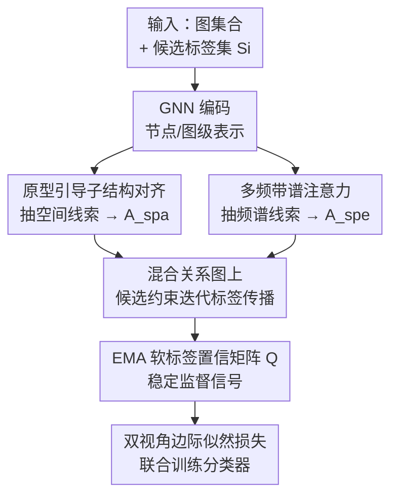

# PRISM: Partial-label Relational Inference with Spatial and Spectral Cues

**会议**: ICLR 2026  
**OpenReview**: [https://openreview.net/forum?id=m2MeiYOJED](https://openreview.net/forum?id=m2MeiYOJED)  
**代码**: 待确认  
**领域**: 图学习 / 弱监督学习 / 图分类  
**关键词**: 偏标记学习、图神经网络、谱图、标签传播、关系推理

## 一句话总结
PRISM 针对「每张图只给了一个含真值的候选标签集」的偏标记图学习问题，用原型引导的子结构对齐抽空间线索、用多频带谱注意力抽频谱线索，把两类线索拼成一张混合关系图做候选约束下的迭代标签传播，从而在多种噪声水平下都显著超过现有弱监督图分类方法。

## 研究背景与动机
**领域现状**：图分类靠 GNN（GCN/GIN/GraphSAGE 等）递归聚合邻居、全局池化得到图级表示，已在分子性质预测、生物信息、社交网络等任务上取得 SOTA。但这些框架是「数据饥渴」的——必须有精确标签才能训出判别性分类器。

**现有痛点**：现实中拿到 ground-truth 标签往往昂贵甚至不可行。比如判断化合物性质要靠 DFT 模拟，代价极高；于是人们用自动化标注工具代劳，但不同工具会给出不一致的标注，导致标签模糊（label ambiguity）。这类噪声标签会严重拖垮分类器训练，连 GraphCL 这类自监督预训练方法，到了下游分类阶段也仍依赖精确标签，遇到标签模糊性能就大幅下滑。

**核心矛盾**：本文聚焦一个实际但少有人研究的设定——偏标记图学习（Partial-label Graph Learning, PLGL）：每张图配一个候选标签集 $S_i\subset Y$，里面**包含**真值标签 $y_i^*$ 但不告诉你哪个才对。相比视觉里的偏标记学习，图上更难：① 模糊监督带来语义不确定性，难以捕捉类判别性子结构；② GNN 容易过拟合噪声信号，尤其当候选集里有语义相近的标签时；③ 图在多个结构分辨率（局部 motif 到全局拓扑）上都有模式，全局池化抓不全。已有弱监督图分类要么靠伪标签、要么靠对比学习，但都存在两个毛病：依赖过自信预测导致误差累积；缺乏对结构与谱多样性的显式利用来区分候选标签。

**核心 idea**：用「空间线索 + 频谱线索」两条互补视角，构造一张混合关系图，在候选约束下做迭代标签传播，让可靠的标签语义从噪声候选集里被逐步蒸馏出来——而不是逼模型对单个候选标签下硬判断。

## 方法详解

### 整体框架
PRISM 要解决的是「只有候选标签集、没有真值」的图分类。它给每张图配两条互补的编码路径：**空间编码器**通过跨图对齐原型引导的子结构来抽取判别性局部线索；**谱编码器**把图信号分解到多个频带、用注意力保留各频带专属语义来抽取全局结构线索。这两条路径各自诱导出一种图与图之间的关系边（一种编码原型子结构相似度 $A^{spa}$，一种编码谱亲和度 $A^{spe}$），合成一张混合关系图。随后在这张图上做**迭代标签传播**，融合两类关系信号、在候选掩码约束下逐步精炼软标签，并用动量更新的软标签置信矩阵 $Q$ 抑制噪声累积，最后用 $Q$ 作为软监督目标训练空间/频谱两个视角的分类器。

### 关键设计

**1. 原型引导的子结构对齐：用局部判别证据对抗标签模糊**

候选集里多个标签可能语义相关，只看全局图表示会把它们糊在一起（候选标签重叠的图整体拓扑往往也很像）。本文的观察是：局部子结构常常携带最具判别性的类别证据。于是 PRISM 维护一个动量更新的原型库 $\{p_c\}_{c\in Y}$，每个 $p_c$ 跟踪「候选集里含标签 $c$」的图的全局表示均值，更新规则为 $p_c^{(j)}\leftarrow m\cdot p_c^{(j-1)}+(1-m)\cdot\frac{1}{|B_c|}\sum_{i\in B_c}g_i$。再用原型引导的注意力为每张图抽出 $C$ 个与候选类对齐的子结构嵌入：$r_i^{(c)}=\sum_{v\in V_i}\alpha_{vc}\,h_v^{(L)}$，其中 $\alpha_{vc}=\frac{\exp(h_v^{(L)\top}p_c)}{\sum_{v'}\exp(h_{v'}^{(L)\top}p_c)}$，让每个嵌入对应一个候选类、具备可解释的类特异性。

在共享至少一个候选标签的图对 $P=\{(G_i,G_j)\mid S_i\cap S_j\ne\varnothing\}$ 上，定义原型感知的子结构相似度

$$s^{spa}_{ij}=\max_{c\in S_i\cap S_j}\cos\big(r_i^{(c)},r_j^{(c)}\big)\cdot\cos\Big(\tfrac{r_i^{(c)}+r_j^{(c)}}{2},\,p_c\Big).$$

它既要求两图在某候选类 $c$ 上的子结构互相像，又要求它们的均值贴近该类原型，等于把「成对一致」和「靠近类中心」同时卡住。每张图保留得分最高的 top-$k_a$ 邻居，得到稀疏邻接 $A^{spa}$，编码候选标签语义下的子结构级一致性。

**2. 多频带频谱注意力：保留频带专属语义而非把频率糊成一团**

空间模块抓的是局部，而图谱能补上全局视角——低频对应平滑、高频对应不规则。但很多谱方法把不同特征模态线性聚合成单一表示，会把结构上各异的信号混掉、抹去关键的频率特定模式。PRISM 的多频带频谱注意力显式建模「频带」：先用谐波展开把标量谱值投到可学习信号空间 $\rho(\lambda)=[\sin(k\lambda),\cos(k\lambda)]_{k=1}^K\cdot W_\rho$；为效率只取最小的 $T$ 个特征向量，每个第 $p$ 个特征向量 $u_p$ 与其谐波编码外积得到频带特异的节点表示 $X^{(p)}=u_p\otimes\rho(\lambda_p)$；共享 MLP $f_{shared}$ 处理后 READOUT 出频带级嵌入 $z^{(p)}=\text{READOUT}(f_{shared}(X^{(p)}))$。

跨频带用软注意力合成 $z=\sum_{p=1}^T\alpha^{(p)}z^{(p)}$，权重 $\alpha^{(p)}\propto\exp(a^\top\sigma(Wz^{(p)}))$，既统一又保留各频带分辨率。跨图谱推理时按频带逐一比相似度再取最大：$s^{spe}_{ij}=\max_{p\in\{1,\dots,T\}}\cos(z_i^{(p)},z_j^{(p)})$，同样只在候选集重叠的图对间连边、各图连 top-$k_e$ 邻居得到 $A^{spe}$。论文还给出 Theorem 1：在原型假设下，若两图真值标签相同，则 $A^{spa}_{ij}$ 与 $A^{spe}_{ij}$ 为 1 的概率都趋于 1（$|V_i|,|V_j|\to\infty$），从理论上保证两类关系边都服务于标签消歧。

**3. 候选约束下的迭代关系推理：把两类线索融进标签传播并抑制噪声累积**

有了 $A^{spa}$ 与 $A^{spe}$ 两类关系边，PRISM 在混合关系图上做迭代标签传播来精炼软监督。从初始标签矩阵 $Y^{(0)}$ 出发，每轮按 $\tilde Y^{(e+1)}=\mu\cdot Y^{(e)}+(1-\mu)\cdot N\big(A^{spa}Y^{(e)}+A^{spe}Y^{(e)}\big)$ 更新（$N(\cdot)$ 是行 $\ell_1$ 归一化，$\mu$ 控动量），再乘上二值候选掩码 $M$（$M_{ic}=1$ 当且仅当 $c\in S_i$）做投影 $Y^{(e+1)}=N(\tilde Y^{(e+1)}\odot M)$，保证传播结果始终落在合法候选类内。经 $E$ 轮后的 $Y^{(E)}$ 既捕捉多关系一致性、又忠于偏标记约束。

为稳住优化，再维护一个软标签置信矩阵 $Q$（在候选集上均匀初始化），用 EMA 把 $Y^{(E)}$ 慢慢吸收进来：$Q_i\leftarrow N\big(\beta\cdot Q_i+(1-\beta)\cdot Y_i^{(E)}\big)$。这种渐进更新避免了对单轮过自信预测的硬依赖，从而抑制噪声累积。论文 Theorem 2 进一步证明：在每张图节点信息充分、迭代足够多时，EMA 更新的 $Q$ 几乎必然收敛到真值 $Y_i^*$，训练损失期望趋于 0。

### 损失函数 / 训练策略
空间视角嵌入 $g$ 与频谱视角嵌入 $z$ 各接一个 MLP 分类器得到 $P^{spa}$、$P^{spe}$。每个视角的监督损失取候选集上的负边际对数似然：

$$L^{(o)}_{sup}=-\frac{1}{B}\sum_{i=1}^{B}\log\sum_{c\in S_i}P^{(o)}_{ic}Q_{ic},\quad o\in\{spa,spe\}.$$

它鼓励预测在候选集内部对齐软置信目标 $Q$。总目标为两视角联合：$L=L^{spa}_{sup}+L^{spe}_{sup}$，用双视角监督互补地捕捉图特性、实现稳健消歧。复杂度分析显示训练总开销为 $O(|E|d)$，与标准 GNN 相当（谱特征向量在预处理时算一次后全程复用）。

## 实验关键数据

### 主实验
在 ENZYMES、Letter-High、COIL-DEL、CIFAR10、COLORS-3 五个图分类基准上，按概率 $q=P(y\in S\mid y\ne y^*)$ 注入假阳性候选标签（$q$ 越大越噪）。PRISM 在所有数据集、所有噪声水平下都稳定夺冠，对第二名 DEER 优势可观，且标准差更小（更稳定）：

| 数据集 (q) | 本文 PRISM | 次优 DEER | 强基线 GraphACL | 提升(vs DEER) |
|--------|------|------|------|------|
| ENZYMES (0.3) | **63.11** | 58.22 | 54.44 | +4.89 |
| ENZYMES (0.5) | **51.33** | 47.56 | 44.89 | +3.77 |
| Letter-High (0.5) | **78.32** | 72.29 | 57.68 | +6.03 |
| COIL-DEL (0.1) | **79.48** | 68.03 | 60.29 | +11.45 |
| COLORS-3 (0.5) | **80.57** | 66.81 | 63.57 | +13.76 |

噪声越大（如 COLORS-3、COIL-DEL 高 $q$）PRISM 的领先幅度越明显，说明它对标签模糊更鲁棒。

### 消融实验
在 ENZYMES / Letter-High / CIFAR10 上去掉各模块（数值为 q=0.3 / q=0.5）：

| 配置 | ENZYMES (0.3/0.5) | CIFAR10 (0.3/0.5) | 说明 |
|------|------|------|------|
| Full Model | 63.11 / 51.33 | 58.29 / 55.10 | 完整模型 |
| w/o Sub | 61.78 / 49.56 | 56.65 / 53.30 | 去掉子结构对齐 |
| w/o Spa | 60.89 / 48.00 | 55.23 / 51.72 | 去掉空间视角 |
| w/o Spe | 61.55 / 48.89 | 55.72 / 52.65 | 去掉频谱视角 |
| w/o Rel. Infer | 57.78 / 45.11 | 53.61 / 49.79 | 去掉迭代关系推理 |

### 关键发现
- **迭代关系推理（标签传播）贡献最大**：去掉它在 ENZYMES q=0.3 上从 63.11 掉到 57.78（-5.33），是所有变体里掉点最多的，说明「在混合关系图上传播」才是消歧的主引擎，单靠两条编码路径不够。
- **空间与频谱互补**：w/o Spa 与 w/o Spe 都会掉点且幅度相近，去掉空间视角（w/o Spa）通常更伤，印证局部子结构线索对类判别更关键，但频谱全局线索同样不可替代。
- **噪声越大优势越大**：在高 $q$ 设定下相对 baseline 的领先幅度普遍扩大，表明候选约束 + EMA 软标签的设计确实在抑制噪声累积。

## 亮点与洞察
- **把「频率」当成可显式建模的维度**：多频带谱注意力不是把谱信号线性糊成一个向量，而是逐频带保留再注意力加权，这种「先分解再按需融合」的思路可迁移到任何需要多尺度结构推理的图任务。
- **用关系图 + 候选掩码替代硬伪标签**：传统弱监督靠过自信伪标签会误差累积，PRISM 改成「图间关系传播 + 候选投影 + EMA」，每一步都被候选集约束住，天然不容易跑偏——这是对抗标签模糊很优雅的工程化方案。
- **理论与方法对齐**：两个定理分别保证关系边的正确性（同类图必相连）与收敛性（$Q$ 收敛到真值、损失趋 0），让「为什么传播有效」有据可依，而不只是经验调出来的。

## 局限与展望
- 谱编码依赖拉普拉斯特征分解，虽只取最小 $T$ 个特征向量并预计算复用，但在超大图或动态图上特征分解的预处理代价与适配性仍待验证。
- 关系图构建限定在「候选集重叠」的图对间连边，当数据集候选集普遍重叠（标签空间小、噪声极高）时，关系边可能退化得不够判别，论文未深入讨论这一极端情形。
- 实验集中在中小规模图分类基准（生物信息 + 视觉），尚未在分子大规模真实噪声标注（如真实 DFT 工具产出的不一致标签）上端到端验证，动机里举的化学例子未直接落地实验。

## 相关工作与启发
- **vs DEER（偏标记图学习）**: DEER 是同设定下最强 baseline，PRISM 在其基础上显式引入「空间子结构 + 多频带谱」双视角与迭代关系传播，几乎在每个设定上稳超数个百分点，区别在于 PRISM 把消歧从单图判别变成图间关系推理。
- **vs PiCO（视觉偏标记学习）**: PiCO 用原型对比在图像上做消歧，迁到图上（GraphSAGE 编码）后明显落后，说明图的非欧结构与多分辨率模式无法靠视觉范式直接照搬，需要谱与子结构的专门建模。
- **vs GraphCL / GraphACL（自监督图对比）**: 它们靠对比目标学表示但下游仍需精确标签，标签模糊下退化；PRISM 把消歧融进训练全程而非两阶段，因此在噪声设定下更稳。

## 评分
- 新颖性: ⭐⭐⭐⭐ 把空间子结构与多频带谱线索统一进关系传播框架解决偏标记图学习，设定与方法组合都较新。
- 实验充分度: ⭐⭐⭐⭐ 五数据集多噪声水平 + 充分消融 + 两个收敛性定理，缺真实噪声标注端到端验证。
- 写作质量: ⭐⭐⭐⭐ 动机—方法—理论链条清晰，公式与模块对应明确。
- 价值: ⭐⭐⭐⭐ 偏标记图学习实用且少人研究，方法对噪声越大越鲁棒，工程可借鉴性强。

<!-- RELATED:START -->

## 相关论文

- [\[ICLR 2026\] Relatron: Automating Relational Machine Learning over Relational Databases](relatron_automating_relational_machine_learning_over_relational_databases.md)
- [\[ICLR 2026\] Relational Graph Transformer](relational_graph_transformer.md)
- [\[ICML 2025\] Hyperbolic-PDE GNN: Spectral Graph Neural Networks in the Perspective of A System of Hyperbolic Partial Differential Equations](../../ICML2025/graph_learning/hyperbolic-pde_gnn_spectral_graph_neural_networks_in_the_perspective_of_a_system.md)
- [\[ICLR 2026\] Towards a Foundation Model for Crowdsourced Label Aggregation](towards_a_foundation_model_for_crowdsourced_label_aggregation.md)
- [\[ICLR 2026\] Training-Free Counterfactual Explanation for Temporal Graph Model Inference](training-free_counterfactual_explanation_for_temporal_graph_model_inference.md)

<!-- RELATED:END -->
