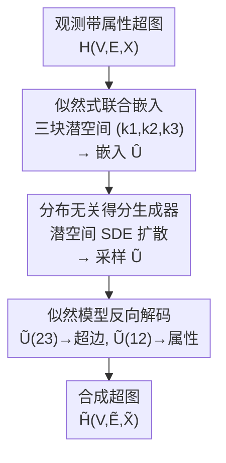

# ReLaSH: Reconstructing Joint Latent Spaces for Efficient Generation of Synthetic Hypergraphs with Hyperlink Attributes

**会议**: ICLR 2026  
**OpenReview**: [https://openreview.net/forum?id=SG3kS2h44t](https://openreview.net/forum?id=SG3kS2h44t)  
**代码**: 无  
**领域**: 图学习 / 生成模型 / 合成数据  
**关键词**: 超图生成, 超边属性, 联合潜空间, 似然嵌入, 得分扩散

## 一句话总结
ReLaSH 把"带属性的超图"生成拆成两步——先用一个**可解释的似然嵌入模型**把超边和它们的属性压进一个低维联合潜空间，再用一个**分布无关的得分扩散生成器**在这个低维空间里重建数据分布，从而既绕开高维离散结构的维度灾难、又在医疗病历/论文合著/菜谱三类真实数据上全面超过 VAE/GAN/扩散等通用基线。

## 研究背景与动机
**领域现状**：超图（hypergraph）用"超边"刻画多个实体之间的多元共现关系，比普通图的成对边表达力更强，在医学、生物、社会科学里很常见。一个典型场景是 ICU 病历：把每个病人身上同时出现的症状/疾病编码当成一条超边，把病人的其它信息（年龄、化验值等）当成这条超边的**属性**。如果能从观测到的"症状共现超图"里生成新的合成超边及属性，就等于生成了合成病人，可用于隐私保护的数据共享和病人模拟。

**现有痛点**：主流生成模型（VAE、GAN、流模型、扩散、自回归）几乎都是为**连续数据**设计的，没法直接套到超图这种离散结构上。少数面向离散数据的生成方法又有两个毛病：一是计算/存储开销大、扩展不到大规模节点集，二是**不考虑超图特有的结构性质**（离散性、超边稀疏、超边与属性的混合数据类型）。已有的图生成模型只针对成对边，超边表示学习/生成的工作（Jo et al. 2021；Wu et al. 2025）又**不带超边属性**。

**核心矛盾**：要同时满足三件互相拉扯的事——(1) 尊重超图的离散+稀疏+混合类型结构；(2) **联合**建模超边和它的属性（两者有依赖，不能各生成各的）；(3) 在高维离散空间里做生成又**不被维度灾难拖垮**、并且最好有理论保证。现有方法没有一个能三者兼顾。

**本文目标**：在**固定节点集**上，给定一张带超边属性的观测超图，生成新的超边及其对应属性（例如在固定症状集合上生成新的症状组合 + 配套病历字段），且方法要高效、可解释、有一致性/泛化性的理论支撑。

**切入角度**：作者的观察是——高维超图数据虽然原始空间巨大，但其生成规律可以被一个**低维的联合潜空间**捕获。只要把"理解结构"和"重建分布"这两件事解耦，前者交给一个带似然、可辨识的嵌入模型（负责把高维结构压成低维、并显式刻画超边-属性依赖），后者交给一个在低维潜空间里运行的灵活生成器，就能让最终误差由低维潜空间主导，而不是被原始高维问题主导。

**核心 idea**：用"似然式联合嵌入 + 潜空间分布无关生成"两段式，把高维带属性超图的生成问题**降维**成低维潜变量分布的生成问题。

## 方法详解

### 整体框架
ReLaSH 要解决的是：观测一张带属性超图 $H(V_n, E_m, X_m)$（$n$ 个节点、$m$ 条超边、每条超边一组属性 $x_j$），生成一张结构与统计性质都逼真的合成超图 $\tilde{H}([n], \tilde{E}_{\tilde m}, \tilde{X}_{\tilde m})$。整条流程是一个"编码—在低维空间重建分布—解码"的三段管线：

第一步，**联合嵌入**：训练一个似然式模型，把每条超边连同它的属性映射到一个低维联合嵌入 $u \in \mathbb{R}^{k_1+k_2+k_3}$，得到观测数据的嵌入集合 $\hat{U}_m$。这一步的关键是把潜空间**切成三块**，让超边-属性依赖被显式编码进共享块。第二步，**重建潜空间**：在 $\hat{U}_m$ 上训练一个分布无关生成器（本文用得分/SDE 扩散），学会从噪声采样出新的潜嵌入 $\tilde{U}_{\tilde m}$。第三步，**解码生成**：把采样出的 $\tilde{U}$ 按维度切回 $\tilde{U}^{(12)}$（管属性）和 $\tilde{U}^{(23)}$（管超边），分别送回训练好的似然模型，随机解码出新的超边和属性。

### 关键设计

**1. 似然式联合嵌入：把潜空间切成三块来显式编码超边-属性依赖**

通用生成器直接在高维离散+混合数据上学分布，既不可解释又容易被维度灾难拖垮。ReLaSH 的做法是先用一个**带似然、可辨识**的嵌入模型把数据压低维。它把每条超边及其属性的联合嵌入 $u = (u^{(1)\top}, u^{(2)\top}, u^{(3)\top})^\top$ 划成三块，维度分别为 $k_1, k_2, k_3$：$u^{(1)}$ 只管属性、$u^{(3)}$ 只管超边、中间的 $u^{(2)}$ 是**超边和属性共享**的块——超边与属性之间的依赖就靠这个共享块来传递。记 $u^{(12)}=(u^{(1)},u^{(2)})$、$u^{(23)}=(u^{(2)},u^{(3)})$，联合似然就漂亮地分解成超边生成模型与属性生成模型的乘积：

$$P_{H(\{E_j\},\{X_j\})\mid u_j} = P_{H(\{E_j\})\mid u_j^{(23)}, Z_n, \alpha_n}\cdot P_{X_j\mid u_j^{(12)}, B, \gamma}.$$

具体地，超边那一支是一个**度修正的逻辑模型**：节点 $i$ 进入某条超边的概率 $p_i(u^{(23)}) = \sigma(u^{(23)\top} z_i + \alpha_i)$，其中 $z_i$ 是节点嵌入、$\alpha_i$ 是节点的"度参数"刻画流行度异质性，所有 $\alpha_i$ 的均值 $\bar\alpha_{m,n}$ 直接控制超边稀疏度（越小越稀疏）。属性那一支是线性模型 $x = \gamma + B u^{(12)} + \epsilon$，误差 $\epsilon$ 取亚高斯尾以兼容连续/二值等不同属性类型。这种设计的好处是相对深层黑箱模型既高效又可解释，而且**离散结构和混合类型被直接写进似然**，不像通用模型那样硬把离散数据塞进连续假设。

**2. 可辨识约束下的联合损失：保证嵌入唯一、估计可一致**

光有似然还不够——同一个联合分布可以对应无穷多组 $(P_U, Z, \alpha, B, \gamma)$，不加约束就学不出唯一的、能做下游生成的嵌入。ReLaSH 通过最小化联合损失来求嵌入：

$$\ell(U, Z, B, \alpha, \gamma) = \ell_H + \lambda \ell_A,$$

其中超边项 $\ell_H = -\sum_{j,i}[\mathbb{1}\{i\in e_j\}\theta^H_{ji} - \log(1+e^{\theta^H_{ji}})]$（$\theta^H_{ji}=u_j^{(23)\top}z_i+\alpha_i$）是负对数似然，属性项 $\ell_A = \sum_j \|x_j - \gamma - B u_j^{(12)}\|_2^2$ 是重构平方误差，$\lambda>0$ 平衡两者。在此之上施加一组**可辨识性条件**（定理 1，条件 C1–C4：嵌入零均值、$\frac1n Z^\top Z$ 和 $\frac1p B_1^\top B_1$ 为各异正对角阵、$U^{(1)}$ 与 $U^{(2)}$ 不相关），使得只要两组参数诱导出相同的 $\alpha+ZU^{(23)}$ 和 $\gamma+BU^{(12)}$ 分布，就必然是同一组参数。论文进一步证明（定理 3）当 $m\asymp n\asymp p$ 时，估计 $(Z,B,\alpha,\gamma)$ 带来的误差以 $\log n / n$ 速率衰减、渐近可忽略——这正是把生成误差"甩"给低维潜空间的理论基石。

**3. 潜空间里的分布无关得分生成器：在学到的低维嵌入上做 SDE 扩散**

拿到嵌入 $\hat{U}_m$ 后，ReLaSH 不对原始高维数据训生成器，而是在**低维潜空间**里训一个分布无关生成器（可换成 normalizing flow、KDE 等，本文实现用得分式 SDE）。它构造一个从 $\hat{U}_m$ 出发的前向扩散 $dU_t = -U_t\,dt + \sqrt{2}\,dW_t$ 把嵌入逐步加噪成高斯，再用去噪得分匹配训练一个 MLP 得分网络 $s_\theta(u,t)$ 去逼近 $\nabla\log p_t$，最后跑反向时间 SDE 从 $\mathcal{N}(0,I_k)$ 采样出新嵌入。与常规得分模型的关键区别是：这里的得分网络是在**未观测的、学习得到的嵌入** $\hat{U}_m$ 上训练的，而不是在观测数据上。因为潜空间维度 $k=k_1+k_2+k_3$ 很低，而得分估计的样本复杂度是随网络维度指数增长的（维度灾难），把生成搬到低维潜空间就**实质性地提高了效率**。

**4. KL 误差三分解：从理论上说清为什么能避开维度灾难**

ReLaSH 的合成分布与真实分布之间的 KL 散度被证明可以分解成三块（定理 2）：

$$d_{KL}(P_{(E,X,U)}\,\|\,P_{(\tilde E,\tilde X,\tilde U)}) = \Delta_{(Z,B,\alpha,\gamma)\text{-est}} + \Delta_{P_U\text{-est}} + \Delta_{\text{latent-recon}}.$$

第一项是估计节点/属性参数的误差（定理 3 证明可忽略），第二项是恢复潜嵌入分布 $P_U$ 的误差，第三项是潜空间重建误差。对第三项，借助 Chen et al. (2022) 的得分模型分析可得 $\Delta_{\text{latent-recon}} \lesssim (M_U+K)e^{-T} + T\varepsilon_0^2 + N^{-1}KT^2L^2$，其中 $K=k_1+k_2+k_3$ 是低维潜空间维度。正因为这里出现的是低维 $K$ 而非原始高维超图维度，整体误差率由低维潜空间主导——这就是 ReLaSH **绕开"环境维度灾难"**（curse of ambient dimensionality）的数学解释：似然模型负责把高维结构吸收掉，扩散只在低维空间里跑。

### 损失函数 / 训练策略
两段训练：先优化联合损失 $\ell = \ell_H + \lambda\ell_A$（在可辨识约束下）得到嵌入 $\hat U_m, \hat Z_n, \hat\alpha_n, \hat B, \hat\gamma$，权重 $\lambda \asymp \exp(\bar\alpha_{m,n})$；再在 $\hat U_m$ 上用去噪得分匹配 $\ell(\theta)=\sum_l \lambda_l\frac1m\sum_{u_0}\mathbb{E}\|s_\theta(u_{lh},lh)-\nabla\log p_{lh}(u_{lh}\mid u_0)\|_2^2$ 训得分网络。生成时反向 SDE 采样 $\tilde m$ 次。三块维度 $(k_1,k_2,k_3)$ 是关键超参（实验里以括号标注，如 ReLaSH-(7,0,2)），$k_2=0$ 表示不显式建超边-属性共享块。

## 实验关键数据

三个真实数据集：MIMIC-III 病人病历（症状共现超图）、MADStat 论文合著超图（合著作者为超边、TF-IDF 词为属性）、Epirecipes 菜谱超图（食材为节点、菜系为属性）。评估指标全部越低越好：$\Delta_{Hv}$（节点协方差 RMSE）、$\Delta_{Xm}$（属性均值 RMSE）、$\Delta_{Xv}$（属性协方差 RMSE）、FED（Fréchet Embedding Distance，FID 的超图版）、a-FED（修正嵌入训练偏差的 FED 变体）。

### 主实验

病人病历生成（表 1，各列尺度不同，详见原文；此处为表中原始数值）：

| 方法 | $\Delta_{Hv}$↓ | $\Delta_{Xm}$↓ | $\Delta_{Xv}$↓ | FED↓ | a-FED↓ |
|------|------|------|------|------|------|
| ReLaSH-(7,0,2) | 3.260 | 2.989 | 1.435 | 0.532 | 1.084 |
| ReLaSHc-(7,0,2) | 27.794 | 2.989 | 1.435 | **0.013** | **0.193** |
| Gau-Diff | 4.268 | 3.497 | 1.719 | 39.731 | 4.387 |
| RealNVP | 3.958 | 33.240 | 2.526 | 27.685 | 2.843 |
| WGAN | 3.506 | 10.534 | 2.176 | 21.053 | 2.654 |
| VAE | 48.450 | 11.499 | 4.134 | 9.374 | 1.376 |

ReLaSH 在 FED/a-FED 上把通用基线甩开一到三个数量级（VAE 的 $\Delta_{Hv}$ 高达 48 说明它根本没学到超图结构）。在论文合著任务（表 2）和菜谱任务上，ReLaSH 同样在多数指标上领先 Gau-Diff/RealNVP/WGAN/VAE 以及一众表格生成基线（CTGAN、ForestDiffusion、TabPFGen 等），后者很多在病历/合著这种大节点集任务上**根本扩展不动**而被迫弃用。

### 消融实验
论文主要通过改变三块维度 $(k_1,k_2,k_3)$ 和对比 ReLaSH（带共享块）与 ReLaSHc（变体）来做分析：

| 配置 | 关键指标 | 说明 |
|------|---------|------|
| ReLaSH-(2,7,8) | FED 1.060 / a-FED 0.791 | 合著任务，较大共享块 $k_2=7$ |
| ReLaSHc-(2,7,8) | FED 0.947 / a-FED 0.706 | 同维度变体，FED 更低 |
| ReLaSH-(8,8,8) | FED 1.454 | 维度全开，FED 反而变差 |
| ReLaSH-(5,0,6) | FED 0.003 / a-FED 0.048 | 菜谱任务，$k_2=0$ 时某指标极低 |

### 关键发现
- **三块维度 $(k_1,k_2,k_3)$ 是核心可调旋钮**：盲目增大全部维度（如 (8,8,8)）并不总变好，需按数据匹配；共享块 $k_2$ 的取值显著影响超边-属性联合质量。
- **FED/a-FED 上的领先最稳**：这两个分布级指标最能体现"生成样本整体逼真"，ReLaSH 在所有任务上几乎都是最低，而单点 RMSE 指标各方法互有胜负。
- **可扩展性是隐性优势**：表格生成 SOTA（CTAB-GAN 等）在大节点集任务上跑不动而被弃赛，ReLaSH 因为只在低维潜空间做生成，天然 scale 到大规模超图。

## 亮点与洞察
- **"解耦结构理解与分布重建"是核心巧思**：用可解释似然模型吃掉高维离散结构、用扩散只在低维潜空间跑，既拿到深度生成的灵活性又保住统计模型的效率与可解释性，是把两条技术线优点对接的漂亮设计。
- **三块潜空间划分把"超边-属性依赖"做成了一个显式旋钮**：共享块 $u^{(2)}$ 的维度 $k_2$ 直接控制两者耦合强度，比黑箱模型"端到端学个联合分布"可控得多。
- **理论真正落地**：KL 三分解 + 定理 3 把"为什么能避开维度灾难"说成了误差率由低维 $K$ 主导，这种"先降维再生成、误差跟着降维走"的思路可迁移到任何高维结构化数据生成（如带属性的时序网络、知识图谱事实生成）。

## 局限与展望
- **似然模型形式较强**：超边用度修正逻辑模型、属性用线性高斯/伯努利，表达力受限于这些参数族；面对高度非线性的属性关系可能不够。
- **固定节点集假设**：方法只在固定 $V_n$ 上生成新超边和属性，不能生成新节点或新属性维度（这点作者明确区别于 Gailhard et al. 2025）。
- **超参 $(k_1,k_2,k_3)$ 需要调**：实验显示维度选择对结果影响大且非单调，缺乏自动选维度的机制；$\lambda$ 与稀疏度 $\bar\alpha_{m,n}$ 的耦合也需小心设定。
- **改进思路**：把似然模型换成更灵活的可逆/神经参数化（保留可辨识性），或为三块维度引入自动模型选择，可能进一步提升复杂属性场景的表现。

## 相关工作与启发
- **vs 通用扩散/GAN/VAE（Gau-Diff、WGAN、VAE）**：它们直接在高维（且常假设连续）空间上学分布，既不显式处理超图离散结构、又被维度灾难压制；ReLaSH 把生成搬进低维潜空间并显式建超图似然，FED 上领先一到三个数量级。
- **vs 表格数据生成（CTGAN、CTAB-GAN、ForestDiffusion、TabPFGen）**：这些方法能处理混合类型但忽略超图结构、且不可扩展，在大节点集任务上跑不动；ReLaSH 借低维生成天然 scale。
- **vs 超边表示/生成（Wu et al. 2025、Jo et al. 2021）**：前序工作做超边生成但**不带属性**；ReLaSH 用三块潜空间联合建模超边与属性，并补上了一致性/泛化性理论。
- **vs 属性超图生成（Chun et al. 2025、Gailhard et al. 2025）**：Chun 在固定节点+节点属性上生成超边但不生成新的超边属性；Gailhard 联合生成拓扑与节点属性、会产生新节点。ReLaSH 的定位是固定节点集上生成"新超边 + 新超边属性"，应用场景（如生成新病历）不同。

## 评分
- 新颖性: ⭐⭐⭐⭐⭐ 首个带理论保证、联合建模超边与超边属性的超图生成框架，"似然降维 + 潜空间扩散"组合很新
- 实验充分度: ⭐⭐⭐⭐ 三个跨域真实数据集 + 9 个基线 + 模拟实验，但消融主要围绕维度选择，缺更系统的组件拆解
- 写作质量: ⭐⭐⭐⭐ 框架清晰、理论与方法衔接好，但符号密集、初读门槛偏高
- 价值: ⭐⭐⭐⭐⭐ 隐私保护数据共享、病人模拟等应用价值直接，方法范式可迁移到广义结构化数据生成

<!-- RELATED:START -->

## 相关论文

- [\[ICLR 2026\] Scaling Knowledge Graph Construction through Synthetic Data Generation and Distillation](scaling_knowledge_graph_construction_through_synthetic_data_generation_and_disti.md)
- [\[ICLR 2026\] GraphUniverse: Synthetic Graph Generation for Evaluating Inductive Generalization](graphuniverse_synthetic_graph_generation_for_evaluating_inductive_generalization.md)
- [\[ICLR 2026\] Bridging Input Feature Spaces Towards Graph Foundation Models](bridging_input_feature_spaces_towards_graph_foundation_models.md)
- [\[ICLR 2026\] $\ell_1$ Latent Distance Based Continuous-Time Graph Representation](ell_1_latent_distance_based_continuous-time_graph_representation.md)
- [\[ICLR 2026\] Latent Geometry-Driven Network Automata for Complex Network Dismantling](latent_geometry-driven_network_automata_for_complex_network_dismantling.md)

<!-- RELATED:END -->
