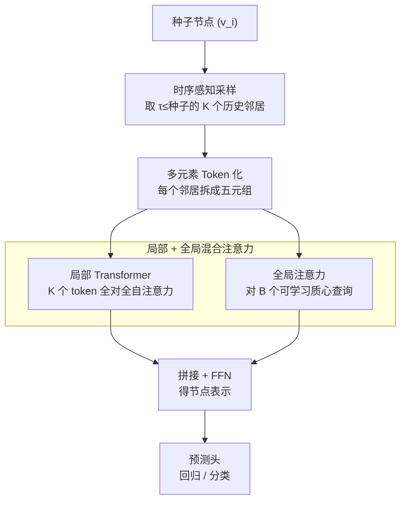

# Relational Graph Transformer

**会议**: ICLR 2026  
**arXiv**: [2505.10960](https://arxiv.org/abs/2505.10960)  
**代码**: [GitHub](https://github.com/snap-stanford/relgt)  
**领域**: 图学习  
**关键词**: 图Transformer, 关系型深度学习, 多元素Token化, 异构时序图, 位置编码

## 一句话总结

提出 RelGT，首个专为关系型数据库设计的图 Transformer，通过多元素 Token 化（特征/类型/跳距/时间/局部结构 5 元组）和局部-全局混合注意力机制，在 RelBench 基准的 21 个任务上一致超越 GNN 基线，最高提升 18%。

## 研究背景与动机

企业数据（金融交易、电商记录、医疗健康等）主要存储在关系型数据库中。关系型深度学习（RDL）将多表数据转为异构时序图（Relational Entity Graph, REG），由 GNN 学习表示。然而 GNN 存在固有限制：

**结构表达力不足**：消息传递无法捕获复杂结构模式，如同为 2-hop 的交易之间仅通过共享客户间接连接

**长程依赖受限**：在 2 层 GNN 中，产品节点永远无法直接交互（需经过交易→客户→交易→产品 共 4 跳）

**现有图 Transformer 不适用于 REG**：
   - 传统位置编码（Laplacian PE、node2vec）不能泛化到大规模异构图
   - 缺乏对时序动态和 schema 约束的建模能力
   - 现有 Token 化方案丢失关键结构信息

## 方法详解

### 整体框架

RelGT 要解决的是：关系型数据库转成的异构时序图（REG）上，GNN 既看不清复杂结构、又够不到长程依赖。它的思路是把图里的节点当成 Transformer 的 token 来处理——但普通的「特征 + 位置编码」两件套不足以刻画 REG 的异构表结构和时序动态，所以 RelGT 给每个节点设计了一个五元组 token，再用「局部 + 全局」两路注意力把它们聚合成节点表示。

一次预测是这样走完的：从一个种子节点出发，先做时序感知采样，拿到 $K$ 个历史邻居（只采时间戳不晚于种子的节点，天然避免数据泄露）；每个邻居被拆成五元组 token 后拼接编码；这些 token 先进局部 Transformer 做全对全自注意力，再让种子节点对一组可学习的全局质心做注意力，两路表示拼接后送进预测头。多元素 Token 化（§3.1）和混合 Transformer 网络（§3.2）就是下面两个关键设计。

### 关键设计

**1. 多元素 Token 化：把节点拆成五元组，解耦异构与时序信息**

针对消息传递「把异构表结构、节点类型、时序差异全压进一个向量后看不清」的痛点，RelGT 不再用单一向量表示节点，而是把每个采样节点 $v_j$ 表示成五元组 $(x_{v_j}, \phi(v_j), p(v_i, v_j), \tau(v_j) - \tau(v_i), \text{GNN-PE}_{v_j})$，五个分量各自独立编码：节点特征 $x_{v_j}$ 由多模态编码器处理数值/类别/文本/图像等列属性，得到 $h_{\text{feat}} \in \mathbb{R}^d$；节点类型 $\phi(v_j)$ 把表级 one-hot 经可学习矩阵投影成 $h_{\text{type}} \in \mathbb{R}^d$；相对跳距 $p(v_i, v_j)$ 取种子到邻居的最短路径跳数，one-hot 编码为 $h_{\text{hop}} \in \mathbb{R}^d$；相对时间 $\tau(v_j) - \tau(v_i)$ 是时间戳差值的线性变换 $h_{\text{time}} \in \mathbb{R}^d$；子图 GNN PE 则用一个轻量 GNN 在采样子图上以随机初始特征跑出 $h_{\text{pe}} \in \mathbb{R}^d$。最后用可学习混合矩阵 $O \in \mathbb{R}^{5d \times d}$ 把五段拼接向量压回 $d$ 维 token：

$$h_{\text{token}}(v_j) = O \cdot [h_{\text{feat}} \| h_{\text{type}} \| h_{\text{hop}} \| h_{\text{time}} \| h_{\text{pe}}]$$

这里最巧的是子图 GNN PE：用随机节点特征初始化是为了打破对称性、增强表达力（Sato et al., 2021），但纯随机会破坏排列等变性，于是每个训练步骤重新采样 $Z_{\text{random}}$，靠这种随机化策略在期望意义上近似保持等变。它的好处是所有结构编码都只在采样子图上完成，无需在整张大图上做昂贵的全局 PE 预计算——这正是传统 Laplacian PE 难以泛化到大规模异构图的瓶颈。

**2. 局部 + 全局混合注意力：既看清近邻、又够到数据库级模式**

针对「2 层 GNN 里产品节点要绕 4 跳才能交互、长程依赖够不着」的痛点，RelGT 在采样到的邻居 token 之间做全对全注意力。局部模块对种子节点的 $K$ 个采样 token 跑 $L$ 层 Transformer 自注意力，让任意两个邻居直接交互，覆盖面远大于逐跳传递的消息传递，最后用一个可学习线性组合做 Pooling：

$$h_{\text{local}}(v_i) = \text{Pool}(\text{FFN}(\text{Attention}(v_i, \{v_j\}_{j=1}^K))_L)$$

但局部子图再大也只是数据库的一隅，跨子图的全局模式（如某类客户的整体行为）局部注意力看不到。于是全局模块让种子节点对 $B$ 个可学习的质心 token 做注意力，这些质心通过 EMA K-Means 在训练中动态更新，相当于把整个数据库的典型模式压缩成一组「锚点」供节点查询：

$$h_{\text{global}}(v_i) = \text{Attention}(v_i, \{c_b\}_{b=1}^B)$$

两路表示拼接后再过一层 FFN 得到节点的最终表示，兼顾近邻细节与全局上下文：

$$h_{\text{output}}(v_i) = \text{FFN}([h_{\text{local}}(v_i) \| h_{\text{global}}(v_i)])$$

### 损失函数 / 训练策略

- **任务特定损失**：根据下游任务选择（回归用 MAE、分类用 AUC 等）
- **端到端训练**：在 RDL pipeline（Robinson et al., 2024）中替换 GNN 组件
- **模型规模**：10-20M 参数，学习率 1e-4
- **采样参数**：$K=300$ 局部邻居，$B=4096$ 全局质心
- **层数**：<1M 训练节点时搜索 $L \in \{1,4,8\}$，>1M 时固定 $L=4$
- **Batch size**：<1M 节点用 256，>1M 用 1024
- **Dropout**：$\{0.3, 0.4, 0.5\}$
- 时序感知采样确保 $\tau(v_j) \leq \tau(v_i)$，防止数据泄露

## 实验关键数据

### 主实验

**基准**：RelBench（7 数据集 21 任务），涵盖电商/临床/社交/体育等领域，训练集规模 1.3K–5.4M。

**回归任务（MAE↓）**：

| 数据集 | 任务 | RDL (GNN) | HGT | HGT+PE | **RelGT** | 相对提升 |
|--------|------|-----------|-----|--------|-----------|----------|
| rel-avito | ad-ctr | 0.041 | 0.046 | 0.048 | **0.035** | **15.85%** |
| rel-trial | site-success | 0.400 | 0.443 | 0.440 | **0.326** | **18.43%** |
| rel-amazon | item-ltv | 50.05 | 55.87 | 55.85 | **48.92** | 2.26% |
| rel-hm | item-sales | 0.056 | 0.064 | 0.064 | **0.054** | 4.29% |

**分类任务（AUC↑）**：

| 数据集 | 任务 | RDL (GNN) | HGT | HGT+PE | **RelGT** | 相对提升 |
|--------|------|-----------|-----|--------|-----------|----------|
| rel-f1 | driver-top3 | 0.755 | 0.708 | 0.763 | **0.835** | **10.56%** |
| rel-avito | user-clicks | 0.659 | 0.638 | 0.646 | **0.683** | 3.64% |
| rel-stack | user-engagement | 0.902 | 0.885 | 0.882 | **0.905** | 0.35% |

**整体统计**（±1% 阈值）：10 个任务明显提升 / 9 个持平 / 2 个略降。

### 消融实验

| 去除组件 | ad-ctr | user-clicks | site-success | 影响趋势 |
|----------|--------|-------------|--------------|----------|
| 无全局模块 | -6.00% | +7.85% | -19.08% | 任务依赖 |
| 无 GNN PE | -1.14% | **-15.15%** | — | **始终下降** |
| 无节点类型 | -7.14% | +5.01% | — | 混合 |
| 无跳距编码 | -3.43% | +5.77% | — | 混合 |
| 无相对时间 | -9.14% | +8.37% | — | 混合 |

### 关键发现

1. **子图 GNN PE 是唯一在所有任务上都关键的组件**：去除后一致下降，因为它是局部结构（父子关系、环等）的唯一显式编码
2. **全局模块有强任务依赖性**：site-success 去除后降 19%（需要全局上下文），但 user-clicks 去除后反而提升 7.9%（局部信息已足够）
3. **HGT+PE 不如 RelGT**：即使 HGT 加上 Laplacian PE 仍不如 RelGT，说明多元素分解 > 单一 PE 方案
4. **无需昂贵预计算**：所有编码都在采样子图上完成，相比全图 Laplacian 计算节省数量级的计算成本

## 亮点与洞察

- **多元素 Token 化范式**：将 NLP Transformer 的"token + position"扩展为 5 元素表示，解耦不同维度信息的编码，优于把所有信息压缩进单一 PE
- **随机特征 GNN PE**：巧妙利用随机初始化增强表达力 + 每步重采样保持等变性，理论与实践的优雅结合
- **工程友好**：直接替换 RDL pipeline 中的 GNN 组件，保持所有其他基础设施不变
- **全局质心机制**：EMA K-Means 动态更新质心，不需要额外的预处理步骤

## 局限与展望

1. 未覆盖推荐任务（RelBench 30 个任务中的 9 个被排除），推荐需要 pair-wise 学习等特殊处理
2. 时间编码仅用简单线性变换，可接入更先进的时序编码（如周期函数、可学习时间核）
3. 固定采样 $K=300$ 可能对极大/极小的局部结构不理想
4. 全局质心对部分任务引入噪声，可考虑自适应开关
5. 未进行详尽的超参搜索，报告结果可能还有进一步提升空间

## 相关工作与启发

- **vs GraphGPS**：GPS 面向同构静态图，无法处理异构/时序；RelGT 专为 REG 设计
- **vs HGT**：HGT 处理异构但缺乏有效 PE 和时序建模；RelGT 的 5 元素表示全面覆盖
- **vs RelGNN / ContextGNN**：这些是增强 GNN 的方法，不如 Transformer 的全对全注意力灵活
- 启发：多元素 Token 化思想可推广到其他多维异构图场景（如知识图谱、分子网络、代码依赖图）

## 评分

- 新颖性：★★★★☆ — 多元素 Token 化和随机 GNN PE 是显著贡献
- 技术深度：★★★★☆ — 设计精细，各组件有理论依据
- 实验充分度：★★★★★ — 21 个任务、多个基线、完整消融
- 写作质量：★★★★☆ — 结构清晰，图示出色

<!-- RELATED:START -->

## 相关论文

- [\[ICLR 2026\] Relatron: Automating Relational Machine Learning over Relational Databases](relatron_automating_relational_machine_learning_over_relational_databases.md)
- [\[NeurIPS 2025\] Wavy Transformer](../../NeurIPS2025/graph_learning/wavy_transformer.md)
- [\[ICLR 2026\] PRISM: Partial-label Relational Inference with Spatial and Spectral Cues](prism_partial-label_relational_inference_with_spatial_and_spectral_cues.md)
- [\[ICML 2026\] What Makes a Desired Graph for Relational Deep Learning?](../../ICML2026/graph_learning/what_makes_a_desired_graph_for_relational_deep_learning.md)
- [\[AAAI 2026\] NTSFormer: A Self-Teaching Graph Transformer for Multimodal Isolated Cold-Start Node Classification](../../AAAI2026/graph_learning/ntsformer_a_self-teaching_graph_transformer_for_multimodal_isolated_cold-start_n.md)

<!-- RELATED:END -->
