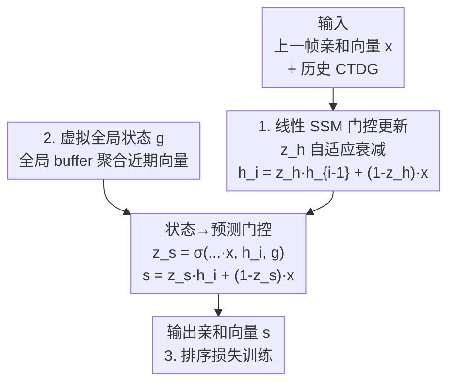

# Revisiting Node Affinity Prediction in Temporal Graphs

**会议**: ICLR 2026  
**OpenReview**: [https://openreview.net/forum?id=6UvkemEgK3](https://openreview.net/forum?id=6UvkemEgK3)  
**代码**: https://github.com/orfeld415/NAVIS  
**领域**: 时序图学习  
**关键词**: 时序图神经网络, 节点亲和度预测, 状态空间模型, 排序损失, 全局虚拟状态

## 一句话总结
本文指出现有时序图神经网络（TGNN）在"节点亲和度预测"上居然打不过 Moving Average 这种朴素启发式，根因是它们既表达不出移动平均、又用了不适配排序的交叉熵损失；据此提出 NAVIS——一个把启发式当作线性状态空间模型特例来推广的可学习线性 SSM，配上排序损失，在 TGB 上全面超过启发式与所有 TGNN。

## 研究背景与动机
**领域现状**：在时序图（交易网络、推荐系统、社交平台、金融转账）上，一个核心任务是"未来节点亲和度预测"——给定查询节点 $u$ 和未来时间 $t^+$，预测它对其余所有节点 $v$ 的亲和强度，本质上要对候选邻居产出一个完整排序（用 NDCG@10 衡量）。这和"未来链路预测"（只问某条边会不会出现）不同，更难也更贴近实际。近年大家把链路预测的 SOTA 模型（TGN、TGAT、DyGFormer、GraphMixer 等）直接搬来做亲和度预测。

**现有痛点**：尴尬的是，这些精巧的 TGNN 干不过 Persistent Forecast（直接拿上一帧亲和向量当预测）、Moving Average 这类一行代码的启发式。这说明 TGNN 的归纳偏置和亲和度预测任务根本不对路。

**核心矛盾**：作者把"为什么启发式赢"拆成几个并存的根因：(i) **表达力不足**——现有 TGNN 因为非线性更新 + 依赖采样邻居，根本表示不出一个简单的移动平均（缺乏所需的线性记忆）；(ii) **损失错配**——链路预测惯用的交叉熵把输出当类别分布，忽略了亲和度任务的序数/排序本质；(iii) **全局时序动态丢失**——亲和度常依赖全网共享趋势（如某首歌突然爆火），而局部采样捕捉不到；(iv) **信息损失**——基于记忆的模型（TGN/DyRep）因 batch 处理会漏掉同一 batch 内的短期更新，无记忆模型（DyGFormer/GraphMixer）则因固定大小 buffer 硬截断丢掉长期事件。

**切入角度**：作者的关键观察是——PF 和 Moving Average 不是随手凑的 trick，而是**线性状态空间模型（SSM）的特例**。SSM 天然提供记忆和长程时序依赖，因此只要把 SSM 的结构嵌进一个可学习的 TGNN，就能既保留启发式的稳健、又扩展其表达力。

**核心 idea**：用一个可学习的线性 SSM（维护每节点状态 + 一个虚拟全局状态）去推广启发式，并把交叉熵换成排序损失，让模型的归纳偏置和训练目标都对齐"排序"这个真正的任务。

## 方法详解

### 整体框架
NAVIS（Node Affinity prediction with Virtual State）的输入是连续时间动态图 $G_t$ 中的历史交互（或历史亲和向量 $x$），输出是查询节点对全体节点的亲和向量 $s \in \mathbb{R}^{|V|}$。它的骨架是一个**线性状态空间模型**：为每个节点维护一个状态 $h \in \mathbb{R}^d$（$d=|V|$ 即亲和空间维度），同时维护一个跨所有节点共享的**虚拟全局状态** $g \in \mathbb{R}^d$；二者随动态图共同演化。

整条流水线分两步门控更新：先用当前输入 $x$（上一帧亲和向量）和上一时刻节点状态 $h_{i-1}$ 算一个门 $z_h$ 来更新节点状态 $h_i$，再用 $x$、$h_i$ 和全局状态 $g$ 算第二个门 $z_s$，直接由状态线性组合出预测 $s$。关键在于：输出始终是输入的线性组合（类似 EMA），但衰减系数不再是固定的 $\alpha$，而是**在推理时由当前事件动态算出**——这就是"可学习启发式"。

### 关键设计

**1. 可学习线性 SSM：用动态门控把固定衰减的启发式推广开**

针对"TGNN 表达不出移动平均、而启发式又被困在手工固定记忆核"的矛盾，NAVIS 把 EMA 的递推 $h_i=\alpha h_{i-1}+(1-\alpha)x$ 升级成系数可学习、可在运行时按事件自适应的版本。具体两步更新为

$$z_h = \sigma(W_{xh}x + W_{hh}h_{i-1} + b_h), \quad h_i = z_h \odot h_{i-1} + (1-z_h)\odot x$$
$$z_s = \sigma(W_{xs}x + W_{hs}h_i + W_{gs}g + b_s), \quad s = z_s \odot h_i + (1-z_s)\odot x$$

其中 $\sigma$ 是 sigmoid，强制门 $z_h,z_s\in[0,1]$，从而和 EMA 里的 $\alpha$ 在概念上对齐。这之所以有效，是因为作者从理论上证明了**启发式是线性 SSM 的严格子集**（Theorem 1：PF、SMA、EMA 都对应特定的 $(A,B,C,D)$ 取值，而 2×2 对角 SSM 能让向量每一维以不同速率衰减，这是单一衰减的 EMA 做不到的）。更关键的是 Theorem 2 证明：标准 RNN/LSTM/GRU 单元因为输出被 tanh/sigmoid 限制在有界区间，**连最基础的 PF（$h_i=x_i$）都表示不出来**——这直接解释了为什么基于这些记忆单元的 TGNN 注定打不过启发式，也正是 NAVIS 改用线性 SSM 的根本理由。此外 NAVIS 不依赖邻居的隐状态，因此兼容 t-Batch 机制，能高效批处理而不漏更新。

**2. 虚拟全局状态：补上局部采样看不见的全网趋势**

针对"亲和度常受全网共享趋势驱动、但局部采样捕捉不到"的痛点，NAVIS 额外维护一个虚拟全局向量 $g$。它的做法是维护一个**全局 buffer**，缓存最近若干条亲和向量，然后对 buffer 内向量做聚合（实践中用最近向量选择的轻量聚合即可，既高效又有效）得到 $g$。$g$ 的目标是在被问到某个具体节点之前，就先嗅到全局趋势（比如一首新歌或一部新剧突然被全网热播）。在第二步门控里 $g$ 通过 $W_{gs}$ 注入，影响 $z_s$ 进而影响预测——这让 NAVIS 能在全局趋势改变节点亲和度时提升预测精度，弥补了所有现有 TGNN"不利用完整全局状态"的盲区。

**3. 排序损失 + 边际正则：让训练目标对齐"排序"而非"幅值"**

针对"交叉熵不适配排序"的损失错配，作者先用 Theorem 3 给出反例证明交叉熵的缺陷：存在无穷多组 $(y,s_1,s_2)$，$s_1$ 排序完全正确、$s_2$ 排序错误，却有 $\ell_{CE}(s_1,y)>\ell_{CE}(s_2,y)$——即交叉熵会惩罚"排序对但幅值不匹配"的好预测。为此 NAVIS 改用 **Lambda Loss**：

$$\ell_{Lambda}(s,y)=\sum_{y_i>y_j}\log_2\!\left(\frac{1}{1+e^{-\sigma(s_{\pi_i}-s_{\pi_j})}}\right)|\,\delta_{ij}|A_{\pi_i}-A_{\pi_j}|$$

它通过成对的"lambda"直接逼近 NDCG 这类不可微排序指标的梯度，把学习聚焦在最影响最终排名的交换上。但作者发现光用 Lambda Loss 不够——模型会作弊地把所有亲和分数缩小来压低损失，于是再加一个**成对边际正则** $\ell_{Reg}(s,y)=\sum_{y_i>y_j}\max(0,-(s_{\pi_i}-s_{\pi_j})+\Delta)$，强制每对分数之间至少留出边际 $\Delta$，从而消除 Theorem 3 揭示的不良性质。

### 损失函数 / 训练策略
最终损失为 Lambda Loss 与成对边际正则之和。训练遵循标准协议：70%/15%/15% 时间序列切分，训练 50 epoch，batch size 200，三次运行取平均 NDCG@10。针对百万级大图，NAVIS 参数量随节点数 $O(N)$ 增长会过大，作者引入**稀疏化亲和预测**——每个节点只保留候选目标节点对应的条目（如流媒体只关心用户对电影的亲和、不关心用户对用户），实测在 tgbn-token（>60,000 节点）上只需约 5,000 参数。

## 实验关键数据

### 主实验（TGB，NDCG@10，使用完整 CTDG）

| 数据集 | Moving Avg | 最强 TGNN (TGNv2) | NAVIS | 提升 |
|--------|-----------|-------------------|-------|------|
| tgbn-trade (Test) | 0.777 | 0.735 | **0.863** | +12.8% vs TGNv2 |
| tgbn-genre (Test) | 0.497 | 0.469 | **0.520** | — |
| tgbn-reddit (Test) | 0.480 | 0.507 | **0.552** | — |
| tgbn-token (Test) | 0.414 | 0.294 | **0.444** | — |

可以看到多数 TGNN（JODIE/TGAT/DyGFormer 等 Test 普遍 0.31–0.39）确实打不过 Moving Average，印证了理论分析；NAVIS 则在四个数据集上全面登顶。在"只用历史真值亲和向量"的启发式友好设定（Table 2）下，NAVIS 同样小幅超过 PF 和 Moving Avg（如 tgbn-trade Test 0.863 vs 0.855/0.823）。

### 泛化到链路预测数据集（NDCG@10，使用完整图消息）

| 数据集 | Moving Avg | TGNv2 | NAVIS |
|--------|-----------|-------|-------|
| Wikipedia (Test) | 0.555 | 0.433 | **0.573** |
| Flights (Test) | 0.028 | 0.299 | **0.499** |
| USLegis (Test) | 0.154 | 0.253 | **0.347** |
| UNVote (Test) | 0.918 | 0.813 | **0.952** |

把四个时序链路预测数据集改造成亲和度任务后，NAVIS 相比第二名 TGNN 提升 +13.9%~+20%，且其他 TGNN 依旧落后于朴素启发式——进一步坐实了"现有 TGNN 设计选择不适配亲和度预测"。

### 消融实验

| 配置 | 说明 |
|------|------|
| Full NAVIS | 完整模型 |
| w/o 线性状态更新（换成 GRU） | 验证线性 SSM 必要性 |
| w/o 全局虚拟向量 $g$ | 去掉全局趋势捕捉 |
| w/o 排序损失（换成 CE） | 验证 Lambda Loss + 正则 |

作者通过隔离三大核心组件（线性状态更新 vs GRU、是否含全局向量 $g$、排序损失 vs 交叉熵）做消融，结论是每个组件都对最终性能有实质贡献（完整结果在附录 F）。

### 关键发现
- **线性是关键而非更复杂**：把线性状态更新换成 GRU 会掉点，呼应 Theorem 2——GRU 连 PF 都表示不出来，非线性记忆单元反而是性能瓶颈。
- **损失对齐任务比换架构更重要**：交叉熵换成排序损失带来明显提升，说明"归纳偏置 + 训练目标都对齐排序"才是 NAVIS 取胜的核心。
- **全局状态在趋势驱动场景增益明显**：合成实验（隐含全局 regime-switching 过程）里，只看每节点历史的 PF/SMA/EMA 都恢复不出共享潜空间，唯有维护虚拟全局状态的 NAVIS 误差最低。

## 亮点与洞察
- **把"启发式赢过深度模型"这个反常现象做成了理论**：Theorem 1（启发式是线性 SSM 特例）+ Theorem 2（RNN/LSTM/GRU 表示不出 PF）一正一反，既解释了现象又给出了药方，比单纯堆 trick 有说服力得多。
- **"线性才对"反直觉但成立**：在大家都往非线性、更深堆的时候，本文论证亲和度预测恰恰需要线性记忆，门控只用来自适应衰减系数而非引入非线性——这是可迁移的设计哲学：先想清楚任务需要什么归纳偏置，再决定加不加非线性。
- **损失反例非常精炼**：用 $y=[0.4,0.6]$、$s_1=[1,2.4]$、$s_2=[1,0.6]$ 三个二维向量就把交叉熵"排序对反而损失高"讲透了，是可复用的"为什么不该用 CE 做排序"的教学例子。
- **稀疏化让 O(N) 参数落地**：只保留候选目标条目，把 60,000 节点图压到 5,000 参数，这个工程化思路对推荐类大图很实用。

## 局限与展望
- **全局状态过于朴素**：当前 $g$ 只靠"最近性选择 + buffer 聚合"，作者承认更高级的聚合（如注意力）和更聪明的 buffer 淘汰策略（如非确定性淘汰）可能进一步提升。
- **纯线性表达力有上限**：NAVIS 把亲和度算成输入与状态的线性组合（系数在 $[0,1]$），因此表示不了某些非线性函数；作者设想加入第三个非线性分量、让三个系数和为 1，但如何最优地融合线性与非线性留作未来工作。
- **多跳依赖建模仍弱**：作者明确表示没有完全解决问题，复杂多跳依赖的建模仍是继承下来的局限。
- 消融只给了定性结论（"每个组件都有实质贡献"），正文未列出每个组件去掉后的具体掉点数值，需查附录 F 才能定量比较。

## 相关工作与启发
- **vs 标准 TGNN（TGN/TGAT/DyGFormer/GraphMixer）**：它们靠局部邻居采样 + 非线性消息传递，擅长链路预测但表达不出移动平均、也不利用全局状态；NAVIS 用线性 SSM + 全局虚拟状态，专为排序型亲和度预测设计，因此反超。
- **vs 启发式（PF/SMA/EMA）**：启发式是固定手工记忆核，NAVIS 证明它们是线性 SSM 特例并用动态门控推广，既保留稳健又增表达力。
- **vs WL 视角的表达力研究**：主流用 Weisfeiler-Lehman 测试衡量"区分非同构图"的能力；本文转向**功能表达力**——模型能否表示移动平均这类具体数学算子，是看待 TGNN 表达力的新角度。
- **vs 加权动态图上的时序链路预测（TLP）**：TLP 要重建整个未来加权邻接矩阵（用 RMSE/MAE）、且是离散时间、每次算全图；亲和度预测是连续时间、只算查询节点对其他节点的排序（用 NDCG/MRR），两者目标与设定都不同，方法难以互相迁移。

## 评分
- 新颖性: ⭐⭐⭐⭐⭐ 把"启发式 = 线性 SSM 特例"做成理论并据此设计架构，视角新且自洽
- 实验充分度: ⭐⭐⭐⭐ TGB + 改造的链路数据集双设定全覆盖，但正文消融只给定性结论
- 写作质量: ⭐⭐⭐⭐⭐ 现象→理论→方法→实验逻辑链清晰，反例与定理点到为止又有力
- 价值: ⭐⭐⭐⭐⭐ 给"为什么深度模型打不过朴素 baseline"提供了可推广的诊断与解法

<!-- RELATED:START -->

## 相关论文

- [\[ICLR 2026\] UrbanGraph: Physics-Informed Spatio-Temporal Dynamic Heterogeneous Graphs for Urban Microclimate Prediction](urbangraph_physics-informed_spatio-temporal_dynamic_heterogeneous_graphs_for_urb.md)
- [\[ICLR 2026\] Inductive Reasoning for Temporal Knowledge Graphs with Emerging Entities](inductive_reasoning_for_temporal_knowledge_graphs_with_emerging_entities.md)
- [\[ICLR 2026\] TGM: A Modular and Efficient Library for Machine Learning on Temporal Graphs](tgm_a_modular_and_efficient_library_for_machine_learning_on_temporal_graphs.md)
- [\[ICLR 2026\] Beyond Entity Correlations: Disentangling Event Causal Puzzles in Temporal Knowledge Graphs](beyond_entity_correlations_disentangling_event_causal_puzzles_in_temporal_knowle.md)
- [\[ICLR 2026\] Training-Free Counterfactual Explanation for Temporal Graph Model Inference](training-free_counterfactual_explanation_for_temporal_graph_model_inference.md)

<!-- RELATED:END -->
