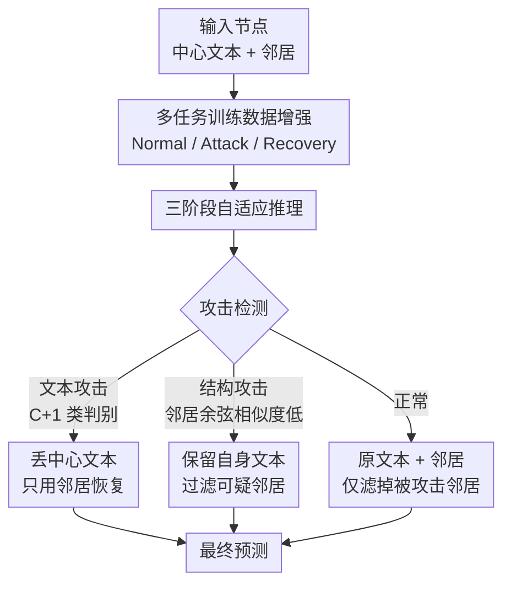

# Robustness in Text-Attributed Graph Learning: Insights, Trade-offs, and New Defenses

**会议**: ICLR 2026  
**OpenReview**: [https://openreview.net/forum?id=CEJl0gN2gj](https://openreview.net/forum?id=CEJl0gN2gj)  
**代码**: https://github.com/Leirunlin/TGRB (有)  
**领域**: 图学习 / 对抗鲁棒性 / GraphLLM  
**关键词**: 文本属性图, 对抗鲁棒性, GraphLLM, 文本-结构权衡, 攻击检测

## 一句话总结
这篇论文首次把经典 GNN、鲁棒 GNN（RGNN）和 GraphLLM 放到统一的文本属性图（TAG）对抗鲁棒性评测框架里横向比较，揭示了"模型只能防住文本攻击或结构攻击之一、防不住两者"的文本-结构权衡，并提出 SFT-auto——一个用 LLM 推理能力把"攻击检测 + 恢复 + 预测"统一进单一模型的防御框架，在两类攻击下都拿到均衡且领先的鲁棒性。

## 研究背景与动机
**领域现状**：文本属性图（TAG，节点既有图结构边、又有自然语言文本）是社交网络、引用网络、电商图的基础数据形态。在 TAG 上做节点分类有两条主流路线：一是 GNN（先用文本编码器把文本转成节点特征，再和邻接矩阵一起做消息传递），二是新兴的 GraphLLM（把节点原始文本直接喂进 LLM、靠 prompt 指令做分类）。两条路线又各自衍生出一堆增强鲁棒性的方法（RGNN、鲁棒训练、相似度过滤等）。

**现有痛点**：在社交、金融这类高风险场景里，攻击者可以同时操纵图结构（注入虚假关注关系）和节点文本（伪造误导性简介），让模型分类失效。但已有的鲁棒性研究是**碎片化**的：早期 GNN/RGNN 的评测只用 BoW、TF-IDF 这类浅层嵌入，完全忽略了文本的丰富语义；而近期研究 GraphLLM 鲁棒性的工作又只覆盖很窄的攻击设置，从不和 GNN 家族做公平的横向对比。结果是整个领域缺少一个能跨架构、跨攻击类型系统比较的统一结论。

**核心矛盾**：作者大规模评测后发现一个反复出现的根本性矛盾——**文本-结构鲁棒性权衡**：一个模型要么擅长防结构攻击、要么擅长防文本攻击，**几乎没有模型能同时防住两者**。擅长结构防御的 GNNGuard、SFT-neighbor 在文本攻击下崩盘；而对文本攻击稳健的朴素 GCN/GAT 又扛不住结构扰动。把现成的 RGNN 设计直接塞进 LLM 架构也无法消除这个权衡。

**本文目标**：① 建立一个能公平横向比较 GNN/RGNN/GraphLLM 三大范式的统一鲁棒性评测框架；② 找到一个能在单一模型里同时防住文本和结构攻击的防御方法。

**切入角度**：作者注意到 LLM 本身具备多模态推理能力——它不仅能分类，还能"读懂"文本是否异常。既然 GNN 缺的是语言理解、LLM 缺的是天然的结构鲁棒性，那为什么不让 LLM 先**判断节点是被文本攻击还是结构攻击**，再针对性地决定该信文本还是信邻居？

**核心 idea**：用 LLM 把"先检测攻击类型、再自适应恢复、最后预测"串成一个 pipeline——被文本攻击就丢掉中心文本只用邻居，被结构攻击就保留自身文本、过滤掉可疑邻居，从而在一个模型里打破文本-结构权衡。

## 方法详解

### 整体框架
论文有两个并列的贡献，整体框架也分两半。**前半是评测框架**：把三大范式（经典 GNN、RGNN、GraphLLM）放进同一套威胁模型，覆盖 4 个领域 10 个数据集，施加文本攻击、结构攻击、混合攻击（Text-GIA），并严格区分 poisoning（污染训练数据，配 transductive）和 evasion（攻击测试输入，配 inductive）两种场景，用 RoBERTa 做 GNN 的文本编码器、Mistral-7B 做 GraphLLM 骨干，得出一系列鲁棒性洞察。**后半是防御方法 SFT-auto**：针对评测暴露出的文本-结构权衡，设计一个用 LLM 推理能力做"检测-恢复-预测"的统一防御 pipeline。

下面这张图描述的是 **SFT-auto 推理 pipeline**（评测框架是并列贡献，不在此图内）。输入是一个待分类节点（中心文本 + 邻居），输出是它的类别标签，中间经过攻击检测和自适应恢复：

### 关键设计

**1. 统一鲁棒性评测框架：把碎片化的评测拉到同一把尺子上**

针对"已有评测各做各的、结论无法对比"的痛点，作者构建了一个覆盖面远超以往的统一 benchmark。数据上跨 4 个领域 10 个数据集（学术网络 Cora/CiteSeer/PubMed/ArXiv、网页 WikiCS、社交 Instagram/Reddit、电商 History/Photo/Computer）；基线上首次同时纳入经典 GNN、RGNN（GNNGuard、RUNG、ProGNN 等十余种）和 GraphLLM（GraphGPT、LLaGA、SFT-neighbor）三大范式；攻击上覆盖结构攻击（GMA）、文本攻击和文本注入攻击（Text-GIA）。

框架的关键在于三条公平性原则，避免得出误导性结论：**用足够强的攻击**（Mettack、word-level 文本攻击太弱、迁移性差，会让排名被 clean accuracy 主导而非真实抗攻击能力，因此主文采用高扰动比的有效攻击）；**保证基线 clean 性能可比**（剔除 GPT zero-shot 这类 clean 性能就远低于监督基线的方法，否则弱骨干会显得"假鲁棒"）；**攻击类型与学习范式对齐**（poisoning 天然配 transductive、evasion 配 inductive，错配会让基于记忆的平凡防御钻空子）。评测指标用跨数据集的平均 rank（绝对准确率 rank + 相对掉点 rank）而非原始准确率均值，因为后者会被数据集尺度差异和 clean 准确率带偏。这套框架直接产出了文本-结构权衡、"简单 RGNN 配好文本编码器能复活"、"GraphLLM 对训练数据污染格外脆弱"等核心洞察。

**2. SFT-auto 训练：用三类增强样本教会 LLM 识别并恢复攻击**

噪声注入和相似度过滤这些从 RGNN 搬来的策略只能单独防一类攻击（`-noise` 防结构、`-noisetxt` 防文本，`-noisefull` 合起来反而两边都不灵），说明简单改 prompt 不足以让 LLM 学会打破权衡。SFT-auto 的训练阶段改用**有原则的数据增强**，把训练样本拆成三类来注入"检测 + 恢复"能力：**Normal 样本**保留原始的节点-邻居对，维持标准分类能力；**Attack 样本**把节点文本故意替换成其他类别节点的内容、标注为"text attacked"，教模型识别文本攻击；**Recovery 样本**则把中心文本整个删掉，逼模型学会只靠邻居信息做鲁棒预测。

为了在类别分布不同的数据集间保持检测均衡，攻击注入比例取自适应值 $r = \min(1/|C|, 0.15)$（$|C|$ 是类别数）。这样一来，LLM 同时学会了一个 $(|C|+1)$ 类的攻击检测任务（多出来的一类专门表示"被文本攻击"）和一个 $|C|$ 类的恢复任务，二者靠不同的专用 prompt 区分。数据增强带来的额外样本至多 1.3 倍（因为 $r \le 0.15$），训练开销可控。

**3. SFT-auto 推理：三阶段自适应 pipeline，按检测结果决定信文本还是信邻居**

推理阶段把训练学到的能力组织成一个三阶段流水线。**阶段一·攻击检测**：LLM 通过扩展出的 $(|C|+1)$ 维分类空间识别文本被攻击的节点；结构攻击则用嵌入相似度分析——若一个节点和**超过一半邻居**的余弦相似度都低于 $0.5$，就判定为结构攻击。文本攻击检测优先级更高，避免一个节点被同时打上两种标签。**阶段二·自适应恢复**：被判文本攻击的节点**绕过自身被污染的中心文本**、只靠原始邻居信息分类；被判结构攻击的节点保留自身文本、但过滤掉那些连向文本攻击节点或低相似度的邻居；正常节点走标准分类，只额外滤掉被文本攻击的邻居。**阶段三**给出最终预测。

这套设计的巧妙处在于它把 LLM 的语义理解直接用在了"该信谁"的决策上——当文本不可靠时转去依赖结构、当结构被污染时转去依赖文本。复杂度上，单样本推理平均时间约 $T_{\text{avg}} \approx (1 + p_{\text{attack}}) \cdot T_{\text{LLM}}$，其中 $p_{\text{attack}}$ 是需要恢复的小部分节点占比，实践中很小，整体运行时间和 SFT-neighbor 基线相当。作者还做了对照实验：把 LLM 预测器换成 GCN 做成 AutoGCN，结果文本异常检测率比 SFT-auto 低 6.2–17.4 倍——说明这套 pipeline 的关键正是 LLM 的语言理解能力，GNN 缺乏检测文本异常的"语言素养"。

### 损失函数 / 训练策略
SFT-auto 本质是监督微调（SFT），训练目标是让 Mistral-7B 在三类增强样本（Normal / Attack / Recovery）上同时完成 $(|C|+1)$ 类攻击检测与 $|C|$ 类恢复分类，靠不同 prompt 模板区分任务，攻击注入比例 $r=\min(1/|C|,0.15)$。

## 实验关键数据

### 主实验
评测用跨数据集平均 rank（Performance Rank + Drop Rank，越低越好）。核心结论汇总如下：

| 场景 / 攻击 | 表现突出的方法 | 关键观察 |
|--------|------|------|
| 结构攻击 · inductive/evasion | SFT-neighbor、GraphGPT、GNNGuard | GraphLLM 即使无防御也优于多数 RGNN；GNNGuard 配好文本编码器逼近 SOTA |
| 结构攻击 · transductive/poisoning | EvenNet、APPNP、GPRGNN（谱方法） | 谱方法的鲁棒扩散能用高阶邻域，poisoning 下最稳；GraphLLM 开始掉点 |
| 文本攻击 · inductive/evasion | 朴素 GCN、GAT | GNNGuard/RUNG 这些抗结构强的方法对文本攻击格外脆弱 |
| 文本攻击 · poisoning | GNN / RGNN 普遍稳健 | 替换 80% 训练文本，GNN 靠邻居聚合仍稳；GraphLLM 大幅掉点 |

文本-结构权衡的量化证据（CiteSeer 文本 poisoning）：SFT-neighbor 准确率掉 **25%**，而多数 GNN 只掉 **5%–10%**，印证 GraphLLM 重度依赖高质量训练文本。SFT-auto 在 Figure 4 的"结构掉点 rank × 文本掉点 rank"散点里**独占左下均衡区**，其余基线都偏向某一极。

### 消融实验

| 配置 | 行为 | 说明 |
|------|---------|------|
| `-noise`（结构噪声注入） | 只提升结构鲁棒性 | 借鉴 NoisyGCN，单防结构 |
| `-noisetxt`（文本噪声注入） | 只提升文本鲁棒性 | 单防文本 |
| `-noisefull`（混合噪声） | 两边都防不好 | 无法同时防住两类攻击 |
| `-simf`（边过滤，仿 GNNGuard） | 防结构、不防文本 | 行为类似 GNNGuard |
| `-simp`（改 prompt 自适应依赖） | 提升甚微 | 单改指令不足以打破权衡 |
| **SFT-auto** | 两类攻击都稳 | 检测-恢复 pipeline 打破权衡 |
| AutoGCN（把 LLM 换成 GCN） | 文本检测大幅退化 | 文本检测率比 SFT-auto 低 6.2–17.4× |

### 关键发现
- **文本-结构权衡是架构内禀的**：结构导向架构（LLaGA、朴素 GNN）抗文本、垮于结构；文本导向模型（SFT-neighbor、GraphGPT）和抗结构 RGNN 则反过来。权衡由模型设计决定，但其表现强烈依赖数据集——文本友好的 PubMed 上模型不依赖结构、对结构扰动不敏感（GPRGNN 仅掉 1.7%），而结构关键的 Computer/Photo 上同一批模型掉点剧烈（GPRGNN 掉 29%）。
- **简单方法在 TAG 上能"复活"**：GNNGuard 这种早期阈值过滤 RGNN，在用上现代文本编码器后能拿到顶尖鲁棒性，作者据此进一步提出去掉阈值超参的 Guardual，成为结构 evasion 设置下最强 RGNN——说明此前 RGNN 评测用浅层嵌入严重低估了文本特征的作用。
- **GraphLLM 对 poisoning 格外脆弱**：训练数据被污染时 GraphLLM 掉点远超 GNN，因为它高度依赖高质量训练文本，而 GNN 能靠 transductive 范式下的邻居聚合兜底。
- **检测能力靠的是 LLM 的语言素养**：AutoGCN 对照实验证明把同样的检测 pipeline 接到 GCN 上，文本异常检测率掉一个数量级，说明 SFT-auto 的有效性源自 LLM 的多模态推理而非 pipeline 本身。

## 亮点与洞察
- **"先检测攻击类型、再决定信文本还是信邻居"是个可迁移的防御范式**：它把防御从"被动硬扛扰动"变成"主动判断威胁来源后自适应换依赖源"，这种 detection-then-recovery 思路可以推广到任何多模态、多信息源的鲁棒学习任务。
- **统一评测揭穿了"新方法一定更鲁棒"的错觉**：论文最"啊哈"的地方是用公平 benchmark 让 GNNGuard 这种老方法重新封神，提醒社区评测协议（攻击强度、clean 性能对齐、攻击-范式对齐）本身就能决定结论方向。
- **文本-结构权衡是一个清晰可量化的研究坐标**：用"结构掉点 rank × 文本掉点 rank"散点图把所有模型摊开，左下角的空白区直接定义了"均衡鲁棒"这个有价值的研究目标。
- **数据增强可以同时教检测和恢复两种能力**：Normal/Attack/Recovery 三类样本的设计，本质是用合成攻击把"识别异常"和"绕过异常"两件事一并塞进监督信号，几乎零额外推理开销。

## 局限与展望
- 作者承认主文为追求区分度采用了高扰动比攻击（结构 0.2–0.3、文本 evasion 40%、poisoning 80%），小扰动比结果挪到附录——极端攻击强度下的结论未必能线性外推到温和攻击。
- 自己发现的局限：SFT-auto 的结构攻击检测依赖一个硬阈值（与过半邻居余弦相似度 < 0.5），这个阈值在不同数据集/编码器下的稳健性、以及面对刻意贴近该阈值的自适应攻击时的表现，正文未充分展开（仅附录 H 探讨 adaptive attack）。
- GraphLLM 实验用单一骨干 Mistral-7B、单一文本编码器 RoBERTa，结论是否随模型规模/编码器变化仍待验证。
- 改进思路：AutoGCN 的失败提示了一个方向——把 GNN 的结构鲁棒和 LLM 的语义检测在多阶段 pipeline 里混合，在"已验证的干净数据"上构建混合架构，可能比单纯用 LLM 更高效。

## 相关工作与启发
- **vs 传统 RGNN（GNNGuard / RUNG / ProGNN）**：它们只在浅层嵌入上评测、且主要防结构攻击，忽略了 TAG 的原始文本信息；本文证明配上现代文本编码器后这些方法能复活，但仍无法单凭一个模型同时防文本和结构。
- **vs LLM-as-purifier 方法（GraphEdit / RLLMGNN / LangGSL）**：它们只把 LLM 当结构精炼器、仍紧耦合 GNN 骨干，难以捕捉文本与结构的深层交互；SFT-auto 则让 LLM 直接同时承担检测、恢复、预测，是单一统一模型。
- **vs 已有鲁棒性 benchmark（GRB / TrustGLM / Guo et al. / Olatunji et al.）**：它们在数据多样性、基线范式覆盖、攻击设置上都偏窄（最多覆盖三范式中的一两个），缺乏跨类别的统一公平比较；本文的 10 数据集 × 4 领域 × 三范式 × 全攻击类型是迄今最全面的，正是这种统一性才暴露出此前被掩盖的文本-结构权衡。

## 评分
- 新颖性: ⭐⭐⭐⭐ 统一评测框架 + detection-then-recovery 防御范式都有新意，单点技术（数据增强、相似度过滤）则多为已有思路的组合。
- 实验充分度: ⭐⭐⭐⭐⭐ 10 数据集 × 4 领域 × 三范式 × 多攻击类型 × poisoning/evasion，外加大量附录消融与自适应攻击，覆盖面极广。
- 写作质量: ⭐⭐⭐⭐ 洞察提炼清晰、图表（尤其权衡散点）很有说服力，但 SFT-auto 细节稍依赖附录。
- 价值: ⭐⭐⭐⭐⭐ 为 TAG 安全建立了可复用的评测基线，并给出首个能均衡防御两类攻击的实用方案。

<!-- RELATED:START -->

## 相关论文

- [\[ICLR 2026\] GDGB: A Benchmark for Generative Dynamic Text-Attributed Graph Learning](gdgb_a_benchmark_for_generative_dynamic_text-attributed_graph_learning.md)
- [\[ICLR 2026\] On the Trade-off Between Expressivity and Privacy in Graph Representation Learning](on_the_trade-off_between_expressivity_and_privacy_in_graph_representation_learni.md)
- [\[AAAI 2026\] GCL-OT: Graph Contrastive Learning with Optimal Transport for Heterophilic Text-Attributed Graphs](../../AAAI2026/graph_learning/gcl-ot_graph_contrastive_learning_with_optimal_transport_for_heterophilic_text-a.md)
- [\[ICLR 2026\] Global-Recent Semantic Reasoning on Dynamic Text-Attributed Graphs with Large Language Models](global-recent_semantic_reasoning_on_dynamic_text-attributed_graphs_with_large_la.md)
- [\[ICML 2026\] ERAlign: Energy-based Representation Alignment of GNNs and LLMs on Text-attributed Graphs](../../ICML2026/graph_learning/eralign_energy-based_representation_alignment_of_gnns_and_llms_on_text-attribute.md)

<!-- RELATED:END -->
