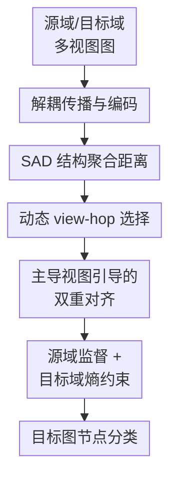

# SAGA: Structural Aggregation Guided Alignment with Dynamic View and Neighborhood Order Selection for Multiview Graph Domain Adaptation

**会议**: ICLR2026  
**OpenReview**: [https://openreview.net/forum?id=hC9Ny8iMLi](https://openreview.net/forum?id=hC9Ny8iMLi)  
**代码**: https://github.com/f1shungry/SAGA  
**领域**: 图学习 / 多视图图领域自适应  
**关键词**: 多视图图学习, 图领域自适应, 结构对齐, 动态邻域选择, 节点分类  

## 一句话总结
SAGA 面向多关系图上的无监督图领域自适应，提出 Structural Aggregation Distance 在训练中动态选择最可迁移的视图与邻域阶数组合，并用该组合引导跨视图、跨域对齐，在 ACM 与 MAG 多视图图节点分类迁移任务上显著优于现有 GDA 方法。

## 研究背景与动机
**领域现状**：图领域自适应（Graph Domain Adaptation, GDA）通常假设有一个带标签的源图和一个无标签的目标图，目标是在目标图上做节点分类。现有 GDA 方法大多围绕单一图结构设计：要么对源图和目标图做表示对齐，要么用对抗训练、MMD、谱正则、结构重构等方式压低跨图分布差异。

**现有痛点**：现实图数据经常不是单视图图，而是多关系、多元路径或多种边类型共同存在的多视图图。例如 ACM 里同一批论文既可以通过 PAP（paper-author-paper）关系连接，也可以通过 PSP（paper-subject-paper）关系连接；MAG 里既有 PAP，也有 PP（paper-paper）引用关系。把这些关系简单平均，或者只选一个视图，会漏掉不同关系对迁移的互补作用。

**核心矛盾**：多视图图的领域偏移不是一个固定的“源图 vs 目标图”差异，而是由视图维度和邻域阶数共同决定。某个视图的一阶邻域可能在源域和目标域很接近，但同一视图的三阶邻域可能已经偏得很远；另一个视图又可能呈现相反现象。固定视图或固定 hop 的对齐信号很容易把模型拉向错误结构。

**本文目标**：作者要解决的是 Multi-view Graph Domain Adaptation（MGDA）：源域和目标域都是多视图图，源域有节点标签，目标域无标签，任务是在目标域做节点分类。具体子问题包括：如何度量不同视图、不同邻域阶数下的结构偏移；如何在训练过程中找到当前最适合对齐的 view-hop pair；以及如何利用这个主导结构信号同时处理跨视图偏移和跨域偏移。

**切入角度**：论文的关键观察是，源域和目标域之间最能解释迁移效果差异的结构信号会随训练变化。作者在经验分析中比较动态 SAD、固定视图 SAD、固定 hop SAD 等轨迹，发现只有动态 SAD 能更稳定地下降，并与源域和目标域分类损失差距的下降同步。

**核心 idea**：用一个同时考虑视图和邻域阶数的 Structural Aggregation Distance（SAD）作为训练中的动态结构尺子，每个 epoch 重新挑选最小 SAD 对应的主导 view-hop pair，再让这个结构锚点指导多视图图表示对齐。

## 方法详解
SAGA 的方法主线可以理解成“先把每个视图、每个 hop 的图结构表示做出来，再用 SAD 选择当前最可靠的结构锚点，最后围绕这个锚点做域内跨视图对齐和源目标跨域对齐”。它不是把多视图图粗暴合成一个图，而是承认不同关系和不同邻域阶数的迁移性会变化，并把这个变化显式放进训练循环。

### 整体框架
输入是源域多视图图 $G_S=\{A_{S,1},\cdots,A_{S,V_S},X_S,Y_S\}$ 和目标域多视图图 $G_T=\{A_{T,1},\cdots,A_{T,V_T},X_T\}$。SAGA 先对每个视图做带 teleport 的结构传播，得到不同 hop 的聚合特征；再用共享 MLP 编码器/解码器获得 view-specific embedding；随后计算所有候选 view-hop pair 的 SAD，并选出最小 SAD 对应的主导组合；最后用主导组合引导 intra-view alignment、cross-domain alignment、源域监督分类和目标域熵最小化。

这张图里真正的贡献节点是中间四个：解耦传播与编码让多视图高阶结构可以低成本进入训练；SAD 结构聚合距离负责把“哪个视图、几阶邻域更接近”量化出来；动态 view-hop 选择负责每轮训练重估主导结构；主导视图引导的双重对齐把结构选择转化为可优化的表示学习目标。

### 关键设计
**1. 解耦传播与编码：先缓存结构聚合，再用共享 MLP 学表示**

传统 GNN 在训练中反复做图卷积，放到多视图、多 hop、跨域设置里会很重。SAGA 把图传播和表示降维拆开：对每个视图 $v$，先从原始特征 $X$ 出发，用类似 APPNP 的递推做结构聚合，

$$
X_{v,0}=X,\quad X_{v,k+1}=(1-\alpha)\hat A_vX_{v,k}+\alpha X.
$$

这里 $\hat A_v$ 是带自环的归一化邻接矩阵，$\alpha$ 是 teleport probability。这个式子保留了原始节点特征作为回跳项，避免高阶传播把节点表示过度平滑；同时每个视图都能产生 $1$ 到 $K$ 阶的结构聚合特征。随后，聚合后的 $X_v$ 进入共享编码器 $f_\Theta(\cdot)$ 得到 $Z_v=f_\Theta(X_v)$，再由共享解码器 $g_\Theta(\cdot)$ 重构 $\hat X_v$。重构损失 $L_R$ 保证编码器不是只服务于分类，而是真的保留了视图结构信息。

**2. SAD 结构聚合距离：把视图差异和邻域阶数放到同一把尺子上**

多视图图里最大的麻烦是“结构差异”没有单一刻度。SAGA 先给出基于聚合特征均值的 SAD 直觉版本：对源域和目标域在某个视图、某个 hop 下的聚合特征取中心，再比较两个中心的距离。这个定义说明 SAD 关注的是结构传播之后的特征分布差异，而不是只看原始节点属性或一阶边。

训练时，作者改用 embedding-space 的矩阵差异来度量 SAD：

$$
SAD_v^k=\left\|Z_{v_S}^{T,k_S}(Z_{v_S}^{T,k_S})^\top-Z_{v_T}^{S,k_T}(Z_{v_T}^{S,k_T})^\top\right\|_F^2.
$$

公式排版上原文的源/目标上标略显混乱，但核心含义很清楚：它比较源域和目标域在某个 view-hop pair 下的 pairwise similarity structure。用 $ZZ^\top$ 而不是只比较均值，意味着 SAD 关心节点之间的关系结构是否相近；用 Frobenius norm，则把这种关系矩阵差异压成一个可排序的标量。

**3. 动态 view-hop 选择：让主导结构信号随训练更新**

SAGA 不预设 PAP 一定比 PSP 好，也不预设 $K=1$ 一定最稳，而是在训练中枚举候选视图和 hop，取 SAD 最小的组合：

$$
v^*,k^*=\arg\min_{v,K} SAD_v^k.
$$

这个选择被称为 dominant view-hop pair。它的意义不是“这个视图永远最好”，而是“当前表示空间里，这个视图和邻域阶数最能作为源域到目标域的迁移锚点”。论文附录的动态选择可视化显示，早期训练会在多个候选视图之间切换，随着 SAD 下降，选择逐渐稳定到语义上合理的 same-view mapping，例如 ACM 上偏向 PAP $\rightarrow$ PAP，MAG 上偏向 PP $\rightarrow$ PP。

为了不让选择过于硬，SAGA 还给每个候选 SAD 分配 soft weight：

$$
\omega_{v,k}=\frac{\exp(-\lambda SAD_v^k)}{\sum_j\sum_i\exp(-\lambda SAD_i^j)}.
$$

SAD 越小，权重越大；温度 $\lambda$ 控制分布尖锐程度。这样模型既能突出主导 pair，又不会完全丢掉其他视图和 hop 的补充信息。

**4. 主导视图引导的双重对齐：同时压低跨视图偏移和跨域偏移**

选出主导 view-hop pair 之后，SAGA 做两层对齐。第一层是 intra-alignment：在每个域内部，让其他视图的表示向主导视图空间靠拢。它用 $ZZ^\top$ 形式比较不同视图的相似度结构，把多视图表示拉到一个统一的 dominant-guided embedding space。这个设计针对的是 cross-view shift：同一域内不同关系视图可能语义不同，直接平均会冲淡有用结构，而让它们围绕当前最可迁移视图对齐更稳。

第二层是 cross-alignment：把源域主导 view-hop 表示和目标域主导 view-hop 表示投影到共享 latent space，用基于 cosine similarity 的对比式目标做双向对齐。原文写作 $L_{CA}=\ell(Z_{v_S^*}^{S,k_S^*},Z_{v_T^*}^{T,k_T^*})+\ell(Z_{v_T^*}^{T,k_T^*},Z_{v_S^*}^{S,k_S^*})$。这一步针对的是 domain shift：既然 SAD 已经挑出了当前最接近、最可迁移的结构组合，就优先用这个组合来桥接源域和目标域，而不是在所有视图上平均做对齐。

### 一个完整示例
以 ACM1 $\rightarrow$ ACM2 为例，源域和目标域都有 PAP 与 PSP 两个关系视图。训练早期，模型先对 PAP 和 PSP 分别做多阶传播，可能得到 PAP 一阶、PAP 三阶、PSP 一阶、PSP 四阶等候选表示。随后它计算这些候选之间的 SAD，发现某一轮里 PAP $\rightarrow$ PSP 的二阶结构差异最小，于是临时把这个 pair 当作主导结构信号。

在这一轮优化中，模型会用该主导结构去约束 ACM1 内部不同视图的相似度结构，也约束 ACM2 内部不同视图的相似度结构；同时，它还会把 ACM1 的主导表示和 ACM2 的主导表示拉近。若几轮后编码器学到更稳定的表示，SAD 可能转而认为 PAP $\rightarrow$ PAP 更可靠，SAGA 就切换到新的主导 pair。这个过程解释了为什么固定“只用 PAP”或固定“只用一阶邻域”不够：真正有用的迁移锚点会随着表示空间变化而变化。

### 损失函数 / 训练策略
SAGA 的总目标由重构、对齐、源域分类和目标域熵约束组成：

$$
L=L_R+\alpha L_{IA}+(1-\alpha)L_{CA}+\beta L_S+\delta L_T.
$$

$L_R$ 是多视图聚合特征重构损失，用来防止表示坍缩并保留结构信息；$L_{IA}$ 是 dominant-guided intra-alignment，处理同一域内部的跨视图不一致；$L_{CA}$ 是源域与目标域之间的 dominant pair 对齐；$L_S$ 是源域带标签节点的交叉熵分类损失；$L_T$ 是目标域预测的熵损失，用于鼓励目标节点预测更确定。

训练时 SAD 每个 epoch 重新计算一次，但这些 pairwise distance 不参与反向传播。作者强调这样可以避免把所有距离计算都纳入梯度路径，虽然存在 $O(VN^2d)$ 级别的前向开销，但实践上训练时间和显存开销仍接近 HGDA、PA 等强 baseline。

## 实验关键数据

### 主实验
论文在多关系 citation network 上做跨图节点分类。ACM1/ACM2 使用 PAP 与 PSP 两个视图，节点类别为 database、wireless communication、data mining；MAG 从 OGBN-MAG 中按国家切分为 CN、US、DE、FR、JP、RU 等子图，使用 PAP 与 PP 两个视图，取 10 个高频类别。评价指标为 ACC 和 macro-F1。

| 数据集 / 迁移方向 | 指标 | SAGA | 最强对比方法 | 提升 |
|--------|------|------|----------|------|
| MAG CN$\rightarrow$US | ACC | 0.553 | 0.425（UDAGCN/SpecReg） | +0.128 |
| MAG CN$\rightarrow$US | macro-F1 | 0.341 | 0.247（SpecReg） | +0.094 |
| MAG JP$\rightarrow$CN | ACC | 0.512 | 0.451（UDAGCN） | +0.061 |
| MAG CN$\rightarrow$JP | ACC | 0.557 | 0.436（ACDNE） | +0.121 |
| MAG DE$\rightarrow$FR | macro-F1 | 0.426 | 0.291（GraphATA） | +0.135 |
| MAG FR$\rightarrow$DE | ACC | 0.515 | 0.421（HGDA） | +0.094 |
| ACM1$\rightarrow$ACM2 | ACC | 0.523 | 0.511（HGDA） | +0.012 |
| ACM1$\rightarrow$ACM2 | F1 | 0.351 | 0.333（PA） | +0.018 |
| ACM2$\rightarrow$ACM1 | ACC | 0.454 | 0.452（PA） | +0.002 |
| ACM2$\rightarrow$ACM1 | F1 | 0.444 | 0.414（HGDA） | +0.030 |

从 MAG 的结果看，SAGA 的优势更明显，尤其在 CN$\rightarrow$US、CN$\rightarrow$JP、DE$\rightarrow$FR 等迁移方向上，ACC 或 macro-F1 都拉开了较大差距。ACM 上提升幅度较小，但两个方向的 ACC/F1 仍同时达到最好，说明动态多视图结构对齐不是只在大图上有效。

| 方法 | ACM1$\rightarrow$ACM2 ACC | ACM1$\rightarrow$ACM2 F1 | ACM2$\rightarrow$ACM1 ACC | ACM2$\rightarrow$ACM1 F1 |
|------|---------|---------|---------|---------|
| GCN | 0.367 | 0.253 | 0.359 | 0.236 |
| GAT | 0.373 | 0.319 | 0.363 | 0.241 |
| UDAGCN | 0.452 | 0.283 | 0.409 | 0.347 |
| SpecReg | 0.493 | 0.308 | 0.431 | 0.381 |
| PA | 0.506 | 0.333 | 0.452 | 0.377 |
| HGDA | 0.511 | 0.311 | 0.441 | 0.414 |
| SAGA | 0.523 | 0.351 | 0.454 | 0.444 |

这个表能看出一个细节：非自适应 GCN/GAT 在跨图迁移上明显不足，说明只把源域表示拿到目标域上用不够；而自适应方法虽然普遍更好，但大多仍是单视图或静态结构假设，无法处理 MGDA 中“视图 + hop”共同变化的偏移。

### 消融实验
论文做了两类消融：第一类是限制视图组合，只让 SAGA 使用固定 source-view $\rightarrow$ target-view；第二类是去掉动态主导视图对齐、动态 hop 或 dominant view selection 等模块。第二类结果主要以柱状图展示，缓存 OCR 没有给出完整数值，因此这里只记录趋势结论，不虚构具体数字。

| 配置 | ACM1$\rightarrow$ACM2 ACC / F1 | ACM2$\rightarrow$ACM1 ACC / F1 | 说明 |
|------|---------|---------|------|
| SAGA$_{PSP\rightarrow PAP}$ | 0.366 / 0.314 | 0.358 / 0.296 | 固定跨视图组合，性能明显低于完整模型 |
| SAGA$_{PAP\rightarrow PAP}$ | 0.379 / 0.319 | 0.363 / 0.283 | 只用同一 PAP 视图，无法充分利用 PSP 互补信息 |
| SAGA$_{PSP\rightarrow PSP}$ | 0.351 / 0.339 | 0.373 / 0.291 | F1 有一定保留，但 ACC 远低于完整模型 |
| SAGA$_{PAP\rightarrow PSP}$ | 0.351 / 0.332 | 0.389 / 0.302 | 固定跨视图映射不稳定 |
| SAGA | 0.523 / 0.351 | 0.454 / 0.443 | 动态选择并联合利用所有视图 |

| 配置 | CN$\rightarrow$US ACC / F1 | US$\rightarrow$CN ACC / F1 | 说明 |
|------|---------|---------|------|
| SAGA$_{PP\rightarrow PAP}$ | 0.316 / 0.183 | 0.318 / 0.276 | 固定 PP 到 PAP，跨视图结构不一定可迁移 |
| SAGA$_{PAP\rightarrow PAP}$ | 0.329 / 0.191 | 0.346 / 0.318 | 只看 PAP，丢掉 PP citation linkage |
| SAGA$_{PP\rightarrow PP}$ | 0.335 / 0.177 | 0.323 / 0.297 | 单一 PP 视图仍不够 |
| SAGA$_{PAP\rightarrow PP}$ | 0.321 / 0.230 | 0.349 / 0.321 | 固定跨视图映射有提升但不稳定 |
| SAGA | 0.553 / 0.341 | 0.535 / 0.426 | 完整动态多视图对齐优势最大 |

模型组件消融的趋势也支持同一结论：去掉 Dominant View Alignment（用 DANN 代替 $L_{IA}+L_{CA}$）掉点最大；固定 hop 不如动态 hop；用简单视图平均替代 dominant view selection 也会降低表现。这说明 SAGA 的收益不是来自某个普通对齐 loss，而是来自“先动态识别结构锚点，再围绕锚点对齐”的组合。

### 关键发现
- SAD 与源目标损失差距的训练轨迹更同步。论文图 3 和附录图 9 都显示，动态 SAD 随训练下降，并比固定 hop 或 GAA 式一阶结构差异更稳定。
- 多视图信息必须联合使用。ACM 的 PAP/PSP 和 MAG 的 PAP/PP 都携带互补语义；固定任意单一视图或固定跨视图组合都明显低于完整 SAGA。
- 动态选择最终会收敛到可解释结构。早期训练会探索多种 view-hop pair，后期通常稳定到 same-view mapping，例如 PAP$\rightarrow$PAP 或 PP$\rightarrow$PP，符合 citation graph 的语义直觉。
- 计算开销可接受。附录效率表显示，在 ACM1$\rightarrow$ACM2 上 SAGA 训练时间为 UDAGCN 的 1.163 倍、显存为 1.112 倍，同时准确率表中报告为 0.793；在 CN$\rightarrow$US 上训练时间为 1.109 倍、显存为 1.098 倍，说明动态 SAD 带来的额外开销没有数量级膨胀。

## 亮点与洞察
- SAGA 最巧妙的地方是把 MGDA 的难点从“如何融合多个视图”改写成“当前哪个视图和邻域阶数最适合做迁移锚点”。这个角度比简单平均视图更细，因为它承认不同结构信号的可迁移性会随训练变化。
- SAD 用 $ZZ^\top$ 比较关系结构，而不是只比较节点均值或一阶邻接差异。这让它更接近图任务真正关心的结构一致性：节点之间的相对关系是否在源域和目标域中保持。
- 解耦传播与 MLP 编码的设计很实用。多视图多 hop 图卷积如果全部放进训练循环会很重，SAGA 把结构传播预先变成聚合特征，再让共享编码器学习表示，给动态选择留下了计算预算。
- 这套思路可以迁移到异构图、推荐系统和多模态关系图。只要一个任务里存在多种关系视图和不同范围的邻域结构，都可以尝试用类似 SAD 的动态结构尺子选择当前最可靠的对齐信号。

## 局限与展望
- SAD 需要计算 pairwise similarity matrix，理论复杂度包含 $O(VN^2d)$ 项。虽然作者说明这些距离不参与反向传播，实践开销可控，但面对更大规模图时仍可能需要采样、低秩近似或 mini-batch 版本。
- 论文主要验证 citation network 节点分类，数据类型集中在 ACM 和 MAG。多视图社交网络、知识图谱、推荐图或动态图上的效果还需要进一步验证。
- 动态选择机制当前以最小 SAD 为核心，偏向寻找结构差异最小的 view-hop pair；但“差异最小”不一定总等于“分类最有用”。未来可以把类别可分性、不确定性或伪标签质量一起纳入主导结构选择。
- 目标域熵最小化可能在类别分布严重偏移时放大错误自信。若 MGDA 同时存在 label shift，SAGA 可能需要配合类别先验校正或 target risk control。
- 方法命名和公式排版有少量不够清晰之处，例如 SAD embedding-space 公式里的源/目标上标容易让读者困惑。实现时需要以代码和算法描述为准，避免误读符号。

## 相关工作与启发
- **vs UDAGCN**: UDAGCN 通过局部和全局图卷积知识做无监督图领域自适应，并用对抗训练对齐表示；SAGA 的区别在于它面向多视图图，不只做全局域对齐，而是动态选择视图和 hop 作为结构锚点。
- **vs GRADE-N**: GRADE-N 用 graph subtree discrepancy 衡量源目标图分布差异，更强调单一图结构下的子树偏移；SAGA 的 SAD 把多视图和多阶邻域同时纳入选择，并在训练过程中更新。
- **vs HGDA**: HGDA 对齐同质、异质和属性信号，能处理层次化图结构差异，但原生仍更接近单视图 GDA；SAGA 针对 MGDA 的关系视图差异建模，视图选择和 hop 选择是核心贡献。
- **vs PA**: PA 通过 pairwise alignment 和边权重校准处理结构与标签偏移；SAGA 不直接重标定边权，而是找出当前最可迁移的结构聚合层级与视图，用它来指导表示对齐。
- **启发**: 对多视图图任务，不应默认所有视图等权，也不应只凭先验选一个视图。更合理的做法是把“视图质量”变成训练中的动态变量，并让下游目标反过来检验它是否真的带来可迁移表示。

## 评分
- 新颖性: ⭐⭐⭐⭐ 多视图图领域自适应的任务设定和动态 view-hop SAD 选择有明确新意，但仍建立在已有图传播、表示对齐和对比学习组件之上。
- 实验充分度: ⭐⭐⭐⭐ 主实验、视图消融、模型消融、效率分析、参数敏感性和可视化都比较完整；不足是数据类型集中在 citation network。
- 写作质量: ⭐⭐⭐ 部分公式符号和文字有排版/笔误问题，但方法动机、实验设计和附录分析能支撑主张。
- 价值: ⭐⭐⭐⭐ 对多关系图迁移很有参考价值，尤其适合作为后续异构图、多视图推荐图和跨域知识图谱对齐的动态结构选择 baseline。

<!-- RELATED:START -->

## 相关论文

- [\[ICLR 2026\] Entropy-Guided Dynamic Tokens for Graph-LLM Alignment in Molecular Understanding](entropy-guided_dynamic_tokens_for_graph-llm_alignment_in_molecular_understanding.md)
- [\[ICLR 2026\] Dual-Branch Representations with Dynamic Gated Fusion and Triple-Granularity Alignment for Deep Multi-View Clustering](dual-branch_representations_with_dynamic_gated_fusion_and_triple-granularity_ali.md)
- [\[ICLR 2026\] <SOG$_k$>: One LLM Token for Explicit Graph Structural Understanding](sog_k_one_llm_token_for_explicit_graph_structural_understanding.md)
- [\[ICLR 2026\] Multi-Scale Diffusion-Guided Graph Learning with Power-Smoothing Random Walk Contrast for Multi-View Clustering](multi-scale_diffusion-guided_graph_learning_with_power-smoothing_random_walk_con.md)
- [\[ICLR 2026\] Multi-Domain Riemannian Graph Gluing for Building Graph Foundation Models](multi-domain_riemannian_graph_gluing_for_building_graph_foundation_models.md)

<!-- RELATED:END -->
