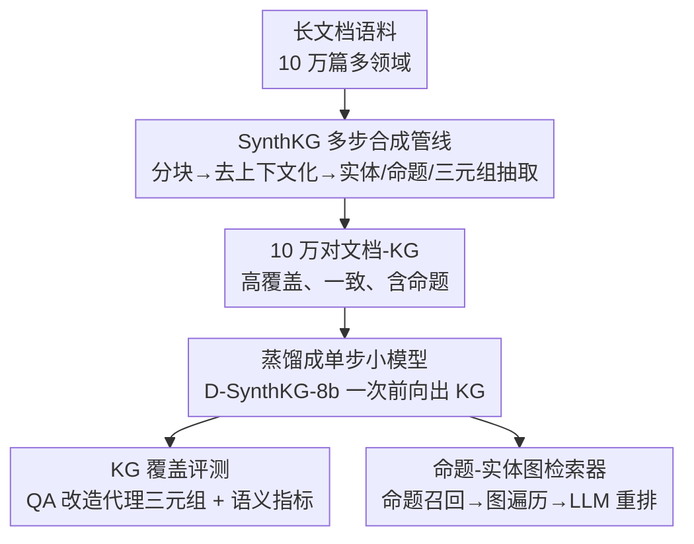

# Scaling Knowledge Graph Construction through Synthetic Data Generation and Distillation

**会议**: ICLR 2026  
**OpenReview**: [https://openreview.net/forum?id=VaBkEapGl5](https://openreview.net/forum?id=VaBkEapGl5)  
**代码**: 暂未公开（作者承诺将开源 100K 文档-KG 数据集与核心代码）  
**领域**: 知识图谱构建 / 数据合成 / 蒸馏 / 检索增强生成  
**关键词**: 文档级知识图谱、合成数据、蒸馏、ontology-free、Graph RAG

## 一句话总结
针对文档级知识图谱构建中"大模型贵、小模型差"的两难，本文用一条多步合成管线 SynthKG（分块→去上下文化→实体/命题/三元组抽取）造出 10 万对高质量文档-KG 训练数据，再把这套多步流程蒸馏进一个 8B 小模型 Distill-SynthKG，使其单步推理就能产出媲美 8 倍大模型的 KG，并在检索与多跳问答上全面超过 GraphRAG / HippoRAG。

## 研究背景与动机
**领域现状**：知识图谱增强的 RAG（GraphRAG、HippoRAG、GraphReader 等）已被证明能做好语料级摘要、多跳推理和长上下文规划。这些方法普遍用 GPT-4o 这类大模型，靠简单的 zero-shot / few-shot 提示，一步把整篇文档抽成 KG。

**现有痛点**：这种"大模型一步抽"的做法在大规模语料上不可持续——海量商用 API 调用成本极高；而把整篇长文一次性喂给 LLM 又会丢信息。如果改用小模型来省钱，产出的 KG 又稀疏、不一致、覆盖不全。此外，文档级、ontology-free（无预定义本体）的 KG 既缺训练数据，也缺评测基准，导致 RAG 出错时分不清是推理组件的锅还是低质 KG 的锅。

**核心矛盾**：作者的关键判断是——小模型抽 KG 抽不好，**不是模型能力不行，而是缺高质量的文档级 KG 训练数据**。其他结构化抽取任务都有监督数据集可学，唯独 ontology-free KG 构建几乎没有大规模训练语料，只能被迫依赖昂贵的 zero-shot 推理。

**本文目标**：分解为三个子问题——（1）怎么在没有人工标注的前提下，规模化地造出高质量文档-KG 训练对；（2）怎么让小模型学到大模型多步流程的能力；（3）没有评测基准的情况下怎么衡量 KG 质量。

**切入角度**：把 KG 构建从"每篇文档都当一个孤立的 zero-shot 问题"，转成"一个可学习的模式识别问题"。只要把构建过程拆成可复现、输出一致的若干阶段，这些一致的模式就能被小模型当训练信号学进参数里。

**核心 idea**：用"大模型跑多步管线造数据 + 把多步流程蒸馏进小模型单步生成"替代"大模型一步硬抽"，从而把扩展 KG 构建的范式从"扩模型规模"转向"造训练数据"。

## 方法详解

### 整体框架
整个工作分三块：**SynthKG**（数据合成引擎，左侧多步）→ **Distill-SynthKG**（蒸馏出的单步小模型）→ 下游评测与检索。SynthKG 用 Llama-3.1-70B 把输入长文档跑过一条多步管线：先按句界无重叠分块，再逐块做去上下文化（消歧补全实体指代），然后分两次提示抽出实体、再抽出命题与关系四元组，最后聚合成一张以命题为核心的文档级 KG。用这条管线在 10 万篇多领域文档上造出 10 万对文档-KG，作为训练资源，把 8B 小模型微调成能"一次前向过整篇文档、直接吐 KG"的 Distill-SynthKG（记作 D-SynthKG-8b）。配套地，作者把多跳 QA 数据集改造成 KG 评测的代理真值，并基于合成 KG 的命题-实体二部图结构设计了一套渐进式图检索器。

### 关键设计

**1. SynthKG 多步合成管线：把"一步硬抽"拆成可复现、可学习的阶段**

这一条直接打掉"长文一次性抽会丢信息、且 zero-shot 输出飘忽不可学"的痛点。管线先按句子边界、零重叠把文档切成 256-token 的语义完整块，避免长文输入导致的信息损失。关键的第二步是**去上下文化（decontextualization）**：逐块让 LLM 基于前一块的上下文，把所有实体指代改写成最具信息量的完整形式——例如前文出现过"John Doe"，后文的"John D."、"John"乃至代词都被统一回填成"John Doe"。这一步同时解决两件事：保证跨块实体命名一致（否则同一实体的不同写法会造成冗余、KG 路径断裂、推理时掉精度），并让每块变成可独立处理的自包含单元。作者用 10 万样本统计了同一实体的平均块间距离为 $0.9$，说明实体往往在首次出现后不到一块内就被再次提及，因此"只看前一块"就足以完成去上下文化；同时用原文与改写文之间的 ROUGE-1 F1（阈值 $0.70$）过滤改写跑偏的样本，防止幻觉。人工标注 75 块共记录 593 处编辑，只有 6 处改错、4 处丢信息，且多数编辑是把"scientists"改成"Darwinian scientists"这类增加具体性的改动。

第三、四步是抽取：先提示 LLM 从每块抽出所有实体及类型，再结合实体抽出**命题（proposition）与关系四元组**——每条关系表示为 (源实体, 谓词, 目标实体, 命题)。这里的命题是本文一个巧设计：它既是一句完整描述两实体语义关系、囊括关键细节的自然语句，充当让 LLM 先把上下文讲清再抽三元组的"中间思维链"（CoT），又是一个细粒度、自包含的可索引检索单元。正是这种逐块、分步、带命题的分解，让产出的 KG 具备可预测的结构（一致命名、系统覆盖、可解释中间表示），从而**适合当小模型的训练数据**。

**2. SynthKG 蒸馏：把多步流程内化进 8B 小模型的单步生成**

多步管线虽好，但效率是硬伤——处理一篇 1000 词文档要 12 次 LLM 调用（切 4 块 × 每块去上下文化/实体/关系三次），算力与 API 成本随规模线性膨胀。作者的洞察是：一旦 KG 构建被拆成系统化阶段，它就从"推理时反复多步提示求解"变成了"训练时一次性学会的模式识别"。于是把 SynthKG 产出的文档-KG 对拿来微调一个更小的 Meta-Llama-3-8B（用 30K 文档、学习率 $5\text{e-}5$、batch 32、训 1 个 epoch），让它端到端读整篇文档、单次前向就吐出完整 KG。合成数据提供了两类关键信号：一是从"分块聚合后的输出"里学到的"处理长文档不丢信息"的一致示例，二是把多步流程**隐式编码进模型参数**。结果是小模型不仅学会抽三元组，还学会了 SynthKG 展示的实体一致性与覆盖模式。作者强调，目前并不存在这种文档→KG 的大规模现成数据集，这正是 SynthKG 不可或缺的原因。

**3. KG 覆盖评测：把多跳 QA 改造成 ontology-free KG 的代理真值与指标**

ontology-free 文档级 KG 一直缺评测资源——现有 DocRED 只有 96 种关系，撑不起开放域、关系不受限的场景。作者的办法是**复用多跳 QA 数据集**：每个多跳问题本身隐含多条互联事实，正是 KG 该抓的东西。用 GPT-4o 把问答对转成代理真值三元组，并保证最终答案出现在某条三元组的头、关系或尾上（缺子问题时先让 GPT-4o 生成子问题再转三元组），人工验证三元组有效率约 86%。评测指标针对 ontology-free 下实体/关系字符串自由、表面形式多变的特点，放弃精确匹配，改用语义匹配对齐抽取三元组与真值三元组，给出三个互补指标：**语义分**（每条真值三元组与 KG 中三元组向量余弦相似度的最大值）、**三元组覆盖率**（语义分超阈值记为覆盖=1，否则 0）、**F1**（用语义分找到最匹配的抽取三元组后按文本算 F1）。作者刻意"重召回轻精度"，因为 RAG 中漏掉关键信息（低召回）比多抽无关事实（低精度）危害更大——无关三元组检索时可忽略，缺失的三元组却会让问题无法回答。

**4. 命题-实体图检索器：把命题当一等检索单元，用图结构过滤逻辑无关证据**

这套检索器吃的正是 SynthKG 产出的**命题-实体二部图**结构。与以往在稀疏三元组上检索的图方法不同，它把命题当主检索单元——因为命题是富含上下文、自包含的语句，比孤立三元组更适合做 RAG 候选，二部图拓扑又通过共享实体提供显式连接。给定问题，先用 embedding 相似度召回 top-$M$ 命题缩小空间；再用这些命题与其连接实体构成子图；然后从问题中的实体出发遍历子图，**只保留 $N$-hop 邻域内的命题**——这一步图约束过滤专治多跳推理的核心难点：区分"语义相似但逻辑不连通"的信息（如总统"Washington"与州"Washington"，embedding 相似但图邻域不同）。这就是 Graph Retriever。在此之上还可加 **LLM 重排**（Graph+LLM）：把候选命题交给 LLM，让它用推理能力挑出回答问题真正需要的命题——这之所以可行，恰恰因为命题是 LLM 能直接判定相关性的可解释文本单元，孤立三元组做不到。整个检索器与数据合成紧耦合：去上下文化带来的一致实体命名保证了可靠的图遍历，命题生成提供了语义丰富的检索单元。

## 实验关键数据

### 主实验
评测在三个多跳推理基准上进行：MuSiQue、2WikiMultiHopQA、HotpotQA，沿用 HippoRAG 的 1000 题与候选段落集。

KG 覆盖（Table 1，节选三元组覆盖率 Coverage）：

| KG 来源 | 规模 | MuSiQue | 2Wiki | HotpotQA |
|---------|------|---------|-------|----------|
| Llama-3-8b（直接提示） | 8B | 32.09 | 43.39 | 41.79 |
| SynthKG-8b（多步） | 8B | 38.84 | 44.56 | 47.72 |
| Llama-3-70b（直接提示） | 70B | 40.34 | 54.10 | 47.20 |
| SynthKG-70b（多步） | 70B | 47.18 | 63.30 | 54.54 |
| **D-SynthKG-8b（蒸馏单步）** | 8B | **46.90** | 58.27 | **55.26** |

D-SynthKG-8b 全面超过未训练的 Llama-3-8b、Llama-3-70b 和 SynthKG-8b，且与约 8 倍大的 SynthKG-70b 高度可比，但只需单步推理。人工抽查 150 条 D-SynthKG-8b 三元组，仅 4 条错、5 条无意义，说明高覆盖的同时精度也站得住。

多跳 QA（Table 3，Graph+LLM 框架下 EM/F1 平均）：

| KG 来源 | 检索框架 | 平均 EM | 平均 F1 |
|---------|----------|---------|---------|
| Dense + LLM（无 KG） | — | 0.394 | 0.536 |
| GPT-4o + HippoRAG | — | 0.403 | 0.546 |
| Llama-3-8b | Graph+LLM | 0.281 | 0.402 |
| Llama-3-70b | Graph+LLM | 0.413 | 0.548 |
| **D-SynthKG-8b** | Graph+LLM | **0.433** | **0.569** |

在 Graph+LLM 设置下，D-SynthKG-8b 相对 Llama-3-8b 取得 +15.2% 绝对 EM 提升、相对 Llama-3-70b +2.0%，并超过建立在 GPT-4o KG 上的 GraphRAG 与 HippoRAG。检索层面（Table 2），D-SynthKG-8b 的 Hits@2 平均比 Llama-3-8b 高 28.27 点、比 SynthKG-8b 高 5.31 点、比 Llama-3-70b 高 3.96 点；本文 Graph+LLM 检索器比标准稠密检索 Hits@2 高 12.75 点、比 Dense+LLM 高 1.67 点。

### 消融实验

| 分析维度 | 关键发现 | 说明 |
|----------|---------|------|
| 多步 vs 单步（随文档变长） | 单步法三元组密度从 100 词到 1200 词掉约 60%，SynthKG 几乎不变 | 验证分块策略对一致训练数据的必要性 |
| 最优检索源 | 命题比三元组 Hits@10 +0.89；全图结构再 +2.50 | 支持把命题当 KG 一等组件 |
| KG 增强 RAG 的方式 | 加命题 +2 EM，加 2-hop 路径 +2.7 EM | KG 价值超出朴素检索，能支撑结构化推理 |

### 关键发现
- 蒸馏带来的是能力的质变而非边际微调：Hits@2 平均 +28.27 点的跨数据集一致增益，远超普通微调的提升幅度。
- 8B 蒸馏模型能稳定追平甚至超过 70B 多步管线与 GPT-4o 系统，核心证据指向"高质量训练数据可弥合模型规模差距"这一论点。
- 去上下文化是质量基石：平均块间距离仅 0.9 让"只看前一块"足够，593 处编辑里几乎不丢信息，保证了下游图遍历的实体一致性。

## 亮点与洞察
- **命题（proposition）的一物三用**：它既是抽三元组前的中间思维链、又是自包含的语义检索单元、还是图检索器里 LLM 可直接判别相关性的对象——一个设计同时服务于数据质量、检索质量和可解释重排。
- **"造数据"取代"扩模型"的范式转换**：把昂贵的多步 zero-shot 推理沉淀成一次性合成的训练数据，再蒸馏进小模型单步生成，本质是把推理时反复支付的多步成本一次性前置成训练成本，思路可迁移到其他缺监督数据的结构化抽取任务。
- **用 QA 数据集反向制造 KG 评测真值**：多跳问题天然编码互联事实，把它转成代理三元组，绕开了 ontology-free KG 无标注基准的死结，且与 QA/检索性能强相关。
- **图邻域过滤治"语义相似但逻辑无关"**：N-hop 约束区分"总统 Washington vs 州 Washington"这类 embedding 高相似但图上不连通的证据，是多跳检索里很实用的 trick。

## 局限与展望
- 合成数据与评测真值都依赖大模型（教师 Llama-3.1-70B、真值生成 GPT-4o），质量上限受教师能力约束；代理三元组人工有效率约 86%，仍有约 14% 噪声会进入评测。
- 覆盖评测刻意"重召回轻精度"，虽符合 RAG 场景，但对需要高精度、低冗余的应用（如事实校验）未必合适；论文主要靠小样本人工抽查补充精度证据。
- 评测集中在三个英文多跳 QA 基准，跨语言、跨领域（如强本体约束的专业图谱）以及更长文档的泛化性尚未系统验证。
- 蒸馏模型固定为单步生成，丢失了多步管线中可插拔的中间核验环节（如 ROUGE 过滤），在高风险领域可能需要重新引入验证步骤。

## 相关工作与启发
- **vs GraphRAG / HippoRAG**：它们用 GPT-4o 大模型一步抽 KG、聚焦"最大化 KG 效用"，本文聚焦"提升 ontology-free KG 构建的效率"，是首个为 KG 构建专门训练小模型的工作；在 GPT-4o KG 上的 GraphRAG/HippoRAG 反被本文 8B 模型的 Graph+LLM 超过。
- **vs 直接提示基线（Llama-3-8b/70b zero-shot）**：直接提示长文会随长度增加丢三元组（密度掉 60%），本文用分块+去上下文化保持覆盖恒定，并把这种一致性蒸馏进小模型。
- **vs 稀疏三元组图检索**：以往图检索在稀疏三元组上操作，本文把富上下文的命题升为一等检索单元，二部图拓扑提供显式实体连接，检索与重排质量都更高。

## 评分
- 新颖性: ⭐⭐⭐⭐ "造数据+蒸馏"替代"扩模型"思路清晰，命题一等单元与 QA 反造评测真值都有巧思
- 实验充分度: ⭐⭐⭐⭐ 三基准 × KG 覆盖/检索/QA 三维度 + 多步对比/检索源/RAG 增强消融，论证较完整
- 写作质量: ⭐⭐⭐⭐ 动机—方法—验证逻辑连贯，图示与指标定义清楚
- 价值: ⭐⭐⭐⭐ 开源 10 万文档-KG 数据集填补空白，8B 追平 70B 的实用性强

<!-- RELATED:START -->

## 相关论文

- [\[ICLR 2026\] GraphUniverse: Synthetic Graph Generation for Evaluating Inductive Generalization](graphuniverse_synthetic_graph_generation_for_evaluating_inductive_generalization.md)
- [\[ICLR 2026\] ReLaSH: Reconstructing Joint Latent Spaces for Efficient Generation of Synthetic Hypergraphs with Hyperlink Attributes](relash_reconstructing_joint_latent_spaces_for_efficient_generation_of_synthetic_.md)
- [\[AAAI 2026\] Self-Correction Distillation for Structured Data Question Answering](../../AAAI2026/graph_learning/self-correction_distillation_for_structured_data_question_answering.md)
- [\[ICLR 2026\] WATS: Wavelet-Aware Temperature Scaling for Reliable Graph Neural Networks](wats_wavelet-aware_temperature_scaling_for_reliable_graph_neural_networks.md)
- [\[ICLR 2026\] Learning Posterior Predictive Distributions for Node Classification from Synthetic Graph Priors](learning_posterior_predictive_distributions_for_node_classification_from_synthet.md)

<!-- RELATED:END -->
