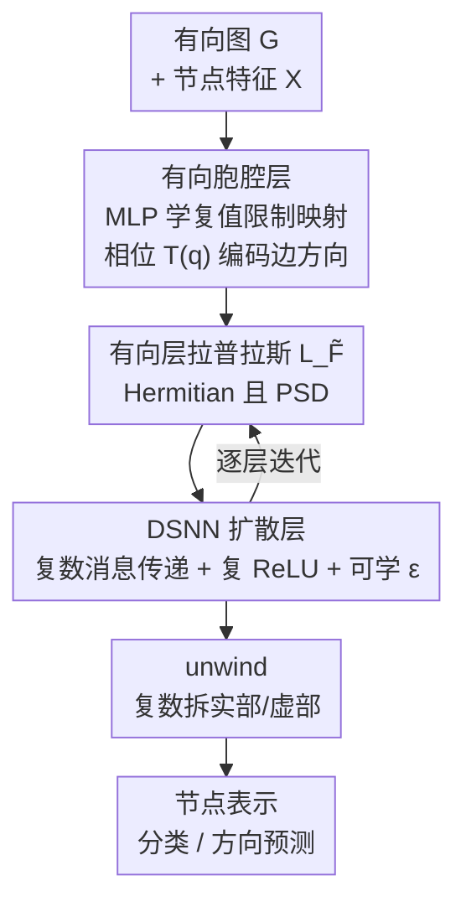

# Sheaves Reloaded: A Directional Awakening

**会议**: ICLR 2026  
**OpenReview**: [https://openreview.net/forum?id=iDiiETH7Qv](https://openreview.net/forum?id=iDiiETH7Qv)  
**代码**: https://github.com/hakanaktas0/DSNN  
**领域**: 图学习 / Sheaf 神经网络 / 有向图  
**关键词**: 胞腔层, 有向图, 层拉普拉斯, 磁拉普拉斯, 谱图神经网络

## 一句话总结
本文提出**有向胞腔层（Directed Cellular Sheaf）**，用复值、方向感知的限制映射把边的方向编码进相位，进而构造 Hermitian 的**有向层拉普拉斯 $L_{\tilde F}$**，得到第一个把方向归纳偏置嵌入架构的 Sheaf 神经网络 DSNN，在 12 个节点分类基准上 10 个取得最优。

## 研究背景与动机

**领域现状**：Sheaf 神经网络（SNN）是图神经网络（GNN）的代数拓扑推广。它在每个节点和每条边上挂一个向量空间（称为 stalk），并用线性**限制映射** $F_{u\trianglelefteq e}: F(u)\to F(e)$ 把相邻的点-边联系起来；由限制映射可导出**层拉普拉斯** $L_F=\delta^\top\delta$。相比普通 GNN，SNN 能在更高维特征空间上学习，天然缓解过平滑、并在异配图（邻居标签不同）上表现更好，是近年很有原则性的一条路线（如 NSD）。

**现有痛点**：但目前所有 SNN 都只能处理**无向图**——层拉普拉斯被构造为与边的定向无关（任意翻转一条边的符号都不改变 $L_F$）。而现实中大量图天然有向：社交网络、生物调控网络、因果/流网络，方向本身携带关键信息。GNN 这边早就证明了"显式建模方向能大幅提点"（如 DirGNN、MagNet），可 SNN 阵营完全没有对应能力。

**核心矛盾**：层拉普拉斯要服务于谱卷积，就必须是半正定（PSD）算子，才能保证实、非负的特征值、给出良定义的图傅里叶基与谱滤波器。但**纯实数的反对称矩阵**（最直接的"编码方向"方式）会产生纯虚特征值，谱滤波会发散——也就是说，"保 PSD"和"编码方向"在实数域里天生打架。

**本文目标**：在保持层拉普拉斯 PSD/Hermitian 谱性质的前提下，把边方向显式注入 SNN 的限制映射与拉普拉斯。

**切入角度**：借鉴电磁场里的**磁拉普拉斯**思路——用一个**复 Hermitian** 算子，让其**幅值**承载无向几何、**相位**承载边方向，并用参数 $q$ 调节方向分量的强度。Hermitian 矩阵恰好既能编码非对称关系、又保证实非负谱。

**核心 idea**：把方向写进限制映射的**虚部**——给尾节点的限制映射乘一个相位因子 $T^{(q)}_{uv}=\exp(i\,2\pi q\,(A-A^\top)_{uv})$，由此得到的有向层拉普拉斯既统一了经典层拉普拉斯、又统一了磁拉普拉斯/符号磁拉普拉斯。

## 方法详解

### 整体框架

DSNN 的输入是一个**有向图**及其节点特征，输出是节点表示（用于节点分类或边方向预测）。整条管线分四步：先在每条边上用 MLP 端到端学出**复值限制映射**，并把边方向通过相位因子 $T^{(q)}$ 注入尾节点的映射，构成**有向胞腔层**；由这套限制映射的余边界算子 $\tilde\delta$ 取共轭转置复合，得到 Hermitian 且 PSD 的**有向层拉普拉斯 $L_{\tilde F}$**；把它代入离散化的**有向神经层扩散**做若干层复数域消息传递（配复数版 ReLU 与可学缩放 $\epsilon$）；最后用 **unwind** 操作把复数表示拆成实部/虚部拼接、投回实数域输出。

整个方法的关键就是：**普通 SNN 的所有"实值限制映射 / 实对称拉普拉斯 / 实扩散"，在这里都被升级成复数版**，而升级的载体就是相位因子 $T^{(q)}$。

### 关键设计

**1. 有向胞腔层：把方向藏进限制映射的相位**

针对"SNN 只能处理无向图"这个根本短板，本文重新定义了 stalk 与限制映射。普通胞腔层的 stalk 是实向量空间、限制映射是实矩阵，对边的定向不可见。本文把 stalk 改成**复向量空间** $\tilde F(u),\tilde F(e)\in\mathbb{C}^d$，并引入一个参数化的 Hermitian 相位矩阵
$$T^{(q)} := \exp\!\big(i\,2\pi q\,(A-A^\top)\big),\quad q\in\mathbb{R}.$$
一条边 $e$ 的两个端点中，头节点的限制映射 $\tilde F_{u\trianglelefteq e}\in\mathbb{R}^{d\times d}$ 保持实值，而**尾节点**的限制映射被乘上相位：$\tilde F_{v\trianglelefteq e}=\tilde F^0_{v\trianglelefteq e}\,T^{(q)}_{uv}\in\mathbb{C}^{d\times d}$。直觉上，方向就被记进了"哪一端带相位、相位符号是正是负"。举例：当 $q=\tfrac14$、$e=(u,v)$ 为有向边时 $A_{uv}=1,A_{vu}=0$，于是 $T^{(q)}_{uv}=\cos(-\tfrac{\pi}{2})+i\sin(-\tfrac{\pi}{2})=-i$，尾节点映射变成 $-\tilde F^0_{v\trianglelefteq e}\,i$，虚部的符号就指示了边的朝向；若 $e$ 是无向边则 $A_{uv}=A_{vu}=1$、$T^{(q)}_{uv}=1$，限制映射退化为纯实，和经典胞腔层一致。这正是它"既能表达方向、又能向后兼容无向情形"的来源。

**2. 有向层拉普拉斯 $L_{\tilde F}$：用 Hermitian 结构同时装下拓扑与方向**

有了方向感知的限制映射，本文定义**有向余边界算子** $\tilde\delta(x)_e:=\tilde F_{u\trianglelefteq e}x_u-\tilde F_{v\trianglelefteq e}x_v$，再取共轭转置复合得到**有向层拉普拉斯** $L_{\tilde F}:=\tilde\delta^*\tilde\delta$（$*$ 为共轭转置）。展开后，作用在 0-上链 $x$ 上的 $L_{\tilde F}(x)_u$ 自然分成**入流（inflow）、出流（outflow）、无向**三项之和，把入边、出边、无向边区别对待——这正是方向偏置的体现。这个算子的核心价值在于其谱性质：本文证明 $L_{\tilde F}$ 与其归一化版本 $L_{\tilde F}^N$ 都是 **Hermitian 且半正定**（特征值实、非负、可对角化），并且 $L_{\tilde F}^N\preceq 2I$——这和无向图的经典拉普拉斯完全一致，于是可以照搬 Kipf-Welling 的一阶 Chebyshev 近似来定义良定义的谱卷积。更妙的是它的**统一性**：当图无向时 $L_{\tilde F}$ 对任意 $q$ 都退回经典层拉普拉斯 $L_F$；在平凡层（$d=1$、限制映射取 1）下它退回磁拉普拉斯 $L^{(q)}$，且 $q=\tfrac14$ 时进一步退回符号磁拉普拉斯 $L_\sigma$。本文还顺带给出了一个复值的"点-边关联矩阵"分解 $L^{(q)}=\hat B\hat B^*$，为磁/符号磁拉普拉斯的半正定性提供了比原文更简洁的证明。

**3. DSNN 扩散层：复数域的神经层扩散**

光有算子还不够，要把它变成可训练的网络。本文把 Bodnar 的神经层扩散推广到复数域：连续过程为 $\dot X(t)=-\sigma\big(L_{\tilde F}^N(t)(I_n\otimes W_1(t))X(t)W_2(t)\big)$，离散化后得到 DSNN 的卷积更新式
$$X^{(t+1)}=\mathrm{diag}(1+\varepsilon)X^{(t)}-\sigma\big(L_{\tilde F(t)}^N(I_n\otimes W_1^{(t)})X^{(t)}W_2^{(t)}\big),$$
其中 $W_1\in\mathbb{R}^{d\times d}$、$W_2\in\mathbb{R}^{f\times f}$ 是逐层权重，可学参数 $\epsilon\in[-1,1]^d$ 用来调每个 stalk 分量的相对幅度。由于全程在复数域，激活函数 $\sigma$ 采用**复扩展 ReLU**（实部 $\ge0$ 则保留、否则置零）。最后一层用 **unwind** 把复输出拆开拼接 $\mathrm{unwind}(X)=(\Re(X)\,\|\,\Im(X))\in\mathbb{R}^{n\times 2c}$ 投回实数域。代价上，复数运算只带来约 4 倍的常数因子开销，**不改变渐近复杂度**——无向情形下 DSNN 复杂度与 NSD 完全相同。

**4. 端到端可学的限制映射：让数据自己挑层结构**

同一张图可以配很多种 sheaf 结构，选对了才有意义。本文不手工指定限制映射，而是把它做成输入特征的函数：对每条边 $e=(u,v)$，$F_{u\trianglelefteq e}=\Phi(x_u\,\|\,x_v)$，其中 $\Phi$ 是一个 MLP，输出再 reshape 成 $d\times d$ 矩阵。这样限制映射随节点特征端到端学出来，配合 Diag / O(d) / General 三种块结构约束，得到 Diag-DSNN、O(d)-DSNN、Gen-DSNN 三个变体，让模型在不同图上自适应地选最合适的 sheaf。

### 损失函数 / 训练策略

节点分类与边方向预测均按标准监督交叉熵训练；$q$ 作为超参数搜索（实验中也初步尝试把 $q$ 设为可学参数）；stalk 维度取 $d\in\{2,5\}$。评测沿用 Bodnar 等的 10-split 协议，方向预测按 15%/5% 测试/验证、10 折交叉验证并保持图连通。

## 实验关键数据

### 主实验

真实数据集节点分类（12 个基准，覆盖异配到同配），DSNN 在 **10/12** 上最优；下表摘取代表性数据集（准确率 %，Questions 报 ROC AUC）：

| 数据集 | 同配度 | 最优 DSNN 变体 | NSD（无向 SNN） | 最强方向 GNN | 
|--------|--------|----------------|------------------|----------------|
| Roman-Empire | 0.05 | 92.08 (O(d)/Gen) | 83.80 | 91.23 (DirGNN) |
| Texas | 0.11 | 88.65 (Diag) | 85.95 | 79.46 (MagNet) |
| Telegram | 0.32 | 94.81 (Gen) | 92.11 | 92.81 (DirGNN) |
| Questions | 0.84 | 79.55 (Gen) | 77.36 | 76.95 (SigMaNet) |

相比无向 SNN 基线 NSD，在 Questions、Texas、Telegram、Roman-Empire 上提升尤为显著；相比方向感知 GNN（DirGNN/MagNet/SigMaNet）在 10/12 上更强。仅 Squirrel、Cora 上以微弱差距（0.22、0.79）屈居第二。

合成数据（DSBM 有向随机块模型，$C=5$ 类、特征极少只用入/出度）更能凸显方向的作用：

| 模型 | $\alpha_{ij}=0.05$ | $0.08$ | $0.10$ |
|------|------|------|------|
| Diag-DSNN | 98.34 | 97.22 | **99.14** |
| O(d)-DSNN | 97.28 | 98.42 | 98.80 |
| NSD（各变体） | ~20 | ~20 | ~20 |
| MagNet | 78.64 | 87.52 | 91.58 |
| SigMaNet | 87.44 | 96.14 | 98.60 |

DSNN 三变体接近完美（96–99%），而无向的 NSD 只有 ~20%（恰为 5 类随机猜测水平）——直接证明它对"方向"完全无感。

### 消融实验

| 配置 | 现象 | 说明 |
|------|------|------|
| DSNN（$q>0$） | 取得上表增益 | 限制映射内含方向相位 |
| DSNN 设 $q=0$ | 性能回落 | 丢掉边方向、退化为无向 sheaf |
| NSD（无向 SNN） | 合成集 ~20% | 完全无法利用方向社区结构 |

### 关键发现
- **增益确实来自"方向"而非"容量"**：把 $q$ 置 0（即在 sheaf 内丢弃方向）会让性能掉回无向水平，$q>0$ 才恢复增益；这排除了"只是网络更复杂了所以更好"的解释。
- **方向越重要、优势越大**：在 DSBM 这种社区天然带方向偏置、节点特征几乎无信息的设定下，DSNN 把对手甩开几十个点，说明方向编码在"特征贫瘠"时尤其值钱。
- **方向预测任务同样领先**：在判断 $(u,v)$ 还是 $(v,u)$ 的二分类上，DSNN 在 6/10 数据集最优，其余也是紧随其后（Cora 差 0.01，Film 差 0.18）。
- **代价可控**：复数运算只带来约 4 倍常数开销，渐近复杂度与 NSD 相同；实测小图 8–10s vs NSD 6.5–7.8s，最大图 Questions 上 107s vs 47.5s。

## 亮点与洞察
- **"幅值管几何、相位管方向"是核心巧思**：用复 Hermitian 算子把无向几何与方向解耦到模与相位两个通道，既保住谱卷积必需的实非负谱、又塞进了方向信息，绕开了实反对称矩阵"纯虚特征值导致谱滤波发散"的死结。
- **一个算子统一三条线**：$L_{\tilde F}$ 在不同特例下分别退回经典层拉普拉斯、磁拉普拉斯、符号磁拉普拉斯，把 SNN 与方向感知谱 GNN 两条独立发展的脉络收进同一框架，理论上很优雅。
- **副产品有独立价值**：复值点-边关联矩阵分解 $L^{(q)}=\hat B\hat B^*$ 给出了磁/符号磁拉普拉斯 PSD 的更短证明，可独立用于谱图理论。
- **可迁移的思路**：在任何"需要编码非对称关系又想保 PSD"的谱方法里，都可借鉴"把非对称写进相位、用 Hermitian 算子兜底"的套路，比如超图、时序图的有向推广。

## 局限与展望
- $q$ 主要作为超参搜索，虽有把它设为可学参数的初步尝试，但还不是默认配置，最优 $q$ 的选取仍依赖调参。
- 复数运算带来约 4 倍常数开销与额外显存（Questions 上 107s/更高显存），在超大规模图上的可扩展性未充分验证（部分基线已 OOM）。
- 仅在 0-cell 与 1-cell（点与边）的胞腔复形上展开，未推广到含 2-cell（面）等更高阶的有向结构；方向相位也只用了单一 $T^{(q)}$ 形式。
- 评测集中在节点分类与方向预测两类任务，更复杂的有向图任务（如流量/因果推断）尚待检验。

## 相关工作与启发
- **vs NSD（Bodnar 2022）**：NSD 是无向 SNN 的代表，用实对称层拉普拉斯做神经层扩散；本文证明 NSD 是 DSNN 在无向图下的特例，DSNN 多出的全部价值就来自方向相位，合成集 ~20% vs ~99% 是最直接的对比。
- **vs MagNet / SigMaNet（磁/符号磁拉普拉斯）**：它们用复 Hermitian 拉普拉斯给**普通 GNN** 注入方向，但 stalk 维度恒为 1、没有 sheaf 的高维表达；DSNN 证明它们是平凡有向胞腔层的特例，并把 sheaf 的高维/抗异配优势叠加上去，10/12 数据集更强。
- **vs DirGNN（Rossi 2024）**：DirGNN 是空间域方法，对入/出邻居用不同权重分别聚合；本文是谱域方法，方向通过拉普拉斯的相位统一进卷积，在异配集上更稳（DirGNN 在合成集上方差极大、不稳定）。

## 评分
- 新颖性: ⭐⭐⭐⭐⭐ 第一个把方向归纳偏置嵌入 Sheaf 神经网络，且统一了层拉普拉斯与磁/符号磁拉普拉斯。
- 实验充分度: ⭐⭐⭐⭐ 12 真实 + 合成 + 方向预测三类任务、大量基线，q=0 消融干净；但缺超大图可扩展性验证。
- 写作质量: ⭐⭐⭐⭐ 理论推导严谨、动机清晰；符号密集，对不熟悉 sheaf 的读者门槛较高。
- 价值: ⭐⭐⭐⭐⭐ 补上 SNN 在有向图上的空白，理论框架优雅且有可复用的谱工具（PSD 证明、复值关联矩阵分解）。

<!-- RELATED:START -->

## 相关论文

- [\[ICML 2026\] Polynomial Neural Sheaf Diffusion: A Spectral Filtering Approach on Cellular Sheaves](../../ICML2026/graph_learning/polynomial_neural_sheaf_diffusion_a_spectral_filtering_approach_on_cellular_shea.md)
- [\[NeurIPS 2025\] Nonlinear Laplacians: Tunable Principal Component Analysis under Directional Prior Information](../../NeurIPS2025/graph_learning/nonlinear_laplacians_tunable_principal_component_analysis_under_directional_prio.md)
- [\[ICLR 2026\] AdaSpec: Adaptive Spectrum for Enhanced Node Distinguishability](adaspec_adaptive_spectrum_for_enhanced_node_distinguishability.md)
- [\[ICLR 2026\] Cooperative Sheaf Neural Networks](cooperative_sheaf_neural_networks.md)
- [\[ICLR 2026\] Efficient Learning on Large Graphs using a Densifying Regularity Lemma](efficient_learning_on_large_graphs_using_a_densifying_regularity_lemma.md)

<!-- RELATED:END -->
